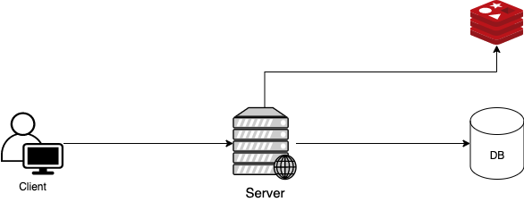
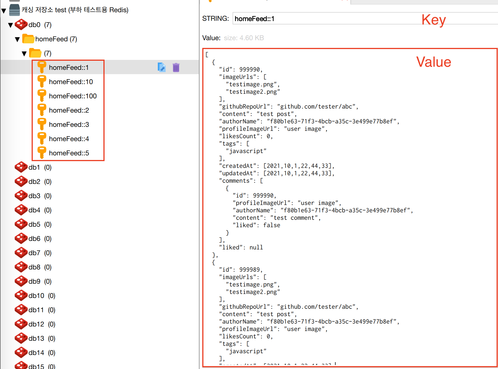

# 목차

<br>

- [목차](#목차)
- [들어가며](#들어가며)
- [캐시 전략](#캐시-전략)
  - [Cache란?](#cache란)
  - [Look Aside Cache](#look-aside-cache)
- [스프링 캐시 코어](#스프링-캐시-코어)
  - [스프링은 어떻게 캐싱을 처리하지?](#스프링은-어떻게-캐싱을-처리하지)
  - [Cache와 CacheManager](#cache와-cachemanager)
  - [결국 핵심은 두 가지다](#결국-핵심은-두-가지다)
- [프로젝트에 캐싱 구현하기](#프로젝트에-캐싱-구현하기)
  - [Redis 설정](#redis-설정)
  - [캐시 설정](#캐시-설정)
  - [캐시 적용](#캐시-적용)
  - [결과](#결과)
- [다음 편은..](#다음-편은)

<br>

# 들어가며

필자는 최근 진행중인 프로젝트에서 성능 진단을 통해 성능 개선 작업을 수행중이다.

그 과정에서 비로그인 홈피드 조회와 같이 단순하고 빈번한 동일 요청이 반복되는 요청이 많다는 것을 발견했다.

그리고 이러한 요청은 쿼리가 비교적 복잡하며, 쿼리가 많이 날라간다. 

이번 캐싱 시리즈는 이러한 요청을 캐싱 기능을 통해 해결하는 과정을 담았다.

이번 시리즈는 총 두 편으로 구성된다.

1. [Spring Boot와 Redis 기반의 캐싱 - 적용기](./spring%20boot%20cache%20with%20redis.md)
2. [Spring Boot와 Redis 기반의 캐싱 - 성능 개선](./spring%20boot%20cache%20with%20redis%20-%20성능%20개선기.md)

<br>

**이번 글은 시리즈중 첫번째인 Spring Boot와 Redis 기반의 캐싱 적용기이다.**

<br>

# 캐시 전략
이번 챕터에선 캐시란 무엇이며, 캐싱 적용에 어떤 전략을 사용했는지 서술한다.

<br>

## Cache란?
* Cache는 나중에 요청을 결과를 미리 저장해두었다가 빠르게 서비스를 해주는 것을 의미
  * ex. Factorial -> 10! = 10 * 9! (9!를 캐싱해두면 연산이 훨씬 빨라짐)
  * ex. DP
  * 운영체제도 CPU가 디스크에 접근하는 속도가 느리므로, 중간에 캐시를 많이 둬서 이를 빠르게 사용하도록 한다.
* 파레토 법칙
  * 20:80 법칙으로, 우리 사회에서 일어나는 현상의 80%는 20%의 원인으로 인하여 발생한다. (캐싱을 잘 설명해주는 유비쿼터스)
  * 즉, 전체 요청의 80%는 20%의 사용자이다. (캐싱을 사용해야 하는 이유)

<br>

## Look Aside Cache

캐시에도 다양한 전략이 존재한다.

대표적으론 Look Aside Cache와 Write Back이 존재한다.

* Look Aside Cache: 캐시 저장소에 데이터가 있으면, 캐시에서 가져오고, 없으면 메인 DB에서 값을 가져오는 대표적인 캐시 전략.
* Wrtie Back: 캐시 저장소에 특정 시간동안 데이터를 모아서, 배치 처리를 통해 메인 DB에 저장하는 전략.

현재 시도하려는 성능 개선은 쓰기 보다는 조회 성능을 개선하려고 하기 때문에,   `Look Aside Cache`가 적합하다고 판단하였다.

Look Aside Cache를 조금 더 자세히 살펴보자면 아래와 같다.

<p align="center"> </p>

* Web Server는 데이터가 존재하는지 Cache를 먼저 확인한다.
  * Cache에 데이터가 있으면 Cache에서 값을 가져온다.
  * Cache에 데이터가 없다면 DB에서 데이터를 가져와서 Cache에 저장하고 값을 가져온다.
* Write하는 방식
  * 방법1. 애플리케이션이 새로운 데이터 쓰기 혹은 업데이트할 때 캐시와 DB 모두에 같은 작업을 실행하는 방법.
  * 방법2. 애플리케이션의 모든 쓰기 작업은 DB에만 적용되고, 기존의 캐시 데이터를 무효화시키는 방법.

<br>

# 스프링 캐시 코어

이제 본격적으로 스프링과 Redis를 이용하여 캐시를 적용해보려고 한다.

이번 챕터에선 스프링 진영에선 캐시 기능을 어떻게 제공하는지 살펴본다.

<br>

## 스프링은 어떻게 캐싱을 처리하지?

<br>

핵심을 말하자면, 스프링은 캐싱을 적용하는 코드를 추상화하여 자바 메서드에 적용시킬 수 있도록 하였다.

예를 들어, MySQL과 같은 DB로부터 조회 쿼리를 실행하는 애플리케이션 메서드가 존재한다고 가정해보자.

그럼 해당 메서드에 **캐싱 애노테이션을 붙이면 AOP를 통해, 캐시 처리를 하는 것이다.**

**이때 만약 캐시 DB (ex. Redis)에 조회하고자하는 데이터가 있다면 해당 타겟 메서드의 로직 (실제 DB에 조회 쿼리)은 실행되지 않는다.**

**캐시해둔 결과를 Proxy에서 반환하기 때문이다.**

물론, **캐시 DB에 조회하고자하는 데이터가 없다면, 실제 DB에 조회 쿼리를 날려 데이터가 가져와서 캐시 DB에 저장후 데이터를 반환한다.**

> 위와 같이 스프링 캐시 코어는 `Look aside Cache`을 디폴트로 지원한다.

<br>

정말 편한 것은 캐싱 애노테이션만 붙이면 위와 같이 캐싱 전략은 AOP를 통해 자동으로 적용된다는 것이다.

개발자는 그저 핵심 로직 (실제 DB로부터 데이터 조회)만을 작성하면 된다.

<br>

물론 캐싱 DB의 데이터를 실제 DB와 동기화시키기 위한 기능도 제공한다.

즉, **캐싱 DB에 저장되는 데이터를 업데이트하거나 삭제하는 기능도 제공한다.**

이는 데이터의 변경이 발생했을 때 굉장히 유용하게 사용되며, 이 또한 애노테이션을 붙이면 쉽게 적용시킬 수 있다.

<br>

쉽게 얘기해서 `get-if-not-found-then-proceed-and-put-eventually code blocks`라고 이해하면 쉽다.

> 스프링은 프레임워크답게 개발자들이 핵심 로직만 작성하면 쉽게 부가적인 기능 (ex. 트랜잭션, 캐싱)등을 적용시킬 수 있도록 추상화시켜두었다.
> 
> 다시 한번, 스프링을 사용하면서 관심사의 분리, 객체지향 원칙에 대한 이해를 높일 수 있었다.

<br>

## Cache와 CacheManager
> 스프링이 캐싱 기능을 잘 추상화시켰고, **그저 `@EnableCaching`이라는 애노테이션을 선언만해주면, 캐시 관련된 애노테이션을 스캔하여 캐싱 로직을 수행한다.**

<br>

사실 **가장 중요한 것은 캐시 데이터를 어디에 저장하느냐이다.**

다시 말해, **스프링은 캐시 관련된 로직을 제공하지만, 캐시 데이터를 어디에 저장할지는 개발자가 지정해줘야한다.**

그리고 이 부분을 스프링은 아래 두 가지 인터페이스를 이용해 추상화해두었다.

* `org.springframework.cache.Cache`: 캐시 데이터에 대한 생명주기를 관리하는 객체.
* `org.springframework.cache.CacheManager`: 캐시를 관리해주는 매니저. `Cache` 객체를 관리한다.

> 더 자세한 아키텍처 부분은 [여기](https://programming.vip/docs/detailed-tutorial-on-redis-caching-in-the-springboot-series.html)를 참고하자.

<br>

스프링은 아래와 같은 캐시 DB의 대한 구현체를 제공한다.
* ConcurrentMapCacheManager: Java의ConcurrentHashMap을 사용해 구현한 캐시를 사용하는 캐시매니저
* SimpleCacheManager: 기본적으로 제공하는 캐시가 없어 사용할 캐시를 직접 등록하여 사용하기 위한 캐시매니저
* EhCacheCacheManager: 자바에서 유명한 캐시 프레임워크 중 하나인 EhCache를 지원하는 캐시 매니저
* CompositeCacheManager: 1개 이상의 캐시 매니저를 사용하도록 지원해주는 혼합 캐시 매니저
* CaffeineCacheManager: Java 8로 Guava 캐시를 재작성한 Caffeine 캐시를 사용하는 캐시 매니저
* JCacheCacheManager: JSR-107 기반의 캐시를 사용하는 캐시 매니저
* RedisCacheManager: 캐시 저장소로 유명한 Redis를 지원하는 캐시 매니저.

프로젝트에는 Redis 환경이 구축되어 있으므로, `RedisCacheManager`를 이용하여 구현하였다.

<br>

## 결국 핵심은 두 가지다
스프링에서 캐싱처리를 적용시키기위해 신경써야할 부분은 사실 딱 두가지이다.

* Caching declaration: Identify the methods that need to be cached and their policy.
  * 애노테이션을 통해 어떤 메서드가 캐싱이 필요한지, 또한 애노테이션을 통해 어떤 정책을 사용할지 설정해주면된다.
* Cache Configuration: The backing cache where the data is stored and from which it is read.
  * 캐시한 데이터를 어디에 저장하고 읽어올지 설정해주면 된다.

<br>

# 프로젝트에 캐싱 구현하기

이제 캐시의 개념과 전력, 그리고 스프링에서 어떻게 캐싱을 구현하려는지 알았으니 프로젝트에 적용시킨 과정을 소개한다.

<br>

## Redis 설정

> 일반적인 스프링에서의 Redis 설정이다.

> RedisConfiguration.java
```java
@EnableRedisRepositories
@Configuration
public class RedisConfiguration {

    private final String host;
    private final String password;
    private final int port;

    public RedisConfiguration(
        @Value("${security.redis.host}") String host,
        @Value("${security.redis.password}") String password,
        @Value("${security.redis.port}") int port
    ) {
        this.host = host;
        this.password = password;
        this.port = port;
    }

    @Bean
    @ConditionalOnMissingBean(RedisConnectionFactory.class)
    public RedisConnectionFactory redisConnectionFactory() {
        RedisStandaloneConfiguration configuration =
            new RedisStandaloneConfiguration(host, port);
        configuration.setPassword(password);
        return new LettuceConnectionFactory(configuration);
    }

    @Bean
    public RedisTemplate<?, ?> redisTemplate() {
        RedisTemplate<byte[], byte[]> redisTemplate = new RedisTemplate<>();
        redisTemplate.setConnectionFactory(redisConnectionFactory());
        return redisTemplate;
    }
}
```

<br>

## 캐시 설정

> RedisCacheConfiguration.java

```java
@EnableCaching
@Configuration
@Profile("!test")
public class RedisCachingConfiguration {

    private final RedisConnectionFactory redisConnectionFactory;
    private final ObjectMapper objectMapper;

    public RedisCachingConfiguration(
        RedisConnectionFactory redisConnectionFactory,
        ObjectMapper objectMapper
    ) {
        this.redisConnectionFactory = redisConnectionFactory;
        this.objectMapper = objectMapper;
    }

    public CacheManager redisCacheManager() {
        CollectionType collectionType = objectMapper.getTypeFactory()
            .constructCollectionType(ArrayList.class, PostResponseDto.class);

        RedisCacheConfiguration redisCachingConfiguration = RedisCacheConfiguration
            .defaultCacheConfig()
            .serializeKeysWith(
                RedisSerializationContext.SerializationPair.fromSerializer(
                    new StringRedisSerializer()
                )
            )
            .serializeValuesWith(
                RedisSerializationContext.SerializationPair.fromSerializer(
                    new Jackson2JsonRedisSerializer<>(
                        collectionType
                    )
                )
            )
            .entryTtl(Duration.ofMinutes(30));

        return RedisCacheManager
            .RedisCacheManagerBuilder
            .fromConnectionFactory(redisConnectionFactory)
            .cacheDefaults(redisCachingConfiguration)
            .build();
    }
}
```

* `RedisConnectionFactory` : 캐시 데이터 저장소로 Redis를 결정하였으므로, Redis 서버에 접속하기 위한 ConnectionFactory가 필요하다.
  * `RedisConnectionFactory`와 관련된 더 자세한 내용은 [여기](https://github.com/binghe819/TIL/blob/master/Spring/Redis/spring%EC%9C%BC%EB%A1%9C%20redis%EB%A5%BC%20%EC%82%AC%EC%9A%A9%ED%95%98%EA%B8%B0%20%EC%A0%84%EC%97%90%20%EB%B3%B4%EB%A9%B4%20%EC%A2%8B%EC%9D%80%20%ED%81%B0%20%EA%B7%B8%EB%A6%BC/spring%EC%9C%BC%EB%A1%9C%20redis%EB%A5%BC%20%EC%82%AC%EC%9A%A9%ED%95%98%EA%B8%B0%20%EC%A0%84%EC%97%90%20%EB%B3%B4%EB%A9%B4%20%EC%A2%8B%EC%9D%80%20%ED%81%B0%20%EA%B7%B8%EB%A6%BC.md#redistemplate-%EC%98%88%EC%8B%9C)를 참고하면 된다.
* `CacheManager` : 어떤 Cache 저장소에 데이터를 저장할지 설정해주는 객체.

<br>

생각보다 별거 없다. 하지만.. 위 설정에서 삽질한 부분이 존재한다.

Redis는 보통 외부에 저장소를 따로 위치해 사용하며, 네트워크 통신을 위해 byte array (바이트 배열)로 변환해야 한다. (OuputStream으로 내보내기 위함인 듯 하다.)

또한, WAS 관점에서 Redis에 저장된 데이터도 단지 byte일 뿐이다. 그러기 때문에 불러올 때도 바이트 배열을 객체로 변환해줘야한다.

쉽게 말해, 객체와 JSON 간의 직렬화/역직렬화 설정을 해주어야한다.

<br>

비로그인 홈피드 조회의 경우, Response DTO가 생각보다 복잡하여 이를 처리하는데 삽집을 했다.

1. 날짜 형식 직렬화/역직렬화
   * 문제: Spring Cache에 호환되는 `Jackson2Json`의 경우 `LocalDateTime`을 직렬화/역직렬화하지 못하는 이슈가 발생했다.
   * 해결: 여러가지 방법을 찾아 보았고, `@JsonSerialize`를 사용하여 해결하였다.
2. 내부 DTO와 리스트를 직렬화할 때 참조값을 직렬화하는 문제
   * 문제: 아무 설정해주지 않고 Response DTO를 직렬화하면, DTO안의 값이 아닌 참조 값이 직렬화되는 문제
   * 해결: `Jackson2Json`에서 제공하는 `CollectionType`를 커스텀하여 설정.

<br>

## 캐시 적용

캐시 적용은 어렵지 않다. 그저 캐시를 적용하고 싶은 메서드에 상황에 맞는 애노테이션을 붙여주면 된다.

- @Cacheable: Triggers cache population.
- @CacheEvict: Triggers cache eviction.
- @CachePut: Updates the cache without interfering with the method execution.
- @Caching: Regroups multiple cache operations to be applied on a method.
- @CacheConfig: Shares some common cache-related settings at class-level.

> 학습 테스트를 통해 정리한 글은 [여기](https://github.com/binghe819/TIL/blob/master/Spring/Cache/spring%20boot%20cache%20core/spring%20boot%20cache%20core.md#%EC%95%A0%EB%85%B8%ED%85%8C%EC%9D%B4%EC%85%98)를 참고하면 된다.

<br>

이제 본격적으로 프로젝트에 적용해본다.

우선 조회 캐싱 처리다.

> PostFeedService

```java
@Cacheable(
  key = "#homeFeedRequestDto.page",
  value = "homeFeed",
  condition = "#homeFeedRequestDto.guest == true",
  unless = "#result == null || #result.empty"
)
public List<PostResponseDto> homeFeed(HomeFeedRequestDto homeFeedRequestDto) {
  Pageable pageable = getPagination(homeFeedRequestDto);
  if (homeFeedRequestDto.isGuest()) {
    return PostDtoAssembler.assembleFrom(null,  postRepository.findAllPosts(pageable));
  }
  User requestUser = findUserByName(homeFeedRequestDto.getRequestUserName());
  List<Post> result = postRepository.findAllAssociatedPostsByUser(requestUser, pageable);
  return PostDtoAssembler.assembleFrom(requestUser, result);
}
```

* `@Cacheable`: 조회 캐시 설정 애노테이션
  * key: 저장소에 저장될 때의 key. (프로젝트에는 page 번호를 사용했다.)
  * value: 저장소에 저장될 때의 그룹 명. (프로젝트에는 homeFeed로 설정했다.)
  * condition: SpEL을 사용하여 캐싱 조건 설정. (프로젝트에는 게스트일 때만 설정했다.)
  * unless: DB로부터 받아온 값에 따라 캐싱 조건 설정. (프로젝트에는 DB에서 받은 값이 없으면 캐시되지 않도록 설정했다.)

<br>

다음은 게시물 업데이트 혹은 삭제시 캐시 저장소를 초기화하는 처리다.

> PostService

```java
 @CacheEvict(
   value = "homeFeed",
   allEntries = true
 )
@Transactional
public PostImageUrlResponseDto write(PostRequestDto postRequestDto) {
  Post post = createPost(postRequestDto);
  Post savedPost = postRepository.save(post);

  return PostImageUrlResponseDto.builder()
    .id(savedPost.getId())
    .imageUrls(savedPost.getImageUrls())
    .build();
}
```

* `@CacheEvict`: 캐시 저장소에 저장된 데이터를 지우는 애노테이션
  * value: 저장소에 저장될 때의 그룹 명. (프로젝트에는 homeFeed로 설정했다.)
  * allEntries: true 설정시 저장소에 저장된 특정 그룹의 데이터 삭제

<br>

이제 테스트를 작성해본다. 테스트를 하기 위해선 [쿼리 카운팅](https://tech.pick-git.com/query-counter/)이 구현되어 있어야 한다.

> PostFeedCacheIntegrationTest.java

```java
@DisplayName("캐싱 - 비로그인 홈피드 조회시 두 번째 조회부터는 캐시 저장소에서 가져온다. (현재 페이지당 쿼리는 6번)")
@Test
void readHomeFeed_Guest_LatestPosts() {
  // given
  createMockPosts();
  HomeFeedRequestDto homeFeedRequestDto = createMockGuestHomeFeedRequest();
  entityManager.clear();

  // when
  queryCounter.startCount(); // 카운트 시작
  postFeedService.homeFeed(homeFeedRequestDto); // 첫번째 조회 (이때 캐싱)

  List<PostResponseDto> postResponseDtos = postFeedService.homeFeed(homeFeedRequestDto); // 두번째 조회 (캐싱 저장소에서 데이터 가져옴.)

  // then
  assertThat(postResponseDtos)
    .extracting("authorName", "githubRepoUrl", "liked")
    .containsExactly(
    tuple("dani", "java-racingcar", null),
    tuple("ginger", "jwp-chess", null)
  );
  assertThat(queryCounter.getCount().getValue()).isEqualTo(6L);
}
```

동일한 조회를 두 번 보내서 메인 DB에 쿼리가 얼마나 날라갔는지 확인하는 방식으로 테스트를 진행하였다.

> 업데이트 혹은 삭제 시 초기화되는 테스트는 [PR](https://github.com/woowacourse-teams/2021-pick-git/pull/556)을 확인!
>
> 글이 너무 길어져 생략.

<br>

## 결과

캐시 저장소에 저장되는 형식은 `key : value = page 번호 : 해당 page홈피드 조회 결과`다.

<p align="center"></p>

<br>

# 다음 편은..

다음 편은 캐싱을 적용시켜 어느정도에 성능 개션이 있었으며, 

왜 캐싱을 사용하는 것이 성능 개선에 도움이 되는지 다룬다!

To be Continue...

