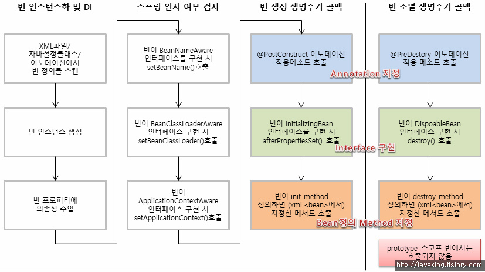
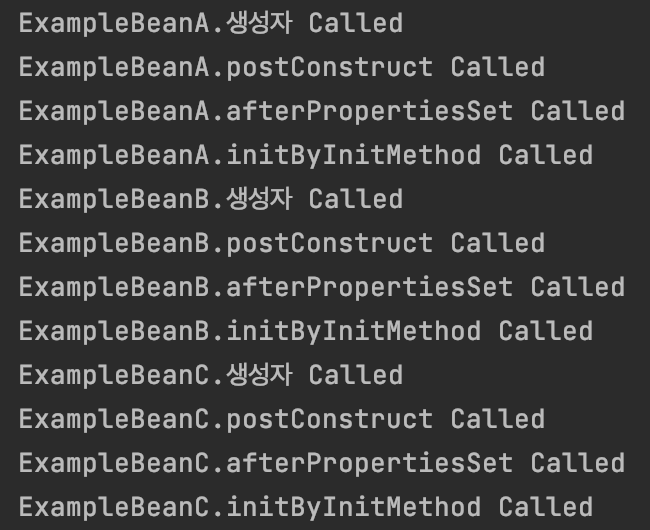
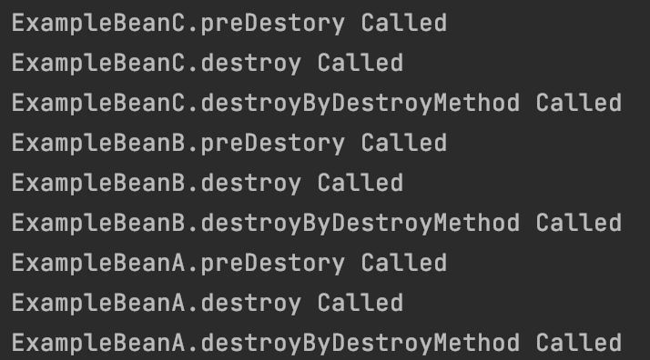
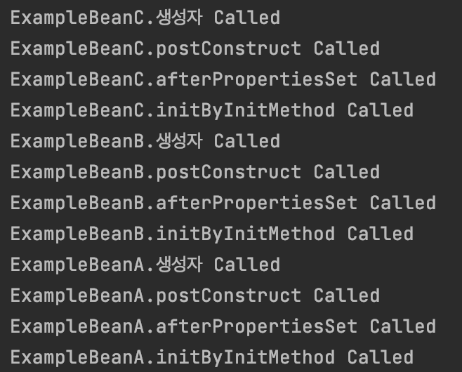
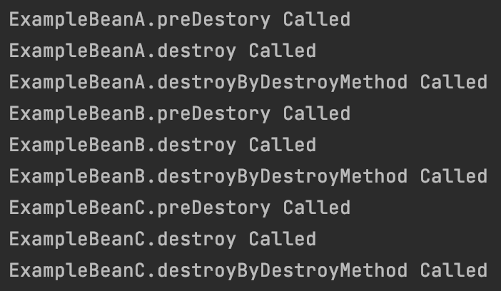

# 목차

<br>

- [목차](#목차)
- [들어가며](#들어가며)
- [빈 생명주기](#빈-생명주기)
- [빈 생명주기 콜백 메서드](#빈-생명주기-콜백-메서드)
  - [초기화 콜백](#초기화-콜백)
    - [@PostConstruct](#postconstruct)
    - [InitializingBean](#initializingbean)
    - [@Bean(initMethod)](#beaninitmethod)
  - [소멸 콜백](#소멸-콜백)
    - [@PreDestroy](#predestroy)
    - [DisposableBean](#disposablebean)
    - [@Bean(destroyMethod)](#beandestroymethod)
  - [생성 및 소멸 호출 순서](#생성-및-소멸-호출-순서)
  - [사용 예시](#사용-예시)
- [의존관계에 따른 생명주기의 변화](#의존관계에-따른-생명주기의-변화)
  - [의존관계가 없는 경우](#의존관계가-없는-경우)
  - [의존관계가 있는 경우](#의존관계가-있는-경우)
- [마치며](#마치며)
- [참고](#참고)

<br>

# 들어가며
일반적으로 특정 개체에 대한 생명주기란 언제/어떻게 생성되며, 살아있는(?)동안 행동하며, 언제/어떻게 소멸되는지를 의미한다.

빈 생명주기도 이와 동일하다. 

**빈 생명주기란 빈이 인스턴스화되는 시기와 방법, 생성되고 소멸되기 까지의 수행하는 작업, 소멸되는 시기 및 방법을 의미한다.**

이번 글은 빈 생명주기에 대해서 다뤄보고자 한다.

우선 빈 생명주기에 대한 큰 그림을 그려본다. 그리고 빈이 생성되거나 소멸될 때 호출되는 콜백 메서드에 대해서 알아본다.

마지막으로 의존관계에 따른 생명주기의 변화에 대해서 알아본다.

<br>

# 빈 생명주기
우선 빈 생명주기의 큰 그림을 그려본다.

<p align="center"><br>출처: http://javaking.tistory.com </p>

1. 빈 인스턴스화 및 의존성 주입
2. 스프링 `*Aware` 동작에 대한 검사 및 호출 (특정 빈이 자신을 생성하고 관리하는 ApplicationContext에 접근할 때 사용)
3. 빈 생성 콜백 메서드 호출
4. 빈 소멸 콜백 메서드 호출

**중요한 점은 빈 객체가 생성되어 의존성이 모두 주입되고 나서, 콜백 메서드들이 실행된다는 것.**

그리고 콜백 메서드는 생성과 소멸 모두 3가지씩 제공한다.

<br>

> 위 그림이 이해안되도 아래 글을 읽고나면 이해가 될 것이다.
> 
> 먼저 아래 글을 읽고 마지막에 위 그림을 이해하는 것도 좋다.

<br>

# 빈 생명주기 콜백 메서드
스프링은 빈이 생성되고 소멸되는 시점에 특정 로직(코드)을 실행하는 기능을 제공한다.

즉, 빈을 정의할 때 빈이 생성되고 소멸되는 시점에 **어떠한 로직을 실행할지 콜백 메서드**를 정의해줄 수 있다.

빈의 **생성과 소멸 시점에 각각 3가지의 방법**으로 특정 로직을 실행할 수 있다.

<br>

## 초기화 콜백
우선 빈의 생성시 초기화 콜백 방법에 대해서 알아본다.

여기서 말하는 초기화 콜백은 모두 스프링 빈이 생성되고 의존성 주입(DI)까지 완료된 후에 실행되는 초기화 콜백 메서드들이다.

<br>

### @PostConstruct
가장 사용 방법이 간단한 애노테이션 형식의 빈 초기화 콜백 방법이다.

초기화에 사용할 메서드 선언부 위에 `@PostConstruct`만 붙여주면 된다.

또한, 자바 스펙 요구서 (JSR) 250에 명시되어 있는 스펙이기에 스프링 프레임워크에 의존적이지 않다.

```java
@Component
public class ExampleBean {

    @PostConstruct
    public void postConstruct() {
        // ... 콜백 로직
        System.out.println("ExampleBean.postConstuct Called!");
    }
}
```

JSR-250에 명시된 스펙을 스프링은 2.5부터 소개된 `CommonAnnotationBeanPostProcessor`를 통해 처리하고 있다.

`CommonAnnotationBeanPostProcessor`는 `@Resource`뿐 아니라, `javax.annotaion.PostConstruct`와 `javax.annotaion.PreDestroy`를 읽어 빈 생명주기 콜백 메커니즘을 구현한다.

그러므로, 위 두 가지 빈 생명주기 콜백 방법을 사용하고 싶으면, `CommonAnnotationBeanPostProcessor`가 꼭 IoC 컨테이너에 빈으로 등록되어 있어야 한다.

> 현재 `@PostDestroy`와 `PreDestory`는 빈 생명주기 콜백 메서드 방식중 베스트 프렉티스로 불린다고 한다.
> 
> 그 이유는 스프링에 의존적인 방식이 아니기 때문이다.

<br>

### InitializingBean
`org.springframework.beans.factory.InitializingBean` 인터페이스를 구현하여 콜백 메서드를 실행시키는 방식이다.

```java
@Component
public class ExampleBean implements InitializingBean {

    @Override
    public void afterPropertiesSet() throws Exception {
        // ... 콜백 로직
        System.out.println("ExampleBean.afterPropertiesSet Called");
    }
}
```

이는 스프링에서 구현했으며, 스프링에 종속적인 생명주기 콜백 방식이다.

즉, IoC 컨테이너 외부에서는 재사용 할 수 없다.

> 실제로 스프링 공식문서에서도 스프링에 종속적인 방법이기에 추천하지 않는다.

<br>

### @Bean(initMethod)
`@Bean`으로 등록되는 빈에 사용할 수 있는 생명주기 콜백 방식이다.

```java
@Configuration
public class ExampleConfiguration() {

    @Bean(initMethod = "initByInitMethod")
    public ExampleBean exampleBean() {
        return new ExampleBean();
    }
}

public class ExampleBean implements InitializingBean {

    public void initByInitMethod() {
        // ... 콜백 로직 
        System.out.println("ExampleBean.initByInitMethod Called");
    }
}
```
빈을 등록할 때 `initMethod`설정안에 콜백 메서드 명을 넣어주면 된다.

> 추측으론 빈으로 등록하는 과정에서 리플렉션으로 메서드 이름을 통해 메서드를 찾아 실행하는 듯 하다.

<br>

## 소멸 콜백
생성시 초기화 콜백 방법이 있다면, 당연히 소멸 콜백 방법도 존재한다.

소멸 콜백은 빈이 소멸되는 시점에, 특정 로직을 수행하는 것을 의미한다.

다시 말해, **애플리케이션 컨텍스트가 닫힐 때, 각각의 빈이 호출할 메서드를 정의해줄 수 있다.**

초기화 콜백과 동일하게 3가지 방식이 존재한다.

> 빈의 scope가 prototype이면 소멸 콜백 처리가 불가능하다.

<br>

### @PreDestroy
[@PostConstruct]()의 반대 개념이며, 소멸시 실행된다는 점 빼고는 동일하게 동작한다.

```java
@Component
public class ExampleBean {
    @PreDestroy
    public void preDestroy() {
        // ... 콜백 로직
        System.out.println("ExampleBean.preDestory Called");
    }
}
```

이 방식 또한, JSR-250에 정의된 스펙이며, 스프링에 종속적이지 않다.

<br>

### DisposableBean
`org.springframework.beans.factory.DisposableBean`인터페이스를 구현하여 콜백 메서드를 실행시키는 방법이다.

```java
@Component
public class ExampleBean {
    @Override
    public void destroy() throws Exception {
        // ... 콜백 로직
        System.out.println("ExampleBean.destroy Called");
    }
}
```
이 방식 또한 [@InitializingBean]()와 동일하게 스프링에 종속적인 방법이므로 추천하지 않는다.

<br>

### @Bean(destroyMethod)
`@Bean`으로 등록되는 빈에 사용할 수 있는 생명주기 콜백 방식이다.

```java
@Configuration
public class ExampleConfiguration() {
    @Bean(destroyMethod = "destroyByDestroyMethod")
    public ExampleBean exampleBean() {
        return new ExampleBean();
    }
}

public class ExampleBean {
    public void destroyByDestroyMethod() {
        System.out.println("ExampleBean.destroyByDestroyMethod Called");
    }
}
```

<br>

## 생성 및 소멸 호출 순서
빈 생명주기의 콜백 메서드는 생성과 소멸 모두 각각 3가지 존재한다.

각각의 방법이 어떤 순서로 호출 되는지 알아보기 위해 간단한 테스트를 작성했다.

```java
@SpringBootApplication
public class ExampleApplication {

    @Bean(initMethod = "initByInitMethod", destroyMethod = "destroyByDestroyMethod")
    public ExampleBean exampleBean() {
        return new ExampleBean();
    }

    public static void main(String[] args) {
        SpringApplication.run(ExampleApplication.class, args);
    }
}

public class ExampleBean implements InitializingBean, DisposableBean {

    @PostConstruct
    public void postConstruct() {
        System.out.println("ExampleBean.postConstruct Called");
    }

    @Override
    public void afterPropertiesSet() throws Exception {
        System.out.println("ExampleBean.afterPropertiesSet Called");
    }

    public void initByInitMethod() {
        System.out.println("ExampleBean.initByInitMethod Called");
    }

    @PreDestroy
    public void preDestroy() {
        System.out.println("ExampleBean.preDestory Called");
    }

    @Override
    public void destroy() throws Exception {
        System.out.println("ExampleBean.destroy Called");
    }

    public void destroyByDestroyMethod() {
        System.out.println("ExampleBean.destroyByDestroyMethod Called");
    }
}
```

실행 결과에 따른 호출 순서는 다음과 같다.

```bash
ExampleBean.postConstruct Called
ExampleBean.afterPropertiesSet Called
ExampleBean.initByInitMethod Called

ExampleBean.preDestory Called
ExampleBean.destroy Called
ExampleBean.destroyByDestroyMethod Called
```

생성과 소멸 모두 다음과 같은 순서로 동작한다.

1. 애노테이션 (`PostConstruct`, `PreDestroy`)
2. 인터페아스 (`InitializingBean`, `DespoableBean`)
3. 빈 정의 (`initMethod`, `destroyMethod`)

<br>

## 사용 예시

<br>

# 의존관계에 따른 생명주기의 변화
스프링 빈은 보통 혼자보다는 여러 빈들과 협력하는 관계를 가진다.

이번 챕터에선 의존관계가 있을 때와 없을 때의 빈 생명주기가 어떻게 동작하는지 알아본다.

<br>

## 의존관계가 없는 경우
테스트를 위해 의존관계가 없는 빈 객체 3개 정도를 구현해준다.

```java
public class ExampleBeanX implements InitializingBean, DisposableBean {

    public ExampleBeanX() {
        System.out.println("ExampleBeanX.생성자 Called");
    }

    @PostConstruct
    public void postConstruct() {
        System.out.println("ExampleBeanX.postConstruct Called");
    }

    @Override
    public void afterPropertiesSet() throws Exception {
        System.out.println("ExampleBeanX.afterPropertiesSet Called");
    }

    public void initByInitMethod() {
        System.out.println("ExampleBeanX.initByInitMethod Called");
    }

    @PreDestroy
    public void preDestroy() {
        System.out.println("ExampleBeanX.preDestory Called");
    }

    @Override
    public void destroy() throws Exception {
        System.out.println("ExampleBeanX.destroy Called");
    }

    public void destroyByDestroyMethod() {
        System.out.println("ExampleBeanX.destroyByDestroyMethod Called");
    }
}
```
`X`를 `A`, `B`, `C`로해서 테스트 빈 세 개를 만들어준다.

> 세 개의 코드는 중복되기에 그냥 X라고 하고 코드를 올렸다.

<br>

<p align="center"> </p>

각 빈의 생성자가 먼저 실행되고, init 콜백 메서드들이 실행된다.

> 빈 객체 생성 -> 생성자 실행 -> init 콜백 메서드 실행

<br>

<p align="center"> </p>

소멸은 위에서도 말했듯이 위와 같이 실행된다.

중요한 점은 각각의 빈들이 차례대로 소멸된다는 것이다.

<br>

## 의존관계가 있는 경우
위에서 만든 3개의 예시 빈(A, B, C)에서 A가 B, C 모두를 의존하고, B가 C에 의존하도록하여 테스트를 진행해본다. (A -> B, A -> C, B -> C)

```java
public class ExampleBeanA implements InitializingBean, DisposableBean {
    
    private final ExampleBeanB exampleBeanB;

    private final ExampleBeanC exampleBeanC;

    public ExampleBeanA(ExampleBeanB exampleBeanB, ExampleBeanC exampleBeanC) {
        System.out.println("ExampleBeanA.생성자 Called");
        this.exampleBeanB = exampleBeanB;
        this.exampleBeanC = exampleBeanC;
    }

    // ... init 메서드들
}

public class ExampleBeanB implements InitializingBean, DisposableBean { 

    private final ExampleBeanC exampleBeanC;

    public ExampleBeanB(ExampleBeanC exampleBeanC) {
        this.exampleBeanC = exampleBeanC;
        System.out.println("ExampleBeanB.생성자 Called");
    }

    // ... init 메서드들
}
```

<br>

실행 결과는 아래와 같다.

<p align="center"> </p>

생성자를 통한 주입을 하였으며, 다른 Bean이 의존하고 있는 Bean이 먼저 생성되고 초기화되는 것을 볼 수 있다.

즉, **A와 B가 C를 의존하고, A가 B를 의존하므로, C -> B -> A순으로 생성되는 것을 볼 수 있다.**

<br>

<p align="center"> </p>

**소멸은 Bean 객체들이 초기화 된 순서의 역순으로 소멸된다. A -> B -> C 순으로 소멸**

<br>

# 마치며
빈 생명주기에 대한 면접 질문을 받았을 때 아무것도 몰라서 이번 글을 정리하게 되었다.

그래도 스프링 공식 문서에 잘 나와있어서 비교적 쉽게 이해하고 정리할 수 있었다.

**빈의 생명주기를 정리하면 다음과 같다.**

1. 빈 인스턴스화 및 의존성 주입
2. 스프링 `*Aware` 동작에 대한 검사 및 호출 (특정 빈이 자신을 생성하고 관리하는 ApplicationContext에 접근할 때 사용)
3. 빈 생성 콜백 메서드 호출
   1. `@PostConstruct`
   2. `InitializingBean`
   3. `initMethod`
4. 빈 소멸 콜백 메서드 호출
   1. `@PreDestroy`
   2. `DesposableBean`
   3. `destroyMethod`

<br>

# 참고
* [Spring docs](https://docs.spring.io/spring-framework/docs/current/reference/html/core.html)

