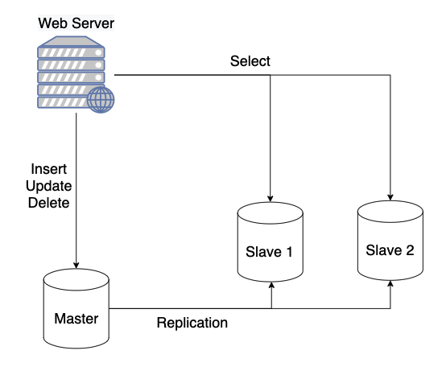
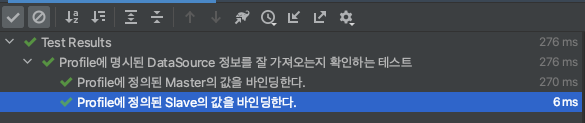
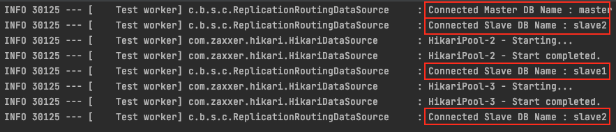

# 목차

<br>

- [목차](#목차)
- [들어가며](#들어가며)
- [구현해야되는 부분이 정확히 무엇인가?](#구현해야되는-부분이-정확히-무엇인가)
- [1 - Profile 정의 및 객체로 바인딩](#1---profile-정의-및-객체로-바인딩)
  - [기존의 SpringBoot 자동 설정](#기존의-springboot-자동-설정)
  - [여러 DataSource 정의 및 바인딩](#여러-datasource-정의-및-바인딩)
- [2 - 조회 쿼리시 Slave DataSource를 Round Robin방식으로 선택하는 기능](#2---조회-쿼리시-slave-datasource를-round-robin방식으로-선택하는-기능)
  - [AbstractRoutingDataSource](#abstractroutingdatasource)
  - [Round Robin방식으로 DataSource 선택 기능 구현](#round-robin방식으로-datasource-선택-기능-구현)
- [3 - DataSource, JPA등 Configuration 정의](#3---datasource-jpa등-configuration-정의)
- [4 - 테스트 코드 작성](#4---테스트-코드-작성)
  - [테스트 환경](#테스트-환경)
  - [테스트 코드 작성 및 실행](#테스트-코드-작성-및-실행)
- [여러가지 이슈](#여러가지-이슈)
  - [DB 권한 부여](#db-권한-부여)
  - [JPA 네이밍 전략](#jpa-네이밍-전략)
- [마치며](#마치며)
- [참고](#참고)

<br>

# 들어가며
> 우선 이번 글은 [Replication - MySQL](https://github.com/binghe819/TIL/blob/master/DB/MySQL/Replication/MySQL%20Replication.md)을 의존하고 있다.
> 
> 이번 글에서 나오는 모든 코드나 설정들은 위 Replication이 잘 설정되어 있어야지 제대로 동작하게 된다.

이전에도 말했듯이 DB 요청의 대부분은 읽기 작업이 차지하기 때문에 조회시 DB를 분산처리하면 전체적인 성능을 높일 수 있다.

이전 글에선 Replication의 개념과 MySQL에서 Replication을 설정하는 방법을 다뤘다.

이번 글에선 아마 많은 분들이 사용하시는 Spring Boot와 JPA 기반의 Replication을 구현해보려고 한다.

그럼 Start!

> 빠르게 예시 코드만 보고 싶으신 분은 [여기](https://github.com/binghe819/spring-boot-learning-sandbox/tree/master/spring-boot-db-replication)를 참고해주세요.

<br>

# 구현해야되는 부분이 정확히 무엇인가?
우선 Spring + JPA기반으로 무엇을 구현해야하는지 큰 그림을 알아야 쉽게 이해할 수 있기 때문에 시작하기에 앞서 큰 그림을 그려본다.

아래는 일반적인 Replication 구조이다.

<p align="center"> </p>

Replication은 여러 개의 DB를 수직적인 구조(Master - Slave)로 구축하는 방식이다.

* Master DB에선 쓰기 작업만 수행 (Insert, Update, Delete)
* Slave DB에선 읽기 작업만 수행 (Select)

[이전 글](https://github.com/binghe819/TIL/blob/master/DB/MySQL/Replication/MySQL%20Replication.md)에서도 말했듯이, Master 서버와 Slave에 Replication 설정을 해두면 Master의 변경사항이 자동적으로 Slave 서버들에 적용된다.

즉, Master DB에 Data를 넣거나 수정하거나 삭제하면, 하나 혹은 여러 개의 Slave DB에 동기화가 되는 방식이다. (BinLog 활용)

<br>

🤔 **그렇다면 Spring + JPA기반으로 구현해줘야 하는 것은 무엇일까?**

바로 **WAS에서 조회시 Slave DB로 Connection을 맺고, 쓰기 작업시엔 Master DB에 Connection을 맺도록 해주는 것이다.**

다시 말해, **WAS (Spring Boot + JPA) DB 연결 및 Slave DB 선택 알고리즘 구현**이 핵심이다.

<br>

💁‍♂️ 구현하는 순서는 다음과 같다.

1. Profile 정의 및 객체로 바인딩
   * Profile에 정의된 Master와 Slave의 정보를 객체에 바인딩.
2. 조회 쿼리시 Slave DataSource를 Round Robin방식으로 선택하는 기능.
3. DataSource, JPA등 Configuration 정의
4. 테스트 코드 작성

<br>

# 1 - Profile 정의 및 객체로 바인딩
우선 Master DB와 여러 대의 Slave DB의 대한 Connection 정보를 Profile에 등록해야 한다.

이때 SpringBoot가 하두 자동 설정을 많이 해줘서.. 조금은 손봐서 커스텀 해야 되는 부분이 존재한다.

<br>

## 기존의 SpringBoot 자동 설정
SpringBoot는 개발자의 편의성을 위해 자동 설정을 굉장히 많이 해준다.

이로 인해 여러 개의 DataSource를 정의하지 못한다. 그 이유에 대해서 간단히 알아보고자 한다.

<br>

💁‍♂️ **기존의 Springboot Datasource**

<br>

> application.yml

```yml
spring:
  datasource:
    driver-class-name: {DB Driver 패키지}
    url: {DB IP주소, 포트 및 스키마 명}
    username: {DB 계정}
    password: {비밀번호}
  jpa:
    show-sql: true
    properties:
      hibernate:
        dialects: org.hibernate.dialect.MySQL57Dialect
        format_sql: true
    generate-ddl: true
    hibernate:
      ddl-auto: create-drop
```

스프링 부트는 profile 설정에 위치한 `spring.datasource` 관련 여러가지 설정을 자동으로 가져와 Datasource 빈을 등록해준다.

또한, JPA 의존성이 추가되어 있다면, `spring.jpa` 관련 여러가지 설정도 자동으로 가져와 JPA 설정을 해준다.

<br>

<details>
  <summary>🤔 <b>스프링 부트는 어떻게 자동으로 Profile에서 Datasource 설정을 가져올까?</b></summary>
  
  --- 
  
  스프링 부트의 경우 일반적으로 메인 클래스에 `@SpringBootApplication`를 붙여준다.

  그리고 이 애노테이션은 크게 3가지로 나뉜다.

  1. @SpringBootConfiguration
  2. @ComponentScan
  3. @EnableAutoConfiguration

  결론적으로 스프링 부트는 총 2번 Bean을 등록한다. 

  처음엔 `ComponentScan`을 통해 빈을 등록하고, 그 후엔 `EnableAutoConfiguration`을 통해 추가적으로 Bean을 등록한다.

  이때 `EnableAutoConfiguration`은 `spring-boot-autoconfigure/META-INF/spring.factories`에 명시된 다양한 설정들을 의존성에 따라 빈을 등록해준다. (의존성이 존재할 때만 자동 등록)

  그리고 **그중에서 `DataSourceAutoConfiguration`와 `JpaRepositoriesAutoConfiguration`가 Profile에 위치한 datasouce와 jpa의 대한 설정을 자동으로 설정하고 빈으로 등록해준다.**

  > [spring.factories](https://github.com/spring-projects/spring-boot/blob/main/spring-boot-project/spring-boot-autoconfigure/src/main/resources/META-INF/spring.factories)

<br>

결국 여러 Spring Boot가 의존하는 라이브러리와 프레임워크들은 미리 Profile을 읽어 설정할 수 있도록 Configuration들을 구현해 놓는다.

그리고 해당 의존성이 존재하면, Spring Boot는 이를 읽고 자동 설정해주는 것.
  
  --- 
</details>


<Br>

## 여러 DataSource 정의 및 바인딩

물론 Spring Boot가 자동으로 여러 설정을 해주는 것은 편리하다.

❗️ **하지만, 문제는 Replication으로 인해 여러 개의 Datasource를 동시에 등록해야한다는 것이다.**

<br>

SpringBoot가 제공하는 자동 Profile 설정으로는 하나의 Datasource만 설정할 수 있다.

Replication을 적용하려면 직접 각각의 Datasource들을 적용해주어야 한다.

수동으로 값을 가져와야하기에 어떤 양식으로 설정하든지 상관없다.

<br>

> application.yml
```yml
# 원하는 양식 사용.
datasource:
  master:
    name: master
    url: {DB IP주소, 포트 및 스키마 명} # jdbc:mysql://{DB 주소}{스키마 명}?serverTimezone=UTC&characterEncoding=UTF-8
    username: {DB 계정}
    password: {비밀번호}
  slave:
    slave1:
      name: slave1
      url: {DB IP주소, 포트 및 스키마 명}
      username: {DB 계정}
      password: {비밀번호}
    slave2:
      name: slave2
      url: {DB IP주소, 포트 및 스키마 명}
      username: {DB 계정}
      password: {비밀번호}
```
> 각 Master와 Slave의 정보는 구성된 DB 것으로 작성해주면 된다.

<br>

이제 위 Profile에 정의된 Master와 Slave의 정보를 객체에 바인딩하는 코드를 작성해주면 된다.

<br>

> DataSourceProperties

```java
// 빈으로 등록된 Configuration에서 @EnableConfigurationProperties 혹은 @ConfigurationPropertiesScan를 통해 스캔해야 한다.
@ConfigurationProperties(prefix = "datasource") // 1
public class DataSourceProperties {

    private Map<String, DatasourceNode> slave = new HashMap<>();
    private DatasourceNode master;

    // Getter, Setter

    // DatasourceNode (요소) - Master DB 혹은 Slave DB의 정보를 담고 있는 객체
    public static class DatasourceNode {
        private String name;
        private String url;
        private String username;
        private String password;

        // Getter, Setter
    }
}
```

<br>

당연히 테스트 코드도 작성해줘야겠죠 :)

> DataSourcePropertiesTest

```java
@DisplayName("Profile에 명시된 DataSource 정보를 잘 가져오는지 확인하는 테스트")
@SpringBootTest(webEnvironment = WebEnvironment.NONE)
@EnableConfigurationProperties(DataSourceProperties.class) // 2
class DataSourcePropertiesTest {

    @Autowired
    private DataSourceProperties dataSourceProperties;

    @DisplayName("Profile에 정의된 Master의 값을 바인딩한다.")
    @Test
    void bindDataSource_Master() {
        // given
        DatasourceNode expected = new DatasourceNode();
        expected.setName("master");
        expected.setUrl("{DB IP주소, 포트 및 스키마 명}");
        expected.setUsername("{DB 계정}");
        expected.setPassword("{비밀번호}");

        // when
        DatasourceNode master = dataSourceProperties.getMaster();

        // then
        assertThat(master)
            .usingRecursiveComparison()
            .isEqualTo(expected);
    }

    @DisplayName("Profile에 정의된 Slave의 값을 바인딩한다.")
    @Test
    void bindDataSource_Slaves() {
        // given
        DatasourceNode expected1 = new DatasourceNode();
        expected1.setName("slave1");
        expected1.setUrl("{DB IP주소, 포트 및 스키마 명}");
        expected1.setUsername("{DB 계정}");
        expected1.setPassword("{비밀번호}");

        DatasourceNode expected2 = new DatasourceNode();
        expected2.setName("slave2");
        expected2.setUrl("{DB IP주소, 포트 및 스키마 명}");
        expected2.setUsername("{DB 계정}");
        expected2.setPassword("{비밀번호}");

        // when
        Map<String, DatasourceNode> slaves = dataSourceProperties.getSlave();

        // then
        assertThat(slaves.get(expected1.getName()))
            .usingRecursiveComparison()
            .isEqualTo(expected1);
        assertThat(slaves.get(expected2.getName()))
            .usingRecursiveComparison()
            .isEqualTo(expected2);
    }
}
```

<p align="center"> </p>

테스트가 통과한다면 제대로 바인딩이 되는 것이다.

이제 코드에 대해서 간단히 분석해본다.

<br>

1. `@ConfigurationProperties(prefix = "datasource")`
   * **`*.properties` , `*.yml` 파일에 있는 property를 자바 클래스에 값을 가져와서(바인딩) 사용할 수 있게 해주는 어노테이션**이다.
   * 주의할 점은 내부에 선언된 정보를 위해서는 static inner class를 칼럼과 동일한 이름으로 생성해야한다.
   * getter와 setter는 필수적으로 존재해야 한다.
   * 그래이들에 `annotationProcessor 'org.springframework.boot:spring-boot-configuration-processor'`을 설정해주어야 한다.
   * 가장 주의할 점은 스프링에서 이 애노테이션을 사용하고자 한다면 `@EnableConfigurationProperties`에 지정해주거나 `@ConfigurationPropertiesScan`를 통해 스캔해줘야 한다. (중요)
2. `@EnableConfigurationProperties(DataSourceProperties.class)`
   * 위 `yml`파일을 읽는 애노테이션을 사용하기 위해 테스트 혹은 Configuration에 설정해주어야하는 애노테이션이다.

> 마지막으로 profile과 바인되는 자바 객체 변수의 이름을 맞춰줘야 한다. (리플렉션으로 변수 명을 통해 주입해주는 듯 하다.)

<br>

# 2 - 조회 쿼리시 Slave DataSource를 Round Robin방식으로 선택하는 기능
위에서 Profile의 정보를 자바 객체로 전부 바인딩하였다.

이제 조회 쿼리시 Slave DataSource를 Round Robin방식으로 선택하는 기능을 구현한다.

<br>

## AbstractRoutingDataSource
> Abstract DataSource implementation that routes getConnection() calls to one of various target DataSources based on a lookup key.

스프링에선 다양한 대상 DataSource중 하나로 라우팅하는 추상 DataSource 클래스를 지원한다.

즉, 미리 여러 DataSource를 Map(`key:value = name:datasource`)형식으로 저장해두고, 이름을 기반으로 `getConnection()`시 해당하는 DataSource에 연결하게해준다.

간단히 코드를 보면 아래와 같다.

```java
public abstract class AbstractRoutingDataSource extends AbstractDataSource implements InitializingBean {

	@Nullable
	private Map<Object, Object> targetDataSources; // 여러 DataSource 정의

	@Nullable
	private Object defaultTargetDataSource; // 기본 DataSource

    ...
```

<br>

## Round Robin방식으로 DataSource 선택 기능 구현
이제 `AbstractRoutingDataSource`를 상속받아 DataSource들을 정의해주고, Round Robin 방식으로 선택되도록 구현해주면 된다.

<br>

> ReplicationRoutingDataSource

```java
public class ReplicationRoutingDataSource extends AbstractRoutingDataSource {

    private static final Logger LOGGER = LoggerFactory.getLogger(ReplicationRoutingDataSource.class);
    private static final String MASTER_NAME = "master";

    private List<String> slaveNames = new ArrayList<>();
    private int counter = 0;

    // Routing에 사용될 Datasource 주입하는 Setter
    @Override
    public void setTargetDataSources(Map<Object, Object> targetDataSources) {
        super.setTargetDataSources(targetDataSources);

        // Slave DataSource 가져올 때 사용할 Name 정의
        List<String> slaves = targetDataSources.keySet().stream()
            .map(Object::toString)
            .filter(string -> string.startsWith("slave"))
            .collect(Collectors.toList());

        slaveNames = slaves;
    }

    // 연결하고자하는 DataSource 이름을 결정하는 로직을 구현해주는 부분 (핵심)
    @Override
    protected String determineCurrentLookupKey() {
        boolean isReadOnly = TransactionSynchronizationManager.isCurrentTransactionReadOnly();

        // Transaction이 read-only면 Slave중 하나에 연결
        if (isReadOnly) {
            String slaveName = getNextSlaveName();

            LOGGER.info("Connected Slave DB Name : {}", slaveName);

            return slaveName;
        }

        LOGGER.info("Connected Master DB Name : {}", MASTER_NAME);
        return MASTER_NAME;
    }

    private String getNextSlaveName() {
        String nextSlave = slaveNames.get(counter);
        counter = (counter + 1) % slaveNames.size();
        return nextSlave;
    }
}
```
> SlaveName을 통해 라운드 로빈하는 부분은 객체로 따로 빼는 것이 좋다. 하지만, 설명을 위해 객체로 분리하지 않았다.

<br>

크게 두 가지로 볼 수 있다.

1. `setTargetDataSources(Map<Object, Object> targetDataSources)`
   * Routing에 사용될 DataSource를 주입해주는 Setter다.
   * 이후에 Configuration부분에서 주입해준다.
2. `determineCurrentLookupKey()`
   * 연결하고자하는 DataSource 이름을 결정하는 로직을 구현하는 부분이다.
   * 이곳에 `Transaction(read-only)`일때, Round Robin 방식으로 Slave DataSource를 고르는 로직을 구현해주면 된다.

<br>

이 부분은 Transaction과 여러 의존성이 결합되므로 테스트하기 쉽지 않다.

그러므로 Configuration까지 설정하고, 한번에 테스트하여 조회시 라운드 로빈 방식으로 Connection을 맺는지 확인한다.

<br>

# 3 - DataSource, JPA등 Configuration 정의
이제 위에서 구현한 두 가지 기능을 가지고 Configuration을 정의해주면 된다.

Configuration에서 설정해줘야 하는 부분은 아래와 같다.

<br>

> ReplicationDataSourceConfiguration
```java
@EnableAutoConfiguration(exclude = DataSourceAutoConfiguration.class)
@EnableConfigurationProperties(DataSourceProperties.class)
@Configuration
public class ReplicationDataSourceConfiguration {

    private final DataSourceProperties dataSourceProperties;
    private final JpaProperties jpaProperties;

    public ReplicationDataSourceConfiguration(
        DataSourceProperties dataSourceProperties,
        JpaProperties jpaProperties
    ) {
        this.dataSourceProperties = dataSourceProperties;
        this.jpaProperties = jpaProperties;
    }

    // 1
    @Bean
    public DataSource routingDataSource() {

        // DataSource 설정
        Map<Object, Object> dataSources = new HashMap<>();
        DataSource master = createDataSource(dataSourceProperties.getMaster());
        dataSources.put("master", master);
        dataSourceProperties.getSlave().forEach((key, value) ->
            dataSources.put(key, createDataSource(value))
        );

        // 라운드 로빈 방식의 DataSource 정의
        ReplicationRoutingDataSource replicationRoutingDataSource
            = new ReplicationRoutingDataSource();
        replicationRoutingDataSource.setDefaultTargetDataSource(master);
        replicationRoutingDataSource.setTargetDataSources(dataSources);
        return replicationRoutingDataSource;
    }

    private DataSource createDataSource(DatasourceNode datasourceNode) {
        return DataSourceBuilder.create()
            .type(HikariDataSource.class)
            .url(datasourceNode.getUrl())
            .driverClassName("com.mysql.cj.jdbc.Driver")
            .username(datasourceNode.getUsername())
            .password(datasourceNode.getPassword())
            .build();
    }

    // 2
    // 실제 쿼리가 실행될 때마다 DataSource 가져오도록 Lazy로 빈 등록
    @Bean
    public DataSource dataSource() {
        return new LazyConnectionDataSourceProxy(routingDataSource());
    }

    // 3
    // JPA에서 사용되는 EntityManagerFactory 설정 (LazyConnectionDataSourceProxy를 넣기 위함)
    @Bean
    public LocalContainerEntityManagerFactoryBean entityManagerFactory() {
        EntityManagerFactoryBuilder entityManagerFactoryBuilder = createEntityManagerFactoryBuilder(jpaProperties);
        return entityManagerFactoryBuilder.dataSource(dataSource())
            .packages("com.binghe.springbootdbreplication") // 프로젝트 패키지 경로
            .build();
    }

    private EntityManagerFactoryBuilder createEntityManagerFactoryBuilder(JpaProperties jpaProperties) {
        JpaVendorAdapter vendorAdapter = new HibernateJpaVendorAdapter();
        return new EntityManagerFactoryBuilder(vendorAdapter, jpaProperties.getProperties(), null);
    }

    // 4
    // JPA에서 사용할 TransactionManager 설정 (entityManagerFactory로 인해 정의해준다)
    @Bean
    public PlatformTransactionManager transactionManager(EntityManagerFactory entityManagerFactory) {
        JpaTransactionManager tm = new JpaTransactionManager();
        tm.setEntityManagerFactory(entityManagerFactory);
        return tm;
    }
}
```


1. 상황에 따른 DataSource를 주입해주는 빈 등록 및 설정(위에서 구현한 것을 빈으로 등록해주면 된다.)
   * `ReplicationRoutingDataSource` 빈 등록 (`DataSourceProperties`내용 주입)
2. 트랜잭션이 실행될 때마다 새로운 DataSource 가져오도록하는 빈 등록 및 설정
   * `LazyConnectionDataSourceProxy`
   * Spring은 트랜잭션에 진입하는 순간 이미 설정된 DataSource의 커넥션을 가져온다.
   * 매 트랜잭션마다 새로운 DataSource를 가져오도록 하기 위해 Lazy + Proxy로 된 DataSource를 이용한다.
3. JPA에 대한 EntityManagerFactory 빈 등록 및 설정
   * 원래 JPA는 DataSource를 자동으로 연결하지만, 지금은 Lazy하게 DataSource를 가져와야 하기 때문에, 따로 설정해주는 것.
   * 밑에 등록할 TransactionManager에 설정해주기 위해 구현해준다고 보면 된다.
4. TransactionManager 빈 등록 및 설정
   * 이것도 수동으로 DataSource를 골라서 주입하도록 할려고 하는 설정이다.
   * 트랜잭션을 가져올 때 DataSource를 가져오는 방식을 설정하기 위해 따로 빈으로 등록하는 것.

<br>

# 4 - 테스트 코드 작성
이제 상황별 알맞는 DataSource에 연결되는지 테스트 코드를 작성해본다.

<br>

## 테스트 환경
우선 테스트 환경부터 간단히 만들어본다.

> User

```java
@Entity
public class User {

    @Id @GeneratedValue(strategy = GenerationType.IDENTITY)
    private Long id;

    private String name;

    private int age;

    // 생성자, Getter, Setter
}
```

> UserRepository

```java
public interface UserRepository extends CrudRepository<User, Long> {
}
```

> UserService
```java
@Service
public class UserService {

    private UserRepository userRepository;

    public UserService(UserRepository userRepository) {
        this.userRepository = userRepository;
    }

    @Transactional(readOnly = true)
    public User findById(Long id) {
        return userRepository.findById(id)
            .orElseThrow(() -> new RuntimeException("존재하지 않는 유저"));
    }

    @Transactional
    public User save(User user) {
        return userRepository.save(user);
    }
}
```

<br>

## 테스트 코드 작성 및 실행
이제 테스트 코드를 작성하여 제대로 연결되는 지 확인해본다.

<br>

> ReplicationUserServiceTest
```java
@DisplayName("UserService와 로깅을 이용한 Master 쓰기 및 Slave 조회 테스트")
@AutoConfigureTestDatabase(replace = Replace.NONE) // Test환경에서 H2 DataSource 자동연결을 비활성화.
@SpringBootTest(webEnvironment = WebEnvironment.NONE)
public class ReplicationUserServiceTest {

    @Autowired
    private UserService userService;

    @DisplayName("Master 쓰기 및 Slave 조회 테스트 (로깅을 이용)")
    @Test
    void save() {
        // given
        User user = new User(null, "mark", 26);
        User savedUser = userService.save(user);

        // when
        User findUser = userService.findById(savedUser.getId());
        User findUser2 = userService.findById(savedUser.getId());
        User findUser3 = userService.findById(savedUser.getId());

        // then
        assertThat(findUser)
            .usingRecursiveComparison()
            .isEqualTo(savedUser);
        assertThat(findUser2)
            .usingRecursiveComparison()
            .isEqualTo(savedUser);
        assertThat(findUser3)
            .usingRecursiveComparison()
            .isEqualTo(savedUser);
    }
}
```

<br>

<p align="center"> </p>

결과를 보면 처음 `insert`는 `Master`, 그 다음 조회부터는 `slave1`과 `slave2`를 번갈아가며 연결하는 것을 볼 수 있다.

> 굳!

<br>

# 여러가지 이슈
구현하면서 겪었던 이슈나 놓치기 쉬운 이슈들을 정리한다.

<br>

## DB 권한 부여
WAS에서 접근하는 Master DB와 Slave DB 계정에 대한 권한을 DB에서 잘 설정해주어야 한다.

설정해주지 않으면 DB에 접속하지못해 테스트를 통과하지 못하게 된다.

<br>

## JPA 네이밍 전략
기존 Spring Boot Data JPA는 기본적으로 네이밍 설정을 해준다.

하지만 위와 같이 수동으로 커스텀 해주어야 할 땐 yml에 설정을 해주어야 한다.

그렇지 않으면 테이블 및 칼럼명이 camel case로 입력되기 때문이다.

`physical_naming_strategy: org.springframework.boot.orm.jpa.hibernate.SpringPhysicalNamingStrategy`

> 이는 물론 크리티컬한 이슈는 아니다.

<br>

# 마치며
Spring Boot와 JPA에 대한 이해도가 높으면 쉽게 구현할 수 있으리라 생각든다.

글을 최대한 풀어 쓰다보니 조금은 루즈해진 경향이 있는 것 같아 아쉽다..

그래도 누군가에게는 도움이 되었으면~

<br>

# 참고
* https://tech.pick-git.com/db-replication/
* https://hyeon9mak.github.io/mysql-mariadb-replication-with-jpa/
* https://sup2is.github.io/2021/07/08/lazy-connection-datasource-proxy.html
* https://mycup.tistory.com/237
* https://madplay.github.io/post/spring-abstract-routing-data-source

