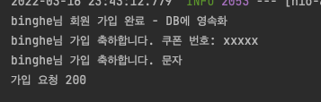
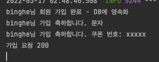
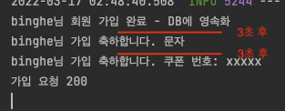
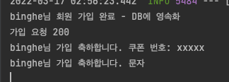
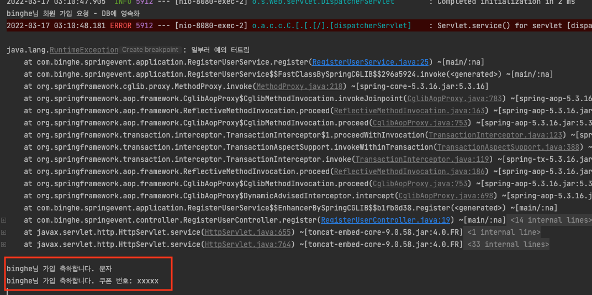
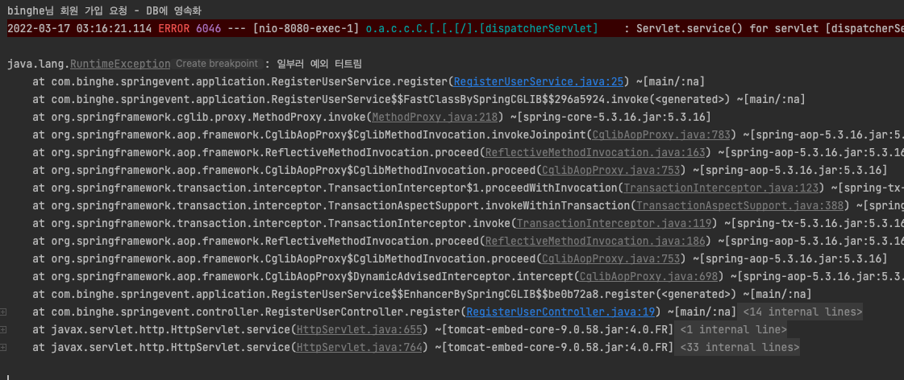

# 목차

<br>

- [목차](#목차)
- [들어가며](#들어가며)
- [개요](#개요)
- [왜 이벤트를 사용하는가?](#왜-이벤트를-사용하는가)
  - [요구사항](#요구사항)
  - [이벤트를 사용하지 않고 간단히 구현해보기](#이벤트를-사용하지-않고-간단히-구현해보기)
- [이벤트를 활용한 구현](#이벤트를-활용한-구현)
  - [의존성 문제 해결 -> 이벤트 구현](#의존성-문제-해결---이벤트-구현)
  - [성능 문제 해결 -> 비동기 처리](#성능-문제-해결---비동기-처리)
  - [트랜잭션 -> TransactionalEventListener 사용](#트랜잭션---transactionaleventlistener-사용)
- [마치며](#마치며)
- [참고](#참고)

<br>

# 들어가며
일정 규모이상의 프로젝트를보면 대부분 이벤트 기반으로 동작한다.

이벤트 기반이라하면 보통은 이벤트 소싱과 CQRS에 대해서 많이 얘기한다.

이번 글은 구체적으로 이벤트 소싱과 CQRS에 대해서 다루기 전에, 스프링을 사용해서 이벤트를 다루는 Hello World 수준의 글을 작성해보고자한다.

그리고 간단한 예시를 통해 왜 이벤트를 사용하는지에 대해서도 다룬다.

> 본 글은 아래 환경을 기반으로 작성되었습니다.
> * Spring Boot 2.6.4
> * Lombok 1.18.22

<br>

# 개요
스프링을 주로 사용하는 개발자라면 모를 수 없는 객체가 하나 있다.

바로 ApplicationContext이다! 그리고 이 `ApplicationContext` 인터페이스는 `ApplicationEventPublisher`를 상속한다. 이 말은 `ApplicationContext`의 구현체는 모두 이벤트 발행 (Event Publishing)의 기능을 제공한다는 것이다.

<br>

스프링에서 이벤트를 다룬다면 아래 세 가지 가이드라인을 따르면 된다.

* Event (이벤트)
  * 스프링 프레임워크 `4.2` 이전 버전을 사용한다면 `ApplicationEvent`를 상속하여 사용한다.
  * `4.2` 버전 이후라면 POJO 객체를 그대로 이벤트 객체로써 사용할 수 있다.
* EventPublisher
  * `ApplicationEventPublisher`를 주입받아 사용하면 된다.
* EventListener
  * 스프링 프레임워크 `4.2` 이전 버전을 사용한다면 `ApplicationListener`를 상속 및 구현해야한다.
  * `4.2` 버전 이후로는 `@EventListener` 애노테이션만 붙여도 사용 가능하다.

<br>

# 왜 이벤트를 사용하는가?
> 이 글은 처음 이벤트를 사용해보는 개발자를 대상으로 하기에, 이벤트 소싱, CQRS등의 내용은 전혀 언급하지 않고 최대한 간단히 설명하였습니다.

스프링이 이벤트를 발행하고 처리하는등의 기능을 기본적으로 제공한다는 것은 알았다.

그렇다면 왜 이벤트를 사용할까??

**간단한 요구사항을 구현하면서 왜 사용하는지 알아본다.**

<br>

## 요구사항

요구사항은 간단하다. SNS 서비스를 만든다고 가정하고, 사용자가 회원가입하면 이메일과 SMS로 가입 축하 안내를 한다.

이때 이메일로는 가입 축하 쿠폰을 보내준다.

<br>

## 이벤트를 사용하지 않고 간단히 구현해보기

> RegisterUserService.java

```java
@Service
public class RegisterUserService {

    // private final EmailSender emailSender;
    // private final SMSSender smsSender;

    public void register(RegisterUserCommand registerUserCommand) {
        // 회원 가입
        System.out.println(registerUserCommand.getName() + "님 회원 가입 완료 - DB에 영속화");

        // 가입 축하 이메일 전송 (쿠폰 포함)
        System.out.println(registerUserCommand.getName() + "님 가입 축하합니다. 쿠폰 번호: xxxxx");

        // 가입 축하 SMS 전송
        System.out.println(registerUserCommand.getName() + "님 가입 축하합니다. 문자");
    }
}
```
우선은 빠른 구현을 위해 `System.out`으로 대체했지만, 실제론 `EmailSender`, `SMSSender`등의 의존성을 넣어서 처리해준다.

> 중요한 것은 의존성이 발생한다는 것!

<br>

> RegisterUserController.java

```java
@AllArgsConstructor
@RestController
public class RegisterUserController {

    private final RegisterUserService registerUserService;

    @GetMapping("/register/{name}")
    public ResponseEntity<String> register(@PathVariable String name) {
        registerUserService.register(new RegisterUserCommand(name));
        String successMessage = "가입 요청 200";
        System.out.println(successMessage);
        return ResponseEntity.ok(successMessage);
    }
}
```
`register/binghe`로 가입 요청을 날리면 아래와 같이 출력된다.

<p align="center"> </p>

<br>

🤔 **위 코드의 문제점은 무엇일까?**

<br>

1️⃣ 의존성

* 문제
  * 현재 회원가입 서비스는 3가지의 로직이 서로 강하게 의존적이다. (회원가입, 이메일, SMS)
  * 즉, 강한 결합이 발생하며, 이메일과 SMS의 코드 수정만으로도 회원 가입 로직에 영향을 줄 수 있다.
* 해결법
  * 회원가입, 이메일, SMS 기능을 서로 분리시키면 된다.

<br>

2️⃣ 성능

* 회원가입하는데 0.1초면 되지만, 이메일 보내는데 5분, SMS 보내는데 5분이 걸린다고 가정하면, 회원가입이라는 전체 로직은 10분넘게 걸린다.
  * 회원가입이라는 핵심 로직을 제외한 이메일과 SMS 보내는 로직으로인해 회원가입에 대한 요청이 오래 걸리는 것이다.
* 해결법
  * 현재 `회원가입 요청-> 이메일 전송 -> SMS 전송 -> 회원가입 성공`의 플로우를 `회원가입 요청 -> 회원가입 성공` + `비동기 이메일 전송 + 비동기 SMS 전송`로 바꿔주면 된다.

<br>

3️⃣ 트랜잭션

* 문제점
  * 회원가입, 이메일, SMS의 로직이 서로 하나로 묶여있기에 회원가입도중에 문제가 발생한다해도 이메일과 SMS이 발송되게된다.
  * 또는, 반대로 이메일과 SMS의 예외로 회원가입에 대한 처리가 안될 수도 있다.
  * 즉, 하나라도 예외가 발생하면 다른 기능에 영향을 주거나 큰 문제가 발생할 수도 있다.
* 해결법
  * 로직 자체를 트랜잭션 기반으로 묶어주면 된다.

<br>

# 이벤트를 활용한 구현
이제 이벤트 기반의 리팩토링을 통해 위 문제 3가지를 해결해본다.

이벤트의 실행 단계는 크게 3가지로 나뉜다.

1. 비즈니스 로직을 처리하는 도메인간의 순서와 트랜잭션 처리 역할을 하는 서비스 레이어에서 이벤트가 발생하여 이벤트 디스패처에게 전달한다.
2. 이벤트 디스패처는 이벤트에 맞는 핸들러를 연결해준다.
3. 이벤트 핸들러는 이벤트에 담긴 데이터를 통해 주어진 기능을 실행한다.

<br>

## 의존성 문제 해결 -> 이벤트 구현
의존성 문제를 해결하기 위해선 이벤트 기반으로 리팩토링하면 쉽게 분리가능하다.

**1. 우선 이벤트를 만들어준다**

> RegisterUserEvent.java

```java
@NoArgsConstructor
@AllArgsConstructor
@Getter
public class RegisteredUserEvent {

    private String name;
}
```
이벤트 클래스에는 이벤트 발생하고나서 처리할 때 사용할 데이터를 포함해주면 된다.

<br>

**2. 서비스 레이어 리팩터링**

> RegisterUserService.java

```java
@AllArgsConstructor
@Service
public class RegisterUserService {

    @Autowired
    private final ApplicationEventPublisher publisher;

    // 기타 의존성 제거됨. (ex. EmailSender, SMSSender)

    public void register(RegisterUserCommand registerUserCommand) {
        // 회원 가입
        System.out.println(registerUserCommand.getName() + "님 회원 가입 완료 - DB에 영속화");

        // 가입 완료 이벤트 발행
        publisher.publishEvent(new RegisteredUserEvent(registerUserCommand.getName()));
    }
}
```
기존엔 Email과 SMS를 보내는 로직과 의존성이 Service에 존재했다면 이젠 `ApplicationEventPublisher`만 존재하게 되었다.

**이를 통해 강한 의존성을 해결할 수 있다.**

<br>

**3. 이벤트 처리**

> EventHandler.java

```java
@Component
public class EventHandler {

    @EventListener
    public void sendEmail(RegisteredUserEvent event) {
        System.out.println(event.getName() + "님 가입 축하합니다. 쿠폰 번호: xxxxx");
    }

    @EventListener
    public void sendSMS(RegisteredUserEvent event) {
        System.out.println(event.getName() + "님 가입 축하합니다. 문자");
    }
}
```
마지막으로 이벤트를 처리해주면 된다.

이제 실행하여 동일하게 요청(`GET http://localhost:8080/register/binghe`)을 보내면 아래와 같이 동일한 결과를 얻게된다.

<p align="center"> </p>

<br>

## 성능 문제 해결 -> 비동기 처리
이벤트를 적용시킴으로써 의존성의 문제를 해결하였지만, 여전히 남아있는 문제는 성능이다.

현재 따로 설정을 해주지 않아서 아래와 같이 이메일과 SMS 보내는 로직이 각각 3분씩 걸린다면, 회원가입을 요청한 클라이언트는 적어도 6분이상 응답을 기다려야한다.

즉, 사용자 경험이 굉장히 떨어지며, 서버 입장에서도 스레드를 오랫동안 잡아두는 것이기에 성능에 치명적이다.

> 일부러 만든 이메일과 SMS을 보내는 3분씩 걸리는 코드.
```java
@Component
public class EventHandler {

    @EventListener
    public void sendEmail(RegisteredUserEvent event) throws InterruptedException {
        Thread.sleep(3_000); // 3초간 sleep
        System.out.println(event.getName() + "님 가입 축하합니다. 쿠폰 번호: xxxxx");
    }

    @EventListener
    public void sendSMS(RegisteredUserEvent event) throws InterruptedException {
        Thread.sleep(3_000); // 3초간 sleep
        System.out.println(event.getName() + "님 가입 축하합니다. 문자");
    }
}
```
<p align="center"> </p>

이는 **현재 동기적으로 `회원가입 요청-> 이메일 전송 -> SMS 전송 -> 회원가입 성공`를 처리하기 때문에 발생하는 문제이다.**

**`회원가입 요청 -> 회원가입 성공` + `비동기 이메일 전송 + 비동기 SMS 전송`로 바꿔주면 성능에 대한 문제를 해결할 수 있다.**

<br>

**1. `@Async` 추가**

> EventHandler.java
```java
@Component
public class EventHandler {

    @Async // 비동기
    @EventListener
    public void sendEmail(RegisteredUserEvent event) throws InterruptedException {
        Thread.sleep(3_000);
        System.out.println(event.getName() + "님 가입 축하합니다. 쿠폰 번호: xxxxx");
    }

    @Async // 비동기
    @EventListener
    public void sendSMS(RegisteredUserEvent event) throws InterruptedException {
        Thread.sleep(3_000);
        System.out.println(event.getName() + "님 가입 축하합니다. 문자");
    }
}
```
비동기로 처리할 이벤트 핸들러 메서드에 `@Async`를 추가해준다.

<br>

**2. `@EnableAsync` 추가**

> SpringEventApplication.java
```java
@EnableAsync
@SpringBootApplication
public class SpringEventApplication {

    public static void main(String[] args) {
        SpringApplication.run(SpringEventApplication.class, args);
    }

}
```
Configuration파일 혹은 스프링 실행 Application에 `@EnableAsync`를 추가해준다.

<br>

이제 실행해보면 아래와 같이 회원가입 성공에 대한 결과가 먼저나오고 이메일과 SMS로 이벤트를 처리하는 것을 볼 수 있다.

<p align="center"> </p>

이를 통해 회원가입의 핵심 로직은 빠르게 실행되고 클라이언트에게 결과를 알려줄 수 있게 된다!

<br>

## 트랜잭션 -> TransactionalEventListener 사용
지금까지 구현한 코드는 회원가입 도중에 예외가 발생해도 이메일과 SMS이 발송되게된다.

이는 회원가입 성공되지도 않았는데, 회원가입 축하 소식을 클라이언트에게 알리는 것이므로 큰 문제가 발생한다.

<br>

> 일부러 예외가 발생하도록 리팩터링한 코드

```java
@AllArgsConstructor
@Transactional
@Service
public class RegisterUserService {

    @Autowired
    private final ApplicationEventPublisher publisher;

    public void register(RegisterUserCommand registerUserCommand) {
        // 회원 가입
        System.out.println(registerUserCommand.getName() + "님 회원 가입 요청 - DB에 영속화");

        // 가입 완료 이벤트 발행
        publisher.publishEvent(new RegisteredUserEvent(registerUserCommand.getName()));

        throw new RuntimeException("일부러 예외 터트림");
    }
}
```

위 코드를 실행하여 동일한 요청을 보내면 아래와 같이 나온다.

<p align="center"> </p>

회원가입에 대한 요청이 실패했음에도 이메일과 SMS이 발송된 것을 볼 수 있다.

<br>

**Spring과 Spring Data JPA**

Spring Data JPA에서 제공하는 `@TransactionalEventListener`를 사용한다면 이 문제를 쉽게 해결할 수 있다.

> 갑자기 왜 JPA냐고? 이번 글은 각 기능별 Hello World를 보여주기 위함이지 각 부분을 깊게 다루는 글이 아니기 때문이다.
> 
> 위 코드를 적용하기 전에 Spring Data JPA에 대한 의존성을 추가해주자.

`@TransactionalEventListener`는 `@EventListener`를 상속한 애노테이션이며, 트랜잭션 기능이 추가되었다고 보면 된다.

아래 설정을 줄 수 있다.

* AFTER_COMMIT (기본)
* AFTER_ROLLBACK
* AFTER_COMPLETION
* BEFORE_COMMIT

<br>

**@TransactionalEventListener 리팩터링**

```java
@Component
public class EventHandler {

    @Async
    @TransactionalEventListener(phase = TransactionPhase.AFTER_COMMIT)
    public void sendEmail(RegisteredUserEvent event) throws InterruptedException {
        Thread.sleep(3_000);
        System.out.println(event.getName() + "님 가입 축하합니다. 쿠폰 번호: xxxxx");
    }

    @Async
    @TransactionalEventListener(phase = TransactionPhase.AFTER_COMMIT)
    public void sendSMS(RegisteredUserEvent event) throws InterruptedException {
        Thread.sleep(3_000);
        System.out.println(event.getName() + "님 가입 축하합니다. 문자");
    }
}
```
이제 실행해보면 아래와 같이 회원가입 로직에서 예외가 발생하여 롤백되면 이메일과 SMS를 발송하지 않는 것을 볼 수 있다.

<p align="center"> </p>

<br>

# 마치며
어떤가? 스프링에서 다양한 애노테이션을 제공해주기 때문에 쉽게 이벤트 기반의 프로그래밍을 할 수 있다.

> 물론 조금 깊게 들어가면 쉽지 않다 :) 하지만 차근차근 알아보면 될 듯 싶다!

다음 글은 이벤트 소싱과 CQRS에 대해서 다룰 예정이다!

<br>

# 참고
* [DDD START!](http://www.yes24.com/Product/Goods/27750871)
* https://www.baeldung.com/spring-events
