[Head First Servlets & JSP](http://www.yes24.com/Product/Goods/3301415?OzSrank=1)를 기초하여 작성한 자료입니다.


## 목차

- [세션](#--)
  * [HTTP의 특징과 쿠키와 세션을 사용하는 이유](#http---------------------)
    + [connectionless (비연결지향)](#connectionless--------)
    + [stateless (상태정보 유지 안함)](#stateless-------------)
  * [1. HttpSession](#1-httpsession)
    + [1-1. 세션의 작동방식](#1-1---------)
    + [1-2. 컨테이너는 클라이언트를 어떻게 구분할까?](#1-2-----------------------)
    + [1-3. 세션 생성방법](#1-3--------)
      - [1-3-1. Response 객체에 세션 쿠키 보내기](#1-3-1-response--------------)
      - [1-3-2. Request 객체로부터 세션 ID가져오기](#1-3-2-request----------id----)
    + [1-4. 세션 유무 확인방법](#1-4-----------)
      - [1-4-1. 방법 1](#1-4-1----1)
      - [1-4-2. 방법2](#1-4-2---2)
    + [1-5. 만약 쿠키가 비활성화라면?](#1-5---------------)
    + [1-6. 세션 삭제하기](#1-6--------)
      - [1-6-1. 타임아웃 설정 방법](#1-6-1-----------)
    + [1-7. 여러가지 메서드](#1-7---------)
    + [1-8. 세션의 여러가지 상황들](#1-8-------------)
    + [1-9. 세션 이동](#1-9------)
      - [1-9-1. 클러스터링](#1-9-1------)
      - [1-9-2. 세션 이동 방법](#1-9-2---------)
    + [1-10. 세션 이벤트](#1-10-------)
      - [1-10-1. HttpSessionBindingListener](#1-10-1-httpsessionbindinglistener)
  * [2. 쿠키](#2---)
    + [2-1. 쿠키란](#2-1----)
    + [2-2. 쿠키의 구성요소](#2-2---------)
    + [2-3. 서블릿 API에서의 쿠키](#2-3-----api------)
      - [2-3-1. 쿠키 객체 생성](#2-3-1---------)
      - [2-3-2. 쿠키의 유지시간 설정](#2-3-2------------)
      - [2-3-3. 쿠키를 클라이언트로 보내기](#2-3-3---------------)
      - [2-3-4. 클라이언트 Request에서 쿠키 읽기](#2-3-4-------request--------)
    + [2-4. 쿠키 예제](#2-4------)


# 세션

웹 서버는 응답을 보낸 다음에는 클라이언트가 누구였는지 잊어버린다.

**웹 서버에는 메모리가 없다.**

그러나 웹 사이트를 사용하다보면 클라이언트와의 대화 내용을 기억해야할 때가 있다. ( 로그인 )

그럴 때 사용하는 것이 바로 세션(Session)이다.


## HTTP의 특징과 쿠키와 세션을 사용하는 이유

* HTTP 프로토콜의 특징이자 약점을 보완하기 위해서 사용한다.
* HTTP 프로토콜 환경에서 서버는 클라이언트가 누구인지 확인해야한다.
  * 그 이유는 **HTTP 프로토콜이 connectionless, stateless한 특성이 있기 때문이다.**


### connectionless (비연결지향)

* **클라이언트가 요청을 한 후 응답을 받으면 그 연결을 끊어버리는 특징**
  * HTTP는 먼저 클라이언트가 request를 서버에 보내면, 서버는 클라이언트에게 요청에 맞는 response를 보내고 접속을 끊는다.
* 헤더에 keep-alive 라는 값을 줘서 커넥션을 재활용하는데 HTTP1.1에서부터 디폴트되었다.


### stateless (상태정보 유지 안함)

* **통신이 끝나면 상태를 유지하지 않는 특징**
  * 연결을 끊는 순간 클라이언트와 서버의 통신이 끝나며 상태 정보는 유지하지 않는 특성이 있다.
* 쿠키와 세션을 사용하지 않으면 쇼핑몰에서 옷을 구매하려고 로그인을 했음에도, 페이지를 이동할 때 마다 계속 로그인을 해야한다.
  * 쿠키와 세션을 사용하면 한 번 로그인을 하면 어떠한 방식에 의해서 그 사용자에 대한 인증을 유지하게 된다.


**쿠키와 세션을 사용하는 이유는 위와 같이 connectionless, stateless의 특성때문이다.**


## 1. HttpSession

다중 요청 간 대화 정보를 유지하기 위해서 `HttpSession`객체를 사용한다.

즉, 특정 사용자의 전체 세션 동안의 정보를 유지할 수 있다는 말이다.

클라이언트가 세션이 유지되는 동안 보낸 모든 요청으로부터 얻은 정보를 여기에 저장할 수 있다.


### 1-1. 세션의 작동방식


1. 다이아나는 `Dark`라는 선택을 한후, `Submit`을 클릭했다.
   * 컨테이너는 서블릿의 새로운 스레드로 요청을 보낸다.
   * 해당 서블릿의 스레드는 다이아나의 세션을 찾아서 세션의 속성에 그녀가 선택한 `Dark`를 저장한다.
2. 서블릿은 비즈니스 로직을 실행하고 응답한다.
   * 여기에 "생각하는 가격대는 어떻게 됩니까?"를 같이 보내준다.
3. 다이아나는 페이지에 뿌려진 새로운 질문을 보고 `Expensive`라는 선택을 하고 다시 `submit`을 한다.
   * 컨테이너는 다시 서블릿의 스레드를 생성하여 요청을 보낸다.
   * 해당 서블릿의 스레드는 다이아나의 세션을 찾아서 세션의 속성으로 그녀가 선택한 `Expensive`를 저장한다.

> 여기서 중요한 점 :
>
> * 똑같은 클라이언트
>
> * 똑같은 서블릿
>
> * 서로 다른 요청
>
> * 서로 다른 스레드
>
> * 똑같은 세션


4. 서블릿은 비즈니스 로직을 실행하고(모델 호출을 포함하여) 응답을 한다.

> 이때 테리(다른 클라이언트)라는 사람이 요청을 해왔다.

5. 테리가 웹 서버에 요청을 했지만, 다이아나의 세션은 여전히 활성화(Active)상태이다.
   * 컨테이너는 테리의 요청을 서블릿의 새로운 스레드로 처리한다.
     * 또한, 해당 서블릿의 스레드는 테리를 위한 새로운 세션을 만든다.


### 1-2. 컨테이너는 클라이언트를 어떻게 구분할까?

>HTTP 프로토콜은 무상태 연결이다.
>
>클라이언트인 브라우저는 서버에 연결을 맺고, 요청을 보낸 뒤, 응답을 받는다. 그리고는 연결을 끊는다.
>
>즉 연결이라고 하는 것은 한 번의 요청과 응답을 위해 존재한다고 말할 수 있다.


**웹 서버에서는 클라이언트가 처음 요청을 보낼 때, 컨테이너가 클라이언트에게 유일한 세션ID를 생성한다.**

**그리고 이 값을 Response에 넣어 클라이언트에게 돌려보낸다.**

**그 다음부터는 클라이언트가 요청을 보낼 때는 이 세션ID를 쿠키에 싣어서 함께 보낸다.**

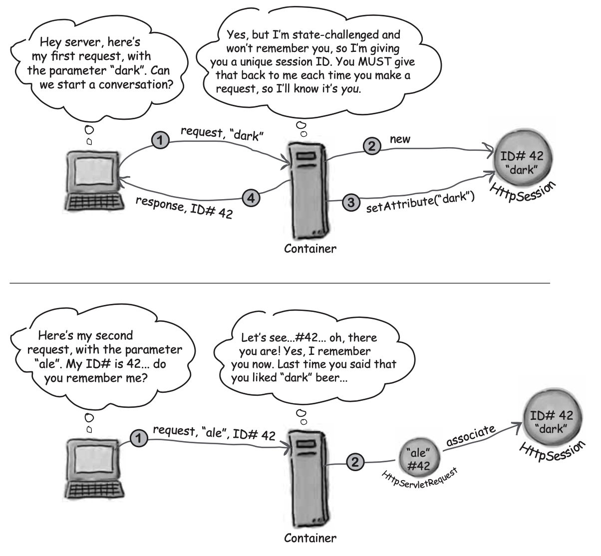

> 쿠키 ( Cookies )
>
> 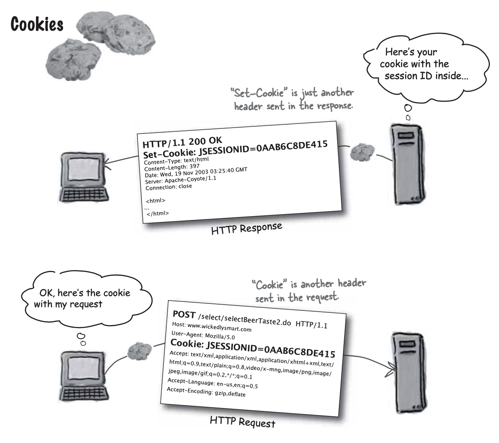


### 1-3. 세션 생성방법

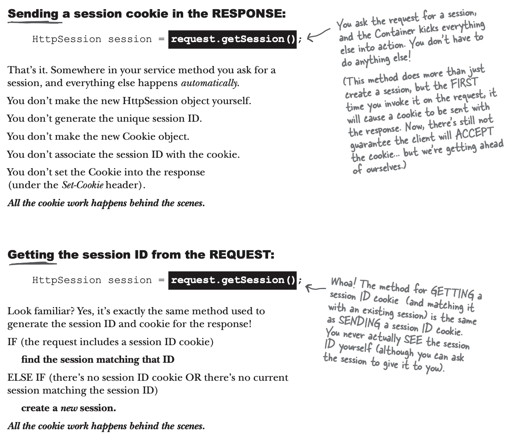


#### 1-3-1. Response 객체에 세션 쿠키 보내기

`HttpSession session = request.getSession()`

* **`Request`로 부터 세션을 리턴받는다.**
  * 컨테이너가 자동적으로 작업을 하기 때문에, 개발자가 따로 할 일은 없다.
* **이 메서드는 세션을 새로 만드는 것뿐만 아니라, 제일 처음 요청일 경우에는, Response에 보낼 쿠키도 생성한다.**

> 모든 쿠키 관련된 일은 내부에서 자동적으로 일어진다고 한다.


#### 1-3-2. Request 객체로부터 세션 ID가져오기

`HttpSession session = request.getSession();`

* 세션 ID를 생성할 때와, `Response`에 쿠키를 실정할 때 쓴 코드가 동일하다.
  * **`Request`안에 세션 ID 들어 있으면, ID에 맞는 세션을 찾으면 된다.**
  * **`Request`안에 세션 ID가 없다면, 새로운 세션을 만들면 된다.**


### 1-4. 세션 유무 확인방법

세션이 이미 있었는지, 아니면 새로 만들던지와 상관 없이 `request.getSession()`메서드는 세션을 리턴한다.

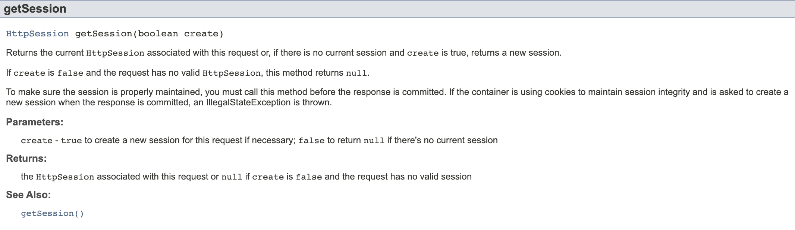

* `getSession(true)` : 세션이 존재하지 않다면, 새로운 세션을 만들어라.
* `getSession(false)` : 세션이 존재하지 않더라도, 세션을 만들지말고 null을 반환해라.


#### 1-4-1. 방법 1

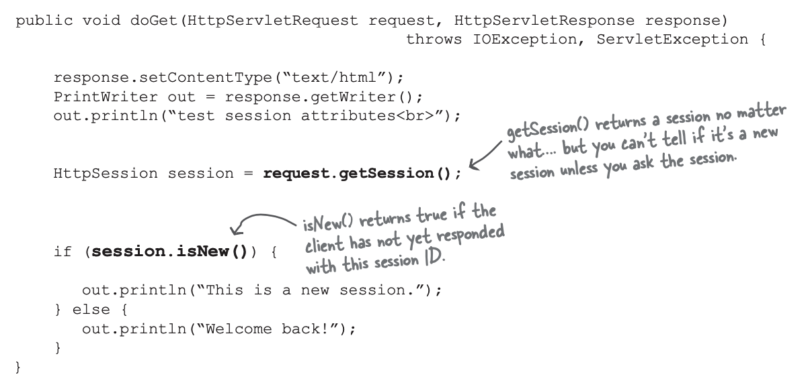

* `getSession()`의 디폴트 값은 `true`이다.
  * **`session.isNew()`를 사용해서 세션이 새로 만들어진건지 확인한다.**


#### 1-4-2. 방법2

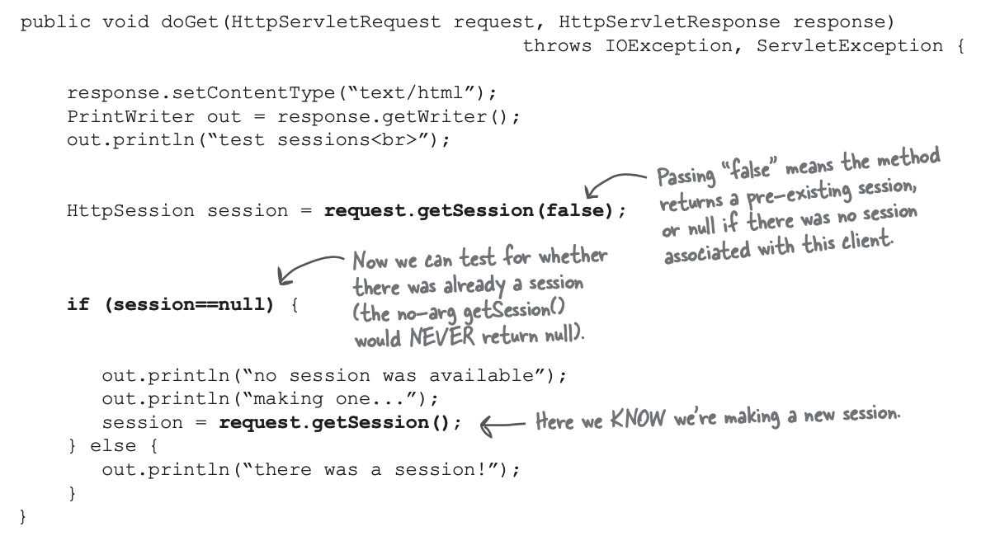

* `getSession()`의 매개변수가 `false`이므로, 세션이 이미 존재하지 않다면 `null`을 반환한다.
  * `null`을 반환하면 새로운 세션을 만들어준다.


> 이 두가지 방법은 어떻게 보면 똑같이 작동하는데 왜 이렇게 나눠서 설명하는가?
>
> * 실제 프로젝트에서 `getSession(false)`메서드를 쓰는 경우는 새로운 세션을 원하지 않을 때라고 한다.


### 1-5. 만약 쿠키가 비활성화라면?

간혹 클라이언트가 브라우저에서 쿠키를 비활성화하는 경우가 있다.

이럴 경우는 URL을 사용해서 한다고 한다.


> 실제 네이버에 확인결과, 쿠키를 비활성화하면 그냥 로그인이 안된다...
>
> 이 방법은 그냥 알아만 두면 될 듯 하다.


### 1-6. 세션 삭제하기

세션을 종료하는 메서드는 `invalidate()`이다.

세션이 삭제되거나 삭제하는 대표적인 경우는 2가지이다.

* 로그아웃
* 일정 시간이지나 자동적으로 삭제 ( 타임 아웃 )


> Tip - 리싱 ( Leasing )
>
> * 주기적으로 클라이언트가 살아있는지 체크하는 행위
> * 클라이언트는 서버로부터 리스(lease)를 받는다. 클라이언트는 이 리스를 정해진 주기마다 자신이 살아있다는 것을 알리기 위해 갱신해야한다.


#### 1-6-1. 타임아웃 설정 방법

1. DD에서 세션 타임아웃 설정하기

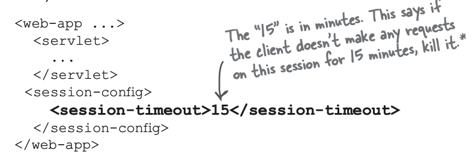

* **DD에서 모든 서블릿의 세션에 대해서 타임아웃을 거는 방법이다.**
  * `setMaxInactiveInterval()`메서드를 호출하는 것과 같다.


2. 특정 세션만 타임아웃 설정하기

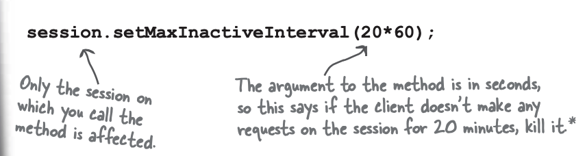

* 메서드의 인자는 초 단위이다.
  * `setMaxInactiveInterval(60)` : 1분


### 1-7. 여러가지 메서드

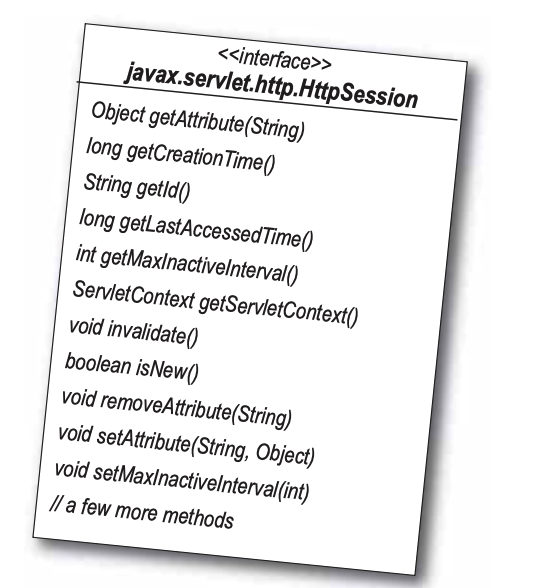

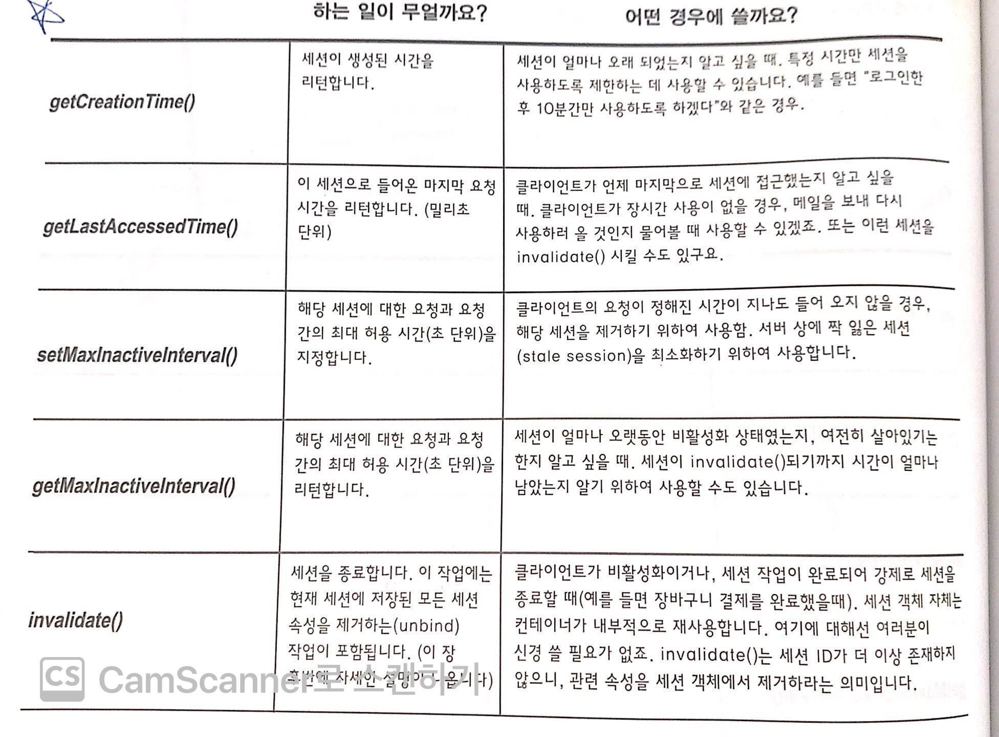


### 1-8. 세션의 여러가지 상황들

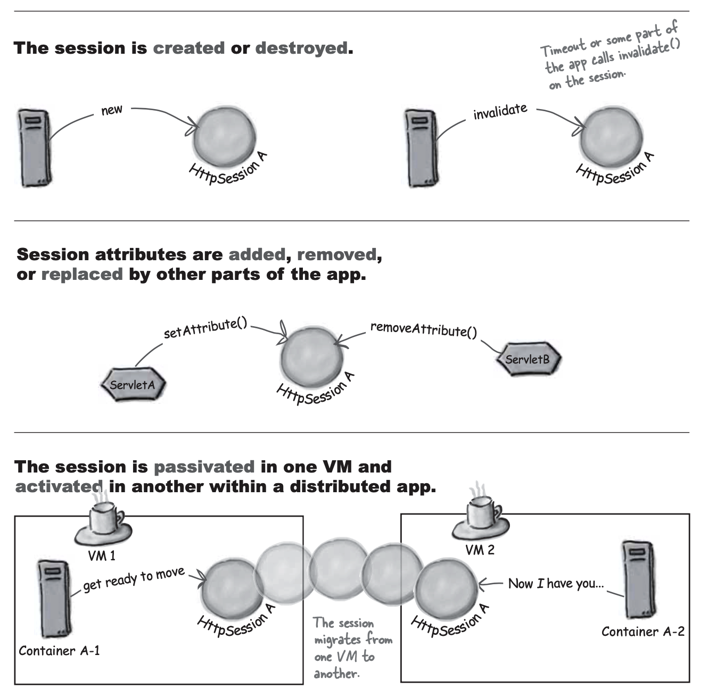


### 1-9. 세션 이동


#### 1-9-1. 클러스터링

클러스터링 환경 하에서, 컨테이너는 클라이언트의 요청을 몇몇의 JVM으로 분산하여 넘기는 로드밸런싱 환경을 구현한다.

즉, 애플리케이션이 다중 JVM에서 구동된다는 것이다.

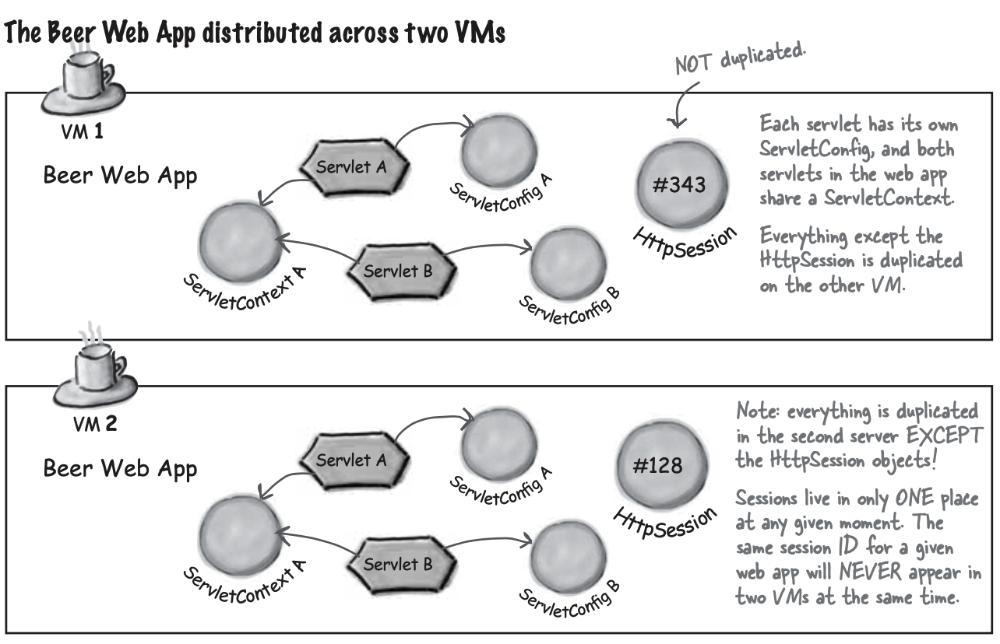

* `ServletContext`는 VM당 하나이다.
* `ServletConfig`는 VM당, 서블릿당 하나이다.
* `HttpSession`객체와 그 속성만이 하나의 VM에서 다른 VM으로 옮겨간다.


> `HttpSession`은 휍 애플리케이션당, 하나의 세션 ID당 하나 밖에 없어야 한다.


#### 1-9-2. 세션 이동 방법

웹 애플리케이션 분산 시스템은 벤더마다 다양하고, 개발자마다 다 서로 다르다.

아래의 세션 이동 방법은 그냥 하나의 예제이다. 꼭 이렇게 구성하지 않아도 된다.

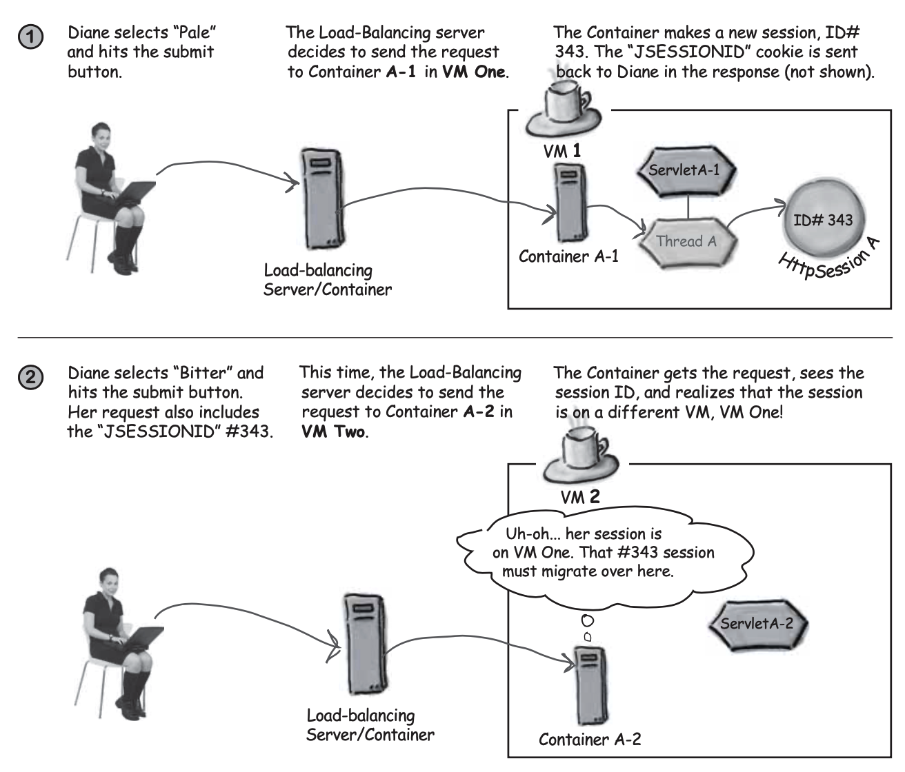

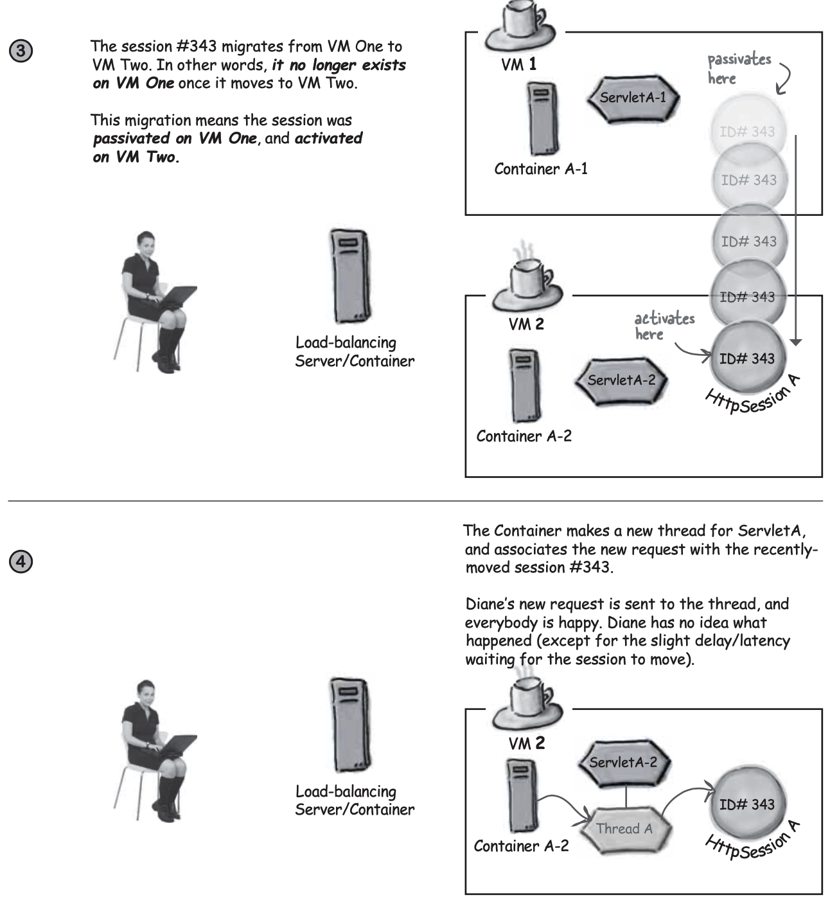

* 세션 객체는 이동하고, 나머지들은 각각의 노드/VM에 이중화, 복제되어 있는다.


### 1-10. 세션 이벤트


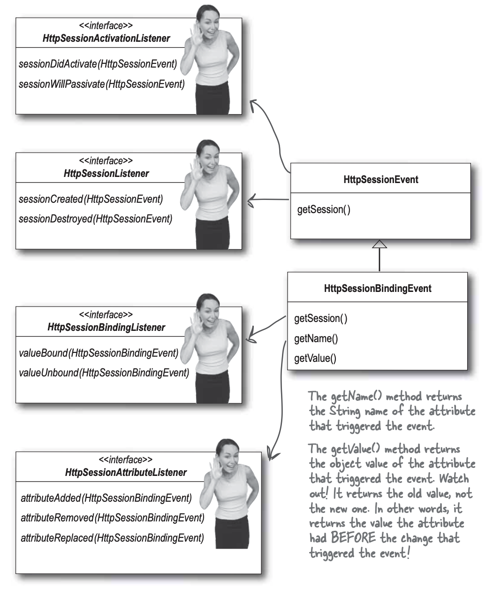


#### 1-10-1. HttpSessionBindingListener

**`HttpSessionBindingListener`는 세션이 아닌 세션 속성의 중요 순간들에 대하여 리스닝한다.**

* 속성이 세션에 추가될 때 속성의 정보를 DB에서 읽어 온다든지, 아니면 세션에서 제거될 때 속성의 정보로 DB를 업데이트한다든지 할 때 사용된다.

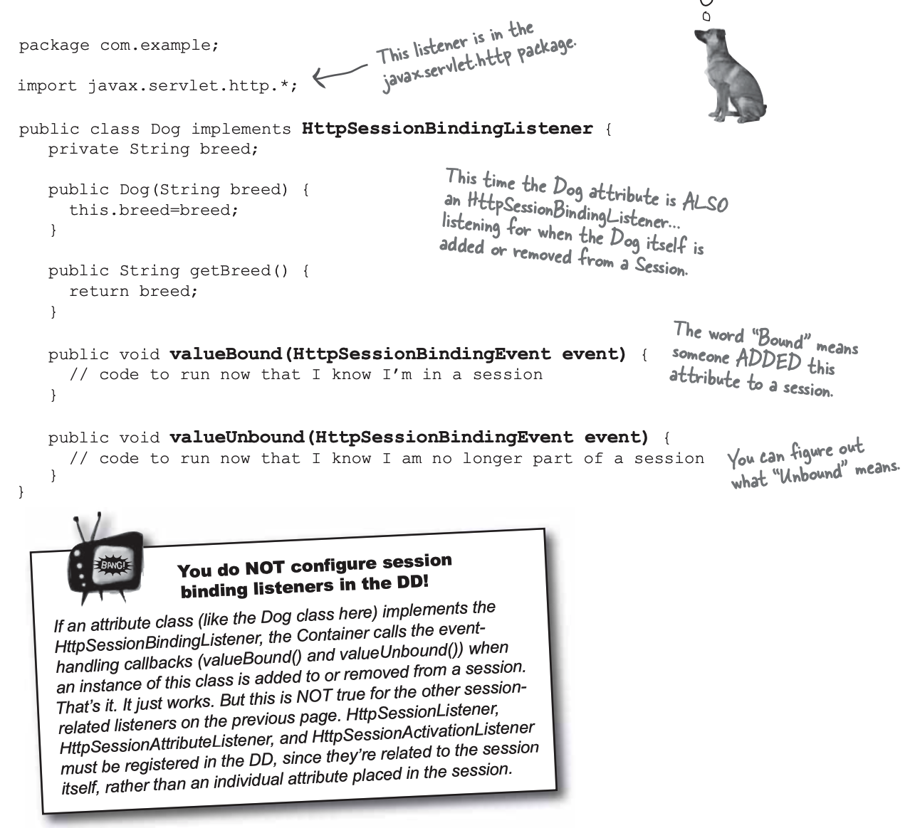


* `Dog`라는 속성 클래스는 `HttpSessionBindingListener`이기도 하다.
  * `Dog`객체가 세션에 추가되거나 제거될 때 리스닝하고 있다.
* "Bound"라는 말은 이 속성을 세션에 추가했따는 걸 의미한다.


> **세션 바인딩 리스너는 DD에 설정하지 않는다.**
>
> * **`Dog`와 같은 속성 클래스가 `HttpSessionBindingListener`를 구현하면, 컨테이너는 이 객체가 세션에 추가되거나 제거될 때,  관련 콜백 메서드(`valueBound()`, `valueUnBound()`)를 호출한다.**


## 2. 쿠키

서버에 모든 클라이언트들의 데이터를 저장하면 서버가 견디질 못할 것이다.

**쿠키는 클라이언트 로컬에 저장되는 작은 데이터 파일이다.**


### 2-1. 쿠키란

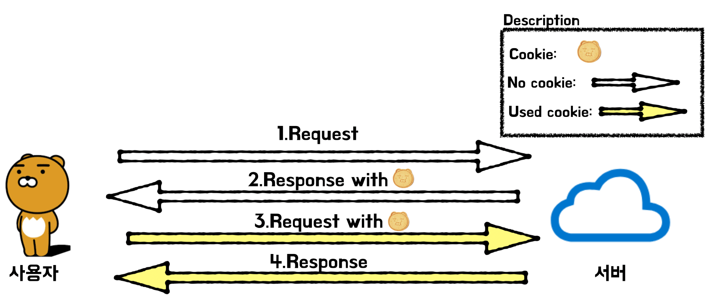

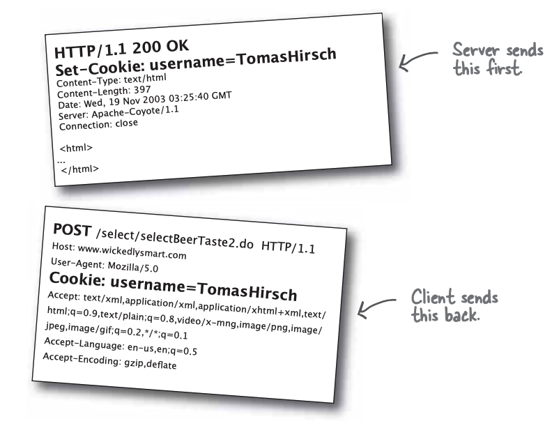

* **서버와 클라이언트간에 교환하는 조그만한 데이터 (이름/값의 `String`쌍)이다.**
  * 클라이언트의 로컬에 저장한다.
* **서버가 클라이언트로 쿠키를 보내면, 클라이언트는 새로운 요청을 보낼 때 쿠키를 돌려보낸다.**
  * 쿠키의 교환은 자동적으로 일어난다.

* 사용자 인증이 유효한 시간을 명시할 수 있으며, 유효 시간이 정해지면 브라우저가 종료되어도 인증이 유지된다는 특징이 있다.


> 쿠키의 사용 예
>
> * 방문 사이트에서 로그인 시, "아이디와 비밀번호를 저장하시겠습니까?"
> * 쇼핑몰의 장바구니 기능
> * 자동로그인
> * 팝업에서 "오늘 더 이상 이창을 보지 않음"등


### 2-2. 쿠키의 구성요소

* 이름 : 각각의 쿠키를 구별하는 데 사용되는 이름
* 값 : 쿠키의 이름과 관련된 값
* 유효시간 : 쿠키의 유지시간
* 도메인 : 쿠키를 전송할 도메인
* 경로 : 쿠키를 전송할 요청 경로


### 2-3. 서블릿 API에서의 쿠키

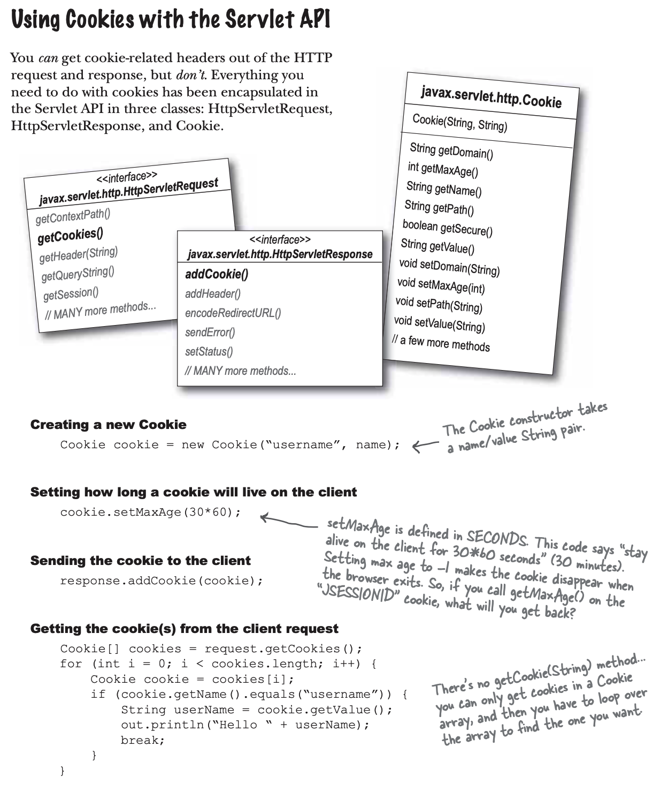

* HTTP `Request`와 `Response`에서 쿠키 관련 헤더 정보를 핸들링 할 수 있다.


#### 2-3-1. 쿠키 객체 생성

`Cookie cookie = new Cookie("username", name);`

* Cookie클래스 생성자는 "이름/값"쌍을 인자로 받는다.


#### 2-3-2. 쿠키의 유지시간 설정

`cookie.setMaxAge(30*60)`

* `setMaxAge()`는 초단위로 설정한다.


#### 2-3-3. 쿠키를 클라이언트로 보내기

`response.addCookie(cookie);`


#### 2-3-4. 클라이언트 Request에서 쿠키 읽기

```java
Cookie[] cookies = request.getCookies();
for(int i = 0; i < cookies.length; i++){
  Cookie cookie = cookies[i];
  if(cookie.getName().equals("username")){
    String userName = cookie.getValue();
    out.println("hello"+userName);
    break;
  }
}
```

* `getCookie(String)`메서드는 존재하지 않는다. `getCookies()`만 존재한다.
  * **원하는 쿠키를 찾으려면 배열을 루프로 돌려가며 찾아야한다.**


### 2-4. 쿠키 예제

> 쿠키를 생성하고 설정하는 서블릿

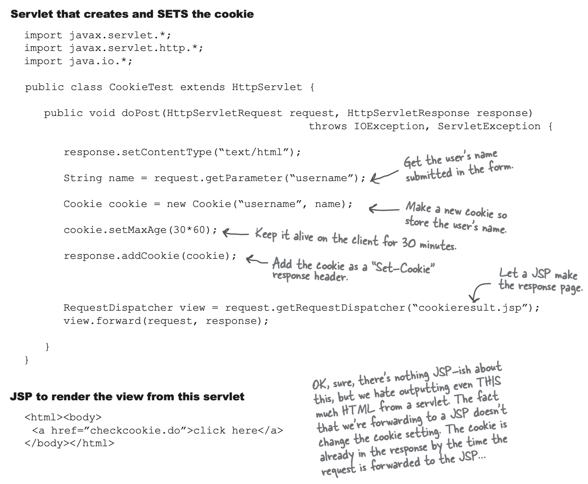


> 쿠키 정보를 읽는 서블릿

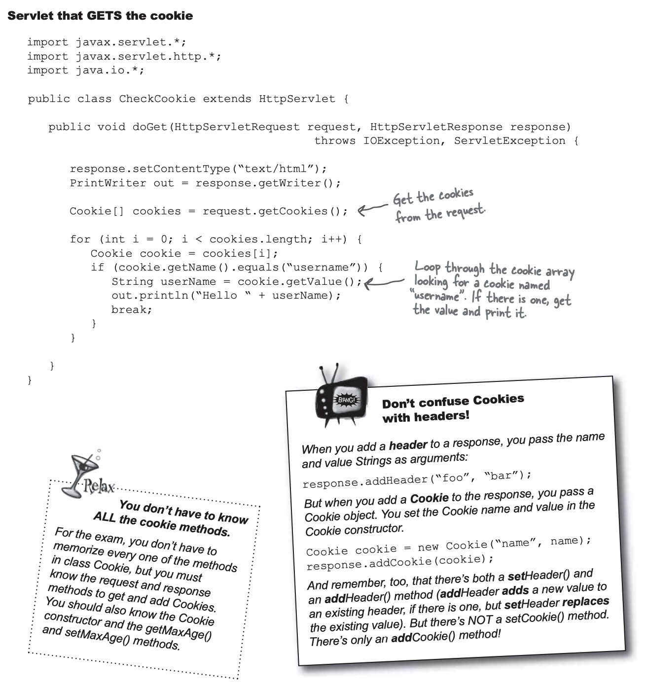


