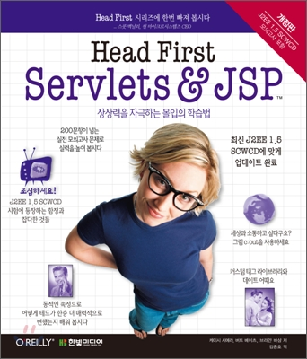

# Head-First-JSP&Servlet 정리

`Servlet`에 대해서만 집중적으로 정리하였다.

## 목차

* [1장. 서블릿과 JSP는 어디에 쓰는 것인가?](https://github.com/binghe819/TIL/blob/master/Spring/Head%20First%20Servlets%20%26%20JSP/1.%20%EC%84%9C%EB%B8%94%EB%A6%BF%EA%B3%BC%20JSP%EB%8A%94%20%EC%96%B4%EB%94%94%EC%97%90%20%EC%93%B0%EB%8A%94%20%EA%B2%83%EC%9D%B8%EA%B0%80%3F.md)

* [2장. 웹 애플리케이션 아키텍처](https://github.com/binghe819/TIL/blob/master/Spring/Head%20First%20Servlets%20%26%20JSP/2.%20%EC%9B%B9%20%EC%95%A0%ED%94%8C%EB%A6%AC%EC%BC%80%EC%9D%B4%EC%85%98%20%EC%95%84%ED%82%A4%ED%85%8D%EC%B2%98.md)
* [3장. 간단 미니 MVC 튜토리얼](https://github.com/binghe819/TIL/blob/master/Spring/Head%20First%20Servlets%20%26%20JSP/3.%20%EA%B0%84%EB%8B%A8%20%EB%AF%B8%EB%8B%88%20MVC%20%ED%8A%9C%ED%86%A0%EB%A6%AC%EC%96%BC.md)
* [4장. 서블릿 ( 요청과 응답 )](https://github.com/binghe819/TIL/blob/master/Spring/Head%20First%20Servlets%20%26%20JSP/4.%20%EC%84%9C%EB%B8%94%EB%A6%BF%20(%20%EC%9A%94%EC%B2%AD%EA%B3%BC%20%EC%9D%91%EB%8B%B5%20).md)
* [5장. 속성과 리스너](https://github.com/binghe819/TIL/blob/master/Spring/Head%20First%20Servlets%20%26%20JSP/5.%20%EC%86%8D%EC%84%B1%EA%B3%BC%20%EB%A6%AC%EC%8A%A4%EB%84%88.md)
* [6장. 세션](https://github.com/binghe819/TIL/blob/master/Spring/Head%20First%20Servlets%20%26%20JSP/6.%20%EC%84%B8%EC%85%98.md)

