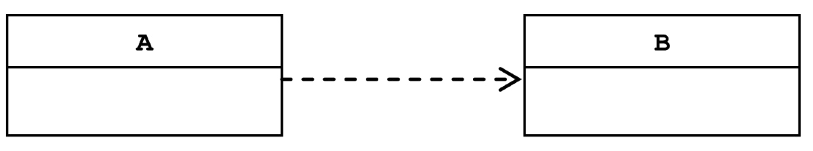
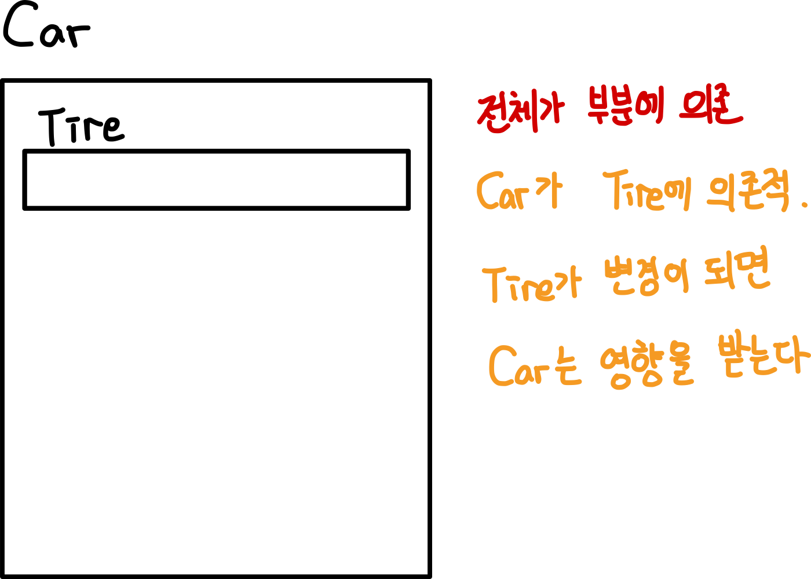

# 목차

- [IoC / DI 개념](#ioc---di-개념)
  * [1 의존성](#1-의존성)
    + [1-1 의존성이란?](#1-1-의존성이란?)
    + [1-2 집합관계와 구성관계](#1-2-집합관계와-구성관계)
    + [1-3 의존성 역전의 의미](#1-3-의존성-역전의-의미)
  * [2 스프링 IoC / DI](#2-스프링-ioc---di)
- [참고](#참고)


# IoC / DI 개념

🤔 **제어의 역전이란?**

* 의존 관계 주입(DI)이라고도 하며, ***어떤 객체가 사용하는 의존 객체를 직접 만들어 사용하는게 아니라, 주입 받아 사용하는 방법을 말한다.***


## 1 의존성

🙋‍♂️ 의존성 주입(DI)의 의미를 이해하려면 **'의존(Dependency)'**이 뭔지 알아야 한다. 의존과 관련된 내용을 정리해보고자 한다.


### 1-1 의존성이란?

> 여기서 말하는 의존성은 프로그래밍의 관점에서의 의존성이다.  

  

🤔 **의존성이란**

* 의존은 **변경에 의해 영향을 받는 관계**를 의미한다.
* **전체가 부분에 의존한다고 표현할 수 있다.**
* **의존하는 객체를 전체, 의존되는 객체를 부분**이라 볼 수 있다.
* 전체가 부분에 의존한다는 것과 "프로그래밍"에서 의존 관계는 `new`로 표현된다


🙋‍♂️ **의존성의 특징**



* 의존관계에는 방향성이 있다.
  * A가 B에 의존하고 있지만, 반대로 B는 A에 의존하고있지 않다.
  * 즉, B는 A의 변화에 영향을 받지 않는다.


:point_right: **예시**

```java
class Tire {
  String name;
}

class Car {
  Tire tire; // Car난 Tire의 의존
  
  public Car() {
    tire = new Tire(); // Car 객체 생성자에서 new Tire()
  }
}
```




* `Car`객체는 `Tire`객체에 의존적이다.
  * `Tire`의 변경이 `Car` 코드에 영향을 준다.


### 1-2 집합관계와 구성관계

💁‍♂️ **집합 관계**

* 부분이 전체와 다른 생명 주기를 가질 수 있다.
* 예시
  * 집 vs 냉장고


💁‍♂️ **구성 관계**

* 부분은 전체와 같은 생명주기를 갖는다.

* 예시
  * 사람 vs 심장


### 1-3 의존성 역전의 의미

🤔 **의존성 역전?**

* 일반적인 경우 : 자기가 사용할 의존성을 자기가 만들어서 사용한다. 
  * 의존성에 대한 제어권을 자기 자신이 가지고 있다.
* IoC (제어권 역전) : ***의존성에 대한 제어권을 자기 자신이 아닌 외부에서 주입해준다.***
  * 의존성을 생성(`new`)하는 일을 더이상 자기 자신이 하지 않는다.
  * **스프링에서는 IoC 컨테이너가 빈으로 저장된 객체를 자동적으로 주입해준다.**


:point_right: **예시**

```java
// 일반적인 경우
class OwnerController {
  private OwnerRepository repository = new OwnerRepository();
}

// IoC
class OwnerController {
  private OwnerRepository repo;
  
  public OwnerController(OwnerRepository repo){
    this.repo = repo;
  }
}
```


## 2 스프링 IoC / DI

🤔 **스프링에서의 의존성?**

* 자바에서의 의존성과 동일하다. 다만 **스프링은 IoC 컨테이너를 통해 필요한 의존성을 자동적으로 주입(Dependency Inject)해준다.**
* **내부에서 직접 의존하는 객체를 생성하는 것이 아닌 생성자, Setter, 애노테이션(리플렉션)등을 사용하여 외부에서 의존 객체를 주입해주는 방식이다.**


# 참고

* [스프링 입문을 위한 자바 객체 지향의 원리와 이해](http://www.yes24.com/Product/Goods/17350624)

* https://martinfowler.com/articles/injection.html
* https://docs.spring.io/spring/docs/current/spring-framework-reference/core.html#beans


