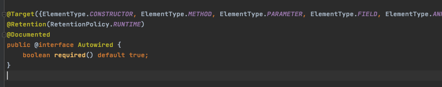
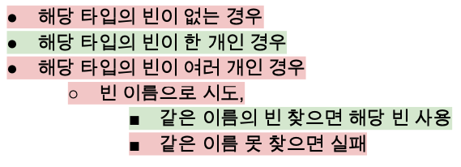

# 목차

- [의존성 주입 방법](#의존성-주입-방법)
  * [1 @Autowired 주입](#1--autowired-주입)
    + [1-1 @Autowired란](#1-1--autowired란)
    + [1-2 @Autowired예시](#1-2--autowired예시)
    + [1-3 @Autowired 속성 매칭 규칙](#1-3--autowired-속성-매칭-규칙)
    + [1-4 장단점](#1-4-장단점)
  * [2 Setter 주입](#2-setter-주입)
  * [3 생성자 주입](#3-생성자-주입)

* [참고](#참고)


# 의존성 주입 방법

🙋‍♂️ **스프링에서 빈을 가져오는 방법은 크게 DI와 DL로 나뉜다.**

* DI : 런타임시에 자동적으로 컨테이너가 의존성을 주입해주는 방식
* DL : 직접 `ApplicationContext`에 설정정보를 등록하여 생성해서 빈을 가져오는 방식.

여기서는 DI를 통해 의존성을 주입받는 방법만을 정리하였다.


# DI (Dependency Injection)

DI는 우리가 흔히 사용하는 의존성 주입 방식이다. IoC를 기초하여 빈 팩토리가 의존성을 주입해준다.

* DI는 빈 팩토리를 바탕으로 동작하기 때문에 같은 컨텍스트에 위치해야 한다.
  * DI를 통한 의존성 주입에 관련된 객체는 모두 스프링 빈으로 등록되있어야 한다.


## 1 @Autowired 주입


### 1-1 @Autowired란



🤔  **`@Autowired`의 의미**

* **스프링 설정 파일을 보고 자동으로 속성의 설정자 메서드에 해당되는 역할을 해주겠다는 의미.**

🤔  **`@Autowired`의 역할**

* **필요한 의존 객체의 "타입"에 해당하는 빈을 찾아 주입해준다.**
* `required` : 기본값은 `true` (따라서 못 찾으면 애플리케이션 구동 실패)

🙋‍♂️ **사용할 수 있는 위치**

* 생성자
* 세터
* 필드

🙋‍♂️ **경우의 수**



🙋‍♂️  **동작 원리**

* 컨테이너를 통해 빈이 생성(생성자가 실행)이 되고 해당 빈은 새로운 라이프사이클이 실행된다.
* 즉 빈은 인스턴스화되고 `BeanInitialization`이라는 라이플 사이클이 또 있다.
* `BeanPostProcessor`는 `BeanInitialization`라는 라이플 사이클 실행 전/후에 어떤 부가적인 작업을 할 수 있는 콜백을 처리하는 처리기이다.
* 그리고 `BeanPostProcessor`를 구현하고 있는 `AutowiredAnnotationBeanPostProcessor`가 `@Autowired`를 찾아서 의존성을 주입해주는 것이다.


### 1-2 @Autowired예시

```java
@Service
public class UserService {
  @Autowired
  private UserRepository userRepository; // 자동적으로 의존성을 주입해준다.
}
```

* `@Autowired`에 의해서 자동적으로 주입되는 대상과 주입 객체는 IoC에 등록된 자바빈이어야 한다.


### 1-3 @Autowired 속성 매칭 규칙


😎  **둘 이상 후보가 발견된 경우에는 두 가지 방법으로 해결 할 수 있다.**

* 우선순위를 더 높게 하고싶은 후보에 `@Primary`애노테이션을 사용.

  * 후보가 둘 이상 있을 때 `@Primary` 애노테이션을 사용한 빈이 호출된다.

  * ```java
    @Repository @Primary
    public class bingheRepository{
    }
    ```

* `@Qualifier`를 사용하라

  * 원하는 의존 객체를 지정

  * ```java
    @Autowired @Qualifier("bingheRepository")
    BookRepository bookRepository;
    ```


### 1-4 장단점

* 순환 참조 의존성을 방지할 수 있다.
* POJO 스럽지 않고 테스트 코드 작성시 의존성 주입을 변경해서 진행하기 힘들다.


## 2 Setter 주입

```java
@Service
public class UserService {
  private UserRepository userRepository;
  
  @Autowired
  public void setUserRepository(UserRepository userRepository){
    this.userRepository = userRepository;
  }
}
```

* 유연하다.
* 순환 참조 의존성이 발생할 수 있다.
* **`immutable`객체가 아니기 때문에 실수할 수 있는 확률이 높다.**


## 3 생성자 주입

```java
@Service public class UserService {
  private final UserRepository userRepository;
  
  public UserService(UserRepository userRepository){
    this.userRepository = userRepository;
  }
}
```

* 생성자를 이용하여 클래스 사이의 의존 관계를 만들어준다.
* `Setter`메서드를 제공하지 않음으로 간단하게 필드를 불변 값으로 지정할 수 있다.
* **가장 POJO 스럽다.**


# 참고

* [백기선님의 핵심 강좌](https://www.inflearn.com/course/spring-framework_core/dashboard)
* [스프링 입문을 위한 자바 객체 지향의 원리와 이해](http://www.yes24.com/Product/Goods/17350624)
* [토비의 스프링]()


