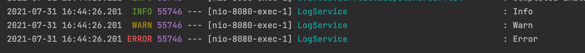
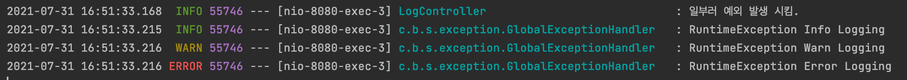
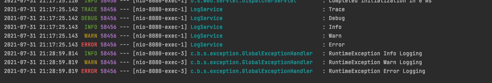
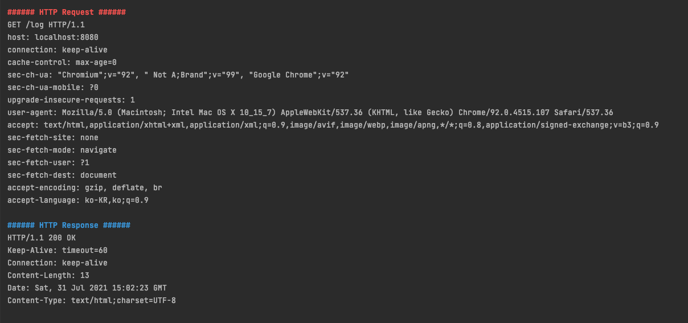

# Spring Boot 기반 Logback 설정 및 전략

<br>

# 목차

<br>

- [Spring Boot 기반 Logback 설정 및 전략](#spring-boot-기반-logback-설정-및-전략)
- [목차](#목차)
- [개요](#개요)
- [Spring Boot Logback Hello World](#spring-boot-logback-hello-world)
- [Spring Boot Logback 설정 1 - Spring Boot Properties (application.yml)](#spring-boot-logback-설정-1---spring-boot-properties-applicationyml)
  - [application.yml을 통한 기본 설정](#applicationyml을-통한-기본-설정)
  - [기본 설정의 원리](#기본-설정의-원리)
- [Spring Boot Logback 설정 2 - logback-spring.xml](#spring-boot-logback-설정-2---logback-springxml)
- [Spring Boot Logback 설정 3 - logback-access.xml](#spring-boot-logback-설정-3---logback-accessxml)
- [Spring Boot Logback 활용 1 - profile 전략](#spring-boot-logback-활용-1---profile-전략)
- [출처](#출처)

<br>

# 개요
Logback은 log4j 프로젝트의 후속 프로젝트이다. 

Logback이 log4j 보다 많은 이점을 가지고 있다. 자세한 내용은 [여기](http://logback.qos.ch/reasonsToSwitch.html)를 참고하자.

Logback은 기본적으로 세 개의 모듈로 나눠진다. 
* `logback-core`: 이 모듈은 다른 두 모듈의 토대를 마련한다.
* `logback-classic`: logback의 기본 기능.
* `logback-access`: Tomcat 및 Jetty와 같은 Servlet 컨테이너와 통합하여 HTTP 액세스 로그 기능을 제공한다.

이번 글에선 Spring Boot 환경에서 Logback을 사용하는 방법에 대해서 다룬다. 

처음엔 스프링 부트에서의 Logback Hello World를 시작으로, Logback 설정 방법들을 정리하였다.

<br>

# Spring Boot Logback Hello World
> Spring Boot 2.5.3 바탕으로 작성된 예시입니다.

<br>

우선 Logback을 통해 로그를 남기는 간단한 Hello World를 진행해보자.

로그를 확인하는 목적이기 때문에 아래와 같이 코드를 간단히 만들어 준다.

```java
@Service
public class LogService {

    private final Logger logger = LoggerFactory.getLogger(this.getClass().getSimpleName());

    public void log() {
        logger.trace("Trace");
        logger.debug("Debug");
        logger.info("Info");
        logger.warn("Warn");
        logger.error("Error");
    }
}
```
간단히 `log()`라는 메서드를 실행하면 모든 로그가 실행되도록 작성해준다.

<br>

예외 처리를 위한 `ExceptionHandler`도 간단히 설정해주자.

```java
@RestControllerAdvice
@Slf4j
public class GlobalExceptionHandler {

    @ExceptionHandler(RuntimeException.class)
    public ResponseEntity<String> runtimeExceptionHandler() {
        log.trace("RuntimeException Trace Logging");
        log.debug("RuntimeException Debug Logging");
        log.info("RuntimeException Info Logging");
        log.warn("RuntimeException Warn Logging");
        log.error("RuntimeException Error Logging");
        return ResponseEntity.ok("exception handler");
    }
}
```
> `lombok`의 `Slf4j` 애노테이션을 사용하면 자동으로 `log` 상태를 만들어준다.

<br>

```java
@RestController
public class LogController {

    private final Logger logger = LoggerFactory.getLogger(this.getClass().getSimpleName());

    private LogService logService;

    public LogController(LogService logService) {
        this.logService = logService;
    }

    @GetMapping("/log")
    public ResponseEntity<String> log() {
        logService.log();
        return ResponseEntity.ok("hello logging");
    }

    @GetMapping("/exception")
    public ResponseEntity<Void> exception() {
        logger.info("일부러 예외 발생 시킴.");
        throw new RuntimeException();
    }
}
```
마지막으로 표현 계층을 만들어주고 애플리케이션을 돌려보자.

<br>

이제 애플리케이션을 작동시켜서 로깅을 확인해보자.

> 1. `localhost:8080/log`

<p align="center"></p>

`LoginService`에서 `INFO`, `WARN`, `ERROR`의 로그가 남은 것을 확인할 수 있다.

<br>

> 2. `localhost:8080/exception`

<p align="center"> </p>

여기서도 마찬가지로 `INFO`, `WARN`, `ERROR`가 로그로 남은 것을 볼 수 있다.

> 여기서 중요한 점은 `DEBUG`, `ERROR`는 남지 않았다는 것이다.
> 
> 이것을 통해 SpringBoot에서 root의 로깅 전략은 `INFO`인 것을 유추해낼 수 있다.

<br>

# Spring Boot Logback 설정 1 - Spring Boot Properties (application.yml)

<br>

## application.yml을 통한 기본 설정

[Logback Hello World](#logback-hello-world)를 통해 SpringBoot는 기본적으로 root의 로깅 전략이 `INFO`라는 것을 알았다.

하지만 만약 더 낮은 레벨까지 보거나, 더 높은 레벨부터 로깅을 보고 싶으면 따로 설정을 해주어야 한다.

이제 `application.yml`을 통해 로깅 설정하는 방법을 알아보자.

> 우선 이 방법은 개발 환경에서 콘솔에 로그를 출력하거나, Profile을 사용하지 않는 간단한 경우에 사용하기 좋다.
> 
> 더 세세한 설정하는 방법은 [아래 챕터](#spring-boot-logback-설정-2---logback-springxml)에서 다룰 예정이다.

<br>

**`application.yml`의 활용도 높은 설정**

> 더 많은 설정은 [여기](https://docs.spring.io/spring-boot/docs/2.1.5.RELEASE/reference/html/boot-features-logging.html#boot-features-custom-log-configuration)서 확인 가능하다.

|Spring Boot Properties|System Property|description|
|---|---|---|
|`logging.file`|`LOG_FILE`|절대 경로로 표현되거나 현재 경로의 상대 경로로 로그 파일명을 지정한다.|
|`logging.file.path`|`---`|`logging.file`의 값이 없을 때 동작한다. 지정된 경로에 `spring.log`로 로그를 남긴다.|
|`logging.file.max-size`|`LOG_FILE_MAX_SIZE`|로그 파일의 사이즈가 지정된 임계치를 초과하면 파일명에 index를 추가한 후 새로운 파일을 작성한다.|
|`logging.file.max-history`|`LOG_FILE_MAX_HISTORY`|지정한 일수가 지난 로그를 자동으로 삭제해준다.|
|`logging.level.*`|---|path 기반으로 logger의 level을 지정한다.|

> `logging.file.max-history`의 부가 설명 - [출처](https://meetup.toast.com/posts/149)
> * File Appender는 `RollingFileAppender`를 사용함.
> * `spring-boot 1.5.x`까진
>   * `SizeBaseTriggeringPolicy`여서 파일 크기가 특정 값에 도달하면 새로운 파일을 만드는 방식이었음.
> * `spring-boot 2.0.0`부터
>   * `SizeAndTimeBasedRollingPolicy`로 변경됨. 기본 설정으로 로그가 일별로 남고, `logging.file.max-history`에 지정한 일수가 지난 로그를 자동으로 삭제해줌.

<br>

**로깅을 file로 저장하고 level을 설정하는 예시**

```yml
logging:
  level:
    root: INFO
    LogService: TRACE
    GlobalExceptionHandler: TRACE
    com.binghe.springbootlearningsandbox.presentation: DEBUG
  file:
    name: /Users/binghe819/Desktop/spring.log
```
* Level 설정
  * root는 말 그대로 애플리케이션 root 패키지를 의미한다.
  * `LogService`, `GlobalExceptionHandler`와 같이 특정 클래스는 어떤 레벨을 사용할 지 설정가능하다.
  * `com....presentation`와 같이 특정 패키지는 어떤 레벨을 사용할 지 설정가능하다.
* file 설정
  * 로그 내용을 파일로 저장하고 싶을 곳을 지정해줄 수 있다.

<p align="center">설정 후 결과</p>

<br>

## 기본 설정의 원리

Spring Boot는 어떻게 `application`만 설정하면 로깅 설정을 해줄 수 있을까?

아래 Spring의 기본 설정을 보면 파악할 수 있다.

<br>

**org.springframework.boot.logging.logback.base.xml**

```xml
<?xml version="1.0" encoding="UTF-8"?>

<!--
Base logback configuration provided for compatibility with Spring Boot 1.1
-->

<included>
	<include resource="org/springframework/boot/logging/logback/defaults.xml" />
	<property name="LOG_FILE" value="${LOG_FILE:-${LOG_PATH:-${LOG_TEMP:-${java.io.tmpdir:-/tmp}}}/spring.log}"/>
	<include resource="org/springframework/boot/logging/logback/console-appender.xml" />
	<include resource="org/springframework/boot/logging/logback/file-appender.xml" />
	<root level="INFO">
		<appender-ref ref="CONSOLE" />
		<appender-ref ref="FILE" />
	</root>
</included>
```
* `<include resource=".../default.xml">`
  * `default.xml`에서 Console log Pattern과 File Log Pattern의 기본 값을 읽어온다.
  * 이외에도 `tomcat`이나 `hibernate`등의 모듈의 log level설정이 되어 있다.
* `<property name="LOG_FILE" ...>`
  * `${LOG_FILE}`이 없으면 `${LOG_PATH}`를 불러온다.
  * `${LOG_PATH}`가 없다면 `${LOG_TEMP}`를 불러온다.
  * `application.yml`의 property를 어떻게 불러오는지 이를 통해 알 수 있다.
* `<incluce resource=".../console-appender.xml">`
  * Console Appender 설정을 읽어온다.
* `<include resource=".../file-appender.xml">`
  * File Appender 설정을 읽어온다.

<br>

**org.springframework.boot.logging.logback.default.xml**

```xml
<?xml version="1.0" encoding="UTF-8"?>

<!--
Default logback configuration provided for import
-->

<included>
	<conversionRule conversionWord="clr" converterClass="org.springframework.boot.logging.logback.ColorConverter" />
	<conversionRule conversionWord="wex" converterClass="org.springframework.boot.logging.logback.WhitespaceThrowableProxyConverter" />
	<conversionRule conversionWord="wEx" converterClass="org.springframework.boot.logging.logback.ExtendedWhitespaceThrowableProxyConverter" />

	<property name="CONSOLE_LOG_PATTERN" value="${CONSOLE_LOG_PATTERN:-%clr(%d{${LOG_DATEFORMAT_PATTERN:-yyyy-MM-dd HH:mm:ss.SSS}}){faint} %clr(${LOG_LEVEL_PATTERN:-%5p}) %clr(${PID:- }){magenta} %clr(---){faint} %clr([%15.15t]){faint} %clr(%-40.40logger{39}){cyan} %clr(:){faint} %m%n${LOG_EXCEPTION_CONVERSION_WORD:-%wEx}}"/>
	<property name="CONSOLE_LOG_CHARSET" value="${CONSOLE_LOG_CHARSET:-default}"/>
	<property name="FILE_LOG_PATTERN" value="${FILE_LOG_PATTERN:-%d{${LOG_DATEFORMAT_PATTERN:-yyyy-MM-dd HH:mm:ss.SSS}} ${LOG_LEVEL_PATTERN:-%5p} ${PID:- } --- [%t] %-40.40logger{39} : %m%n${LOG_EXCEPTION_CONVERSION_WORD:-%wEx}}"/>
	<property name="FILE_LOG_CHARSET" value="${FILE_LOG_CHARSET:-default}"/>

	<logger name="org.apache.catalina.startup.DigesterFactory" level="ERROR"/>
	<logger name="org.apache.catalina.util.LifecycleBase" level="ERROR"/>
	<logger name="org.apache.coyote.http11.Http11NioProtocol" level="WARN"/>
	<logger name="org.apache.sshd.common.util.SecurityUtils" level="WARN"/>
	<logger name="org.apache.tomcat.util.net.NioSelectorPool" level="WARN"/>
	<logger name="org.eclipse.jetty.util.component.AbstractLifeCycle" level="ERROR"/>
	<logger name="org.hibernate.validator.internal.util.Version" level="WARN"/>
	<logger name="org.springframework.boot.actuate.endpoint.jmx" level="WARN"/>
</included>
```

<br>

**org/springframework/boot/logging/logback/console-appender.xml**

```xml
<?xml version="1.0" encoding="UTF-8"?>

<!--
Console appender logback configuration provided for import, equivalent to the programmatic
initialization performed by Boot
-->

<included>
	<appender name="CONSOLE" class="ch.qos.logback.core.ConsoleAppender">
		<encoder>
			<pattern>${CONSOLE_LOG_PATTERN}</pattern>
			<charset>${CONSOLE_LOG_CHARSET}</charset>
		</encoder>
	</appender>
</included>

```

<br>

**org/springframework/boot/logging/logback/file-appender.xml**

```xml
<?xml version="1.0" encoding="UTF-8"?>

<!--
File appender logback configuration provided for import, equivalent to the programmatic
initialization performed by Boot
-->

<included>
	<appender name="FILE" class="ch.qos.logback.core.rolling.RollingFileAppender">
		<encoder>
			<pattern>${FILE_LOG_PATTERN}</pattern>
			<charset>${FILE_LOG_CHARSET}</charset>
		</encoder>
		<file>${LOG_FILE}</file>
		<rollingPolicy class="ch.qos.logback.core.rolling.SizeAndTimeBasedRollingPolicy">
			<fileNamePattern>${LOGBACK_ROLLINGPOLICY_FILE_NAME_PATTERN:-${LOG_FILE}.%d{yyyy-MM-dd}.%i.gz}</fileNamePattern>
			<cleanHistoryOnStart>${LOGBACK_ROLLINGPOLICY_CLEAN_HISTORY_ON_START:-false}</cleanHistoryOnStart>
			<maxFileSize>${LOGBACK_ROLLINGPOLICY_MAX_FILE_SIZE:-10MB}</maxFileSize>
			<totalSizeCap>${LOGBACK_ROLLINGPOLICY_TOTAL_SIZE_CAP:-0}</totalSizeCap>
			<maxHistory>${LOGBACK_ROLLINGPOLICY_MAX_HISTORY:-7}</maxHistory>
		</rollingPolicy>
	</appender>
</included>
```
* `SizeAndTimeBasedRollingPolicy`가 사용되는 것을 알 수 있다.

<br>

# Spring Boot Logback 설정 2 - logback-spring.xml

스프링 부트에서 제공해주는 `application.yml`으로도 다양한 설정이 가능하지만, 한계가 있고 세부적인 설정을 불편하다.

이럴 때 직접 `logback-spring.xml`을 별도로 만들어서 로그를 관리할 수 있다.

`logback-spring.xml`은 크게 `appender`와 `logger`로 나눌 수 있다.

* `appender`: 콘솔, 파일, DB등 로그를 출력 및 저장하는 방법을 지정.
* `logger`: 해당 로거가 사용될 패키지와 로그 레벨을 설정.

```xml
<?xml version="1.0" encoding="UTF-8"?>
<configuration>
    <property name="LOGS_ABSOLUTE_PATH" value="/Users/binghe819/Desktop" />
    <include resource="org/springframework/boot/logging/logback/base.xml"/>

    <appender name="STDOUT" class="ch.qos.logback.core.ConsoleAppender">
        <layout class="ch.qos.logback.classic.PatternLayout">
            <Pattern>[%d{yyyy-MM-dd HH:mm:ss}:%-3relative][%thread] %-5level %logger{36} - %msg%n</Pattern>
        </layout>
    </appender>

    <appender name="FILE" class="ch.qos.logback.core.rolling.RollingFileAppender">
        <file>${LOGS_ABSOLUTE_PATH}/logback.log</file>
        <encoder>
            <pattern>[%d{yyyy-MM-dd HH:mm:ss}:%-3relative][%thread] %-5level %logger{35} - %msg%n</pattern>
        </encoder>
        <rollingPolicy class="ch.qos.logback.core.rolling.TimeBasedRollingPolicy">
            <fileNamePattern>${LOGS_ABSOLUTE_PATH}/logback.%d{yyyy-MM-dd}.%i.log.gz</fileNamePattern>
            <timeBasedFileNamingAndTriggeringPolicy class="ch.qos.logback.core.rolling.SizeAndTimeBasedFNATP">
                <maxFileSize>5MB</maxFileSize>
            </timeBasedFileNamingAndTriggeringPolicy>
            <maxHistory>30</maxHistory>
        </rollingPolicy>
    </appender>

    <root level="INFO">
        <appender-ref ref="STDOUT" />
    </root>

    <logger name="org.springframework.web" level="DEBUG">
        <appender-ref ref="STDOUT" />
        <appender-ref ref="FILE" />
    </logger>
</configuration>
```

<br>

`<include>`를 사용해서 `appender`를 분리할 수도 있다.


```xml
<?xml version="1.0" encoding="UTF-8"?>
<configuration>
    <property name="LOGS_ABSOLUTE_PATH" value="/Users/binghe819/Desktop" />
    <include resource="org/springframework/boot/logging/logback/base.xml"/>

    <!-- include를 통한 설정 -->
    <include resource="logback/stdout-appender.xml"/>
    <include resource="logback/file-appender.xml"/>

    <root level="INFO">
        <appender-ref ref="STDOUT" />
    </root>

    <logger name="org.springframework.web" level="DEBUG">
        <appender-ref ref="STDOUT" />
        <appender-ref ref="FILE" />
    </logger>
</configuration>
```

```xml
<!-- logback/file-appender.xml -->
<included>
  <appender name="FILE" class="ch.qos.logback.core.rolling.RollingFileAppender">
    <file>${LOGS_ABSOLUTE_PATH}/logback.log</file>
    <encoder>
      <pattern>[%d{yyyy-MM-dd HH:mm:ss}:%-3relative][%thread] %-5level %logger{35} - %msg%n</pattern>
    </encoder>
    <rollingPolicy class="ch.qos.logback.core.rolling.TimeBasedRollingPolicy">
      <fileNamePattern>${LOGS_ABSOLUTE_PATH}/logback.%d{yyyy-MM-dd}.%i.log.gz</fileNamePattern>
      <timeBasedFileNamingAndTriggeringPolicy class="ch.qos.logback.core.rolling.SizeAndTimeBasedFNATP">
        <maxFileSize>15MB</maxFileSize>
      </timeBasedFileNamingAndTriggeringPolicy>
      <maxHistory>30</maxHistory>
    </rollingPolicy>
  </appender>
</included>
```

```xml
<!-- logback/stdout-appender.xml -->
<included>
  <appender name="STDOUT" class="ch.qos.logback.core.ConsoleAppender">
    <layout class="ch.qos.logback.classic.PatternLayout">
      <Pattern>[%d{yyyy-MM-dd HH:mm:ss}:%-3relative][%thread] %-5level %logger{36} - %msg%n</Pattern>
    </layout>
  </appender>
</included>
```

<br>

# Spring Boot Logback 설정 3 - logback-access.xml
이번엔 `logback-access.xml`를 통해 HTTP 접근 로그를 남겨본다.

<br>

우선 아래 의존성을 추가해줘야한다.

```gradle
implementation 'net.rakugakibox.spring.boot:logback-access-spring-boot-starter:2.7.1'
```

<br>

그리고 `logback-spring`와 비슷하게 설정해주면 된다.

```xml
<?xml version="1.0" encoding="UTF-8"?>
<configuration>
  <statusListener class="ch.qos.logback.core.status.OnConsoleStatusListener" />

  <property name="LOGS_ABSOLUTE_PATH" value="/Users/binghe819/Desktop" />

  <appender name="STDOUT" class="ch.qos.logback.core.ConsoleAppender">
    <encoder>
      <charset>utf8</charset>
      <pattern>
        %n%boldRed(###### HTTP Request ######) %n%fullRequest%boldBlue(###### HTTP Response ######) %n%fullResponse
      </pattern>
    </encoder>
  </appender>

  <appender name="FILE" class="ch.qos.logback.core.rolling.RollingFileAppender">
    <file>${LOGS_ABSOLUTE_PATH}/access.log</file>
    <rollingPolicy class="ch.qos.logback.core.rolling.TimeBasedRollingPolicy">
      <fileNamePattern>${LOGS_ABSOLUTE_PATH}/access-%d{yyyyMMdd}-%i.log</fileNamePattern>
      <timeBasedFileNamingAndTriggeringPolicy class="ch.qos.logback.core.rolling.SizeAndTimeBasedFNATP">
        <maxFileSize>15MB</maxFileSize>
      </timeBasedFileNamingAndTriggeringPolicy>
      <maxHistory>30</maxHistory>
    </rollingPolicy>
    <encoder>
      <charset>utf8</charset>
      <Pattern>
        %n%boldRed(###### HTTP Request ######) %n%fullRequest%boldBlue(###### HTTP Response ######) %n%fullResponse
      </Pattern>
    </encoder>
  </appender>

  <appender-ref ref="STDOUT"/>
  <appender-ref ref="FILE"/>
</configuration>
```

<br>

그럼 아래와 같이 콘솔와 파일에서 모두 로그를 볼 수 있다.

<p align="center"> </p>

<br>

# Spring Boot Logback 활용 1 - profile 전략

스프링 부트로 개발하다보면 active profile을 통해 각 상황별 설정을 달리한다. (ex. dev, prod, test등등)

Spring Boot는 Logback도 profile마다 설정을 달리할 수 있도록 `spring logback extension`을 지원한다.

> 주의할 점은 스프링에서 제공하는 Extension은 가능한 `logback-spring.xml`이나 `logging.config`에서 사용하라고 한다.
> 
> 그 이유는 `logback.xml`파일이 일찍 로딩되기 때문에, spring이 설정을 제대로 로딩하려면 위 두 개에서만 사용하는 것을 권장한다.

```xml
<springProfile name="staging">
	<!-- configuration to be enabled when the "staging" profile is active -->
</springProfile>

<springProfile name="dev | staging">
	<!-- configuration to be enabled when the "dev" or "staging" profiles are active -->
</springProfile>

<springProfile name="!production">
	<!-- configuration to be enabled when the "production" profile is not active -->
</springProfile>
```
* `<springProfile>`태그를 사용하면 active profile을 기반으로 logback을 설정할 수 있다.
  * 이 설정은 `<configuration>`태그 안에서만 사용 가능하다.

<br>

**예시 1**

```xml
<?xml version="1.0" encoding="UTF-8"?>
<configuration debug="false">
  <include resource="org/springframework/boot/logging/logback/base.xml"/>

  <springProfile name="prod, local">
    <include resource="logback/stdout-appender.xml"/>
    <include resource="logback/file-appender.xml"/>
    <logger name="com.binghe819" level="INFO">
      <appender-ref ref="FILE"/>
    </logger>
    <logger name="org.springframework" level="INFO" additivity="false">
      <appender-ref ref="FILE"/>
      <appender-ref ref="STDOUT"/>
    </logger>
  </springProfile>

  <springProfile name="test">
    <include resource="logback/stdout-appender.xml"/>
    <logger name="com.binghe819" level="TRACE">
      <appender-ref ref="STDOUT"/>
    </logger>
  </springProfile>
</configuration>
```

<br>

**예시 2**

```xml
<?xml version="1.0" encoding="UTF-8"?>

<configuration>
    <timestamp key="BY_DATE" datePattern="yyyy-MM-dd"/>
    <property name="LOG_PATTERN"
              value="[%d{yyyy-MM-dd HH:mm:ss}:%-4relative] %green([%thread]) %highlight(%-5level) %boldWhite([%C.%M:%yellow(%L)]) - %msg%n"/>

    <springProfile name="!prod">
        <include resource="console-appender.xml"/>

        <root level="INFO">
            <appender-ref ref="CONSOLE"/>
        </root>
    </springProfile>

    <springProfile name="prod">
        <include resource="file-info-appender.xml"/>
        <include resource="file-warn-appender.xml"/>
        <include resource="file-error-appender.xml"/>

        <root level="INFO">
            <appender-ref ref="FILE-INFO"/>
            <appender-ref ref="FILE-WARN"/>
            <appender-ref ref="FILE-ERROR"/>
        </root>
    </springProfile>
</configuration>
```

<br>

# 출처
- https://www.sangkon.com/hands-on-springboot-logging/
- https://meetup.toast.com/posts/149
- https://woowacourse.github.io/tecoble/post/2020-07-30-use-logger/
- http://logback.qos.ch/
- https://docs.spring.io/spring-boot/docs/2.1.5.RELEASE/reference/html/boot-features-logging.html
- https://www.baeldung.com/logback
