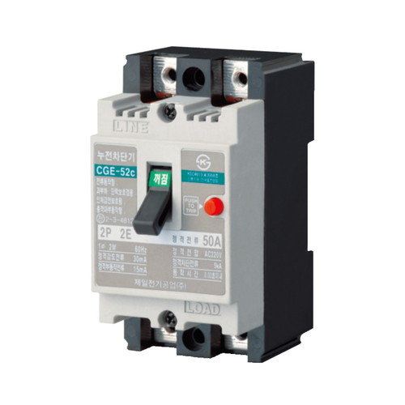
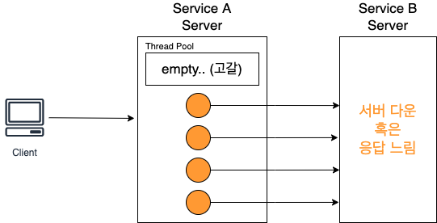
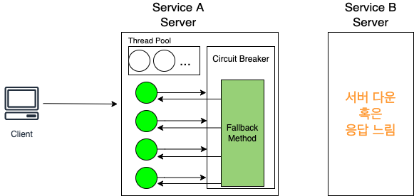
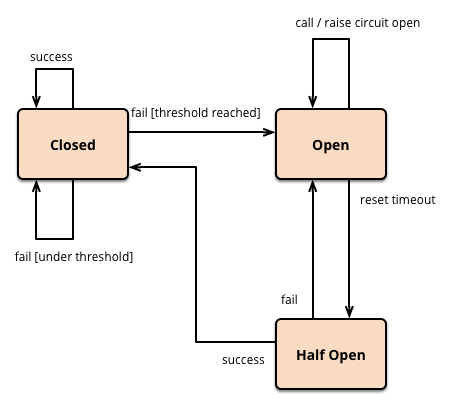

# 목차

 

- [목차](#목차)
- [들어가며](#들어가며)
- [서킷 브레이커의 의미](#서킷-브레이커의-의미)
- [API 호출간의 서킷 브레이커](#api-호출간의-서킷-브레이커)
- [서킷 브레이커의 두 가지 방식](#서킷-브레이커의-두-가지-방식)
- [서킷 브레이커의 동작 원리](#서킷-브레이커의-동작-원리)
- [마치며](#마치며)
- [참고](#참고)

 

# 들어가며
MSA는 아키텍처의 특성상 각 컴포넌트는 서비스 형태로 구현되고 API를 이용하여 타 서비스와 통신하게 된다.

이를통해 MSA는 컴포넌트간의 의존성을 없애고 독립된 배포가 가능하며, 확장에 유연하면서 트래픽이 몰리는 컴포넌트의 서버만 증설해주면되는등 다양한 장점이 존재한다.

**문제는 하나의 컴포넌트 서버가 응답이 늦거나 전혀 응답하지 않는 경우, 각 서버의 API 요청 스레드풀이 고갈되어 클라이언트 응답이 늦어지거나, 심한 경우 전체 시스템에 장애가 전파되어 서비스 장애로 이어질 수 있다.**

이러한 **문제를 해결해주는 개념이 바로 서킷 브레이커이다.**

**서킷 브레이커는 대규모 시스템 환경에서 느리거나 응답하지 않는 다운스트림 서비스가 발생했을 때 피해를 최소화해주는 역할을한다.**

이번 글은 resilience4j를 이용한 학습 테스트하기에 앞서, 서킷 브레이커의 의미와 MSA에서의 서킷 브레이커 역할이 무엇인지 알아본다.

> 참고로 서킷 브레이커는 꼭 MSA 아키텍처에서만 사용되는 것이 아니다.
> 
> 하나의 API 서버에서 다른 API 서버에 서비스 호출을 하는 경우 어디든 사용이 가능하다.

 

# 서킷 브레이커의 의미
우선 서킷 브레이커의 일반적인 개념을 먼저 살펴보고, MSA에서의 서킷 브레이커는 왜 필요한지 그림을 통해 살펴본다.

> 필자의 경우 특정 기술을 배울 때, 해당 기술의 언어 기원부터 살펴본다. 그래야 기술이 더 가깝게 느껴지기 때문이다.

 

💁‍♂️ **서킷 브레이커 사전적 의미**

 출처: https://namu.wiki/w/서킷브레이커 

서킷 브레이커는 Circuit (회로)와 Breaker (차단기)를 합친 단어이다.

단어에서도 쉽게 알 수 있듯이, 회로를 차단하는 역할이며, **흔히 "두꺼비 집"이라고 많이 불리운다.**

**전로를 수동 또는 전기 조작에 의해 개폐함으로써 과부하, 단로, 누전 등으로부터 전기 회로를 보호하는 안전장치이다.**

 

💁‍♂️ **서킷 브레이커의 용어는 다양한 분야에서 활용된다.**

**서킷 브레이커는 어떠한 동작이 일정 시간동안 과부하가 걸리거나 잘못된 경우, 차단하거나 대체로 다른 동작이 발생한다는 개념이다.**

이러한 개념을 다양한 분야에서 활용할 수 있으며, 실제로 주식 시장에서도 사용된다.

**주식 시장에선 주가가 일정 수준 이상 급락하는 경우 시장이 안정될 수 있도록 특정 기간 동안 거래 활동(매수 또는 매입)을 일시적으로 중단하는 것을 의미한다.**

이러한 **개념이 컴퓨터 분야에서도 활용된다고 보면 된다. 그리고 이번 글의 주제도 MSA 환경에서의 resilience4j를 이용한 서킷브레이커이다.**

 

# API 호출간의 서킷 브레이커
MSA 아키텍처는 여러 서비스 컴포넌트를 각각의 서버로 나눠서 컴포넌트간에 호출하는 형태를 가진다.

이 아키텍처의 가장 큰 문제점은 하나의 컴포넌트가 느려지거나 장애가 발생하면, 컴포넌트를 호출한 컴포넌트까지 장애가 전파된다는 특성을 가진다.

> 다시 말하지만.. MSA 아키텍처가 아닌 서비스간의 API 호출을하는 모든 상황에 서킷브레이커는 사용이 가능하다.

 

💁‍♂️ **서킷 브레이커가 없다면**

 

위와 같이 Service A가 Service B를 호출하는 과정에서 Service B가 응답이 느리거나 못한다고 가정해본다.

각 서버는 보통 스레드 풀을 이용하여 스레드 기반의 API 호출을한다.

위와 같은 상황이라면, Service A가 Service B에 호출할 때 사용한 스레드가 계속해서 응답을 기다리는 상태가 된다.

그리고 여러 호출이 지속적으로 응답이 늦어지면 끝내 스레드 풀엔 스레드가 남지않아 Service A는 다른 서버(Service B 포함)에도 API 요청을 할 수 없게된다.

즉, Service B 서버의 장애가 Service A까지 전파되는 것이다. 그리고 Service A는 끝내 스레드 풀을 모두 사용함으로써 전체 시스템 장애로까지 이어질 수 있다.

 

💁‍♂️ **서킷 브레이커가 있다면**

만약 위와 같은 상황에서 서킷 브레이커가 있다면, 아래와 같이 Service B로의 호출을 강제적으로 끊고 Fallback 메서드를 실행하여 결과를 반환하게 된다.

 

Fallback 메서드란 서킷 브레이커에서 Service B가 정상적인 응답을 할 수 없다고 판단된다면, 설정에 따라 다른 메시지를 리턴하기위해 실행하는 메서드를 의미한다.

이를 통해 Service A에서의 스레드들이 더 이상 요청을 기다리지 않아 Service B로 가는 호출을 제외한 다른 호출을 문제가 없다.

이를 통해 장애가 전파되는 것을 방지할 수 있다.

 

💁‍♂️ **예시를 들어보자면**

간단한 예시를 들어보자면, Service A는 배달 앱의 메인 홈 화면을 뿌려주는 전시 서버고, Service B는 데이터 기반의 배달 예상 시간을 알려주는 서비스라고 가정해본다.

이때 배달 예상 시간을 알려주는 서버가 장애가 났다면, 전시 서버는 응답을 기다리느라 자신의 핵심 역할인 화면을 뿌려주는 것이 점차 느려지거나 장애가 발생한다.

 

이런 경우 서킷 브레이커를 사용한다면, 전시 서버는 일정 수준의 에러를 응답받거나 timeout이 지난다면, 기존의 지정한 디폴트 평균 배달 예상 시간을 내려줌으로써 서비스가 느려지는 문제와 장애로부터 벗어날 수 있게된다.

 

# 서킷 브레이커의 두 가지 방식
서킷 브레이커는 크게 두 가지 방식으로 나뉜다.

1. API 호출하는 서비스 컴포넌트 서버에서 서킷 브레이커 **소프트웨어를 사용하는 방식.**
   * 서버 인프라를 관리할 필요가 없지만, 서버 코드안에 서킷 브레이커 코드가 침투하며, 서버의 프로그래밍 언어에 종속되는 문제가 있다.
2. 인프라적으로 서킷 브레이커 역할만을 하는 **서버를 따로 두는 방식.**
   * 서버 코드나 프로그래밍 언어에 종속되지 않지만, 서킷 브레이커용 서버를 따로 관리해줘야하는 부담이 있다.

 

# 서킷 브레이커의 동작 원리
위에서 봤듯이, 서킷 브레이커는 어떠한 동작이 일정 시간동안 과부하가 걸리거나 잘못된 경우, 차단하거나 대체로 다른 동작이 발생한다는 개념으로 아이디어가 굉장히 심플하다.

다만, **이를 실제 코드로 구현해야한다면 의문이 몇가지 든다.**

1. 서킷 브레이커는 언제 안전장치인 Fallback 메서드를 실행하는가? 실행 트리거가 무엇인가?
2. 만약 장애 방지를 위해 Fallback 메서드가 실행된 상태라면, 언제 다시 기존의 API 서버로 호출을 원복하는가?

 

**위 질문에 대한 해답으로 서킷 브레이커는 크게 3가지 상태를 이용하여 문제를 해결한다.**

 출처: https://martinfowler.com/bliki/CircuitBreaker.html 

* **서킷 브레이커는 평상시엔 `Closed` 상태이며, 이때 다른 API에 호출하는 모든 요청의 성공/실패 여부를 기록한다.**
  * 이때 서킷 브레이커는 bypass 역할을 수행하며 모든 요청을 기록한다.
  * **설정된 개수만큼 성공/실패 기록중 설정된 기준(ex. 퍼센트) 이상 실패가 발생했다면, 서킷브레이커는 `Open` 상태로 변경된다.**
* **`Open` 상태의 서킷브레이커는 Fallback 메서드를 수행한다.**
  * 즉, **이때부터 이어지는 호출은 timeout, 에러 발생 등 오류가 발생하지 않도록, 모든 요청을 Fallback 메서드로 리다이렉션한다.**
* **`Open` 상태에서 설정된 시간이 지나면 `Half-Open` 상태로 전환되며, 이어지는 호출에선 특정 개수만큼 새로운 호출을 허용하며, 이를 통해 기존의 문제를 일으킨 원인이 사라졌는지 확인한다.**
  * 만약 오류가 사라졌다면 서킷을 다시 `Closed` 상태로 변경되며, 다시 bypass 역할을 수행한다.
  * 만약 오류가 여전히 존재한다면, 다시 `Open` 상태로 변경되며, 일정 시간동안 Fallback 메서드가 실행된다.

 

# 마치며
기존의 필자는 하나의 API 호출이라도 에러가 발생한다면 서킷 브레이커가 Fallback 메서드를 실행하는 줄 알았다...

그래서 필자가 개발 및 관리하는 서비스에서 에러가 계속해서 발생하는중인데도, Fallback 메서드가 발생하지않아 당황했었다.. 

(서킷 브레이커를 필자가 구현하지 않았었다.)

Fallback이 발생하지 않은 원인은 `Closed` 상태에서 설정된 퍼센트만큼은 에러가 발생하지 않아 발생했던 문제였으며, 원인을 찾는 과정에서 이번 글을 작성하게되었다.

다음 글은 resilience4j를 이용한 Spring 환경에서의 실제 서킷 브레이커 학습 테스트를 진행해본다.

 

# 참고
* https://namu.wiki/w/서킷브레이커
* https://martinfowler.com/bliki/CircuitBreaker.html
