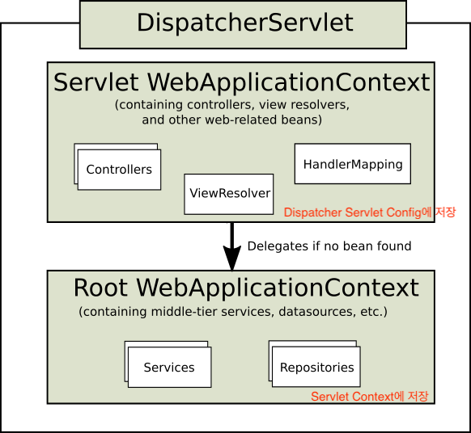

# 목차

- [DispatcherServlet](#dispatcherservlet)
  * [1 DispatcherServlet의 상속 계층](#1-dispatcherservlet의-상속-계층)
    + [1-1 상속 계층](#1-1-상속-계층)
    + [1-2 상속관계를 만드는 이유](#1-2-상속관계를-만드는-이유)
  * [2 DispatcherServlet 동작원리](#2-dispatcherservlet-동작원리)
    + [2-1 DispatcherServlet 초기화](#2-1-dispatcherservlet-초기화)
    + [2-2 DispatcherServlet 동작 순서](#2-2-dispatcherservlet-동작-순서)
  * [3 DispatcherServlet 구성요소](#3-dispatcherservlet-구성요소)
    + [3-1 MultipartResolver](#3-1-multipartresolver)
    + [3-2 LocaleResolver](#3-2-localeresolver)
    + [3-3 ThemeResolver](#3-3-themeresolver)
    + [3-4 HandlerMapping](#3-4-handlermapping)
    + [3-5 HandlerAdapter](#3-5-handleradapter)
    + [3-6 HandlerExceptionResolvers](#3-6-handlerexceptionresolvers)
    + [3-7 RequestToViewNamTranslator](#3-7-requesttoviewnamtranslator)
    + [3-8 ViewResolver](#3-8-viewresolver)
    + [3-9 FlashMapManager](#3-9-flashmapmanager)
- [참고](#참고)


# DispatcherServlet

`Front Controller Pattern` 을 적극 활용한 스프링 MVC의 핵심 `DispatcherServlet` 에 대해서 정리한 자료입니다.


## 1 DispatcherServlet의 상속 계층


### 1-1 상속 계층



<center> 출처 : Spring 레퍼런스</center>

* DispatcherServlet는 서블릿 컨텍스트에 등록되어 있는 애플리케이션 컨텍스트(Root WebApplicationContext)를 상속받는  애플리케이션 컨텍스트(Servlet WebApplicationContext)를 하나 더 만든다.

* 즉, **DispatcherServlet도 자체적으로 애플리케이션 컨텍스트(Servlet WebApplicationContext)를 하나 더 만드는데, 이때 서블릿 컨텍스트에 등록되어 있는 애플리케이션 컨텍스트(Root WebApplicationContext)를 부모로 삼아서 만든다.**


### 1-2 상속관계를 만드는 이유

* Root WebApplicationContext는 모든 서블릿에서 접근이 가능하다.
  * **서블릿 컨텍스트에 등록된 애플리케이션 컨텍스트** (Root WebApplicationContext)는 여러 다른 서블릿에서 공유해서 사용이 가능하다.
  * 즉, **부모 애플리케이션 컨텍스트는 모든 서블릿에서 접근이 가능하다.**
  * **Servlet Context에 저장하기 때문에 당연한 것.**
* Servlet WebApplicationContext는 해당 서블릿에서만 접근이 가능하다.
  * DispatcherServlet이 Root WebApplicationContext를 상속받아 만드는 Servlet WebApplicationContext는 해당 DispatcherServlet안에서만 사용이 가능하다.
  * 즉, DispatcherServlet는 다른 DispatcherServlet의 애플리케이션 컨텍스트를 모른다.
  * **Servlet Config에 저장하기 때문에 당연한 것.**
* **여러 DispatcherServlet를 만들고 공용으로 사용해야하는 Bean들을 공유하기 위해서 이런 상속 구조를 만들었다고 한다.**
  * 그러므로 **Root WebApplicationContext 에는 웹과 관련이 없는 `Service` 나 `Repository` 가 등록된다.**
  * **Servlet WebApplicationContext에는 웹과 관련된 빈 (`Controller`)들이 등록된다.**


> **꼭 이렇게 상속 계층을 만들지 않고, `Servlet WebApplicationContext` 만을 만들어 사용해도 상관없다.**
>
> 하지만 **여러 `Servlet` 에서 공유할 빈이 있다면 이렇게 상속을 만드는 것이 좋다.**


## 2 DispatcherServlet 동작원리


### 2-1 DispatcherServlet 초기화

* 다음의 특별한 타입의 빈들을 찾거나, 기본 전략에 해당하는 빈들을 등록한다.
* `HandlerMapping` -> `HandlerAdapter` -> (`HandlerExceptionResolver`) -> `ViewResolver` -> ...
  * `HandlerMapping` - 핸들러를 찾아주는 인터페이스
  * `HandlerAdapter` - 핸들러를 실행하는 인터페이스


### 2-2 DispatcherServlet 동작 순서

> 더 자세한 내용은 [Spring MVC Flow](https://github.com/binghe819/TIL/blob/master/Spring/MVC/Spring%20MVC%20flow.md)를 참고해주세요.


<center> 출처 : https://tutorialspedia.com/how-java-spring-mvc-works-spring-mvc-request-flow-explained-step-by-step/</center>

> 디버깅을 통해 한번 돌려보는 것이 큰 도움이 된다.

1. 요청을 분석한다. (로케일, 테마, 멀티파크 등등)

2. (핸들러 매핑에게 위임하여) 요청을 처리할 핸들러를 찾는다.

   * `getHandler(HttpServletRequest request)`

   * 요청을 처리할 `Controller` 를 찾는 과정

3. (등록되어 있는 핸들러 어댑터중) 해당 핸들러를 실행할 수 있는 "핸들러 어댑터"를 찾는다.

   * `getHandlerAdapter(Object handler)`
   * 찾은 `Controller` 를 처리할 수 있는 핸들러 어댑터를 찾는 과정.

4. 찾아낸 "핸들러 어댑터"를 사용해서 핸들러의 응답을 처리한다.

   * 핸들러의 리턴값을 보고 어떻게 처리할 지 판단한다.
     * 뷰 이름에 해당하는 뷰를 찾아서 모델 데이터를 랜더링한다.
     * `@ResponseEntity` 가 있다면 Converter를 사용해서 응답 본문을 만들고.

5. (부가적으로) 예외가 발생했다면, 예외 처리 핸들러에 요청 처리를 위임한다.

6. 최종적으로 응답을 보낸다.


## 3 DispatcherServlet 구성요소


### 3-1 MultipartResolver

* 사용자의 파일 업로드 요청에 대한 처리를 하는 인터페이스.

* `HttpServletRequest` 를 `MultipartHttpServletRequest` 로 변환해주어 요청을 담고 있는 `File` 을 꺼낼 수 있는 API 제공


### 3-2 LocaleResolver

* 요청하는 클라이언트의 위치(Locale) 정보를 파악하는 인터페이스.
  * 지역정보를 읽어서 적절한 언어를 선택할 때 사용된다.
  * 헤더값의  `accept-language` 를 읽고 처리하는 것이 기본값.
* 기본 전략으로는 요청의 accept-language를 보고 판단하는 `AcceptHeaderLocaleResolver` 가 사용된다.


### 3-3 ThemeResolver

* 애플리케이션에 설정된 테마를 파악하고 변경할 수 있는 인터페이스
  * 웹 브라우저에서 버튼 누르면 테마를 바꾸는 것을 Spring에서 자체적으로 해주는 것.
  * 즉, View에게 `css` 파일을 넘겨줘서 테마를 바꿀 수 있게 해준다.


### 3-4 HandlerMapping

* 요청을 처리할 핸들러를 찾는 인터페이스
  * **즉, 요청을 처리할 `Controller` 를 찾는 인터페이스**


* `BeanNameUrlHandlerMapping` - 빈의 이름을 기반으로 핸들러를 찾아준다. (클래스가 핸들러가 된다.)
* `RequestMappingHandlerMapping` - 애노테이션 기반 핸들러를 찾아준다. (메서드가 핸들러가 된다.)


### 3-5 HandlerAdapter

* `HandlerMapping` 이 찾아낸 **핸들러를 처리하는 인터페이스**

* 스프링 MVC 확장력의 핵심
  * 개발자가 핸들러를 커스텀하여 사용이 가능하다.


* `RequestMappingHandlerAdapter` - 애노테이션 기반으로 찾아낸 핸들러를 처리해준다.


### 3-6 HandlerExceptionResolvers

* 요청 처리 중에 발생한 에러 처리하는 인터페이스


### 3-7 RequestToViewNamTranslator

* **핸들러에게 뷰 이름을 명시적으로 리턴하지 않는 경우, 요청을 기반으로 뷰 이름을 판단하는 인터페이스**

```java
@GetMapping("/test")
public void test(){ // 핸들러가 리턴을 하지 않는다.
}
```


### 3-8 ViewResolver

* 뷰 이름(`String`) 에 해당하는 뷰를 찾아내는 인터페이스


### 3-9 FlashMapManager

* `FlashMap` 인스턴스를 가져오고 저장하는 인터페이스
* `FlashMap` 은 **주로 리다이렉션을 사용할 때 요청 매개변수를 사용하지 않고 데이터를 전달하고 정리할 때 사용한다.**
  * URL에 매개변수를 사용하지 않고 보낼 수 있게 해준다.


# 참고

* [백기선님의 MVC 강의](https://www.inflearn.com/course/%EC%9B%B9-mvc/dashboard)
* https://tutorialspedia.com/how-java-spring-mvc-works-spring-mvc-request-flow-explained-step-by-step/
* https://docs.spring.io/spring-framework/docs/current/spring-framework-reference/web.html#mvc


