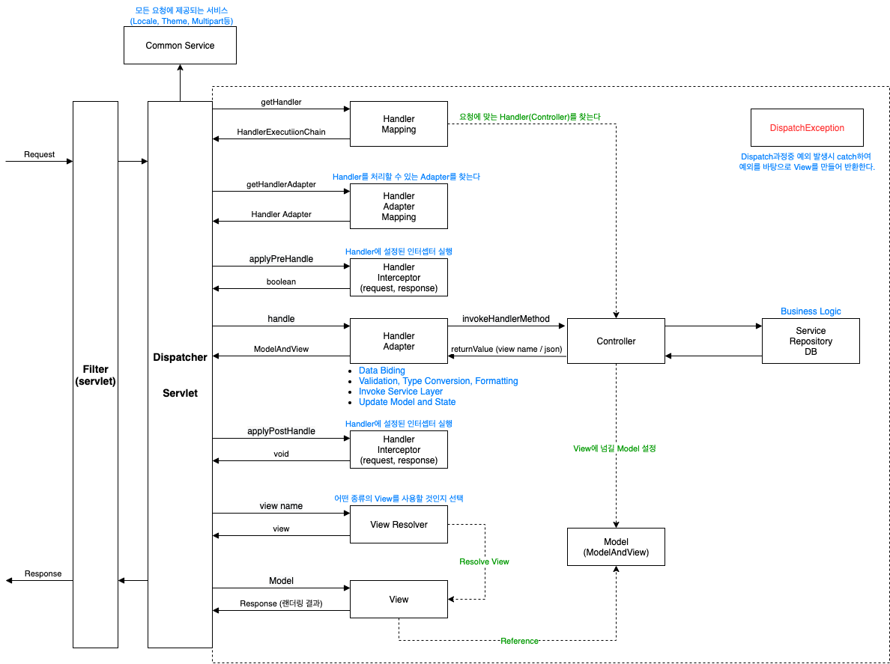

# Spring MVC 처리 과정

 

**Spring MVC의 핵심은 `DispatcherServlet` 이다.**

1. 모든 요청에 대한 서블릿 필터가 실행된다 (설정되어있다면)
2. 모든 요청은 `DispatcherServlet`에게 전달된다.
3. `DispatcherServlet` 은 받은 요청을 **분석**한다. (Common Service)
   * Locale, Theme, Multipart

 HandlerMapping이 반환하는 HandlerExecutionChain객체

4. `DispatcherServlet` 은 **`HandlerMapping` 에게 위임하여 요청을 처리할 `Handler (Controller)` 를 찾는다.**
   * `HandlerMapping` 은 요청 URL을 보고 `Handler`를  찾아서 `Handler` 의 이름과 함께 반환한다.
   * 이때 반환되는 것은 `HandlerExecutionChain`타입이다. (handler과 인터셉터 관련 상태를 가지고 있다.)
5. `DispatcherServlet` 은 찾아낸 `Handler` 를 실행할 수 있는 `HandlerAdapter` 를 찾는다.
6. 찾아낸 **`HandlerAdapter` 를 사용해서 `Handler` 를 실행한다.**
   * 실행 전에 전처리, 후처리로 실행해야할 인터셉터 목록을 결정하고 실행시킨다.
   * `Handler` 를 실행하면서 비즈니스 로직 또한 실행한다.
   * **`Handler`의 리턴값 : View(뷰의 파일명), Model(비즈니스 로직 처리한 후의 데이터)**
7. `DispatcherServlet` 은 **`ViewResolver` 에게 `View` 의 이름을 전달하고 `View` 객체를 얻는다.**
   * 뷰 이름에 해당하는 뷰을 찾는 단계
   * `View Resolver` 는 전략 객체이며 `view name` 뿐 아니라 헤더 정보(`accept`)도 전달된다.
   * `View Resolver` 는 전달된 정보를 바탕으로 사용자에게 보여줄 `View` 가 무엇인지 결정한다.
8. `DispatcherServlet` 은 `View` 객체에게 `Model` 과 함께 화면 표시를 의뢰한다.
9. `View` 는 해당하는 뷰를(ex. JSP, Thymleaf..) 호출하며, `Model` 객체에서 화면 표시에 필요한 정보를 가져와 화면 표시를 처리한다.
   * 찾은 뷰에 모델 데이터를 랜더링하고 요청의 응답값을 생성한다.
10. `DispatcherServlet` 은 `View` 로부터 받은 결과를 클라이언트에게 반환한다.

> `DispatcherServlet`의 `doDispatch`를 보면 try-catch문을 볼 수 있다. 
> 
> 즉, 요청중 발생하는 예외는 DispatcherServlet가 catch를 해서 처리해준다.

 

# 좋은 MVC Flow 참고자료

* https://velog.io/@hanblueblue/%EB%B2%88%EC%97%AD-Spring2-Spring-Web-MVC
* https://tutorialspedia.com/how-java-spring-mvc-works-spring-mvc-request-flow-explained-step-by-step/
* https://www.programmersought.com/article/70356047449/
