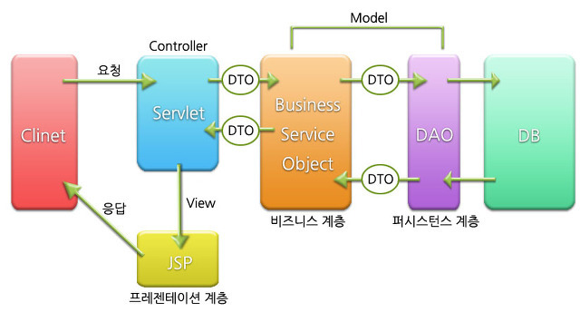

# 목차

- [목차](#목차)
- [MVC 개념](#mvc-개념)
  - [1 MVC란](#1-mvc란)
    - [1-1 Model](#1-1-model)
    - [1-2 Controller](#1-2-controller)
    - [1-3 View](#1-3-view)
  - [2 MVC 패턴의 장점](#2-mvc-패턴의-장점)
  - [3 MVC 패턴의 단점](#3-mvc-패턴의-단점)

 

# MVC 개념

 

## 1 MVC란

 출처 : http://blog.daum.net/gunsu0j/165

 

### 1-1 Model

* Model이란?	
  * ***도메인 객체 또는 DTO로 화면에 전달할 또는 화면에서 전달 받은 데이터를 담고 있는 객체.***
  * 데이터, 로직 및 규칙을 직접 관리하는 컴포넌트
  * ***모델의 상태에 변화가 있을 때 컨트롤러와 뷰에 이를 통보할 수도 있고, 반대로 컨트롤러와 뷰가 직접 모델의 상태를 읽어오기도 한다.***
  * ***표시 형식에 의존하지 않는다. 즉, 사용자에게 어떻게 보일지에 대해 신경쓰지 않아도 되고, 모델은 순수하게 public 함수로만 이루어져 있다. (POJO)***
* 구성 요소
  * Service - DB 트랜잭션 처리와 도메인에게 비즈니스 로직 처리를 위임
  * 도메인 객체 - 비즈니스 로직을 수행
  * DAO(혹은 Repository) - DB CRUD
  * DTO - 레이어간 통신용

 

### 1-2 Controller

* Controller란?
  * 사용자 입력을 받아 모델 객체의 데이터를 변경하거나, 모델 객체를 뷰에 전달하는 역할
  * 클라이언트의 요청을 받았을 때 그 요청에 대해 실제 업무를 수행하는 모델 컴포넌트를 호출하는 일을 한다.
  * 클라이언트가 보낸 데이터가 있다면, 모델을 호출할 때 전달하기 쉽게 데이터를 적절히 가공하는 일을 한다. (변환)
  * 모델이 업무 수행을 완료하면, 그 결과를 가지고 화면을 생성하도록 뷰에 전달한다. (원하는 뷰를 선택할 수 있다)
* 책임
  * 입력값 검증
  * 입력 받은 데이터로 모델 객체 변경
  * 변경된 모델 객체를 뷰에 전달
  * Service레이어에 비즈니스 로직 처리 요청 -> Service는 도메인 객체를 통해 비즈니스 로직 처리후 결과 반환

 

### 1-3 View

* View란?
  * 데이터를 보여주는 역할.
  * 다양한 형태로 보여줄 수 있다.
* 예시
  * HTML, JSON, XML, JSP, Thymleaf 등등

 

## 2 MVC 패턴의 장점

* 동시 다발적 개발 
  * 백엔드 개발자와 프론트엔드 개발자가 독립적으로 개발을 진행할 수 있다.
* 높은 결합도
  * 논리적인 관련있는 기능을 하나의 컨트롤러로 묶거나, 특정 모델과 관련있는 뷰를 그룹화 할 수 있다.
* 낮은 의존도
  * 뷰, 모델, 컨트롤러는 각각 독립적이다.
* 개발 용이성
  * 책임이 구분되어 있어 코드 수정하는 것이 편하다.
* 한 모델에 대한 여러 형태의 뷰를 가질 수 있다.

 

## 3 MVC 패턴의 단점

* 코드 네비게이션 복잡함
  * 코드를 여러군데 왔다 갔다 하면서 파악하는 행위를 코드 네비게이션(왔다갔다)라고 표현했다고 한다.
* 코드 일관성 유지에 노력이 필요함
* 높은 학습 곡선
