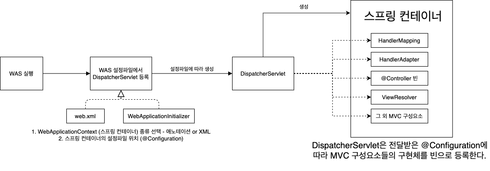
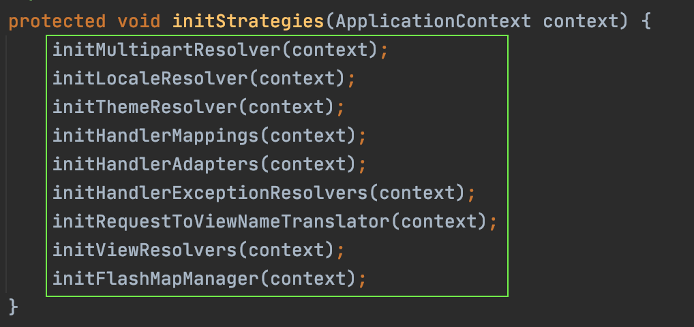
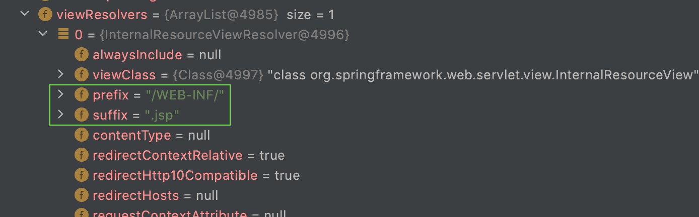
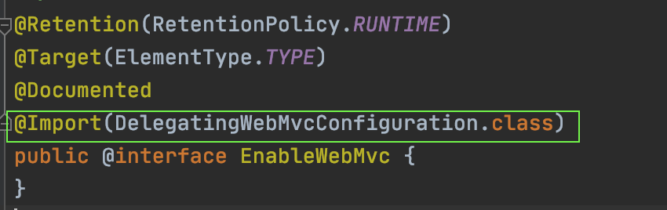
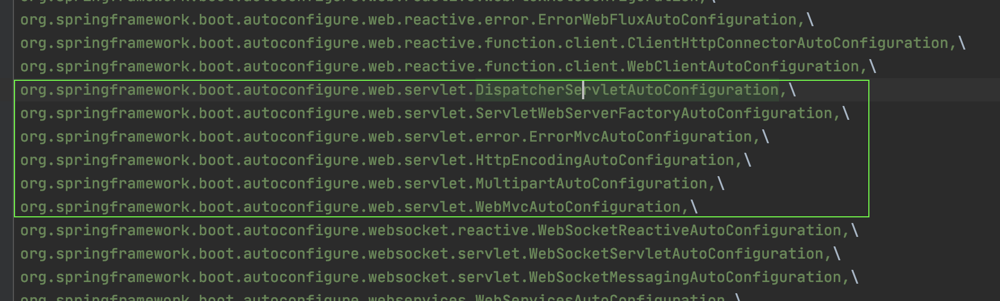
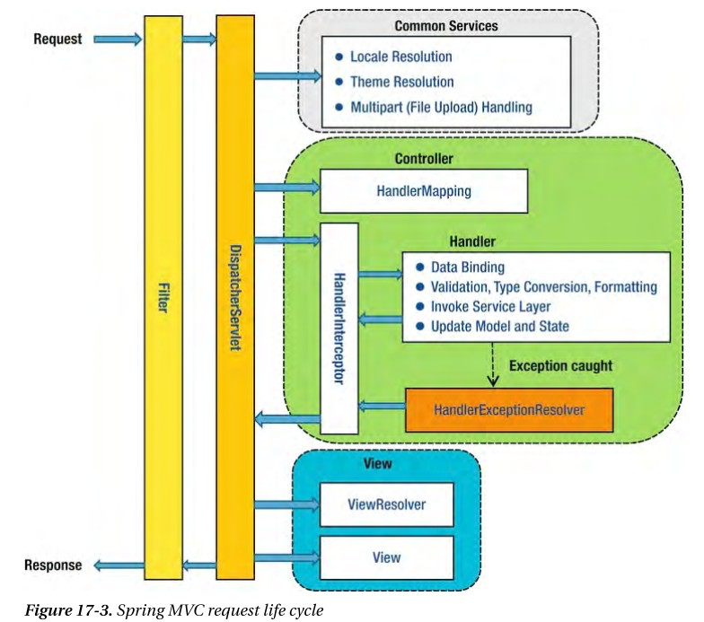

[백기선님의 MVC 강의]()와 [여러 참고 자료](#참고)를 바탕으로 정리한 자료입니다.


# 목차


# Spring MVC 설정


## 1 DispatcherServlet과 스프링 컨테이너


### 1-1 DispatcherServlet과 스프링 컨테이너 생성되는 과정

스프링 MVC의 핵심은 `DispatcherServlet`이며, WAS(톰캣)부터 스프링 컨테이너의 생성까지 아래와 같은 순서로 동작한다.



1. WAS (톰캣) 실행
2. WAS는 설정 파일(`web.xml` 혹은 `WebApplicationInitializer`)스캔
   * 설정 파일에 등록해놓은 `DispatcherServlet` 서블릿으로 등록
     * 등록되면서 파라미터로 두 가지를 설정한다.
       * 스프링 컨테이너 구현체 종류 - 애노테이션 기반 or XML 기반
       * 스프링 컨테이너 설정파일 -`@Configuration` 객체 혹은 `xml` 설정파일 위치
3. 스프링 컨테이너 설정파일을 스캔하여 빈을 등록하는 과정에서 두 가지 방법을 통해 MVC 설정을 한다.
   * 직접 `@Configuration` 에 `@Bean` 을 등록 (low level)
   * `@EnableWebMvc`와 `WebMvcConfigurer`를 통한 설정


### 1-2 DispatcherServlet은 빈을 통해 구성요소를 초기화한다



```java
private void initHandlerAdapters(ApplicationContext context) {
  this.handlerAdapter = null;
  
  ...
  
  // 구현체를 빈을 통해 주입받는 것을 볼 수 있다.
	HandlerAdapter ha = context.getBean(HANDLER_ADAPTER_BEAN_NAME, HandlerAdapter.class);
  
  ...
}
```

* `DispatcherServlet`의 `init` 관련 메서드들을 보면 **구성요소들의 구현체들 모두 `getBean`을 혹은 `BeanFactoryUtil` 을 통해 구현체들을 초기화하는 것을 볼 수 있다.**


## 2 스프링 MVC 설정


### 2-1 Bean 설정방법

`DispatcherServlet`이 스프링 컨테이너를 생성하기 위해 입력으로 받은 `@Configuration`설정 클래스에 정의된 빈을 등록한다. 

```java
@Configuration
public class WebConfig {

    @Bean
    public HandlerMapping handlerMapping() {
        // HandlerMapping을 커스텀해보는 예시
        RequestMappingHandlerMapping handlerMapping = new RequestMappingHandlerMapping();
        handlerMapping.setInterceptors(); // 핸들러 매핑에 대한 인터셉터를 설정할 수 있다.
        handlerMapping.setOrder(Ordered.HIGHEST_PRECEDENCE); // 핸들러를 검색하는 순서를 지정할 수 있다.
        return handlerMapping;
    }

    @Bean
    public HandlerAdapter handlerAdapter() {
        // 기본적인 HandlerAdapter를 등록하는 예시 (굳이 빈으로 등록안해줘도 기본 설정으로 반환이 된다.)
        RequestMappingHandlerAdapter handlerAdapter = new RequestMappingHandlerAdapter();
        return handlerAdapter;
    }

    @Bean
    public ViewResolver viewResolver() {
      	// ViewResolver를 커스텀하는 예시
        InternalResourceViewResolver viewResolver = new InternalResourceViewResolver();
        viewResolver.setPrefix("/WEB-INF/");
        viewResolver.setSuffix(".jsp");
        return viewResolver;
    }
}
```

이때, **직접 `@Bean`을 통해 MVC의 구성요소들을 빈으로 등록해줌으로써 MVC 구성요소를 설정할 수 있다.**



서버를 실행하여 디버깅을 해보면 위와 같이 `ViewResolvers` 의 설정이 바뀐 것을 볼 수 있다.


>  이 방법은 어떻게 보면 굉장히 로우 레벨의 설정 방법이다. 스프링에서는 설정을 더 쉽게 할 수 있도록 `@EnableWebMVC` 를 통해 MVC 설정을 쉽게 할 수 있도록 제공한다.


### 2-2 @EnableWebMvc

> `@Enable`로 시작하는 애노테이션은 자바 설정에서 편의를 제공하기 위해 도입되었다고 한다.
>
> `@Enable`애노테이션은 개발자를 대신해서 많은 설정을 대신해준다.

```java
@Configuration
@EnableWebMvc
public class WebMvcConfig {
  ...
}
```

🤔  `@EnableWebMvc` 란

* `@Configure`에 `@EnableWebMvc` 애노테이션을 추가해주면 **설정이 완료된 여러 스프링 빈을 추가해준다.**
  * 기본적인 `HandlerMapping` 빈, `HandlerAdapter` 빈 등을 추가해주는 것.
* **또한, `DelegatingWebMvcConfiguration`을 통해 스프링 MVC(Web관련) 빈들을 쉽게 설정할 수 있게 도와준다.**


#### DelegatingWebMvcConfiguration

`EnableWebMvc`는 `DelegatingWebMvcConfiguration`을 `import` 하고 있다. 즉, `@EnableWebMvc`애노테이션을 통해 임포트된다.



🤔 DelegatingWebMvcConfiguration

* **`WebMvcConfigurer`인터페이스를 통해서 쉽게 Web관련(DispatcherServlet) 빈들을 커스터마이징할 수 있도록 해준다.**

```java
@Configuration
public class DelegatingWebMvcConfiguration extends WebMvcConfigurationSupport {
  
  // 구성요소에 대한 설정파일을 모아두는 객체
  private final WebMvcConfigurerComposite configurers = new WebMvcConfigurerComposite();
  
  @Autowired(required = false)
	public void setConfigurers(List<WebMvcConfigurer> configurers) {
		if (!CollectionUtils.isEmpty(configurers)) {
			this.configurers.addWebMvcConfigurers(configurers);
		}
	}
  
  ...
    
  @Override
	protected void addInterceptors(InterceptorRegistry registry) {
		this.configurers.addInterceptors(registry);
	}
  
  ...
}
```

* `DelegatingWebMvcConfiguration`은 `WebMvcConfigurationSupport`를 상속받는다.
  * 기본적인 Web 관련 빈을 등록하는 메서드는 모두 `WebMvcConfigurationSupport`에 존재한다.
  * **`DelegatingWebMvcConfiguration`는 `WebMvcConfigurer` 타입의 빈들을 통해서 등록되는 빈들을 커스터마이징 할 수 있게 해주는 역할만을 수행한다.**

* **`setConfigurers`메서드에서 `WebMvcConfigurer` 타입의 빈들을 모두 주입받아서 `WebMvcConfigurerComposite` 타입의 객체에 주입하고 있다.**
  * **`WebMvcConfigurerComposite`에 저장된 `WebMvcConfigurer`타입의 빈들은 모두 Web(MVC)관련 빈들을 초기화할 때 사용된다.**


#### WebMvcConfigurationSupport

🤔  `WebMvcConfigurationSupport`

* **MVC 자바 설정에서 기본 설정을 제공하는 메인 클래스이다.**
* 주로 `@EnableWebMvc`를 통해서 임포트된다.


### 2-3 WebMvcConfigurer

```java
public interface WebMvcConfigurer {
  ...  
  default void addInterceptors(InterceptorRegistry registry){}
  ...
  default void addFormatters(FormatterRegistry registry){}
  ...
  default void configureViewResolvers(ViewResolverRegistry registry){}
  ...
  default void addArgumentResolvers(List<HandlerMethodArgumentResolver> resolvers){}
  ...
}
```

* Spring MVC를 자바 기반으로 설정할 때 사용하는 인터페이스
  * 위임 형식으로 동작하기 때문에 리턴값이 없으며, 그저 `registry`에 설정만 해주고 스프링 컨테이너에게 설정을 위임한다.
* **`@EnableWebMvc`가 제공하는 빈을 커스터마이징할 수 있는 기능을 제공하는 인터페이스**


:point_right: 예시

```java
@Configuration
@EnableWebMvc
public class WebConfig implements WebMvcConfigurer {

    @Override
    public void configureViewResolvers(ViewResolverRegistry registry) {
        registry.jsp("/WEB-INF/", ".jsp");
    }
}
```

* **만약 `ViewResolvers`를 설정하고 싶으면, `WebMvcConfigurer`인터페이스를 상속한 `@Configuration`클래스를 만들고, `configureViewResolver`를 구현해주면 된다.**


## 3 스프링 부트의 스프링 MVC 설정


### 3-1 스프링 부트의 자동 설정



스프링 부트는 `autoconfig`라는 `jar` 파일안에 모든 설정 파일들(`spring.factories`)을 정의해놓았다.

매우 많은 자동 설정 파일들이 존재하는데 여기서 알아야하는 것은 두 가지이다.

* `DispatcherServletAutoConfiguration.java` 
  * **자동으로 DispatcherServlet을 서블릿 컨텍스트에 등록해준다.**
* `WebMvcAutoConfiguration`
  * **자동으로 MVC 설정을 해준다.**
    * JSP보다 Thymeleaf 선호
    * JSON 지원
    * 정적 리소스 지원


### 3-2 스프링 MVC 커스터마이징 (중요)

스프링부트에서 MVC를 커스터마이징하는 방법은 3가지이다.

* application.properties
  * 간단하게 스프링 MVC를 설정할 수 있다. 대표적으로 prefix, suffix를 쉽게 설정가능.
* @Configuration + Implements WebMvcConfigurer
  * **스프링 부트의 스프링 MVC 자동 설정 + 추가 설정**
* @Configuration + @EnableWebMvc + Implements WebMvcConfigurer
  * **스프링 부트의 스프링 MVC 자동설정 사용하지 않음**
  * `WebMvcAutoConfiguration` 에서 만약 `WebMvcConfigurationSupport` 타입의 빈이 등록되어 있다면 부트의 자동 설정은 하지 않는다. 
  * @EnableWebMvc는 `Support` 타입을 상속받은 `DelegatingWebConfiguration` 를 `@Configuration` 을 통해 빈으로 등록하므로 부트의 자동 설정이 동작하지 않는 것.


## 4 WebMvcConfigurer


### 4-1 Formatter

* 추가 방법
  * `WebMvcConfigurer`의 `addFormatter(FormatterRegistry)` 메서드 정의
  * 스프링 부트에서 포매터를 `@Component` 를 이용해서 빈으로 등록

`@PathVariable`애노테이션을 사용하면 쉽게 URL의 매개변수를 받아올 수 있다.

```java
@RestController
public class SampleController {
    
    @GetMapping("/hello/{name}")
    public String hello(@PathVariable String name) {
        return "hello " + name;
    }
    
}
```

하지만 만약 `Person`이라는 객체로 받아오고 싶다면 데이터 바인딩이 필요해진다.

```java
// 데이터 바인딩이 필요한 상황
@RestController
public class SampleController {

    @GetMapping("/hello/{name}")
    public String hello(@PathVariable("name") Person person) {
        return "hello " + person.getName();
    }
}

public class Person {
    private String name;
    // Getter / Setter
}
```

위 코드는 실행해보면 오류가 나오는 것을 볼 수 있다. (String값인 URL 입력값을 객체로 바인딩할 수 없기 때문이다.)

`Formattter`를 사용해서 데이터 바인딩을 해줘야 한다.

```java
public class PersonFormatter implements Formatter<Person> {

    @Override
    public Person parse(String s, Locale locale) throws ParseException {
        Person person = new Person();
        person.setName(s);
        return person;
    }

    @Override
    public String print(Person person, Locale locale) {
        return person.getName();
    }
}
```

* `Printer` - 해당 객체를 (Locale 정보를 참고하여) 문자열로 어떻게 출력할 것인가
* `Parser` - 어떤 문자열을 (Locale 정보를 참고하여) 객체로 어떻게 변환할 것인가

이제 `PersonFormatter`를 MVC 설정에 추가해주면 된다.

```java
@Configuration
public class WebConfig implements WebMvcConfigurer {

    @Override
    public void addFormatters(FormatterRegistry registry) {
        registry.addFormatter(new PersonFormatter());
    }
}
```


> 스프링 부트에서는 빈으로 등록되는 `Formatter`를 스캔하여 알아서 등록해준다.
>
> 그러므로 부트에서는 `PersonFormatter`에 `@Component` 를 붙여주기만 하면 된다.


## 5 핸들러 인터셉터


### 5-1 핸들러 인터셉터란

* 핸들러 맵핑에 설정할 수 있는 인터셉터
  * 핸들러 맵핑은 핸들러(`@Controller`)를 찾아주는 역할을 한다.
* **핸들러를 실행하기 전, 후 (아직 랜더링 전) 그리고 완료 (랜더링까지 끝난 이후) 시점에 부가 작업을 하고 싶은 경우에 사용할 수 있다.**
* 여러 핸들러에서 반복적으로 사용하는 코드를 줄이고 싶을 때 사용할 수 있따.
  * 로깅, 인증 체크, Locale 변경 등


### 5-2 핸들러 인터셉터 설정 위치

```java
// preHandle 1
// preHandle 2
// 요청 처리 (HandlerAdapter)
// postHandle 2
// postHandle 1
// 뷰 랜더링
// afterCompletion 2
// afterCompletion 1
```

설정 위치마다의 자세한 내용은 아래와 같다.

* ```java
  boolean preHandle(request, response, handler)
  ```

  * **핸들러 실행하기 전에 호출**
  * "핸들러"에 대한 정보를 사용할 수 있기 때문에 서블릿 필터에 비해 보다 세밀한 로직을 구현할 수 있다.
  * **리턴값으로 계속 다음 인터셉터 또는 핸들러로 요청, 응답을 전달할지(true) 응답 처리가 이곳에서 끝났는지 (false) 알린다.**

* ```java
  void postHandle(request, response, modelAndView)
  ```

  * **핸들러 실행이 끝나고 아직 뷰를 랜더링 하기 이전에 호출.**
  * "뷰"에 전달할 추가적이거나 여러 핸들러에 공통적인 모델 정보를 담는데 사용할 수도 있다.
    * **`modelAndView` 를 커스텀마이징할 수 있다.**
      * 모델에 새로운 정보를 추가 혹은 뷰를 변경.
  * 이 메서드는 인터셉터 역순으로 호출된다.
  * 비동기적인 요청 처리 시에는 호출되지 않는다.

* ```java
  void afterCompletion(request, response, handler, ex)
  ```

  * **요청 처리가 완전히 끝난 뒤 (뷰 랜더링 끝난 뒤)에 호출.**
  * preHandler에서 true를 리턴한 경우에만 호출된다.
  * 이 메서드는 인터셉터 역순으로 호출된다.
  * 비동기적인 요청 처리 시에는 호출되지 않는다.


### 5-3 필터 vs 인터셉터



* 진행 Flow
  * 요청 -> 서블릿 필터 -> 디스패치서블릿 -> 인터셉터 -> 핸들러(컨트롤러)

* 서블릿 필터 - 서블릿에서만 사용할 수 있는 기능
  * HTTP나 보안(시큐리티)와 관련.
* 인터셉터 - 스프링 MVC에서 제공하는 기능
  * **스프링 프레임워크 안에서 동작하므로 스프링의 자원들을 사용할 수 있다.**
  * 인터셉터도 빈으므로 컨테이너에 있는 빈들을 접근할 수 있다.
  * HTTP나 권한체크 등과 관련.
* 스프링 AOP - 보편적인 핵심 로직과 부가 로직을 분리하는 방법
  * 비즈니스 로직을 분리하기 위해서 많이 사용된다. HTTP와는 상관이 없다.


### 5-4 핸들러 인터셉터 구현

```java
// 인터셉터 만들기
public class SampleInterceptor implements HandlerInterceptor {

    @Override
    public boolean preHandle(HttpServletRequest request, HttpServletResponse response, Object handler) throws Exception {
        System.out.println("preHandle 1");
        return true;
    }

    @Override
    public void postHandle(HttpServletRequest request, HttpServletResponse response, Object handler, ModelAndView modelAndView) throws Exception {
        System.out.println("postHandle 1");
    }

    @Override
    public void afterCompletion(HttpServletRequest request, HttpServletResponse response, Object handler, Exception ex) throws Exception {
        System.out.println("afterCompletion 1");
    }
}
```

```java
// 인터셉터 등록
@Configuration
public class WebConfig implements WebMvcConfigurer {

    @Override
    public void addInterceptors(InterceptorRegistry registry) {
        registry.addInterceptor(new SampleInterceptor())
                .addPathPatterns("/hi"); // 인터셉터 등록. (특정 패턴에만 적용)
      	registry.addInterceptor(new ...);
    }
}
```


## 6 리소스 핸들러


### 6-1 리소스 핸들러개념

* **이미지, JS, CSS, HTML 파일과 같은 정적인 리소스를 처리하는 핸들러.**
  * `index.html`, `profile.jpg` 등을 처리할 때 사용된다.
* **스프링은 WAS에 이미 등록된 디폴트 서블릿에 위임해서 정적인 리소스를 처리한다.**

> 스프링 부트는 기본 정적 리소스 핸들러와 캐싱을 제공한다. 따로 설정을 해주지 않아도 된다.
>
> 기본 정적 리소스의 위치는 `resource/static` 디렉토리 이다.


#### 디폴트 서블릿

* 서블릿 컨테이너가 기본으로 제공하는 서블릿으로 정적인 리소스를 처리할 때 사용한다.
  * 정적인 리소스와 디렉토리 구조를 보여줄때 사용된다.
* https://tomcat.apache.org/tomcat-9.0-doc/default-servlet.html


### 6-2 리소스 핸들러 설정

> 스프링 부트를 사용하지 않거나, 따로 다른 리소스 핸들러를 만들고 싶다면 아래와 같이 해주면 된다.

```java
@Configuration
public class WebConfig implements WebMvcConfigurer {
    @Override
    public void addResourceHandlers(ResourceHandlerRegistry registry) {
        registry.addResourceHandler("/mobile/**") // URL Path
                .addResourceLocations("classpath:/mobile/") // 리소스 위치
                .setCacheControl(CacheControl.maxAge(10, TimeUnit.MINUTES)); // 캐시전략
    }
}
```

* 어떤 요청 패턴을 지원할 것인가 - `addResourceHandler`
* 어디서 리소스를 찾을 것인가 - `addResourceLocations`
* 캐싱
* `ResourceResolver` - 요청에 해당하는 리소스를 찾는 전략
  * 캐싱, 인코딩, WebJar..
* `ResourceTransformer` - 응답으로 보낼 리소스를 수정하는 전략
  * 캐싱, CSS링크, HTML5 AppCache..


# 참고

* https://gunju-ko.github.io/spring/2018/06/28/@EnableWebMvc.html

* https://velog.io/@shson/Filter-Interceptor-AOP