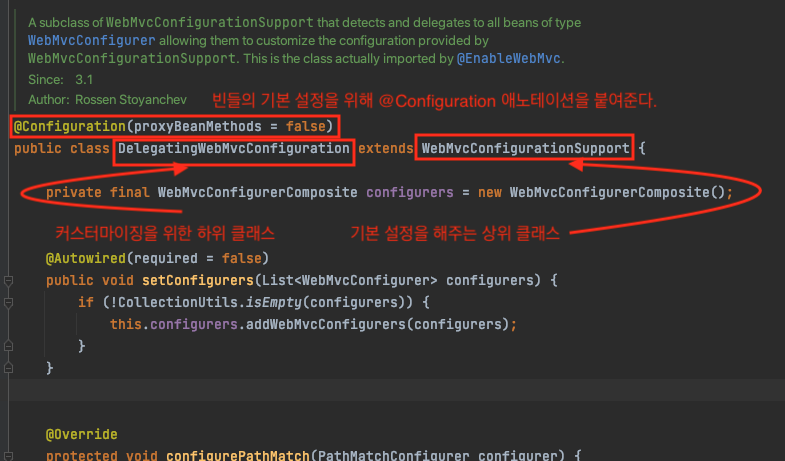
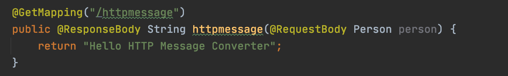

[백기선님의 MVC 강의](https://www.inflearn.com/course/%EC%9B%B9-mvc/dashboard)와 [참고 자료](#참고)를 바탕으로 정리한 자료입니다.

<br>

# 목차

- [목차](#목차)
- [Spring MVC 설정](#spring-mvc-설정)
  - [1 DispatcherServlet과 스프링 컨테이너](#1-dispatcherservlet과-스프링-컨테이너)
    - [1-1 DispatcherServlet과 스프링 컨테이너 생성되는 과정](#1-1-dispatcherservlet과-스프링-컨테이너-생성되는-과정)
    - [1-2 DispatcherServlet은 빈을 통해 구성요소를 초기화한다](#1-2-dispatcherservlet은-빈을-통해-구성요소를-초기화한다)
  - [2 스프링 MVC 설정](#2-스프링-mvc-설정)
    - [2-1 Bean 설정방법](#2-1-bean-설정방법)
    - [2-2 @EnableWebMvc](#2-2-enablewebmvc)
      - [DelegatingWebMvcConfiguration](#delegatingwebmvcconfiguration)
    - [2-3 WebMvcConfigurer](#2-3-webmvcconfigurer)
  - [3 스프링 부트의 스프링 MVC 설정](#3-스프링-부트의-스프링-mvc-설정)
    - [3-1 스프링 부트의 자동 설정](#3-1-스프링-부트의-자동-설정)
    - [3-2 스프링 MVC 커스터마이징 (중요)](#3-2-스프링-mvc-커스터마이징-중요)
  - [4 Formatter](#4-formatter)
  - [5 핸들러 인터셉터](#5-핸들러-인터셉터)
    - [5-1 핸들러 인터셉터란](#5-1-핸들러-인터셉터란)
    - [5-2 핸들러 인터셉터 설정 위치](#5-2-핸들러-인터셉터-설정-위치)
  - [6 리소스 핸들러](#6-리소스-핸들러)
    - [6-1 리소스 핸들러란?](#6-1-리소스-핸들러란)
      - [디폴트 서블릿](#디폴트-서블릿)
    - [6-2 리소스 핸들러 설정](#6-2-리소스-핸들러-설정)
  - [7 HTTP 메시지 컨버터](#7-http-메시지-컨버터)
    - [7-1 HTTP 메시지 컨버터란?](#7-1-http-메시지-컨버터란)
    - [7-2 기본 HTTP 메시지 컨버터 종류](#7-2-기본-http-메시지-컨버터-종류)
    - [7-3 HTTP 컨버터 설정 방법](#7-3-http-컨버터-설정-방법)
    - [7-4 JSON](#7-4-json)
  - [8 그 밖의 WebMvcConfigurer 설정](#8-그-밖의-webmvcconfigurer-설정)
    - [8-1 CORS 설정](#8-1-cors-설정)
    - [8-2 Return Value Handler 설정](#8-2-return-value-handler-설정)
    - [8-3 Argument Resolver 설정](#8-3-argument-resolver-설정)
    - [8-4 뷰 컨트롤러](#8-4-뷰-컨트롤러)
    - [8-5 비동기 설정](#8-5-비동기-설정)
    - [8-6 View Resolver 설정](#8-6-view-resolver-설정)
    - [8-7 Content Negotiation 설정](#8-7-content-negotiation-설정)
  - [9 마무리](#9-마무리)
- [참고](#참고)

<br>

# Spring MVC 설정

<br>

## 1 DispatcherServlet과 스프링 컨테이너

<br>

### 1-1 DispatcherServlet과 스프링 컨테이너 생성되는 과정

스프링 MVC의 핵심은 `DispatcherServlet`이며, WAS(톰캣)부터 스프링 컨테이너의 생성까지 아래와 같은 순서로 동작한다.

<p align="center"></p>

1. WAS (톰캣) 실행
2. WAS는 설정 파일(`web.xml` 혹은 `WebApplicationInitializer`)스캔
   * 설정 파일에 등록해놓은 `DispatcherServlet` 서블릿으로 등록
     * 등록되면서 파라미터로 두 가지를 설정한다.
       * 스프링 컨테이너 구현체 종류 - 애노테이션 기반 or XML 기반
       * 스프링 컨테이너 설정파일 -`@Configuration` 객체 혹은 `xml` 설정파일 위치
3. 스프링 컨테이너 설정파일을 스캔하여 빈을 등록하는 과정에서 두 가지 방법을 통해 MVC 설정을 한다.
   * 직접 `@Configuration` 에 `@Bean` 을 등록 (low level)
   * `@EnableWebMvc`와 `WebMvcConfigurer`를 통한 설정

<br>

### 1-2 DispatcherServlet은 빈을 통해 구성요소를 초기화한다

<p align="center"></p>

```java
private void initHandlerAdapters(ApplicationContext context) {
  this.handlerAdapter = null;
  
  ...
  
  // 구현체를 빈을 통해 주입받는 것을 볼 수 있다.
	HandlerAdapter ha = context.getBean(HANDLER_ADAPTER_BEAN_NAME, HandlerAdapter.class);
  
  ...
}
```

* `DispatcherServlet`의 `init` 관련 메서드들을 보면 **구성요소들의 구현체들 모두 `getBean`을 혹은 `BeanFactoryUtil` 을 통해 구현체들을 초기화하는 것을 볼 수 있다.**

<br>

## 2 스프링 MVC 설정

<br>

### 2-1 Bean 설정방법

`DispatcherServlet`이 스프링 컨테이너를 생성하기 위해 입력으로 받은 `@Configuration`설정 클래스에 정의된 빈을 등록한다. 

```java
@Configuration
public class WebConfig {

    @Bean
    public HandlerMapping handlerMapping() {
        // HandlerMapping을 커스텀해보는 예시
        RequestMappingHandlerMapping handlerMapping = new RequestMappingHandlerMapping();
        handlerMapping.setInterceptors(); // 핸들러 매핑에 대한 인터셉터를 설정할 수 있다.
        handlerMapping.setOrder(Ordered.HIGHEST_PRECEDENCE); // 핸들러를 검색하는 순서를 지정할 수 있다.
        return handlerMapping;
    }

    @Bean
    public HandlerAdapter handlerAdapter() {
        // 기본적인 HandlerAdapter를 등록하는 예시 (굳이 빈으로 등록안해줘도 기본 설정으로 반환이 된다.)
        RequestMappingHandlerAdapter handlerAdapter = new RequestMappingHandlerAdapter();
        return handlerAdapter;
    }

    @Bean
    public ViewResolver viewResolver() {
      	// ViewResolver를 커스텀하는 예시
        InternalResourceViewResolver viewResolver = new InternalResourceViewResolver();
        viewResolver.setPrefix("/WEB-INF/");
        viewResolver.setSuffix(".jsp");
        return viewResolver;
    }
}
```

이때, **직접 `@Bean`을 통해 MVC의 구성요소들을 빈으로 등록해줌으로써 MVC 구성요소를 설정할 수 있다.**

<p align="center"></p>

서버를 실행하여 디버깅을 해보면 위와 같이 `ViewResolvers` 의 설정이 바뀐 것을 볼 수 있다.


>  이 방법은 어떻게 보면 **로우 레벨의 설정 방법**이다. 스프링에서는 설정을 더 쉽게 할 수 있도록 `@EnableWebMVC` 를 통해 MVC 설정을 쉽게 할 수 있도록 제공한다.

<br>

### 2-2 @EnableWebMvc
> `@Enable`로 시작하는 애노테이션은 자바 설정에서 편의를 제공하기 위해 도입되었다고 한다.
>
> `@Enable`애노테이션은 개발자를 대신해서 많은 설정을 대신해준다.
> 
> **이 방법이 스프링 부트없이 스프링을 설정하고 사용하는 기본적인 방법이다.**
>
> 가능하면 디버깅을 통해 직접 눈으로 확인해보자

```java
@Configuration
@EnableWebMvc
public class WebMvcConfig {
  ...
}
```

**🤔  `@EnableWebMvc` 란**

* `@Configure`에 `@EnableWebMvc` 애노테이션을 추가해주면 **설정이 완료된 여러 스프링 빈을 추가 및 수정해준다.**
  * **여러 빈을 추가하고 수정해주는 코드는 `DelegatingWebConfiguration`에 존재한다.**
* **또한, `DelegatingWebMvcConfiguration`을 통해 스프링 MVC(Web관련) 빈들을 쉽게 설정할 수 있게 도와준다.**

<br>

#### DelegatingWebMvcConfiguration

`EnableWebMvc`는 `DelegatingWebMvcConfiguration`을 `import` 하고 있다. 즉, `@EnableWebMvc`애노테이션을 통해 임포트된다.

<p align="center"></p>

<p align="center"></p>

<br>

🤔 DelegatingWebMvcConfiguration

* **`WebMvcConfigurer`인터페이스를 통해서 쉽게 Web관련(DispatcherServlet) 빈들을 커스터마이징할 수 있도록 해준다.**

```java
@Configuration
public class DelegatingWebMvcConfiguration extends WebMvcConfigurationSupport {
  
  // 구성요소에 대한 설정파일을 모아두는 객체
  private final WebMvcConfigurerComposite configurers = new WebMvcConfigurerComposite();
  
  @Autowired(required = false)
	public void setConfigurers(List<WebMvcConfigurer> configurers) {
		if (!CollectionUtils.isEmpty(configurers)) {
			this.configurers.addWebMvcConfigurers(configurers);
		}
	}
  
  ...
    
  @Override
	protected void addInterceptors(InterceptorRegistry registry) {
		this.configurers.addInterceptors(registry);
	}
  
  ...
}
```

* `DelegatingWebMvcConfiguration`은 `WebMvcConfigurationSupport`를 상속받는다.
  * **기본적인 Web 관련 기본 빈을 등록하고 설정하는 메서드는 모두 `WebMvcConfigurationSupport`에 존재한다.(상위 클래스 - 부가 로직)**
    * **MVC 자바 설정에서 기본 설정을 제공하는 메인 클래스이다.**
    * 대표적인 기본 설정은 Jackson, GSON... 추가 등이 있다.
  * **`DelegatingWebMvcConfiguration`는 `WebMvcConfigurer` 타입의 빈들을 통해서 등록되는 빈들을 커스터마이징 할 수 있게 해주는 역할만을 수행한다. (하위 클래스 - 핵심 로직)**

* **`setConfigurers`메서드에서 `WebMvcConfigurer` 타입의 빈들을 모두 주입받아서 `WebMvcConfigurerComposite` 타입의 객체에 주입하고 있다.**
  * **`WebMvcConfigurerComposite`에 저장된 `WebMvcConfigurer`타입의 빈들은 모두 Web(MVC)관련 빈들을 초기화할 때 사용된다.**

<br>

### 2-3 WebMvcConfigurer

```java
public interface WebMvcConfigurer {
  ...  
  default void addInterceptors(InterceptorRegistry registry){}
  ...
  default void addFormatters(FormatterRegistry registry){}
  ...
  default void configureViewResolvers(ViewResolverRegistry registry){}
  ...
  default void addArgumentResolvers(List<HandlerMethodArgumentResolver> resolvers){}
  ...
}
```

* Spring MVC를 자바 기반으로 설정할 때 사용하는 인터페이스
  * 위임 형식으로 동작하기 때문에 리턴값이 없으며, 그저 `registry`에 설정만 해주고 스프링 컨테이너에게 설정을 위임한다.
* **`@EnableWebMvc`가 제공하는 빈을 커스터마이징할 수 있는 기능을 제공하는 인터페이스**

<br>

:point_right: 예시

```java
@Configuration
@EnableWebMvc
public class WebConfig implements WebMvcConfigurer {

    @Override
    public void configureViewResolvers(ViewResolverRegistry registry) {
        registry.jsp("/WEB-INF/", ".jsp");
    }
}
```

* **만약 `ViewResolvers`를 설정하고 싶으면, `WebMvcConfigurer`인터페이스를 상속한 `@Configuration`클래스를 만들고, `configureViewResolver`를 구현해주면 된다.**

<br>

## 3 스프링 부트의 스프링 MVC 설정

<br>

### 3-1 스프링 부트의 자동 설정

<p align="center"></p>

스프링 부트는 `autoconfig`라는 `jar` 파일안에 모든 설정 파일들(`spring.factories`)을 정의해놓았다.

매우 많은 자동 설정 파일들이 존재하는데 지금 여기서 알아야하는 것은 두 가지이다.

* `DispatcherServletAutoConfiguration.java` 
  * **자동으로 DispatcherServlet을 서블릿 컨텍스트에 등록해준다.**
* `WebMvcAutoConfiguration`
  * **자동으로 MVC 설정을 해준다.**
    * JSP보다 Thymeleaf 선호
    * JSON 지원
    * 정적 리소스 지원 (+ 웰컴 페이지, 파비콘 등 지원)
      * 리소스(html, css, js)의 기본 위치값을 설정해준다.

<br>

### 3-2 스프링 MVC 커스터마이징 (중요)

스프링부트에서 MVC를 커스터마이징하는 방법은 3가지이다.

* application.properties
  * 간단하게 스프링 MVC를 설정할 수 있다. 대표적으로 prefix, suffix를 쉽게 설정가능.
* @Configuration + Implements WebMvcConfigurer
  * **스프링 부트의 스프링 MVC 자동 설정 + 추가 설정**
* @Configuration + @EnableWebMvc + Implements WebMvcConfigurer
  * **스프링 부트의 스프링 MVC 자동설정 사용하지 않음**
    * `WebMvcAutoConfiguration` 에서 만약 `WebMvcConfigurationSupport` 타입의 빈이 등록되어 있다면 부트의 자동 설정은 하지 않는다. 
    * @EnableWebMvc는 `Support` 타입을 상속받은 `DelegatingWebConfiguration` 를 `@Configuration` 을 통해 빈으로 등록하므로 부트의 자동 설정이 동작하지 않는 것.

<br>

## 4 Formatter
> 여기서부터 `WebMvcConfigurer`를 이용하여 WebMVC를 설정하는 방법에 대해서 다룬다.

**포매터**

* 추가 방법
  * `WebMvcConfigurer`의 `addFormatter(FormatterRegistry)` 메서드 정의
  * 스프링 부트에서 포매터를 `@Component` 를 이용해서 빈으로 등록

`@PathVariable`애노테이션을 사용하면 쉽게 URL의 매개변수를 받아올 수 있다.

```java
@RestController
public class SampleController {
    
    @GetMapping("/hello/{name}")
    public String hello(@PathVariable String name) {
        return "hello " + name;
    }
    
}
```

하지만 만약 `Person`이라는 객체로 받아오고 싶다면 **데이터 바인딩이 필요해진다.**

```java
// 데이터 바인딩이 필요한 상황
@RestController
public class SampleController {

    @GetMapping("/hello/{name}")
    public String hello(@PathVariable("name") Person person) {
        return "hello " + person.getName();
    }
}

public class Person {
    private String name;
    // Getter / Setter
}
```

위 코드는 실행해보면 오류가 나오는 것을 볼 수 있다. (String값인 URL 입력값을 객체로 바인딩할 수 없기 때문이다.)

`Formattter`를 사용해서 데이터 바인딩을 해줘야 한다.

```java
public class PersonFormatter implements Formatter<Person> {

    @Override
    public Person parse(String s, Locale locale) throws ParseException {
        Person person = new Person();
        person.setName(s);
        return person;
    }

    @Override
    public String print(Person person, Locale locale) {
        return person.getName();
    }
}
```

* `Printer` - 해당 객체를 (Locale 정보를 참고하여) 문자열로 어떻게 출력할 것인가
* `Parser` - 어떤 문자열을 (Locale 정보를 참고하여) 객체로 어떻게 변환할 것인가

이제 `PersonFormatter`를 MVC 설정에 추가해주면 된다.

```java
@Configuration
public class WebConfig implements WebMvcConfigurer {

    @Override
    public void addFormatters(FormatterRegistry registry) {
        registry.addFormatter(new PersonFormatter());
    }
}
```

> 스프링 부트에서는 빈으로 등록되는 `Formatter`를 스캔하여 알아서 등록해준다.
>
> 그러므로 부트에서는 `PersonFormatter`에 `@Component` 를 붙여주기만 하면 된다.

<br>

## 5 핸들러 인터셉터

<br>

### 5-1 핸들러 인터셉터란

* 핸들러 맵핑에 설정할 수 있는 인터셉터
  * 핸들러 맵핑은 핸들러(`@Controller`)를 찾아주는 역할을 한다.
* **핸들러를 실행하기 전, 후 (아직 랜더링 전) 그리고 완료 (랜더링까지 끝난 이후) 시점에 부가 작업을 하고 싶은 경우에 사용할 수 있다.**
* 여러 핸들러에서 반복적으로 사용하는 코드를 줄이고 싶을 때 사용할 수 있다.
  * 로깅, 인증 체크, Locale 변경 등

<br>

### 5-2 핸들러 인터셉터 설정 위치

```java
// preHandle 1
// preHandle 2
// 요청 처리 (HandlerAdapter)
// postHandle 2
// postHandle 1
// 뷰 랜더링
// afterCompletion 2
// afterCompletion 1
```

설정 위치마다의 자세한 내용은 아래와 같다.

* ```java
  boolean preHandle(request, response, handler)
  ```
  * **핸들러 실행하기 전에 호출**
  * "핸들러"에 대한 정보를 사용할 수 있기 때문에 서블릿 필터에 비해 보다 세밀한 로직을 구현할 수 있다.
  * **리턴값으로 계속 다음 인터셉터 또는 핸들러로 요청, 응답을 전달할지(true) 응답 처리가 이곳에서 끝났는지 (false) 알린다.**
    * true가 반환되면 핸들러 어댑터에 요청도 하지 않고 응답을 보내게 된다.
* ```java
  void postHandle(request, response, modelAndView)
  ```
  * **핸들러 실행이 끝나고 아직 뷰를 랜더링 하기 이전에 호출.**
  * "뷰"에 전달할 추가적이거나 여러 핸들러에 공통적인 모델 정보를 담는데 사용할 수도 있다.
    * **`modelAndView` 를 커스텀마이징할 수 있다.**
      * 모델에 새로운 정보를 추가 혹은 뷰를 변경.
  * 이 메서드는 인터셉터 역순으로 호출된다.
  * 비동기적인 요청 처리 시에는 호출되지 않는다.
* ```java
  void afterCompletion(request, response, handler, ex)
  ```
  * **요청 처리가 완전히 끝난 뒤 (뷰 랜더링 끝난 뒤)에 호출.**
  * preHandler에서 true를 리턴한 경우에만 호출된다.
  * 이 메서드는 인터셉터 역순으로 호출된다.
  * 비동기적인 요청 처리 시에는 호출되지 않는다.

<br>

### 5-3 필터 vs 인터셉터

<p align="center"><br>출처: https://justforchangesake.wordpress.com/2014/05/07/spring-mvc-request-life-cycle/</p>

* 진행 Flow
  * 요청 -> 서블릿 필터 -> 디스패치서블릿 -> 인터셉터 -> 핸들러(컨트롤러)
* 서블릿 필터 - 서블릿에서만 사용할 수 있는 기능
  * HTTP나 보안(시큐리티)와 관련.
* 인터셉터 - 스프링 MVC에서 제공하는 기능
  * **스프링 프레임워크 안에서 동작하므로 스프링의 자원들을 사용할 수 있다.**
  * 인터셉터도 빈으므로 컨테이너에 있는 빈들을 접근할 수 있다.
  * HTTP나 권한체크 등과 관련.
* 스프링 AOP - 보편적인 핵심 로직과 부가 로직을 분리하는 방법
  * 비즈니스 로직을 분리하기 위해서 많이 사용된다. HTTP와는 상관이 없다.

<br>

### 5-4 핸들러 인터셉터 구현

```java
// 인터셉터 만들기
public class SampleInterceptor implements HandlerInterceptor {

    @Override
    public boolean preHandle(HttpServletRequest request, HttpServletResponse response, Object handler) throws Exception {
        System.out.println("preHandle 1");
        return true;
    }

    @Override
    public void postHandle(HttpServletRequest request, HttpServletResponse response, Object handler, ModelAndView modelAndView) throws Exception {
        System.out.println("postHandle 1");
    }

    @Override
    public void afterCompletion(HttpServletRequest request, HttpServletResponse response, Object handler, Exception ex) throws Exception {
        System.out.println("afterCompletion 1");
    }
}
```

```java
// 인터셉터 등록
@Configuration
public class WebConfig implements WebMvcConfigurer {

    @Override
    public void addInterceptors(InterceptorRegistry registry) {
        registry.addInterceptor(new SampleInterceptor())
                .addPathPatterns("/hi"); // 인터셉터 등록. (특정 패턴에만 적용)
      	registry.addInterceptor(new ...);
    }
}
```

<br>

## 6 리소스 핸들러

<br>

### 6-1 리소스 핸들러란?

* **이미지, JS, CSS, HTML 파일과 같은 정적인 리소스를 처리하는 핸들러.**
  * `index.html`, `profile.jpg` 등을 처리할 때 사용된다.
* **스프링은 WAS에 이미 등록된 디폴트 서블릿에 위임해서 정적인 리소스를 처리한다.**
* 스프링 MVC 리소스 핸들러 맵핑 등록
  * 가장 낮은 우선 순위로 등록된다.
    * 다른 핸들러 맵핑이 "/"이하 요청을 처리하도록 허용하고
    * 최종적으로 리소스 핸들러가 처리되어야 하기 때문이다.

> * 스프링 부트는 기본 정적 리소스 핸들러와 캐싱을 제공한다. 따로 설정을 해주지 않아도 된다.
>   * 기본 정적 리소스의 위치는 `resource/static` 디렉토리 이다.

<br>

#### 디폴트 서블릿

* 서블릿 컨테이너가 기본으로 제공하는 서블릿으로 정적인 리소스를 처리할 때 사용한다.
  * 정적인 리소스와 디렉토리 구조를 보여줄때 사용된다.
* https://tomcat.apache.org/tomcat-9.0-doc/default-servlet.html

<br>

### 6-2 리소스 핸들러 설정

> 스프링 부트를 사용하지 않거나, 따로 다른 리소스 핸들러를 만들고 싶다면 아래와 같이 해주면 된다.

```java
@Configuration
public class WebConfig implements WebMvcConfigurer {
    @Override
    public void addResourceHandlers(ResourceHandlerRegistry registry) {
        registry.addResourceHandler("/mobile/**") // URL Path
                .addResourceLocations("classpath:/mobile/") // 리소스 위치
                .setCacheControl(CacheControl.maxAge(10, TimeUnit.MINUTES)); // 캐시전략
    }
}
```

* 어떤 요청 패턴을 지원할 것인가 - `addResourceHandler`
* 어디서 리소스를 찾을 것인가 - `addResourceLocations`
* 캐싱
* `ResourceResolver` - 요청에 해당하는 리소스를 찾는 전략
  * 캐싱, 인코딩, WebJar..
* `ResourceTransformer` - 응답으로 보낼 리소스를 수정하는 전략
  * 캐싱, CSS링크, HTML5 AppCache..

<br>

## 7 HTTP 메시지 컨버터

<br>

### 7-1 HTTP 메시지 컨버터란?
* HTTP 요청 본문에서 메시지를 읽어들이거나, 응답 본문에 메시지를 작성할 때 사용한다.
* 메시지 방식의 컨트롤러를 사용하는 방법은 두 가지로 구분된다.
  * GET - URL과 쿼리 스트링으로 제한됨.
    * `@RequestParam`
    * `@ModelAttribute`
  * POST - URL과 쿼리 그리고 Body 사용 가능
    * `@RequestBody`
    * `@ResponseBody`

:point_right: 예시

<p align="center"></p>

* `@RequestBody`는 HTTP 요청 본문을 `Person`객체로 변환한다.
* `@ResponseBody`는 리턴 값 (`Hello...`)를 HTTP 응답 본문에 작성한다.

> `@RestController`는 자동적으로 모든 메서드에 `@ResponseBody`를 붙여준다.

<br>

### 7-2 기본 HTTP 메시지 컨버터 종류

> 컨버터가 Classpath에 의존성이 추가되면 자동적으로 등록된다고 한다.

* 바이트 배열 컨버터
* 문자열 컨버터
* Resource 컨버터
* Form 컨버터 (폼 데이터 to/from MultiValueMap<String, String>)
* XML
  * JAXB2 컨버터
* JSON
  * Jackson2 컨버터
  * Jackson 컨버터
  * Gson 컨버터
* Atom 컨버터
* RSS 컨버터
* ...

> **HTTP 메시지 컨버터를 결정하는 기준은 요청 Header의 `Content Type` 이다.**
> 
> XML, JSON 관련 컨버터는 해당 의존성이 있어야만 사용가능하다.

<br>

### 7-3 HTTP 컨버터 설정 방법

> HTTP 컨버터 설정도 다른 것과 동일하게 `WebMvcConfigurer`를 사용하여 설정한다.

* 기본으로 등록해주는 컨버터에 새로운 컨버터 추가하기 : `extendMessageConverters`
* 기본으로 등록해주는 컨버터는 다 무시하고 새로 컨버터 추가하기 : `configureMessageConverters`
  * 기본으로 등록되는 컨버터가 모두 무시되기 때문에 가능한 사용하지 말자.
* **의존성 추가로 컨버터 추가하기 (추천)**
  * **메이븐 또는 그래들 설정에 의존성을 추가하면 그에 따른 컨버터가 자동으로 등록된다.**
  * **`WebMvcConfigurationSupport` - 이곳에 정의되어 있다.**
    * ```java
      if(...Present) { // 만약 ...이 있다면
        messageConverters.add(...)
      }
      ```
    * 컨버터가 존재하는지 판단은 `ClassUtils`로 특정 위치의 패키지가 존재하는지 확인한다.
  * 이 기능 자체는 스프링 프레임워크의 기능이며, 스프링 부트가 아니라고 한다.

<br>

### 7-4 JSON

> **HTTP 메시지 컨버터는 요청 `Header`의 `Content Type`과 `Accept`의 내용을 바탕으로 결정된다.**
>
> * 스프링 부트는 `jackSon2`를 기본적으로 제공하며 `ObjectMapper`를 이용해서 변환한다.


```java
public class User {

    private String name;

    private String age;

    // getter / setter / constructor
}
```

```java
@RestController
public class SampleController {

    @PostMapping("/jsonmessage")
    public User jsonmessage(@RequestBody User user) {
        user.setName("Hello " + user.getName());
        return user;
    }

}
```

<br>

## 8 그 밖의 WebMvcConfigurer 설정

<br>

### 8-1 CORS 설정

<p align="center"><br>출처 : https://developer.mozilla.org/ko/docs/Web/HTTP/CORS</p>

* CORS란?
  * Cross - Origin Resource Sharing 교차 출처 리소스 공유
  * 도메인 또는 포트가 다른 서버의 자원을 요청하는 매커니즘을 말한다.
* **같은 도메인에서 온 요청이 아니더라도 처리를 허용하고 싶다면 설정한다.**

<br>

### 8-2 Return Value Handler 설정

* **Return Value Handler란?**
  * **핸들러(컨트롤러)에서 리턴하는 값을 처리하는 핸들러**
* 스프링 MVC가 제공하는 기본 리턴 값 핸들러 이외에 리턴 핸들러를 추가하고 싶을 때 설정한다.

<br>

### 8-3 Argument Resolver 설정

* 스프링 MVC가 제공하는 기본 아규먼트 리졸버 이외에 커스텀한 아규먼트 리졸버를 추가하고 싶을 때 설정한다.

<br>

### 8-4 뷰 컨트롤러
* 단순하게 요청 URL을 특정 뷰로 연결하고 싶을 때 사용할 수 있다.

<br>

### 8-5 비동기 설정

* 비동기 요청 처리에 사용할 타임아웃이나 `TaskExecutor`

<br>

### 8-6 View Resolver 설정

* **핸들러에서 리턴하는 뷰 이름에 해당하는 문자열을 View 인스턴스로 바꿔줄 뷰 리졸버를 설정한다.**

<br>

### 8-7 Content Negotiation 설정

* 요청 본문 또는 응답 본문을 어떤 (MIME)타입으로 보내야 하는지 결정하는 전략을 설정한다.
  * Header에 Content-Type

* 만약 `localhost:8080/test.json`처럼 특정 타입의 요청이나 응답을 처리하고 싶을 때 사용할 수 있다.


> 이 외에도 여러가지 설정이 있다. 더 많은 내용과 자세한 내용은 [다음](https://docs.spring.io/spring-framework/docs/current/javadoc-api/org/springframework/web/servlet/config/annotation/WebMvcConfigurer.html)을 참고하자.

<br>

## 9 마무리

**스프링 MVC 설정은 쉽게 정리하면 `DispatcherServlet`이 사용할 빈들을 설정해주는 것이다.**

* HandlerMapper
* HandlerAdapter
* ExceptionResolver
* ...

`@Bean`을 통해서 설정해주면 사용되는 우선순위는 높다.

다만, 하나하나 등록하려면 너무 많고, 해당 빈들이 참조하는 또 다른 객체들까지 설정하려면 설정할게 너무 많다.

<br>

**@EnableWebMvc**

그러므로 스프링에서는 `@EnableWebMvc`를 사용하면 기본적인 빈들을 등록해주도록 했다.

* 애노테이션 기반의 스프링 MVC 설정 간편화
* 기본적인 빈들을 설정해준다. (`WebMvcConfigurationSupport`)
* `WebMvcConfigurer`가 제공하는 메서드를 구현하여 커스터마이징할 수 있다. (`Delegating...`)

<br>

**스프링 부트**

* 스프링 부트 자동 설정을 통해 다양한 스프링 MVC 기능을 아무런 설정 파일을 만들지 않아도 제공한다.
* `WebMvcConfigurer`가 제공하는 메서드를 구현하여 커스터마이징할 수 있다.
* `@EnableWebMvc`를 사용하면 스프링 부트 자동 설정을 사용하지 못한다.
* [3-2 스프링 MVC 커스터마이징](#3-2-스프링-mvc-커스터마이징-중요)를 참고하자.
* 또한, `application.properties` 를 통해 쉽게 설정할 수 있다.

<br>

# 참고
* https://gunju-ko.github.io/spring/2018/06/28/@EnableWebMvc.html
* https://velog.io/@shson/Filter-Interceptor-AOP
* https://justforchangesake.wordpress.com/2014/05/07/spring-mvc-request-life-cycle/
* https://developer.mozilla.org/ko/docs/Web/HTTP/CORS