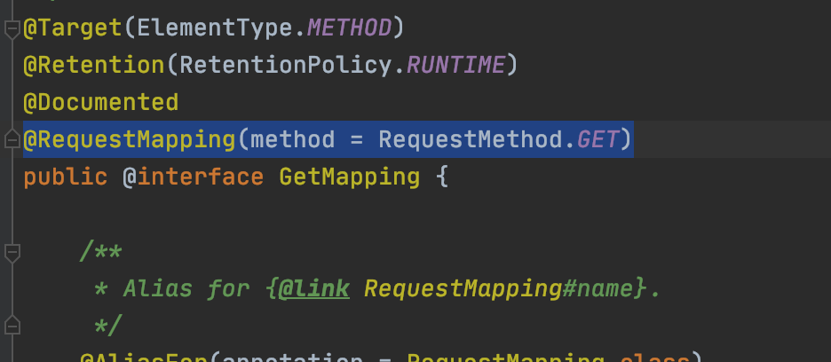
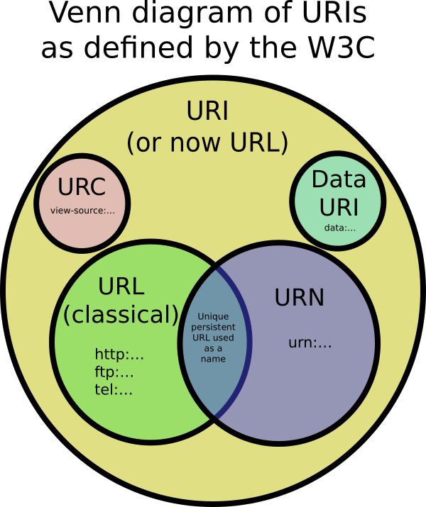
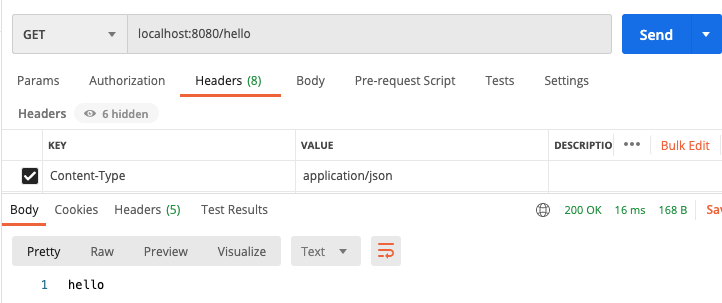
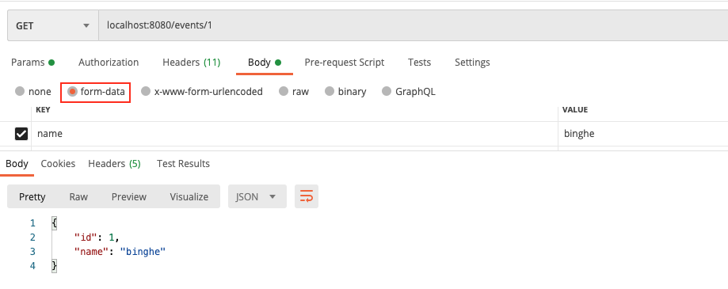
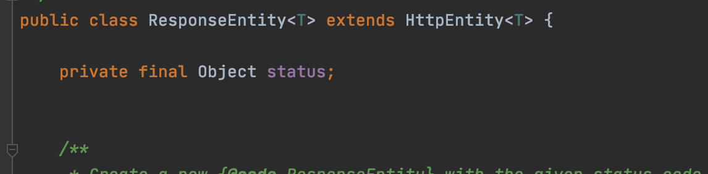

[백기선님의 MVC 강의](https://www.inflearn.com/course/%EC%9B%B9-mvc/dashboard)와 [Spring Reference](https://docs.spring.io/spring-framework/docs/current/spring-framework-reference/web.html#spring-web)를 바탕으로 정리한 자료입니다.


# 목차

- [Spring MVC 활용](#spring-mvc-활용)
  * [1 개요](#1-개요)
    + [1-1 내용](#1-1-내용)
    + [1-2 학습할 애너테이션](#1-2-학습할-애너테이션)
  * [2 요청 맵핑하기](#2-요청-맵핑하기)
    + [2-1 HTTP Method](#2-1-http-method)
      - [@RequestMapping](#requestmapping)
      - [@GetMapping](#getmapping)
    + [2-2 URI 패턴 맵핑](#2-2-uri-패턴-맵핑)
      - [URI, URL, URN](#uri-url-urn)
      - [요청 식별자로 맵핑하기](#요청-식별자로-맵핑하기)
      - [정규식](#정규식)
      - [패턴이 중복된다면?](#패턴이-중복된다면)
      - [URI 확장자 맵핑](#uri-확장자-맵핑)
    + [2-3 미디어 타입](#2-3-미디어-타입)
      - [특정한 타입의 데이터를 담고 있는 요청만 처리하는 핸들러 - consumes](#특정한-타입의-데이터를-담고-있는-요청만-처리하는-핸들러---consumes)
      - [특정한 타입의 응답을 만드는 핸들러 - produces](#특정한-타입의-응답을-만드는-핸들러---produces)
    + [2-4 헤더와 매개변수](#2-4-헤더와-매개변수)
  * [3 핸들러 메서드](#3-핸들러-메서드)
    + [3-1 아규먼트와 리턴 타입](#3-1-아규먼트와-리턴-타입)
      - [핸들러 메서드 아규먼트](#핸들러-메서드-아규먼트)
      - [핸들러 메서드 리턴](#핸들러-메서드-리턴)
    + [3-2 URI 패턴](#3-2-uri-패턴)
      - [@PathVariable](#pathvariable)
      - [@ MatrixVariable](#-matrixvariable)
    + [3-3 요청 매개변수 (단순 타입)](#3-3-요청-매개변수-단순-타입)
      - [요청 매개변수](#요청-매개변수)
      - [@RequestParam](#requestparam)
    + [3-4 @ModelAttribute](#3-4-modelattribute)
      - [@ModelAttribute](#modelattribute)
      - [값을 바인딩 할 수 없는 경우에는?](#값을-바인딩-할-수-없는-경우에는)
      - [바인딩 에러를 직접 다루고 싶은 경우](#바인딩-에러를-직접-다루고-싶은-경우)
      - [바인딩 이후에 검증 작업을 추가로 하고 싶은 경우 - 중요](#바인딩-이후에-검증-작업을-추가로-하고-싶은-경우---중요)
    + [3-5 @Validated](#3-5-validated)
    + [3-6 @SessionAttributes](#3-6-sessionattributes)
    + [3-7 @SessionAttribute](#3-7-sessionattribute)
    + [3-8 RedirectAttributes](#3-8-redirectattributes)
    + [3-9 Flash Attributes](#3-9-flash-attributes)
    + [3-10 MultipartFile](#3-10-multipartfile)
    + [3-11 ResponseEntity](#3-11-responseentity)
    + [3-12 HttpEntity & @RequestBody & @ResponseBody](#3-12-httpentity--requestbody--responsebody)
      - [@RequestBody](#requestbody)
      - [HttpMessageConverter](#httpmessageconverter)
      - [HttpEntity](#httpentity)
      - [@ResponseBody](#responsebody)
  * [4 모델 @ModelAttribute 또 다른 사용법](#4-모델-modelattribute-또-다른-사용법)
  * [5 데이터 바인더 @InitBinder](#5-데이터-바인더-initbinder)
  * [6 예외 처리 핸들러 @ExceptionHandler](#6-예외-처리-핸들러-exceptionhandler)
  * [7 전역 컨트롤러 @ControllerAdvice](#7-전역-컨트롤러-controlleradvice)


# Spring MVC 활용


## 1 개요


### 1-1 내용

* 요청 맵핑하기
* 핸들러 메서드
* 모델과 뷰
* 데이터 바인더
* 예외 처리
* 글로벌 컨트롤러


### 1-2 학습할 애너테이션

https://docs.spring.io/spring/docs/current/spring-framework-reference/web.html#mvc-con

* @RequestMapping
  * @GetMapping, @PostMapping, @PutMapping, ...
* @ModelAttribute
*  @RequestParam, @RequestHeader
* @PathVariable, @MatrixVariable
* @SessionAttribute, @RequestAttribute, @CookieValue
* @Valid
* @RequestBody, @ResponseBody
* @ExceptionHandler
* @ControllerAdvice


## 2 요청 맵핑하기


### 2-1 HTTP Method

HTTP 요청을 핸들러(`Controller`)에 맵핑하는 방법


#### @RequestMapping

Annotation for mapping web requests onto methods in **request-handling classes with flexible method signatures.** - [RequestMapping](https://docs.spring.io/spring-framework/docs/current/javadoc-api/org/springframework/web/bind/annotation/RequestMapping.html)

```java
@Target({ElementType.TYPE, ElementType.METHOD})
@Retention(RetentionPolicy.RUNTIME)
@Documented
@Mapping
public @interface RequestMapping {
  String name() default "";  
  String[] value() default {}; 
  String[] path() default {};
  RequestMethod[] method() default {};
  String[] params() default {};
  String[] headers() default {};
  String[] comsumes() default {};
  String[] produces default {};
}
```

* name - 맵핑에 이름 부여
* [value, path](#2-2-uri-패턴-맵핑)
* [params](#2-4-헤더와-매개변수)
* [headers](#2-4-헤더와-매개변수)
* [comsumes](#2-3-미디어-타입)
* [produces](#2-3-미디어-타입)


:point_right: 예시

```java
@RequestMapping(value = "/hello", method = {RequestMethod.GET, RequestMethod.PUT})
public String hello() {
  ...
}
```

* `/hello` 요청에 대해서 GET과 PUT 요청을 처리.


#### @GetMapping

`@GetMapping` is a shorthand for `@RequestMapping(method = RequestMethod.GET)` - [stackoverflow](https://stackoverflow.com/questions/50351590/difference-between-path-and-value-attributes-in-requestmapping-annotation)



> HTTP 메서드의 맵핑 애노테이션이 모두 이와 같이 설정되어 있다.


### 2-2 URI 패턴 맵핑


#### URI, URL, URN



<center>출처 : https://stackoverflow.com/questions/176264/what-is-the-difference-between-a-uri-a-url-a </center>


#### 요청 식별자로 맵핑하기

* `?` : 한글자 
  * `/author/???` => `/author/123`
* `*` : 여러 글자
  * `/author/*` => `/author/binghe`
* `**` : 여러 Path
  * `/author/**` => `/author/binghe/book`


#### 정규식

정규식으로 맵핑할 수도 있다.

* `/{name:정규식}` : 정규식에 해당하는 문자열을 name으로 받겠다.
  * `/{name:[a-z]+}` : 소문자 알파벳은 name으로 받는다.

```java
@GetMapping("/{name:[a-z]+}")
@ResponseBody
public String hello(@PathVariable String name) {
  return "hello " + name;
}
```


#### 패턴이 중복된다면?

가장 구체적으로 맵핑되는 핸들러를 선택한다. (스프링 로직에 그렇게 구현되어 있다.)

```java
@Controller
@RequestMapping("/hello")
public class SampleController {

    @GetMapping("/binghe")
    @ResponseBody
    public String hellobinghe() {
        return "hello binghe";
    }

    @GetMapping("/**")
    @ResponseBody
    public String hello() {
        return "hello";
    }
}
```

* `localhost:8080/hello/binghe` 요청을 해보면 `hellobinghe` 핸들러가 실행된다.


#### URI 확장자 맵핑

```java
@RequestMapping("/binghe") // localhost:8080/binghe.json도 지원
public String hello() {}
```

* 확장자 맵핑이란?
  * 스프링 MVC (부트말고)에서는 `/binghe` 를 맵핑하면 `/binghe.json` 이라는 요청을 받아들인다.
* **이 기능은 권장하지 않는다.** (스프링 부트에서는 기본으로 이 기능을 사용하지 않도록 설정 해준다.)
  * 보안 이슈 (RFD Attack)
  * URI 변수, Path 매개변수, URI 인코딩을 사용할 때 불명확함.


> **요즘은 URI에 `binghe.*` 처럼 명시적으로 하기보다는 HTTP header에 `Accept` 속성을 이용한다고 한다.**


### 2-3 미디어 타입

요청을 맵핑할 때 컨텐츠 타입, `Accept` 헤더 속성을 사용하는 방법


#### 특정한 타입의 데이터를 담고 있는 요청만 처리하는 핸들러 - consumes

* `@ReqeustMapping(consumes=MediaType.APPLICATION_JSON_UTF8_VALUE)`
* **Content-Type 헤더로 필터링**
* 매치 되지 않는 경우에 415 Unsupported Media Type 응답

```java
// @RequestMapping(value = "/hello", consumes = MediaType.APPLICATION_JSON_VALUE)
@RequestMapping(value = "/hello", consumes = "application/json")
@ResponseBody
public String hellobinghe() {
  return "hello";
}
```



* 응답이 제대로 오는 것을 볼 수 있다. 만약 `Content-Type`을 헤더에 명시하지 않으면 415 코드가 날라온다.


#### 특정한 타입의 응답을 만드는 핸들러 - produces

* `@RequestMapping(produces="application/json")` - json타입을 원하는 요청만 처리
* Accept 헤더로 필터링
  * **요청 헤더에 Accept를 정의하지 않으면 아무거나 다 받겠다는 의미로 받아들인다.**
* 매치 되지 않는 경우에 406 Not Acceptable 응답

```java
@RequestMapping(
  value = "/hello",
  consumes = MediaType.APPLICATION_JSON_VALUE,
  produces = "application/json"
)
@ResponseBody
public String hellobinghe() {
  return "hello";
}
```

* 요청 Content-Type이 json이며, Accept가 json인 요청을 처리한다.
  * Accept를 정의하지 않았어도 요청을 처리한다.


> 메서드에 선언한 `@RequestMapping`은 클래스에 선언한 `@RequestMapping`을 오버라이딩한다.
>
> ```java
> @Controller
> @RequestMapping(consumes = MediaType.APPLICATION_XML_VALUE)
> public class SampleController {
> 
>     @RequestMapping(
>             value = "/hello",
>             consumes = MediaType.APPLICATION_JSON_VALUE,
>     )
>     @ResponseBody
>     public String hellobinghe() {
>         return "hello";
>     }
> }
> ```
>
> * `hellobinghe` 핸들러는 json 타입만을 받게 된다. xml은 받지 않는다.


### 2-4 헤더와 매개변수

* 특정한 헤더가 있는 요청을 처리하고 싶은 경우
  * `@RequestMapping(headers="key")`
    * ex)  `@RequestMapping(headers=HttpHeaders.ACCEPT)`
* 특정한 헤더가 없는 요청을 처리하고 싶은 경우
  * `@RequestMapping(header="!key")`
    * ex)  `@RequestMapping(headers="!" + HttpHeaders.ACCEPT)`
* 특정한 헤더 키/값이 있는 요청을 처리하고 싶은 경우
  * `@RequestMapping(headers="key=value")`
    * ex)  `@RequestMapping(headers=HttpHeaders.ACCEPT + "=" + "application/json")`
* 특정한 요청 매개변수(URL변수) 키를 가지고 있는 요청을 처리하고 싶은 경우
  * `@RequestMapping(params="a")`
    * ex) `@RequestMapping(params = "name")`
* 특정한 요청 매개변수(URL변수)가 없는 요청을 처리하고 싶은 경우
  * `@RequestMapping(params="!a")`
* 특정한 요청 매개변수(URL변수) 키/값을 가지고 있는 요청을 처리하고 싶은 경우
  * `@RequestMapping(params = "a=b")`


## 3 핸들러 메서드

**대부분의 스프링 핸들러 메서드 관련된 것의 로우 레벨은 모두 서블릿을 사용한다.**


### 3-1 아규먼트와 리턴 타입


#### 핸들러 메서드 아규먼트

```java
@GetMapping("/events")
public String events(핸들러 메서드 아규먼트) {
  ...
}
```

* 핸들러 메서드 아규먼트란?
  * 주로 요청 그 자체 또는 요청에 들어오는 정보를 받아오는데 사용한다.

| 핸들러 메서드 아규먼트                                       | 설명                                                         |
| ------------------------------------------------------------ | ------------------------------------------------------------ |
| WebRequest - Spring<br>NativeWebRequest - Spring<br>ServletRequest(Response) - Servlet<br>HttpServletRequest - Servlet | 요청 또는 응답 자체에 접근 가능한 API <br>(HTTP Request 혹은 Response에 접근 하는 API) |
| InputStream<br>Reader<br>OutputStream<br>Writer              | 요청 본문을 읽어오거나, 응답 본문을 쓸 때 사용할 수 있는 API |
| PushBuilder                                                  | 스프링 5, HTTP/2 리소스 푸쉬에 사용                          |
| HttpMethod                                                   | GET, POST, ... 등에 대한 정보 <br>(무슨 HTTP 메서드로 요청이 왔는지 알아낼 수 있다.) |
| Locale<br>TimeZone<br>ZondId                                 | LocaleResolver가 분석한 요청의 Locale 정보                   |
| @PathVariable                                                | URI 템플릿 변수 읽을 때 사용                                 |
| @MatrixVariable                                              | URI 경로 중에 키/값 쌍을 읽어 올 때 사용                     |
| @RequestParam                                                | 서블릿 요청 매개변수 값을 선언한 메서드 아규먼트 타입으로 변환해준다.<br>단순 타입인 경우에 이 애노테이션을 생략할 수 있다. |
| @RequestHeader                                               | 요청 헤더 값을 선언한 메서드 아규먼트 타입으로 변환해준다.   |
|                                                              |                                                              |
|                                                              |                                                              |
|                                                              |                                                              |
|                                                              |                                                              |

참고 :  https://docs.spring.io/spring/docs/current/spring-framework-reference/web.html#mvc-ann-argum


#### 핸들러 메서드 리턴

```java
@GetMapping("/events")
public 핸들러 메서드 리턴 events(핸들러 메서드 아규먼트) {
  ...
}
```

* 핸들러 메서드 리턴이란?
  * 주로 응답 또는 모델을 랜더링할 뷰에 대한 정보를 제공하는데 사용한다.

| 핸들러 메서드 리턴           | 설명                                                         |
| ---------------------------- | ------------------------------------------------------------ |
| @ResponseBody                | 리턴 값을 HttpMessageConverter를 사용해 응답 본문으로 사용한다. (REST) |
| HttpEntity<br>ResponseEntity | 응답 본문 뿐 아니라 헤더 정보까지, 전체 응답을 만들 때 사용한다. (REST) |
| String                       | ViewResolver를 사용해서 뷰를 찾을 때 사용할 뷰 이름.         |
| View                         | 암묵적인 모델 정보를 랜더링할 때 뷰 인스턴스 (**ViewResolver를 거치지않는다**.) |
| Map<br>Model                 | (RequestToViewNameTranlator를 통해서) 암묵적으로 판단한 뷰 랜더링할 때 사용할 모델 정보 |
| @ModelAttribute              | (RequestToViewNameTranslator를 통해서) 암묵적으로 판단한 뷰 랜더링할 때 사용할 모델 정보를 추가한다. 이 애노테이션은 생략할 수 있다.<br/>(즉, URI으로 뷰를 찾고, 핸들러의 리턴값은 모델을 지정해준다.) |
|                              |                                                              |
|                              |                                                              |

참고 : https://docs.spring.io/spring/docs/current/spring-framework-reference/web.html#mvc-ann-return-types


### 3-2 URI 패턴

```java
@GetMapping("/events/{id}")
public String getAnEvents(@PathVariable int id) {
  return "events" + id;
}
```

* URI에 `{id}` 값을 메서드에 가져오는 방법


> 스프링이 자동적으로 편하게 변환해주고 하지만 로우 레벨로 보면 `HttpServletRequest`에 담긴 정보를 이용해서 변환해주는 것 같다.


#### @PathVariable

```java
@GetMapping("/events/{id}")
@ResponseBody
public Event events(@PathVariable int id) {
  Event event = new Event();
  event.setId(id);
  return event;
}

// public Event events(@Pathvariable("id") int idValue) => 동일하다.
```

* **요청 URI 패턴의 일부를 핸들러 메서드 아규먼트로 받는 방법**
* 타입 변환 지원
  * URI는 모두 문자열인데, 핸들러 메서드 아규먼트의 데이터 타입에 따라 자동적으로 변환해준다.
    * `@PathVariable int id` => int값으로 변환하여 id에 저장된다.
* (기본)값이 반드시 있어야 한다.
* Optional 지원
  * 값이 존재하는지 확인하는 로직을 구현할 수 있다.


#### @ MatrixVariable

* 요청 URI 패턴에서 키/값 쌍의 데이터를 메서드 아규먼트로 받는 방법
* 타입 변환 지원
* (기본)값이 반드시 있어야 한다.
* Optional 지원
* **이 기능은 기본적으로 비활성화 되어 있다. 활성화 하려면 설저해야 한다.**


> 참고
>
> * https://docs.spring.io/spring/docs/current/spring-framework-reference/web.html#mvc-ann-typeconversion 
>
> * https://docs.spring.io/spring/docs/current/spring-framework-reference/web.html#mvc-ann-matrix-variables

  

### 3-3 요청 매개변수 (단순 타입)

> 단순 타입이란 객체가 아닌 하나의 데이터 타입을 의미한다.

#### 요청 매개변수

* 쿼리 매개변수
  * URI에 명시하는 매개변수.
  * `localhost:8080/events/{id}?name=binghe`
* 폼 데이터
  * HTML에서 form으로 보내는 데이터 (자동적으로 헤더에 폼 데이터라고 명시된다.)

> 둘 중 어느것으로 오나 모두 요청 매개변수라고 한다.


#### @RequestParam

```java
// 요청 URI : http://localhost:8080/events/1?name=binghe
@GetMapping("/events/{id}")
@ResponseBody
public Event events(@PathVariable int id, @RequestParam String name) {
  Event event = new Event();
  event.setId(id);
  event.setName(name);
  return event;
}
```

* 요청 매개변수에 들어있는 단순 타입 데이터를 메서드 아규먼트로 받아올 수 있다.

* 값이 반드시 있어야 한다.

  * `required=false` 또는 Optional을 사용해서 부가적인 값으로 설정할 수도 있다.

* **String이 아닌 값들은 타입 컨버전을 지원한다.**

* Map<String, String> 또는 MultiValueMap<String, String>에 사용해서 모든 요청 매개변수를 받아 올 수도 있다.

  * ```java
    @GetMapping("/events")
    @ResponseBody
    public Event getEvent(@RequestParam Map<String, String> params) {
      Event event = new Event();
      event.setName(params.get("name"));
      return event;
    }
    ```

* 이 애노테이션은 생략 할 수 있다. 가능한 명시적으로 해주자..

 

:point_right: 폼데이터 예시




### 3-4 @ModelAttribute

> 단순 타입 데이터가 아닌 **복합 타입 객체**로 받아올 때 사용.
>
> https://docs.spring.io/spring/docs/current/spring-framework-reference/web.html#mvc-ann-modelattrib-method-args


#### @ModelAttribute

```java
@GetMapping("/events/{id}")
@ResponseBody
public Event events(@ModelAttribute Event event) {
  return event;
}
```

* **여러 곳에 있는 단순 타입 데이터를 복합 타입 객체로 받아오거나 해당 객체를 새로 만들 때 사용할 수 있다.**
* 여러 곳이란 (중요)
  * **URI Path, 요청 매개변수, 세션 등**
* 생략 가능하다.


#### 값을 바인딩 할 수 없는 경우에는?

* int가 들어와야하는데 문자열이 들어올 경우
* BindException 발생 400 에러


#### 바인딩 에러를 직접 다루고 싶은 경우

* BindingResult 타입의 아규먼트를 바로 오른쪽에 추가한다.

```java
@GetMapping("/events/{id}")
@ResponseBody
public Event events(@ModelAttribute Event event, BindingResult bindingResult) {
  if(bindingResult.hasErrors()) { // 바인딩 에러가 존재한다면 
    // 에러 출력
    bindingResult.getAllErrors().forEach(c -> {
      System.out.println(c.toString());
    });
  }
  return event;
}
```

* URI의 값이 제대로 바인딩 되지 않아도 오류 없이 핸들러가 처리된다. 그리고 오류 내용은 `BindingResult`에 담기게 된다.


#### 바인딩 이후에 검증 작업을 추가로 하고 싶은 경우 - 중요

> 굉장히 중요한 내용.

```java
public class Event {

    @Min(10)
    private Integer id;
    
    @NotBlank
    private String name;

    // getter / setter
}

@Controller
public class SampleController {
  @GetMapping("/events/{id}")
    @ResponseBody
    public Event events(@Valid @ModelAttribute Event event, BindingResult bindingResult) {
        if(bindingResult.hasErrors()) { // 바인딩 에러가 존재한다면
            // 에러 출력
            bindingResult.getAllErrors().forEach(c -> {
                System.out.println(c.toString());
            });
        }
        return event;
    }
}
```

* 검증이 필요한 멤버에 Validation 애노테이션을 붙여준다. (@Min, @NotEmpty 등등)
  * 만약 `http://localhost:8080/events/1` 로 요청을 하면 id(최소값10)와 name(Not Blank)에 모두 에러가 발생하게 된다.
* 바인딩 후 검증을 위해서는 **@Valid 또는 @Validated 애노테이션을 사용한다.**
  * HTTP 요청의 값을 바인딩하고 값들을 검증(@Valid)한다.
  * **검증 과정에서 오류가 있다면 똑같이 BindingResult에게 에러 내용을 전달한다.**
    * 즉, 이메일을 받아야하는데 이메일이 안오게 되면 @Valid과정에서 오류가 발생할 것이고, 이는 BindingResult에 담기게 된다. 이때 핸들러 로직에 만약 검증 에러가 발생하면 오류를 응답하라고 해주면 된다.


> @ModelAttribute와 @RequestBody의 차이
>
> * @ModelAttribute - 요청 매개변수 (URI쿼리 or 폼데이터)
>   * **폼 데이터(요청 매개변수)는 요청 헤더에 폼 데이터라고 명시하고, 요청 본문(body)을 통해 전달된다.** 
>   * 스프링이 이 요청을 받아서 RequestAttribute라는 걸로 파싱을 하고 그 안에 있는 걸 @ModelAttribute로 받을 수 있게한다.
>   * **즉, @ModelAttribute는 헤더에 폼 데이터가 붙은 본문을 바인딩 할 수 있다.**
> * @RequestBody - XML, JSON ... 
>   * **만약 요청 헤더에 폼 데이터라는 내용이 없다면, 스프링은 어떻게 데이터를 바인딩해야할 지 알지 못한다.**
>   * 이 경우 요청 본문(body)에 들어 있는 **데이터를 파싱 하려면 MessageConverter를 사용해야 하기 때문에 @RequestBody를 사용하는 것이다.**
>   * 즉, @RequestBody는 헤더에 XML, JSON등을 명시한 본문을 바인딩 할 수 있다. (기본은 JSON)


### 3-5 @Validated

스프링 MVC 핸들러 메서드 아규먼트에 사용할 수 있으며 validation group이라는 힌트를 사용할 수 있다.

* @Valid 애노테이션에는 그룹을 지정할 수 없다.
* @Validated는 스프링이 제공하는 애노테이션으로 그룹 클래스를 지정할 수 있다.

```java
class Event {
  interface ValidateId{}
  interface ValidateName{}
  
  @Min(value = 10, groups = ValidateId.class)
  private Integer id;
  
  @NotBlank(groups = ValidateName.class)
  private String name;
}
```

```java
@GetMapping("/events/{id}")
public Event event(@Validate(Event.ValidateName.class) @ModelAttribute Event event, BindingResult bindingResult) {
  if(bindingResult.hasErrors()) { // 바인딩 에러가 존재한다면
    // 에러 출력
    bindingResult.getAllErrors().forEach(c -> {
      System.out.println(c.toString());
    });
  }
  return event;
}
```

* `Event.ValidateName` 이라는 그룹에 속한 Validation 애노테이션만 검증을 하게 된다.


### 3-6 @SessionAttributes

```java
// 일반적인 세션 사용 방법 (로우 레벨)
@GetMapping("/events")
public String events(Model model, HttpSession httpSession) {
  Event newEvent = new Event();
  newEvent.setId(50);
  model.setAttribute("event", newEvent);
  httpSession.setAttribute("event", newEvent);
  return "/events/form" // thymeleaf
}

// @SessionAttributes
@GetMapping("/events")
@SessionAttributes({"event", ...})
public String events(HttpSession httpSession) {
  Event newEvent = new Event();
  newEvent.setId(50);
  model.setAttribute("event", newEvent); // 세션에도 자동적으로 newEvent를 저장해준다.
  return "/events/form" // thymeleaf
}
```

* 모델 정보를 HTTP 세션에 저장해주는 애노테이션
* **이 애노테이션에 설정한 이름에 해당하는 모델 정보를 자동으로 세션에 넣어준다.**
* @ModelAttribute는 세션에 있는 데이터도 바인딩한다.
* 여러 화면 (또는 요청)에서 사용해야 하는 객체를 공유할 때 사용한다.


SessionStatus를 사용해서 세션 처리 완료를 알려줄 수 있다.

* 폼 처리 끝나고 세션을 비울 때 사용한다.


### 3-7 @SessionAttribute

> @SessionAttributes랑은 다른 애노테이션.

```java
// 일반적인 세션 값 참조
@GetMapping("/events")
public String events(Model model, HttpSession httpSession) {
  Event event = (Event)httpSession.getAttributes("event");
  model.setAttribute("event", event);
  return "/events/...";
}


// @SessionAttribute 사용
@GetMapping("/events")
public String events(Model model, @SessionAttribute Event event) {
 	model.setAttribute("event", event);
  return "/events/...";
}
```

* @SessionAttribute는 세션에 `event` 라는 이름으로 저장된 `Event` 객체를 자동적으로 바인딩해준다.

* **HTTP 세션에 들어있는 값 참조할 때 사용**
  * HttpSession을 사용할 때 비해 타입 컨버전을 자동으로 지원하기 때문에 조금 편리하다.
  * **HTTP 세션에 데이터를 넣고 빼고 싶은 경우에는 HttpSession을 사용할 것.**

* @SessionAttributes와는 다르다.
  * **@SessionAttributes는 해당 컨트롤러(핸들러 클래스) 내에서만 동작한다.**
    * 즉, 해당 컨트롤러 안에서 다루는 특정 모델 객체를 세션에 넣고 공유할 때 사용
  * **@SessionAttribute는 컨트롤러 밖(인터셉터 또는 필터 등)에서 만들어 준 세션 데이터에 접근할 때 사용한다.**


### 3-8 RedirectAttributes

```java
@PostMapping("/events")
public String events(Model model, @ModelAttribute Event event) {
  model.setAttribute("name", event.getName()); // 원시 자료형 
  model.setAttribute("id", event.getId()); // 원시 자료형
  return "redirect:/events/list";
}
// 리다이렉트 URI => events/list?name=binghe&id=1 (스프링부트에서는 기본적으로 붙여주지 않는다.)
```

* **리다이렉트 할 때 기본적으로 Model에 들어있는 primitive type (기본 자료형) 데이터는 URI 쿼리 매개변수에 추가된다.**
  * **스프링 부트에서는 이 기능이 기본적으로 비활성화 되어 있다.**
  * application.properties에 `Ignore-default-model-on-redirect=false` 프로퍼티를 사용해서 활성화 할 수 있다.
* **원하는 값만 리다이렉트 할 때 전달하고 싶다면 RedirectAttributes에 명시적으로 추가할 수 있다.**
  * **스프링 부트의 기본적으로 비활성된 상태에서 Model 대신해서 RedirectAttributes를 사용하면 된다.**

```java
@PostMapping("/events")
public String events(RedirectAttributes attributes, @ModelAttribute Event event) {
  attributes.setAttribute("name", event.getName()); 
  attributes.setAttribute("id", event.getId()); 
  return "redirect:/events/list";
}
// 리다이렉트 URI => events/list?name=binghe&id=1
```

* 리다이렉트 요청을 처리하는 곳에서 쿼리 매개변수를 @RequestParam 또는 @ModelAttribute로 받을 수 있다.


### 3-9 Flash Attributes

> **Flash라는 이름은 "일회성"을 의미한다.**
>
> * @SessionAttribute나 RedirecAttribute는 모두 리다이렉션시 클라이언트에게 데이터를 HTTP로 보내야하기 때문에 문자열만 사용이 가능하다.
> * 하지만, Flash Attributes는 세션에 저장시켜놓고 리다이렉션 요청을 받은 핸들러에서 세션의 데이터를 참조하여 사용하기 때문에 객체도 사용이 가능하다.

```java
@PostMapping("/events")
public String events(RedirectAttributes attributes, @ModelAttribute Event event) {
  attribute.addFlashAttribute("newEvent", event); // 원시형말고 바로 객체를 넣을 수 있다. (세션에 저장)
  return "redirect:/events/list";
}
```

* 주로 리다이렉트시에 데이터를 전달할 때 사용한다.
  * 데이터가 URI에 노출되지 않는다.
  * 임의의 객체에 저장할 수 있다.
  * 보통 HTTP 세션을 사용한다.
* RedirectAttributes를 통해 사용할 수 있다.

> **리다이렉트 하기 전에 데이터를 HTTP 세션에 저장하고 리다이렉트 요청을 처리 한 다음 그 즉시 제거한다.**
>
> * 리다이렉트 요청을 하는 핸들러에서 세션에 속성을 저장하고,
> * 리다이렉트 요청을 받는 핸들러에서 세션에 저장된 속성을 사용하고 세션에서 해당 속성을 제거한다.


### 3-10 MultipartFile

```html
// 파일 업로드 폼
<form method="POST" enctype="multipart/form-data" action="#" th:action="@{/file}"> File: <input type="file" name="file"/>
<input type="submit" value="Upload"/>
</form>
```

```java
// 파일 업로드 처리 핸들러
@PostMapping("/file")
public String uploadFile(@RequestParam MultipartFile file, RedirectAttributes attributes) {
  // file save
  String message = file.getOriginalFilename() + "is uploaded";
  System.out.println(message);
  attributes.addFlashAttrbite("message", message); // 세션에 메시지를 넣고 리다이렉션.
  return "redirect:/file";
}

@GetMapping("/file")
public String fileUploadForm(Model model) {
  return "files/index"; // 세션에 저장된 message를 출력.
}
```

* MultipartFile
  * 파일 업로드시 사용하는 메서드 아규먼트
  * MultipartResolver 빈이 설정 되어 있어야 사용할 수 있다. (스프링 부트는 자동으로 설정해준다.)
  * POST multipart/form-data 요청에 들어있는 파일을 참조할 수 있다.
  * `List<MultipartFile>` 아규먼트로 여러 파일을 참조할 수도 있다.


### 3-11 ResponseEntity



* ResponseEntity란?

  * **Extension of HttpEntity that adds a HttpStatus status code.**

* ResponseEntity

  * 빌더 패턴 형식으로 응답의 헤더와 바디 그리고 상태 코드를 설정해줄 수 있다.
    * 응답 상태 코드
    * 응답 헤더
    * 응답 본문

* 파일 다운로드일 경우

  * 파일 리소스를 읽어오는 방법

    * 스프링 ResourceLoader 사용

  * 파일 다운로드 응답 헤더에 설정할 내용

    * Content-Disposition : 사용자가 해당 파일을 받을 대 사용할 파일 이름
    * Content-Type : 어떤 파일인가
    * Content-Length : 얼마나 큰 파일인가

  * ```java
    
    @Controller
    public class SampleController {
    
        @Autowired
        ResourceLoader resourceLoader;
    
        @GetMapping("/file/{filename}")
        public ResponseEntity<Resource> fileDownload(@PathVariable String filename) throws IOException {
            Resource resource = resourceLoader.getResource("classpath:" + filename);
            File file = resource.getFile();
            return ResponseEntity.ok() // 상태코드와 헤더, 본문을 설정할 수 있다.
                    .header(HttpHeaders.CONTENT_DISPOSITION, "attachement; filename=\""+ resource.getFilename() + "\"")
                    .header(HttpHeaders.CONTENT_TYPE, "image/jpg")
                    .header(HttpHeaders.CONTENT_LENGTH, String.valueOf(file.length()))
                    .body(resource);
        }
    }
    ```


> ReponseEntity나 HttpEntity 모두 스프링에서 추상화 시켜놓은 것 일뿐 로우 레벨인 `HttpRequest`와 `HttpResponse` 로 모든 작업을 할 수 있다.
>
> ```java
> // ResponseEntity를 사용하는 예시
> public ResponseEntity<Resource> fileDownload(@PathVariable String filename) {
>   ...
>     
>   return ResponseEntity.ok()
>     .header(....)
>     .body(...);
> } 
> 
> // 로우 레벨 예시
> public void fileDownload(@PathVariable String filename, HttpServletRequest request ,
>                         HttpServletResponse response) {
>   // 파일 찾고 지정
>   ...
>   // response 설정
>   response.setStatus(...);
>   response.setHeader(...);
>   
>   // response I/O Stream을 사용해서 body 반환
>   InputStream in = null;
>   OutputStream out = response.getOutputStream();
>   ...
> }
> ```
>
> 


### 3-12 HttpEntity & @RequestBody & @ResponseBody

> 모두 데이터 바인딩인 MessageConverter와 관련있는 애노테이션과 클래스이다.

```java
@RestController
@RequestMapping(value = "/api")
public class EventApi {

    @PostMapping("/events")
    public Event createEvent(@Valid @RequestBody Event event, BindingResult bindingResult) {

        if(bindingResult.hasErrors()) {
            bindingResult.getAllErrors().forEach(c -> {
                System.out.println(c.toString());
            });
        }

        // save event
        return event;
    }

}
```

#### @RequestBody

* **요청 본문(body)에 들어있는 데이터를 HttpMessageConverter를 통해 변환한 객체로 받아올 수 있다.**
* @Valid 또는 @Validated를 사용해서 값을 검증 할 수 있다.
* BindingResult 아규먼트를 사용해 코드로 바인딩 또는 검증 에러를 확인할 수 있다.

> 헤더만을 접근하는 애노테이션은 `@RequestHeader` 이다.


#### HttpMessageConverter

* 스프링 MVC 설정(WebMvcConfigurer)에서 설정할 수 있다.
* configureMessageConverters : 기본 메시지 컨버터 대체
* extendMessageConverters : 메시지 컨버터에 추가
* 기본 컨버터
  * WebMvcConfigurationSupport.addDefaultHttpMessageConverters


#### HttpEntity

* @RequestBody와 비슷하지만 추가적으로 요청 헤더 정보를 사용할 수 있다.
* **Represents an HTTP request or response entity, consisting of headers and body.**
  * HttpServletRequest, HttpServletResponse를 스프링에서 한 단계 추상화 시켰다고 봐도 될 것 같다.

```java
@RestController
@RequestMapping(value = "/api")
public class EventApi {

    @PostMapping("/events")
    public Event createEvent(HttpEntity<Event> request) {
        // save event
        MediaType contentType = request.getHeaders().getContentType();
        System.out.println(contentType);
        return request.getBody();
    }

}
```

* HttpEntity에는 굳이 애노테이션을 붙이지 않아도 된다.


#### @ResponseBody

* 데이터를 HttpMessageConverter를 사용해 **응답 본문 메시지로 보낼 때 사용한다.**
* @RestController 사용시 자동으로 모든 핸들러 메서드에 적용된다.


## 4 모델 @ModelAttribute 또 다른 사용법

* 하나의 핸들러의 모델
  * @RequestMapping을 사용한 핸들러 메서드의 아규먼트에 사용하기 (기본적인 사용법)
* **둘 이상의 핸들러에서 공통적으로 참고해야하는 모델**
  * **@Controller 또는 @ControllerAdvice를 사용한 클래스에서 모델 정보를 초기화 할 때 사용한다.**

```java
@Controller
public class EventController {
  
  @ModelAttribute
  public void categories(Model model) {
    // 모든 이벤트 핸들러에서 참고해야하는 카테고리를 설정해줄 수 있다.
    model.addAttribute("categories", List.of("study", "seminar", "hobby"));
  }
  
  @GetMapping("/events")
  @ResponseBody
  public String events(Model model) {
    List<String> categories = (List<String>) model.getAttribute("categories");
    return categories.get(0);
  }
  
  ...
}
```

* @RequestMapping과 같이 사용하면 해당 메서드에서 리턴하는 객체를 모델에 넣어준다.
  * 뷰는 RequestToViewNameTranlator를 이용해서 찾아준다.

```java
@Controller
@RequestMapping("/owners/{ownerId}")
class PetController {
  @ModelAttribute("owner")
  public Owner findOwner(@PathVariable("ownerId") int ownerId) {
    return this.owners.findById(ownerId); // owners는 Repository.
  }
}
// 뷰는 /templates/owners.html 찾는다.
```


## 5 데이터 바인더 @InitBinder

```java
// 리턴 값은 꼭 void이여야 하며, 메서드의 이름은 자유롭게 해도 된다.
@InitBinder
public void initEventBinder(WebDataBinder webDataBinder) {
  webDataBinder.setDisallowedFiled("id"); // id는 바인딩하지 않게 설정. (블랙리스트)
}
```

* @InitBinder란?
  * **특정 컨트롤러에서 바인딩 또는 검증 설정을 변경하고 싶을 때 사용**
* 여러 가지를 설정할 수 있다.
  * 바인딩 설정
    * `webDataBinder.setDisallowedFields();`
    * `webDataBinder.setAllowedFileds();`
  * 포매터 설정
    * `webDataBinder.addCustomFormatter();`
  * Validator 설정
    * `webDataBinder.addValidators()`
  * 특정 모델 객체에만 바인딩 또는 Validator 설정을 적용하고 싶은 경우
    * `@InitBinder("event")`


## 6 예외 처리 핸들러 @ExceptionHandler

```java
// 커스텀 예외
public class EventException extends RuntimeException {}

// 예외 처리 핸들러
@Controller
public class EventController {
  
  @ExceptionHandler
  public String eventErrorHandler(EventException exception, Model model) {
    // 예외가 발생한다면
    model.addAttribute("message", "event error"); // 모델에 에러 메시지를 담고
    return "error"; // 응답하려는 에러 페이지의 위치를 리턴한다.
  }
  
  
 	@GetMapping("/events")
  public String event(Model model) {
    throw new EventException(); // 예외 던지기
    return "events";
  }
}
```

* 특정 예외가 발생한 요청을 처리하는 핸들러 정의

  * 지원하는 메서드 아규먼트 (해당 예외 객체, 핸들러 객체, ...)

    * https://docs.spring.io/spring-framework/docs/current/spring-framework-reference/web.html#mvc-ann-exceptionhandler-args

  * 지원하는 리턴 값

    * https://docs.spring.io/spring-framework/docs/current/spring-framework-reference/web.html#mvc-ann-exceptionhandler-return-values

  * **REST API의 경우 응답 본문에 에러에 대한 정보를 담아주고, 상태 코드를 설정하려면 ResponseEntity를 주로 사용한다.**

    * 따로 ResponseEntity를 사용하는 이유는 어떤 에러가 났는지를 클라이언트에게 알려줘야하기 때문이다.
    * https://docs.spring.io/spring-framework/docs/current/spring-framework-reference/web.html#mvc-ann-rest-exceptions

  * ```java
    @ExceptionHandler
    public ResponseEntity errorHandler() {
      return ResponseEntity.badRequest().body("error");
    }
    ```

    


## 7 전역 컨트롤러 @ControllerAdvice

> 기존의 아래 애노테이션들은 하나의 핸들러에만 적용이 되었다. 
>
> * @ExceptionHandler
> * @InitBinder
> * @ModelAttributes
>
> 하지만, 만약 모든 핸들러에 적용하고 싶다면 @ControllerAdvice를 사용해야 한다.

```java
@ControllerAdvice // 전역 컨트롤러 설정
public class BaseController {
  
  // ControllerAdvice는 아래 설정들이 모든 컨트롤러에 적용되게 설정하는 것.
  
  @ExceptionHandler
  public String eventErrorHandler(EventException exception, Model model) {
    // 예외가 발생한다면
    model.addAttribute("message", "event error"); // 모델에 에러 메시지를 담고
    return "error"; // 응답하려는 에러 페이지의 위치를 리턴한다.
  }
  
  @InitBinder
  public void initEventBinder(WebDataBinder webDataBinder) {
    webDataBinder.setDisallowedFiled("id"); // id는 바인딩하지 않게 설정. (블랙리스트)
  }
 
}
```

* **@ControllerAdvice는 예외 처리, 바인딩 설정, 모델 객체를 모든 컨트롤러 전반에 걸쳐 적용하고 싶은 경우에 사용한다.**
  * @ExceptionHandler
  * @InitBinder
  * @ModelAttributes
* 적용할 범위를 지정할 수도 있다.
  * 특정 애노테이션을 가지고 있는 컨트롤러에만 적용하기
  * 특정 패키지 이하의 컨트롤러에만 적용하기
  * 특정 클래스 타입에만 적용하기
  * https://docs.spring.io/spring-framework/docs/current/spring-framework-reference/web.html#mvc-ann-controller-advice

```java
// 만약 특정 컨트롤러에만 적용하고 싶다면
@ControllerAdvice(assignableTypes = {EventController.class, EventApi.class})
```

