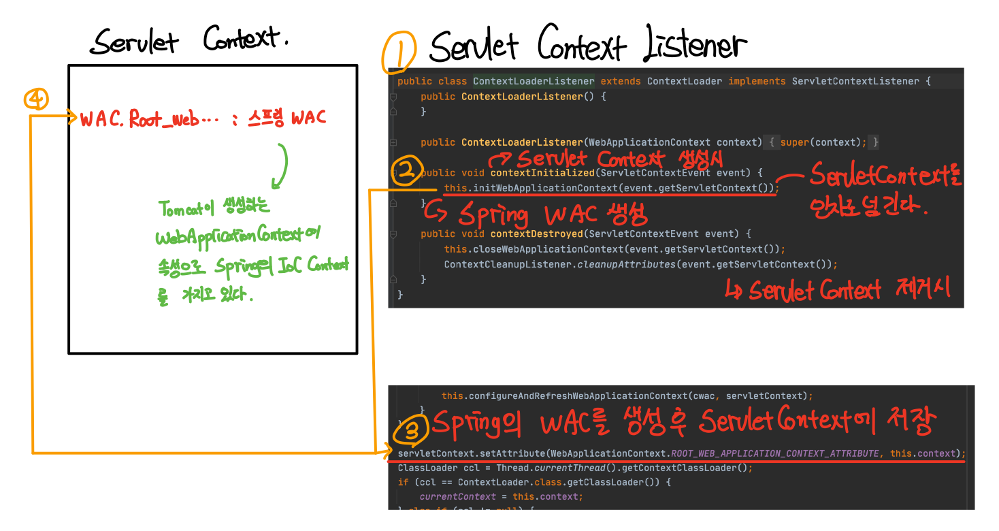
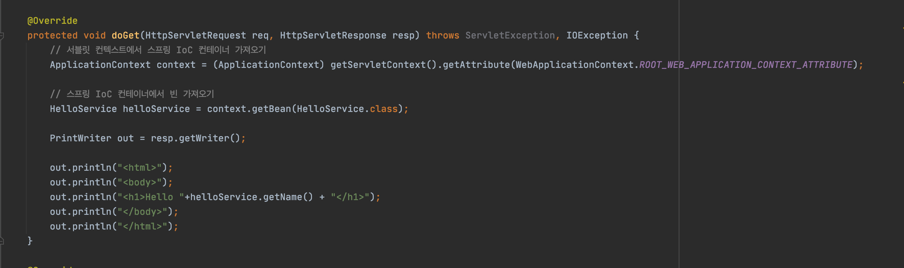
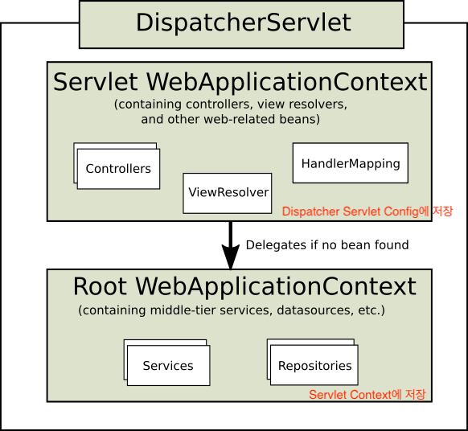

[백기선님의 MVC 강의]() 와 [그 외 참고 자료](#참고)를 통해 정리한 자료입니다.

<br>

# 목차

- [목차](#목차)
- [서블릿 애플리케이션에 스프링 연동하기](#서블릿-애플리케이션에-스프링-연동하기)
  - [1 서블릿에 IoC 컨테이너 연동](#1-서블릿에-ioc-컨테이너-연동)
    - [1-1 연동하기](#1-1-연동하기)
    - [1-2 ContextLoaderListener](#1-2-contextloaderlistener)
    - [1-3 애노테이션 기반의 IoC 컨테이너 예시](#1-3-애노테이션-기반의-ioc-컨테이너-예시)
  - [2 스프링이 제공하는 서블릿 구현체 DispatcherServlet 연동](#2-스프링이-제공하는-서블릿-구현체-dispatcherservlet-연동)
    - [2-1 DispatcherServlet을 사용하는 이유](#2-1-dispatcherservlet을-사용하는-이유)
    - [2-2 서블릿에 DispatcherServlet 연동](#2-2-서블릿에-dispatcherservlet-연동)
    - [2-3 중요한 점 -> 가장 중요!!](#2-3-중요한-점---가장-중요)
  - [3 전체 예시 코드](#3-전체-예시-코드)
  - [4 SpringBoot와 SpringMVC](#4-springboot와-springmvc)
    - [4-1 스프링 부트 사용하지 않는 스프링MVC](#4-1-스프링-부트-사용하지-않는-스프링mvc)
    - [4-2 스프링 부트로 사용하는 스프링 MVC](#4-2-스프링-부트로-사용하는-스프링-mvc)
- [참고](#참고)

<br>

# 서블릿 애플리케이션에 스프링 연동하기

**스프링이 어떻게 서블릿 애플리케이션 환경에서 동작하는지를 정리한 자료**입니다.

스프링은 두 가지의 방식으로 서블릿에 연동되어 사용되어진다.

* 서블릿에서 스프링이 제공하는 **IoC 컨테이너** 활용
* 스프링이 제공하는 **서블릿 구현체 `DispatcherServlet`(SpringMVC)** 활용

<br>

## 1 서블릿에 IoC 컨테이너 연동

<br>

### 1-1 연동하기

1. spring-webmvc 의존성

```xml
<dependency>
  <groupId>org.springframework</groupId>
  <artifactId>spring-webmvc</artifactId>
  <version>버전</version>
</dependency>
```

<br>

2.  `web.xml`에  `ContextLoaderListener` 등록

```xml
<listener>
  <listener-class>org.springframework.web.context.ContextLoaderListener</listener-class>
</listener>
```

* 서블릿 컨텍스트에 스프링 IoC 컨테이너를 속성으로 등록할 수 있게 `ServletContextListener` 를 구현한 `ContextLoaderListener` 를 등록해준다.

<br>

### 1-2 ContextLoaderListener

<p align="center"></p>

* ContextLoaderListener => 서블릿 리스너 구현체
  * **`ApplicationContext` (스프링 IoC 컨테이너)를 생성하여 서블릿 컨텍스트(ServletContext)에 바인딩(등록)해준다.**
    * **바인딩해줌으로써 웹 애플리케이션(서블릿 컨테이너)에 등록된 서블릿들이 모두 스프링 IoC 컨테이너를 사용할 수 있도록 해준다.**
  * `ApplicationContext` 를 서블릿 컨텍스트 생명주기에 따라 등록하고 소멸시켜준다.
  * 서블릿에서 IoC 컨테이너를 `ServletContext` 를 통해 꺼내 사용할 수 있다.
* **컨텍스트 리스너는 `ApplicationContext` 를 만들어야한다.**
  * 즉, **스프링 설정 파일이 필요하며, 스프링 설정 파일이 있어야 `ApplicationContext` 를 만들 수 있다.**
    * 스프링 설정 파일을 빈 설계도라고 보면 된다. (xml, 애노테이션 기반등등의 방법이 있다)

<br>

### 1-3 애노테이션 기반의 IoC 컨테이너 예시
> **IoC 컨테이너에 빈을 설정(추가)해주기 위해서는 xml이나 애노테이션과 같은 설정파일(설계도)이 필요하다.**
> 
> **이때 어떤 방식으로 설정 파일을 스캔할 지 (xml 혹은 애노테이션 `WebApplicationContext`) `contextClass`에 등록해주고,**
> 
> **그에 맞는 설정 파일(설계도)을 `contextConfigLocation`에 등록해주면 된다.**

<br>

1. `web.xml` 에 `ApplicationContext` 설정을 추가해준다.

```xml
<listener>
  <listener-class>org.springframework.web.context.ContextLoaderListener</listener-class>
</listener>

<!-- 자바 애노테이션 기반 설정파일의 컨텍스트를 사용 -->
<context-param>
  <param-name>contextClass</param-name>
  <param-value>org.springframework.web.context.support.AnnotationConfigWebApplicationContext</param-value> 
</context-param>

<context-param>
  <param-name>contextConfigLocation</param-name> <!-- 스프링 설정 파일 변수 -->
  <param-value>com.binghe.AppConfig</param-value> <!-- 스프링 설정 파일의 위치 --> 
</context-param>
```
```java
// 자바 설정 파일
package com.binghe;

import org.springframework.context.annotation.ComponentScan;
import org.springframework.context.annotation.Configuration;

@Configuration
@ComponentScan
public class AppConfig {

}
```

* 스프링는 WAS가 동작시 스캔되는 **컨텍스트 속성들의 값을 기반으로 빈을 관리하는 `ApplicationContext` 를 만든다.**
  * 위 코드에선 애노테이션의 자바 설정 기반의 IoC 컨테이너를 만들도록 설정하였다.
  * `AnnotationConfigWebApplicationContext`

<br>

2. 서블릿 컨텍스트에는 아래와 같이 속성으로 스프링의 `ApplicationContext` 가 등록된다.

```java
servletContext.setAttribute(WebApplicationContext.ROOT_WEB_APPLICATION_CONTEXT_ATTRIBUTE, this.context);
```

<br>

3. 서블릿에서 스프링 IoC 컨테이너 사용

<p align="center"></p>

<br>

> * 정리하자면, 
> * 스프링의 IoC 컨테이너 (ApplicationContext)는 `contextClass`에 등록된 WebApplicationContext(xml 혹은 annotation)를 통해 IoC 컨테이너를 생성한다.
> * 그리고 이때 contextConfigLocation에 등록된 정보륿 바탕으로 빈을 만든다.

> 위에서 등록한 IoC 컨테이너 (ApplicationContext)가 바로 `RootWebApplicationContext`다

<br>


## 2 스프링이 제공하는 서블릿 구현체 DispatcherServlet 연동

> `ContextLoaderListener` 는 스프링 IoC 컨테이너만을 만든다.
>
> 이제 스프링에서 사용하는 `DispatcherServlet` 을 만들어보는 과정을 살펴본다.

<br>

### 2-1 DispatcherServlet을 사용하는 이유

기존의 웹 애플리케이션는 서블릿을 추가할 때마다 `web.xml` 에 서블릿설정을 등록해야한다.

즉, **URL 하나당 하나의 서블릿 설정을 추가해줘야하는 번거로움이 있다.**

이러한 번거로움을 없애주는 것이 바로 **프론트 컨트롤러 패턴**이다.

* **모든 요청을 컨트롤러(`DispatcherServlet`)이 받아서 처리하는 방식이다.**
  * **Front Controller 역할을 하는 `DispatcherServlet`이 모든 요청을 다 받아서, 해당 요청을 처리할 핸들러에게 분배하는 방식이다. (이러한 과정을 dispatch라고 한다.)**

> 자세한 내용은 [Front Controller Pattern](https://github.com/binghe819/TIL/blob/master/OOP/%EB%94%94%EC%9E%90%EC%9D%B8%ED%8C%A8%ED%84%B4/Front%20Controller%20Pattern.md), [DispatcherServlet]() 을 살펴보자.

<br>

### 2-2 서블릿에 DispatcherServlet 연동
> DispatcherServlet은 웹 기능을 하는 빈들을 자체적으로 ApplicationContext를 생성하여 사용한다. 
> 
> 이를 `ServletContext` 라고도 부른다.
> 
> 즉, Root WebApplicationContext에는 공용적인 로직을 처리하는 비즈니스 관련된 Service, Repository를 저장하고,
> 
> DispatcherServlet마다 자체적으로 Controller, HandlerAdapter..등등의 빈들 따로 가지고있는다. (이때 상속을 통해 동일하게 IoC 컨테이너를 사용한다)


<br>

1. `Root WebApplication` 과 `Servlet WebApplication` 의 설정파일을 따로 두고 설정해준다.

```java
// Root WebApplicationContext Config
@Configuration
@ComponentScan(excludeFilters = @ComponentScan.Filter(Controller.class))
public class AppConfig {
}

// Servlet WebApplicationContext Config
@Configuration
@ComponentScan(useDefaultFilters = false, includeFilters = @ComponentScan.Filter(Controller.class))
public class WebConfig {
}
```

* **두 컨텍스트의 설정 파일을 따로 둔 이유는 두 개의 스코프가 다르기 때문이다.**
* `Root WebApplication` 은 스프링 IoC 컨테이너를 의미한다. - 공유 자원
  * **서블릿 컨텍스트에 저장하므로 여러 `DispatcherServlet` 에서 모두 접근이 가능하다.**
  * 스프링 IoC 컨테이너는 웹과 관련이 없는 비즈니스로직(Service, Repository)을 저장한다.
* `Servlet WebApplication` 이 바로 `DispatcherServlet` 이다. - 고유의 웹 자원
  * **서블릿 Config에 저장하므로 다른 `DispatcherServlet` 에서는 접근이 불가하다.**
  * `DispatcherServlet` 에는 웹과 관련된 `Controller` , 뷰 리솔버등을 저장한다.

<br>

2. `web.xml` 에 DispatcherServlet을 등록한다. (Root WebApplicationContext도 따로 설정해준다.)

```xml
<!-- IoC 컨테이너 객체를 listener를 통해 ServletContext에 등록해준다. (Root WebApplicationContext) -->
<listener>
  <listener-class>org.springframework.web.context.ContextLoaderListener</listener-class>
</listener>

<!-- Root WebApplicationContext 설정 -->
<!-- 여러 DispatcherServlet에서도 사용가능한 ServletContext에 등록하는 IoC 컨테이너 (Service, Repository) -->
<context-param>
  <param-name>contextClass</param-name>
  <param-value>org.springframework.web.context.support.AnnotationConfigWebApplicationContext</param-value>
</context-param>

<context-param>
  <param-name>contextConfigLocation</param-name>
  <param-value>com.binghe.AppConfig</param-value>
</context-param>

<!-- Servlet WebApplicationContext 설정 -->
<!-- DispatcherServlet 등록 (RootWebApplicationContext를 상속받아 사용하며, 따로 설정을 해줘야한다.)-->
<servlet>
  <servlet-name>Dispatcher Servlet</servlet-name>
  <servlet-class>org.springframework.web.servlet.DispatcherServlet</servlet-class>
  <!-- 따로 설정해주는 부분 -->
  <init-param>
    <param-name>contextClass</param-name>
    <param-value>org.springframework.web.context.support.AnnotationConfigWebApplicationContext</param-value>
  </init-param>
  <init-param>
    <param-name>contextConfigLocation</param-name>
    <param-value>com.binghe.WebConfig</param-value>
  </init-param>
</servlet>

<servlet-mapping>
  <servlet-name>Dispatcher Servlet</servlet-name>
  <url-pattern>/app/*</url-pattern>
</servlet-mapping>
```

* `DispatcherServlet` 을 서블릿으로 등록한다.
  * 서블릿의 속성값으로 아래 두가지를 같이 명시해준다.
    * `contextClass` - 어떠한 컨텍스트 타입을 사용할지
    * `contextConfigLocation` - 어떤 설정 파일을 읽어들일지

* `/app` 이하로 들어오는 모든 요청을 `DispatcherServlet` 에게 요청하도록 한다.

<br>

3. `Controller` 만들기

```java
@RestController
public class HelloController {
    @Autowired
    HelloService helloService;

    @GetMapping("/hello")
    public String hello(){
        return "Hello " + helloService.getName();
    }
}
```

*  `/app` 이하의 URL은 모두 `DispatcherServlet` 이 처리할 수 있게 된다.

<br>

### 2-3 중요한 점 -> 가장 중요!!
<p align="center"><br>출처 : https://docs.spring.io/spring/docs/current/spring-framework-reference/web.html#mvc</p>

* `Servlet WebApplicationContext` 는 `Root WebApplicationContext` 를 상속받아 사용하므로
*  **`Controller`에서  `Service`, `Repository` 의 의존성을 주입받을 수 있다.**
* **또한 굳이 상속관계를 만들지 않고 `Servlet WebApplicationContext` 만을 등록해서 모든 빈들을 여기에 담아도 상관 없다.** 
  * **하지만 여러 가지의 `Servlet` 이 공유할 자원이 필요하다면 상속 관계를 만드는 것이 좋다.**

<br>

## 3 전체 예시 코드
* [서블릿에서 스프링이 제공하는 **IoC 컨테이너** 활용](https://github.com/binghe819/servlet-learning-test/tree/listener-IoC-Container-HelloWorld)
* [스프링이 제공하는 **서블릿 구현체 `DispatcherServlet`(SpringMVC)** 활용]()

<br>

## 4 SpringBoot와 SpringMVC

<br>

### 4-1 스프링 부트 사용하지 않는 스프링MVC
```java
public class WebXML implements WebApplicationInitializer {
    @Override
    public void onStartup(ServletContext servletContext) throws ... {
      // web.xml에 등록할 내용들을 자바 코드로 설정.
    }
}
```

* 서블릿 컨테이너(ex. 톰캣)에 등록한 웹 애플리케이션 컨텍스트에 `DispatcherServlet` 을 등록한다.
  * `web.xml` 에 서블릿 등록
  * 혹은 `WebApplicationInitializer` 에 자바 코드로 서블릿 등록
* 세부 구성 요소는 빈 설정하기 나름

<br>

### 4-2 스프링 부트로 사용하는 스프링 MVC

* 자바 애플리케이션에 내장 톰캣을 만들고 그 안에 `DispatcherServlet` 을 등록한다.
  * 스프링 부트 자동 설정이 자동으로 해준다.
* **스프링 부트의 주관에 따라 여러 인터페이스 구현체를 빈으로 등록한다.**
  * DispatcherServlet에서 사용하는 여러 구성 요소들의 기본 값들이 일반 스프링 MVC보다 더 많이 정의해놓았다.

<br>

# 참고

* [백기선님의 Spring MVC 강의](https://www.inflearn.com/course/%EC%9B%B9-mvc/dashboard)
* https://docs.spring.io/spring/docs/current/spring-framework-reference/web.html#mvc-servlet-context-hierarchy