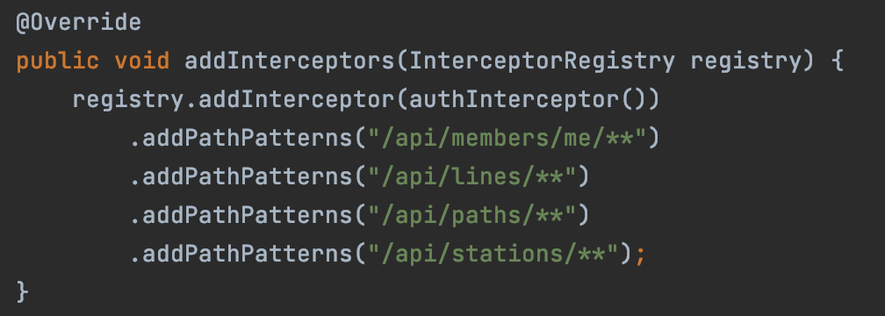
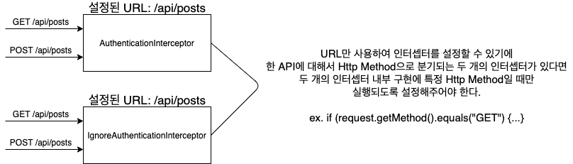
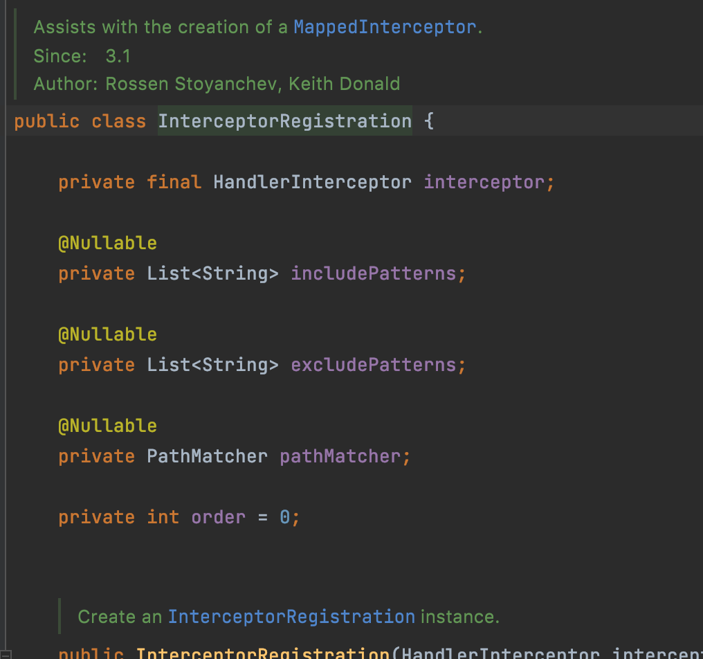
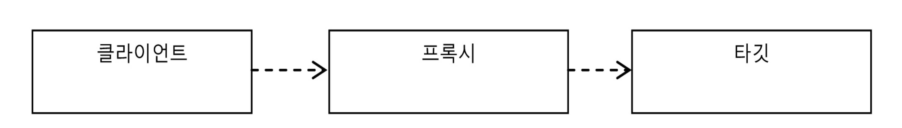
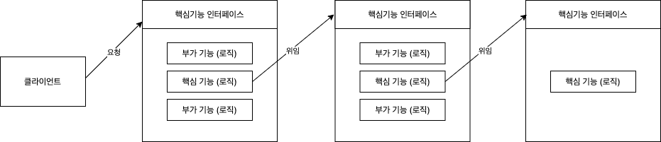
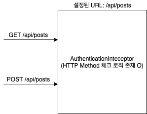
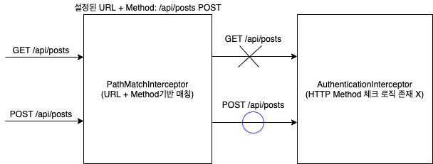

# 목차

<br>

- [목차](#목차)
- [개요](#개요)
- [커스텀을 하게 된 이유](#커스텀을-하게-된-이유)
- [스프링MVC는 어떻게 인터셉터를 매칭시키는 것인가?](#스프링mvc는-어떻게-인터셉터를-매칭시키는-것인가)
- [프록시](#프록시)
- [프록시를 이용한 인터셉터 URL Matcher 커스텀](#프록시를-이용한-인터셉터-url-matcher-커스텀)
- [끝으로](#끝으로)
- [코드](#코드)

<br>

# 개요
안녕(하세요) :)

이번 글은 `프록시를 이용한 Http Method 포함 인터셉터 매칭 설정기`이다.

우선 인터셉터란 스프링 MVC에서 제공하는 서블릿 필터와 비슷한 역할을 하는 녀석이다.

핸들러(Controller)를 실행하기 전, 후 (아직 랜더링 전) 그리고 완료 (랜더링까지 끝난 이후) 시점에 부가 작업을 하고 싶은 경우에 사용할 수 있다.

특정 핸들러에 횡단 관심사를 분리시킬 수 있어 유용하게 사용된다.

하지만 interceptor register는 특정 핸들러에 특정 인터셉터를 매칭시키는 방법은 아래와 같이 URL로 하는 것이 유일하다.

<p align="center"></p>

`왜 URL로만 설정가능할까? URL + HTTP Method를 통해 설정하면 얼마나 좋아?` 라는 생각에 커스텀을 해보고자 이번 글을 작성하게 됐다.

이번 글은 HTTP Method를 포함하도록 한 이유를 언급하고, 프록시(정확히는 데코레이터)를 활용하여 인터셉터 URL Matcher 방법을 다룬다.

> `시간이 금이다` 하시는 분들은 [프록시를 이용한 인터셉터 URL Matcher 커스텀](#프록시를-이용한-인터셉터-url-matcher-커스텀)만 봐도 될 듯하다. ㅎㅎ

<br>

# 커스텀을 하게 된 이유
필자는 현재 [우아한 테크코스](https://woowacourse.github.io/) 3기 과정을 진행하고 있다.

그리고 팀 프로젝트로 [Github Repo 기반 개발 장려 SNS](https://github.com/woowacourse-teams/2021-pick-git)를 개발하고 있다.

필자가 처음 맡은 파트는 로그인과 [OAuth](https://github.com/binghe819/TIL/blob/master/Network/OAuth%202.0/OAuth2.0.md)이었고, 스프링 시큐리티를 사용하지 않고 Interceptor와 HandlerMethodArgumentResolver를 이용했다.

> 시큐리티를 사용하지 않은 이유는 두 가지다.
> 1. 처음 배우는데 시간이 소모된다.
> 2. 시큐리티는 추상화가 잘 되어있지만, 그만큼 로그인이나 OAuth 관련된 깊이있는 학습이 어려울 것 같았다.

Interceptor는 토큰 검증, HandlerMethodArgumentResolver는 토큰 내용 추출하는 역할을 담당한다.

문제는 특정 API의 `GET`요청은 로그인/비로그인이 상관 없지만, `POST`요청을 로그인인 상태여야 했다.

예를 들어,

* `GET /api/posts`: 로그인/비로그인 상관 없음.
* `POST /api/posts`: 꼭 로그인이여야 함.

같은 URL이지만, Method를 기반으로 인터셉터를 분기시켜야했다.

* `GET`요청은 `IgnoreAuthenticationInterceptor` (토큰 검증 여부 상관 X)
* `POST`요청은 `AuthenticationInterceptor` (토큰 검증 안되면 401 던짐)

<br>

기존의 인터셉터는 URL만으로 설정이 되기 때문에 아래와 같이 인터셉터안에 Method를 구분하는 코드가 추가되어야했다.

<p align="center"> </p>

문제는 이와 같은 API가 점점 많아진다는 것이었다.

많아지면 많아질수록 두 인터셉터안에서 Http Method기반으로 분기되는 코드를 직접 넣어줘야했다.

```java
// 실제 이전에 사용했던 코드
@Override
public boolean preHandle(HttpServletRequest request, HttpServletResponse response,
    Object handler) throws Exception {
    // 문제의 Http Method 설정 코드
    if (!isGetRequest(request)) {
        throw new InvalidTokenException();
    }
    if (!isPutRequest(request)) {
        ....
    }

    // ... Interceptor 코드 (토큰 검증 로직)
    return true;
}
```

즉, 인터셉터는 토큰 검증 역할만을 담당하는 친구인데, Http Method 매칭 역할도 맡게 된 것이다.

그리하여 이를 분리시키는 커스텀을 하게 되었다.

<br>

# 스프링MVC는 어떻게 인터셉터를 매칭시키는 것인가?
우선 커스텀을 하려면 기존 로직에 대한 이해가 필요하다.

스프링MVC는 다음과 같이 매번 요청때마다 `PathMathcer`의 구현체인 `AntPathMatcher`를 사용하여 인터셉터를 매칭한다.

> [AntPathMatcher](https://docs.spring.io/spring-framework/docs/current/javadoc-api/org/springframework/util/AntPathMatcher.html)

더 정확히 말하면 요청이 들어올 때마다 `DispatcherServlet`의 `HandlerMapping`에서 미리 `InterceptorRegistry`에 설정한 인터셉터를 가져와서 HandlerExecutionChain에 인터셉터를 add하는 형식이다.

> `InterceptorRegistry`의 인터셉터는 스프링이 켜지면서 `WebMvcConfigurationSupport`의 의해서 ApplicationContext에 등록되는 형식인 듯 하다.

<p align="center"><br>InterceptorRegistry에 미리 설정한 인터셉터 설정 코드</p>

<p align="center"><br>HandlerMapping의 HandlerExecutionChain에서 인터셉터 add하는 코드</p>

그리고 DispatcherSevlet에서 Chaining형식으로 실행된다. (true면 다음 인터셉터, false면 체이닝 종료)

그렇다면 Http Method를 어떻게 추가해야할까??

처음 고안한 방법은 인터셉터 설정을 할 때 사용되는 `InterceptorRegistration`를 오버라이딩하거나 새로 만드는 것이었다.

<p align="center"> </p>

하지만, 위 코드는 스프링MVC의 코드이며, 리팩토링하는 방법을 찾을 수 없었다..

팀원들과 여러 토론끝에 찾아낸 방식은 스프링 코드를 건드리지 않고 프록시를 이용한 방법이다.

<br>

# 프록시
> 프록시를 적용하기 전에 프록시에 대한 사전 지식을 알아보자.

<br>

**🤔 프록시**

<p align="center"></p>

* **프록시**
  * 자신이 클라이언트가 사용하려고 하는 실제 대상인 것처럼 위장해서 클라이언트의 요청을 받아주는 것을 의미한다.
  * 대리자, 대리인
* **타깃 (실체)**
  * 프록시를 통해 최종적으로 요청을 위임받아 처리하는 실제 객체를 타깃이라 한다. (핵심 비즈니스)
* **프록시의 기능**
  * 타깃과 같은 메서드를 구현하고 있다가 메서드가 호출되면 타깃 객체로 **위임**한다. **(위임)**
  * 지정된 요청에 대해서는 **부가기능을 수행**한다. **(부가기능 수행)**

<br>

**프록시 특징**
<p align="center"></p>

* **위임**
  * 부가기능 외의 나머지 모든 기능은 원래 핵심기능을 가진 클래스로 위임해줘야 한다. (부가기능에서 핵심로직에게 위임)
* **부가 기능이 핵심 기능을 사용하는 구조**
  * 핵심기능은 부가기능을 가진 클래스의 존재 자체를 모른다.
  * 따라서 부가기능이 핵심기능을 사용하는 구조가 된다.
* **모두 핵심로직(타깃) 인터페이스를 구현해야한다.**
  * 클라이언트 입장에선 인터페이스만 보고 사용하기 때문에 핵심 기능을 가진 객체를 사용할 것이라고 기대한다. 하지만 사실은 부가기능을 통해 핵심기능을 이용하는 것.
  * 그러기위해선 부가로직도 핵심로직 인터페이스를 구현해줘야한다.
  * 이렇게해야 부가기능과 핵심로직의 순서를 자유자재로 변경해줄 수 있다.
* **프록시가 타깃을 제어할 수 있는 위치다.**

<br>

**프록시 사용목적**
* 클라이언트가 타깃에 접근하는 방법을 제어하기 위함 (프록시 패턴)
* 타깃에 부가적인 기능을 부여해주기 위함 (데코레이터 패턴)

<br>

**이번 커스텀할 때는 데코레이터 방식을 사용했다.**

<br>

# 프록시를 이용한 인터셉터 URL Matcher 커스텀

> 그렇다면 프록시를 이용해 어떻게 Http Method도 포함하도록 설정할까??

기존의 스프링 코드를 최대한 건드리지 않는 방향으로 생각한 방법은 API Matcher 역할을 하는 프록시 인터셉터를 만들어주는 것이다.

기존의 매칭 방식과 커스텀한 매칭 방식을 그림을 통해 비교해보자.

<p align="center"><br>기존의 매칭 방식 (URL)</p>

<p align="center"><br>커스텀한 매칭 방식 (URL + Method)</p>

<p>

쉽게 얘기해서 `POST /api/posts`로 설정해두면 `GET`으로 요청오는 것을 `PathMatchInterceptor`에서 걸러주는 것.

* `PathMatchInterceptor`: 프록시 객체
* `AuthenticationInterceptor`: 타깃 객체

<br>

이제 코드를 통해 보자.

```java
// PathMatchInterceptor
public class PathMatchInterceptor implements HandlerInterceptor {

    private HandlerInterceptor handlerInterceptor; // 타깃 인터셉터
    private HashMap<String, List<HttpMethod>> includeRegistry;
    private HashMap<String, List<HttpMethod>> excludeRegistry;
    private PathMatcher pathMatcher; // URL용 AntMatcher

    public PathMatchInterceptor(HandlerInterceptor handlerInterceptor) {
        this.handlerInterceptor = handlerInterceptor;
        this.pathMatcher = new AntPathMatcher();
        this.includeRegistry = new HashMap<>();
        this.excludeRegistry = new HashMap<>();
    }

    public PathMatchInterceptor addPathPatterns(String pattern, HttpMethod... methods) {
        return addPathPatterns(pattern, Arrays.asList(methods));
    }

    public PathMatchInterceptor addPathPatterns(String pattern, List<HttpMethod> methods) {
        this.includeRegistry.putIfAbsent(pattern, methods);
        return this;
    }

    public PathMatchInterceptor excludePatterns(String pattern, List<HttpMethod> methods) {
        this.excludeRegistry.putIfAbsent(pattern, methods);
        return this;
    }

    public PathMatchInterceptor excludePatterns(String pattern, HttpMethod... methods) {
        return excludePatterns(pattern, Arrays.asList(methods));
    }

    @Override
    public boolean preHandle(HttpServletRequest request, HttpServletResponse response,
        Object handler) throws Exception {
        String requestUrl = request.getRequestURI();
        String requestMethod = request.getMethod();
        
        // exclude 확인
        for (String url : excludeRegistry.keySet()) {
            if (pathMatcher.match(url, requestUrl) && isMethodMatch(requestMethod, url, excludeRegistry)) {
                return true; // 타깃 실행하지 않고 다음 체이닝으로 이동
            }
        }

        // include 확인
        for (String url : includeRegistry.keySet()) {
            if (pathMatcher.match(url, requestUrl) && isMethodMatch(requestMethod, url, excludeRegistry)) {
                return handlerInterceptor.preHandle(request, response, handler); // 타깃 인터셉터 실행
            }
        }

        return true;
    }
    
    private boolean isMethodMatch(String requestMethod, String url, HashMap<String, List<HttpMethod>> registry) {
        return registry.get(url)
            .stream()
            .map(Enum::name)
            .anyMatch(method -> method.equals(requestMethod));
    }
}
```
> 위 코드에서 알 수 있듯이 exclude의 우선순위를 더 높도록 했다.

<br>

```java
// Interceptor 설정
@Override
public void addInterceptors(InterceptorRegistry registry) {
    HandlerInterceptor authenticationInterceptor = new PathMatchInterceptor(authenticationInterceptor())
        .addPathPatterns("/api/posts", HttpMethod.POST);

    HandlerInterceptor ignoreAuthenticationInterceptor = new PathMatchInterceptor(ignoreAuthenticationInterceptor())
        .addPathPatterns("/api/posts", HttpMethod.GET)

    registry.addInterceptor(authenticationInterceptor)
        .addPathPatterns("/**");

    registry.addInterceptor(ignoreAuthenticationInterceptor)
        .addPathPatterns("/**");
}
```

<br>

전체적인 동작 원리는 다음과 같다.

1. API Matcher 역할을 하는 `PathMatchInterceptor`를 만들어준다.
   * 이 인터셉터는 모든 요청(`/**`)에 대해서 체이닝이 걸리도록 설정해준다.
   * `PathMatcherInterceptor`의 타깃으로 실제 사용될 인터셉터를 설정해준다. (생성자를 통해)
   * 타깃 인터셉터가 체이닝 될 include, exclude URL과 Http Method를 설정해준다.
2. 사용자 요청시 `PathMatcherInterceptor`를 거쳐 실제 인터셉터가 실행해도 되는지 URL + Method 기반으로 판단한다.

<br>

# 끝으로
객체지향 공부를하며 배웠던 내용을 활용해볼 수 있어서 좋은 경험이었다.

아직까진 큰 문제없이 커스텀한 코드를 사용중이다!

문제가 있다면 추후에 다시 포스팅 할 예정.

>  아마 더 좋은 방법이 존재하리라 생각든다. 추후에 더 리팩토링 할 예정!!

<br>

# 코드
* [PathMatchInterceptor](https://github.com/woowacourse-teams/2021-pick-git/blob/develop/backend/pick-git/src/main/java/com/woowacourse/pickgit/authentication/presentation/interceptor/PathMatchInterceptor.java)
* [OAuth 설정 코드](https://github.com/woowacourse-teams/2021-pick-git/blob/develop/backend/pick-git/src/main/java/com/woowacourse/pickgit/config/OAuthConfiguration.java)

