# 목차

<br>

- [목차](#목차)
- [들어가며](#들어가며)
- [0 환경 구축](#0-환경-구축)
  - [0-1 인프라 사양](#0-1-인프라-사양)
  - [0-2 프로젝트 환경](#0-2-프로젝트-환경)
  - [0-3 테스트 데이터 및 Ngrinder 설정](#0-3-테스트-데이터-및-ngrinder-설정)
- [1 Jedis](#1-jedis)
  - [1-1 Default Setting (Pool Size - 8)](#1-1-default-setting-pool-size---8)
  - [1-2 Custom Setting (Pool Size - 128)](#1-2-custom-setting-pool-size---128)
- [2 Lettuce](#2-lettuce)
- [3 성능 비교](#3-성능-비교)
- [마치며](#마치며)
- [주의](#주의)
- [참고](#참고)

<br>

# 들어가며
필자는 토큰 저장소와 캐시 저장소로 Redis 저장소를 이용한다.

WAS는 Spring Boot를 이용했으며, Redis Client로는 Lettuce를 사용했다.

🤔 **왜 Lettuce를 사용했을까?? Redis 도입할 당시의 나는 크게 두 가지 이유때문이었다.**

1. **성능** -> 캐싱 기능을 모두 구현하고, 간단히 브라우저를 통해 비교해보니 Lettuce의 Latency가 더 좋은 성능을 보였다. (눈으로 확인..)
   * 좋은 성능 측정 방식은 아니다. 그저 직접 브라우저를 통해 요청을 몇십번 날리며 Latency를 비교하였다.
   * 또한, [이동욱님의 글 - Jedis 보다 Lettuce 를 쓰자](https://jojoldu.tistory.com/418)을 보면 Lettuce가 빠르다고 단정지었다.
2. **설정** -> Jedis는 Connection Pool을 이용하기 때문에 설정해줘야할 것이 많으며, 적절한 Pool Size를 찾는 것 또한 비용으로 다가왔다. 반면에, Lettuce는 비동기 방식이기에 설정해줘야할 사항이 비교적 적다고 생각했다.

시간이 흘러 **실제 면접때 `왜 Lettuce를 사용했느냐?`란 질문을 받고 위 2가지 이유를 말하였다.**

**하지만 면접이 끝난 후 복기를 하다 뜨끔했다. 과연 브라우저를 통한 Latency 비교가 적절한 선택 기준이었을까?.. 아니라고 본다.**

실제 Latency의 차이도 50-100ms 내외였다. 항상 Lettuce가 빠른 것도 아니였다. 이는 두 Redis Client의 성능의 차이라고 보기 어렵다. 

**이번 글은 이전에 무지성으로 Lettuce를 사용한 자신을 반성하며, 필자가 적용한 캐싱을 이용하여 Lettuce와 Jedis의 성능을 측정해보고자 한다.**

<br>

❗️ **Jedis vs Lettuce의 하나의 예시일 뿐 모든 상황에 적용되는 것은 아닙니다. 가능한 직접 테스트하여 선택하시길 추천합니다.**

<br>

# 0 환경 구축

<br>

## 0-1 인프라 사양
테스트에 사용된 의존성 환경은 다음과 같다.

* Spring Boot 2.5.2
* Spring Boot Data Redis 2.5.2
* Jedis 3.6.1
* Lettuce 6.1.3
* Redis 4.0.9

<br>

인프라 구조는 다음과 같다.

<p align="center">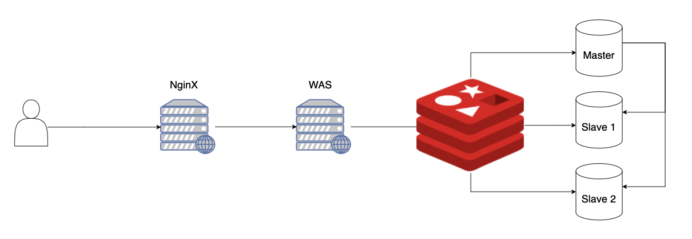 </p>

프로젝트의 인프라는 위와 같다. NginX는 HTTPS를 적용시켰으며 적절히 튜닝해둔 상태이다.

Redis 또한 RDB/AOF 기능을 OFF해두었으며, MaxClient는 50,000으로 설정해둔 상태입니다.

모든 애플리케이션은 EC2에 실행되고 있으며, `t2.medium`을 사용했다.

> 기존 프로젝트에서의 사양을 그대로 사용하고자, DB Replication은 그대로 두었다. 
> 
> WAS의 부하도 테스트하기 위해 로드 밸런싱은 우선 제거하고 하나의 WAS로만 테스트 하고자한다.

<br>

## 0-2 프로젝트 환경
필자가 Redis를 적용시킨 부분은 캐싱이며, 캐싱을 적용시킨 부분은 SNS에서의 홈피드 조회 요청이다.

최종적으로 캐싱은 다음과 같이 되도록 구현하였다.

<p align="center"> </p>

* `key : value` = `홈 피드 페이지 : 응답 JSON` 형식으로 저장되며, Redis에서는 `string:string` 형식이다.
  * Application단에서 결과 DTO를 JSON으로 직렬화하고 역직렬화하는 형식.

> 자세한 구현 방법에 대해서는 [여기](https://github.com/binghe819/TIL/blob/master/Spring/Cache/spring%20boot%20cache%20with%20redis/spring%20boot%20cache%20with%20redis%20-%20%EC%A0%81%EC%9A%A9%EA%B8%B0.md)를 참고.

<br>

## 0-3 테스트 데이터 및 Ngrinder 설정

테스트에 사용될 데이터 양은 다음과 같다.

<p align="center">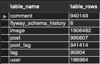<br>테스트 DB에 저장된 데이터 개수 </p>

**주요 대상인 게시물은 대략 100만건이다.**

<br>

부하 테스트는 [Ngrinder](https://naver.github.io/ngrinder/)를 사용했다.

* 테스트 시간: 10분
* VUser: 600
* 조회 범위: 1-1000 랜덤 페이지

<br>

# 1 Jedis
Jedis는 사용하기 쉽고 수많은 Redis 기능을 지원하는 대표적인 Java 진영의 Redis Client 라이브러리중 하나이다.

다른 라이브러리보다 좋은 점은 사용이 간단하다는 것이다.

하지만 Jedis는 기본적으로 Thread Safe하지 않기 때문에, 다중 스레드 환경에서 사용하려면 Connection Pool을 사용해야한다.

> 만약 여러 WAS (로드밸런싱)와 Redis를 연결하는데 Connection Pool을 사용하지 않는다면 아마 대부분 Timeout이 발생할 것이다.

<br>

이제 본격적으로 테스트를 진행해본다.

먼저 Jedis의 의존성을 추가해준다.

> build.gradle
```gradle
...
implementation 'org.springframework.boot:spring-boot-starter-cache:2.5.2'
implementation group: 'redis.clients', name: 'jedis'
implementation group: 'org.apache.commons', name: 'commons-pool2', version: '2.6.2'
implementation ('org.springframework.boot:spring-boot-starter-data-redis') {
    exclude group: 'io.lettuce', module: 'lettuce-core'
}
implementation ('it.ozimov:embedded-redis:0.7.3') {
    exclude group: 'org.slf4j', module: 'slf4j-simple'
}
...
```

<br>

## 1-1 Default Setting (Pool Size - 8)
먼저 Jedis의 기본 설정을 통해 테스트를 진행해보았다.

> RedisConfiguration.java
```java
@EnableRedisRepositories
@Configuration
public class RedisConfiguration {

    ...

    @Bean
    public RedisConnectionFactory redisConnectionFactory() {
        RedisStandaloneConfiguration configuration =
            new RedisStandaloneConfiguration(host, port);
        configuration.setPassword(password);
        
        return new JedisConnectionFactory(configuration);
    }

    @Bean
    public RedisTemplate<?, ?> redisTemplate() {
        RedisTemplate<byte[], byte[]> redisTemplate = new RedisTemplate<>();
        redisTemplate.setConnectionFactory(redisConnectionFactory());
        return redisTemplate;
    }
}
```

<br>

**성능 테스트 결과**

<br>

<p align="center">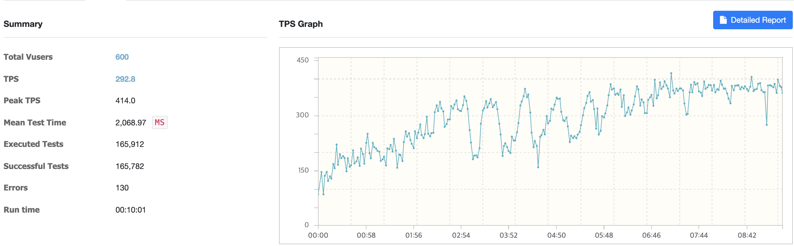<br>Ngrinder 결과 </p>

<br>

<p align="center">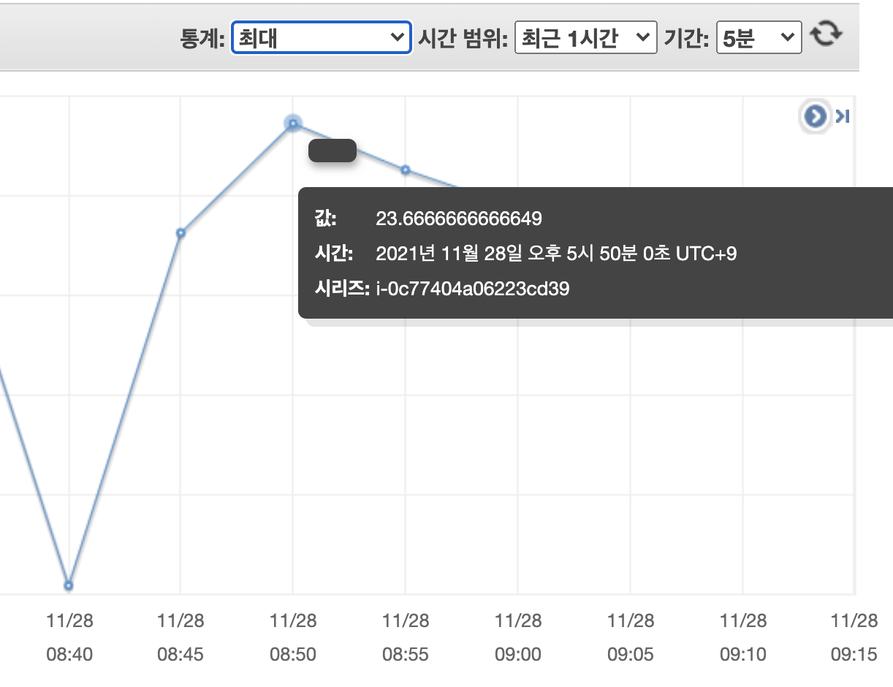<br> WAS CPU 평균, 최대 </p>

<br>

<p align="center">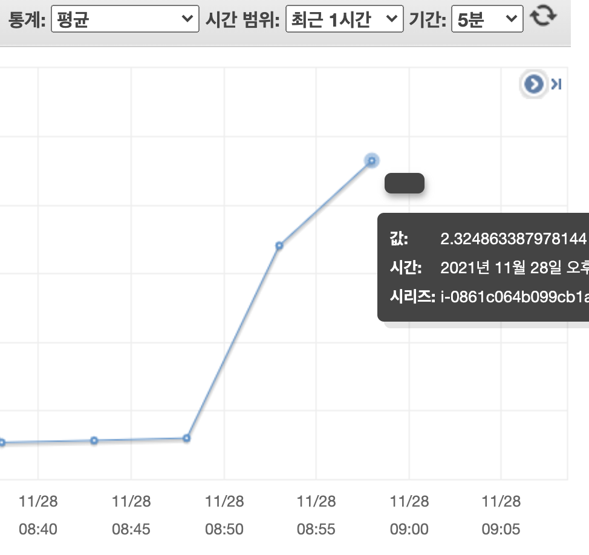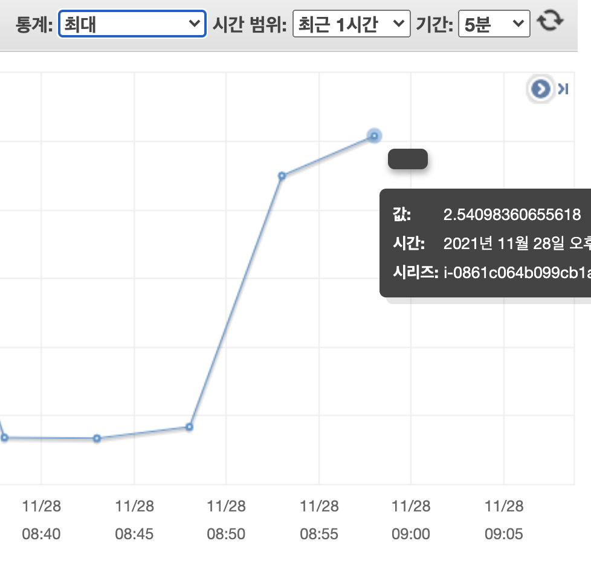<br>Redis CPU 평균, 최대 </p>

<br>

<p align="center">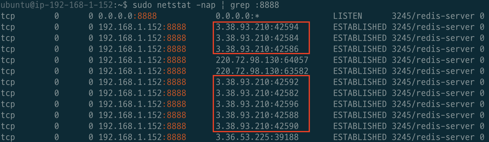<br>Redis 커넥션 수 </p>

<br>

|TPS|MTT|Executed Tests|WAS CPU 평균 / 최대|Redis CPU 평균 / 최대|Redis 커넥션 수|
|---|---|---|---|---|---|
| 292.8 | 2,068 (2초) | 165,912 | 16.1% / 23.66% | 2.32% / 2.54% | 8개 |

> Jedis는 디폴트로 Connection Pool을 사용하며, 디폴트 개수는 8개인 것을 알 수 있다.

<br>

## 1-2 Custom Setting (Pool Size - 128)
Jedis의 기본 설정을 통해 다음과 같은 결과를 얻었다.

* TPS가 생각보다 잘 나왔다.
* Redis Connection과 EC2 서버의 CPU가 여유로웠다.

**그래서 그 다음으로 시도한 테스트는 Jedis의 Connection Pool Size를 커스텀하여 테스트하는 것이다.**

[Jedis Pool Optimization](https://www.alibabacloud.com/help/doc-detail/98726.htm)을 참고하였으며, 정답이 있는 부분이 아니라 우선은 최소 36, 최대 128로 설정했다.

<br>

커스텀하는 코드는 다음과 같다. 

> RedisConfiguration.java

```java
@EnableRedisRepositories
@Configuration
public class RedisConfiguration {

    ...

    @Bean
    @ConditionalOnMissingBean(RedisConnectionFactory.class)
    public RedisConnectionFactory redisConnectionFactory() {
        RedisStandaloneConfiguration configuration =
            new RedisStandaloneConfiguration(host, port);
        configuration.setPassword(password);

        JedisConnectionFactory jedisConnectionFactory = new JedisConnectionFactory(configuration);

        GenericObjectPoolConfig<Jedis> poolConfig = jedisConnectionFactory
            .getPoolConfig();
        poolConfig.setMaxTotal(128);
        poolConfig.setMaxIdle(128);
        poolConfig.setMinIdle(36);
        poolConfig.setTestOnBorrow(true);
        poolConfig.setTestOnReturn(true);
        poolConfig.setTestWhileIdle(true);
        poolConfig.setMinEvictableIdleTimeMillis(Duration.ofSeconds(60).toMillis());
        poolConfig.setTimeBetweenEvictionRunsMillis(Duration.ofSeconds(30).toMillis());
        poolConfig.setNumTestsPerEvictionRun(3);
        poolConfig.setBlockWhenExhausted(true);

        return jedisConnectionFactory;
    }

    ...
}
```

<br>

**성능 테스트 결과**

<br>

<p align="center">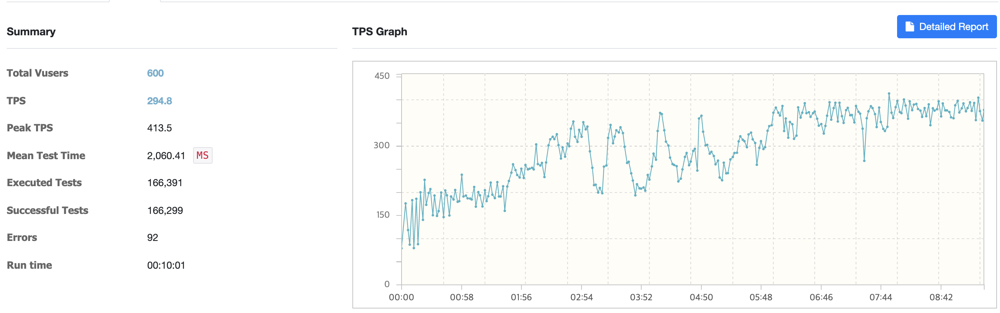<br>Ngrinder 결과 </p>

<br>

<p align="center">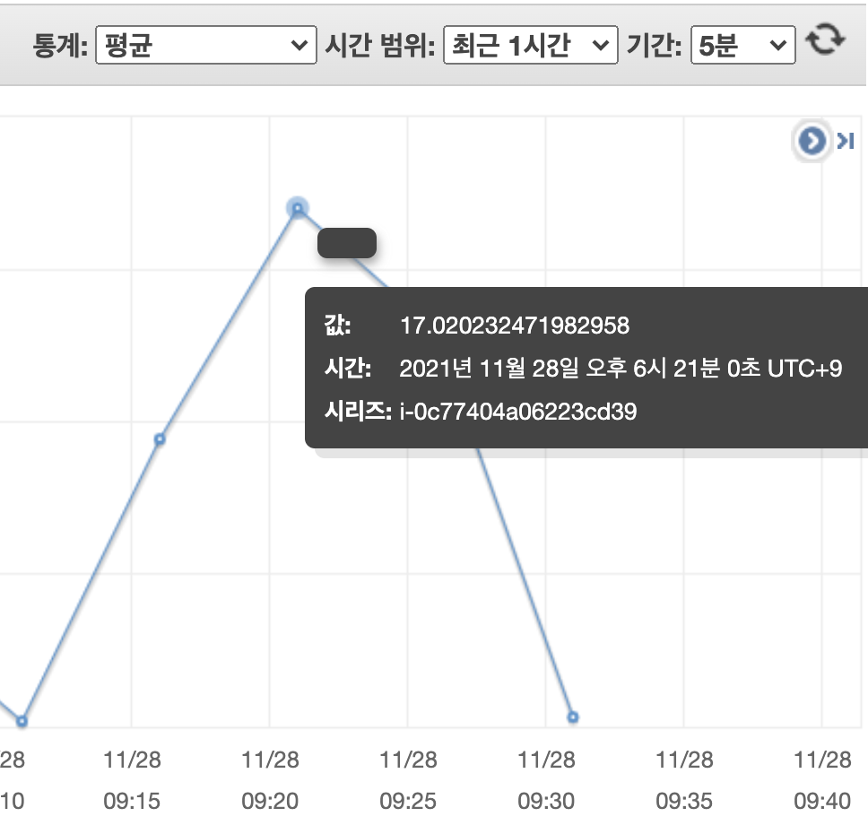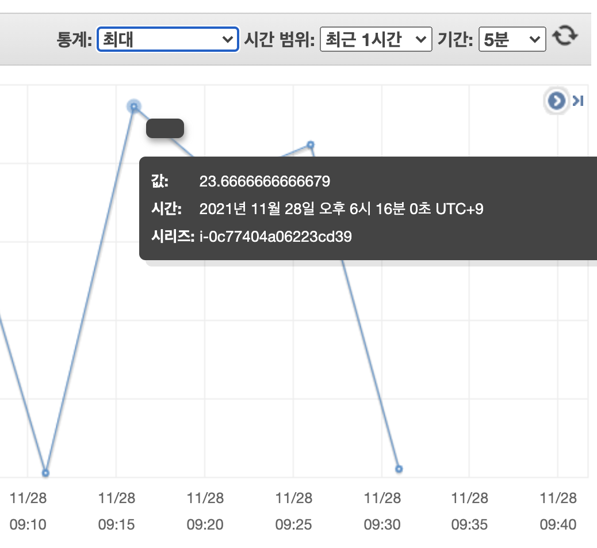<br> WAS CPU 평균, 최대 </p>

<br>

<p align="center">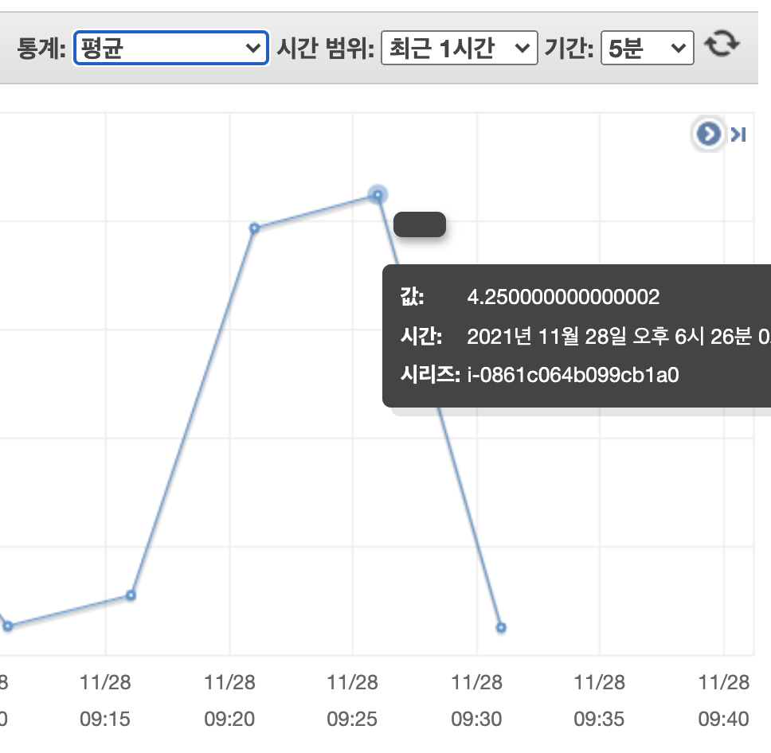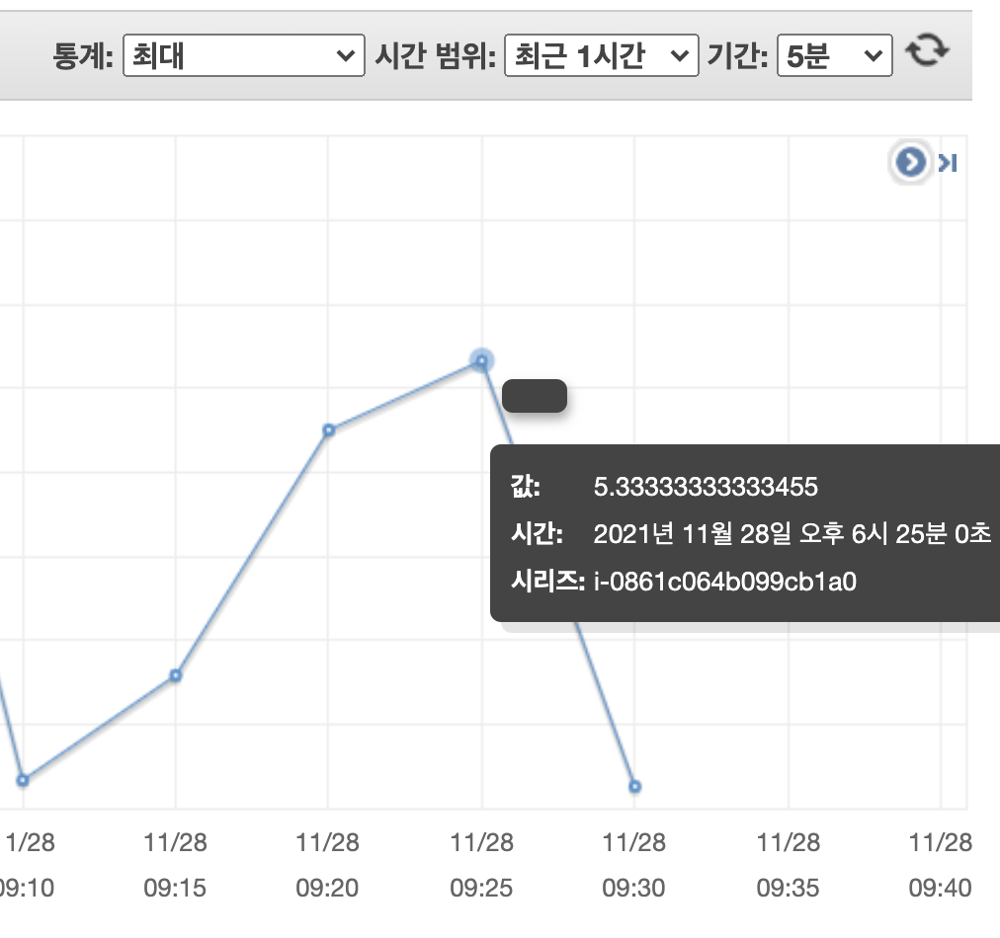<br>Redis CPU 평균, 최대 </p>

<br>

<p align="center">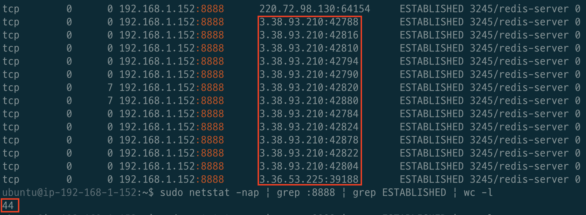<br>Redis 커넥션 수 </p>

<br>

|TPS|MTT|Executed Tests|WAS CPU 평균 / 최대|Redis CPU 평균 / 최대|Redis 커넥션 수|
|---|---|---|---|---|---|
| 294.8 | 2,060 (2초) | 166,391 | 17.02% / 23.66% | 4.25% / 5.53% | 44개 |

> 실제 Max Size인 128보다 훨씬 적은 44개가 사용되는 것을 볼 수 있었다.

<br>

# 2 Lettuce
Lettuce는 Netty (비동기 이벤트 기반 고성능 네트워크 프레임워크) 기반의 Redis 클라이언트이다.

모든 비동기 작업을 위해 같은 Thread-Safe한 네이티브 커넥션을 공유한다.

비동기로 요청을 처리하기 때문에 고성능을 자랑한다.

> Lettuce는 설정을 통해 동기, 비동기, reactive API 방식으로 Redis와 통신할 수 있다.

Lettuce로 코드를 변경하여 다시 테스트를 진행해보았다.

<br>

> build.gradle

```gradle
...
implementation 'org.springframework.boot:spring-boot-starter-cache:2.5.2'
implementation 'org.springframework.boot:spring-boot-starter-data-redis:2.5.2'
implementation ('it.ozimov:embedded-redis:0.7.3') {
    exclude group: 'org.slf4j', module: 'slf4j-simple'
}
...
```
* spring boot data redis는 기본적으로 Lettuce를 사용한다.

<br>

> RedisConfiguration.java
```java
@EnableRedisRepositories
@Configuration
public class RedisConfiguration {

    ...

    @Bean
    @ConditionalOnMissingBean(RedisConnectionFactory.class)
    public RedisConnectionFactory redisConnectionFactory() {
        RedisStandaloneConfiguration configuration =
            new RedisStandaloneConfiguration(host, port);
        configuration.setPassword(password);
        return new LettuceConnectionFactory(configuration);
    }
    
    ...
}
```

>By default, all LettuceConnection instances created by the LettuceConnectionFactory share the same thread-safe native connection for all non-blocking and non-transactional operations. - [Spring Data Redis 공식 문서](https://docs.spring.io/spring-data/data-redis/docs/current/reference/html/#redis:connectors:lettuce)

<br>

**성능 테스트 결과**

<br>

<p align="center">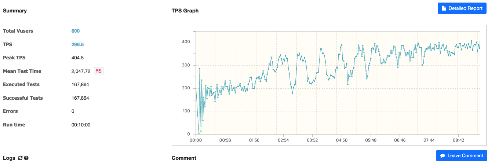<br>Ngrinder 결과 </p>

<br>

<p align="center">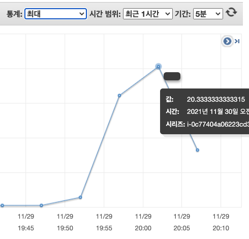<br> WAS CPU 평균, 최대 </p>

<br>

<p align="center">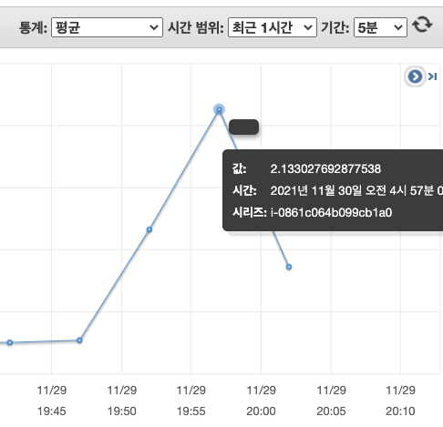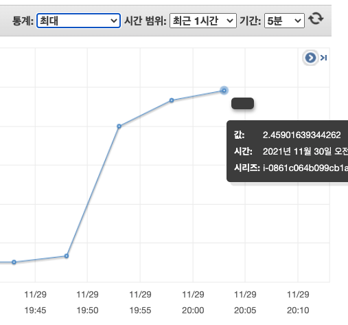<br>Redis CPU 평균, 최대 </p>

<br>

<p align="center">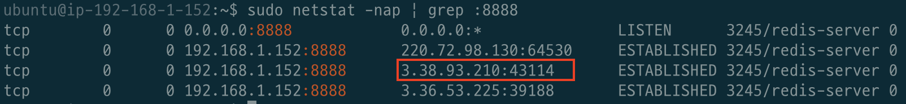<br>Redis 커넥션 수 </p>

<br>

|TPS|MTT|Executed Tests|WAS CPU 평균 / 최대|Redis CPU 평균 / 최대|Redis 커넥션 수|
|---|---|---|---|---|---|
| 296.5 | 2,047 (2초) | 167,864 | 18.71% / 20.33% | 2.13% / 2.45% | 1개 |

<br>

# 3 성능 비교

| |TPS|MTT|Executed Tests|WAS CPU 평균 / 최대|Redis CPU 평균 / 최대|Redis 커넥션 수|
|---|---|---|---|---|---|---|
| Jedis (Pool Size - 8) | 292.8 | 2,068 | 165,912 | 16.1% / 23.66% | 2.32% / 2.54% | 8개 |
| Jedis (Pool Size - 128) | 294.8 | 2,060 | 166,391 | 17.02% / 23.66% | 4.25% / 5.53% | 44개 |
| Lettuce | 296.5 | 2,047 | 167,864 | 18.71% / 20.33% | 2.13% / 2.45% | 1개 |

> 각 테스트는 2번씩 진행했으며, 더 좋은 결과를 토대로 비교하였다.

* 커넥션 풀 Size를 높인다고 TPS, MTT, 테스트 실행 횟수가 비약적으로 높아지진 않는다. (2증가)
* 커넥션 풀 Size를 늘리면, Redis에서의 커넥션 수도 `WAS * 커넥션 풀 Size`만큼 늘어난다. 이는 메모리를 주로 사용하는 Redis에게는 좋지 않을 듯 하다.
  * 실제로 Redis의 병목현상의 대부분은 CPU가 아닌 시스템 메모리/네트워크 대역폭에서 발생한다고 한다. [참고](https://coderscat.com/why-redis-is-single-threaded/)
  * **Lettuce는 1개를 유지함으로써, Jedis보다 우수하다고 판단된다.**
* **모든 수치에서 Lettuce가 더 좋은 성능을 발휘한다.**
  * WAS의 사용량은 Lettuce가 소폭 높지만, WAS의 CPU 사용량은 큰 문제가 될 것이라 판단되지 않는다. (로드밸런싱을 적용시키면 되기 때문)

<br>

# 마치며
성능 비교를 통해 알 수 있듯이 Lettuce가 모든 면에서 더 우수하다.

하지만 [이동욱님 - Jedis보다 Lettuce를 쓰자](https://jojoldu.tistory.com/418)만큼 큰 성능적 차이는 없다.

동욱님이 글을 작성한 시점 이후에 Jedis도 많은 업데이트를 진행하면서 문제점을 고친 것 때문인 듯 하다.

실제로 [Jedis Release](https://github.com/redis/jedis/releases?page=3)를 보면 커넥션 풀 동시성 문제 (Race Condition, Jedis Pool exhausted)문제등등 다양한 문제들을 해결한 것으로 보인다.

> 필자 생각엔 현재는 Jedis 사용하는 것도 크게 문제 없어보인다.

그럼에도 불구하고, 필자는 Lettuce를 그대로 사용할 예정이다.

그 이유는 다음과 같다.

* **Lettuce가 모든 면에서 더 우수하다.**
* **Lettuce는 Jedis보다 설정이 훨씬 간단한다.**
  * Jedis는 Connection Pool Size 관련된 설정을 해줘야하며, 최적화된 Size를 찾아주어야한다.
* **Lettuce는 Jedis보다 문서가 훨씬 잘 되어있다.**
  * [Jedis 문서](https://github.com/redis/jedis)
  * [Lettuce 문서](https://lettuce.io/core/release/reference/index.html)

<br>

# 주의
이번 테스트는 Ngrinder를 이용하여 테스트를 진행하였다.

그리고 현재 필자가 사용가능한 EC2의 보안적인 이유로 인해 Ngrinder의 Controller와 Agent를 하나의 EC2안에 도커로 띄워주고 테스트를 진행했다.

이로인해 어떠한 테스트를 진행하든, 테스트시 항상 Ngrinder의 CPU 사용량은 100%를 보여주었다.

물론 같은 환경에서 진행한 테스트이기에 큰 문제는 없다고 추측하고있지만, 그래도 혹시 몰라 주의할 점으로 남겨둔다.

> 추후에 Controller와 Agent를 분리하여 테스트한다면 이 글은 지속적으로 업데이트 할 예정이다.

<br>

# 참고
* https://jojoldu.tistory.com/418
* https://mashhurs.wordpress.com/2020/03/26/jedis-vs-lettuce-java-redis-clients/

