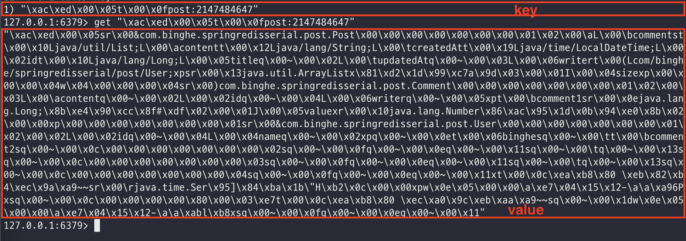
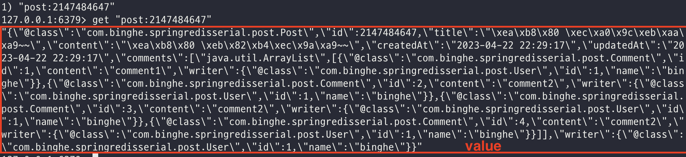
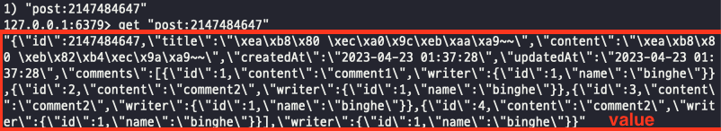

# 목차

<br>

- [목차](#목차)
- [Spring RedisTemplate Serializer 종류와 사용시 주의할 점](#spring-redistemplate-serializer-종류와-사용시-주의할-점)
- [1 간단한 예시 코드 구현](#1-간단한-예시-코드-구현)
- [2 Serializer 구현체 종류](#2-serializer-구현체-종류)
  - [2-1 JdkSerializationRedisSerializer](#2-1-jdkserializationredisserializer)
  - [2-2 GenericJackson2JsonRedisSerializer](#2-2-genericjackson2jsonredisserializer)
  - [2-3 Jackson2JsonRedisSerializer](#2-3-jackson2jsonredisserializer)
  - [2-4 StringRedisSerializer](#2-4-stringredisserializer)
- [정리](#정리)
- [참고](#참고)

<br>

# Spring RedisTemplate Serializer 종류와 사용시 주의할 점

Redis는 대표적인 인메모리 Key-Value NoSQL 데이터베이스이다.

Redis는 byte arrays를 저장하지만, 따로 애플리케이션의 데이터를 `직렬화 / 역직렬화`하는 기능을 제공하지 않는다.

그러므로 애플리케이션단에서 `직렬화 / 역직렬화`의 역할을 담당해주어야한다.

이번 글은 Java Spring 환경에서 Redis를 사용할 경우 `직렬화 / 역직렬화`하는 Serializer의 종류와 장단점에 대해서 정리해본다.

> 이번 글을 읽기전에 [spring으로 redis를 사용하기 전에 보면 좋은 큰 그림](../spring%EC%9C%BC%EB%A1%9C%20redis%EB%A5%BC%20%EC%82%AC%EC%9A%A9%ED%95%98%EA%B8%B0%20%EC%A0%84%EC%97%90%20%EB%B3%B4%EB%A9%B4%20%EC%A2%8B%EC%9D%80%20%ED%81%B0%20%EA%B7%B8%EB%A6%BC/spring%EC%9C%BC%EB%A1%9C%20redis%EB%A5%BC%20%EC%82%AC%EC%9A%A9%ED%95%98%EA%B8%B0%20%EC%A0%84%EC%97%90%20%EB%B3%B4%EB%A9%B4%20%EC%A2%8B%EC%9D%80%20%ED%81%B0%20%EA%B7%B8%EB%A6%BC.md)을 먼저 보고오길 추천한다.

학습 테스트에 사용되는 코드말고 바로 Serializer 관련된 내용을 보고싶다면 [2 Serializer 구현체 종류](#2-serializer-구현체-종류)부터 볼 것을 추천한다.

<br>

# 1 간단한 예시 코드 구현
이번 글은 직접 코드를 작성해가며 각각의 Serializer를 테스트해본다.

그러므로, 예시에 사용될 간단한 예시 코드를 작성해본다.

게시판 예시이며, User, Post, Comment로 구성하였다.

> User.java

```java
@Getter
public class User {

    private Long id;

    private String name;
}
```

> Post.java

```java
@Getter
public class Post {

    private Long id;

    private String title;

    private String content;

    @JsonFormat(pattern = "yyyy-MM-dd HH:mm:ss", timezone = "Asia/Seoul")
    @JsonSerialize(using = LocalDateTimeSerializer.class)
    @JsonDeserialize(using = LocalDateTimeDeserializer.class)
    private LocalDateTime createdAt;

    @JsonFormat(pattern = "yyyy-MM-dd HH:mm:ss", timezone = "Asia/Seoul")
    @JsonSerialize(using = LocalDateTimeSerializer.class)
    @JsonDeserialize(using = LocalDateTimeDeserializer.class)
    private LocalDateTime updatedAt;

    private List<Comment> comments;

    private User writer;
}
```

> Comment.java

```java
@Getter
public class Comment {

    private Long id;

    private String content;

    private User writer;
}
```

<br>

> RedisConfiguration.java

```java
@Configuration
@EnableRedisRepositories
public class RedisConfiguration {

    // Redis Client + Datasource 설정
    @Bean
    public RedisConnectionFactory redisConnectionFactory() {
        return new LettuceConnectionFactory("127.0.0.1", 6379);
    }

    // RedisTemplate 설정
    @Bean
    public RedisTemplate<?, ?> redisTemplate() {
        RedisTemplate<byte[], byte[]> redisTemplate = new RedisTemplate<>();
        redisTemplate.setConnectionFactory(redisConnectionFactory());
        return redisTemplate;
    }
}
```

테스트 코드는 아래와 같이 구성해준다.

> RedisSerializerTest.java

```java
@DisplayName("JSON 직렬화/역직렬화 테스트")
@Test
void serializing_and_deserializing_json() {
    // given
    User user = User.createMock();
    List<Comment> comments = Comment.createMocks();
    Post post = Post.createMock("글 제목~~", "글 내용~~", comments, user);
    String key = "post:" + post.getId();
    redisTemplate.delete(key);

    // when
    ValueOperations<String, Post> valueOperations = redisTemplate.opsForValue();
    valueOperations.set(key, post);

    Post result = valueOperations.get("post:" + post.getId());

    // then
    assertThat(result.getId()).isInstanceOf(Long.class);
    assertThat(result.getId()).isEqualTo(2147484647L);
    assertThat(result.getCreatedAt()).isInstanceOf(LocalDateTime.class);
}
```

<br>

# 2 Serializer 구현체 종류
이제 위 예시를 활용하여 각 Serializer 구현체의 차이점을 살펴본다.

<br>

## 2-1 JdkSerializationRedisSerializer
가장 먼저 알아볼 Serializer는 JDK에서 기본으로 제공하는 자바 직렬화를 사용하는 JdkSerializationRedisSerializer다.

<br>

💁‍♂️ **적용 예시**

RedisTemplate Serializer는 디폴트로 `JdkSerializationRedisSerializer`를 사용하기때문에 따로 설정을 해주지않으면 `JdkSerializationRedisSerializer`을 사용하게된다.

테스트 코드를 통해 Post와 관련된 내용을 저장하면 아래와 같이 저장된다.

<p align="center"><br>JdkSerializationRedisSerializer를 사용하여 저장했을 때의 key, value 형태. </p>

<br>

💁‍♂️ **문제점 - `JdkSerializationRedisSerializer`는 JDK에서 기본으로 제공하는 자바 직렬화를 사용한다. 즉, JDK 직렬화의 문제점을 그대로 가지게된다.**

`JdkSerializationRedisSerialize`의 경우, Redis에 저장하고자하는 데이터 객체가 모두 `java.io.Serializable` 인터페이스를 구현하고있어야한다.

> `Person`, `User`, `Comment` 예시 객체 모두 `Serializable`을 구현해주어야한다.

즉, JDK 직렬화의 문제점을 그대로 가지게된다.

1. **버저닝 이슈** - JDK를 사용할 경우 두 가지의 버저닝 이슈가 있다.
   * **첫번째는 직렬화할 때의 멤버 변수의 메타 정보와 역직렬화할 때의 메타 정보가 다르면 예외가 발생한다.**
     * JDK 직렬화는 위의 저장된 value 값에서 알 수 있듯이, 직렬화한 값에 각 객체 필드의 패키지 위치와 타입이 저장된다.
     * 이는 역직렬화시 사용되는데, 만약 패키지 위치를 변경하면 역직렬화시 해당 객체를 찾을 수 없으므로 `InvalidClassException` 예외가 발생하며 역직렬화에 실패하게된다.
     * 즉, 직렬화된 객체의 패키지 위치가 하나라도 변경되면 역직렬화가 실패하게되어, 자칫 서비스 장애로 이어질 수 있다.
   * **두번째는 `serialVersionUID` 이슈다.**
     * JDK 직렬화는 `serialVersionUID`를 따로 설정하지 않으면 클래스의 기본 해쉬값을 `serialVersionUID`로 사용하여 역직렬화시 직렬화된 객체와 비교한다.
     * 이때 만약 직렬화할 때의 `serialVersionUID`와 역직렬화할 때의 `serialVersionUID`가 다르면 `InvalidClassException`가 발생하게된다.
   * **이로인해 JDK 직렬화는 자주 변경되는 객체를 대상으로 사용하는 것은 지양하는 것이 좋다. 사소한 변경에도 생각하지못한 예외사항이 발생할 수 있다.**
   * 번외) 필드 추가, 삭제는 예외가 발생하지 않는다.
2. **`Serializable` 지옥**
   * `Serializable`을 구현한 클래스만 직렬화/역직렬화 될 수 있다.
     * 만약 구현하지않으면 런타임에 직렬화시 `NotSerializableException`가 발생한다.
     * 또 하나의 문제는 이 예외가 발생할 것이라는 것을 컴파일 타임에 알 수 없다.
   * 문제는 다른 객체를 참고하고있는 객체가 직렬화/역직렬화하려면 참조하는 객체도 모두 `Serializable`을 구현해줘야한다. (상속도 동일하다.)
   * 이 특징으로인해 복잡한 객체 그래프를 가진경우 `Serializable` 지옥에 빠질 수 있다.
3. **용량 문제**
   * 앞서 말했듯이, JDK 직렬화는 각 객체의 메타 정보 (패키지 정보, 타입 정보)를 같이 직렬화하여 저장한다.
   * 별로 큰 데이터가 아닐 수도 있지만, 비교적 큰 데이터를 캐시한다고 가정한다면 각 멤버변수별로 메타 정보를 가지기때문에 용량이 뻥튀기 될 수 있다. 
   * **대용량 데이터를 캐시할 때는 가능한 사용하지 않는 것이 좋다.**
4. **호환성 문제**
   * JDK 직렬화는 자바 시스템에서만 직렬화/역직렬화 가능하다.
   * 즉, **Redis에 JDK를 이용하여 직렬화하여 저장하면, 다른 시스템에서는 해당 데이터를 가져가서 전혀 사용할 수 없다.**

> 더 자세한 내용은 [자바 직렬화 이해하기 - 사용시 주의할 점과 사용을 추천하지 않는 이유](../../../JAVA/serialization_deserialization/java_serialization/java_serialization.md)를 참고.

<br>

💁‍♂️ **장점도 물론 있다. 하지만 문제점이 장점보다 훨씬 많고 변경에 취약한 구조이므로 사용을 지양한다.**

물론 JDK 직렬화를 사용하는 `JdkSerializationRedisSerializer를`도 장점이 있다.

예를 들어, 객체마다 Class Type등 메타 정보를 같이 저장하기때문에 객체별로 직렬화/역직렬화에 대한 설정을 해주지않아도 자동으로 다 해준다.

하지만 그럼에도 득보다 실이 훨씬 많으므로 사용하는 것을 추천하지 않는다.

<br>

## 2-2 GenericJackson2JsonRedisSerializer
두번째로 알아볼 Serializer는 [Jackson](https://github.com/FasterXML/jackson)라이브러리를 사용한 `GenericJackson2JsonRedisSerializer`다.

<br>

💁‍♂️ **적용 예시**

`GenericJackson2JsonRedisSerializer`의 경우 RedisTemplate에 따로 설정해주어야한다.

> RedisConfiguration.java
```java
@Bean
public RedisTemplate<?, ?> redisTemplate() {
    RedisTemplate<byte[], byte[]> redisTemplate = new RedisTemplate<>();
    redisTemplate.setConnectionFactory(redisConnectionFactory());
    redisTemplate.setKeySerializer(new StringRedisSerializer());
    redisTemplate.setValueSerializer(new JdkSerializationRedisSerializer());
    return redisTemplate;
}
```
Key의 경우 대부분 String을 사용하기때문에 `StringRedisSerializer`를 사용해준다.

테스트 코드를 통해 Post와 관련된 내용을 저장하면 아래와 같이 저장된다.

<p align="center"><br>GenericJackson2JsonRedisSerializer를 사용하여 저장했을 때의 key, value 형태. </p>

<details>
  <summary>저장된 JSON Beautify</summary>
  
  ---
  
  ```json
  {
    "@class": "com.binghe.springredisserial.post.Post",
    "id": 2147484647,
    "title": "글 제목~~",
    "content": "글 내용~~",
    "createdAt": "2023-04-22 22:29:17",
    "updatedAt": "2023-04-22 22:29:17",
    "comments": [
        "java.util.ArrayList",
        [
        {
            "@class": "com.binghe.springredisserial.post.Comment",
            "id": 1,
            "content": "comment1",
            "writer": {
            "@class": "com.binghe.springredisserial.post.User",
            "id": 1,
            "name": "binghe"
            }
        },
        {
            "@class": "com.binghe.springredisserial.post.Comment",
            "id": 2,
            "content": "comment2",
            "writer": {
            "@class": "com.binghe.springredisserial.post.User",
            "id": 1,
            "name": "binghe"
            }
        },
        {
            "@class": "com.binghe.springredisserial.post.Comment",
            "id": 3,
            "content": "comment2",
            "writer": {
            "@class": "com.binghe.springredisserial.post.User",
            "id": 1,
            "name": "binghe"
            }
        },
        {
            "@class": "com.binghe.springredisserial.post.Comment",
            "id": 4,
            "content": "comment2",
            "writer": {
            "@class": "com.binghe.springredisserial.post.User",
            "id": 1,
            "name": "binghe"
            }
        }
        ]
    ],
    "writer": {
        "@class": "com.binghe.springredisserial.post.User",
        "id": 1,
        "name": "binghe"
    }
  }
  ```
  
  ---
</details>

<br>

💁‍♂️ **장점 - `GenericJackson2JsonRedisSerializer`는 별도의 Class Type을 지정하지 않아도 자동으로 직렬화해준다.**

JDK 직렬화의 장점과 동일하게 `GenericJackson2JsonRedisSerializer`는 별도의 Class Type을 설정해주지않아도 자동으로 직렬화/역직렬화해준다.

위 적용 예시에서 볼 수 있듯이, `@class` 필드에 해당 Class의 패키지 정보와 타입 정보를 담아 저장한다.

<br>

💁‍♂️ **단점 - 버저닝 이슈와 용량 문제**

자동으로 직렬화/역직렬화 해주는만큼 단점도 존재한다.

1. **버저닝 이슈**
  * JDK 직렬화와 동일하게 직렬화할 때의 멤버 변수의 메타 정보(`@class`)와 역직렬화할 때의 메타 정보가 다르면 예외가 발생한다.
  * 직렬화하여 저장할 때와 역직렬화하여 사용할 때의 애플리케이션의 객체 패키지 정보가 조금이라도 수정되면 예외가 발생한다.
  * 즉, **특정 애플리케이션 객체 패키지 정보에 의존적인 구조가되어, 변경에 취약하다.**
  * **게다가 MSA와 같이 여러 애플리케이션이 상호작용하며 같은 데이터를 사용하는 프로젝트의 경우 모두 같은 패키지 구조를 가져야하는 문제가있다.**
2. **용량 문제**
   * `@class`로 직렬화하는 객체의 메타 정보를 저장하므로 대용량 시스템에서는 당연히 용량 문제가 발생할 수 있다.
   * 뒤에서 살펴볼 내용이지만, 실제로 동일한 내용의 데이터를 저장할 때 `@class`로인해 작게는 1.5배, 크게는 2배 이상의 용량 낭비가 발생한다.

<br>

💁‍♂️ **단일 애플리케이션에서 사용하며, 용량이 크지 않다면 편하게 사용할 수 있다.**

`GenericJackson2JsonRedisSerializer`은 단점으로 인해 수정에 취약하고, MSA와 같은 환경에선 사용하기 힘들다.

그럼에도 용량 문제가 큰 영향이 끼치지않는다면, 직렬화/역직렬화에 대한 설정을 해줄 필요없는 장점이 크게 다가온다.

그러므로 상황에 맞게 선택해서 사용하면 된다.

> 필자는 그다지 추천하지 않는다.

<br>

## 2-3 Jackson2JsonRedisSerializer
세번째로 알아볼 Serializer도 [Jackson](https://github.com/FasterXML/jackson)라이브러리를 사용하는 `Jackson2JsonRedisSerializer`다.

<br>

💁‍♂️ **적용 예시**

`Jackson2JsonRedisSerializer`도 RedisTemplate에 따로 설정해주어야한다.

> RedisConfiguration.java
```java
@Bean
public RedisTemplate<?, ?> redisTemplate() {
    RedisTemplate<byte[], byte[]> redisTemplate = new RedisTemplate<>();
    redisTemplate.setConnectionFactory(redisConnectionFactory());
    redisTemplate.setKeySerializer(new StringRedisSerializer());
    redisTemplate.setValueSerializer(new Jackson2JsonRedisSerializer(Post.class));
    return redisTemplate;
}
```

**`GenericJackson2JsonRedisSerializer`와 다른 점은 직렬화/역직렬화하는 객체 (위 예시에서는 `Post`)를 직접 설정해주어야한다는 것이다.**

테스트 코드를 통해 Post와 관련된 내용을 저장하면 아래와 같이 저장된다.

<p align="center"><br>Jackson2JsonRedisSerializer를 사용하여 저장했을 때의 key, value 형태. </p>

<details>
  <summary>저장된 JSON Beautify</summary>
  
  ---
  
  ```json
  {
    "id": 2147484647,
    "title": "글 제목~~",
    "content": "글 내용~~",
    "createdAt": "2023-04-23 01:37:28",
    "updatedAt": "2023-04-23 01:37:28",
    "comments": [
        {
        "id": 1,
        "content": "comment1",
        "writer": {
            "id": 1,
            "name": "binghe"
        }
        },
        {
        "id": 2,
        "content": "comment2",
        "writer": {
            "id": 1,
            "name": "binghe"
        }
        },
        {
        "id": 3,
        "content": "comment2",
        "writer": {
            "id": 1,
            "name": "binghe"
        }
        },
        {
        "id": 4,
        "content": "comment2",
        "writer": {
            "id": 1,
            "name": "binghe"
        }
        }
    ],
    "writer": {
        "id": 1,
        "name": "binghe"
    }
  }
  ```
  
  ---
</details>

<br>

💁‍♂️ 장점 - 직렬화 객체의 메타 정보를 저장하지않아 버저닝 이슈와 용량 이슈가 해결되었다.

`Jackson2JsonRedisSerializer`는 이전의 `GenericJackson2JsonRedisSerializer`와 다르게 `@class` 필드를 포함하고있지않다.

즉, **더이상 버저닝 이슈와 용량 이슈가 발생하지 않는다.**

<br>

💁‍♂️ **하지만, 항상 Serializer에 ClassType을 지정해줘야한다. - 문제점**

버저닝 이슈와 용량 이슈가 발생하지않지만, `RedisTemplate` 설정에 매번 ClassType을 지정해줘야한다.

그리고 **해당 `RedisTemplate`은 지정한 `ClassType`만을 직렬화/역직렬화하기때문에, ClassType별로 `RedisTemplate`을 지정해줘야한다.**

> 즉, `RedisTemplate`는 단일 Serializer를 가지도록 설계되었다고 이해하면된다. (RedisConnectionFactory 1 : N RedisTemplate)

만약 Class Type의 종류가 많아진다면 이러한 부분이 단점으로 작용할 수 있다.

<br>

💁‍♂️ 결국 트레이드 오프이다.

* `GenericJackson2JsonRedisSerializer`
  * ClassType 정보를 같이 직렬화하여 저장하기때문에 ClassType별 설정을 전혀하지 않아도 된다.
  * 문제는 버저닝 이슈 (패키지 정보 수정)와 용량 이슈가 발생한다.
* `Jackson2JsonRedisSerializer`
  * ClassType 정보를 같이 직렬화하지않으므로, 버저닝 이슈와 용량 이슈는 해결되지만, 매 객체마다 ClassType 설정을 해주어야한다.
  * 즉, 객체마다 RedisTemplate을 생성 및 ClassType 설정을 해주어야한다.

> 필자는 비교적 큰 용량을 캐싱하는 경우라면, `Jackson2JsonRedisSerializer`을 권장하고싶다.
> 
> 반면에, 단일 애플리케이션에서 빠르게 캐싱을 구현하고 다양한 기능을 만드는 단계라면 `GenericJackson2JsonRedisSerializer`를 권장하고싶다.

<br>

## 2-4 StringRedisSerializer
마지막은 String 값 그대로 저장하는 `StringRedisSerializer`다.

객체를 특정 형태 (ex. JSON)으로 Redis에 저장하기위해서 직접 직렬화/역직렬화하는 로직을 구성해주어야한다.

즉, 아래와 같이 객체를 String으로 만드는 작업은 따로 로직을 구성하여 넣어주어야한다.

> RedisConfiguration.java

```java
@Bean
public RedisTemplate<?, ?> redisTemplate() {
    RedisTemplate<byte[], byte[]> redisTemplate = new RedisTemplate<>();
    redisTemplate.setConnectionFactory(redisConnectionFactory());
    redisTemplate.setKeySerializer(new StringRedisSerializer());
    redisTemplate.setValueSerializer(new StringRedisSerializer());
    return redisTemplate;
}
```

> ObjectSerializer.java

```java
private <T> Optional<T> getData(String key, Class<T> classType) {
    String stringData = (String) redisTemplate.opsForValue().get(key);

    try {
        if (StringUtils.hasText(stringData)) {
            return Optional.ofNullable(objectMapper.readValue(stringData, classType));
        }
        return Optiona.empty();
    } catch (JsonProcessingException e) {
        ...
    }
}

private String saveData(String key, Object object) {
    ... Object를 String으로 직렬화후 Redis에 저장 ...
}
```

💁‍♂️ **조금 번거로워보이지만, 이를 사용할 경우 기존 Serialzer들의 단점을 보완할 수 있다. - 장점**

1. 버저닝 이슈
   * 객체의 메타 정보를 따로 저장하지않으므로, 버저닝 이슈가 발생하지 않는다.
2. 객체별 ClassType 설정 불필요
   * getData할 때 ClassType을 지정하여 가져오기때문에 따로 ClassType을 설정할 필요가 없다.
   * 물론.. 데이터를 가져올 때마다 ClassType을 지정해줘야한다.
3. 용량 이슈
   * 객체의 메타 정보를 같이 저장하지않기때문에 버저닝 이슈가 발생하지 않는다.

<br>

# 정리
RedisSerializer는 총 6개 지원한다. 그중 가장 많이 사용되는 4가지에 대해서 정리해보았다.

| Serializer | 메타정보 버저닝 이슈 | `serialVersionUID` 버저닝 이슈 | 용량 이슈 | 호환성 이슈 |
| --- | --- | --- | --- | --- |
| `JdkSerializationRedisSerializer` | O | O | O | O |
| `GenericJackson2JsonRedisSerializer` | O | X | O | X |
| `Jackson2JsonRedisSerializer` | X | X | X | X |
| `StringRedisSerializer` | X | X | X | X |

> `O`가 이슈가 있다는 의미.

4가지 Serializer의 특징과 장단점에 대해서 정리해두었는데, 이슈가 있으면 사용안하는게 좋아보이지만 사실 정답은 없다.

객체 메타 정보도 같이 직렬화하면 버저닝 이슈와 용량 이슈가 발생하지만, 그래도 개발 편의성은 굉장히 높아진다.

반대로 대용량 데이터를 저장하거나 MSA 환경에선 버저닝 이슈와 용량 이슈가 크리티컬할 수 있어 편의성을 조금 버리고 택해야할 수도 있다.

그러므로 각 Serializer의 특징을 잘 이해하고 각 상황에 맞게 사용하는 것이 가장 좋다.

> 이 글을 읽고 Serializer 선택하는데 조금이나마 도움되었으면 좋겠다 :) 
> 
> 필자는 가능한 `Jackson2JsonRedisSerializer` 혹은 `StringRedisSerializer` 사용을 추천한다.

<br>

# 참고
* https://docs.spring.io/spring-data/redis/docs/current/api/org/springframework/data/redis/serializer/RedisSerializer.html
