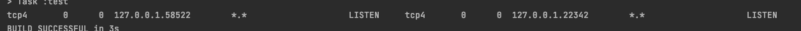

# 목차

<br>

- [목차](#목차)
- [들어가며](#들어가며)
- [테스트 환경 구축](#테스트-환경-구축)
  - [의존성](#의존성)
  - [테스트 도메인 생성](#테스트-도메인-생성)
- [내장 Redis port 수동 설정](#내장-redis-port-수동-설정)
- [내장 Redis port 자동 설정](#내장-redis-port-자동-설정)
- [사용시 주의할 점 - 중요!](#사용시-주의할-점---중요)
  - [메모리 확인](#메모리-확인)
  - [netstat 확인](#netstat-확인)
- [마치며](#마치며)
- [참고](#참고)

<br>

# 들어가며
프로젝트를 진행하며 토큰 저장소와 캐싱을 위해 Redis를 도입하려고 한다.

개발 초기엔 RedisRepository 역할을 하는 객체들의 인터페이스를 직접 자바 코드로 구현하여 테스트를 진행했다.

문제는 실제 Redis 환경이 아니란 점이다..

그래서 Embedded H2처럼 Embedded Redis도 있다 찾아봤고, 적용시키는 시점에서 모르는 것이 많아 이참에 정리해보고자 한다.

> 본 글은 [이동욱님의 - [Redis] SpringBoot Data Redis 로컬/통합 테스트 환경 구축하기](https://jojoldu.tistory.com/297)와 
> 
> 아라한사님께서 번역하신 [스프링 데이터 레디스](http://arahansa.github.io/docs_spring/redis.html) 를 참고하여 작성된 글입니다.

<br>

# 테스트 환경 구축

<br>

## 의존성
먼저 의존성을 주입해준다.
```build.gradle
implementation group: 'org.springframework.boot', name: 'spring-boot-starter-data-redis', version: '2.5.4'
implementation (group: 'it.ozimov', name: 'embedded-redis', version: '0.7.3') {
    exclude group: 'org.slf4j', module: 'slf4j-simple'
}
```
* Spring Data Redis
  * Spring Data JPA처럼 Redis를 JPA Repository 사용하듯 인터페이스를 제공하는 모듈.
* embedded-redis
  * 기존 `it.ozimov.embedded-redis`안에 `slf4j-simple`이 내장되어 있어서, 필자는 slf4j에 대한 충돌이 발생하였다. 그래서 이를 제외시켰다.

<br>

## 테스트 도메인 생성
테스트를 위한 도메인을 간단히 구현해준다.

<br>

> **Post.java**

```java
@AllArgsConstructor
@NoArgsConstructor
@Getter
@RedisHash("post")
public class Post {

    @Id @Indexed
    private Long id;
    private String title;
    private String content;
}
```

<br>

Repository도 간단히 구현해준다.

> **PostRedisRepository**

```java
public interface PostRedisRepository extends CrudRepository<Post, Long> {
}
```

<br>

이제 Redis를 연결하기 위한 Config파일을 생성해준다. (기존의 DB에 연결하기 위해서 사용했던 Datasource와 비슷한 역할을 한다.)

> **RedisConfig**

```java
@Configuration
@EnableRedisRepositories
public class RedisConfig {

    @Value("${spring.redis.host}")
    private String redisHost;

    @Value("${spring.redis.port}")
    private int redisPort;

    @Bean
    public RedisConnectionFactory redisConnectionFactory() {
        return new LettuceConnectionFactory(redisHost, redisPort);
    }

    @Bean
    public RedisTemplate<?, ?> redisTemplate() {
        RedisTemplate<byte[], byte[]> redisTemplate = new RedisTemplate<>();
        redisTemplate.setConnectionFactory(redisConnectionFactory());
        return redisTemplate;
    }
}
```
* `RedisConnectionFactory`를 이용하여 내장 혹은 외부 Redis에 연결한다.
* `RedisTemplate`은 `RedisConnection`에서 넘겨준 byte 값을 객체 직렬화한다.

<br>

마지막으로 설정 파일을 추가해준다.

> **application-test.yml**

```yml
spring:
  redis:
    host: localhost
    port: 6379
```
> test 환경에서만 실행할 것이기 때문에 위와 같이 해두었다. 만약 다른 환경에서도 필요하다면 profile 설정을 해주면 된다.

<br>

# 내장 Redis port 수동 설정

이제 Redis를 사용하기 위한 설정은 모두 되었다.

본격적으로 Embedded-Redis Server를 실행만 해주면 된다.

기본적으로 Embedded-Redis Server를 실행시키면 localhost(127.0.0.1)에 실행된다.

이제 Embedded-Redis Server 설정을 해준다.

> **EmbeddedRedisConfig**

```java
@Configuration
@Profile("!prod")
public class EmbeddedRedisConfig {

    @Value("${spring.redis.port}")
    private int redisPort;

    private RedisServer redisServer;

    @PostConstruct
    public void redisServer() throws IOException {
        redisServer = new RedisServer(redisPort);
        redisServer.start();
    }

    @PreDestroy
    public void stopRedis() {
        if (redisServer != null && redisServer.isActive()) {
            redisServer.stop();
        }
    }
}
```
* 설정 파일에서 받아온 port를 이용하여 내장 Redis 서버를 작동시킨다.
  * **이때 `RedisConfig`에서 바라보는 host, port랑 내장 Redis 서버가 켜진 port랑 다르면 에러가 발생한다.**
  * **필자는 이 부분 때문에 삽질을 굉장히 오래했다.**
* 빈 스코프
  * `@PostConstruct`: 객체의 초기화 부분 -> 객체가 생성된 후 별도의 초기화 작업을 위해 실행하는 메서드를 선언한다.
  * `@PreDestroy`: 마지막 소멸 단계 -> 빈 컨테이너에서 빈을 제거하기 전에 해야할 작업을 이곳에 정의한다.

<br>

간단히 테스트 코드를 작성하고 테스트해본다.

> **PostRedisRepositoryTest**

```java
@Import({EmbeddedRedisConfig.class}) // @DataRedisTest를 사용하면 Config를 읽기 못하므로 추가
@DataRedisTest 
@DirtiesContext(classMode = ClassMode.BEFORE_EACH_TEST_METHOD) // 반복 테스트할 때 매번 새로운 컨텍스트를 띄우기 위함
@ActiveProfiles("test")
class PostRedisRepositoryTest {

    @Autowired
    private PostRedisRepository postRedisRepository;

    @AfterEach
    void tearDown() {
        postRedisRepository.deleteAll();
    }

    @RepeatedTest(value = 20)
    void save_and_find() {
        // given
        Post post = new Post(1L, "post", "post content");

        // when
        postRedisRepository.save(post);

        // then
        Post findPost = postRedisRepository.findById(post.getId())
            .orElseThrow();
        assertThat(post.getId()).isEqualTo(findPost.getId());
        assertThat(post.getTitle()).isEqualTo(findPost.getTitle());
        assertThat(post.getContent()).isEqualTo(findPost.getContent());
    }

    @RepeatedTest(value = 20)
    void update_and_find() {
        // given
        Post post = new Post(1L, "post", "post content");
        postRedisRepository.save(post);

        // when
        Post savedPost = postRedisRepository.findById(1L)
            .orElseThrow();
        savedPost.setTitle("updated post");
        postRedisRepository.save(savedPost);

        // then
        Post updatedPost = postRedisRepository.findById(1L)
            .orElseThrow();
        assertThat(updatedPost.getTitle()).isEqualTo("updated post");
    }
}
```

<p align="center"> </p>

20번을 돌려도 문제없이 조회, 수정등의 테스트가 통과하는 것을 볼 수 있다.

> 테스트 환경은 `@SpringBootTest`만 넣어도 사실 된다. 하지만 조금은 최적화하기 위해 위와 같이 사용중이다.

<br>

# 내장 Redis port 자동 설정
> 자동으로 port를 찾아 설정해준다는 의미로 동적이라고 하였습니다! 

위와 같은 방식의 문제점은 통합 테스트시 여러 내장 Redis를 작동시킬 일이 있으면 port가 충돌한다는 것이다.

그러므로, 이미 사용중인 port라면 다른 port를 사용할 필요가 있다.

그렇다면 특정 port가 사용중인지 아닌지 확인하는 방법은 무엇일까?

정답은 쉘을 사용하여 `netstat`명령어를 실행시켜 확인하는 것이다.

`netstat -nat | grep LISTEN | grep {port}`

<br>

자바에선 현재 실행중인 환경과의 인터페이스인 `Runtime` 객체를 제공한다.

> ShellTest

```java
public class ShellTest {

    @Test
    void shellTest() throws IOException {
        // port
        int port = 22;

        // netstat
        String command = String.format("netstat -nat | grep LISTEN | grep %d", port);
        String[] shell = {"/bin/sh", "-c", command};
        Process process = Runtime.getRuntime().exec(shell);

        // InputStream을 통해 읽기
        String line;
        StringBuilder pidInfo = new StringBuilder();
        try (BufferedReader input = new BufferedReader(new InputStreamReader(process.getInputStream()))) {
            while ((line = input.readLine()) != null) {
                pidInfo.append(line);
            }
        }

        System.out.println(pidInfo.toString());
    }
}
```
위 코드를 실행해서 만약 연결된 port가 있다면 아래와 같이 pidInfo가 뜬다.

<p align="center"></p>

반면에, 아무런 port도 연결되어 있지 않다면 아무 문자열로 뜨지 않는다. (`isEmpty()`)

<br>

이를 사용해서 port를 찾고 연결하는 과정을 자동화 시키면 된다.

> **수정된 EmbeddedRedisConfig**

```java
@Configuration
@Profile("!prod")
public class EmbeddedRedisConfig {

    private static final String BIN_SH = "/bin/sh";
    private static final String BIN_SH_OPTION = "-c";
    private static final String COMMAND = "netstat -nat | grep LISTEN|grep %d";

    @Value("${spring.redis.port}")
    private int redisPort;

    private RedisServer redisServer;

    // 아래처럼 빈을 꼭 여기서 등록해줘야 한다.
    @Bean
    public RedisConnectionFactory redisConnectionFactory() {
        return new LettuceConnectionFactory("127.0.0.1", redisPort);
    }

    @PostConstruct
    public void redisServer() throws IOException {
        int port = isRedisRunning() ? findAvailablePort() : redisPort;
        redisServer = new RedisServer(port);
        redisServer.start();
    }

    @PreDestroy
    public void stopRedis() {
        if (redisServer != null && redisServer.isActive()) {
            redisServer.stop();
        }
    }

    private boolean isRedisRunning() throws IOException {
        return isRunning(executeGrepProcessCommand(redisPort));
    }

    private boolean isRunning(Process process) {
        String line;
        StringBuilder pidInfo = new StringBuilder();

        try (BufferedReader input = new BufferedReader(new InputStreamReader(process.getInputStream()))) {

            while ((line = input.readLine()) != null) {
                pidInfo.append(line);
            }

        } catch (Exception e) {
        }

        return !pidInfo.toString().isEmpty();
    }

    private Process executeGrepProcessCommand(int port) throws IOException {
        String command = String.format(COMMAND, port);
        String[] shell = {BIN_SH, BIN_SH_OPTION, command};
        return Runtime.getRuntime().exec(shell);
    }

    public int findAvailablePort() throws IOException {

        for (int port = 10000; port <= 65535; port++) {
            Process process = executeGrepProcessCommand(port);
            if (!isRunning(process)) {
                return port;
            }
        }

        throw new IllegalArgumentException("Not Found Available port: 10000 ~ 65535");
    }
}
```
어렵게 생각할 필요없다. 그저 기존의 설정 파일에 설정된 port가 이미 사용중이라면 10000부터 차례대로 port를 설정하여 가져오는 것이다.

**여기서 가장 중요한 개념은 `RedisConfig`에서 바라보는 port와 내장 Redis 서버의 port가 같아야한다는 점이다!**

그러므로, `RedisConfig`의 코드도 수정해줘야한다.

<br>

> **RedisConfig**

```java
@Configuration
@EnableRedisRepositories
public class RedisConfig {

    @Value("${spring.redis.host}")
    private String redisHost;

    @Value("${spring.redis.port}")
    private int redisPort;

    @Bean
    @ConditionalOnMissingBean(RedisConnectionFactory.class) // 수정된 부분!
    public RedisConnectionFactory redisConnectionFactory() {
        return new LettuceConnectionFactory(redisHost, redisPort);
    }

    @Bean
    public RedisTemplate<?, ?> redisTemplate() {
        RedisTemplate<byte[], byte[]> redisTemplate = new RedisTemplate<>();
        redisTemplate.setConnectionFactory(redisConnectionFactory());
        return redisTemplate;
    }
}
```
바로 `@ConditionalOnMissingBean`을 사용해서, 기존에 같은 빈이 등록되어 있으면 해당 메서드의 빈은 등록하지 않는 애노테이션이다.

마지막으로 기존의 테스트를 돌려보면 정상 통과한다. 이외에도 통합 테스트시 여러 대의 내장 Redis 서버를 켜도 문제 없이 실행된다.

<br>

# 사용시 주의할 점 - 중요!
필자가 4시간동안 삽질한 내용이라 이곳에 남겨둔다... (부들부들 😠)

<br>

## 메모리 확인
내장 Redis Server도 메모리에 올라간다.

그리고 테스트시 많은 내장 Redis Server를 키다보면, 메모리 부족이 발생할 수 있다.

이럴 경우 Redis 설정에서 메모리 설정을 해주면 된다.

```java
@PostConstruct
public void redisServer() throws IOException {
    int redisPort = isRedisRunning() ? findAvailablePort() : port;
    redisServer = new RedisServer(redisPort);
    redisServer = RedisServer.builder()
        .port(redisPort)
        .setting("maxmemory 128M") //maxheap 128M
        .build();
    redisServer.start();
}
```

<br>

## netstat 확인

만약 두번째 방법인 [내장 Redis port 자동 설정](#내장-redis-port-자동-설정)를 사용한다면, 해당 코드가 어느 환경에서 도는지 확인해야한다.

필자는 프로젝트를 하며 내장 Redis를 구현하여 사용하던중, 젠킨스에서만 계속해서 예외가 발생했다.

4시간동안의 삽질 끝에 찾은 문제는 도커 컨테이너안에 `netstat` 명령어가 `not found`였기 때문이다... 

해당 컨테이너안에 `net-tools`를 설치했더니 잘 동작한다..

<br>

**내장 Redis 서버를 사용하려면 우선 포트를 조심하고, 두 번째는 해당 프로그램이 돌아가는 환경에 `net-tools`가 존재하는지 확인하자.**

<br>

# 마치며
처음엔 내장 Redis Server를 어떻게 구축해야하나 막막했었다... 그래도 [이동욱님의 글](https://jojoldu.tistory.com/297)를 보고 많은 도움을 받았다.

다만 이해도가 비교적 필자는 동욱님의 글이 바로 이해가 되지 않았다.. 그래서 실제 프로젝트에 적용시켰을 때 많은 문제가 야기되었고, 이번 글을 쓰게 된 계기가 되었다.

쨋든! 굉장히 좋은 지식을 얻어간다. 동욱님에게도 감사의 말씀 드리고싶다.

# 참고
* https://jojoldu.tistory.com/297
* https://www.baeldung.com/spring-embedded-redis
* http://arahansa.github.io/docs_spring/redis.html
