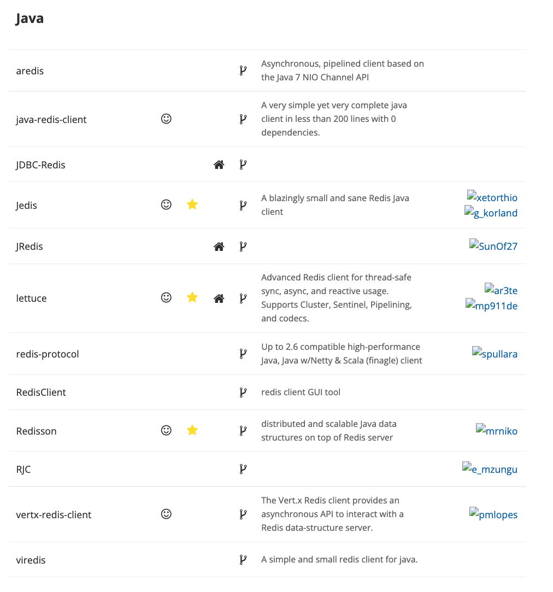
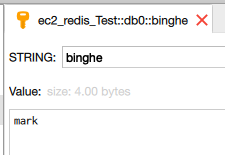
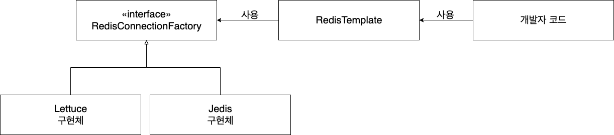
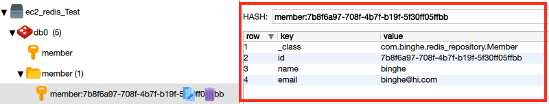

# 목차

<br>

- [목차](#목차)
- [들어가며](#들어가며)
- [Client](#client)
  - [DB Client](#db-client)
  - [Lettuce 예시](#lettuce-예시)
  - [결론](#결론)
- [Template](#template)
  - [RedisTemplate](#redistemplate)
  - [RedisTemplate 예시](#redistemplate-예시)
- [Repository](#repository)
  - [RedisRepository 예시](#redisrepository-예시)
- [마치며](#마치며)
- [참고](#참고)

<br>

# 들어가며
필자는 Spring을 통해 프로젝트를 개발하고 있으며, 토큰 저장소와 캐싱을 위해 Redis를 사용했다.

이 과정에서 많은 삽질을 하게되어, 다른 사람은 비교적 삽질을 하지 않으면 좋지 않을까하는 마음에 이 글을 작성한다.

혹시 Spring (혹은 Java)을 Redis Client로 활용하고자 시작하는 사람이라면 이 글이 딱이다. 잘 찾아왔다 :)

이번 글은 Spring (혹은 Java)를 Redis Client로 사용하고자 할 때의 전체적인 큰 그림을 그려주기 위해 작성하였다.

> 큰 그림을 그리기 위함이므로 각 요소들의 자세한 내용은 빼먹거나, 틀린 부분이 존재할 수도 있다.

<br>

# Client
첫번째는 Client 개념이다.

<br>

## DB Client

보통 DB Server에 접근하는 역할은 누가하는 것일까? **바로 DB Client다.**

그렇다면 DB Client로는 무엇이 있을까?

아마 RDBMS를 사용해본 경험이 있으신 분은 MySQLWorkbench, Oracle Client, H2Client등이 익숙할 것이다.

다만, 위 Client 앱들을 사용해서 특정 프로그래밍 언어로 DB Server에는 접근하지 못한다.

그래서 자바에서는 JDBC라는 OCP를 잘 활용한 인터페이스를 만들었다.

각각의 DB 벤더들은 JDBC의 구현체를 만들어 쉽게 DB를 갈아끼울 수 있게 만든 것이다.

<br>

**Redis도 JDBC와 동일하게 자바에서 Redis Server에 접속하기 위한 Client 라이브러리를 많이 지원한다.**

<p align="center"><br>출처: https://redis.io/clients#java</p>

정말 많은 라이브러리가 존재하지 않는가? 다만 현재 Spring에서 공식 지원하는 Client는 **Jedis, Lettuce** 뿐이다.

<br>

## Lettuce 예시

Lettuce라는 Redis Client를 사용하여 Redis Server에 접속하는 예시를 작성해보자.

(의존성과 관련된 내용은 제외했다. 구현해보는 것보단 그냥 큰그림만 가져가면 좋을 듯 싶다.)

<br>

> LettuceTest

```java
public class LettuceTest {

    @Test
    void lettuceConnection() {
        String redisConnectionURl = "redis://password@localhost:6379"; // RedisServer URL을 설정해준다.
        RedisClient redisClient = RedisClient.create(redisConnectionURl);

        // connection 연결
        StatefulRedisConnection<String, String> connection = redisClient.connect();

        // Redis에 명령 날리기 위한 객체
        RedisCommands<String, String> sync = connection.sync(); // async도 지원한다.

        // save
        sync.set("binghe", "mark");

        // find
        String result = sync.get("binghe");

        // connection 닫기
        connection.close();
        redisClient.shutdown();

        // assert
        assertThat(result).isEqualTo("mark");
    }
}
```

<p align="center"> </p>

테스트는 문제 없이 동작하고, Redis Server에도 잘 저장된다.

예시를 보면 알겠지만, **JDBC와 동일한 절차를 통해 통신한다.**
* DB Server URL을 이용하여 DB Client 생성 (JDBC에서의 DriverManager와 DataSource)
* Redis Connection을 연결 (DriverManager로부터 Connection 받기)
* Redis에 명령어 실행 (쿼리 실행)
* Connection 종료

<br>

## 결론

* Spring (혹은 JAva)에서 Redis를 사용하기 위해선 JDBC와 같은 Redis Client를 사용해야한다.
* **여러 Redis Client들은 JDBC와 동일한 역할을 수행한다.**
  * 주로 Connection을 가져오는 역할.
  * 더불어 **DataSource의 역할도 수행한다.**

<br>

# Template

**JDBC와 Redis Client의 단점은 매번 커넥션을 받아 연결하고, 끊고 작업을 반복해야한다는 것이다.**

Spring 진영에선 JdbcTemplate을 만들어 이 부분을 해결했다. (템플릿/콜백 패턴)

동일하게 **Spring에서 RedisTemplate이란 이름으로 비슷한 역할을 하는 라이브러리가 존재한다.**

다만, RedisTemplate은 코드 분리 뿐만 아니라, 여러 가지 다른 기능도 지원한다.

> RedisTemplate은 스프링의 강력한 기능중 하나인 IoC 컨테이너를 십분 활용한다.

<br>

## RedisTemplate

실제 RestTemplate의 docs에 가보면 아래와 같이 나온다.

> Helper class that **simplifies Redis data access code.**
> 
> **Performs automatic serialization/deserialization between the given objects and the underlying binary data in the Redis store.** By default, it uses Java serialization for its objects (through JdkSerializationRedisSerializer ). For String intensive operations consider the dedicated StringRedisTemplate.
> 
> The central method is execute, supporting Redis access code implementing the RedisCallback interface. It provides RedisConnection handling such that neither the RedisCallback implementation nor the calling code needs to explicitly care about retrieving/closing Redis connections, or handling Connection lifecycle exceptions. For typical single step actions, there are various convenience methods.

* Redis 데이터에 접근하는 코드를 심플화.
  * 연결 맺고, 끊고등의 부가 로직은 Template이 담당하고, 핵심 로직만 개발자가 담당해주면 된다.
* **자바에서의 객체와 Redis 저장소의 바이너리 데이터간의 직렬화/역직렬화를 자동으로 수행한다.**
  * **이 부분이 사실 가장 핵심이라고 생각든다.**
  * **Redis는 보통 외부에 따로 위치해있으므로, 네트워크 통신을 위해 byte array (바이트 배열)로 변환해야한다. (OutputStream으로 내보내기때문에 그런 것 아닌가 싶다)**
  * 또한, **프레임워크 관점에서, Redis에 저장된 데이터는 단지 bytes일 뿐이다. Redis가 다양한 타입을 지원하는 것도, 대개 데이터를 표현하는 방법일 뿐, 저장되는 것은 로우 데이터(byte)이다.**
    * **즉, Client측 (ex. Spring or Java)에서 변환을 하여 저장하고, 불러올 때도 바이트 배열을 객체로 변환해줘야 한다. - 가장 중요**
    * 그러므로 Redis는 유저 (커스텀)타입과 로우 데이터 (혹은 거꾸로)간의 전환을 위해 `RedisSerializer`라는 이름의 인터페이스를 만들어두었다.
    * 대표적인 구현체는 `JdkSerializationRedisSerializer`, `StringRedisSerializer`, `JacksonJsonRedisSerializer`등이 있다.

<br>

**절대 간과하면 안되는 부분은 직렬화/역직렬화 부분이다.** Redis를 사용할 때 이 부분에서 삽질을 많이하게 된다.. 

> 필자는 많이 했다..

<br>

## RedisTemplate 예시
그렇다면 간단히 RedisTemplate의 예시를 살펴본다.

(의존성과 관련된 내용은 제외했다. 구현해보는 것보단 그냥 큰그림만 가져가면 좋을 듯 싶다.)

<br>

우선 RedisTemplate을 사용하기 위해선 세 가지 설정을 해줘야한다.
* 어떤 Redis Client 라이브러리를 사용할 것인지?
* Datasource처럼 host, port 설정
* RedisTemplate 설정

<br>

> RedisConfig

```java
@Configuration
@EnableRedisRepositories
public class RedisConfig {
    @Value("${spring.redis.host}")
    private String host;

    @Value("${spring.redis.port}")
    private int port;

    // Redis Client + Datasource 설정
    @Bean
    public RedisConnectionFactory redisConnectionFactory() {
        return new LettuceConnectionFactory(host, port);
    }

    // RedisTemplate 설정
    @Bean
    public RedisTemplate<?, ?> redisTemplate() {
        RedisTemplate<byte[], byte[]> redisTemplate = new RedisTemplate<>();
        redisTemplate.setConnectionFactory(redisConnectionFactory());
        return redisTemplate;
    }
}
```
> RedisTemplate부터는 Spring Data Redis의 의존성을 추가해주면된다.

위 설정 파일을 간단히 그려보면 아래와 같다.

<p align="center"> </p>

* RedisConnectionFactory는 Redis 연결에 사용되는 RedisConnection을 생성한다.
* RedisTemplate을 통해 RedisConnection에서 넘겨준 byte 값을 객체 직렬화한다.
  * RedisTemplate을 설정하는 부분에서 Serializer 설정 및 기타 설정을 해줄 수 있다.

<br>

> RedisTemplateTest

```java
@DataRedisTest
class RedisTemplateTest {

    @Autowired
    private StringRedisTemplate redisTemplate;

    @DisplayName("opsForValue (Interface ValueOperation) - Strings를 쉽게 직렬/역직렬화 해준다.")
    @Test
    void opsForValue() {
        // given
        String key = "string key";
        String value = "string value";
        redisTemplate.delete(key);

        // when
        ValueOperations<String, String> stringStringValueOperations = redisTemplate.opsForValue();

        stringStringValueOperations.set(key, value); // set
        String result = stringStringValueOperations.get(key); //get

        // then
        assertThat(result).isEqualTo(value);
    }
}
```
* `opsForValue`: Strings를 쉽게 직렬화/역직렬화 해주는 인터페이스. 
  * 설정해둔 RedisTemplate 설정을 통해 직렬화/역직렬화를 수행한다.

<br>

# Repository
RedisTemplate도 충분히 로직을 분리했고, 다양한 기능들도 지원해준다.

Spring은 거기에 더해 JPA처럼 객체 기반으로 Redis를 적재하는 RedisRepository를 지원해준다.

RedisRepository를 이용하면 쉽게 도메인 객체를 Redis Hash 자료구조로 변환할 수 있으며, secondary indexed와 TTL를 적용시킬 수 있다.

> 그렇다고 RedisTemplate이 사용안되는 것은 아니다. RedisRepository도 RedisTemplate을 이용해서 Redis와 소통하는 듯 하다.

<br>

## RedisRepository 예시
RedisTemplate처럼 Redis 연결과 RedisTemplate 설정은 그대로 필요하다. (`RedisConfig`)

이제 도메인 객체를 정의해본다.

> Member

```java
@RedisHash("member")
public class Member {
    @Id
    private String id;
    private String name;
    private String email;

    ...
}
```

<br>

그리고 해당 도메인에 대한 Repository를 구현해준다.

> MemberRedisRepository

```java
public interface MemberRedisRepository extends CrudRepository<Person, String> {
}
```

<br>

이제 JPA 사용하듯이 쉽게 CRUD가 가능하다. (물론 JPA의 영속성 컨텍스트와 같은 기능은 없다)

> MemberRepositoryTest

```java
@DataRedisTest
public class RedisRepositoryTest {

    @Autowired
    private MemberRedisRepository redisRepository;

    @Test
    void saveAndFind() {
        // given
        Member member = new Member(null, "binghe", "binghe@hi.com");

        // when
        Member savedMember = redisRepository.save(member);

        // then
        Member findMember = redisRepository.findById(savedPerson.getId())
             .orElse(null);
             assertThat(findMember).isNotNull();
        assertThat(findMember.getName()).isEqualTo(member.getName());
        assertThat(findMember.getEmail()).isEqualTo(member.getEmail());
    }
}
```

<p align="center"> </p>

Redis에 잘 저장이 되는 것을 볼 수 있다.
* key: @RedisHash의 value + @Id가 붙어있는 멤버변수 (ex. `member:{id}`)
* 위 결과를 보면 2개가 저장되는 것을 볼 수 있다.
  * `member`: member와 관련된 모든 key를 관리한다. (set 자료구조)
  * `member: 7b8f...`: 특정 id에 대한 member의 값. (hash 자료구조)

<br>

# 마치며
이것으로 Spring (혹은 Java)를 Redis Client를 사용하기 위한 큰그림을 살펴보았다.

필자는 처음 도입을 고민했을 때, 이런저런 개념으로 헷갈렸던 기억이 있다. 또한, 삽질도 많이 하게 되었다..

**이것 하나만 기억하면 좋을 듯 싶다.**

**Redis를 사용하는 것도, 기존의 RDB에 연결하기 위해 사용한 JDBC, JDBCTemplate, JPA등과 큰 차이점은 없다.**

상위 레벨에서의 로직은 비슷하다. Connection 맺고, CRUD하고, Connection 끊고..

다만, **Redis에 객체나 여러 다양한 형식을 저장하고 빼내기 위해선 직렬화/역직렬화의 사용이 필수적이다.**

(필자는 직렬화/역직렬화때문에 삽질을 많이 했다.)

개발자들이 처음 Redis를 도입할 때 필자처럼 삽질하지 않고, 큰 도움이 되었으면 하는 바램으로 이 글을 작성하게 되었다. (사실 한 번 정리하고 싶었다..)

그럼 이만 안녕.

<br>

# 참고
* https://docs.spring.io/spring-data/redis/docs/current/api/org/springframework/data/redis/core/RedisTemplate.html
* http://arahansa.github.io/docs_spring/redis.html#redis:template
