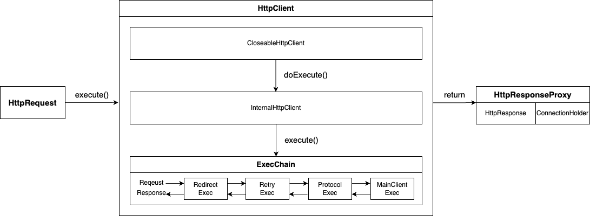
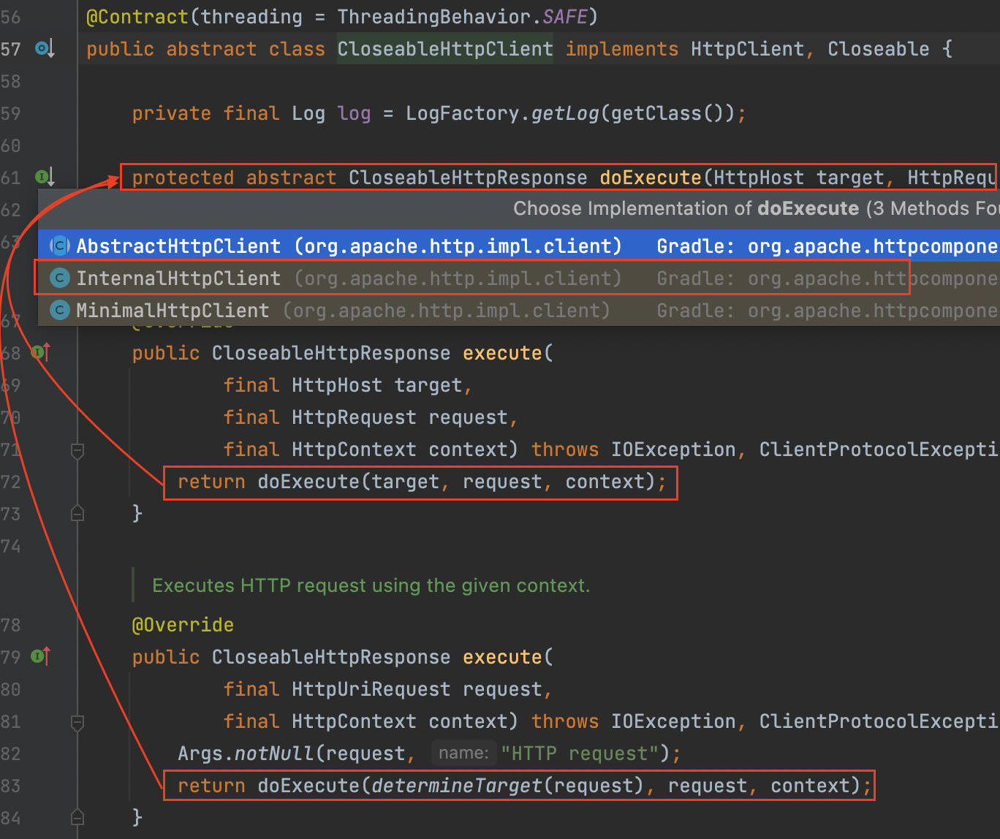
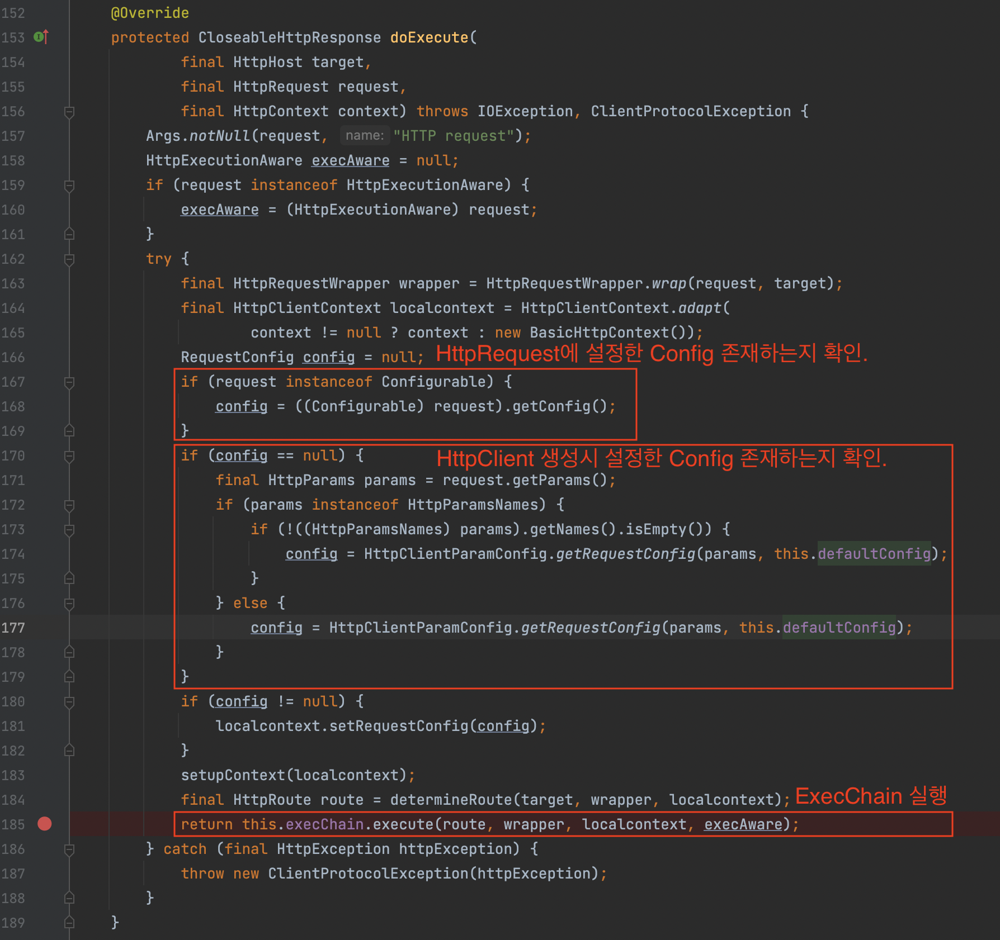
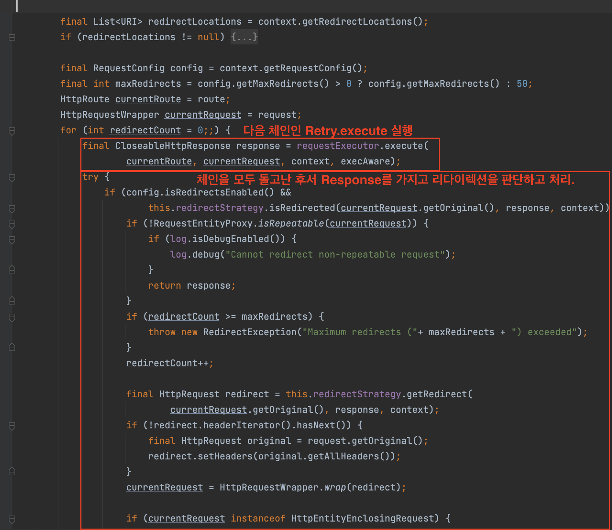
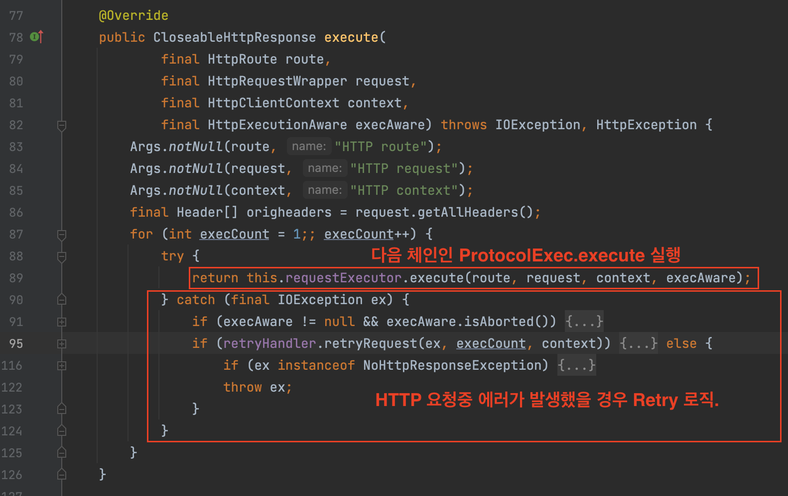
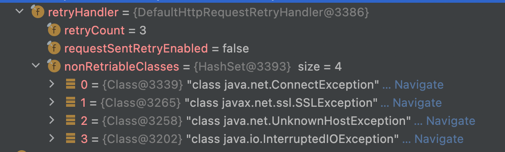
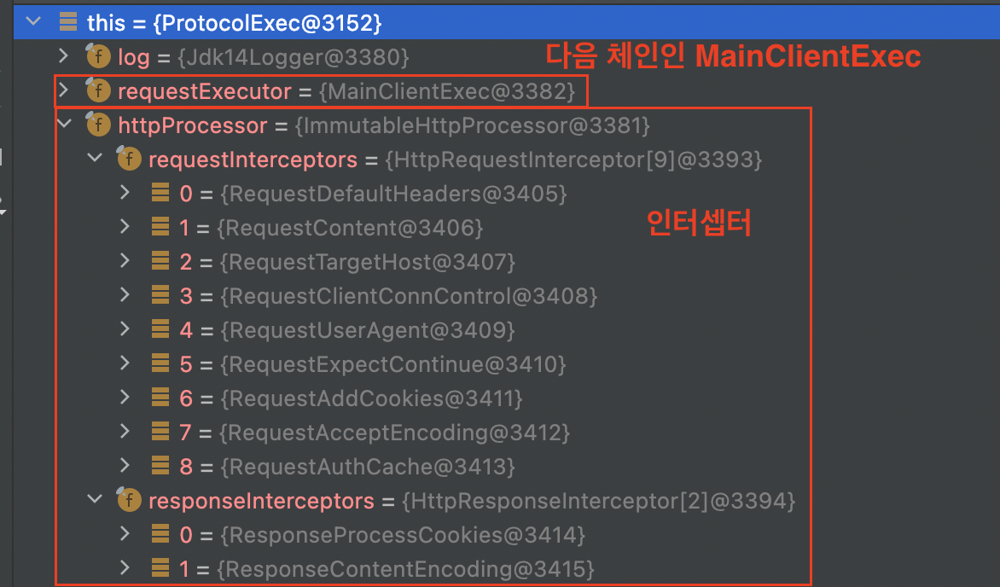
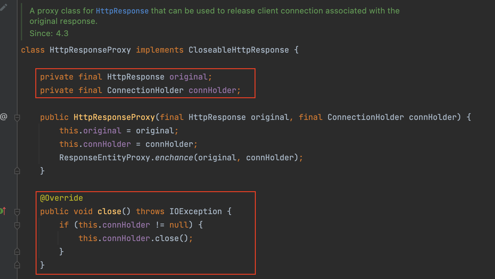

# 목차

<br>

- [목차](#목차)
- [HttpClient 4 코어 - 핵심 구조 (ExecChain)](#httpclient-4-코어---핵심-구조-execchain)
- [HttpClient 4.x 모듈](#httpclient-4x-모듈)
- [HttpClient 동작 구조 (Flow)](#httpclient-동작-구조-flow)
  - [HttpRequest 생성](#httprequest-생성)
  - [HttpClient Execute](#httpclient-execute)
    - [CloseableHttpClient와 InternalHttpClient](#closeablehttpclient와-internalhttpclient)
    - [ExecChain](#execchain)
  - [Response 반환 및 응답 처리](#response-반환-및-응답-처리)
- [기타 핵심 내용](#기타-핵심-내용)
  - [HttpClient 인터페이스](#httpclient-인터페이스)
  - [HTTP Execution Context](#http-execution-context)
  - [인터셉터](#인터셉터)
  - [예외 처리](#예외-처리)
  - [요청 중단](#요청-중단)

<br>

# HttpClient 4 코어 - 핵심 구조 (ExecChain)
[이전 글](./apache_httpclient_quick_start.md)에선 Quick-Start를 통해 HttpClient의 간단한 사용방법에 대해서 알아보았다.

> 필자의 경우엔 RestTemplate을 이용하는데 설정이나 동작 과정중 이해가 안되는 부분이 많아 이 글을 작성하게되었다.

이번 글은 HttpClient (정확히는 HttpComponents)의 코어 부분의 내용들을 알아보려고한다.

이를 통해 HttpClient가 어떻게 동작하는지 제대로 이해하고, HttpClient가 제공하는 여러가지 기능에 대해서 살펴본다.

코어 부분이라하면 추상적인 느낌이있는데.. 구체적으로 얘기하면 HttpClient의 모듈은 어떻게 구성되어있는지? HttpClient는 어떤 구조로 동작하게 되는지 살펴본다.

<br>

# HttpClient 4.x 모듈
HttpClient 3.x까지는 HttpClient는 단일 모듈로 구성되어있었다. [참고](https://hc.apache.org/httpclient-legacy/)

이는 레거시가 되었으며, HttpClient 4.x부터는 [HttpComponents 라는 프로젝트](https://hc.apache.org/)하에 두 개의 모듈로 구성되게되었다.

* [HttpClient 모듈](https://hc.apache.org/httpcomponents-client-4.5.x/index.html)
  * HttpClient는 HTTP 요청 및 응답에 필요한 부가 기능을 제공해주는 모듈이다.
  * 실제 요청과 응답은 HttpCore에 의존하며, HttpClient는 기본 헤더, 쿠키 처리, 인증 처리, 캐싱과 같은 부가 기능이 구현되어있다.
  * 다소 복잡한 HttpCore의 인터페이스를 손쉽게 사용할 수 있도록 추상화하는 역할을 한다고 보면 된다.
    * 자주 사용되는 `HttpClient` 인터페이스 역시 이 모듈에 속한다.
* [HttpCore 모듈](https://hc.apache.org/httpcomponents-core-4.4.x/index.html)
  * HttpCore는 HTTP 요청과 응답에 필요한 저수준의 구성 요소를 가진 모듈이다.
  * HTTP 요청과 응답에 대한 필수 기능만 포함하기 때문에 가벼운 구현체이며, HttpCore만 사용해도 HTTP 요청과 응답을 처리할 순 있다.
  * HttpCore는 두가지의 I/O 모듈을 제공한다.
    * 기존의 자바 I/O 기반의 블로킹 I/O (HttpClient 4.x)
    * 자바 NIO 기반의 논블록킹, 이벤트 드리븐 I/O (HttpClient 5.x)

<br>

# HttpClient 동작 구조 (Flow)
이제 본격적으로 HttpClient가 어떻게 동작하는지 살펴본다.

결론부터 바로 말하자면 HttpClient는 아래와 같이 다수의 동작을 체인 구조로 처리한다.

> 많은 HTTP 클라이언트가 대부분 이 구조를 사용한다고한다. (HttpClient 5 또한 이 구조를 이용한다.)

<p align="center"> </p>

이제부터 위 구조를 바탕으로 어떻게 HttpClient가 동작하는지 살펴본다.

> 위 구조를 보고 이해가된다면 이 글은 스킵해도 좋다.

<br>

## HttpRequest 생성
HTTP 요청을 보낼려면 당연히 요청 내용을 먼저 정의해야한다.

HTTP의 요청은 `HttpRequest` 인터페이스의 구현체로 정의할 수 있으며, 이를 `HttpClient`에게 넘겨 HTTP 요청을 처리할 수 있다.

당연히 HttpClient는 HTTP/1.1에서 지원하는 모든 HTTP 메서드를 지원한다.

그리고 명시적 구현체로는 `HttpGet`, `HttpHead`, `HttpPost`, `HttpPut`, `HttpDelete`, `HttpTrace`, and `HttpOptions`등이 있다.

> 각 객체들의 상위 클래스는 RequestBody를 가지느냐에따라 다르다. 하지만 모든 구현체의 최상위 인터페이스는 `HttpRequest`로 동일하다.

<br>

요청 객체를 생성하는 방법은 아래와 같다.

```java
// 생성 방법 1
HttpGet httpGet = new HttpGet(
     "http://www.google.com/search?hl=en&q=httpclient&btnG=Google+Search&aq=f&oq=");

// 생성 방법 2
URI uri = new URIBuilder()
        .setScheme("http")
        .setHost("www.google.com")
        .setPath("/search")
        .setParameter("q", "httpclient")
        .setParameter("btnG", "Google Search")
        .setParameter("aq", "f")
        .setParameter("oq", "")
        .build();
HttpGet httpGet = new HttpGet(uri);

// 헤더 설정
httpGet.addHeader("User-Agent", "Java Client; Mac OS");
httpGet.addHeader("Accept", "*/*");
httpGet.addHeader("Connection", "keep-alive");
httpGet.addHeader("Keep-Alive", "timeout=5, max=100");
```

<br>

## HttpClient Execute
HttpClient의 가장 기본적인 역할은 HTTP 메서드를 실행하는 것이다.

여기서 말하는 HTTP 메서드 실행이란 HttpClient에서 내부적으로 처리되는 하나 이상의 HTTP 요청과 응답 (교환)을 의미한다.

앞서 HttpRequest를 통해 HTTP 요청에 대한 정의를 모두 완료했다면, 이제 HttpClient에게 해당 요청을 실행하라고 요청할 수 있다.

이때 사용되는 것이 `HttpClient#execute`이다.

```java
CloseableHttpResponse response = httpclient.execute(httpget);
```

그렇다면 `HttpClient`의 `execute()` 메서드는 어떻게 동작하는지 한번 살펴보자.

> 이부분이 이번 글의 핵심 내용이기도하다.

<br>

### CloseableHttpClient와 InternalHttpClient
많은 `HttpClient`의 구현체중 보통 `CloseableHttpClient`를 많이 사용한다. 그리고 `CloseableHttpClient`는 추상 클래스이다.

추상 클래스를 사용하는 이유중 하나는 바로 부가 로직과 핵심 로직을 분리시키기 위함이며, 실제로 HttpClient에서도 아래와 같이 템플릿 메서드 패턴을 활용하였다.

<p align="center"><br>CloseableHttpClient.execute 구현부분 </p>

`CloseableHttpClient`는 이름에서 알 수 있듯이, `Closeable`을 구현함으로써 부가 로직(커넥션 리소스 반환)을 수행한다.

그리고 실제 핵심 로직은 `InternalHttpClient`에게 위임한다. (전형적인 템플릿 메서드 패턴이다)

<p align="center"><br>InternalHttpClient.doExecute 구현부분 </p>

위 코드를 보면 알 수 있듯이, **`InternalHttpClient#doExecute` 구현부분은 요청에 필요한 설정 (커넥션 timeout, 소켓 timeout등등)이 존재하는지 확인하고 요청에 사용할 수 있도록 설정하는 역할을 수행한다.**

> 코드에서 볼 수 있듯이, `RequestConfig`의 우선 순위는 다음과 같다 : `HttpRequest` -> `HttpClient.`

그리고 **HTTP 요청과 응답에 대한 핵심 로직은 `ExecChain`에게 위임한다.**

<br>

### ExecChain
ExecChain부분은 HttpClient의 HTTP 요청과 응답의 핵심 부분이라고 볼 수 있다.

**정확히 말하면 `ClientExecChain` 인터페이스를 구현한 구현체들이 아래와 같이 체이닝 방식으로 동작하게 된다.**

<p align="center"> </p>

코드를 살펴보면 알겠지만, **체이닝 방식은 프록시의 한 종류인 데코레이터 패턴을 활용한 구조라고 보면 된다.**

> 프록시와 데코레이터 패턴과 관련된 자세한 내용은 [여기](https://github.com/binghe819/TIL/blob/master/OOP&%EC%84%A4%EA%B3%84/%EB%94%94%EC%9E%90%EC%9D%B8%ED%8C%A8%ED%84%B4/Proxy%20Pattern%EC%99%80%20Decorator%20pattern.md)를 참고.

체이닝 방식의 각 단계에선 어떤 역할을 수행하는지 살펴보자.

<br>

💁‍♂️ **Redirect Exec**

<p align="center"><br>`RedirectExec`의 `execute`메서드 구현부 </p>

**`Redirect Exec`는 요청에 대해서 추가적인 동작을 수행하지않고 즉시 다음 체인에 요청 처리를 위임하고 응답에 대해서만 추가적인 동작을 수행한다.**

수신한 응답의 HTTP 응답 상태 코드가 300번대 (300 ~ 399)라면 리다이렉션을 수행한다. 기본적으로 최대 리다이렉션 횟수를 50회로 제한하며, 이를 초과하면 `RedirectException`를 던진다.

Redirect 관련 설정 하는 방법은 다음과 같다.

```java
RequestConfig requestConfig = RequestConfig.custom()
        .setMaxRedirects(1_00)
        .setRedirectsEnabled(false)
        .build();

CloseableHttpClient httpClient = HttpClients.custom()
        .setDefaultRequestConfig(requestConfig)
        .build();
```

<br>

💁‍♂️ **Retry Exec**

<p align="center"><br>`RetryExec`의 `execute`메서드 구현부 </p>

`Retry Exec`는 요청에 대한 추가적인 동작을 수행하진 않는다.

다만, 요청과정에서 I/O 에러가 발생했을경우 재시도를 할지에 대한 판단을 하는 Chaining 단계이다.

만약 재시도가 필요할 경우 다음 Executor에게 재시도를 하라고 설정을 해준다.

만약 재전송 관련된 설정을 변경하고 싶다면 재전송 핸들러인 `HttpRequestRetryHandler`를 구현하여 `HttpClient`에 설정해주어야한다.

재시도 관련된 설정하는 방법은 다음과 같다.

```java
HttpRequestRetryHandler retryHandler = new DefaultHttpRequestRetryHandler(5, true); // 재시도 횟수, 재시도 여부 설정

CloseableHttpClient httpClient = HttpClients.custom()
        .setRetryHandler(retryHandler)
        .build();
```

<br>

HttpClient는 디폴트로 `DefaultHttpRequestRetryHandler`를 사용하며, 이는 재시도 사용 여부, 재시도 횟수, 재시도를 하지 않을 예외를 설정해줄 수 있다.

디폴트로는 아래와 같이 설정되어있다.

<p align="center"> </p>

<br>

💁‍♂️ **Protocol Exec**

**`Protocol Exec`는 요청과 응답에 인증 혹은 쿠키 처리와 같은 부가적인 작업을 수행한다.**

HTTP 요청 프로세스중 인터셉터 기능도 이때 실행된다. 

> 인터셉터와 관련된 내용은 아래에서 더 자세히 다룰 예정이다.

<p align="center"> </p>

**디버거를 통해 볼 수 있듯이, ProtocolExec는 요청과 응답에 대한 기타 작업 이외에도 인터셉터 관련된 작업을 실행한다.**

인터셉터 설정하는 방법은 아래와 같다.

```java
CloseableHttpClient httpClient = HttpClients.custom()
    .addInterceptorFirst(new HttpRequestInterceptor() {
        @Override
        public void process(HttpRequest request, HttpContext context) throws HttpException, IOException {
            // 요청에 대한 부가 동작.
        }
    })
    .addInterceptorLast(new HttpRequestInterceptor() {
        @Override
        public void process(HttpRequest request, HttpContext context) throws HttpException, IOException {
            // 응답에 대한 부가 동작.
        }
    })
    .build();
```

<br>

💁‍♂️ **MainClient Exec**

마지막 Chain은 실질적으로 HTTP 요청과 응답, 커넥션 관리 역할을 수행하는 `MainClientExec`이다.

우선 목적지와 커넥션을 맺는등 커넥션 관리를 수행하며, 이후에 실질적인 HTTP 요청과 응답을 실행한다.

**실질적으로 다른 Chain이나 클라이언트가 사용할 `HttpResponse`를 생성하고 반환하는 제일 중요한 Chain이다.**

<br>

## Response 반환 및 응답 처리
다수의 ExecChain을 모두 돌고나면 `HttpClient`는 `HttpResponse`를 반환하게된다.

<br>

💁‍♂️ **`HttpResponse`의 구현체는 `HttpResponseProxy`이다.**

그리고 이 `HttpResponse`는 크게 두 가지로 구성되어있다.

<p align="center"> </p>

* `HttpResponse` - HTTP 요청후 반환받은 응답에 대한 내용을 가지고있다. (응답 시작줄, 헤더, 바디부분)
* `ConnectionHolder` - HTTP 요청에 사용된 커넥션 관련된 내용을 가지고있다.
  * 실제로 HTTP 요청을 모두 수행하고 `response.close()`를 실행하면 `ConnectionHolder.close()` 호출함으로써 해당 커넥션 리소스를 해제하게된다.

<br>

💁‍♂️ **이제 응답을 잘 사용하기만 하면 된다!**

> 응답 처리 예시

```java
// HTTP 요청 실행 (TCP 커넥션 + HTTP 요청)
CloseableHttpResponse response = httpclient.execute(httpGet);

// 응답 처리
try {
    System.out.println(response.getStatusLine());                         // 응답의 시작줄
    Arrays.stream(response.getAllHeaders()).forEach(System.out::println); // 응답 헤더

    HttpEntity entity = response.getEntity();

    // 응답 바디 처리
    InputStream inputStream = entity.getContent();
    BufferedReader reader = new BufferedReader(new InputStreamReader(inputStream));

    StringBuilder responseBody = new StringBuilder();
    String line = "";
    while((line = reader.readLine()) != null) {
        responseBody.append(line);
    }
    System.out.println(responseBody);

    // 응답 콘텐츠를 완전히 소비. (완전히 소비해줘야 다음 연결이 안전하게 사용될 수 있다.)
    // InputStream을 close()해주는 역할이다.
    EntityUtils.consume(entity);
} finally {
    // 리소스 반환. (커넥션 풀의 리소스 반환)
    response.close();
}
```

<br>

이로써 HttpClient가 어떻게 HTTP 요청과 응답을 처리하는지 모두 살펴보았다.

처음 코드를 살펴보면 이해하기 쉽지않지만.. 이렇게 디버깅하면서 하나하나 따라가보면 생각보다 쉬운 구조로 되어있는 것을 알 수 있다.

아마 이제 아래 구조가 이해하기 쉬울 것이다 :)

<p align="center"> </p>

<br>

# 기타 핵심 내용
HttpClient의 핵심적인 동작 구조말고도 여러 핵심적인 내용들이 존재한다.

간단히 살펴보자.

<br>

## HttpClient 인터페이스
HttpClient 인터페이스는 HTTP 요청 실행을 위한 가장 필수적인 역할을 수행한다.

인터페이스이므로 HTTP 요청 응답 프로세스에 대한 제한이나 특정 세부 사항을 강제하지 않는다. 

대신 커넥션 관리, 상태 관리, 인증 및 리다이렉션 처리의 구현은 개발자의 구현에 맡긴다. (유연하다는 의미)

이러한 특징으로 인해 응답 컨텐츠를 캐싱한다는 등 여러가지 기능을 쉽게 추가할 수 있다.

> 공식문서에서는 이를 Decorate한다고한다. 즉, 데코레이터 패턴과 같이 새로운 기능을 쉽게 추가 설정할 수 있다는 의미.

<br>

HttpClient는 퍼사드 패턴에서의 퍼사드 (건물의 정면) 역할을 한다.

리다이렉션, 인증 처리, 커넥션 관리, 커넥션 설정등 HTTP 이용할 때 필요한 기능들의 퍼사드 역할을 한다.

즉, 개발자는 HttpClient을 통해 HTTP 기능들을 모두 이용할 수 있다.

이를 통해 개발자는 구현체를 바꿔껴주기만하면, 쉽게 HTTP 요청과 응답에 대한 설정을 커스텀할 수 있다. 

> KeepAlive 전략 설정하는 예시.
```java
ConnectionKeepAliveStrategy keepAliveStrat = new DefaultConnectionKeepAliveStrategy() {

    @Override
    public long getKeepAliveDuration(
            HttpResponse response,
            HttpContext context) {
        long keepAlive = super.getKeepAliveDuration(response, context);
        if (keepAlive == -1) {
            // Keep connections alive 5 seconds if a keep-alive value
            // has not be explicitly set by the server
            keepAlive = 5000;
        }
        return keepAlive;
    }
};
CloseableHttpClient httpclient = HttpClients.custom()
        .setKeepAliveStrategy(keepAliveStrat)
        .build();
```

또한, 개발자는 부가 로직 (리다이렉션, 인증 처리, 커넥션 관리등)을 신경쓰지않고, 핵심 로직 (HTTP 요청과 응답)에만 집중할 수 있도록 해준다.

<br>

**스레드 안전**

HttpClient의 구현체는 스레드로부터 안전해야한다. 또한, 매 요청마다 인스턴스를 생성하는 것보단, 한번 만들어서 재사용하는 것이 좋다.

<br>

**자원 할당 해제**

`CloseableHttpClient`의 인스턴스가 더 이상 필요하지 않는다면, 아래와 같이 `close()` 메서드를 통해 해당 인스턴스와 연결된 커넥션 관리자에게 자원 해제 요청을해주어야한다.

```java
CloseableHttpClient httpclient = HttpClients.createDefault();
try {
    <...>
} finally {
    httpclient.close();
}
```

<br>

## HTTP Execution Context
HTTP는 stateless하며, 요청-응답 지향의 프로토콜이다. 그러나 실제 응용 프로그램은 종종 stateful하게 상태를 유지하여 몇몇 요청-응답을 주고받아야할 때가 존재한다.

> 예를 들어, 쿠키/세션 기반의 로그인.

이러한 상태를 유지할 수 있도록 HttpClient는 HTTP 요청이 특정 Execution Context (실행 컨텍스트)내에서 실행되도록 허용한다.

연속적인 요청 간에 동일한 컨텍스트가 재사용되는 경우엔 논리적으로 관련된 여러 요청이 논리적 세션에 참여할 수 있다.

HTTPContext는 HTTP 요청 프로세스의 실행 상태를 나타낸다. 속성을 저장하는 것은  `java.util.Map<String, Object>`와 유사하다. 즉, 단순한 딕셔너리 형태의 컬렉션이다.

HTTPContext의 주요 목적은 논리적으로 관련된 다양한 구성 요소 간의 정보 공유를 용이하게 하는 것이다.  (HttpContext는 데이터를 저장하고 데이터를 편리하게 주고 받기 위해서 사용하는 객체다.)

HttpClient를 이용하면 요청 실행 전에 컨텍스트 속성을 채우거나 실행이 완료된 후 컨텍스트를 검사할 수 있다.

HttpContext는 여러 오브젝트 객체를 포함할 수 있으며 이는 여러 스레드 간에 공유하는 것이 안전하지 않을 수 있다.

이로인해 실행의 각 스레드는 자체 컨텍스트르 유지하는 것이 좋다.

<br>

HTTP 요청 실행 과정에서 HttpClient는 실행 컨텍스트에 다음 속성을 추가한다.

* `HttpConnection` - 타겟 서버에 대한 실제 커넥션을 나타내는 HttpConnection 객체.
* `HttpHost` - 커넥션을 맺을 타겟 서버을 나타내는 객체.
* `HttpRoute` - 타겟 서버에 커넥션하기 위한 전체 연결 경로를 나타내는 객체.
* `HttpRequest` - HTTP 요청을 나타내는 객체.
* `HttpResponse` - HTTP 응답을 나타내는 객체.
* `java.lang.boolean` - 실제 요청이 커넥션 맺은 타겟으로 완전히 전송되었는지 여부를 나타내는 플래그.
* **`RequestConfig` - 실제 요청에 대한 설정을 나타내는 객체.**
  * **가장 많이 사용되는 설정 객체.**
* `java.util.List<URI>` - 요청 실행 과정에서 수신된 모든 리다이렉션 위치의 컬렉션을 나타내는 객체.

아래와 같이 `HttpClientContext` 어댑터 클래스를 사용하여 컨텍스트 상태와의 상호 작용을 단순화할 수도 있다.

```java
HttpContext context = <...>
HttpClientContext clientContext = HttpClientContext.adapt(context);
HttpHost target = clientContext.getTargetHost();
HttpRequest request = clientContext.getRequest();
HttpResponse response = clientContext.getResponse();
RequestConfig config = clientContext.getRequestConfig();
```

<br>

논리적으로 관련된 세션을 나타내는 여러 요청 시퀀스는 요청 간의 대화 컨텍스트 및 상태 정보의 자동 전파를 보장하기 위해 동일한 HttpContext 인스턴스로 실행되어야 한다.

아래 예시는 초기 요청에 의해 설정된 요청 구성은 HttpContext에 유지되고 동일한 컨텍스트를 공유하는 연속 요청을 실행한다.

```java
CloseableHttpClient httpclient = HttpClients.custom()
        .addInterceptorLast(new HttpRequestInterceptor() {

            public void process(
                    final HttpRequest request,
                    final HttpContext context) throws HttpException, IOException {
                AtomicInteger count = (AtomicInteger) context.getAttribute("count");
                request.addHeader("Count", Integer.toString(count.getAndIncrement()));
            }

        })
        .build();

AtomicInteger count = new AtomicInteger(1);
HttpClientContext localContext = HttpClientContext.create();
localContext.setAttribute("count", count);

HttpGet httpget = new HttpGet("http://localhost/");
for (int i = 0; i < 10; i++) {
    CloseableHttpResponse response = httpclient.execute(httpget, localContext);
    try {
        HttpEntity entity = response.getEntity();
    } finally {
        response.close();
    }
}
```

> HttpClient 사용할 때 사용되는 모든 설정도 HttpContext의 `RequestConfig`에 설정해둔다. (소켓 timeout등등)

<br>

## 인터셉터
HttpClient는 HTTP 요청 프로세스에 인터셉터 기능을 제공한다. (데코레이터 패턴을 활용한다.)

이를 활용하면 HTTP 요청이나 응답에서 특정 동작을 쉽게 추가할 수 있다. (HTTP 헤더뿐만 아니라 컨텐츠 엔티티도 조작할 수 있다.)

또한, 인터셉터는 HTTP Execution Context를 통해 처리 상태와 같은 정보를 공유할 수 있다.

만약 인터셉터를 사용한다면 Thread-Safe하게 사용해야한다. 서블릿과 유사하게 동기화되지 않는 인스턴스 변수를 사용하면 안된다.

<br>

## 예외 처리
HttpClient는 HTTP 프로토콜을 처리하면서 두 가지의 예외를 던질 수 있다.

* `java.io.IOException`
  * socket timeout, socket rest, HTTP 프로토콜 위반등의 경우 발생할 수 있는 예외.
  * 보통의 IOException은 치명적이지 않아 복구 가능하다.
* HTTP 프로토콜 위반 (`ClientProtocolException`)
  * 보통 IOException은 치명적이지 않아 복구 가능하지만, HTTP 프로토콜 위반의 경우는 자동 복구가 안되기에 치명적일 수 있다.
  * 이로 인해 HttpClient는 이 경우 바로 IOException을 던지지않고, IOException의 하위 클래스인 ClientProtocolException을 던진다.
  * ClientProtocolException을 이용하면 일반 IOException과 HTTP 프로토콜 위반을 모두 처리할 수 있다.

<br>

**자동 예외 복구**

HttpClient는 기본적으로 IOException이 발생하면 자동으로 복구를 시도한다.

기본 자동 복구 메커니즘은 안전하다고 알려진 몇 가지 예외만을 대상으로 발생한다.

* HttpClient는 개발자가 작성한 논리적 오류 또는 HTTP 프로토콜 오류는 자동 복구를 시도하지않는다.
* HttpClient는 멱등성으로 간주되는 메서드(GET, HEAD)를 자동으로 다시 시도한다.
* HttpClient는 HTTP 요청을 대상 서버로 전송하는 과정에서 발생하는 예외의 경우 자동 복구를 시도한다. (커넥션 관련 오류)
  * ex. 요청이 서버로 완전히 전송되지 않은 경우.

<br>

**요청 재전송 핸들러**

아래와 같이 사용자가 직접 재전송에 대한 핸들러를 정의할 수 있다. 이때 `HttpRequestRetryHandler` 인터페이스를 구현해줘야한다.

```java
HttpRequestRetryHandler myRetryHandler = new HttpRequestRetryHandler() {

    public boolean retryRequest(
            IOException exception,
            int executionCount,
            HttpContext context) {
        if (executionCount >= 5) {
            // Do not retry if over max retry count
            return false;
        }
        if (exception instanceof InterruptedIOException) {
            // Timeout
            return false;
        }
        if (exception instanceof UnknownHostException) {
            // Unknown host
            return false;
        }
        if (exception instanceof ConnectTimeoutException) {
            // Connection refused
            return false;
        }
        if (exception instanceof SSLException) {
            // SSL handshake exception
            return false;
        }
        HttpClientContext clientContext = HttpClientContext.adapt(context);
        HttpRequest request = clientContext.getRequest();
        boolean idempotent = !(request instanceof HttpEntityEnclosingRequest);
        if (idempotent) {
            // Retry if the request is considered idempotent
            return true;
        }
        return false;
    }

};
CloseableHttpClient httpclient = HttpClients.custom()
        .setRetryHandler(myRetryHandler)
        .build();
```

<br>

## 요청 중단
서버에 부하로인해 HTTP 요청이 예상 시간내에 완료되지 않을 가능성이있다.

이러한 상황에서 요청을 조기에 종료하여 커넥션이 맺어진 블록킹된 스레드를 빠르게 해제하는 것이 좋다.

HttpClient는 이러한 상황을 대비하여 `HttpUriRequest#abort()`를 지원하며, 이 메서드를 호출하면 HTTP 프로세스의 모든 단계가 중단된다.

이 메서드는 스레드로부터 안전하며 모든 스레드에서 호출할 수 있다.

HTTP 요청이 중단되면 실행 스레드 (현재 커넥션맺고 I/O작업에서 차단된 스레드)는 InterruptedIOException을 던져 스레드를 해제한다.

