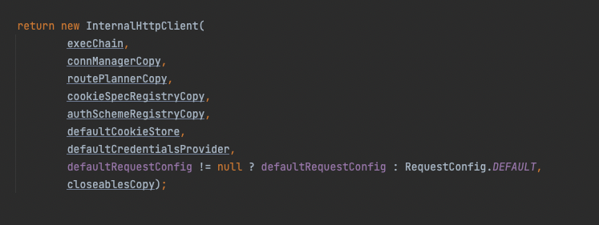

# 목차

<br>

- [목차](#목차)
- [Apache HttpClient 사용 방법 (Quick-Start)](#apache-httpclient-사용-방법-quick-start)
- [테스트용 서버 실행](#테스트용-서버-실행)
  - [요청을 받을 서버 실행](#요청을-받을-서버-실행)
  - [프로젝트 생성 및 의존성](#프로젝트-생성-및-의존성)
- [HttpClient Quick-Start (사용 방법)](#httpclient-quick-start-사용-방법)
  - [동작 순서](#동작-순서)
  - [1 - HttpClient 인스턴스 생성.](#1---httpclient-인스턴스-생성)
  - [2 - HTTP 메서드 인스턴스 생성.](#2---http-메서드-인스턴스-생성)
  - [3 - HttpClient 실행](#3---httpclient-실행)
  - [4 - 응답 처리와 커넥션 반환](#4---응답-처리와-커넥션-반환)
- [GET, POST 예시](#get-post-예시)
- [마치며](#마치며)

<br>

# Apache HttpClient 사용 방법 (Quick-Start)
[이전 글](../UrlConnection%26HttpUrlConnection/UrlConnection%26HttpUrlConnection.md)에서 Java 애플리케이션을 이용하여 HTTP 호출하는 방법중 가장 기초적인 `URLConnection & HttpURLConnection`에 대해 정리해보았다.

비록 자바는 `java.net` 패키지의 `URLConnection`을 통해 HTTP 요청과 관련된 기능을 제공해주지만, 많은 응용 프로그램에 필요한 유연성과 기능들을 제공하진 않는다.

> 실제로 이전 글에서도 볼 수 있듯이, 요청과 응답에 대한 입출력 흐름을 모두 하나하나 작성해줘야했으며, Connection Pool과 관련된 기능도 전혀 없었다.

이에 Apache는 `URLconnection`을 추상화하여 편하게 사용할 수 있는 `HttpClient`를 개발하기시작하였고, 이는 HTTP 표준을 지키며 유연하고 효율적이며 풍부한 기능들을 제공해주게된다.

그로인해 대부분의 자바 애플리케이션에서 HTTP 호출할 때 `URLConnection` 대신 `HttpClient`를 사용하게되었다.

> 심지어 자바 11부터는 `HttpClient`가 기본으로 제공되기시작했다. 다만, 이 글은 Apache의 `HttpClient`에 대한 글이다.
> 
> 두 라이브러리의 차이는 [여기](https://medium.com/@kir.maxim/lesson-i-have-learned-from-using-jdk11-http-client-2cf990daba03)를 참고하면 된다.

초반 개발 당시엔 `3.x` 버전으로 Apache Commons의 프로젝트였다가 승급해서 Apache의 탑 레벨 프로젝트가 되었다.

그리고 지금은 `4.x`부터 사용되는 버전을 대부분 사용하며, 이는 `HttpComponents`로 불리운다.

이번 글은 간단한 학습 테스트를 통해 Apache HttpClient (HttpComponents)의 사용방법을 알아본다. 

그 과정에서 HttpClient는 HTTP 요청을 어떻게 처리하는지도 간단히 살펴본다.

<br>

# 테스트용 서버 실행
이번 글의 모든 내용은 직접 코드를 작성해가면서 학습 테스트를 진행한다.

그러기에 HttpClient에 대한 내용을 살펴보기에 앞서, HttpClient의 요청을 받을 서버를 실행하고, 프로젝트를 생성해준다.

<br>

## 요청을 받을 서버 실행
먼저 HttpClient의 요청을 받아서 응답을 내려줄 서버를 실행해준다.

필자의 경우는 회원의 CRUD 서버를 간단히 구현하여 로컬에서 실행해주었다.

회원 CRUD 서버에 대한 코드는 [여기](https://github.com/binghe819/learning-sandbox/tree/master/spring-rest-template)에서 확인할 수 있다.

필자가 구현한 회원 CRUD 서버의 API 명세는 아래와 같다.

* 회원 조회 - GET /users/{id}
* 회원 리스트 조회 - GET /users
* 회원 등록 - POST /users
* 회원 수정 - PUT /users/{id}
* 회원 삭제 - DELETE /users/{id}

> 꼭 로컬에서 서버를 실행하지않고, 이미 떠있는 수많은 서버중 하나를 골라서 사용해도 무방하다. (ex. 네이버, 구글등등)

<br>

## 프로젝트 생성 및 의존성
요청을 받을 서버를 띄우거나 대상을 정했다면, 이제 간단히 Gradle 기반의 자바 프로젝트나 생성해준다.

> 스프링 프로젝트는 너무 많은 의존성을 가지고있기에, 자바 프로젝트를 생성하여 HttpClient 의존성만 추가해주는 것이 학습하기에 좋다.

생성후 `build.gradle`에 아래와 같이 HttpClient 의존성을 주입해주기만하면 된다.

```gradle
implementation 'org.apache.httpcomponents:httpclient:4.5.13'
```

현재 `HttpClient 5.x`까지 나왔지만, Maven 저장소 확인결과 아직까진 대부분 `4.x` 사용중이라 이번 글에선 `4.5` 버전을 사용한다.

> 5버전부터 HTTP/2를 지원하고, 기반 기술부터 완전히 비동기 방식으로 변경되어 비동기 응답 처리를 지원한다.
> 
> 이번 글에선 당연히 HTTP/2와 비동기가 주요 주제가 아니기에 4버전을 사용한다.

<br>

# HttpClient Quick-Start (사용 방법)
바로 HttpClient의 이론적인 부분을 살펴보면 사실 내용이 크게 와닿지도 않고, 재미도없다...

그래서 이번 글에선 HttpClient의 모듈 구성이나 동작 원리에 대해서 알아보기 이전에 간단히 HttpClient를 이용하여 GET과 POST 요청을 날려본다.

이를 통해 HttpClient의 간단한 사용법과 어떻게 동작하는지 큰그림을 그려본다.

<br>

## 동작 순서
HttpClient를 이용하여 HTTP 요청과 응답을 처리하기위한 순서는 아래와 같다.

1. HttpClient 인스턴스 생성.
2. HTTP Request 인스턴스를 생성. (HTTP 메서드와 연결할 URL을 메서드 생성자에 전달한다.)
3. HttpClient 실행. (HTTP 메서드를 실행한다. 이때 TCP 커넥션도 함께 이뤄진다.)
4. 응답 처리와 커넥션 반환

<br>

## 1 - HttpClient 인스턴스 생성.
`HttpClient` 인터페이스는 HTTP 요청 실행을위한 가장 기본적인 규칙을 정의하고있다.

상태 관리, 인증 및 리다이렉션 처리, 그리고 커넥션 풀등 모두 `HttpClient` 인스턴스에 설정한다.

그러므로 HTTP 요청을 실행하려면 아래와 같이 `HttpClient`의 구현체 인스턴스를 생성해줘야한다.

```java
CloseableHttpClient httpclient = HttpClients.createDefault();
```

위 코드는 아래와 같이 매번 `CloseableHttpClient`의 구현체인 `InternalHttpClient`를 생성한다.

<p align="center"><br>HttpClientBuilder의 build() 구현체 일부분 </p>

그리고 그 생성과정을 보면 매번 `PoolingHttpClientConnectionManager` (커넥션 풀)를 생성하고 설정해준다.

즉, 매번 요청할 때마다 커넥션을 풀을 생성하는 것이기에, 굉장히 비효율적이라고 볼 수 있다.

이와 관련된 더 자세한 내용은 다른 글에서 다룰 예정이다.

**이 글을 통해 `HttpClient`을 실제 애플리케이션에 적용하여 사용할 땐, 위와 같이 사용하는 것은 좋지 않다는 것을 알려주기 위함이다.**

<br>

## 2 - HTTP 메서드 인스턴스 생성.
이제 생성한 `HttpClient`에 넘길 HTTP Request 구현체를 생성해준다.

```java
// 요청할 HTTP Method에 맞는 인스턴스 생성.
HttpGet httpGet = new HttpGet("http://localhost:8080/users");

// HTTP 요청에 담을 내용 정의
// 헤더
httpGet.addHeader("User-Agent", "Java Client; Mac OS");
httpGet.addHeader("Accept", "*/*");
httpGet.addHeader("Connection", "keep-alive");
httpGet.addHeader("Keep-Alive", "timeout=5, max=100");

// 바디
String requestBody = "{\"name\":\"testtest1\",\"age\":27}";
httpPost.setEntity(new StringEntity(requestBody, ContentType.APPLICATION_JSON));
```

HTTP Request 구현체에 요청할 때 사용될 헤더와 바디를 설정해준다.

HTTP 요청과 응답의 메시지중 Body부분은 `HttpEntity`의 구현체로 구현된다.

* HTTP 요청의 경우 POST와 PUT 요청시 `HttpEntity`(RequestBody)를 포함하여 요청을 보낸다.
* HTTP 응답의 경우 일반적으로 `HttpEntity`(ResponseBody)를 포함한다. (물론 204 No Content와 같은 응답에 경우는 포함되지 않을 수 있다.)

> `HttpEntiy`와 관련된 더 자세한 내용은 다음 글에서 자세히 다룰 예정이다.

<br>

## 3 - HttpClient 실행
`HttpClient`와 `HttpRequest`에 대한 구현체를 생성하였다면, 이제 아래와 같이 `HttpClient`를 실행하여 HTTP 요청을 보낸다.

```java
// HTTP 요청 실행 (TCP 커넥션 + HTTP 요청)
CloseableHttpResponse response = httpClient.execute(httpPost);
```

`execute()`를 실행하면 URL에 해당하는 서버와 TCP 커넥션을 맺는다. 그리고 HTTP 요청을 보내고, 응답을 받게된다.

실제로 실행 결과로는 `HttpResponse`를 반환한다. 이는 HTTP의 응답 객체이다.

<br>

## 4 - 응답 처리와 커넥션 반환
`HttpClient.execute`를 통해 HTTP 요청을 실행하면 `HttpResponse`가 반환된다.

그리고 반환된 `HttpResponse`를 이용하여 HTTP의 응답을 읽고 처리할 수 있다.

```java
// HTTP 요청 실행 (TCP 커넥션 + HTTP 요청)
CloseableHttpResponse response = httpclient.execute(httpGet);

// 응답 처리
try {
    System.out.println(response.getStatusLine());                         // 응답의 시작줄
    Arrays.stream(response.getAllHeaders()).forEach(System.out::println); // 응답 헤더

    HttpEntity entity = response.getEntity();

    // 응답 바디 처리
    InputStream inputStream = entity.getContent();
    BufferedReader reader = new BufferedReader(new InputStreamReader(inputStream));

    StringBuilder responseBody = new StringBuilder();
    String line = "";
    while((line = reader.readLine()) != null) {
        responseBody.append(line);
    }
    System.out.println(responseBody);

    // 응답 콘텐츠를 완전히 소비. (완전히 소비해줘야 다음 연결이 안전하게 사용될 수 있다.)
    // InputStream을 close()해주는 역할이다.
    EntityUtils.consume(entity);
} finally {
    // 리소스 반환. (커넥션 풀의 리소스 반환)
    response.close();
}
```

알다싶이 HTTP 요청과 응답도 두 엔드포인트가 TCP 연결을 통해 소켓 통신으로 HTTP 메시지를 주고받는 것이다.

그러기에 **한번 요청과 응답을 주고받았다면 시스템 리소스를 낭비하지 않고 적절하게 활용하기위해 연결된 컨텐츠 스트림과 응답 자체를 닫아줘야한다.**

위 코드에선 두 번 `close()`한 것을 볼 수 있다.

* `EntityUtils.consume(HttpEntity)` - 현재 HttpClient를 사용하는 애플리케이션과 Socket 간의 스트림을 닫아주는 역할을 한다. (**컨텐츠 스트림 닫기**)
  * 이때 TCP 연결은 여전히 유효하다. 그저 인터넷으로부터 Socket에 들어온 데이터를 애플리케이션으로 읽어들이고 스트림을 닫아주는 역할이다.
  * `consume()` 메서드는 엔티티 콘텐츠가 완전히 사용되었고 기본 스트림이 닫혔는지 확인할 수 있다. `entity.close()`
* `CloseableHttpResponse.close()` - TCP 연결을 즉시 종료하고 삭제한다.
  * 커넥션 풀을 이용하고있다면 커넥션 풀에 해당 요청에 대한 리소스를 반환한다.

> `close()`를 해줘야하는 이유는 무엇일까?
> * 자바에선 보통 OS로부터 가져오는 자원을 네이티브 언어 (C)로 가져온다. 이때, 이 자원들은 GC의 대상이 되지않는다. 그러므로 해당 자원을 모두 사용했다면, GC의 대상이 될 수 있도록 다 사용했다는 의미에서 `close()`를 호출해줘야한다.
>   * 네트워크 관점에서 `write()`은 소켓 (OS의 일부분)에 어디까지 메시지를 보낼 것인지 모르기때문에, 원하는 데이터를 모두 소켓에 올렸다면 `close()`를 통해 어디까지의 메시지의 끝인지 알려주는 역할을 한다.
>   * 네트워크 관점에서 `read()`의 경우 소켓 (OS의 일부분)의 스트림중 어디까지가 하나의 요청인지 판별하기 힘들기 때문에, 이럴 때 `close()`를 이용할 수 있다.

<br>

# GET, POST 예시
마지막으로 전체적인으로 GET과 POST의 요청 과정을 통해 HttpClient가 어떻게 사용되는지 살펴본다.

<br>

💁‍♂️ **GET 요청 예시**

```java
@Test
void GET_Quick_Start() throws IOException {
    // HttpClient 인스턴스 생성
    CloseableHttpClient httpclient = HttpClients.createDefault();
    // 요청할 HTTP Method에 맞는 인스턴스 생성.
    HttpGet httpGet = new HttpGet("http://localhost:8080/users");
    // HTTP 요청에 담을 내용 정의 (헤더와 바디)
    httpGet.addHeader("User-Agent", "Java Client; Mac OS");
    httpGet.addHeader("Accept", "*/*");
    httpGet.addHeader("Connection", "keep-alive");
    httpGet.addHeader("Keep-Alive", "timeout=5, max=100");

    // HTTP 요청 실행 (TCP 커넥션 + HTTP 요청)
    CloseableHttpResponse response = httpclient.execute(httpGet);

    // 응답 처리
    try {
        System.out.println(response.getStatusLine());                         // 응답의 시작줄
        Arrays.stream(response.getAllHeaders()).forEach(System.out::println); // 응답 헤더

        HttpEntity entity = response.getEntity();

        // 응답 바디 처리
        InputStream inputStream = entity.getContent();
        BufferedReader reader = new BufferedReader(new InputStreamReader(inputStream));

        StringBuilder responseBody = new StringBuilder();
        String line = "";
        while((line = reader.readLine()) != null) {
            responseBody.append(line);
        }
        System.out.println(responseBody);

        // 응답 콘텐츠를 완전히 소비. (완전히 소비해줘야 다음 연결이 안전하게 사용될 수 있다.)
        EntityUtils.consume(entity);
    } finally {
        // 리소스 반환.
        response.close();
    }
}
```

<br>

💁‍♂️ **POST 요청 예시**

```java
@Test
void POST_Quick_Start() throws IOException {
    CloseableHttpClient httpClient = HttpClients.createDefault();

    HttpPost httpPost = new HttpPost("http://localhost:8080/users");

    // 요청 헤더
    httpPost.addHeader("User-Agent", "Java Client; Mac OS");
    httpPost.addHeader("Accept", "*/*");
    httpPost.addHeader("Connection", "keep-alive");
    httpPost.addHeader("Keep-Alive", "timeout=5, max=100");

    // 요청 바디
    String requestBody = "{\"name\":\"testtest1\",\"age\":27}";
    httpPost.setEntity(new StringEntity(requestBody, ContentType.APPLICATION_JSON));

    // HTTP 요청 실행 (TCP 커넥션 + HTTP 요청)
    CloseableHttpResponse response = httpClient.execute(httpPost);

    // 응답 처리
    try {
        System.out.println(response.getStatusLine());                         // 응답의 시작줄
        Arrays.stream(response.getAllHeaders()).forEach(System.out::println); // 응답 헤더

        HttpEntity entity = response.getEntity();

        // 응답 바디 처리
        InputStream inputStream = entity.getContent();
        BufferedReader reader = new BufferedReader(new InputStreamReader(inputStream));

        StringBuilder responseBody = new StringBuilder();
        String line = "";
        while((line = reader.readLine()) != null) {
            responseBody.append(line);
        }
        System.out.println(responseBody);

        // 응답 콘텐츠를 완전히 소비. (완전히 소비해줘야 다음 연결이 안전하게 사용될 수 있다.)
        EntityUtils.consume(entity);
    } finally {
        // 리소스 반환.
        response.close();
    }
}
```

<br>

# 마치며
HttpClient (정확히는 HttpComponents)의 사용법에 대해서 간단히 알아보았다.

이렇게 QuickStart만보면 이전 글에서의 [URLConnection](../UrlConnection%26HttpUrlConnection/UrlConnection%26HttpUrlConnection.md)과 크게 다른 점이 없어보인다..

다만 HttpClient는 HTTPURLConnection의 HTTP의 요청, 응답, 실행주체를 패키지화하였다. 

이를 통해 입출력 흐름을 HttpRequest와 HttpResponse로 통일되었으며, 이를 통해 조작의 번거로움을 줄일 수 있었다.

이번 글에선 다루지않았지만, 이렇게 HttpClient는 추상화시킴으로서 커넥션 풀에 대한 사용도 모두 은닉하였다.

즉, 개발자는 그저 핵심적인 HTTP 요청만 신경쓰면되며, 간단한 설정만으로 부가로직에 해당하는 커넥션 풀을 사용할 수 있게된 것이다.

이와 관련된 더 자세한 내용은 다음 글에서 더 자세히 다룰 예정이다!
