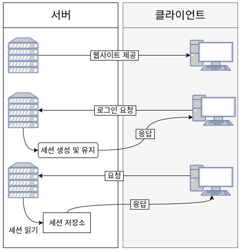
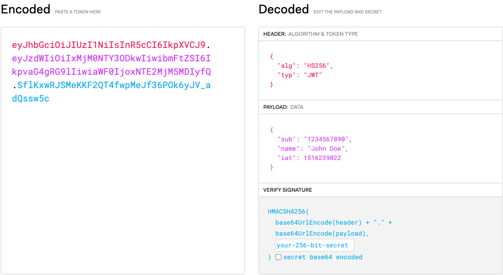

# 목차

<br>

- [목차](#목차)
- [1 JWT 개념](#1-jwt-개념)
  - [1-1 JWT란?](#1-1-jwt란)
    - [JWT란?](#jwt란)
    - [자가 수용적 (self-contained)이다.](#자가-수용적-self-contained이다)
    - [토큰 기반 인증](#토큰-기반-인증)
  - [1-2 토큰 기반 인증 vs 서버 기반 인증](#1-2-토큰-기반-인증-vs-서버-기반-인증)
    - [서버 기반 인증](#서버-기반-인증)
    - [토큰 기반 인증](#토큰-기반-인증-1)
    - [토큰의 장점](#토큰의-장점)
  - [1-3 JWT 구조와 생성](#1-3-jwt-구조와-생성)
    - [Header](#header)
    - [Payload](#payload)
    - [Signature](#signature)
  - [1-4 암호화 방식](#1-4-암호화-방식)
    - [비대칭키 - RS256](#비대칭키---rs256)
    - [대칭키 - HS256](#대칭키---hs256)
- [2 JJWT](#2-jjwt)
  - [2-1 JWS 생성](#2-1-jws-생성)
    - [Header](#header-1)
    - [Claims](#claims)
  - [2-2 JWS 읽기](#2-2-jws-읽기)
- [참고](#참고)

<br>

# 1 JWT 개념

🤔 JSON Web Token이 무엇인가?

<br>

## 1-1 JWT란?

### JWT란?

* JWT는 클라이언트와 서버 (서비스와 서비스 사이) 통신시 권한 인가를 위해 사용하는 **토큰**이다.
* JWT는 웹표준 [RFC 7519](https://tools.ietf.org/html/rfc7519)으로서 두 개체에서 JSON 객체를 사용하여 가볍고 자가수용적인방식으로 정보를 안전하게 전달해준다.

<br>

### 자가 수용적 (self-contained)이다.

* JWT는 필요한 모든 정보를 자체적으로 지니고 있다.
  * 중간에 쉽게 탈취하여 확인할 수 있기 때문에 민감한 정보는 담지 않는 것이 좋다.
  * 서버에서는 비밀키로 데이터 무결성(변조 유무)만을 검사한다.

<br>

### 토큰 기반 인증

* JWT는 토근 기반 인증의 방법중 하나이다.

<br>

## 1-2 토큰 기반 인증 vs 서버 기반 인증

JWT는 토큰 기반 인증의 방법 중 대표적인 방법이다. 간단하게 토큰 기반과 서버 기반 인증(세션)의 차이점을 알아보고자한다.

<br>

### 서버 기반 인증

🤔 서버 기반 인증?

<p align="center"><br>출처 : https://velopert.com/2350</p>

* 간단히 말해서 서버 기반 인증을 **"세션"기반 인증**을 의미한다.
  * 서버측에서 사용자들의 정보를 기억하고 있어야 한다.
  * **사용자들의 정보를 기억하기 위해서 세션을 이용한다.**
* **이러한 방식을 stateful 하다고 한다.**
  * 서버에서 클라이언트와 서버의 동작, 상태 정보등을 저장하고 있기 때문이다. 세션 상태에 기반하여 서버의 응답이 달리진다.
* 단점
  * **세션**
    * 세션은 보통 메모리에 이를 저장하는데, 이용자 수가 많아지면 램 대신 DB를 사용하게 되는데 서버 성능에 무리를 줄 수 있다.
  * **분산 서버 시스템 비효율적**
    * 트래픽이 증가함에 따라 분산 서버를 만들게 되면 세션으로는 분산 시스템을 만들기 매우 복잡하다.
  * **CORS (Cross - Origin Resource Sharing)**
    * 세션을 관리할 때 사용되는 쿠키는 단일 도메인 및 서브 도메인에서만 작동하도록 설계되어있다. 따라서 쿠키를 여러 도메인에서 관리하는 것은 번거롭다.

> 좋은 블로그 내용: https://sanghaklee.tistory.com/47

<br>

### 토큰 기반 인증

🤔 토큰 기반 인증?

<p align="center"><br>출처 : https://velopert.com/2350</p>

* **인증받은 사용자들에게 토큰을 발급하고, 서버에 요청을 할 때 헤더에 토큰을 함께 보내도록 하여 유효성 검사를 한다.**
  * 유저가 아이디와 비밀번호로 로그인 한다.
  * 서버측에서 해당 계정정보를 검증한다.
  * 계정 정보가 정확하다면, 서버측에서 유저에게 signed토큰을 발급해준다.
    * 여기서 signed의 의미는 해당 토큰이 서버에서 정상적으로 발급된 토큰임을 증명하는 signature를 지니고 있다는 것.
  * 클라이언트 측에서 전달받은 토큰을 저장해두고, 서버에 요청을 할 때마다, 해당 토큰을 함께 서버에 전달한다.
  * 서버는 토큰을 검증하고, 요청에 응답한다.

> 중요한 점은 토큰의 정보는 쉽게 탈취하여 볼 수 있지만, 변조를 하게 되면 인증이 안된다는 것이다. (데이터 무결성)

<br>

### 토큰의 장점

* 무상태 (stateless)이며 확장성 (scalability)이 있다.
  * 토큰을 클라이언트사이드에 저장하기 때문에 stateless
  * 서버를 확장하여 어떤 서버에 요청을 해도 같은 상관없다. scalability
* 보안성
  * 쿠키의 보안문제를 해결가능하다. 하지만 토큰의 보안성도 문제가 있다.
* Extensibility (확장성)
  * 토큰을 이용해 다른 서비스에서도 권한을 공유할 수 있다. (facebook, github...)
* 여러 플랫폼 및 도메인
  * 토큰은 CORS를 만족한다. 헤더의 값을 통해서 토큰을 전달하기 때문에 여러 디바이스를 호환한다.

<br>

## 1-3 JWT 구조와 생성



```json
HEADER.PAYLOAD.SIGNATURE
```

JWT는 점을 기준으로 다음과 같이 구성된다.

* 헤더 (Header)
* 페이로드 (Payload)
* 서명 (Signature)

> JWT를 검증하는데 필요한 정보를 가진 JSON객체는 **Base64 URL-Safe 인코딩된 문자열**이다.

<br>

### Header

**헤더는 JWT를 어떻게 검증(Verify)하는가**에 대한 내용을 담고 있다.

```json
{
  "alg" : "HS256",
  "typ" : "JWT"
}
```

* alg - 서명 시 사용하는 알고리즘.
  * 이 알고리즘은 토큰을 검증할 때 사용되는 signature 부분에서 사용된다.
* typ - 토큰의 타입을 지정.

> **Base64**로 암호화되어있어, 누구나 탈취하면 복호화하여 정보를 볼 수 있다. 즉, 중요 내용은 넣으면 안된다.

<br>

### Payload

**Payload는 JWT의 내용을 담고 있다.** 

Payload에 담는 정보의 **한 단위를 클레임 (Claim)이라 하며, name / value 형태**로 되어 있다.

Payload에 있는 속성들을 **클레임 셋 (Claim Set)**이라 부른다.

```json
{
  "uid" : "19234",
  "userName" : "binghe"
}
```

* Claim의 종류
  * 등록된 (registered) 클레임 - 이미 예약된 Claim
    * `<iss>`: 토큰 발행자 (Issur)
    * `<sub>`: 토른 제목 (Subject)
    * `<aud>`: 토큰 대상자 (Audience)
    * `<exp>`: 토큰 만료시간. (Expiration Time)
    * `<nbf>`: 토큰이 활성되는 시간. (이 시간 이후에 토큰을 사용할 수 있다)
    * `<jti>`: JWT의 고유 식별자. (다른 JWT와 다른 Unique한 값을 지녀야 한다)
  * 공개 (public) 클레임 - 사용자 정의 Claim
    * JWT를 사용하는 사람들에 의해 정의되는 Claim
    * 충돌 방지를 위해 URI 포맷을 이용해 저장한다.
  * 비공개 (private) 클레임 - 사용자 정의 Claim
    * JWT 사용자와 생산자 상호 합의 하에 정해지는 Claim
    * 일반적인 정보를 저장한다. (이름의 충돌 위험이 있다.)

> **Base64**로 암호화되어있어, 누구나 탈취하면 복호화하여 정보를 볼 수 있다. 즉, 중요 내용은 넣으면 안된다.

<br>

### Signature

**점을 구분자**로 해서 **Header와 Payload를 합친 문자열을 서명한 값**이다.

```text
// 생성 방식
HSACSHA256 (
	base64UrlEncode(header) + "." +
	base64UrlEncode(payload),
	secret
)
```

* Signature은 데이터의 무결성(변조유무)를 입증하는데 사용된다.
  * 데이터가 중간에 탈취되어, Header나 Payload가 변조되었다면 Signature 검증을 통해 알아낼 수 있다.

<br>

## 1-4 암호화 방식
JWT의 Signature 부분은 message(header + payload)가 변조되었는지 검사하는 역할을 한다.

그리고 이를 암호화하고 검증하는 방식은 두 가지이다.

<br>

### 비대칭키 - RS256
> RS256: RSA Signature with SHA-256
> 
> 비대칭키에 대한 개념은 [여기](https://github.com/binghe819/TIL/blob/master/Network/Security/%EC%95%94%ED%98%B8%ED%99%94%20%EA%B8%B0%EC%B4%88.md#%EB%B9%84%EB%8C%80%EC%B9%AD%ED%82%A4-%EC%95%94%ED%98%B8-%EC%95%8C%EA%B3%A0%EB%A6%AC%EC%A6%98)에서 확인가능합니다 :)

* 비대칭키 방식
  * message에 SHA256 적용후, private key 사용해서 암호화한다.
  * 일반적으로 public key는 JWT를 발급한 서버에서 JWK (Json Web Key)에 정의된 방식을 통해 공개적으로 제공된다.


<br>

### 대칭키 - HS256
> HS256: HMAC with SHA-256
> 
> 대칭키에 대한 개념은 [여기](https://github.com/binghe819/TIL/blob/master/Network/Security/%EC%95%94%ED%98%B8%ED%99%94%20%EA%B8%B0%EC%B4%88.md#%EB%8C%80%EC%B9%AD%ED%82%A4-%EC%95%94%ED%98%B8-%EC%95%8C%EA%B3%A0%EB%A6%AC%EC%A6%98)에서 확인가능합니다 :)

* 로그인 요청을 받고 인증이 되었다면 Header(Base64url)와 Payload(Base64Url) 내용으로 secret key와 함께 Signature를 생성한다.
  * 즉, Header와 Payload에 SHA256 적용 후 대칭키(secret key) 사용해서 암호화
  * 해당 대칭키를 가진 주체들은 모두 Signature 유효성 검증이 가능하다.

> 더 정확한 원리는 [JWT 공식 홈페이지](https://jwt.io/)에서 확인가능하다.

<br>

# 2 JJWT
> JWT (JSON Web Token) : JWS or JWE
> 
> JWS (JSON Web Signature) : 서버에서 인증을 하고 인증 정보와 private key (secret key)로 서명한 Token. (String => header.payload.signature)
> 
> JWE (JSON Web Encryption) : 서버와 클라이언트 간 암호화된 데이터를 Token 화 한것.
> 
> JWK (JSON Web Key) : JWE 에서 payload encryption 에 쓰인 키를 token 화 한것. (물론, 키 자체도 암호화되어 있죠.)

<br>

## 2-1 JWS 생성
JWS는 아래와 같이 생성할 수 있다.
```java
String jws = Jwts.builder()
    .setSubject("binghe")
    .signWith(key)
    .compact();
```

1. `Jwts.builder()` 메서드를 이용해 `JwtBuilder`인스턴스를 생성한다.
2. `JwtBuilder` 메서드 체이닝을 통해 헤더와 페이로드의 파라미터를 추가한다.
3. JWT를 검증할 때 사용할 `SecretKey` 혹은 비대칭성의 `PrivateKey`를 설정해준다.
4. `compact()` 메서드를 호출하므로써 `jws`를 생성한다.

> 쉽게 얘기하면 빌더 패턴으로 메서드 체이닝을 통해 각각의 설정을 해주고 만든다는 것.

<br>

### Header
**header parameter**

```java
String jws = Jwts.builder()
    .setHeaderParam("kid", "binghe")
    // ....
```
* 설정해주고 싶은 헤더를 `setHeaderParam`을 통해 설정해줄 수 있다. (key - value)
  * 여러번 호출해도 내부의 `Header` 인스턴스에 `append`된다.
  * 만약 동일한 `key`를 세팅해주면 가장 마지막 것으로 오버라이딩된다.
* `alg`나 `zip`헤더를 설정해주지 않아도 자동적으로 설정해준다.

<br>

**Header 인스턴스**

```java
Header header = Jwts.header(); // Map<String, Object>의 구현체
header.put(key, value);
...

String jws = Jwts.builder()
    .setHeader(header)
    // ...
```
* `setHeader`를 호출하면 이미 설정되어있을 수 있는 모든 동일한 헤더 key-value 쌍을 덮어쓴다.
* 그러나 모든 경우에 JJWT는 지정된 헤더 객체에 있든 없든 상관없이 모든 `alg`와 `zip`헤더를 설정해준다.

<br>

**Header Map**

```java
Map<String, Object> header = new Map<String, Object>();
header.set(key, value);
...

String jws = Jwts.builder()
    .setHeader(header)
    // ...
```

* Header 인스턴스와 동일하다.

<br>

### Claims
Claims는 JWT의 본문이며, JWT 작성자가 JWT 수령인에게 제시하고자 하는 정보를 포함하고 있다.

<br>

**Standard Claims**
```java
String jws = Jwts.builder()

    .setIssuer("me")
    .setSubject("Bob")
    .setAudience("you")
    .setExpiration(expiration) //a java.util.Date
    .setNotBefore(notBefore) //a java.util.Date 
    .setIssuedAt(new Date()) // for example, now
    .setId(UUID.randomUUID()) //just an example id
    
    /// ... etc ...
```

<br>

**Custom Claims**
표준 Claims말고 사용자 지정 클레임을 설정하고 싶은 경우 다음과 같이 하면 된다.

```java
String jws = Jwts.builder()
    .claim("hello", "World")
    .claim("name", "binghe")
    // ....
```
* `claim`이 호출될 때마다 key-value 쌍을 내부 Claim 인스턴스에 추가한다.
  * 만약 동일한 기존 key-value가 있다면 덮어쓴다.
* 표준 claim은 가독성 향상을 위해 표준 setter 방식이 더 좋다고 한다.

<br>

**Claim 인스턴스**
모든 Claim을 한 번에 지정하려면 다음과 같이 설정해주면 된다.

```java
Claims claims = Jwts.claims(); // Map<String, Object>의 구현체
claims.put(key, value);

String jws = Jwts.builder()
    .setClaims(claims)
    // ...
```
* `setClaims`를 호출하면 이미 설정되어있을 수 있는 모든 동일한 Claim key-value 쌍을 덮어쓴다.

<br>

**Claims Map**
```java
Map<String, Object> claims = new Map<String, Object>();
claims.set(key, value);
...

String jws = Jwts.builder()
    .setClaims(header)
    // ...
```
* Claims 인스턴스와 동일하다.

<br>

## 2-2 JWS 읽기
JWS의 읽기(파싱)은 다음과 같은 순서로 이뤄진다.
1. `Jwts.parserBuilder()을 사용하여 `JwtParserBuilder` 인스턴스를 만든다.
2. JWS 서명을 확인하는 데 사용할 `secret key` 또는 `비대칭 public key`를 지정한다.
3. 스레드 안전한 `JwtParser`를 반환받으려면 `JwtParserBuilder`의 `build()`를 호출해야한다.
4. 마지막으로 jws (`String`)을 매개변수로 `parseClaimsJws(String)`을 호출하면 원래의 JWS를 생성한다.
5. 전체 코드는 구문 분석 또는 서명 검증이 실패할 경우를 위해 `try/catch`로 감싸야한다.

```java
Jws<Claims> jws;

try {
    jws = Jwts.parserBuilder()  // (1)
    .setSigningKey(key)         // (2)
    .build()                    // (3)
    .parseClaimsJws(jwsString); // (4)
    
    // we can safely trust the JWT
     
catch (JwtException ex) {       // (5)
    
    // we *cannot* use the JWT as intended by its creator
}
```

<br>

> 더 자세한 내용은 [여기](https://github.com/jwtk/jjwt)를 참고해주세요!

<br>

# 참고
* https://meetup.toast.com/posts/239
* https://velopert.com/2389
* https://velopert.com/2350
* https://galid1.tistory.com/588
* https://stackabuse.com/understanding-json-web-tokens-jwt/
* https://github.com/jwtk/jjwt
* https://demyank.tistory.com/55
* https://www.letmecompile.com/api-auth-jwt-jwk-explained/
