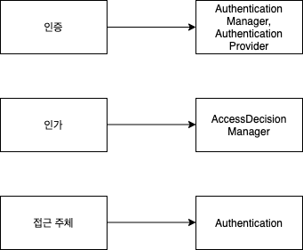
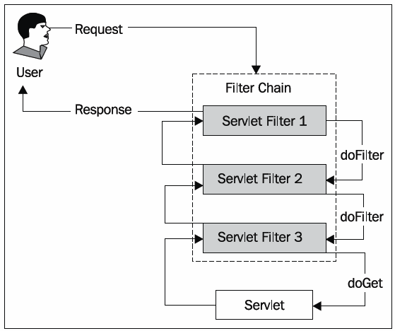
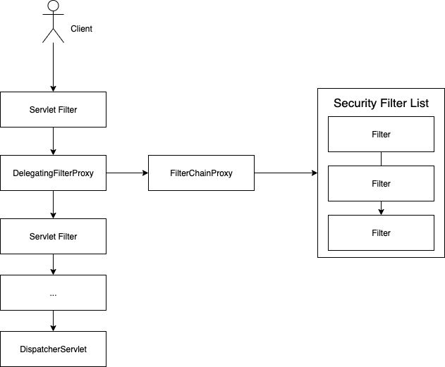
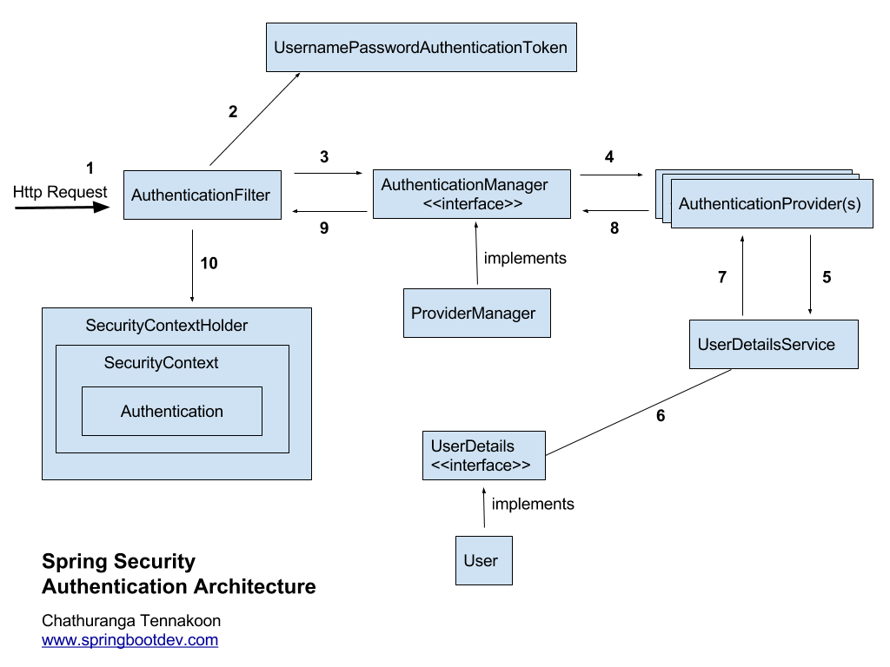
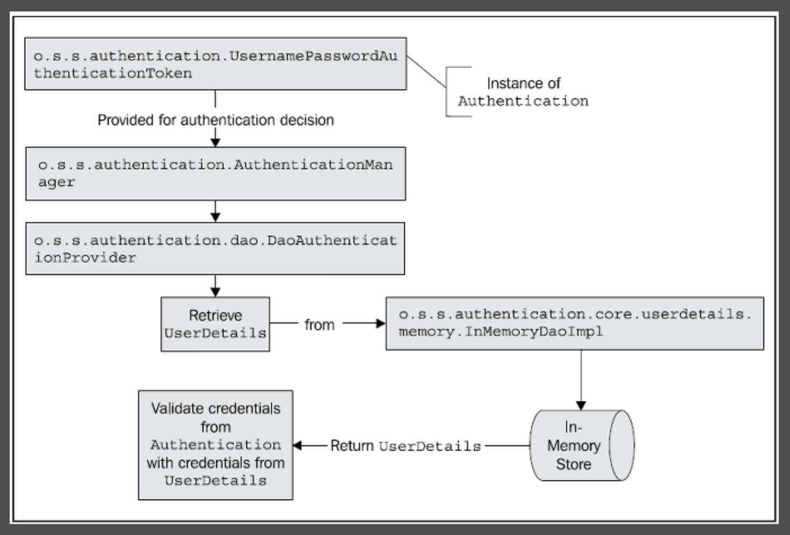
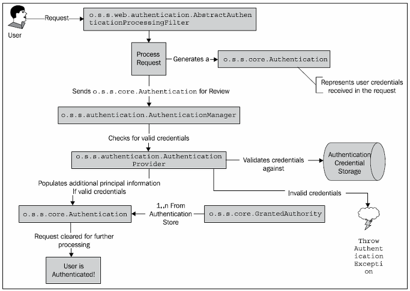
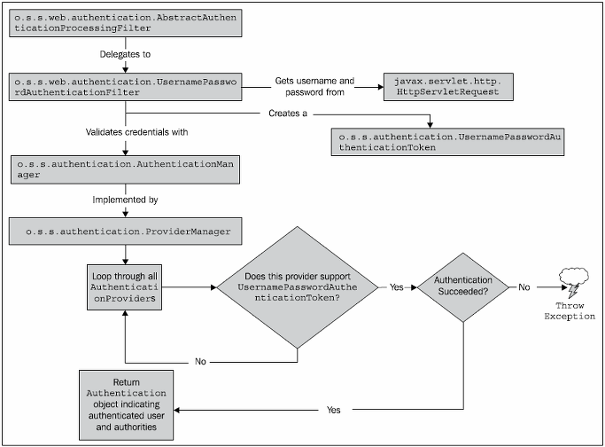
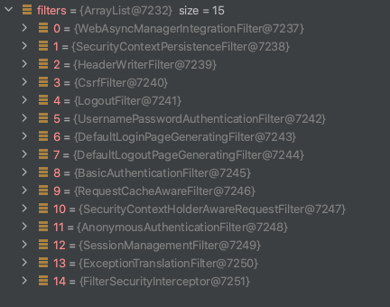

# 목차

# Spring Security 기초

Spring Security를 사이드 프로젝트에 도입하고자 공부를 해보려했지만, 책과 마땅한 공부 내용이 없어 여러 자료들을 읽고 정리해보고자 한다.

모든 공부는 내것으로 만드는게 중요하다 생각하는데 이 자료 정리를 통해 Spring Security 개념을 내것으로 만들고 싶다..ㅎ

## 1 용어 정리

### 1-1 용어

#### 인증 (Authentication)

> **누구인지 확인**

* 현재 사용자가 **누구인지를 확인하는 과정**
  * 보호된 리소스에 접근한 대상에 대해 누구인지, 애플리케이션의 작업을 수행해도 되는 주체인지 확인하는 과정
* ex) 아이디/암호를 통한 로그인 (Form)

#### 인가 (Authorization)

> **어떤 것을 할 수 있는지**

* **특정 리소스에 접근할 수 있는 역할(Role)을 부여하는 것**
  * 해당 리소스에 대해 접근 가능한 권한을 가지고 있는지 확인하는 과정
  * **인증 이후의 인가가 존재한다.**

* ex) ROLE_USER 역할의 사용자는 어드민 페이지에 접근할 수 없다.

#### 접근 주체 (Principal)

> 사용자

* **보호된 리소스에 접근하는 사용자**
  * 인증된 사용자
  * 인증되지 않은 사용자

#### 증명서 (Credential)

* 인증 과정 중 주체가 본인을 인증하기 위해 서버에 제공하는 것.

#### GrantedAuthority

> 권한

* 인증된 사용자(`Principal`)의 인증정보 (역할 등)을 표현
  * `ROLE_USER`
  * `ROLE_ADMIN`

* **인증 이후, 인가 및 권한 확인할 때 이 정보를 참조한다.**

#### UserDetails

* 애플리케이션이 가지고 있는 유저 정보와 스프링 시큐리티가 사용하는 `Authentication` 객체 사이의 어댑터.

#### UserDetailsService

* 유저 정보를 `UserDetails` 타입으로 가져오는 `DAO` 인터페이스
  * `Service`, `Repository` 를 사용하여 DB로부터 유저 정보를 가져와서 `UserDetails` 로 생성하여 반환.
  * **사용자가 커스텀마이징하는 인터페이스**

#### SecurityContext

* 접근 주체(Authentication)와 인증정보(GrantedAuthority)을 담고 있는 Context
* ThreadLocal에 보관되며, SecurityContextHolder를 통해 접근할 수 있다.

### 1-2 스프링 시큐리티와의 매칭

## 2 Spring Security란

### 2-1 개념

Spring Security는 Spring기반의 웹 애플리케이션의 보안(인증, 인가, 권한등)을 담당하는 스프링 하위 프레임워크이다.

**Spring에서 보안관련된 처리와 웹 요청에 대한 처리를 분리하고자 Spring Security는 서블릿 필터 체인을 통한 위임 모델을 구현하여 사용한다.** 

 출처 : https://springsource.tistory.com/80

Spring Security는 요청이 오면 인증과 인가를 위한 필터 체인을 거치게 된다. 사용자 인증 요청이 오면, 인증 매커니즘과 모델에 기반한 관련 필터를 찾을 때까지 정해진 필터 체인들을 거치게 된다.

### 2-2 Spring Security 동작 방식

Spring (정확히는 Spring MVC)에서는 다음과 같은 요청 라이프 사이클을 통해 요청을 처리한다.

 출처 : https://justforchangesake.wordpress.com/2014/05/07/spring-mvc-request-life-cycle/

필터는 `DispatcherServlet` 앞에서 먼저 동작하고, 인터셉터는 `DispatcherServlet` 과 `Controller(Handler)` 사이에서 동작한다.

* Filter
  * 서블릿 Context의 기능
* Interceptor
  * 스프링 Context의 기능이며 일종의 빈

#### DelegatingFilterProxy와 FilterChainProxy

* FilterChainProxy
  * **많은 스프링 시큐리티 필터들을 호출하는 역할을 한다.**
  * **보통 "springSecurityFilterChain"라는 이름으로 빈에 등록된다.**
* DelegatingFilterProxy
  * 일반적인 서블릿 필터
  * **서블릿 필터 처리를 스프링에 들어있는 빈으로 위임하고 싶을 때 사용하는 서블릿 필터이다.**
  * 타겟 빈 이름을 설정한다.
  * 스프링 부트 없이 시큐리티 설정할 때는 `AbstractSecurityWebApplicationInitializer` 를 사용해서 등록한다.
  * 스프링 부트에서는 자동으로 등록해준다. (`SecurityFilterAutoConfiguration`)

## 3 Spring Security 아키텍처

### 3-1 인증 아키텍처

아래 그림은 Spring Security가 일반적인 폼 인증을 처리하는다이어그램이다.

ex) 아이디와 비밀번호를 입력해서 로그인 인증

 출처 : www.springbootdev.com

1. 클라이언트가 폼을 통해 로그인 정보를 입력하고 인증 요청을 보낸다.

2. `AuthenticationFilter` (정확히는 `AuthenticationProcessingFilter`)를 구현한 `UsernamePasswordAuthenticationFilter` 가 `Request` 에서 사용자가 보낸 아이디와 비밀번호 정보를 이용해서 유효성 검사(`null` 인지)하고 `AuthenticationToken` 을 만들어서 `AuthenticationManager` 에게 넘겨주면서 인증을 위임한다.

   * `AuthenticationProcessingFilter`는 추상클래스이며, 팩토리 메서드 패턴을 사용해서 인증로직만 하위 클래스에게 위임한다.
     * 인증 로직 : `public Authentication attemptAuthentication(Request, Response)`

   * 그리고 `AuthenticationManager`에게 인증 (`authenticate`)로직을 위임한다.

3. `AuthenticationManager` (구현체 `ProviderManager`)는 반복문을 돌며 전달 받은 `AuthenticationToken` 를 처리할 수 있는 `AuthenticationProvider` 를 찾는다.

   * `provider.support(AuthenticationToken.class)`

4. 처리할 수 있는 `Provider`(`DaoAthenticationProvider`) 를 찾았으면 해당 `Provider` 에게 `Token` 을 넘긴다.
   * `Authentication provider.autheticate(AutheticationToken)`

   * `Provider`는 `authenticate`메서드를 실행중에 `retrieveUser`를 통해 DB에서 유저 정보를 가져온다.
     
     * 이때, 개발자가 커스텀한 `UserDetailsService`를 구현한 객체가 사용된다.
     * `UserDetail retrieveUser(String username, AutheticationToken)`
     
     
     
     
 출처 : https://springsource.tistory.com/80

5. `Provider`는 `retrieveUser`의 반환 값을 이용해 인증을 진행한다.

  

  
 출처 : https://springsource.tistory.com/80

  * `AuthenticationProvider`가 credentials의 유효성을 검사한다.
    * 성공시 - 인증이 성공된  `Authentication` 객체를 반환한다.
    * 실패시 - `AuthenticationException`을 던진다.

전체적인 인증 로직은 아래와 같다.

 출처 : https://springsource.tistory.com/80

> 더 쉽고 자세한 내용은 [spring-security-authentication-architecture](https://springbootdev.com/2017/08/23/spring-security-authentication-architecture/)를 참고바랍니다.

### 3-2 역할

객체지향에서 중요한 개념은 협력, 역할, 책임이다. 각 객체들의 역할과 책임을 알아본다.

* `AbstractAuthenticationProcessingFilter` - POST 폼 데이터를 포함하는 요청을 처리한다.
  * POST의 Request로부터 `username`과 `password`의 null검사를 한 후
  * 사용자 비밀번호를 다른 필터로 전달하기 위해서 `Authentication` 객체를 생성한다.
  * 생성후 `AuthenticationManager`에게 `authentication`(인증)요청을하고 반환 받은 값을 다른 필터에게 넘긴다.
* `AuthenticationManager` - 인증요청을 받고 `Authentication`에 맞는 `Provider`를 찾고 찾은 `Provider`에게 인증을 요청한다.
* `AuthenticationProvider` - 실제 인증이 일어나고 만약 인증 성공시 `Authentication` 객체의 `authenticated = true`를 설정해준다.

### 3-3 인증예외

인증과 관련된 모든 예외는 `AuthenticationException`을 상속한다. `AuthenticationException`은 개발자에게 상세한 디버깅 정보를 제공하기 위해 두 개의 멤버 필드를 제공한다.

* `authentication` - 인증 요청관련 `Authentication` 객체를 저장하고 있다.
* `extraInformation` - 인증 예외 관련 부가 정보를 제공한다.
  * 예를 들어, `UsernameNotFountException ` 예외는 인증에 실패한 유저의 id 정보를 저장하고 있다.

많이 발생하는 예외들은 아래와 같다.

* `BadCredentialsException` : 사용자 아이디가 전달되지 않았거나 인증 저장소의 사용자 id 에 해당하는 패스워드가 일치하지 않을 경우 발생한다.
* `LockedException` : 사용자 계정이 잠긴경우 발생한다.
* `UsernameNotFoundException` : 인증 저장소에서 사용자 ID를 찾을 수 없거나 사용자 ID에 부여된 권한이 없을 경우 발생한다.

## 4 Spring Security 필터

[Spring Security 동작 방식](#2-2-spring-security-동작-방식)에서 언급했듯이 시큐리티는 필터 기반으로 동작한다.

# 참고

* https://docs.spring.io/spring-security/site/docs/5.4.0/reference/html5/
* https://springbootdev.com/2017/08/23/spring-security-authentication-architecture/
* [백기선님 스프링 시큐리티 강의]()
* https://coding-start.tistory.com/153