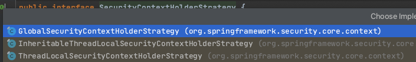
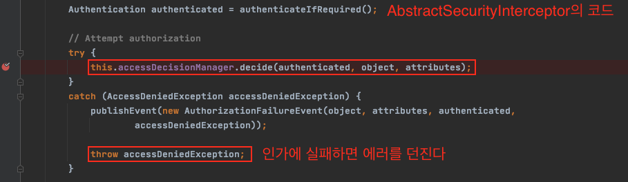

# 목차

- [Spring Security 기초](#spring-security-기초)
  * [1 용어 정리](#1-용어-정리)
    + [1-1 용어](#1-1-용어)
    + [1-2 스프링 시큐리티와의 매칭](#1-2-스프링-시큐리티와의-매칭)
  * [2 Spring Security란](#2-spring-security란)
    + [2-1 개념](#2-1-개념)
    + [2-2 Spring Security 동작 방식](#2-2-spring-security-동작-방식)
  * [3 Spring Security 아키텍처](#3-spring-security-아키텍처)
    + [3-1 인증 아키텍처](#3-1-인증-아키텍처)
    + [3-2 인증에서 각자의 역할](#3-2-인증에서-각자의-역할)
    + [3-3 인증예외](#3-3-인증예외)
    + [3-4 인가 아키텍처](#3-4-인가-아키텍처)
    + [3-5 인가에서 각자의 역할](#3-5-인가에서-각자의-역할)
  * [4 Spring Security 아키텍처 파고들기](#4-spring-security-아키텍처-파고들기)
    + [4-1 SecurityContextHolder와 Authentication의 관계](#4-1-securitycontextholder와-authentication의-관계)
    + [4-2 AuthenticationManager와 Authentication의 관계](#4-2-authenticationmanager와-authentication의-관계)
    + [4-3 AuthenticationFilter와 PersistenceFilter](#4-3-authenticationfilter와-persistencefilter)
    + [4-4 SpringSecurity Filter](#4-4-springsecurity-filter)
    + [4-5 DelegatingFilterProxy](#4-5-delegatingfilterproxy)
    + [4-6 AccessDecisionManager](#4-6-accessdecisionmanager)
    + [4-7 FilterSecurityInterceptor](#4-7-filtersecurityinterceptor)
    + [4-8 ExceptionTranslationFilter](#4-8-exceptiontranslationfilter)
  * [5 상황별 필터의 역할](#5-상황별-필터의-역할)
- [참고](#참고)


# Spring Security 기초

처음엔 간단히 정리해보려고 했으나, 정리하다보니 내용이 많이 길어졌다.. 추후에 한번 더 깔끔하게 정리해보려고 한다.


## 1 용어 정리


### 1-1 용어

#### 인증 (Authentication)

> **누구인지 확인**

* 현재 사용자가 **누구인지를 확인하는 과정**
  * 보호된 리소스에 접근한 대상에 대해 누구인지, 애플리케이션의 작업을 수행해도 되는 주체인지 확인하는 과정
* ex) 아이디/암호를 통한 로그인 (Form)


#### 인가 (Authorization)

> **어떤 것을 할 수 있는지**

* **특정 리소스에 접근할 수 있는 역할(Role)을 부여하는 것**
  * 해당 리소스에 대해 접근 가능한 권한을 가지고 있는지 확인하는 과정
  * **인증 이후의 인가가 존재한다.**

* ex) ROLE_USER 역할의 사용자는 어드민 페이지에 접근할 수 없다.


#### 접근 주체 (Principal)

> 사용자

* **보호된 리소스에 접근하는 사용자**
  * 인증된 사용자
  * 인증되지 않은 사용자


#### 증명서 (Credential)

* 인증 과정 중 주체가 본인을 인증하기 위해 서버에 제공하는 것.


### 1-2 스프링 시큐리티와의 매칭


## 2 Spring Security란


### 2-1 개념

Spring Security는 Spring기반의 웹 애플리케이션의 보안(인증, 인가, 권한등)을 담당하는 스프링 하위 프레임워크이다.

**Spring에서 보안관련된 처리와 웹 요청에 대한 처리를 분리하고자 Spring Security는 서블릿 필터 체인을 통한 위임 모델을 구현하여 사용한다.** 


<center> 출처 : https://springsource.tistory.com/80</center>

Spring Security는 요청이 오면 인증과 인가를 위한 필터 체인을 거치게 된다. 사용자 인증 요청이 오면, 인증 매커니즘과 모델에 기반한 관련 필터를 찾을 때까지 정해진 필터 체인들을 거치게 된다.


### 2-2 Spring Security 동작 방식

Spring (정확히는 Spring MVC)에서는 다음과 같은 요청 라이프 사이클을 통해 요청을 처리한다.


<center> 출처 : https://justforchangesake.wordpress.com/2014/05/07/spring-mvc-request-life-cycle/</center>

필터는 `DispatcherServlet` 앞에서 먼저 동작하고, 인터셉터는 `DispatcherServlet` 과 `Controller(Handler)` 사이에서 동작한다.

* Filter
  * 서블릿 Context의 기능
* Interceptor
  * 스프링 Context의 기능이며 일종의 빈


#### DelegatingFilterProxy와 FilterChainProxy


* FilterChainProxy
  * **많은 스프링 시큐리티 필터들을 호출하는 역할을 한다.**
  * **보통 "springSecurityFilterChain"라는 이름으로 빈에 등록된다.**
* DelegatingFilterProxy
  * 일반적인 서블릿 필터
  * **서블릿 필터 처리를 스프링에 들어있는 빈으로 위임하고 싶을 때 사용하는 서블릿 필터이다.**
  * 타겟 빈 이름을 설정한다.
  * 스프링 부트 없이 시큐리티 설정할 때는 `AbstractSecurityWebApplicationInitializer` 를 사용해서 등록한다.
  * 스프링 부트에서는 자동으로 등록해준다. (`SecurityFilterAutoConfiguration`)


## 3 Spring Security 아키텍처

> 잘 정리된 글
>
> * https://jeong-pro.tistory.com/205
> * https://springsource.tistory.com/80
> * www.springbootdev.com


### 3-1 인증 아키텍처

아래 그림은 Spring Security가 일반적인 폼 인증을 처리하는다이어그램이다.

ex) 아이디와 비밀번호를 입력해서 로그인 인증


<center> 출처 : www.springbootdev.com</center>

1. 클라이언트가 폼을 통해 로그인 정보를 입력하고 인증 요청을 보낸다.

2. `AuthenticationFilter` (정확히는 `AuthenticationProcessingFilter`)를 구현한 `UsernamePasswordAuthenticationFilter` 가 `Request` 에서 사용자가 보낸 아이디와 비밀번호 정보를 이용해서 유효성 검사(`null` 인지)하고 `AuthenticationToken` 을 만들어서 `AuthenticationManager` 에게 넘겨주면서 인증을 위임한다.

   * `AuthenticationProcessingFilter`는 추상클래스이며, 팩토리 메서드 패턴을 사용해서 인증로직만 하위 클래스에게 위임한다.
     * 인증 로직 : `public Authentication attemptAuthentication(Request, Response)`

   * 그리고 `AuthenticationManager`에게 인증 (`authenticate`)로직을 위임한다.

3. `AuthenticationManager` (구현체 `ProviderManager`)는 반복문을 돌며 전달 받은 `AuthenticationToken` 를 처리할 수 있는 `AuthenticationProvider` 를 찾는다.

   * `provider.support(AuthenticationToken.class)`

4. 처리할 수 있는 `Provider`(`DaoAthenticationProvider`) 를 찾았으면 해당 `Provider` 에게 `Token` 을 넘긴다.
   * `Authentication provider.autheticate(AutheticationToken)`

   * `Provider`는 `authenticate`메서드를 실행중에 `retrieveUser`를 통해 DB에서 유저 정보를 가져온다.
     
     * 이때, 개발자가 커스텀한 `UserDetailsService`를 구현한 객체가 사용된다.
     * `UserDetail retrieveUser(String username, AutheticationToken)`
     
     
     
     <center> 출처 : https://springsource.tistory.com/80</center>

5. `Provider`는 `retrieveUser`의 반환 값을 이용해 인증을 진행한다.

  

  <center> 출처 : https://springsource.tistory.com/80</center>

  * `AuthenticationProvider`가 credentials의 유효성을 검사한다.
    * 성공시 - 인증이 성공된  `Authentication` 객체를 반환한다.
    * 실패시 - `AuthenticationException`을 던진다.


전체적인 인증 로직은 아래와 같다.


<center> 출처 : https://springsource.tistory.com/80</center>

> 더 쉽고 자세한 내용은 [spring-security-authentication-architecture](https://springbootdev.com/2017/08/23/spring-security-authentication-architecture/)를 참고바랍니다.


### 3-2 인증에서 각자의 역할

**객체지향에서 중요한 개념은 협력, 역할, 책임이다. 각 객체들의 역할과 책임을 알아본다.**

* `AuthenticationToken`
  * 사용자 인증 요청을 추상화한 `Authentication` 인터페이스 구현체
  * principal 멤버 변수는 2개의 의미로 사용된다.
    * 인증 전 : 사용자 ID (`String`)  /  인증 후 : 사용자 도메인 모델 (`User객체`)
* `AbstractAuthenticationProcessingFilter` - POST 폼 데이터를 포함하는 요청을 처리한다. (Filter)
  * HTTP 요청에서 사용자 ID, 비밀번호 추출 (+ null 체크)
  * 사용자 비밀번호를 다른 필터로 전달하기 위해서 `Authentication` 객체를 생성한다.
  * `AuthenticationManager` 호출
    * `AuthenticationManager`에게 `authentication`(인증)요청을하고 반환 받은 값을 다른 필터에게 넘긴다.
* `AuthenticationManager` - 인증요청을 받고 `Authentication`에 맞는 `Provider`를 찾고 찾은 `Provider`에게 인증을 요청(호출)한다.
* `AuthenticationProvider` - 실제 인증이 일어나고 만약 인증 성공시 `Authentication` 객체의 `authenticated = true`를 설정해준다.
  * `UserDetailsService`를 통해 사용자 정보를 DB에서 조회
  * 실질적인 사용자 인증 처리 로직을 수행한다.
  * 인증 결과는 `AuthenticationToken` 타입으로 반환

* `UserDetailsService` 
  * interface has a method to load User by *username* and returns a `UserDetails` object that Spring Security can use for authentication and validation.
  * 스프링 시큐리티가 유저 인증을 할 때 DB에서 유저정보 가져오는 서비스 역할
* `UserDetails`
  * contains necessary information (such as: username, password, authorities) to build an Authentication object.

* `Authentication`
  * Represents the token **for an authentication request or for an authenticated principal**


### 3-3 인증예외

인증과 관련된 모든 예외는 `AuthenticationException`을 상속한다. `AuthenticationException`은 개발자에게 상세한 디버깅 정보를 제공하기 위해 두 개의 멤버 필드를 제공한다.

* `authentication` - 인증 요청관련 `Authentication` 객체를 저장하고 있다.
* `extraInformation` - 인증 예외 관련 부가 정보를 제공한다.
  * 예를 들어, `UsernameNotFountException ` 예외는 인증에 실패한 유저의 id 정보를 저장하고 있다.

많이 발생하는 예외들은 아래와 같다.

* `BadCredentialsException` : 사용자 아이디가 전달되지 않았거나 인증 저장소의 사용자 id 에 해당하는 패스워드가 일치하지 않을 경우 발생한다.
* `LockedException` : 사용자 계정이 잠긴경우 발생한다.
* `UsernameNotFoundException` : 인증 저장소에서 사용자 ID를 찾을 수 없거나 사용자 ID에 부여된 권한이 없을 경우 발생한다.


### 3-4 인가 아키텍처

인가 아키텍처는 [4-8 ExceptionTranslationFilter](#4-8 exceptiontranslationfilter)에 자세히 정리해놓았다.


### 3-5 인가에서 각자의 역할

* `AccessDecisionManager`
  * 인증된 사용자의 보호 리소스 접근 여부를 판단한다. 3개의 기본 구현을 제공한다.
    * `AffirmativeBased` : 접근을 승인하는 voter가 1개 이상
    * `ConsensusBased` : 과반수
    * `UnanimouseBased` : 모든 voter가 승인해야 함
* `AccessDecisionVoter`
  * `AccessDecisionManager`는 다수의 `AccessDecisionVoter`로 구성된다.
  * 각각의 Voter는 주어진 정보를 기반으로 승인(`ACCESS_GRANTED`), 거절(`ACCESS_DENIED`), 보류(`ACCESS_ABSTAIN`)를 반환한다.
    * RoleVoter는 보호 리소스에서 


## 4 Spring Security 아키텍처 파고들기

[백기선님의 Spring Security 강의](https://www.inflearn.com/course/%EB%B0%B1%EA%B8%B0%EC%84%A0-%EC%8A%A4%ED%94%84%EB%A7%81-%EC%8B%9C%ED%81%90%EB%A6%AC%ED%8B%B0/dashboard)와 [최범균님의 스프링 시큐리티 구조 이해](https://www.slideshare.net/madvirus/ss-36809454)내용을 바탕으로 제가 디버깅하며 정리한 내용입니다.


### 4-1 SecurityContextHolder와 Authentication의 관계

> Authentication 객체는 어디에 있는가? 또한 무엇을 담고 있는가? [Refenrence](https://docs.spring.io/spring-security/site/docs/5.1.5.RELEASE/reference/htmlsingle/#core-components)


<center>( Authentication을 두 개의 객체 (SecurityContextHolder, SecurityContext)가 감싸고 있는 형태 )</center>


#### SecurityContextHolder


* 역할

  * **애플리케이션 어디서나 SecurityContext제공**

* **SecurityContextHolder안에는 반드시 인증이 된 정보만 담기게 된다.**

* 제공하는 방식

  

  <center> SecurityContextHolderStrategy </center>

  * 전략은 세 가지가 있으며, 기본적으로는 **ThreadLocal**을 사용한다. **한 Thread안에서 Context를 공유할 수 있다.**
  * 서블릿의 기본 전략이 Thread 단위이므로, 한 요청에 대해서 애플리케이션의 어떤 위치에서도 SecurityContextHolder를 통해 Authentication에 접근할 수 있는 것이다.


#### SecurityContextHolder로 Authentication접근하기

> 디버깅을 통해 SecurityContextHolder를 살펴본다.


* **인증되었다면 SecurityContextHolder로 애플리케이션 어디서나 Authentication에 접근할 수 있다.**
  * 핸들러 메서드로 `Principal`을 받아서 바인딩을 해도 되고, 핸들러 메서드 구현에서 홀더를 이용해 가져와도 된다.
* 인증과 인가를 하기 위한 여러 가지 정보들의 관계를 한 눈에 볼 수 있다.
  * **`Authentication`의 정보들은 모두 `UserDetailsService`가 DB로 부터 조회후 반환하는 `UserDetails`타입의 객체로부터 받아오는 것 ( 기본 구현체는 `User` )** 


#### SecurityContext


* `Authentication`을 감싸고 있으며 `Authentication`을 제공해준다.


#### Authentication

* 아래 객체들을 제공
  * Principal
  * Credentials
  * Authorities
  * Details


#### Principal

> **Principal == UserDetails**


<center> Authentication이 Principal를 상속받아 사용한다. </center>

* **"누구"에 해당하는 정보**
  * **`UserDetailsService`에서 리턴한 그 객체 => 아주 중요!**
* **객체는 `UserDetails`타입**
  * Form 로그인에서는 시큐리티가 제공하는 `UserDetails`의 구현체인 `User`객체를 사용한다.


#### GrantAuthority


* `GrantAuthority`
  * "ROLE_USER", "ROLE_ADMIN"등 **Principal이 가지고 있는 "권한"을 나타낸다.**
* 기본 구현체는 `SimpleGrantedAuthotiy`를 사용하고 있다.
  * **`String` 타입으로 권한을 가지고 있다.**
* **인증 이후, 인가 및 권한 확인할 때 이 정보를 참조한다.**


#### UserDetails

* contains necessary information (such as: username, password, authorities) to build an Authentication object.
* 애플리케이션이 가지고 있는 유저 정보와 스프링 시큐리티가 사용하는 `Authentication` 객체 사이의 **어댑터**.


#### UserDetailsService

* 유저 정보를 `UserDetails` 타입으로 가져오는 **`DAO` 인터페이스**
  * `Service`, `Repository` 를 사용하여 DB로부터 유저 정보를 가져와서 **`UserDetails` 로 생성하여 반환.**
    * 유저 정보를 가져오기만 하지 실제 인증을 하진 않는다.
  * **사용자가 커스텀마이징하는 인터페이스**


> **Authentication의 구성요소인 Principal와 Credential에는 어떤 데이터가 담겨야 하는가?**
>
> * Principal 개념은 명확히 해당 사용자를 지칭하는 거지만 그걸 구현을 어떻게 할꺼냐는 **정해진게 없기 때문에 정하기 나름이다.**
>   * 보통의 경우에는 사용자의 id 또는 이메일이나 유저네임에 해당하는 String을 Principal로 사용할 수도 있을것이고, 어떤 경우에는 사용자에 해당하는 도메인 객체를 Principal로 사용할 수도 있다. 그 도메인 객체가 id와 password를 가지고 있을 수도 있다
> * **스프링 시큐리티에서 Principal은 UserDetailsService가 리턴하는 UserDetails 타입의 객체이다.**
>   * **그 객체에 담겨있는 모든 정보가 Principal을 구성하는 정보가 되는거고, UserDetails라는 인터페이스를 구현한 클래스를 만들어 제공하면 얼마든지 추가 정보를 가지고 있는 Principal을 만들 수 있다.**


### 4-2 AuthenticationManager와 Authentication의 관계


#### 인증은 AuthenticationManager가 한다

스프링 시큐리티에서 인증 (Authentication)은 AuthenticationManager가 한다.

```java
public interface AuthenticationManager {
	Authentication authenticate(Authentication authentication) // 인증 메서드만 존재한다.
			throws AuthenticationException;
}
```

* ***<u>인자로 받은 `Authentication`</u>***이 ***<u>유효한 인증인지 확인</u>***하고 **<u>*`Authentication`객체를 리턴*</u>**한다.
  * 인증을 확인하는 과정에서 비활성 계정, 잘못된 비밀번호, 잠긴 계정 등의 에러를 던질 수 있다. (AuthenticationException)
* **`Manager`가 직접 인증을 하지 않고, 지원 가능한 `Provider`를 찾아서 위임한다. (delegating)**
  * 즉, **`Authentication`의 구현체에 따라 위임하는 `Provider` 가 달라진다.**
    * 폼 로그인은 `UNPWAToken`를 사용하는데, 이는 `DaoAuthenticationProvider`에게 위임하여 인증을 하게 한다.


#### 인자로 받은 Authentication


* 사용자가 입력한 인증에 필요한 정보 (username, password)로 만든 객체. (폼 인증인 경우)
* Authentication
  * Principal
  * Credentials


#### 유효한 인증인지 확인 

*  `ProviderManager`가 `Provider`에게 유효한 인증인지를 검사하라고 위임한다.
  * 사용자가 입력한 password가 UserDetailsService를 통해 읽어온 UserDetails 객체에 들어있는 password와 일치하는지 확인한다.
* 또한, 이 과정에서 해당 사용자 계정이 잠겨 있는지, 비활성 계정인지 등을 확인한다.


#### Authentication 객체를 리턴

`Provider`를 통해 인증 절차를 진행하고 그 결과를 `Authentication`타입의 객체로 반환한다.


* Authentication
  * Principal - UserDetailsService에서 리턴한 그 객체 (User)
  * Credentials - 비밀번호
  * GrantedAuthorities - 권한 (이것도 UserDetailsService로 부터 받아서 컬렉션에 저장한다.)
* **만약 인증에 실패하면 `BadCredentialsException`을 던진다. (그래서 try .. catch문으로 감싸져 있는 것이다.)**


### 4-3 AuthenticationFilter와 PersistenceFilter

`AuthenticationManager`에게 인증을 하라고 메시지 요청을 보내는 객체가 바로 AuthenticationFilter이다.


#### AuthenticationFilter


* `AuthenticationFilter`는 폼 인증을 처리하는 시큐리티 필터이다.
* **`AuthenticationManager`가 인증을 마친 뒤 리턴 받은 인증된 `Authenticaition`은 `AuthenticationFilter`에 의해 Context에 저장된다.**
  * SecurityContext에 인증된 Authentication을 저장하고 기존에 입력한 url로 리다이렉트한다. 그리고 다시 PersistenceFilter부터 거치게 된다.


#### PersistenceFilter

`SecurityContextPersistenceFilter`는 시큐리티의 FilterChainProxy로 실행되는 시큐리티 보안 필터중 가장 상단에 위치한다.


* 역할
  * 매 요청마다 세션에서 Authentication을 가져와 SecurityContextHolder에 담아주고, 요청이 끝나고 응답할 때 ThreadLocal인 SecurityContextHolder의 내용을 지워주는 역할
  * SecurityContext를 HTTP Session에 캐시 (기본전략)하여 여러 요청에서 Authentication을 공유하는 필터.
* 인증된 Authentication은 `SecurityContextRepository`를 통해 세션에 저장되고, 매 요청마다 불러와 SecurityContextHolder에 set해준다.
  * **SecurityContextRepository를 교체하여 세션을 HTTP Session이 아닌 다른 곳에 저장하는 것도 가능하다.**

> stateless하게 사용된다면 Session을 사용하지 않으므로 PersistenceFilter를 커스터마이징 하지 않는 이상 그냥 지나친다.


### 4-4 SpringSecurity Filter


#### FilterChainProxy

`springSecurityFilterChain`이라는 이름의 빈으로 등록된다.


* 역할
  * 먼저 시큐리티 설정에 따라 FilterChain을 만들고, 요청에 매치가 되는 SecurityFilter들을 가져온다.
    * 만약 두 개의 시큐리티 설정을 만들었는데 두 개 다 요청에 매치 된다면 두 개의 FilterChain을 생성하여 실행한다.
  * **그리고 VirtualFilterChain을 생성하여 SecurityFilter들을 하나하나 실행한다.**
* 그럼 FilterChain들은 어떻게 만들어지는가?
  * **우리가 작성한 SecurityConfig (설정)을 바탕으로 만들게 된다. 즉, 어떻게 설정해주냐에 따라 Filter들이 다르게 만들어진다.**
  * **만약 두 개의 SecurityConfig를 빈으로 등록하면 두 개의 FilterChainProxy가 생긴다.**


### 4-5 DelegatingFilterProxy

***서블릿 컨테이너에 등록되는 필터는 DelegatingFilterProxy 하나이고, 해당 필터내 호출되는 FilterChainProxy 및 여타 Filter들은 서블릿의 필터 인터페이스를 구현할 것 뿐 스프링에 등록된 필터다.***


* DelegatingFilterProxy
  * 일반적인 서블릿 필터.
  * **서블릿 필터 처리를 스프링에 들어있는 빈으로 위임하고 싶을 때 사용하는 서블릿 필터**
  * 타겟 빈 이름을 설정한다.


> 스프링 부트 없이 스프링 시큐리티 설정할 때
>
> * `AbstractSecurityWebApplicationInitializer`를 사용해서 `DelegatingFilterProxy`를 서블릿 필터로등록한다.
>
> 스프링 부트는 자동적으로 등록해준다. (`SecurityFilterAutoConfiguration`)


### 4-6 AccessDecisionManager

**인가란 인증을 마친 사용자가 특정 리소스에 접근을 할 때 허용할 것인가를 의미한가**

인증을 할 때는 `AuthenticationManager`를 사용하며, 인가를 할 때는 `AccessDecisionManager`를 사용한다.


#### AccessDecisionManager

* 역할
  
  * 인증된 사용자가 리소스에 접근을 허용할지 안할지 `Voter`들에게 물어본다. (마치 Manager가 Provider들에게 요청하듯이)
  
  * `Manager`는 여러 개의 `Voter`를 가질 수 있다.
  
    
  
  * 이 Voter 목록을 하나씩 거치면서 유효한지 확인을 한다.
* **AccessDecisionManager는 인증된 사용자의 보호 리소스 접근 여부를 판단한다**. 3개의 기본 구현을 제공한다.
  
  * `AffirmativeBased` : 접근을 승인하는 voter가 1개 이상 - **기본 전략**
  * `ConsensusBased` : 과반수
  * `UnanimouseBased` : 모든 voter가 승인해야 함


#### AccessDecisionVoter

* 역할
  * 해당 Authentication이 특정한 Object에 접근할 때 필요한 ConfigAttributes를 만족하는지 확인한다.
  * 각각의 Voter는 주어진 정보를 기반으로 승인(`ACCESS_GRANTED`), 거절(`ACCESS_DENIED`), 보류(`ACCESS_ABSTAIN`)를 반환한다.
* ConfigAttributes란 
  * `permitAll`, `authenticated` 등의 권한을 의미한다.
* `WebExpressionVoter` : 웹 시큐리티에서 사용하는 기본 구현체, ROLE_Xxxx가 매치되는지 확인.
* `RoleHierarchyVoter` : 계층형 ROLE 지원. ADMIN > MANAGER > USER


#### 커스터마이징하는 방법

> ADMIN 권한을 가진자는 USER권한이 필요한 페이지도 접근이 가능하게 하려면?

* 스프링에서는 따로 설정을 해주지 않으면 ADMIN권한이 USER권한보다 높다고 생각하지 못한다. 그저 두 개의 권한을 가지고 있다고만 생각한다.

* 이를 커스터마이징하는 방법은 두 가지이다.

  1. UserDetailsService에서 UserDetails를 리턴할 때 ROLE에 USER와 ADMIN을 모두 넣어주는 방법.

     ```java
     // Authorities를 두 개 가지게 하는 방법.
     @Override
     public UserDetails loadUserByUsername(String username) throws UsernameNotFoundException {
       Account account = accountRepository.findByUserName(username);
       if(account == null)
         throw new UsernameNotFoundException(username);
       return User
         .withUsername(account.getUsername())
         .password(account.getPassword())
         .roles(account.getRole(), "USER") // ADMIN을 가입할 때 USER도 추가해주면 된다.
         .build();
     }
     ```

  2. AccessDecisionManager가 권한들의 계층구조를 이해할 수 있도록 커스텀하는 방법

     ```java
     // 시큐리티 설정
     @Configuration
     @EnableWebSecurity
     public class SecurityConfig extends WebSecurityConfigurerAdapter {
     
         @Override
         protected void configure(HttpSecurity http) throws Exception {
             // 인증, 인가 설정
             http.authorizeRequests()
                     .mvcMatchers("/").permitAll()
                     .mvcMatchers("/index").permitAll()
                     .mvcMatchers("/signup").permitAll()
                     .mvcMatchers("/myinfo").authenticated()
                     .mvcMatchers("/admin").hasRole("ADMIN")
                     .anyRequest().permitAll()
                     .accessDecisionManager(acceseeDecisionManager()); // Manager 커스텀
     
             http.formLogin();
             http.httpBasic();
         }
     
       	// Manager 커스텀
         public AccessDecisionManager acceseeDecisionManager() {
             // 권한 계층도 
             RoleHierarchyImpl roleHierarchy = new RoleHierarchyImpl();
             roleHierarchy.setHierarchy("ROLE_ADMIN > ROLE_USER");
     
             // ExpressionHandler
             DefaultWebSecurityExpressionHandler handler = new DefaultWebSecurityExpressionHandler();
             handler.setRoleHierarchy(roleHierarchy); // set 권한 계층도
     
             // Voter 생성후 set Handler
             WebExpressionVoter webExpressionVoter = new WebExpressionVoter();
             webExpressionVoter.setExpressionHandler(handler);
     
             // Voter목록을 만들어 Manager에게 전달.
             List<AccessDecisionVoter<? extends Object>> voters = Arrays.asList(webExpressionVoter);
             return new AffirmativeBased(voters);
         }
     }
     ```

     * **AccessDecisionManager --사용--> AccessDecisionVoter --사용--> ExpressionHandler**
     * 복잡해보이지만, ExpressionHandler의 `RoleHierarchy`를 설정해준 것 뿐이다.


### 4-7 FilterSecurityInterceptor

>  AccessDecisionManager는 누가 언제 호출하는가?
>
> * 누가 - FilterChainProxy의 Security Filter중 하나인 FilterSecurityInterceptor에서 호출한다.
> * 언제 - 보편적으로는 Security Filter중 제일 마지막에 실행된다.




### 4-8 ExceptionTranslationFilter

> 왜 FilterSecurityInterceptor에서 인가과정에서 실패하면 로그인페이지로 가는지에 대해서 다룬다.


#### ExceptionTranslationFilter

* ExceptionTranslationFilter
  * 필터 체인에서 발생하는 **AccessDeniedException과 AuthenticationException을 처리하는 필터**


#### AuthenticationException 발생시

* **AuthenticationEntryPoint** 실행
* **AbstractSecurityInterceptor 하위 클래스에서 발생하는 예외만 처리**
  * 예) FilterSecurityInterceptor에서 발생하는 예외 처리
* 그럼 UsernamePasswordAuthenticationFilter에서 발생한 인증 에러는? 
  * ExceptionTranlatilnFilter가 처리하지 않고, AuthenticaionFilter내부에서 자체적으로 예외를 처리한다.


#### AccessDeniedException 발생시

* 익명 사용자라면 AuthenticationEntryPoint 실행
  * 폼 인증에 경우, 폼 로그인 화면을 출력하도록 한다.
* 익명 사용자가 아니면 AccessDeniedHandler에게 위임 (인증된 경우라면)


> 인가 과정중 상황별 예외처리는 디버깅을 해보면 이해가 빠르게 된다.


## 5 상황별 필터의 역할

아래와 같은 상황별 필터의 역할은 [최범균님의 SlideShare](https://www.slideshare.net/madvirus/ss-36809454)에 잘 정리되어 있다.

* 접근 권한이 없을 때 처리 (인증 전)
* 접근 권한이 있을 때 처리 (인증 후) + 인가 처리
* 기본 로그인 폼 제공
* 인증 요청 처리 과정 (성공시)
* 인증 요청 처리 과정 (실패시)
* 로그아웃 요청 처리 과정


# 참고

* https://docs.spring.io/spring-security/site/docs/5.4.0/reference/html5/
* https://springbootdev.com/2017/08/23/spring-security-authentication-architecture/
* [백기선님 스프링 시큐리티 강의](https://www.inflearn.com/course/%EB%B0%B1%EA%B8%B0%EC%84%A0-%EC%8A%A4%ED%94%84%EB%A7%81-%EC%8B%9C%ED%81%90%EB%A6%AC%ED%8B%B0/dashboard)
* https://coding-start.tistory.com/153
* https://bezkoder.com/spring-boot-jwt-authentication/#Implement_UserDetails_038_UserDetailsService
* https://jeong-pro.tistory.com/205
* https://www.slideshare.net/madvirus/ss-36809454