[Head First Servlets & JSP](http://www.yes24.com/Product/Goods/3301415?OzSrank=1)를 기초하여 작성한 자료입니다.

<br>

## 목차

- [서블릿과 JSP는 어디에 쓰는 것인가?](#서블릿과-jsp는-어디에-쓰는-것인가)
  - [1. 웹 ( Web )](#1-웹--web-)
    - [1-1. 웹 서버는 무슨 일을 하는가?](#1-1-웹-서버는-무슨-일을-하는가)
    - [1-2. 클라이언트는 무엇을 하는가?](#1-2-클라이언트는-무엇을-하는가)
  - [2. HTTP](#2-http)
    - [2-1. HTML은 HTTP의 응답의 일부분이다.](#2-1-html은-http의-응답의-일부분이다)
    - [2-2. GET vs POST](#2-2-get-vs-post)
      - [2-2-1. GET ( 주세요 )](#2-2-1-get--주세요-)
      - [2-2-2. POST ( 사용자 입력 값도 같이 보냅니다. )](#2-2-2-post--사용자-입력-값도-같이-보냅니다-)
    - [2-3. MIME](#2-3-mime)
    - [2-4. URL](#2-4-url)
    - [2-5. TCP포트](#2-5-tcp포트)
  - [3. 정적, 동적 페이지](#3-정적-동적-페이지)
    - [3-1. 웹 서버는 정적인 페이지만을 제공한다.](#3-1-웹-서버는-정적인-페이지만을-제공한다)
    - [3-2. 웹 서버 혼자서 못하는 두 가지](#3-2-웹-서버-혼자서-못하는-두-가지)
      - [3-2-1. 동적인 컨텐츠 생성](#3-2-1-동적인-컨텐츠-생성)
      - [3-2-2. 서버 상에 데이터 저장하기](#3-2-2-서버-상에-데이터-저장하기)
    - [3-3. 동적 페이지](#3-3-동적-페이지)
    - [3-4. 서블릿과 CGI 모두 도우미 애플리케이션이다.](#3-4-서블릿과-cgi-모두-도우미-애플리케이션이다)
    - [3-5. JSP의 등장](#3-5-jsp의-등장)
  - [4. 서블릿 예제](#4-서블릿-예제)

<br>

# 서블릿과 JSP는 어디에 쓰는 것인가?

이번 장은 웹에 대한 전반적인 내용을 다룬다. 

어떠한 기술이나 내용에 대해서 공부를 할 때 전체적인 큰 그림을 그리는게 중요하다고 생각한다.

이번 장이 바로 큰 그림을 그리는 파트가 될 것 같다.

<br>

## 1. 웹 ( Web )

웹은 헤아릴 수 없는 많은 수의 클라이언트와 서버들이 서로 유무선 네트워크로 연결된 하나의 네트워크입니다.

서버의 목적은 **클라이언트가 전세계 어디서도 쉽게 접근**할 수 있게 하는 것 입니다.

<p align="center">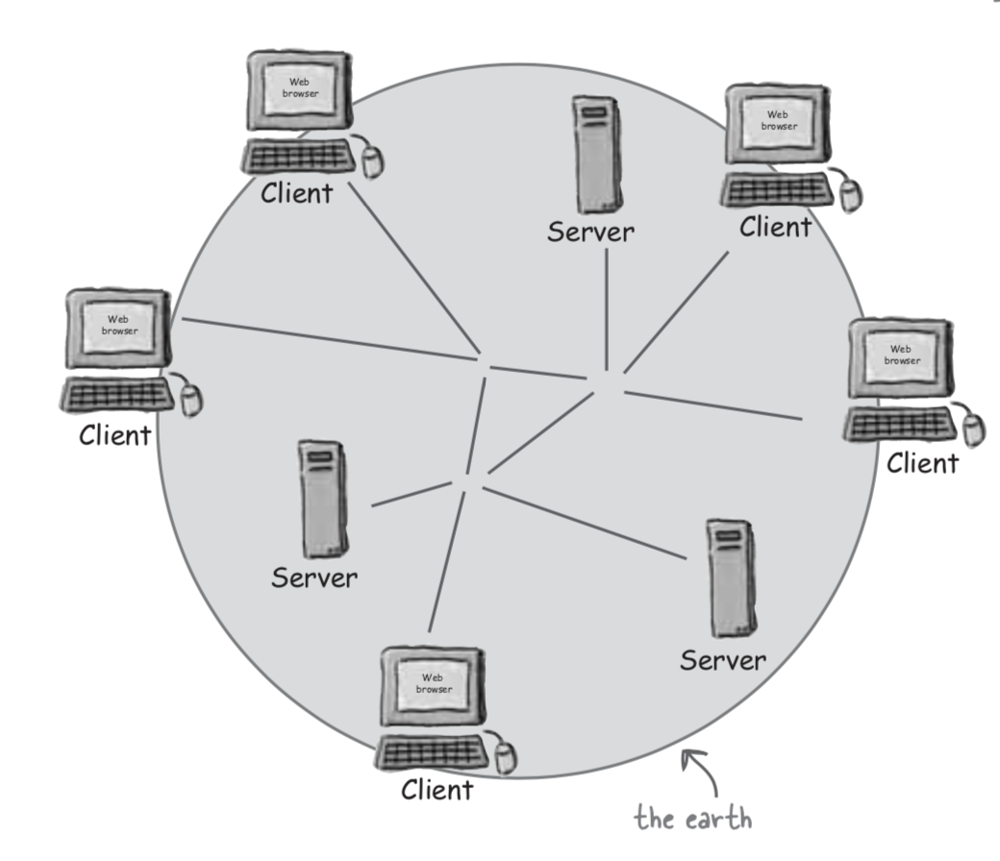<br>출처 : Head First Servlets & JSP</p>

<br>

### 1-1. 웹 서버는 무슨 일을 하는가?

웹 서버는 클라이언트로부터 요청을 받아, 요청한 것을 넘겨주는 일을 한다.

<p align="center">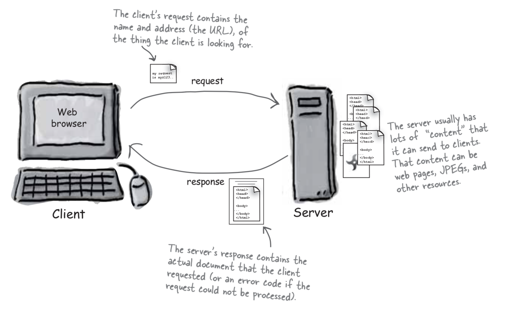<br>출처 : Head First Servlets & JSP</p>


클라이언트는 웹 브라우저로, URL을 통해 서버에 자원(resource)를 요청한다.

서버는 사용자가 요청한 것을 넘겨주는 것으로 작업을 완료한다.

여기서 말하는 자원이란 HTML페이지, 그림, 소리, PDF파일 등을 말한다.

<br>

### 1-2. 클라이언트는 무엇을 하는가?

웹 클라이언트는 사용자가 **서버에 요청을 보낼 수 있는 기능**(요청헤더 생성)을 제공한다.

요청을 보내고 난 다음, **서버가 보내온 요청의 결과를 화면에 출력**(파싱)하는 일을 한다.

<p align="center">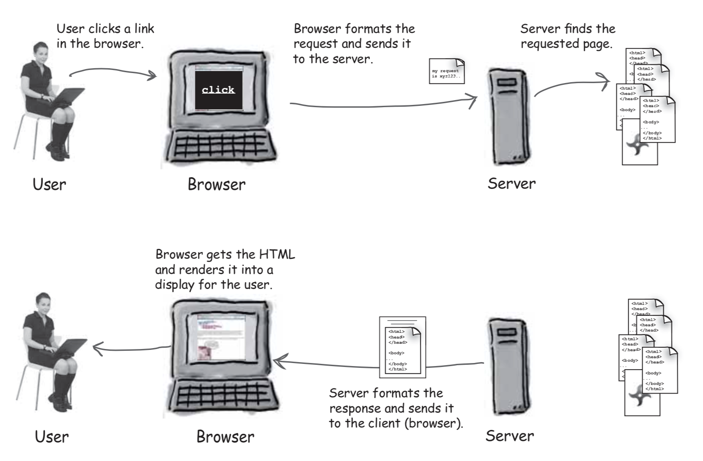<br>출처 : Head First Servlets & JSP</p>

> 클라언트와 웹서버는 모두 HTTP(통신규약)를 통해 통신하며, HTML을 전송하고 읽습니다.

<br>

## 2. HTTP 

**HTTP는 TCP/IP위에서 돌아가는 웹 통신 프로토콜**이다.

한 지점에서 다른 지점으로 요청과 응답을 전송하는 역할을 한다.

HTTP의 구조는 "요청/응답의 끊임없는 주고 받음"이라고도 할 수 있다.

<p align="center">
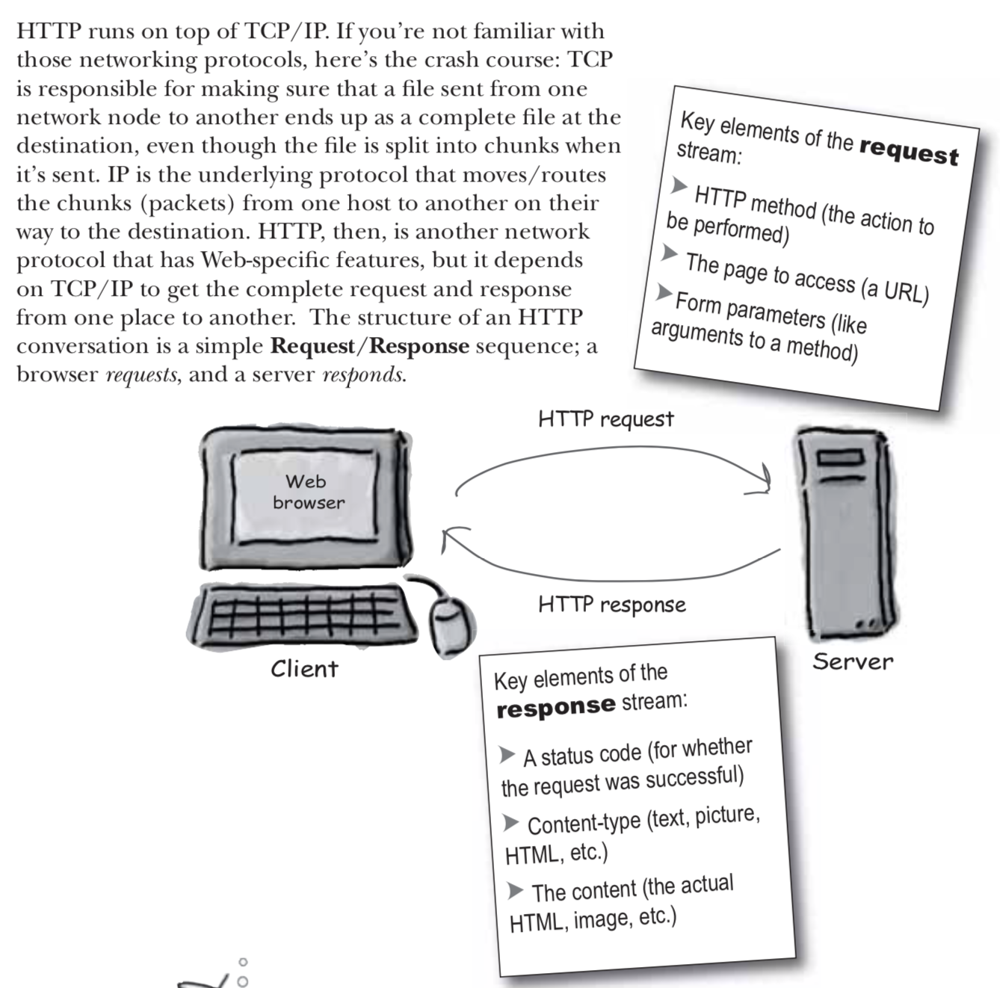<br>출처 : Head First Servlets & JSP</p>

* **요청의 주요 구성 요소**
  * HTTP 메소드 ( 실행할 액션 ) - GET, POST등등
  * 접근하고자 하는 페이지 ( URL ) - resource주소
  * 폼 파라미터 ( 메소드의 매개변수와 비슷하다. ) - POST의 경우 입력값
* **응답의 주요 구성 요소**
  * 상태 코드 ( 요청이 성공했는지 아닌지 등 )
  * 컨텐츠 타입 ( 텍스트, 그림, HTML 등 ) - MIME
  * 컨텐츠 ( HTML코드, 이미지 등 )

<br>

### 2-1. HTML은 HTTP의 응답의 일부분이다.

**HTTP 응답**에는 HTML뿐만 아니라 **헤더 정보**라는 것도 들어있다.

**브라우저는 헤더 정보로 컨텐츠를 어떻게 화면에 보여줄지에 대한 힌트를 얻는다.**

<p align="center">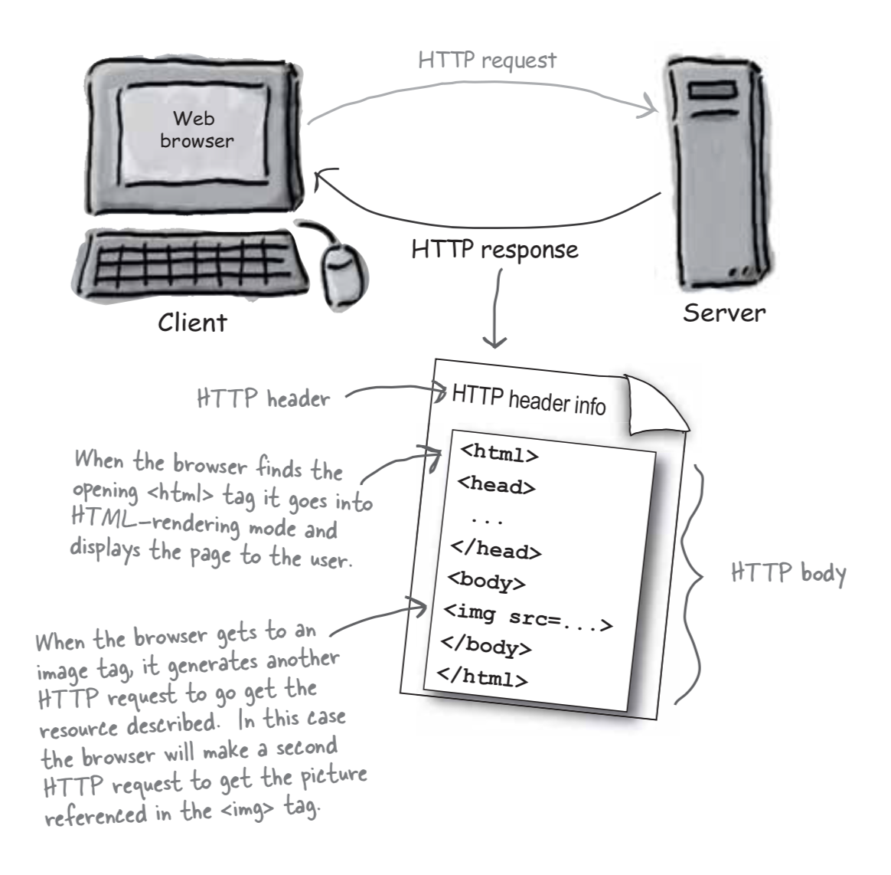<br>출처 : Head First Servlets & JSP</p>

클라이언트가 HTML페이지를 파일을 받고 해석(파싱)하는 과정에서 ``태그를 만나면 해당 태그에 적힌 주소에서 **이미지를 가져오기 위해 HTTP요청을 하나 더 만든다.**

**여기서 중요한 점은 HTML과 동시에 이미지가 오는 것이 아닌, HTML이 오고나서 이미지를 다시 요청한다는 것이다.**

<br>

### 2-2. GET vs POST

<p align="center">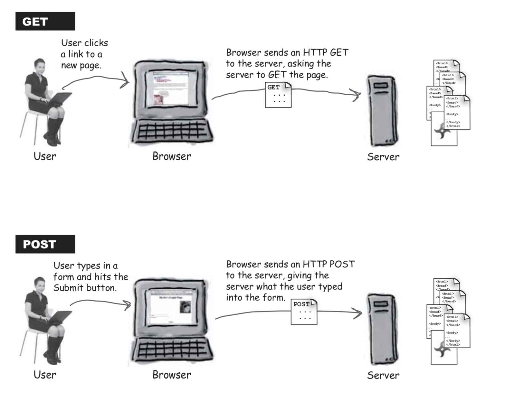<br>출처 : Head First Servlets & JSP</p>

GET, POST는 모두 **클라이언트가 서버에 요청**할 때 사용하는 메소드이다.

<br>

#### 2-2-1. GET ( 주세요 )

<p align="center">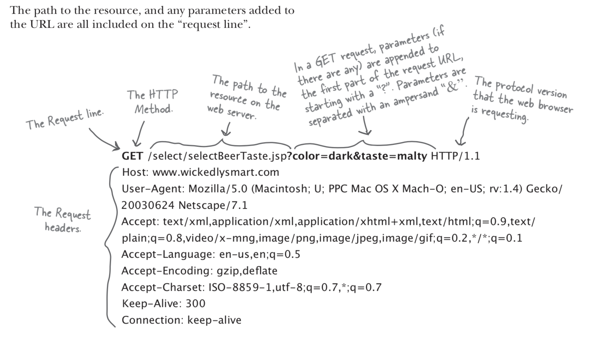<br>출처 : Head First Servlets & JSP</p>

* GET의 데이터 전송방식은 브라우저 주소란에 기입하는 URL 뒤에 붙이는 식이다.
  * "https://www.test.com?name=kim&age=16"
  * 중요한 데이터든 아니든 간에 화면에 다 보이게 된다. 그러므로 민감한 패스워드 같은 데이터를 GET으로 보낼 순 없다.
  * ?는 경로(paht)와 파라미터를 구분하는 구분자이다.

<br>

#### 2-2-2. POST ( 사용자 입력 값도 같이 보냅니다. )

<p align="center">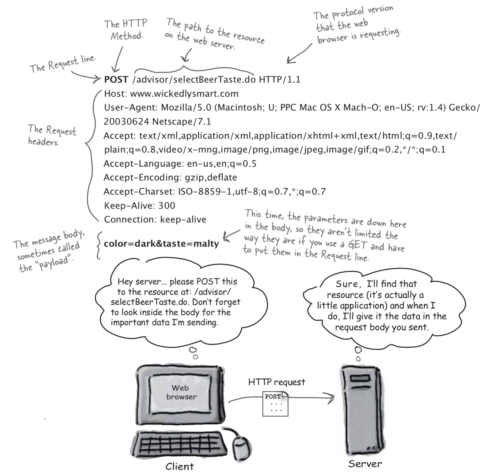<br>출처 : Head First Servlets & JSP</p>

* POST는 메시지 몸체도 같이 보내어, 비밀번호와 같은 민감한 데이터도 보낼 수 있다.
  * Accept : 컨텐츠 타입 지정.
* GET와 다르게 요청 길이의 제한이 없다.

<br>

### 2-3. MIME

클라이언트가 서버에 요청할 때 GET, POST 방식을 사용했듯, 서버가 클라이언트에게도 응답을 한다.

HTTP의 응답은 간단히 헤더와 몸체로 구성되어 있다.

<p align="center">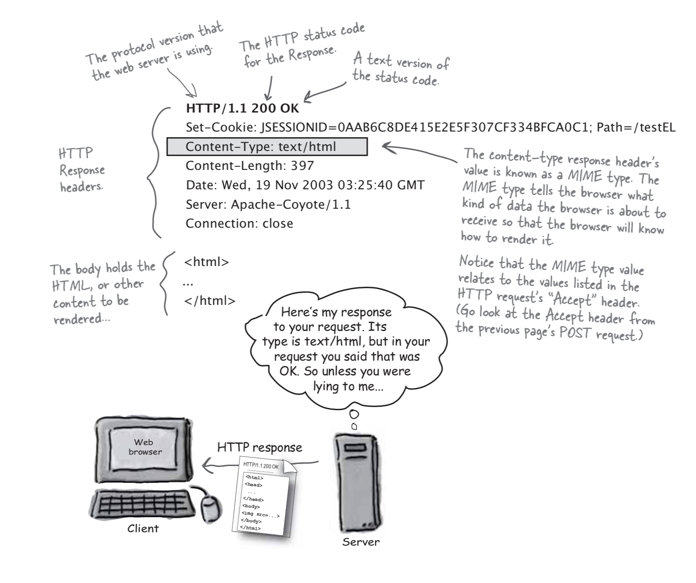<br>출처 : Head First Servlets & JSP</p>

* 헤더
  * 사용된 프로토콜이 무엇인지
  * 보내준 요청이 성공했는지
* 몸체
  * Content-type : 포함된 컨텐츠의 종류 ( MIME, Multipurpose Internet Mail Extensions )
    * **이 값을 보통 MIME타입이라고 부른다. MIME이란 브라우저에게 "지금 서버가 이러한 데이터를 보내려고 하니, 화면에 보여줄 준비를 하시오"라는 정보이다.**
  * 컨텐츠

<br>

> 전체적인 클라이언트와 웹 서버의 동작

<p align="center">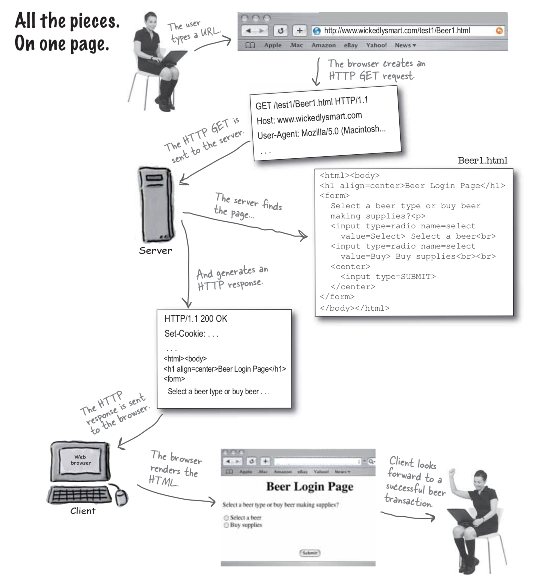<br>출처 : Head First Servlets & JSP</p>

<br>

### 2-4. URL

<p align="center">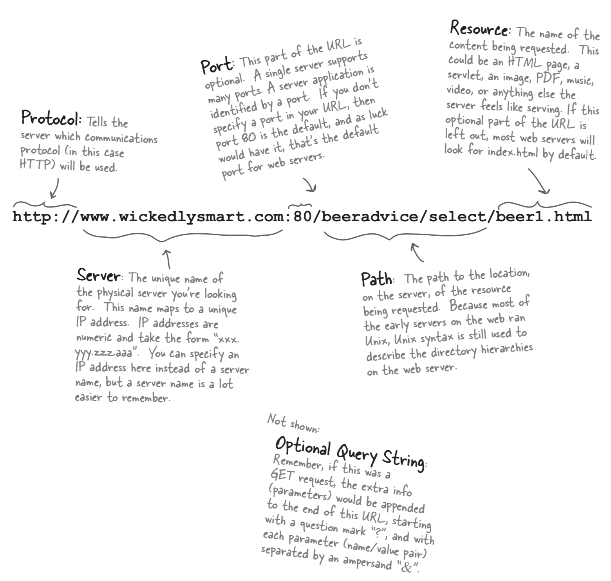<br>출처 : Head First Servlets & JSP</p>

* 프로토콜 : 서버와 대화하기 위하여 사용하는 통신 프로토콜 ( HTTP )
* 서버 : 서버의 IP주소가 매핑되어 있는 주소. 
* 포트 : 서버의 어떤 애플리케이션 서비스로 접근할 지 선택하는 번호.
* 자원 : 요청한 컨텐츠의 이름. ( HTML, 이미지, PDF등등 )

<br>

### 2-5. TCP포트

<p align="center">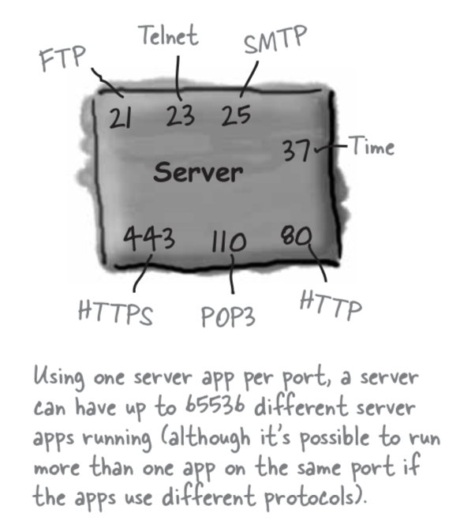<br>출처 : Head First Servlets & JSP</p>

* 서버 하드웨어 상에서 돌아가는 소프트웨어를 구별하기 위한 16비트 숫자 값.
  * 0 ~ 65535
* 서버 하드웨어에 65536개의 물리적인 포트가 있는 것은 아니고, 단순히 서버 애플리케이션을 대표하는 논리적인 숫자이다.

<br>

## 3. 정적, 동적 페이지

일반적인 웹 서버는 정적인 페이지만을 지원합니다. 여기서 말하는 **정적인 페이지는 HTML을 의미한다.**

**동적인 페이지를 위해서 웹 어플리케이션(WAS)가 탄생한 것이다.**

<br>

### 3-1. 웹 서버는 정적인 페이지만을 제공한다.

여기서 말하는 웹 서버는 Apache HTTPD를 의미한다.

<p align="center">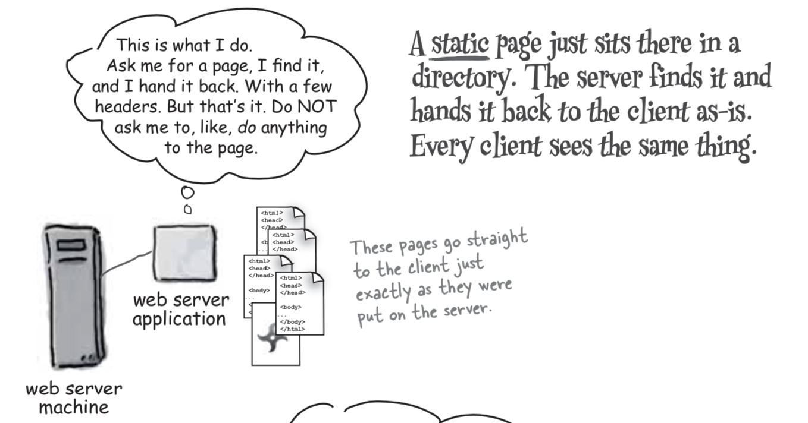<br>출처 : Head First Servlets & JSP</p>

* **정적인 페이지는 디렉토리에 있는 파일 그대로**를 의미한다.
* 서버는 단지 파일을 찾아서 있는 그대로 클라이언트에게 넘겨주기만 하면 된다.
* 이 말은 **모든 클라이언트가 동일한 결과**를 본다는 것이다.

<br>

> 만약 웹 페이지에서 현재 시간을 보고 싶으면 어떻게 해야할 까?? 로그인은 어떻게 하지??
>
> 이때 필요한 것이 동적 페이지이다.

<p align="center">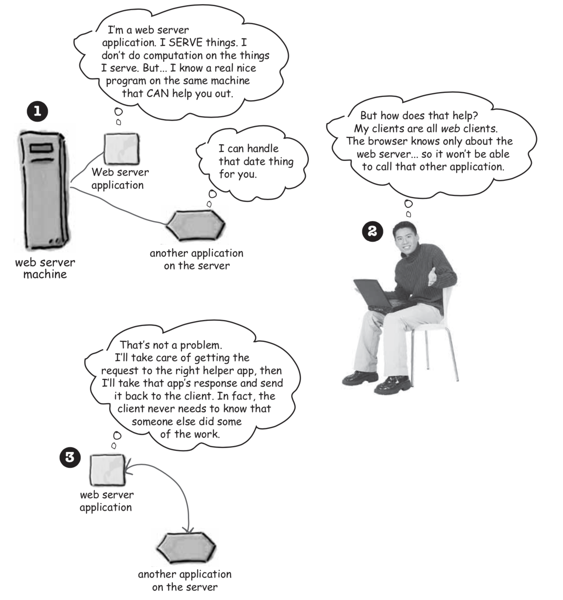<br>출처 : Head First Servlets & JSP</p>

* 웹 서버는 동적인 로직을 수행하지 못하기 때문에, 동적인 요청이 들어오면 웹 어플리케이션 서버(WAS)에 해당 요청을 넘긴다.
* 웹 어플리케이션 서버(WAS)는 해당 로직을 수행하고, HTML파일을 웹 서버에게 넘겨준다.
* 웹 서버는 WAS로부터 받은 파일을 클라이언트에게 반환한다.

<br>

### 3-2. 웹 서버 혼자서 못하는 두 가지

<br>

#### 3-2-1. 동적인 컨텐츠 생성

웹 서버는 단지 정적인 페이지만을 제공한다. 이때 웹 어플리케이션 서버 (WAS)와 협력하면 동적인, 실시간으로 작성한 페이지를 제공할 수 있게 된다.

<br>

#### 3-2-2. 서버 상에 데이터 저장하기

클라이언트가 HTML 폼에 데이터를 입력하고 서버에 전송을 하면, 서버는 해당 데이터를 처리하거나 저장하여야 한다.

이때 웹 서버는 해당 로직을 수행하지 못하기 때문에, 해당 요청을 WAS에 넘기게 된다.

<br>

### 3-3. 동적 페이지

웹 서버가 처리하지 못하는 요청을 처리하는 이런 **동적 페이지를 CGI프로그램 혹은 컨테이너**라고 부른다.

<p align="center">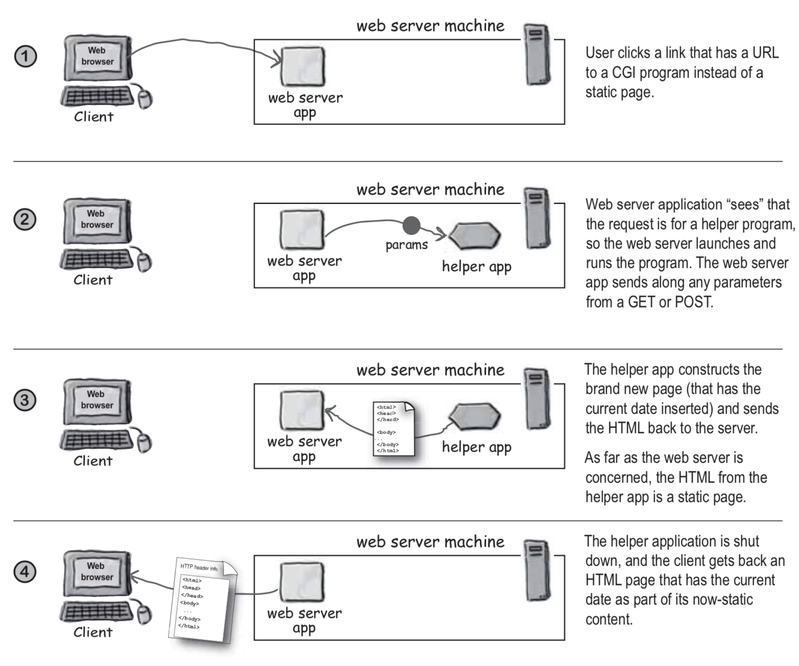<br>출처 : Head First Servlets & JSP</p>

* 사용자가 **정적인 페이지(HTML)가 아닌 CGI프로그램에 대한 URL를 요청**한다.
* 웹 서버는 **해당 요청이 도우미 프로그램를 호출해야된다는 것을 간파**하고, **GET 또는 POST로 넘어온 파라미터를 그대로 도우미 프로그램에게 넘겨준다.**
* CGI프로그램은 **해당 실시간 요청을 처리하고난 후 HTML형식의 페이지를 웹 서버에게 넘겨준다.**
  * **이 시점에서 웹 서버가 도우미 프로그램으로부터 받은 페이지는 정적인 페이지이다.**
* CGI프로그램은 메모리를 반납하고, **클라이언트는 정적인 페이지가 된 HTML페이지를 웹 서버**로부터 받게된다.

<br>

### 3-4. 서블릿과 CGI 모두 도우미 애플리케이션이다.

[3-3. 동적 페이지](#3-3-동적-페이지)에서 말하는 도우미 애플리케이션은 서블릿 또는 CGI프로그램을 뜻한다.

* CGI
  * PHP, JSP 등등.
  * 특징
    * **프로세스 단위로 실행된다. 그러므로 사용자의 요청이 많을 때 서버에 부하가 크게 걸린다**
* 서블릿
  * **서블릿은 Tomcat(컨테이너)이 이해할 수 있는 순수 Java코드로만 이루어진 웹서버용 클래스이다.**
  * 특징
    * 프로세스 단위보다 더 작은 단위로 실행하는 것이 필요했다. 그리고 **웹 서버의 프로세스로서 인터프리터를 상주시키고, CGI로부터 프로그램을 호출해(즉, 스레드 단위) 부하를 줄임으로써 성능을 개선한 서블릿이 나온 것이다.**

<br>

### 3-5. JSP의 등장

<p align="center">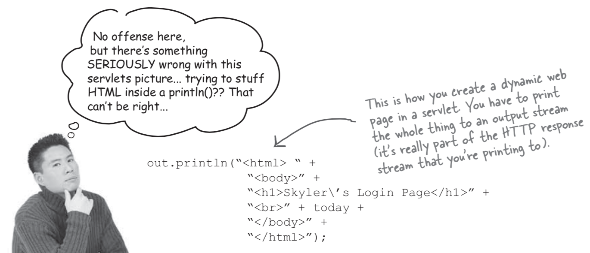<br>출처 : Head First Servlets & JSP</p>

서블릿(Java코드)에서는 `println`을 사용하여 HTML코드를 집어넣는다.

하지만 HTML형태로 출력하기 위해서는 일일이 String으로 태그들을 양식에 맞춰 써야하므로 불편하다.

이를 보완하기 위해 등장한 것이 JSP이다.

<p align="center">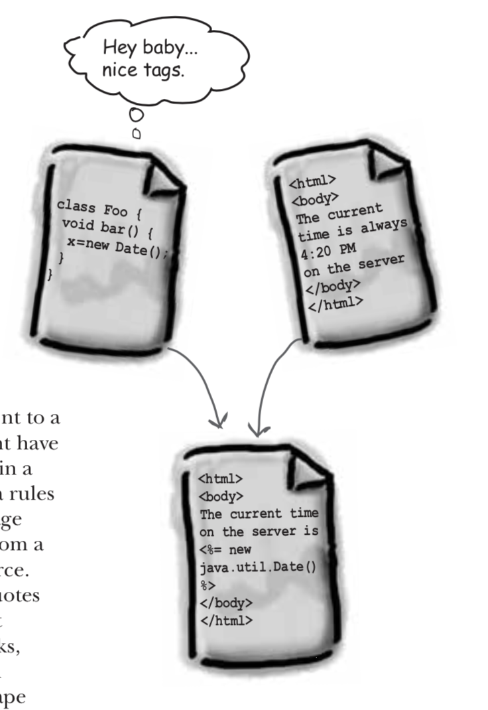<br>출처 : Head First Servlets & JSP</p>

* JSP는 'HTML에 자바를 넣을 순 없을까라는 고민에서 탄생'했다고 한다.
* JSP로 개발하면 자바 개발자는 자바를 쓰면 되고, HTML 개발자는 HTML을 쓰면 된다.
* **JSP는 HTML안에 자바 코드가 포함된 것으로 서버사이드 스크립트를 말한다.**
* JSP는 실행시에는 서블릿으로 변환된 후 실행되므로 서블릿과 거의 유사하다고 볼 수 있다. 하지만, 서블릿과는 달리 HTML표준에 따라 작성되므로 웹페이지 작성이 편리해졌다.

<br>

## 4. 서블릿 예제

아래와 같이 폴더를 만들어준다.

<p align="center">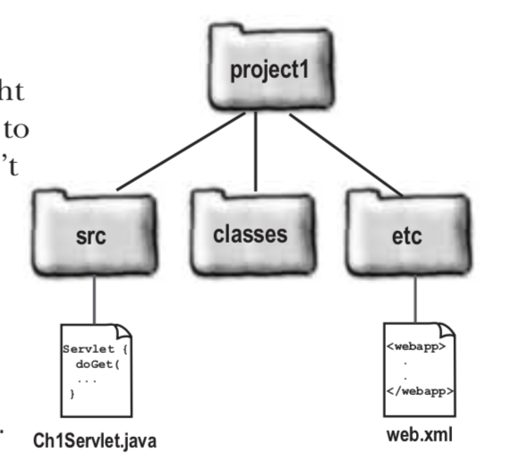<br>출처 : Head First Servlets & JSP</p>

<br>

> 서블릿 class 파일 ( Ch1Servlet.java )

```java
import javax.servlet.*;
import javax.servlet.http.*;
import java.io.*;

public class Ch1Servlet extends HttpServlet {
  public void doGet(HttpServletRequest request, HttpServletResponse response) throws IOException {
    PrintWriter out = response.getWriter();
    out.println("<html>"+
            "<body>"+
            "<h1 align=center>HF\'s Chapter1 Servlet</h1>"+
            "<br>"+today+
            "</body>"+
            "</html>");
  }
}
```

<br>

> web.xml파일
```xml
<web-app xmlns="http://java.sun.com/xml/ns/j2ee"
         xmlns:xsi="http://www.w3.org/2001/XMLSchema-instance"
         xsi:schemaLocation="http://java.sun.com/xml/ns/j2ee/web-app_2_4.xsd"
         version="2.4">
    <servlet>
        <servlet-name>Chapter1 Servlet</servlet-name>
        <servlet-class>Ch1Servlet</servlet-class>
    </servlet>
    
    <servlet-mapping>
        <servlet-name>Chapter1 Servlet</servlet-name>
        <url-pattern>/Serv1</url-pattern>
    </servlet-mapping>
</web-app>
```

<br>

> 자바 컴파일

```
javac -classpath /tomcat위치/tomcat/lib/servlet-api.jar -d classes src/Ch1Servlet.java
```

컴파일 된 `.class`파일과 `web.xml`파일을 아래와 같이 복사한다.

<p align="center">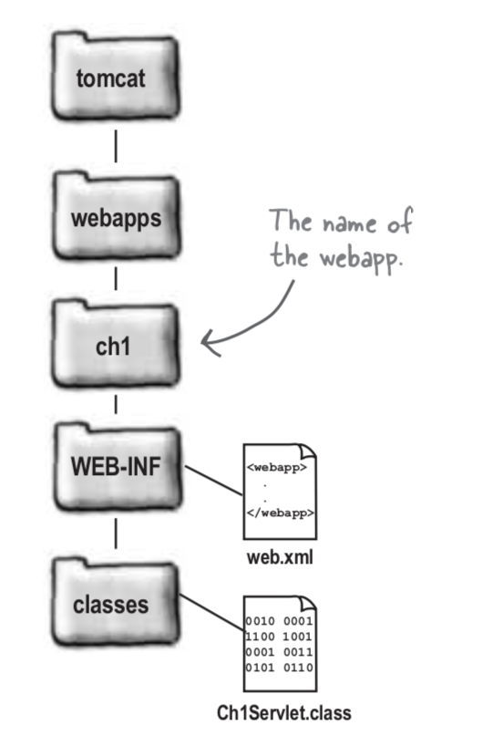<br>출처 : Head First Servlets & JSP</p>

<br>

> 톰캣 실행

`bin/startup.sh` 를 통해 톰캣을 실행시켜준다.

<br>

> 결과

`http://localhost:8080/ch1/Serv1`

<p align="center">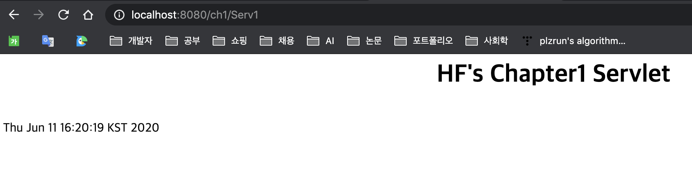</p>


