[Head First Servlets & JSP](http://www.yes24.com/Product/Goods/3301415?OzSrank=1)를 기초하여 작성한 자료입니다.

 

## 목차

- [웹 애플리케이션 아키텍처](#웹-애플리케이션-아키텍처)
  - [1. 컨테이너](#1-컨테이너)
    - [1-1. 컨테이너의 개념과 역할](#1-1-컨테이너의-개념과-역할)
    - [1-2. 만약 컨테이너가 없다면](#1-2-만약-컨테이너가-없다면)
    - [1-3. 컨테이너가 주는 혜택](#1-3-컨테이너가-주는-혜택)
      - [1-3-1. 통신(커뮤티케이션) 지원](#1-3-1-통신커뮤티케이션-지원)
      - [1-3-2. 생명주기(라이플사이클) 관리](#1-3-2-생명주기라이플사이클-관리)
      - [1-3-3. 멀티스레딩 지원](#1-3-3-멀티스레딩-지원)
      - [1-3-4. 선언적인 보안 관리](#1-3-4-선언적인-보안-관리)
      - [1-3-5. JSP 지원](#1-3-5-jsp-지원)
    - [1-4. 컨테이너는 요청을 어떻게 다룰까요?](#1-4-컨테이너는-요청을-어떻게-다룰까요)
  - [2. 서블릿](#2-서블릿)
  - [3. DD ( Deployment Descriptor ) 배포 서술자](#3-dd--deployment-descriptor--배포-서술자)
    - [3-1. 컨테이너는 어떻게 URL로 서블릿을 찾아낼까?](#3-1-컨테이너는-어떻게-url로-서블릿을-찾아낼까)
    - [3-2. 하나의 서블릿이 세 개의 이름을 가질 수 있다.](#3-2-하나의-서블릿이-세-개의-이름을-가질-수-있다)
    - [3-3. 배포 서술자에서 URL을 서블릿에 매핑하기](#3-3-배포-서술자에서-url을-서블릿에-매핑하기)
    - [3-4. DD는 왜 사용하고, 매핑을 왜 해야 되는가?](#3-4-dd는-왜-사용하고-매핑을-왜-해야-되는가)
      - [3-4-1. 서블릿 이름을 다른 이름으로 매핑하면, 애플리케이션의 유연성, 보안성이 좋아진다.](#3-4-1-서블릿-이름을-다른-이름으로-매핑하면-애플리케이션의-유연성-보안성이-좋아진다)
      - [3-4-2. DD가 하는 일](#3-4-2-dd가-하는-일)
  - [4. MVC패턴](#4-mvc패턴)
    - [4-1. MVC패턴이 필요하게 된 이유](#4-1-mvc패턴이-필요하게-된-이유)
      - [4-1-1. 서블릿과 페이지를 하나씩 만든다.](#4-1-1-서블릿과-페이지를-하나씩-만든다)
      - [4-1-2. JSP 도입](#4-1-2-jsp-도입)
      - [4-1-3. MVC 패턴 적용 ( 중요 )](#4-1-3-mvc-패턴-적용--중요-)
    - [4-2. MVC 패턴 ( 중요 )](#4-2-mvc-패턴--중요-)
  - [5. J2EE](#5-j2ee)

 

# 웹 애플리케이션 아키텍처

이번장은 서블릿에 대해서 더 깊게 알아본다.

 

## 1. 컨테이너

 

### 1-1. 컨테이너의 개념과 역할

**서블릿에는 main()메서드가 없다.** 왜냐하면 **서블릿은 컨테이너라 부르는 자바 애플리케이션의 지배를 받기 때문이다.**

> 대표적인 컨테이너가 톰캣(Tomcat)이다.

아파치와 같은 웹 서버가 **사용자로부터 서블릿에 대한 요청을 받으면**, **서블릿을 바로 호출하는 것이 아니라, 서블릿을 관리하고 있는 컨테이너에게 이 요청을 넘긴다.**

> 여기서 말하는 컨테이너란 서블릿이 배포(deploy)된 컨테이너를 말한다.

요청을 넘겨받은 **컨테이너는 HTTP Request와 HTTP Response 객체를 만들어**, 이를 **인자로 서블릿 doPost()나 doGet()메서드 중 하나를 호출**한다.

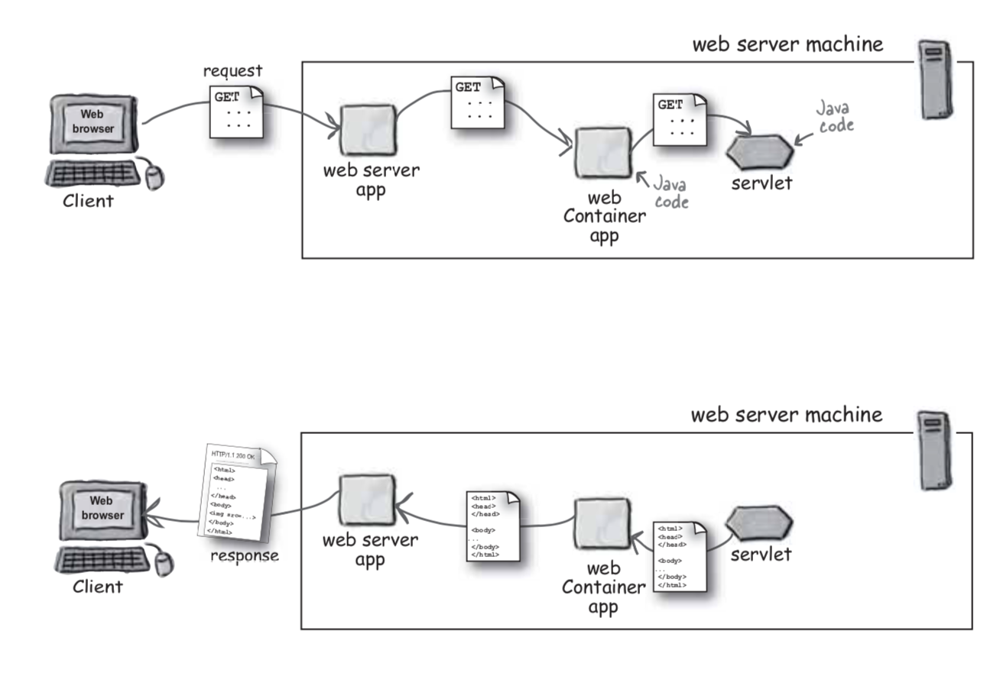 출처 : Head First Servlets & JSP

 

### 1-2. 만약 컨테이너가 없다면

만약 컨테이너가 없다면, 아파치 같은 웹 서버에서 사용자 요청을 동적으로 처리하기 위한 자바 프로그램을 개발하고 싶다면 직접 컨테이너와 같은 역할을 하는 프로그램을 만들어야 한다.

또한 컨테이너가 없다면, 자바에서 지원하는 Spring 프레임워크나 J2SE라이브러리를 이용하여 직접 개발해야한다.

즉, 서버에서 돌아가는 웹 애플리케이션을 만드는 것인데, 이 애플리케이션은 서블릿이 아닌 일반 자바 코드로 만드는 것이다.

> 한마디로, 컨테이너가 없다면 매우매우 귀찮아진다..

 

### 1-3. 컨테이너가 주는 혜택

앞서 말했듯, **컨테이너가 없다면 개발자가 직접 동적인 처리하기 위한 자바 프로그램을 개발해줘야 한다.**

이것을 쉽게 하기 위해서 컨테이너가 개발되었다. 세부적인 혜택은 아래와 같다.

 

#### 1-3-1. 통신(커뮤티케이션) 지원

**컨테이너는 서블릿과 웹 서버가 서로 통신할 수 있는 손쉬운 방법을 제공한다.**

즉, 서버와 대화하기 위하여 개발자가 직접 ServerSocket을 만들고, 특정 포트에 리스닝하고, 연결요청이 들어오면 스트림을 생성하는 등 이런 복잡한 일련의 일을 할 필요가 없다.

**컨테이너는 어떻게 웹 서버와 통신해야 하는지 잘 알고 있으며, 이런 통신 기능을 API로 제공한다.**

따라서, **웹 서버(아파치)와 서블릿이 서로 통신하기 위한 통로인 통신 API에 대해 개발자가 고민할 필요가 없다.** 

**개발자가 신경 쓸 부분**은 바로 서블릿에 구현해야 할 **비즈니스 로직**뿐이다.

> 웹 서버의 동적인 요청을 서블릿(자바)이 처리할 수 있게, 통신 API를 지원해준다 생각하면 될 것 같다.
>
> 또한, 웹 서버의 요청을 HtttpRequest, HttpResponse등 객체를 만들어, 서블릿에게 넘겨준다.

 

#### 1-3-2. 생명주기(라이플사이클) 관리

**컨테이너는 서블릿의 탄생과 죽음을 관리합니다.** 

개발자 관점에서 보자면, **서블릿 클래스를 로딩하여 인스턴스화하고, 초기화 메서드를 호출하고, 요청이 들어오면 적절한 서블릿 메서드를 호출하는 작업을 컨테이너가 한다는 것이다.**

**서블릿이 생명을 다한 순간에는 적절하게 가비지 컬렉션(Garbage Collection)을 진행**할 겁니다.

 

#### 1-3-3. 멀티스레딩 지원

**컨테이너는 요청이 들어올 때마다 새로운 자바스레드를 하나 만듭니다.** 

클라이언트의 요청에 따라 적절합 HTTP서비스 메서드를 실행하면 그걸로 스레딩 작업은 끝이 난다.

**스레드 안정성에 대하여 개발자가 뭔가하지 않아도 되서 매우 편리하다.**

 

#### 1-3-4. 선언적인 보안 관리

컨테이너를 사용하면, 보안에 관련된 내용을 서블릿 또는 **자바 클래스 코드 안에 하드코딩(필요한 데이터나 값, 코드 등을 직접 타이팽해서 집어넣는 일)할 필요가 없다.**

**컨테이너가 있는 환경이라면 보안관리는 XML배포 서술자에다가 기록하면 된다.**

 

#### 1-3-5. JSP 지원

누가 JSP 코드를 실제 자바 코드로 변환할까?? 컨테이너??

 

### 1-4. 컨테이너는 요청을 어떻게 다룰까요?

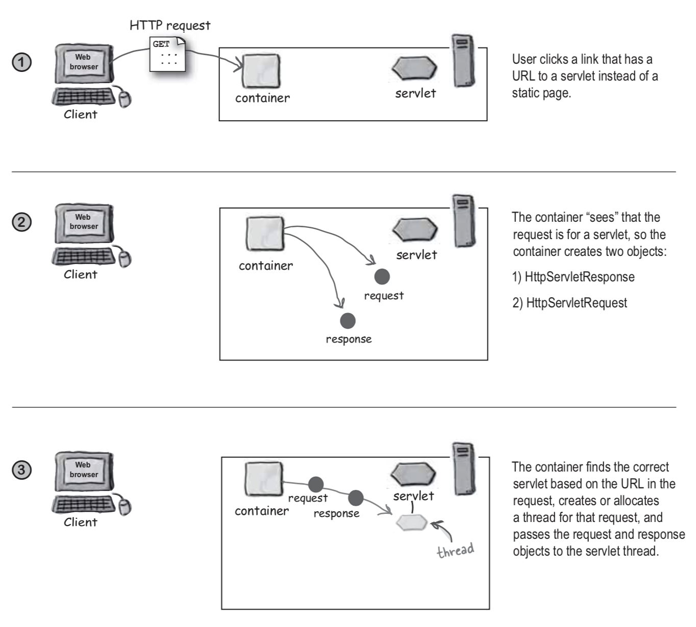 출처 : Head First Servlets & JSP

1. 사용자가 서블릿에 대한 링크를 클릭합니다.
2. **컨테이너는 들어온 요청이 서블릿**이라는 것을 **간파**하곤 다음 **두 객체를 생성**합니다.
   * HttpServletResponse
   * HttpServletRequest

3. 사용자가 날린 **URL을 분석하여 어떤 서블릿에 대한 요청**인지 알아냅니다. 그 다음, 해당 **서블릿 스레드를 생성하여 Request/Response 객체를 인자로 넘긴다.**
   * 이때 사용하는 것이 DD(web.xml)이다.

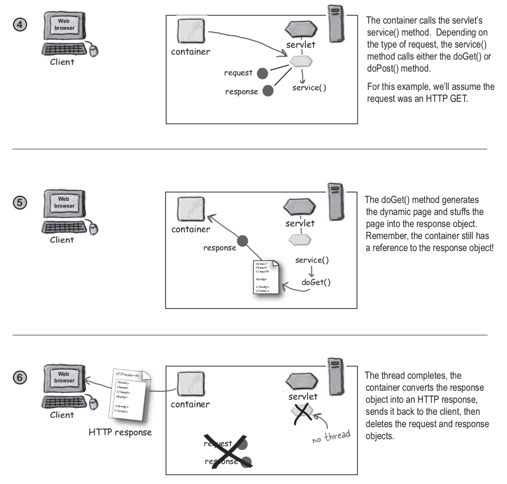 출처 : Head First Servlets & JSP

1. **컨테이너는 서블릿 service()메서드를 호출**합니다. **요청에 지정한 방식에 따라 doGet()혹은 doPost()를 호출할지 결정**합니다.
2. doGet()메서드를 사용한다고 가정하면, **동적인 페이지를 생성한 다음, 이를 Reponse객체에 실어 보냅니다**. 보내고 난 후에도 컨테이너는 Response객체에 대한 참조(Reference)를 가지고 있다.
3. **스레드 작업이 끝나면, 컨테이너는 Response객체를 HTTP Response로 전환하여 클라이언트로 내려 보낸다**. 이제 마지막으로 Request와 Response 객체를 소멸시킨다.

 

## 2. 서블릿

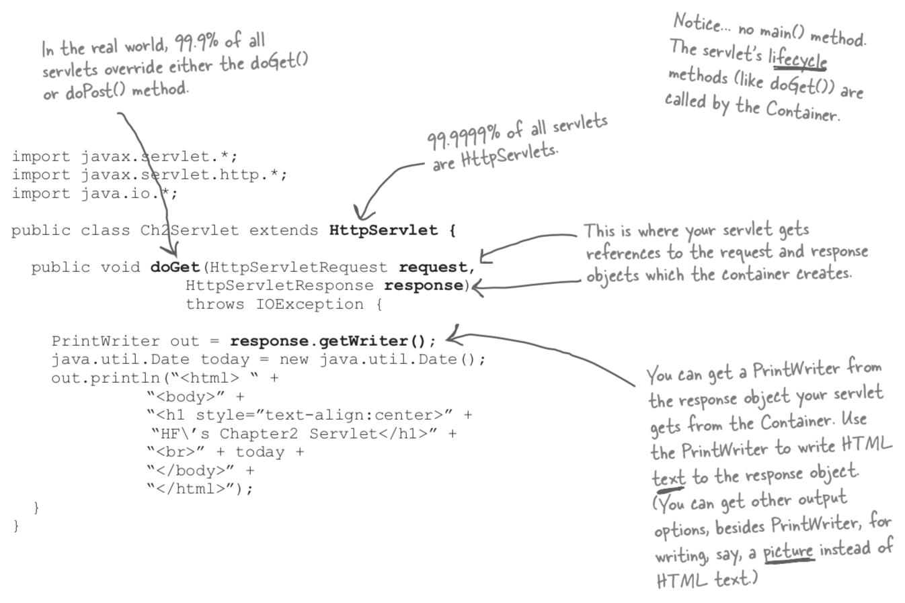 출처 : Head First Servlets & JSP

* 서블릿은 `HttpServlet`을 상속받는다. 이와 관련된 자세한 내용은 뒤에서 다룰 예정이다.
* 서블릿에는 main()메서드가 없다. 컨테니어가 서블릿의 생명주기 관련 메서드(doGet()과 같은)를 호출한다.
* doGet의 매개변수로 넘어오는 request와 response가 바로 컨테이너가 생성한 객체들을 넘겨받는 것이다.

 

## 3. DD ( Deployment Descriptor ) 배포 서술자

컨테이너가 어떻게 서블릿을 찾는지 궁금했다. **그 해답은 DD에 있다.**

 

### 3-1. 컨테이너는 어떻게 URL로 서블릿을 찾아낼까?

클라이언트가 날린 요청에 들어 있는 URL을 가지고 어떤 서블릿인지 찾아낸다. 

요청을 어떻게 서블릿에 매핑하느냐 하는 것은, 개발자가 이를 어떻게 설정하느냐에 따라 달리진다.

> 매핑(mapping) : 컴퓨터 분야에서 매핑(사상映射)란 가상주소와 물리주소의 대응 관계 또는 가상 주소로부터 물리 주소를 찾아내는 일을 말한다.

사용자가 브라우저를 통해 URL요청을 하면, 이 요청은 서버에 있는 서블릿으로 전달이 되어야 한다. 아래와 같은 방법이 있다.

* HTML 코드 안에 직접 하드 코딩
  * 장점 : 한 번에 접근
  * 단점 : 유지 보수
* 컨테이너 벤더가 제공해주는 매핑 툴을 사용한다.
  * 장점 : 해당 컨테이너를 사용하면 성능 up
  * 단점 : 해당 컨테이너에 "종속적"
* 매핑 정보를 기록한 프로퍼티(property)파일을 사용한다.
  * 장점 : 유지 보수, 독립적

 

### 3-2. 하나의 서블릿이 세 개의 이름을 가질 수 있다.

서블릿에는 `classes/registration/SighUpServlet.class`처럼 파일 위치를 알려주는 이름인 파일 위치명이 함께 들어있다.

* 클래스명 : 실제 파일명.
* 배포명 : 내부적으로만 사용되는 이름. 클래스 이름이나 파일 이름과 같을 필요가 없다.
* 공공 이름 : 누구나 아는 URL이름. HTML안에 코딩되는 이름. 사용자가 클릭하여 호출할 때 사용된다.

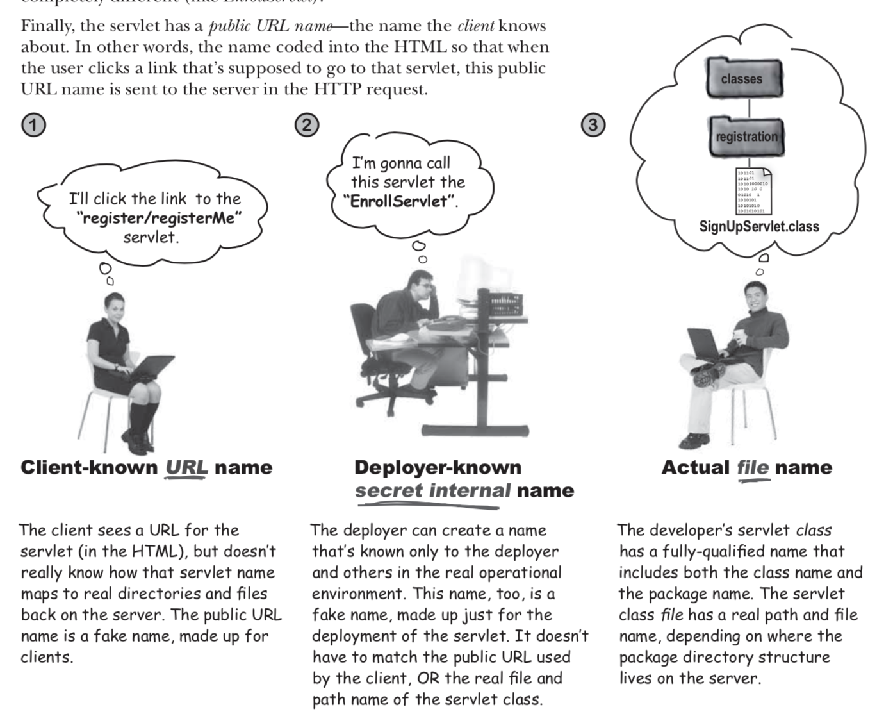 출처 : Head First Servlets & JSP

* URL 이름 : 클라이언트는 HTML안에 존재하는 서블릿 이름만 알고 있으면 된다. 서버 상의 실제 어느 디렉토리에 어떤 파일명으로 존재하는지는 관심 없다. 이렇게 공개적으로 된 공공이름을 URL 이름이라 한다.
* 내부적인 이름 : 배포자는 실제 애플리케이션 운영을 위하여 배포명이란 것을 만들어 이를 개발자에게 알려준다. 이 이름은 URL 이름과 같을 필요가 없으며, 실제 서블릿 파일 위치 이름과 일치하지 않아도 된다.
* 실제 파일명 : 개발자가 만든 서블릿 클래스 안에는 클래스명과 패키지명이 들어 있다. 마찬가지로 서블릿 클래스 파일도 파일 시스템 상의 경로와 파일명이 다 있다.

 

### 3-3. 배포 서술자에서 URL을 서블릿에 매핑하기

웹 컨테이너도 서블릿을 배포하려면, 배포 서술자(DD)라는 XML파일을 먼저 만들어야 한다. DD파일에는 서블릿과 JSP를 어떻게 실행하느냐에 관한 많은 정보들이 들어 있다. 

매핑을 하려면 두 가지 작업을 해야 하는데, 먼저 URL이름을 내부에서만 사용하는 이름으로 매핑하고, 그 다음 내부 이름을 실제 클래스 이름으로 매핑하면 된다.

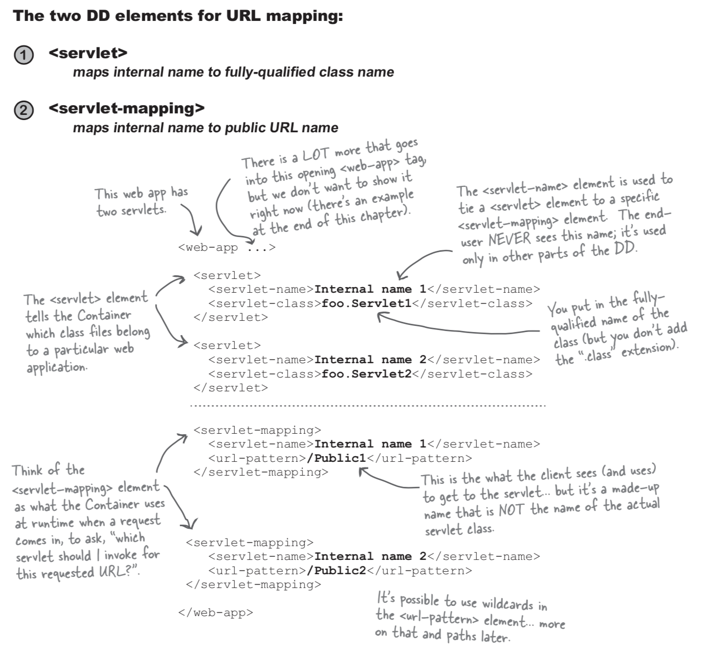 출처 : Head First Servlets & JSP

1. `<Servlet>`
   * 내부에서만 사용하는 이름과 완전한(패키지 이름까지 포함하여)클래스명과 서로 매핑한다.
   * `<servlet-name> : <servlet-mapping>`에서 사용할 내부 이름을 정의 하는 곳. 말 그대로 DD안에서 사용하느 이름을 정의하는 곳이다.
   * `<servlet-class>` : 완전한 서블릿명을 기입해야한다. 패키지명까지 포함하여 작성한다.
2. `<Servlet-mapping>`
   * 내부에서 사용하는 이름과 URL이름을 서로 매핑한다.
   * **런타임 시 요청이 들어오면, 컨테이너는 `<Servlet-mapping>`항목들을 검색한다.** 이런 URL을 요청 받았는데 어느 서블릿이 담당하는지 검색하는 것이다.
   * `<url-pattern>` : 클라이언트가 사용하는 서블릿 이름.

 

### 3-4. DD는 왜 사용하고, 매핑을 왜 해야 되는가?

**DD는 왜 사용하고, 매핑을 또 왜 하는것일까??**

 

#### 3-4-1. 서블릿 이름을 다른 이름으로 매핑하면, 애플리케이션의 유연성, 보안성이 좋아진다.

만약 DD를 사용하지 않는다면, HTML이나 JSP파일에 하드코딩을 해야한다. 이렇게 할 경우 아래와 같은 문제 발생한다.

* **디렉토리 구조를 바꿔야하는 경우, 파일들을 일일이 하나하나 하드코딩하여 수정해줘야 한다.**
* **서버 디렉토리 구조, 파일이름, 설정값 등을 클라이언트에게 모두 드러내야한다.**

위와 같이, DD를 이용하지 않으면 유지보수와 보안 방면에서 매우 안좋다.

매핑을 사용하면 위와 같은 문제를 해결한다. 매핑은 실제 파일명을 하드코딩하는 것이 아니기 때문에 이런 문제가 발생하지 않는다.

 

#### 3-4-2. DD가 하는 일

* 보안 설정 - DB관련 비밀번호 등
* 오류 페이지 설정
* 항목 라이브러리
* 초기화 구성 및 관련 정보 설정
* EJB선언 및 접근에 관한 내용

이렇게 배포 서술자(DD)를 사용하면 작성한 소스코드에 손끝 하나 대지 않고도 웹 애플리케이션을 수정할 수 있는 '선언적인'메커니즘을 제공한다.

 

## 4. MVC패턴

 

### 4-1. MVC패턴이 필요하게 된 이유

밥은 결혼 정보 사이트를 만들고자 한다. 처음엔 다음과 같이 설계한다.

 

#### 4-1-1. 서블릿과 페이지를 하나씩 만든다.

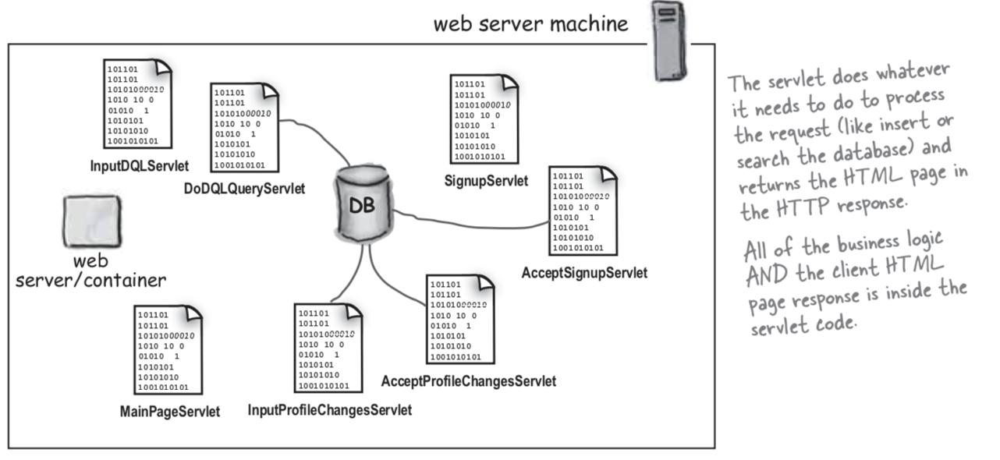 출처 : Head First Servlets & JSP

서블릿을 기능적으로 나누어 만든 것이다. 

**조회 페이지, 가입 페이지, 조회 결과를 보여주는 페이지와 같이 역할별로 서블릿을 여러 개 만들었다.**

이렇게 하면 서블릿은 자신만의 비즈니스 로직을 가지게 된다. **어떤 페이지는 데이터 베이스로부터 정보를 읽어오고, 어떤 페이지는 이 정보를 수정하고한다.**

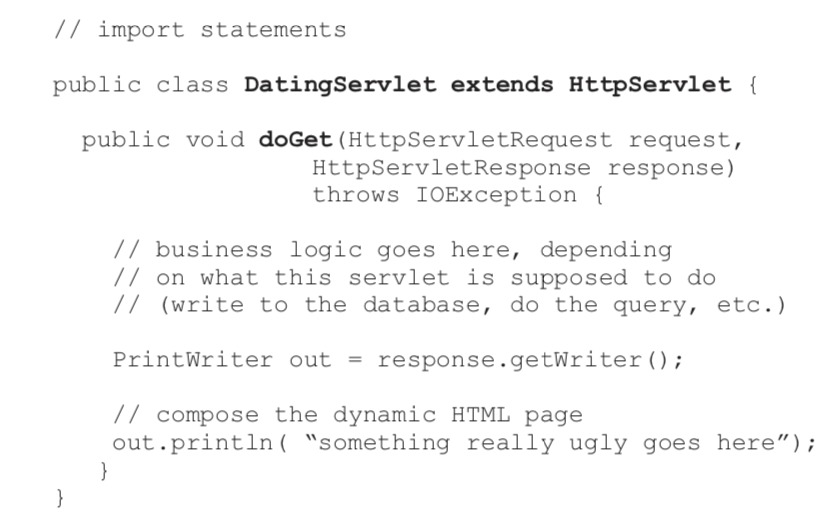 출처 : Head First Servlets & JSP

**서블릿이 데이터베이스에 데이터를 입력하는 작업을 하든, 조회하는 작업을 하든 관계없이, 모두 다 HTTP Response에다가 HTML페이지를 웹서버에 반환한다.** 

> 위 방식에서 포인트는 비즈니스 로직과 HTML페이지가 모두 다 서블릿 안에 들어 있는 것이다.

이렇게 하면 **HTML코드가 복잡해진다.** 그러므로 **JSP를 도입하게 된다.**

 

#### 4-1-2. JSP 도입

앞서 `println() `으로 모두 처리하게 되면 코드가 복잡해진다. 

이때 JSP를 도입하면 코드가 간결해지고, 유지보수가 편해진다.

**자신의 비즈니스 로직처리만 끝나면, 요청에 대한 제어를 JSP에게 넘기도록(forward)구조로 바꾼다.**

HTML을 클라이언트에게 넘기는 일을 이제 JSP가 하게 된다.

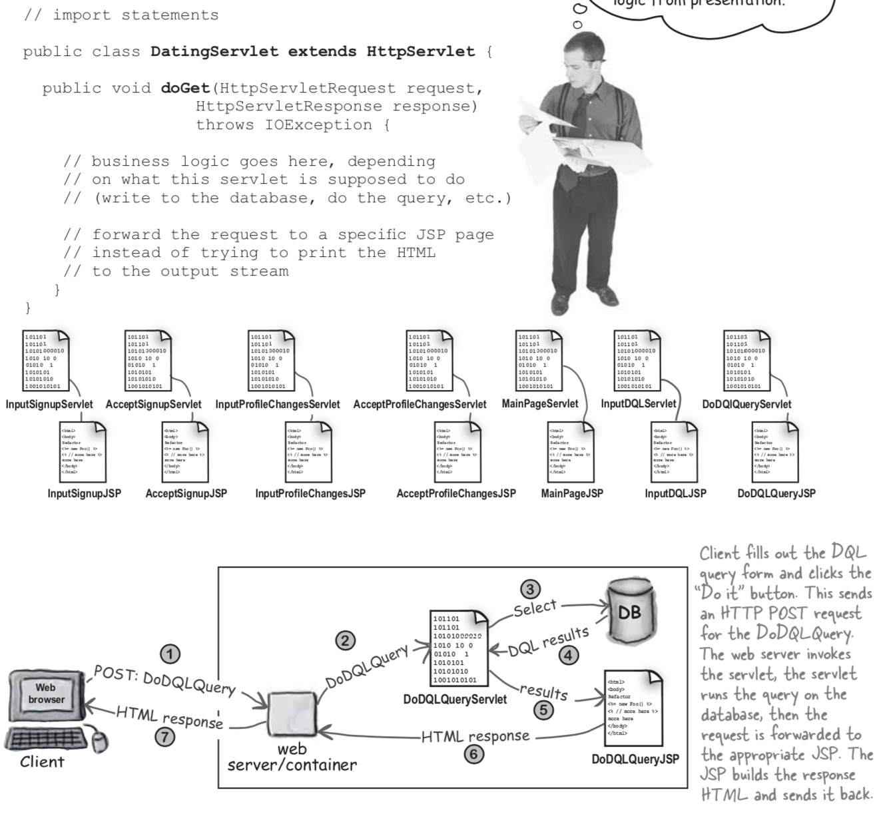 출처 : Head First Servlets & JSP

**출력 스트림으로 println()을 사용하여 HTML을 작성하지 않고, JSP로 포워딩하는 코드를 작성한다.**

> JSP를 도입한 후, 비즈니스 로직은 서블릿으로 빼냈고, HTML관련된 것은 전부 JSP로 전환됐다.
>
> 즉, 비즈니스 로직과 뷰 로직이 분리된 것이다.

 

#### 4-1-3. MVC 패턴 적용 ( 중요 )

**서블릿 분리와 JSP 도입의 문제점은 웹 이외의 클라이언트에게는 서비스를 제공하지 못한다는 것이다.**

즉, 하나의 서버로 IOS, 안드로이드, 웹 모두 사용하지 못한다. **이것을 웹에 의존적이라 한다.**

**MVC 패턴을 사용하면, 단순히 비즈니스 로직과 뷰 로직을 분리하는 것 뿐만 아니라, 비즈니스 로직이 뷰 로직과 별개로 존재할 수 있다는 것을 의미한다.**

> MVC의 핵심은 비즈니스 로직과 뷰 로직을 분리하는 것이다.

**이 말은 비즈니스 로직이 재사용 가능한 자바 클래스로 독립적으로 존재 가능하는 말이며, 따라서 뷰가 어떤 것이 되어도 관계 없다는 것을 의미한다.**

> **이제 중요한 점은 비즈니스 로직을 분리하고, 또한 이 비즈니스 로직이 재사용가능하며, 독립적으로도 실행이 가능해야 한다.**

이제 MVC모델에 따라 서블릿에서 비즈니스 로직을 분리해야 한다. 그 다음 모델은 재사용 가능한 일반적인 자바 클래스로 작성해야 한다.

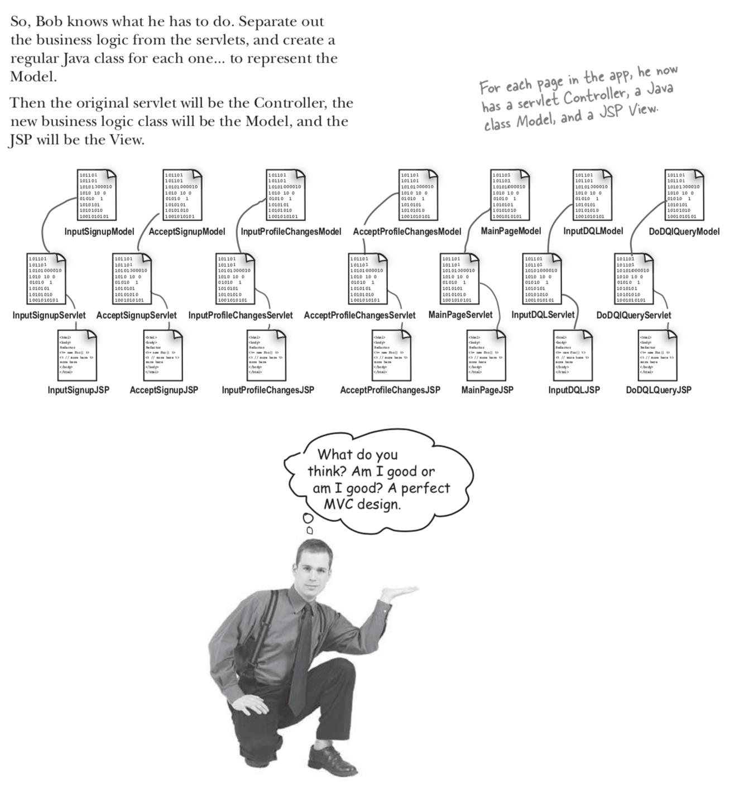 출처 : Head First Servlets & JSP

이처럼 **서블릿에서 비즈니스 로직을 뽑아내어, 일반적인 자바 클래스로 모델을 하나 만드는 것으로 MVC패턴을 완성할 수 있다.**

하지만, **위 그림에서 보면 7개의 서블릿이 서로 중복된 로직을 수행한다. 이를 변경하는 방법은 뒤에서 자세히 다룰 예정이다.**

 

### 4-2. MVC 패턴 ( 중요 )

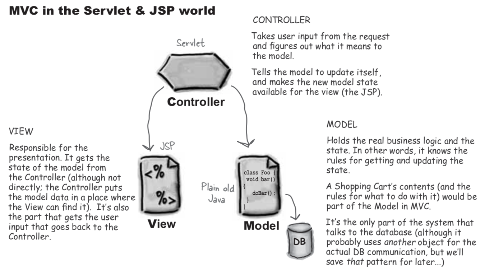 출처 : Head First Servlets & JSP

* Model : 비즈니스 데이터(데이터), 비즈니스 메서드(데이터를 조작 및 추출하는 함수).
  * 모델 정보(state)를 읽어오거나(getter) 수정(setter)하는 로직도 포함된다.
  * MVC 패턴에서 모델은 데이터베이스와 통신하는 유일한 곳이다.
  * 순수 자바 코드를 사용한다. (DB에 접근)
* Controller : Request객체에서 사용자가 입력한 정보를 뽑아내어, 모델에 대하여 어떤 작업을 해야하는지 알아낸다.
  * 모델 정보를 수정한다든지, 뷰(JSP)에게 넘겨줄 새로운 모델을 만든다든지 등과 같은 작업을 한다.
* View : 프리젠테이션에 대한 역할.
  * 컨트롤러로부터 모델 정보를 읽어온다.
  * 보통 뷰가 찾을 수 있는 곳에 컨트롤러가 갖다 두는 방식을 많이 사용한다.
  * 뷰는 사용자가 입력한 정보를 컨트롤러에게 넘겨주는 역할도 하게 된다.

 

## 5. J2EE

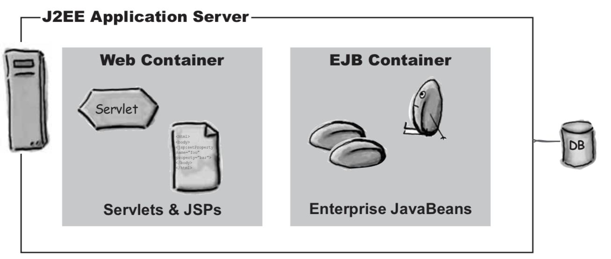 출처 : Head First Servlets & JSP

* J2EE란, 자바 기술로 기업환경의 어플리케이션을 만드는데 필요한 스펙들을 모아둔 스펙 집합이라 생각하면 된다.
* J2EE 애플리케이션 서버는 웹 컨테이너와 EJB컨테이너로 구성되어 있다.

