[Head First Servlets & JSP](http://www.yes24.com/Product/Goods/3301415?OzSrank=1)를 기초하여 작성한 자료입니다.


## 목차

- [3. 간단 미니 MVC 튜토리얼](#3-------mvc-----)
  * [1. 전체적인 그림](#1--------)
    + [1-1. 웹 애플리케이션 빌드](#1-1------------)
    + [1-2. 웹 애플리케이션 아키텍처](#1-2--------------)
    + [1-3. 개발 환경 ( development environment )](#1-3---------development-environment--)
    + [1-4. 배포 환경 ( deployment environment )](#1-4---------deployment-environment--)
  * [2. 구현](#2---)
    + [2-1. HTML](#2-1-html)
    + [2-2. HTML만 배포하기](#2-2-html------)
    + [2-3. 논리적인 이름을 서블릿 클래스 파일에 매핑하기](#2-3--------------------------)
    + [2-4. 서블릿 버전 1 ( 연결 확인 )](#2-4--------1----------)
    + [2-5. 서블릿 버전 2 ( 모델 클래스 )](#2-5--------2-----------)
      - [2-5-1. 모델클래스](#2-5-1------)
      - [2-5-2. 서블릿 코드 변경](#2-5-2----------)
      - [2-5-3. 서블릿 버전 2의 동작 원리](#2-5-3--------2-------)
    + [2-6. 서블릿 버전 3 ( JSP 도입 )](#2-6--------3---jsp-----)
      - [2-6-1. JSP 코드](#2-6-1-jsp---)
      - [2-6-2. 서블릿 코드 변경](#2-6-2----------)


# 3. 간단 미니 MVC 튜토리얼

전체적인 JSP & Servlet을 사용한 MVC구조의 웹을 구현하기 위해 간단한 웹을 만들고자 한다.

이번 챕터에서 아래 내용을 구현한다.

* HTML
* 서블릿 컨트롤러
* 모델 (일반적인 자바 클래스)
* XML배포 서술자(DD)
* JSP뷰


## 1. 전체적인 그림

JSP & Servlet을 사용한 웹 애플리케이션에 대한 전체적인 그림을 그려보고자 한다.

### 1-1. 웹 애플리케이션 빌드

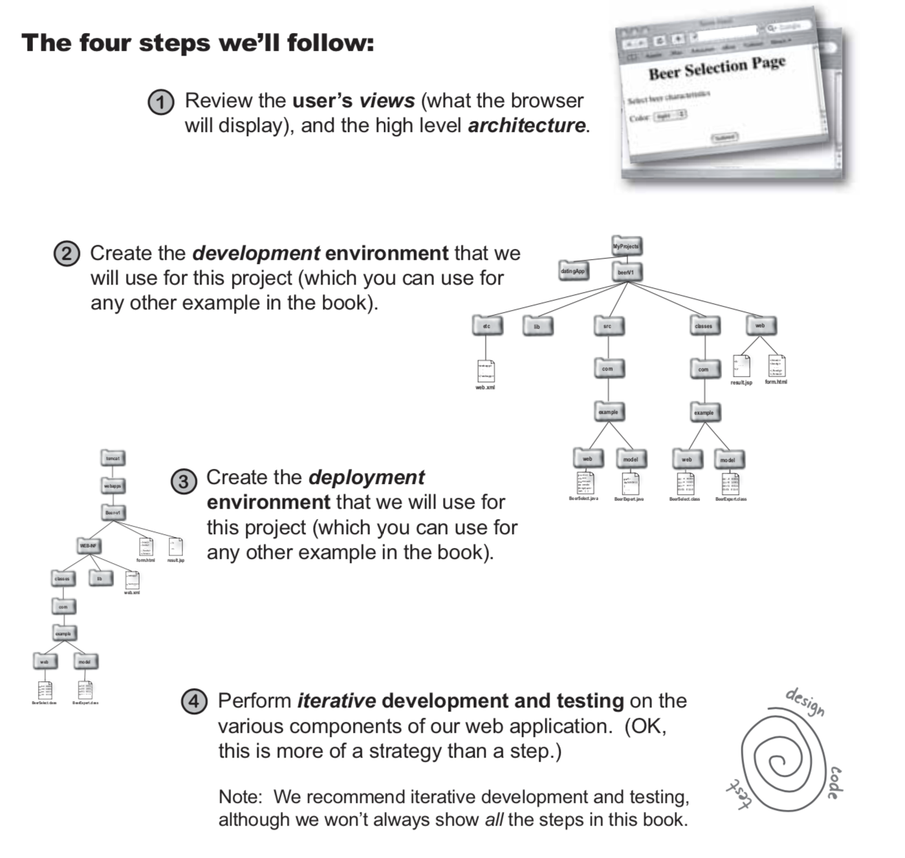

실제 웹 애플리케이션을 빌드하는데 필요한 절차는 아래와 같다.

* 사용자 화면 : 브라우저가 화면에 어떤 내용을 보여줄 것인가?
* 개발 환경 : 개발자가 개발을 하는 환경
* 배포 환경 : 톰캣같은 컨테이너에 배포하는 환경. ( .class파일 혹은 dd파일 등등)
* 반복적인 개발과 테스트 : TDD를 이용한 개발 ( 책엔 자세히 나오진 않는다. 따로 공부해야하는 분야이기도 하다. )


### 1-2. 웹 애플리케이션 아키텍처

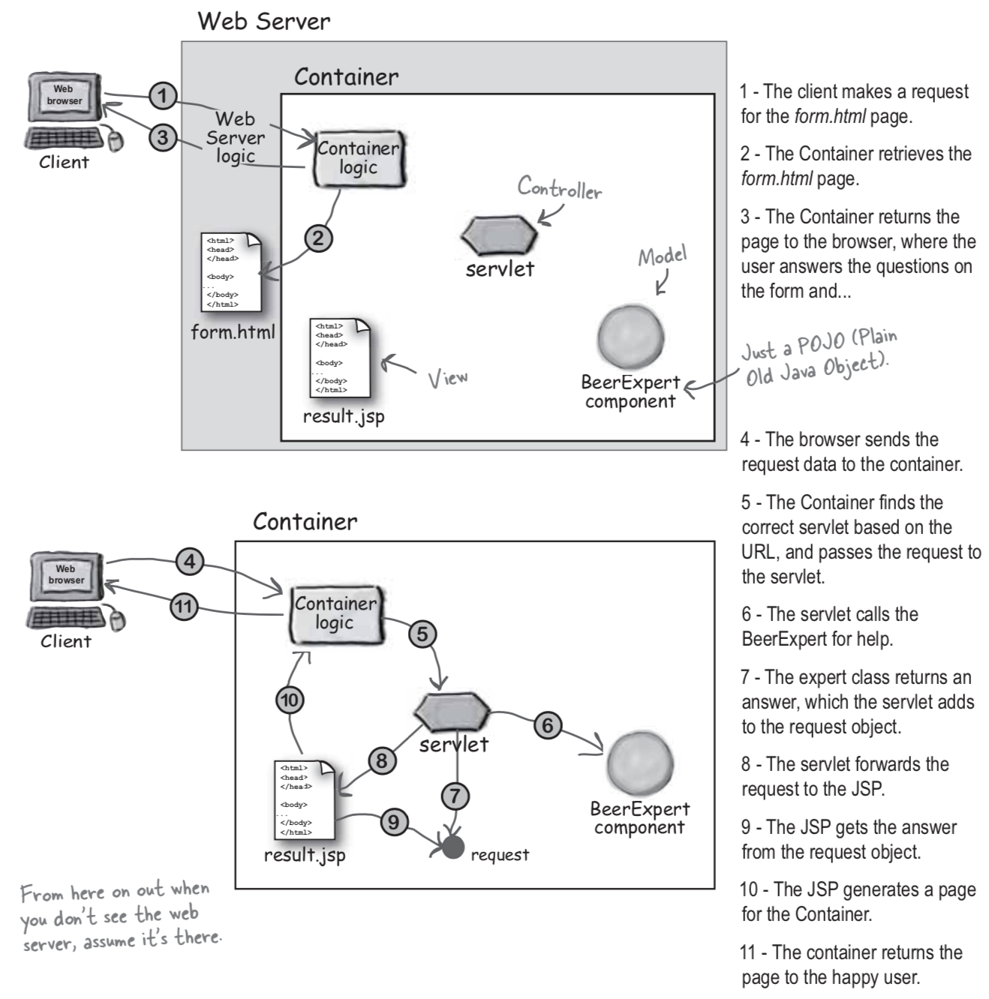

1. 클라이언트가 form.html을 요청한다.
2. 요청을 받은 컨테이너가 form.html을 파일시스템에서 읽어온다.
3. form.html을 브라우저로 넘겨준다. 화면을 보고 사용자가 맥주 색깔과 관련된 질문에 자신의 취향을 입력한다. ( 예제이다. )
4. 사용자가 선택한 정보를 컨테이너로 보낸다.
5. **컨테이너는 URL을 분석하여 담당 서블릿을 찾아 요청을 넘긴다.**
6. 서블릿은 BeerExpert클래스를 호출한다.
7. BeerExpert 클래스는 맥주에 대한 조언을 서블릿으로 넘겨준다. 서블릿은 이 정보를 Request객체에 저장한다.
8. JSP에 Request객체를 포워딩(Forward)한다.
9. JSP는 서블릿이 넣어 놓은 정보를 Request객체에서 추출한다.
10. JSP는 여기에 바탕하여 HTML 페이지를 작성한다.
11. 컨테이너는 이 페이지를 사용자에게 넘겨준다.


### 1-3. 개발 환경 ( development environment )

개발환경은 말 그대로 개발을 할때 사용하는 환경을 의미한다.

즉, **개발을 할 때 사용하는 디렉토리 구조를 의미한다.** 

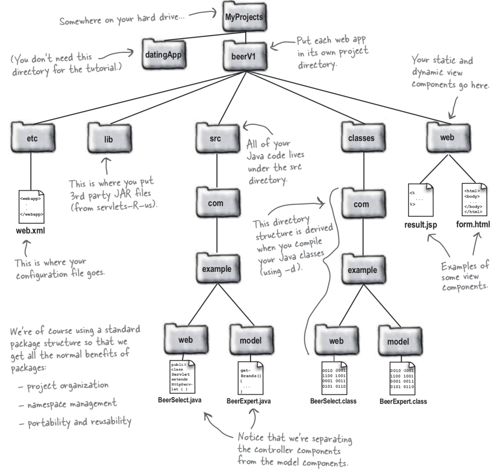


### 1-4. 배포 환경 ( deployment environment )

개발환경에서는 .java파일을 가지고 개발을 한다. 그리고 컨테이너가 서블릿을 실행할 수 있도록 컴파일 된 .class파일은 컨테이너에 실어야 비로소 웹 애플리케이션을 사용할 수 있게 된다.

**배포 환경이 바로 컨테이너에 배포하는 디렉토리 구조를 의미한다.**

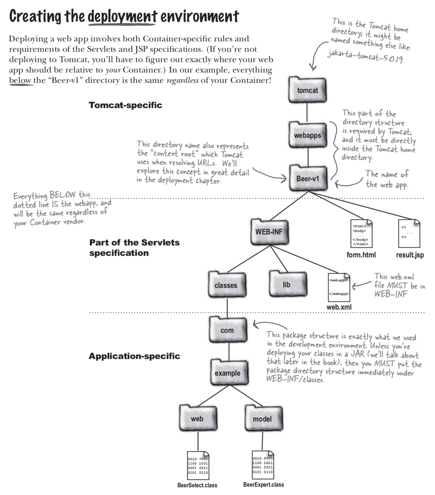


## 2. 구현


### 2-1. HTML

```html
<html>
    <body>
        <h1 align="center">Beer Selection Page</h1>
        <form method="post" action="SelectBeer.do">
            Select beer characteristics
            Color :
            <select name="color" size="1">
                <option value="light"> light </option>
                <option value="amber"> amber </option>
                <option value="brown"> brown </option>
                <option value="dark"> dark </option>
            </select>
            <br><br>
            <center>
                <input type="SUBMIT">
            </center>
        </form>
    </body>
</html>
```

> .do 확장자란?
>
> * SelectBeer.do는 실제 파일명이 아닌 논리적인 이름이다.
>   * HTML에서 사용할 가상의 이름이며, 이는 클라이언트가 실제 서블릿 파일에 직접 접근하는 것을 방지하기 위해 했다고 생각해도 좋을 것 같다.
> * 이것이 작동하는 비밀은 XML 배포 서술자(web.xml)이며, 클라이언트가 요청한 SelectBeer.do가 컨테니어가 사용하는 실제 서블릿 클래스 파일에 매핑되어 있다.
> * do확장자는 논리적인 이름의 일부며, 실제 파일의 확장자나 타입이 아니다.


### 2-2. HTML만 배포하기

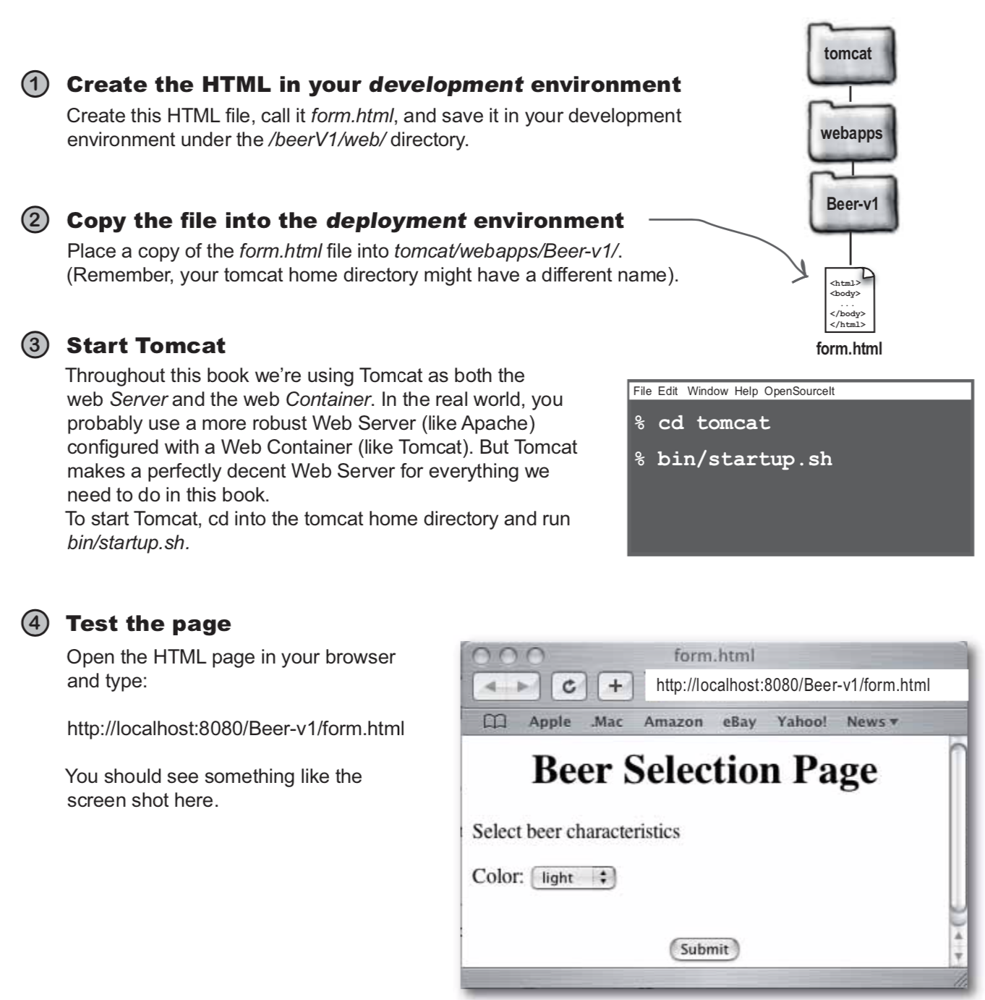

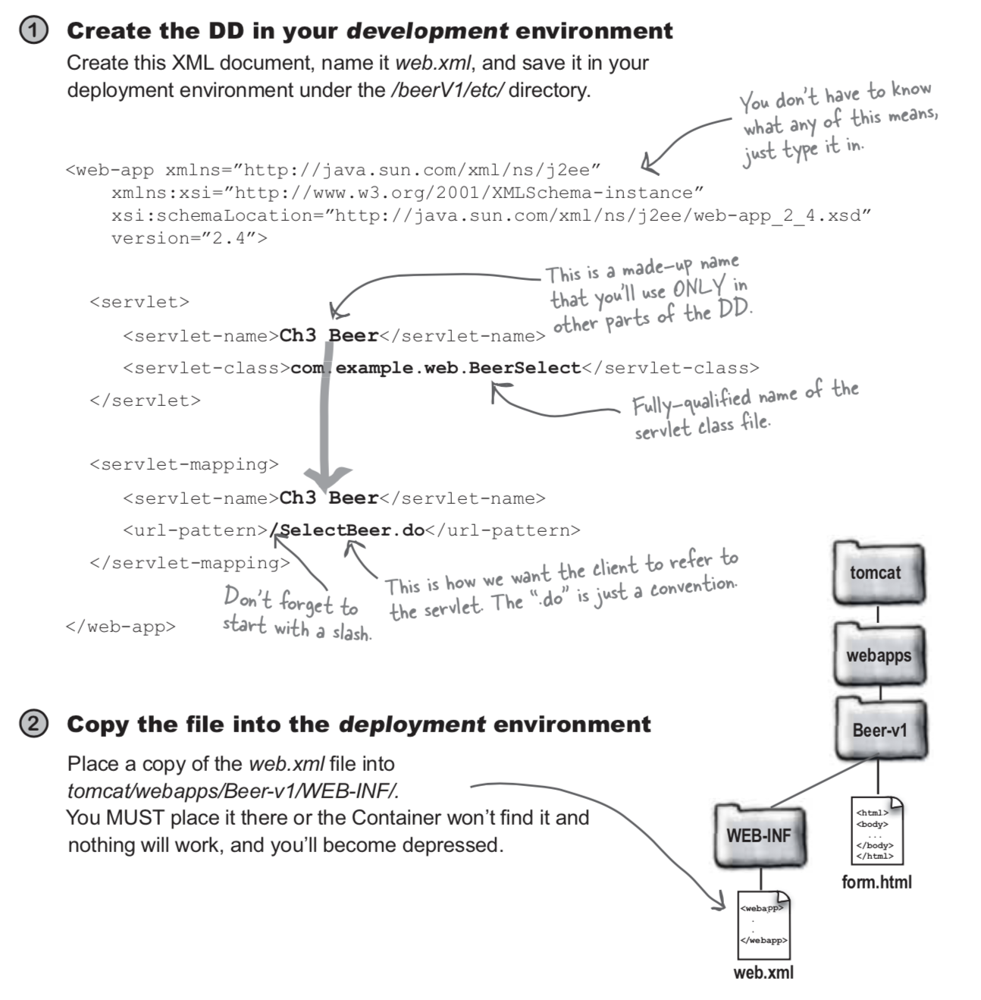

* html파일(뷰 화면)과 DD(web.xml)을 개발 환경에서 작성후 배포 환경의 요구에 맞게 복사만 해주면 된다.
* 여기서 핵심은 DD가 URL 주소는 매핑하는 것이다.


### 2-3. 논리적인 이름을 서블릿 클래스 파일에 매핑하기

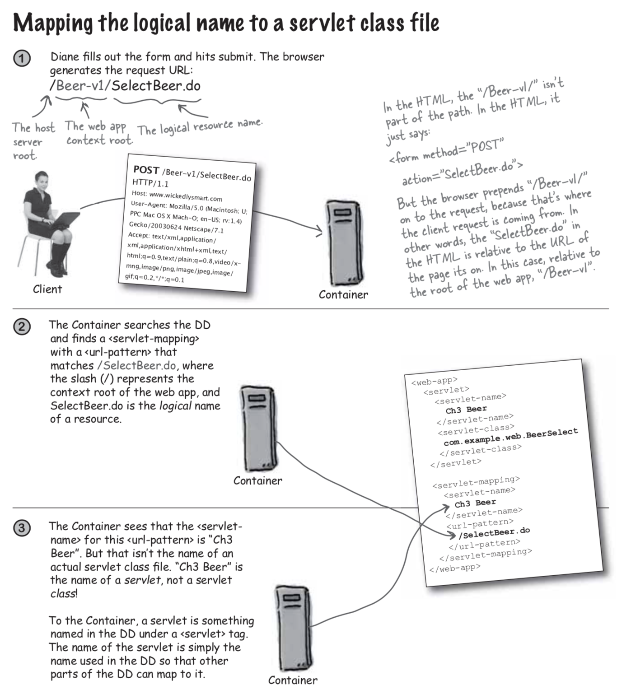

1. 첫 번째 화면 (Beer Selection Page)에서 색깔을 선택하고 제출(submit)버튼을 클릭하면 다음의 URL을 요청합니다.
   * `/Beer-v1/selectBear.do`
   * HTML안에는 서블릿의 이름을 하드코딩하지 않고 .do확장자를 사용하였다. (이게 제일 중요. 매핑)

2. 컨테이너는 DD(web.xml)의 `servlet-mapping` 항목에서 `/SelectBear.do` 라는 값을 가진 `<url-pattern>` 을 찾는다.
3. 컨테이너는 DD(web.xml)에서 `<url-pattern>` 과 쌍을 이루는 `<servlet-name>` 의 값 **Ch3 Beer**을 기억해둔다.
   * **Ch3 Beer은 실제 서블릿 클래스 파일명이 아닌 DD 내에서만 사용하는 서블릿명이다.**
   * 컨테이너는 내부 서블릿명과 여기에 일치하는, `<servlet>` 항목을 매핑한다.

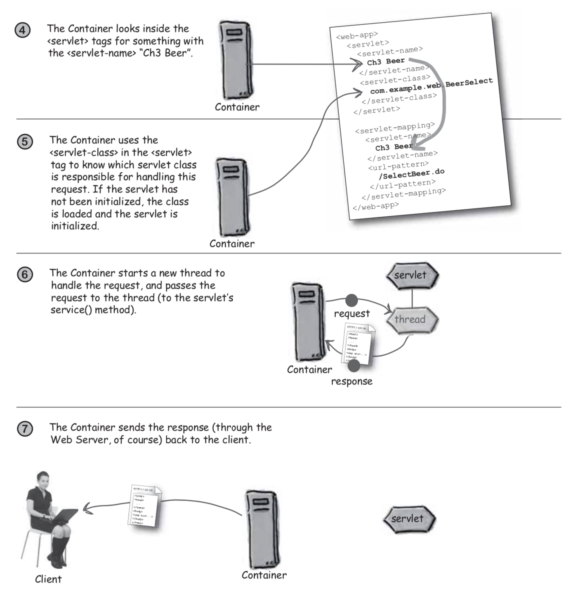

4. 컨테이너는 `<servlet-name>` 항목 값 Ch3 Beer와 일치하는 `<servlet>` 항목이 있는지 검색한다.
5. `<servlet>` 항목을 찾았으면 `<servlet-class>` 항목 값을 읽어온다.
   * 이 값이 바로 요청을 처리할 서블릿 클래스이다.

6. 컨테이너는 요청을 처리할 새로운 스레드를 시작하고 서블릿의 `service()` 메소드에 Request객체 참조를 인자로 넘긴다.
7. 스레드가 완료되면 클라이언트에게 응답을 보낸다.


### 2-4. 서블릿 버전 1 ( 연결 확인 )

이제 서블릿을 만들어 **컴포넌트간 연결이 제대로 되었는지 테스트**한다.

**버전 1의 목표는 `form.html` 이 제대로 서블릿을 호출하는지, 그리고 서블릿이 제대로 Request객체의 파라미터값을 받는지를 테스트하기 위함이다.**

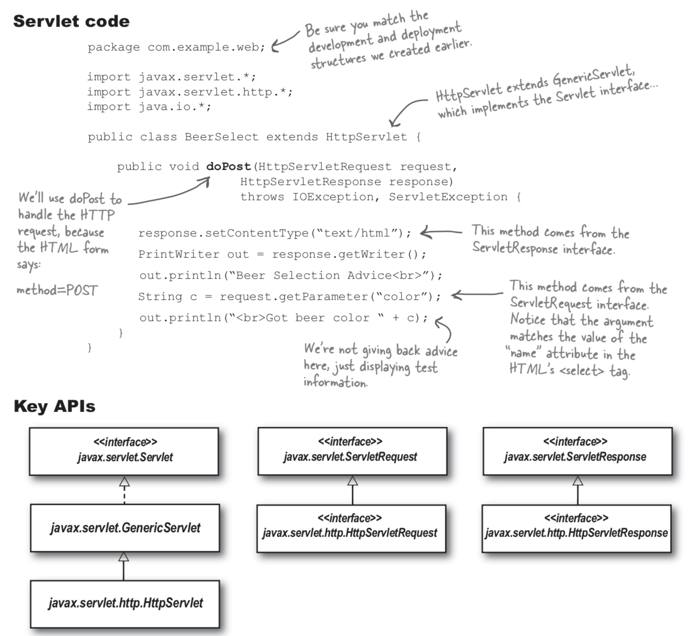

개발환경에서 위와 같이 작성후, 컴파일 해준다.

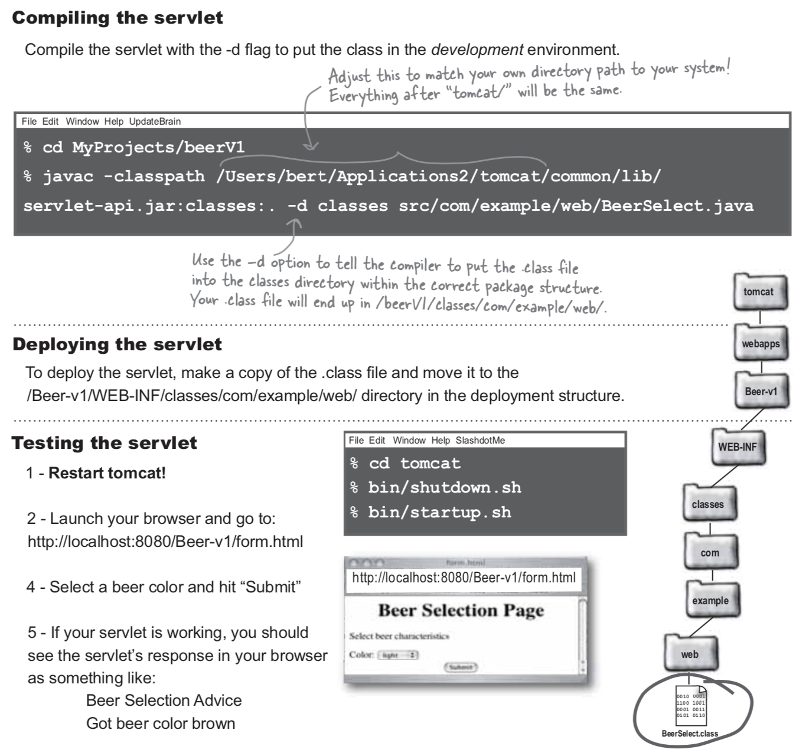

* `javac -classpath /Library/Tomcat/lib/servlet-api.jar:classes:. -d classes src/com/example/web/BeerSelect.java `
  * classpath : 클래스 위치 ( 라이브러리 위치 )
  * d : 컴파일 한 후의 `.class` 파일이 생성되는 위치

* 컴파일 후, 생성된 `.class` 파일을 배포 환경에 복사한 후 톰캣을 실행하면 된다.


### 2-5. 서블릿 버전 2 ( 모델 클래스 )

서블릿 버전 2의 목적은 모델을 사용하는 것이다. 즉, 모델 클래스의 메서드를 호출하여 추천 비슷한 기능을 제공하고자 한다.

대부분 **모델은 평이한 일반 자바 클래스(POJO, Plain Old Java Object)로 코딩**한다. 

**모델은 서블릿이 자신을 호출한다는 것을 알 필요가 없다. 여기서 '안다'는 표현은 모델 코딩 안에 서블릿 관련 내용이 있다는 것을 말하고, 이는 특정 웹 애플리케이션에 "종속적인"모델이 된다는 의미이다.** 

**모델에서 제일 중요한 점은 웹 애플리케이션에 "종속"되지 않는 코드를 작성하는 것이다.**


#### 2-5-1. 모델클래스

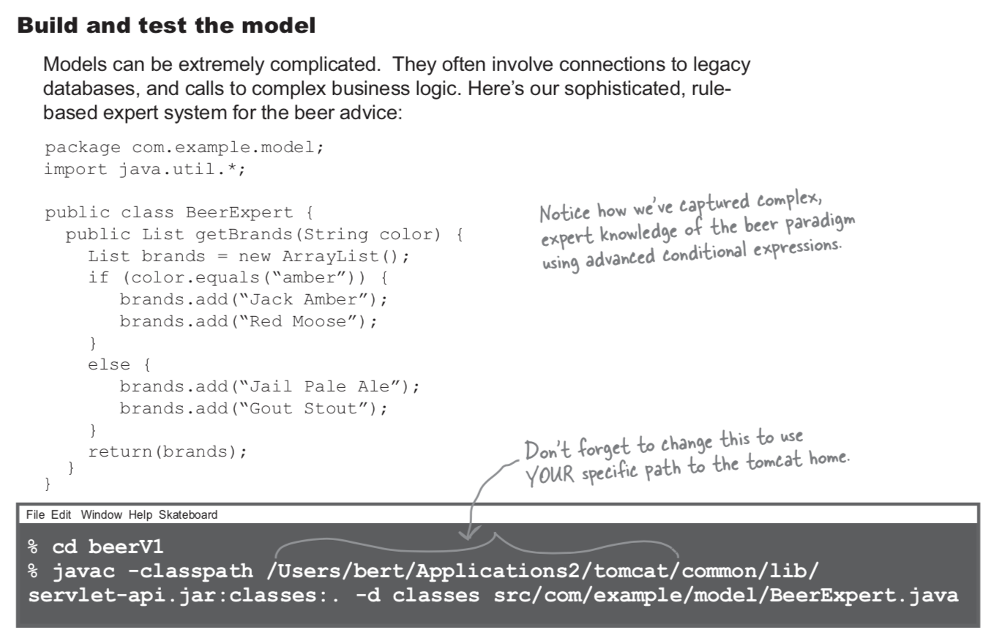

* **모델 클래스는 개발 환경에 있고, 여기서 테스트해야 한다. 즉, 다른 자바 클래스처럼, 톰캣 없이 테스트가 되어야 한다는 것이다.**


#### 2-5-2. 서블릿 코드 변경

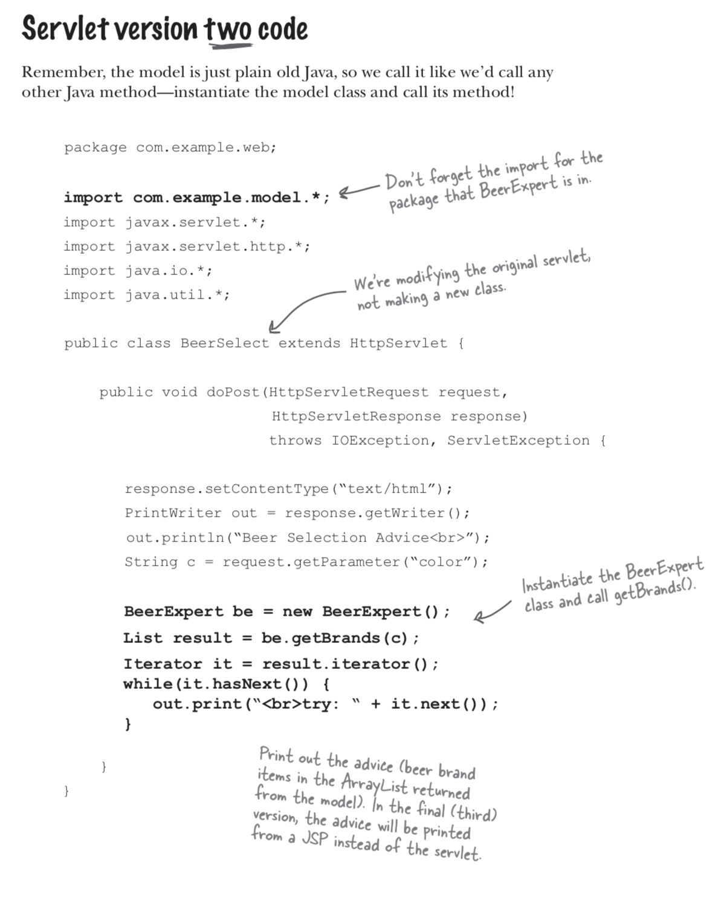

* 서블릿 코드에서 모델의 메서드를 이용하는 코드를 작성합니다.
* 여기선 아직 `PrintWriter` 를 쓰지만, 서블릿 버전3에서는 JSP를 사용할 예정이다.


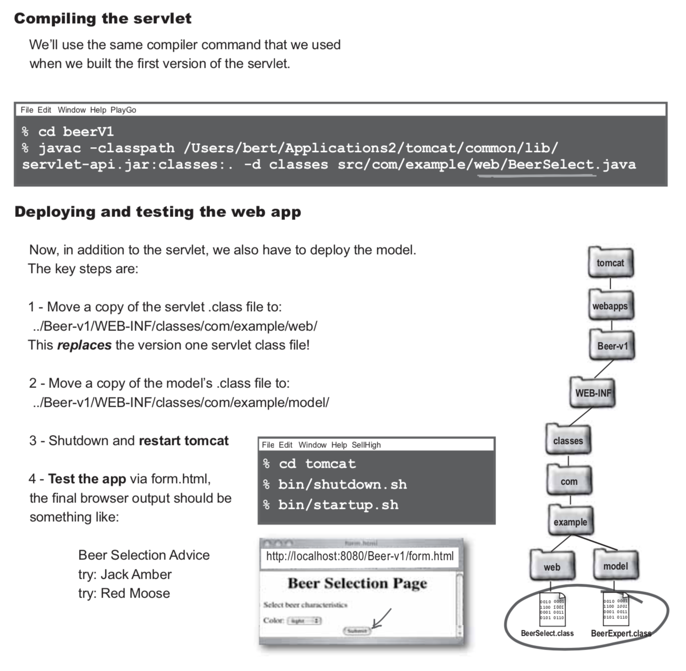

개발 환경에서 모든 코드들을 수정한 후, 컴파일하여 배포 환경으로 복사해준다.

#### 2-5-3. 서블릿 버전 2의 동작 원리

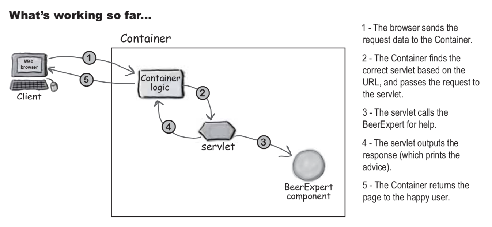

1. 브라우저가 컨테이너에게 요청을 보낸다.
2. 컨테이너는 URL이 올바른 서블릿을 호출하고, 요청을 서블릿으로 넘긴다.
3. 서블릿은 `BeerExpert` 에게 도움을 청한다.
4. 서블릿 `Response` 객체에 쓰기 작업을 한다. ( 모델의 메서드를 이용하여 쓰기 작업 )
5. 컨테이너를 페이지를 클라이언트로 보낸다.


### 2-6. 서블릿 버전 3 ( JSP 도입 )

진정한 MVC모델을 사용하기 위해서 JSP를 도입한다.

서블릿 버전 3의 로직은 아래와 같다.

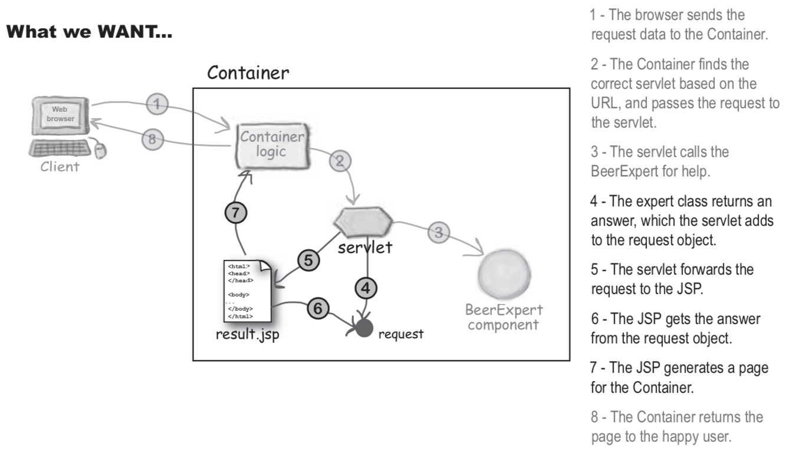

#### 2-6-1. JSP 코드

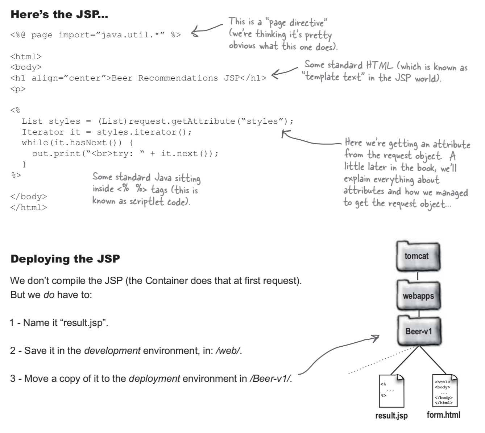

* JSP 코드를 완성한다.
  * JSP에 관한 자세한 내용은 뒤에서 다룬다.
* JSP 배포하기
  * JSP는 컴파일하지 않는다. 개발 환경에서 JSP코드를 완성하고 배포 환경으로 복사해주면 된다.


#### 2-6-2. 서블릿 코드 변경

서블릿에서 JSP를 호출하도록 기능을 확장해야 한다.

컨테이너는 자신이 관리하는 **컴포넌트들끼리 서로 호출할 수 있는 기능**인 **"요청 처리 부탁" 메커니즘을 제공**한다.

* 요청 처리 부탁 ( Request Dispatching )
  * **서블릿은 모델로부터 받은 정보를 Request 객체 안에 저장하고, JSP에 요청을 처리해줄 것을 부탁(dispatching)할 수 있다.**

이를 사용한 전체적인 로직은 아래와 같다.

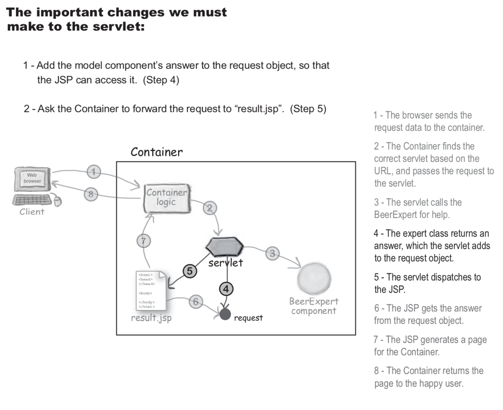

1. 브라우저가 컨테이너에게 요청을 보낸다.
2. 컨테이너는 URL이 올바른 서블릿을 호출하고, 요청을 서블릿으로 넘긴다.
3. 서블릿은 `BeerExpert` 에게 도움을 청한다.
4. BeerExpert 클래스가 값(추천할 맥주 목록)을 리턴한다. 
   * **서블릿은 이 내용을 Request객체에 기억시켜둔다. ( 객체에 저장 )**
5. **서블릿은 요청을 JSP파일에게 넘긴다. ( forward )**
6. JSP는 Request객체에서 서블릿이 넣어 놓은 값을 끄집어 낸다.
7. JSP는 페이지를 생성한다.
8. 컨테이너는 페이지를 클라이언트로 보낸다.

>  쉽게 정리하면 아래와 같다.
>
> * JSP가 읽을 수 있게, 모델로부터 가져온 정보를 Request객체에 저장한다.
> * JSP에 요청 처리를 부탁(dispatch)한다.

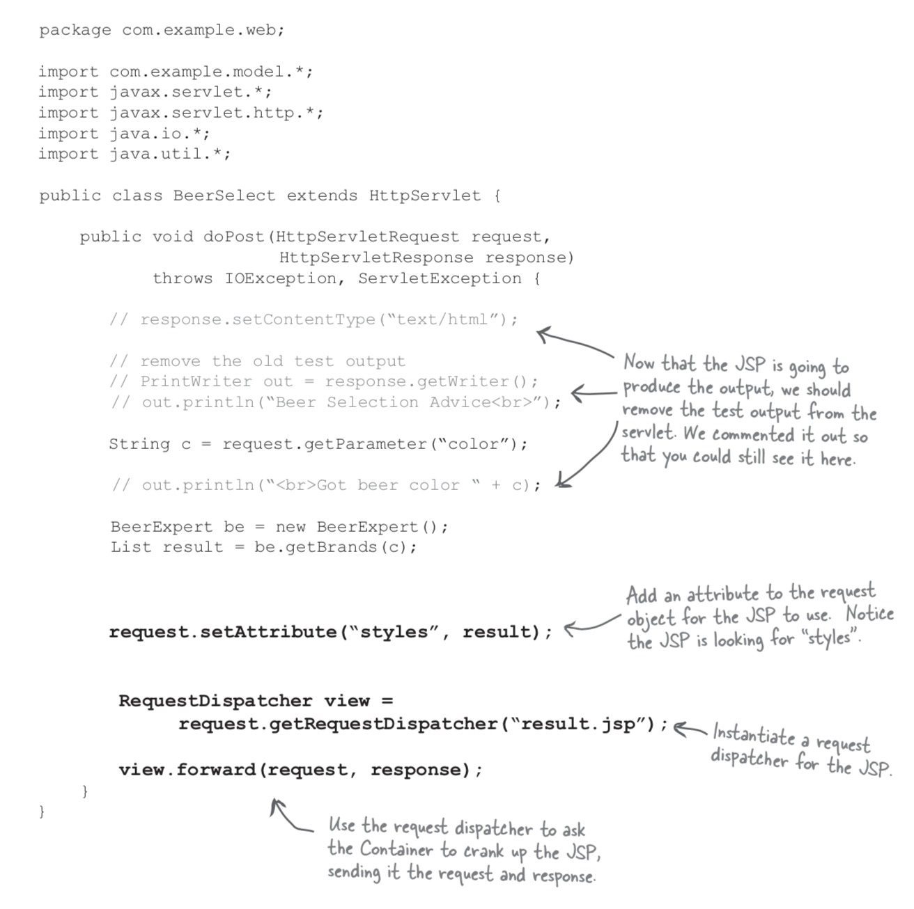

* `request.setAttribute("styles", result);`
  * JSP가 나중에 읽을 수 있게 Request객체의 속성(Attribute)에 값을 설정한다. 나중에 styles란 값으로 JSP에서 이 객체를 읽어 올 것이다.
* `RequestDispatcher view = request.getRequestDispatcher("result.jsp");`
  * JSP로 작업을 부탁할 RequestDispatcher를 인스턴스화하다.

* `view.forward(request, response);`
  * RequestDispatcher는 컨테이너에게 JSP를 준비하라고 요청한다.
  * JSP에게 request/response 객체를 넘긴다.


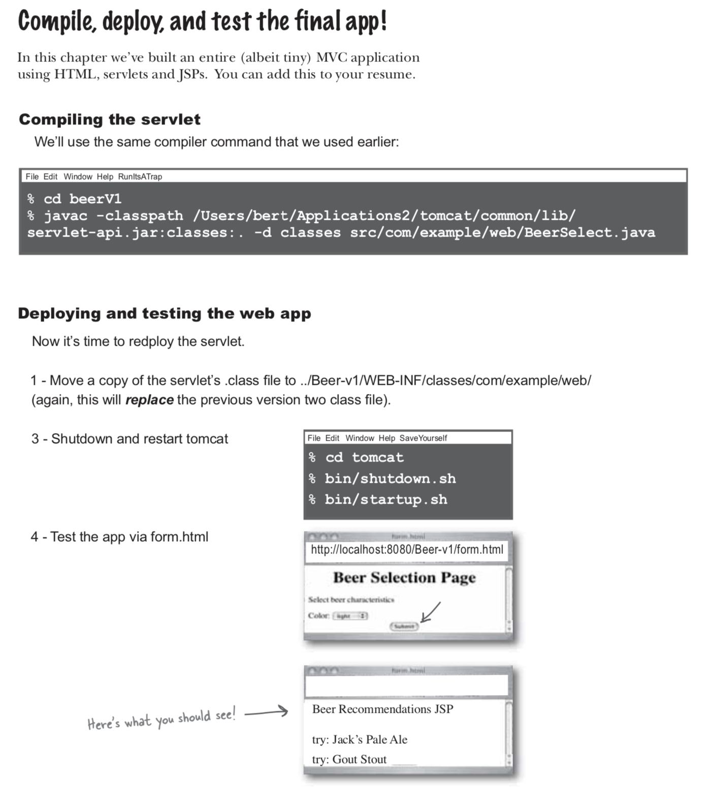

마지막으로 컴파일 후, 배포 환경으로 복사해주면 잘 동작하는 것을 볼 수 있다.


> 지금까지 MVC의 동작 원리와 구현을 해보았다. 또한, 서블릿과 Request, Reponse에 대해서도 다루었다.
>
> 익숙해지기 위해 여러번 보는게 좋다 생각든다.
