[Head First Servlets & JSP](http://www.yes24.com/Product/Goods/3301415?OzSrank=1)를 기초하여 작성한 자료입니다.

<br>

## 목차

- [서블릿 ( 요청과 응답 )](#서블릿--요청과-응답-)
  - [1. 서블릿](#1-서블릿)
    - [1-1. 서블릿과 컨테이너의 동작 흐름](#1-1-서블릿과-컨테이너의-동작-흐름)
    - [1-2. 서블릿 생명주기 (Life Cycle)](#1-2-서블릿-생명주기-life-cycle)
    - [1-3. 서블릿의 상속 관계](#1-3-서블릿의-상속-관계)
    - [1-4. 서블릿 스레드](#1-4-서블릿-스레드)
      - [1-4-1. 클라이언트의 요청은 서로 다른 스레드에서 실행된다.](#1-4-1-클라이언트의-요청은-서로-다른-스레드에서-실행된다)
  - [2. 서블릿 초기화](#2-서블릿-초기화)
    - [2-1. `init()`는 최초 `service()`호출이 있기 전에 완료된다.](#2-1-init는-최초-service호출이-있기-전에-완료된다)
    - [2-2. 서블릿 초기화 : "객체가 서블릿이 되는 순간"](#2-2-서블릿-초기화--객체가-서블릿이-되는-순간)
    - [2-3. `ServletConfig` 와 `ServletContext` (중요)](#2-3-servletconfig-와-servletcontext-중요)
      - [2-3-1. `ServletConfig`](#2-3-1-servletconfig)
      - [2-3-2. `ServletContext`](#2-3-2-servletcontext)
  - [3. Request와 Response : Service의 인자이자 가장 중요한 것.](#3-request와-response--service의-인자이자-가장-중요한-것)
    - [3-1. Request와 Response객체의 구조](#3-1-request와-response객체의-구조)
    - [3-2. HttpServletRequest와 HttpServletResponse에 관한 여러가지 질문](#3-2-httpservletrequest와-httpservletresponse에-관한-여러가지-질문)
  - [4. Request](#4-request)
    - [4-1. HTTP 메서드](#4-1-http-메서드)
    - [4-2. GET과 POST의 차이](#4-2-get과-post의-차이)
    - [4-3. 멱등(Idempotent)](#4-3-멱등idempotent)
    - [4-4. Request에서 얻을 수 있는 여러가지](#4-4-request에서-얻을-수-있는-여러가지)
  - [5. Response](#5-response)
    - [5-1. Response객체의 I/O 사용하기](#5-1-response객체의-io-사용하기)
      - [5-1-1. 클라이언트에 JAR파일을 전송한다면](#5-1-1-클라이언트에-jar파일을-전송한다면)
      - [5-3-2. 바이트](#5-3-2-바이트)
    - [5-4. 헤더 값 설정](#5-4-헤더-값-설정)
  - [6. 리다이렉트 (redirect)](#6-리다이렉트-redirect)
    - [6-1. 리다이렉트란?](#6-1-리다이렉트란)
    - [6-2. 서블릿 리다이렉트는 브라우저가 이 작업을 한다.](#6-2-서블릿-리다이렉트는-브라우저가-이-작업을-한다)
    - [6-3. 여러가지 주의사항](#6-3-여러가지-주의사항)
  - [7. 디스패치 (dispatch)](#7-디스패치-dispatch)
    - [7-1. 디스패치란](#7-1-디스패치란)
    - [7-2. 디스패치와 리다이렉트의 차이점](#7-2-디스패치와-리다이렉트의-차이점)
  - [8. 리다이렉트와 디스패치](#8-리다이렉트와-디스패치)

<br>

# 서블릿 ( 요청과 응답 )

서블릿이 하는 일은 클라이언트로부터 요청을 받아 이에 응답하는 것이 대부분이다.

이번 4장에서는 **서블릿의 기본적인 동작 원리와 요청과 응답**에 대해서 깊게 다뤄보고자 한다.

* Request객체 : 사용자의 중요한 데이터들이 함께 들어 있기 때문에, **서블릿은 어떻게 이 정보를 읽어오고, 사용할 것인지를 알고 있어야 한다.**
* Response객체 : 브라우저가 화면에 정보를 출력하거나, 아니면 바이트(Byte)정보를 내려받는 것과 같은 정보 전송 역할을 하기에 **서블릿은 데이터를 어떻게 전송하는가**도 미리 알고 있어야 한다.

<br>

> **서블릿은 싱글톤형태로 실행이 된다.**

<br>

## 1. 서블릿

이번 챕터에서는 서블릿의 기본적인 원리에 대해서 다뤄보고자 한다.

<br>

### 1-1. 서블릿과 컨테이너의 동작 흐름

사용자가 서블릿 관련 **요청을 하면**, **컨테이너는 Request, Response객체를 생성**하고, **서블릿의 새로운 스레드**를 만들어 서블릿 **`service()`메서드를 호출**하고, **Request와 Response객체에 대한 참조를 인자로 넘긴다.**

<p align="center">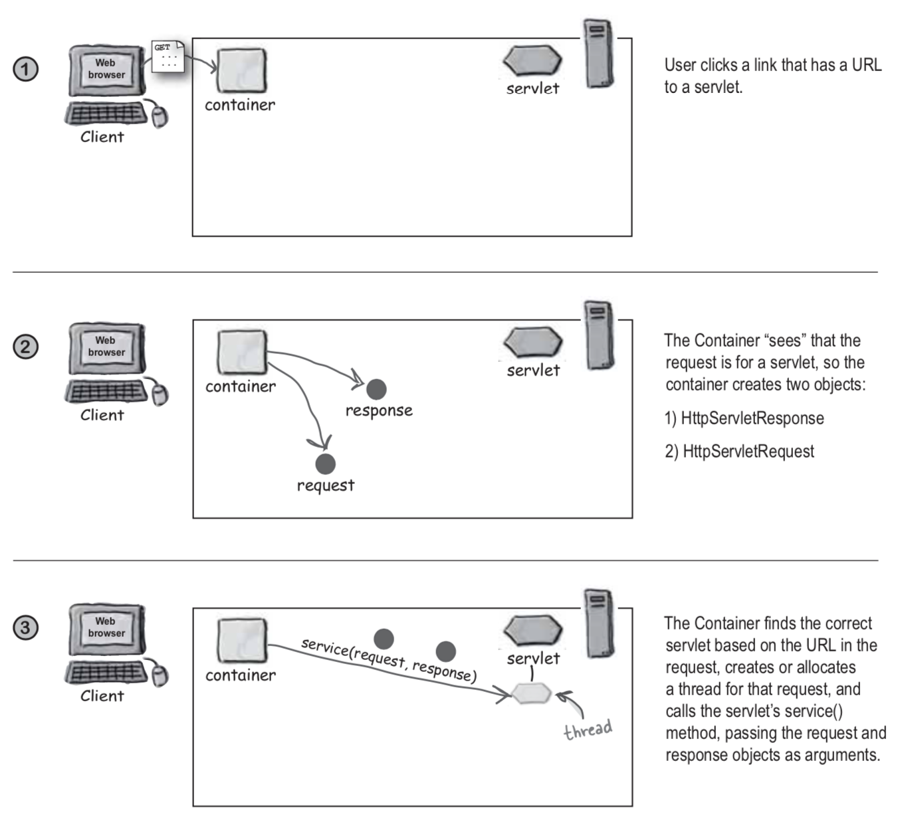<br>출처 : Head First Servlets & JSP</p>

1. 사용자가 서블릿에 대한 링크(URL)를 클릭한다. ( 요청 )
2. **컨테이너는 요청된 Request가 서블릿이라는 것을 간파하고는 다음 두 개의 객체를 생성**한다.
   * HttpServletResponse
   * HttpServletRequest
3. **접수한 요청의 URL을 분석하여 어떤 서블릿을 요청했는지 파악**한다. (여기서 DD를 참조한다). 그 다음 **해당 서블릿 스레드를 생성하여 Request, Response 객체 참조를 넘긴다**.

<p align="center">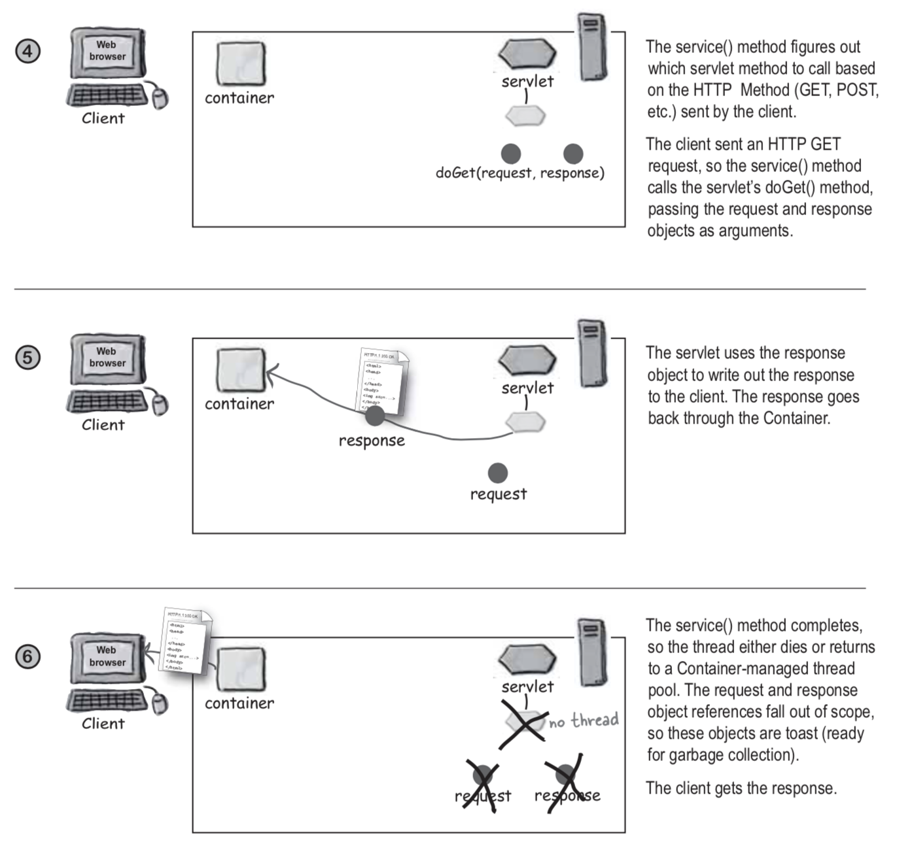<br>출처 : Head First Servlets & JSP</p>

4. **컨테이너는 스레드를 통해 만든 서블릿 service()메서드를 호출한다**. 브라우저에서 지정한 방식에 따라 **`doGet()`을 호출할 지, `doPost()`를 호출할지 결정**한다.
   * **`doGet()`이나 `doPost()`나 호출할 때 Request와 Response객체를 인자로 넘긴다.**
5. **서블릿은 클라이언트에게 응답을 작성하기 위하여 Response객체를 사용한다**. 이 작업을 완료하면, **Response에 대한 제어는 컨테이너에게 넘어간다.**
6. **`service()`메서드가 끝나면, 스레드를 소멸하거나 아니면 컨테이너가 관리하는 스레드 풀로 돌려보낸다.**
   * 그 다음 Request와 Response객체는 가비지 컬렉션이 될 준비를 할 것이며, 이 객체에 대한 참조는 이제 범위를 벗어나기에 사라진다.

<br>

> 다른 블로그에서 가져온 Servlet 동작과정

<p align="center"><br>출처 : http://wiki.gurubee.net/pages/viewpage.action?pageId=26740202&</p>

1. 사용자가 URL을 클릭하면 HTTP Request를 Servlet Container에 보낸다.
2. Servlet Container는 HttpServletRequest, HttpServletResponse 두 객체를 생성한다.
3. 사용자가 요청한 URL을 분석하여 어느 서블릿에 대한 요청인지 찾는다.
4. 컨테이너는 서블릿 service() 메소드를 호출하며, POST, GET여부에 따라 doGet() 또는 doPost()가 호출된다.
5. doGet() or doPost() 메소드는 동적인 페이지를 생성한 후 HttpServletResponse객체에 응답을 보낸다.
6. 응답이 완료되면 HttpServletRequest, HttpServletResponse 두 객체를 소멸시킨다.

<br>

### 1-2. 서블릿 생명주기 (Life Cycle)

서블릿이 어떻게 동작하는지를 정확히 알기 위해서는 서블릿의 생명주기를 알아야 한다.

<p align="center">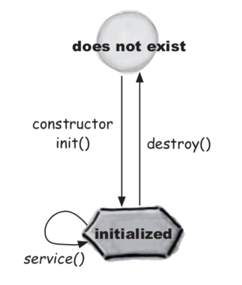<br>출처 : Head First Servlets & JSP</p>

서블릿은 아래 3가지의 상태가 있다.

* 초기화되는 중 ( 생성자를 실행하거나 init()메서드를 실행하거나 )
* 초기화된 상태 ( initialized )
* 소멸되는 중 ( destroy() 메서드를 실행 )

더 정확한 표현은 아래와 같다.

<p align="center">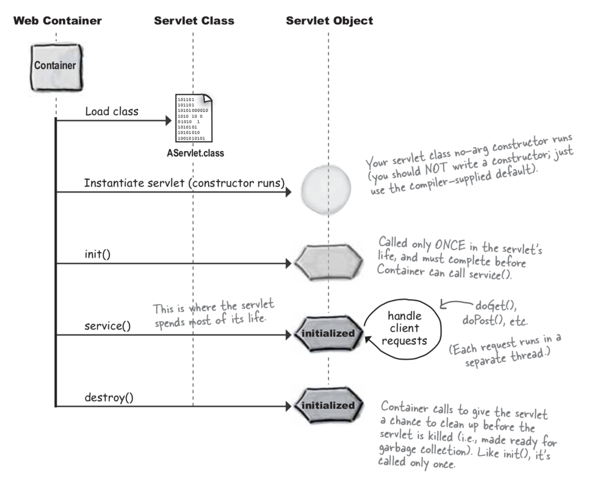<br>출처 : Head First Servlets & JSP</p>

* Instantiate servlet : 디폴트 생성자(인자가 없는) 실행(생성자를 코딩하지 않아도 된다. 컴파일러가 자동으로 만들어주는 것을 사용하면 된다.)
* `init() `: 서블릿 일생 중 한번만 호출된다.
  * init()메서드는 service()메서드 전에 실행되어야 한다.
  * **서버가 켜질때 한번만 실행된다.**
* `service()` : 요청이 들어 올 때마다 새로운 스레드에서 실행된다.
  * 클라이언트 요청을 핸들링 한다. ( 스레드 )
  * **모든 유저들의 요청을 받는다.**
* `destroy()` : 서블릿이 죽기 전에 가지고 있는 자원들을 깨끗이 정리하는 단계.
  * **서버가 꺼질때 한번만 실행된다.**

<br>

|                    |                        호출되는 시점                         |                             목적                             |                       재정의해야 하나?                       |
| :----------------: | :----------------------------------------------------------: | :----------------------------------------------------------: | :----------------------------------------------------------: |
|       init()       | **컨테이너는 서블릿 인스턴스(빈 객체)를 생성한 다음 `init()`메서드를 호출한다.**  이 메서드는 `service()` 메서드 전에 실행되어야 한다. | 클라이언트의 요청을 처리하기 전에 **서블릿을 초기화할 기회**를 주는 것. | 가능하다. 초기화할 코드가 있다면 `init()`메서드를 재정의하여 사용한다. **대표적인 예제가 DB에 대한 접속이다.** |
|     service()      | **최초 클라이언트의 요청을 받았을 때, 컨테이너는 새로운 스레드를 생성하거나, 스레드풀로부터 하나를 가지고 와서 서블릿의 `service()`메서드를 호출한다.** | **클라이언트의 HTTP메서드(GET,POST)를 참조하여 doGet()을 호출할지, `doPost()`를 호출할 지 판단한다.** | **거의 하지 않는다.** `service()`메서드를 재정의할 필요는 없다. |
| doGet() <br> doPost() | `service()`메서드가 클라이언트의 HTTP(GET, POST)를 참조하여 doGet()또는 doPost()를 호출한다. |          **여기에다가 개발자가 코딩을 하면 된다.**           |         항상, 둘 중 하나는 반드시 재정의 해야 한다.          |

<br>

### 1-3. 서블릿의 상속 관계

<p align="center">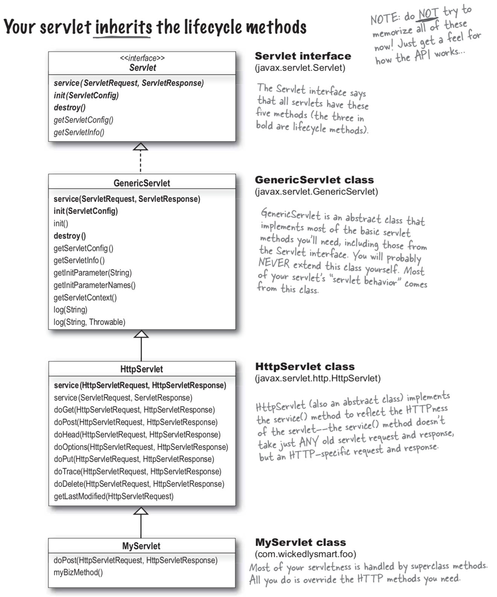<br>출처 : Head First Servlets & JSP</p>

* Servlet 인터페이스
  * **모든 서블릿은 5가지 메서드를 가져야 한다.** 이 중 굵게 쓴 3가지가 생명주기 메서드이다.
* GenericServlet 추상클래스
  * 필요한 대부분의 서블릿 메서드를 구현했으며, Servlet 인터페이스의 메서드들도 구현 해놓았다.
  * 직접 이 클래스를 이용하진 않고, 상속하여 사용한다. ( 추상 클래스 )
  * **대부분 서블릿의 '서블릿 행위'라고 하는 것들이 바로 이 클래스로부터 나왔다.**
* HttpServlet 추상클래스
  * HttpServlet은 서블릿의 **HTTP적인 측면을 반영**하기 위해서 `service()` 메서드를 재정의한 것이다.
  * **`service()`  메서드는 오로지 HTTP Request와 Response만 받아들이고 다른 어떤 서블릿 Request와 Response는 받지 않는다.**
* MyServlet 클래스
  * Servlet관련 클래스를 상속받아, 사용자가 재정의하는 클래스.

<br>

> 정리하면 아래와 같다.
>
> * 첫 요청이 들어오면, **컨테이너가 해당 서블릿의 `init()` 메서드를 호출한다**. **`init()` 을 재정의하지 않았다면, `GenericServlet` 의 `init()` 을 호출하게 된다**. ( 재정의 한다면 해당 서블릿에서 실행되겠죠? )
> * 또한, **요청이 들어오면, 컨테이너가 새로운 스레드를 만들거나 아니면 하나를 할당한다. 그리고 `service()` 를 호출한다.**
>   * `service()` 메서드를 재정의하지 않았다면, `HttpServlet` 의 `service()` 메서드가 실행된다. 
>   * `HttpServlet` 의 `service()` 는 **재정의한 `doGet()` 이나 `doPost()` 중 하나를 실행한다.**

<br>

### 1-4. 서블릿 스레드

<p align="center">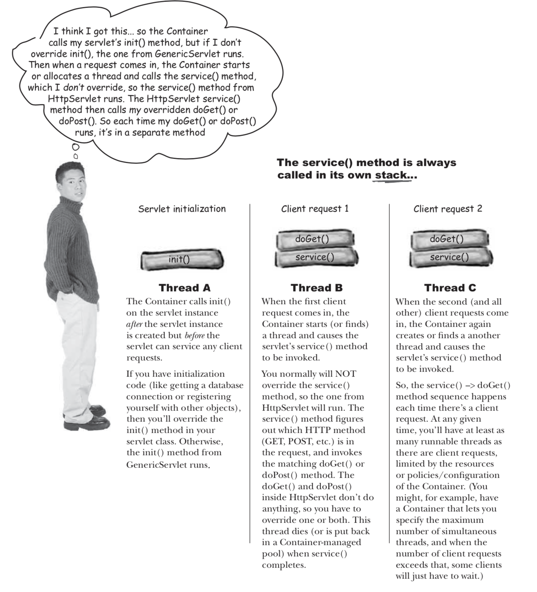<br>출처 : Head First Servlets & JSP</p>

* Thread A - `init()`  : **컨테이너는 서블릿 인스턴스를 생성한 다음 `init()` 메서드를 호출한다.**
  * **DB에 대한 접속, 다른 객체에 서블릿을 등록하는 것과 같은 초기화 코드가 `init()` 에 재정의 된다.**
  * **재정의하지 않으면, `GenericServlet()` 의 `init()` 이 실행된다.**
* Thread B - `doGet` , `service()` : 클라이언트 요청을 받았을때, 콘테이너는 새로운 스레드를 생성하거나, 스레드 풀로부터 하나를 가지고 와서 ***서블릿의 `service()` 메서드를 호출한다.***
  * **`service()` 메서드는 재정의 할 필요가 없고, 이미 기능이 강력해서 `doGet()` 인지 `doPost()` 인지 구분해줍니다.**
  * **`service()` 메서드가 완료되는 시점이 바로 스레드가 종료되는 시점이다.**
* Thread C - `doGet` , `service()` : 두 번째 요청도 마찬가지로 컨테이너는 스레드를 생성하여 요청을 처리한다.
  * 컨테이너에 동시에 실행할 수 있는 최대 스레드 개수를 설정할 수 있다.

<br>

#### 1-4-1. 클라이언트의 요청은 서로 다른 스레드에서 실행된다.

<p align="center">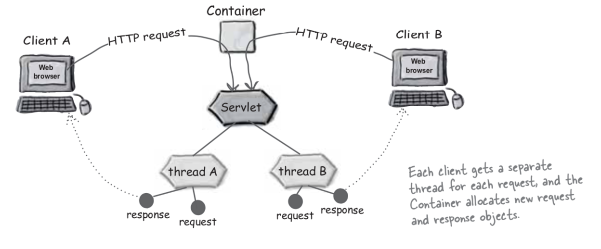<br>출처 : Head First Servlets & JSP</p>

* 클라이언트는 자신의 요청을 처리할 자신만의 스레드를 가진다.
  * 컨테이너는 요청 스레드마다 Request, Response 객체를 생성한다.

<br>

> 1. 컨테이너가 새로운 요청이 와서 스레드를 생성할 때마다 서블릿 인스턴스를 만드는가??
>
> * **컨테이너는 서블릿 하나에 대한 다수의 요청을 처리하기 위하여 다수의 스레드를 실행하지 다수의 인스턴스를 만들지 않는다.**


> 2. 하나의 클라이언트가 여러 개의 요청을 보내면 어떻게 되는가?
>
> * **요청 당 하나의 스레드를 생성한다**. 클라이언트와는 관계가 없다.

<br>

## 2. 서블릿 초기화

<br>

### 2-1. `init()`는 최초 `service()`호출이 있기 전에 완료된다.

**서블릿의 일생은 컨테이너가 서블릿 파일을 찾아서 로딩할 때 부터이다.**

**이 작업은 거의 컨테이너가 시작할 때 (톰캣이 실행될 때)이루어 진다.** 

***컨테이너가 시작되면, 컨테이너는 배포된 웹 애플리케이션이 어떤 것이 있는지 체크하고, 관련 서블릿 클래스 파일을 검색한다.***

( 후에 '배포'에 관해서 더 자세히 다룬다. )

> 서블릿의 시작은 아래와 같다.
>
> 1. 클래스를 찾는다.
> 2. 클래스 로딩
>    * 이 작업은 컨테이너마다 차이가 있다. 컨테이너가 시작될 때 로딩하기도 하고, 최초 클라이언트 접근시 로딩하기도 한다.
>
> 중요한 점은 `service()`메소드는 서블릿 초기화가 완전히 완료된 다음에 실행된다.

<br>

### 2-2. 서블릿 초기화 : "객체가 서블릿이 되는 순간"

<p align="center">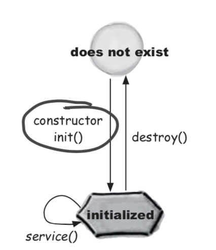<br>출처 : Head First Servlets & JSP</p>

생성자의 실행은 서블릿이 '존재하지 않음(does not exist)'상태에서 '초기화됨' 상태로 옮겨감을 의미한다.

그러나, **생성자는 단지 객체(Object)를 만드는 것이지 서블릿을 만드는 것이 아니다.**

**서블릿이 되기 위해서는 서블릿적인 것을 내려받아야 한다.**

> **객체가 서블릿이 된다는 것은, 서블릿에 따라오는 고유한 권한을 가진다는 것을 의미한다.** 예를 들어, `ServletContext`를 가지고 컨테이너로부터 정보를 읽어올 수 있는 능력 같은 것이다.

**기존의 일반적인 객체에서 `ServletConfig`를 인자로 넘겨주면서 `init()`를 호출한다. 그 이후로 일반적인 객체는 서블릿이란 특권을 가지게 된다.** 자세한 과정은 뒤에서 더 자세히 다뤄본다.

<br>

### 2-3. `ServletConfig` 와 `ServletContext` (중요)

<p align="center">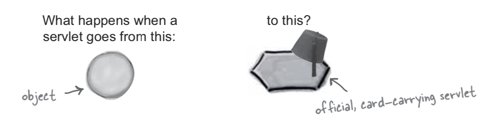<br>출처 : Head First Servlets & JSP</p>

위에서 언급했듯이, **일반적인 객체를 생성하고 init()을 호출함으로써 해당 객체가 서블릿이 된다.**

이때 **서블릿이 될 수 있도록 해주는 매개변수들이 바로 `ServletConfig`와 `ServletContext`이다.**

<br>

#### 2-3-1. `ServletConfig`

* 서블릿 당 `ServletConfig` 객체 하나
* **서블릿 배포 시 설정된 정보를 서블릿으로 넘겨주기 위해서 사용된다.**
  * 서블릿 안에 하드코딩하길 원하지 않는 정보들. 
  * DB나 EJB 참조 이름 같은 것.
* **`ServletContext`에 접근하기 위해서 이 객체를 사용.**
* 파라미터값은 배포 서술자(DD)에서 설정 가능.
  * `<init-pattern>`

<br>

#### 2-3-2. `ServletContext`

* **웹 애플리케이션 당 하나의 ServletContext가 있다.**
  * 이름을 `AppContext`라고 해야 한다.
* 웹 애플리케이션의 파라미터 정보를 읽어오기 위하여 사용된다.
  * 파라미터 정보는 DD안에 설정되어 있다.
* 이것은 일종의 애플리케이션용 게시판 같다. 여기에다가 메시지(속성)를 적어놓으면 애플리케이션의 다른 녀석들이 이를 읽을 수 있게된다.
  * 서블릿끼리 자원(데이터)을 공유하는데 사용된다.
* 서블릿과 컨테이너 간의 연동을 위해 사용한다.
* 서버 정보를 파악하기 위하여 사용된다. 컨테이너의 이름 및 버전, 지원하는 API버전 등.

<br>

> 더 자세한 내용을 보고 싶다면 servlet api의 코드를 뜯어보자.

<br>

## 3. Request와 Response : Service의 인자이자 가장 중요한 것.

<br>

### 3-1. Request와 Response객체의 구조

<p align="center">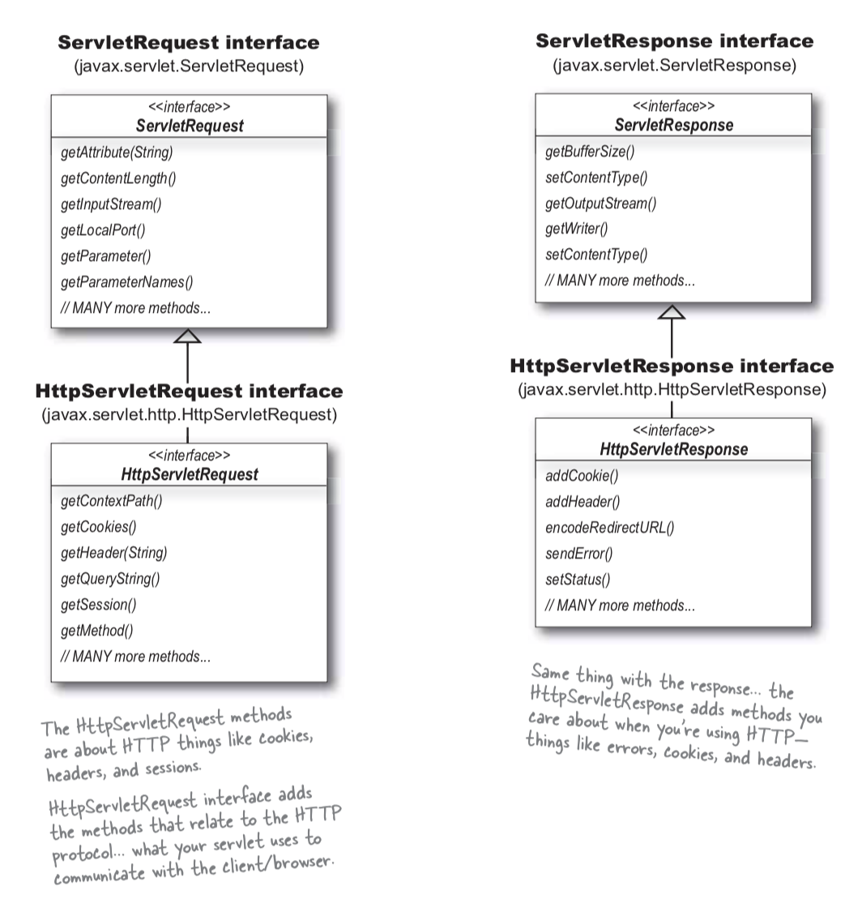<br>출처 : Head First Servlets & JSP</p>

* `HttpServletRequest`
  * `HttpServletRequest`의 메서드는 쿠키, 헤더, 세션 등 HTTP에 관련된 것들을 서비스한다.
  * `HttpServletRequest`인터페이스에는 HTTP프로토콜에 관련된 메서드들이 추가되어있다. 모두 서블릿이 클라이언트와 대화하기 위한 것들이다.
* `HttpServletResponse`
  * `HttpServletResponse`에는 HTTP에 관련된 오류, 쿠키, 헤더 정보에 대한 메서드들이 추가되어 있다.

<br>

### 3-2. HttpServletRequest와 HttpServletResponse에 관한 여러가지 질문

> `HttpServletRequest`와 `HttpServletResponse`는 인터페이스인데, 누가 이를 구현하는가? API에 구현된 클래스가 있는가?

* `HttpServletRequest`와 `HttpServletResponse`는 '컨테이너'가 구현을 한다.
  * **`service()`메서드가 호출될 때 `HttpServletRequest`와 `HttpServletResponse`를 완벽하게 구현한 객체의 참조가 인자로 넘어온다.**
  * 그러므로 실제로 구현한 **클래스 이름이 무엇이며 타입이 어떻게 되는지 굳이 알 필요는 없다.**
  * 신경 쓸 부분은 두 객체의 기능을 완벽하게 구현한 객체로 **무엇을 할 것인가**이다.
* **API에 구현된 클래스는 없다.**
  * **그 이유는 '컨테이너 벤더'가 구현하기 때문이다.**

<br>

> 위 그림에 있는 UML을 제대로 이해하고 있는가? 인터페이스가 인터페이스를 상속한다.

* **인터페이스가 인터페이스를 상속 할 수 있다.**
  * **A 란 인터페이스가 B 란 인터페이스를 상속한 것을 C 라는 클래스가 구현한다면, C 클래스는 B 인터페이스 뿐만 아니라 A 인터페이스도 구현을 해줘야 한다.**
  * **`HttpServletRequest`를 구현한 클래스는 `HttpServletRequest`인터페이스와 `ServletRequest`인터페이스를 모두 구현해줘야 한다.**

<br>

> GenericServlet과 ServletRequest와 ServletResponse에 대해 궁금한 점이 있다. 누구도 HTTP 서블릿 말고는 사용하지 않는다고 하는데, 이 세가지는 왜 만들었는가?

* 누구도 사용하지 않는 건 없다. 누군가는 HTTP프로토콜과 관련없는 SMTP같은 프로토콜 서블릿을 만들때 사용할 수도 있기에 만들어 둔 것이다.
* 서블릿 모델을 디자인할 때 유연하게 설계한 것 뿐이다.
* 단, API에서 제공하는 프로토콜은 HTTP 밖에 없다.

<br>

## 4. Request

<br>

### 4-1. HTTP 메서드

<p align="center">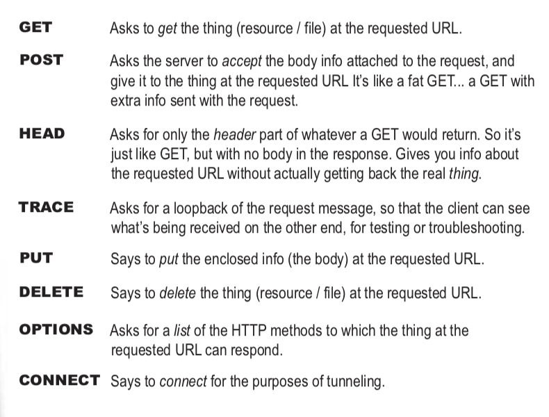<br>출처 : Head First Servlets & JSP</p>

* GET : URL로 자원 또는 파일을 달라고(get) 요청한다.
  * **'조회' 역할을 수행한다.**
* POST : Request에 첨부한 몸체 정보를 서버로 보내어, 요청한 URL로 이 정보를 넘겨주라고 요청한다.
  * 뚱뚱한 GET이라 볼 수 있다. 부가 정보를 가진 GET이라고도 한다.
  * **'등록' 역할을 수행한다.**
* HEAD : GET이 무엇을 리턴하든 간에 헤더 정보만 요청한다.
  * 이는 Response의 몸체정보가 없다는 것만 빼면 GET과 동일하다. 요청한 URL로부터 요청한 정보는 빼고 헤더 정보만 가져오는 것이다.
  * 웹 서버에서 헤더 정보 이외에는 어떤 데이터도 보내지 않는다.
  * 웹 서버의 다운 여부 점검(Health Check)이나 웹 서버 정보(버전 등)등을 얻기 위해 사용된다.
* TRACE : 요청한 메시지의 루프백(loopback)테스트를 요청한다. 
  * 서버쪽에서 무엇을 받았는지를 알고 싶을 때 하는 테스트
  * 테스트 목적 또는 문제 해결을 위해 사용한다.
* PUT : 동봉한 몸체 정보를 요청한 URL로 올리기 위해 사용한다. ( 식별자를 같이 보낸다. )
  * POST와 유사한 전송 구조를 가지기 때문에 헤더 이외에 몸체정보를 보낸다.
* DELETE : 요청한 URL에 있는 자원이나 파일을 삭제하기 위해 사용한다.
* OPTIONS : 요청한 URL이 응답할 수 있는 HTTP메서드가 무엇이 있는지 요청한다.
* CONNECT : 터널링의 목적으로 연결을 요청한다.

<br>

> **PUT과 POST의 차이**
>
> * 똑같은 요청이 **POST로 2번 날아오면 POST는 2개의 자원을 생성한다. 게시판에 글쓰기 요청을 2번 날리면 2개의 게시물이 등록되는것이다**. PUT으로 동일한 요청을 2번 날린다고 생각해보자. 이때 **PUT은 식별자를 포함해야한다.** 다만 **꼭 존재하는 식별자를 포함할 필요는 없으므로 존재하지않는 식별자로 요청을 하게되면 이때는 POST와 동일하게 자원을 생성한다.** 하지만 두번째 요청에선 **이미 첫번째 요청에서 생성된 자원이 있으므로 자원을 생성하지않고 교체하게된다.** 이 부분이 POST와 PUT이 달라지게된다.
>   * POST는 요청할 때 식별자를 보내지 않는다.
>   * PUT은 요청할 때 식별자를 보낸다. 그게 실제로 존재하는 것인지는 중요하지 않다. 
> * **멱등성**
>   * **1번을 실행하든 100번을 실행하든 결과가 같은 성질을 의미한다.**
>   * POST나 PUT이나 존재하지 않는 자원으로 요청을 하면 신규 등록을 하는건 동일하나 동일한 요청을 2번 이상했을때는 결과가 달라지게 된다.
>   * **POST는 멱등성을 만족하지 못한다.**
>   * **PUT은 멱등성을 만족한다.**
>
> 출처: https://multifrontgarden.tistory.com/245 [우리집앞마당]
>
> 
>
> * POST : create only
> * PUT : update if not existed then cheate

<br>

### 4-2. GET과 POST의 차이

<p align="center">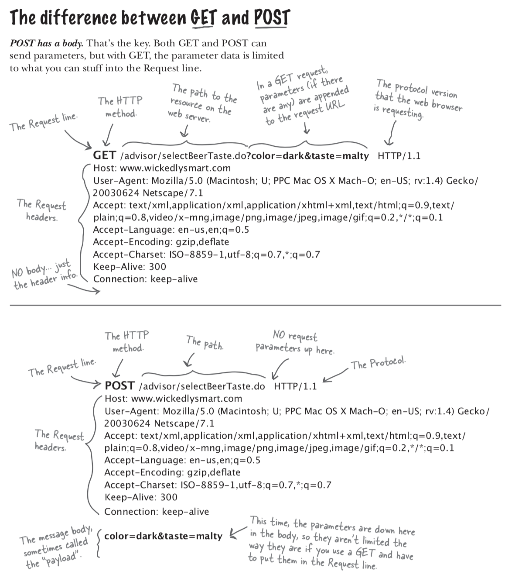<br>출처 : Head First Servlets & JSP</p>

* 둘 다 파라미터를 보낼 수 있다.
  * GET은 주소창 (URL기입란)에다가 보내야 한다.
    * 파라미터 데이터의 양이 제한되어 있다.
    * 파라미터가 모두 드러나므로, 보안에 안 좋다.
    * 서버에 어떤 변경을 가하기 위해서가 아닌 무엇을 가져오기 위해 사용하는 메서드
  * POST는 메시지 몸체에 싣어서 보낸다.
    * 파라미터 데이터의 양 제한이 없다.
    * 파라미터가 드러나지 않으므로, 비교적 보안에 좋다.
    * 서버에 어떤 변경을 가하기 위해서 사용하는 메서드.

<br>

### 4-3. 멱등(Idempotent)

* 멱등 : **여러번 적용하더라도 결과가 달라지지 않는 성질.**
  * 멱등은 동일한 작업을 한 번이고 두 번이고 계속해서 할 수 있다. (어떠한 부작용도 없이)
  * **되돌릴 수 있는 성질.**

<p align="center">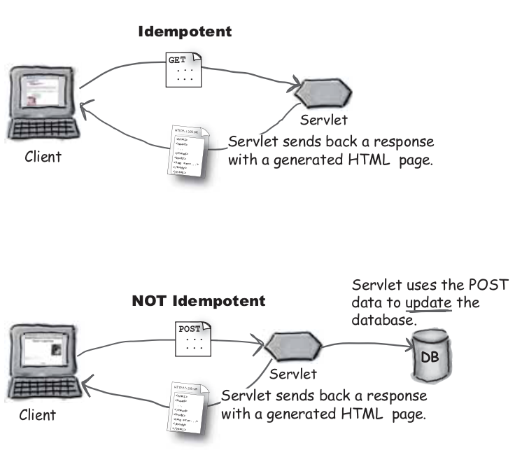<br>출처 : Head First Servlets & JSP</p>

* 아래 예제가 멱등을 잘 설명한다.

<p align="center">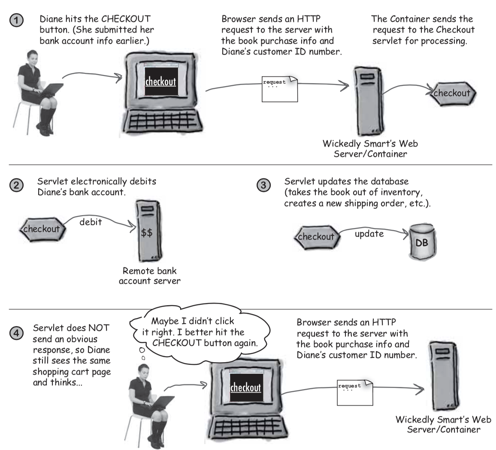<br>출처 : Head First Servlets & JSP</p>

1. '결제' 버튼을 클릭한다. ( 은행계좌정보를 인력하고선. )
   * 브라우저는 HTTP 요청을 책 구매정보와 사용자의 ID와 함께 서버로 전송한다.
   * 컨테이너는 결제(checkout)서블릿이 이를 처리해줄 것을 요청한다.
2. 서블릿은 사용자의 은행계좌에서 돈을 차감한다.
3. 서블릿은 DB를 업데이트한다. 
   * 재고목록에서 책을 빼내고, 새로운 배송주문을 생성하는 등.
4. 이때, 서블릿이 묵묵무답이다. 사용자는 여전히 결제화면만 보고 있다.
   * 사용자는 자기가 버튼을 눌렀는지 안 눌렀는지 고민하다 다시 한번 '결제' 버튼을 누른다.
5. 컨테이너는 결제 서블릿이 이를 처리해줄 것을 요청한다.
6. 서블릿으로서 사용자가 조금 전에 샀던 책을 또 산다고 해서 이상해 할 것이 없다.
7. 서블릿은 사용자의 은행계좌에서 돈을 차감한다.
8. 사용자의 거래 은행은 차감 요청을 받아들인다. 그러나 계좌 한도를 초과했기에 수수료도 같이 차감된다.
9. 결국 사용자는 주문 결과를 화면을 보고는 두 번 구매되었다는 사실을 발견한다.


> 트랜잭션 : DB상태를 변화시키기위해 수행하는 작업의 단위.

* GET은 멱등성을 만족한다.
* POST는 멱등성을 만족하지 못한다.
  * **POST로 전송되는 몸체의 정보는 트랙잭션을 위한 것이며, 이는 되돌릴 수 있는 성질이 아니다.**


> 서블릿에서 `doGet()`과 `doPost()` 둘 다 지원하려면 어떻게 해야 하는가?

<p align="center">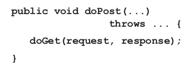<br>출처 : Head First Servlets & JSP</p>

* 요청에 데이터를 수정하는 것이 아니라면, `doGet()`을 구현하고 `doPost()`는 요청을 `doGet()`으로 넘기는 방식.

<br>

### 4-4. Request에서 얻을 수 있는 여러가지

`ServletRequest`와 `HttpServletRequest`인터페이스를 보면 이것저것 수많은 메서드들이 있다.

하지만, 실제 사용되는 것은 15%정도밖에 없다 한다.

* 클라이언트 플랫폼 정보 및 브라우저 정보
  * `String client = request.getHeader("User-Agent");`
* `Request`에 관련된 쿠기
  * `Cookie[] cookies = request.getCookies();`
* 클라이언트의 세션 정보
  * `HttpSession session = request.getSession();`
* `Request`의 HTTP 메서드
  * `String theMethod = request.getMethod();`
* `Request`의 입력 스트림
  * `InputStream input = request.getInputStream();`

<br>

> `Request`에 있는 입력 스트림은 언제 사용되는가?

* 몸체에 저장되어 보내지는 데이터 중 값이 엄청 큰 것들이 있다. 
* 문장이나 바이너리 컨텐츠를 포함하고 있는 `Request`몸체를 다루는 서블릿도 가능하다. 이를 위해서는 `getReader`나 `getInputStream`메서드를 사용해야 한다.

<br>

> getHeader()와 getIntHeader()의 차이점은?

* **헤더 정보는 항상 문자 값만 존재한다.**
  * 헤더 정보는 이름과 값의 쌍으로 이루어져 있다. 대부분은 문자 값이지만, 길이를 나타내는 헤더 정보

```java
// getHeader
String forwards = request.getHeader("Max-Forwards");
int forwardsNum = Integer.parseInt(forwards);

// getIntHeader
int forwards = request.getIntHeader("Max-Forwards");
```

<br>

> `getServerPort()`, `getLocalPort()`, `getRemotePort()`의 차이점은?

<p align="center">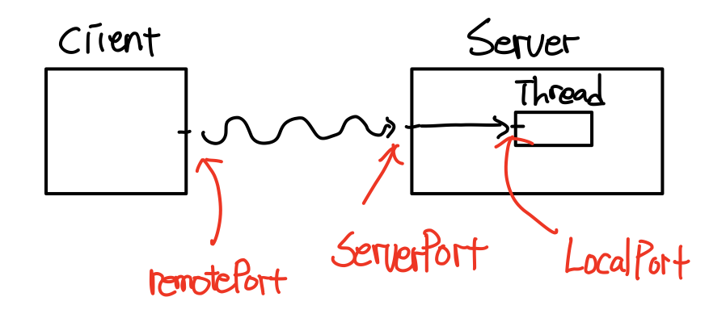</p>

* `getServerPost()`
  * request가 들어오는 port
  * 실제로 server가 listening에 사용하는 port (80이 대표적인 예)
* `getLocalPort()`
  * 실제로 여러 client의 request에 대응하기 위해 server의 thread가 사용하는 port
* `getRemotePort()`
  * server입장에서 "remote"인 client 측 port.

<br>

## 5. Response

대부분 클라이언트에 데이터를 전송하기 위하여 `Reponse`객체를 사용한다.

이를 위하여 `Response`객체의 `setContentType()`과 `getWriter()`메서드를 이용한다.

그 다음 스트림에 HTML을 작성하거나 아니면 다른 컨텐츠를 기록하거나 하는 I/O작업을 하면 된다.

이외에도 헤더 정보를 설정하거나, 오류를 발생시키거나, 쿠키를 추가할 때도 `Response`객체를 사용한다.

<br>

### 5-1. Response객체의 I/O 사용하기

출력 스트림으로 HTML만 보낼 수 있는 것은 아니다. 

클라이언트로 HTML말고 다른 것도 보낼수 있으며, 경우에 따라서 출력 스트림에 바로 내려보내는 것이 가장 이상적일 때도 있다.

> 스트림(stream)이란?
>
> * 컴퓨터 프로그램과 그 환경(입출력 장치)사이에 미리 연결된 입출력 통로를 가리킨다.
>   * 입력 스트림 - 키보드,마우스에서 프로그램으로 ( 프로그램대 프로그램도 가능하다. )
>   * 출력 스트림 - 프로그램에서 키보드, 마우스로 ( 프로그램대 프로그램도 가능하다. )
>   * 오류 스트림
>
> 출처: [Java 입력 스트림과 출력스트림](https://coding-factory.tistory.com/281)

<br>

#### 5-1-1. 클라이언트에 JAR파일을 전송한다면

<p align="center">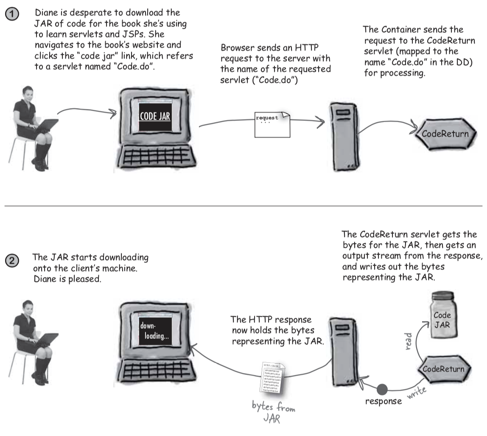<br>출처 : Head First Servlets & JSP</p>

1. 사용자는 Jar파일을 내려받기 위해 해당 링크를 클릭한다. (`Code.do`)
   * 브라우저는 `Code.do`라는 이름의 서블렛 대한 HTTP요청을 서버로 날린다.
   * 컨테이너는 DD를 뒤져보고 `Code.do`가 `CodeReturn`이라는 이름을 가진 서블릿에 매핑되어 있는 것을 보고 해당 서블릿에 처리를 요청한다.
2. CodeReturn서블릿은 JAR바이트를 읽어와서 이를 `Response`의 출력 스트림에다가 쓰기 작업을 한다.
   * HTTP `Response`에 JAR바이트가 들어있다.
   * 사용자의 PC로 JAR파일을 내려받고 있다.

<br>

> JAR를 내려받는 서블릿 코드

<p align="center">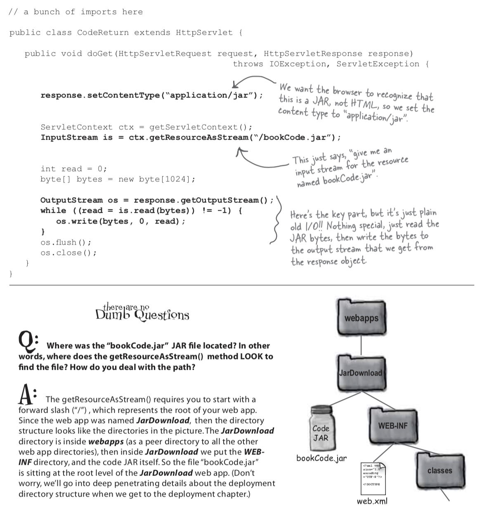<br>출처 : Head First Servlets & JSP</p>

* `response.setContentType("application/jar");`

  * 브라우저에게 지금 우리가 내려보내는 것이 JAR라는 사실을 알리기 위함.

* `InputStream is = ctx.getResourceAsStream("/bookCode.jar");`

  * `"자원/bookcode.jar"`파일을 입력 스트림으로 주세요라는 의미.

* ```java
  OutputStream os = response.getOutputStream();
  while((read = is.read(bytes)) != -1){
    os.write(bytes, 0, read);
  }
  ```

  * 핵심 코드이다. JAR바이트를 읽어, 출력 스트림에 바이트를 기록하는 I/O코드.

<br>

### 5-2. 컨텐츠 타입

<p align="center">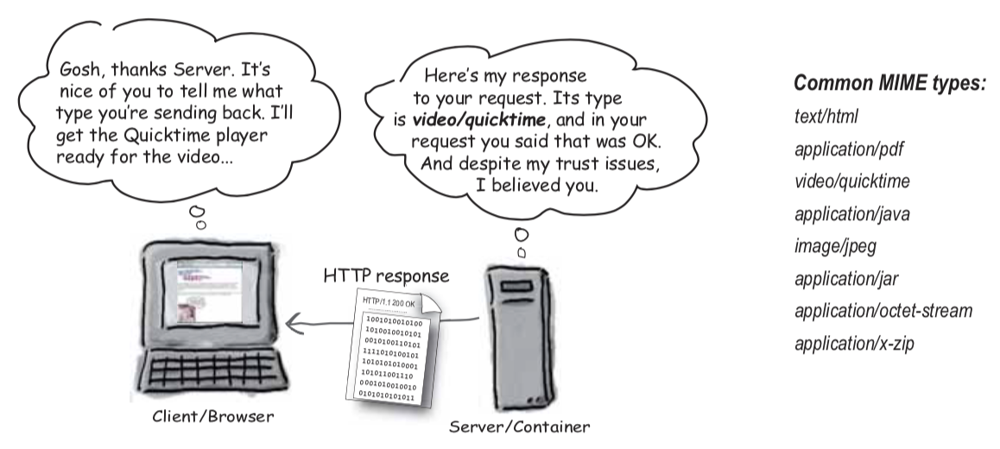<br>출처 : Head First Servlets & JSP</p>

`response.setContentType("application/jar");`

* **브라우저에게 지금 내려보내는 것이 무엇이다라는 것을 알려**주는 것이다. **( MIME이라고도 한다. )**
  * 그래야 브라우저가 이에 대한 대비를 한다.
    * PDF면 보기 프로그램을 실행한다든지
    * 비디오파일이면 비디오 플레이어를 실행한다든지
* **브라우저는 하나의 요청에 하나의 컨텐츠 타입만을 처리하도록 만들어져있다.**


> 제대로 프로그램이 돌아가도록 하려면, **`setContentType()`을 제일 먼저 호출하고, 그 다음 출력 스트림(`getWriter()`나 `getOuputStream()`)메서드를 호출하는 것이다.** 이렇게 할 때만 컨텐츠 타입과 출력 스트림의 충돌을 미연에 방지 할 수 있다.

<br>

#### 5-2-1. 컨텐츠 타입 관련 여러가지 질문

> 컨텐츠 타입은 왜 설정하는가? 그냥 파일확장자로 판단하면 될 것인데?

* **정적인 컨텐츠의 경우는 그렇게 해도 괜찮다.**
* 서블릿은 `Response`객체를 생성할 수 있는 능력이 있다. **컨테이너는 서블릿으로 무엇을 보내려고 하는지 설정해주기 전까지는 알 수가 없기 때문이다.**


> 출력 스트림을 사용하지 않고 그냥 웹서버에서 JAR파일을 보내면 되는데 왜 서블릿을 이용해 스트림으로 내려보내는가? 서블릿 없이도 JAR파일이 직접 클라이언트로 내려가게 서버를 설정할 수 있을텐데..

* 맞다. 웹서버에 확장자를 등록해두면(파일 디렉토리에). 사용자가 그냥 HTML링크만 클릭하면, 서버에 있는 다른 자원, 이미지나 텍스트 파일처럼 JAR파일도 클라이언트로 바로 내려가도록 할 수 있다.
* 하지만, 스트림으로 JAR데이터를 내려보내기 전에 뭔가를 해야하는 경우가 있기 때문에 서블릿으로 내려보내는 것이다.
  * 예를 들어, 여러 개의 JAR파일 중 어떤 파일을 내려보낼지 판단을 먼저 해야 한다든지
  * 예를 들어, JAR데이터를 실행시점에 만들어내야하는 경우
  * 예를 들어, JAR데이터를 스트림으로 내려보내고 난 뒤, 내려보냈다는 정보를 DB에 저장한다든지 등등.

<br>

### 5-3. 출력 방식

출력 방식에는 두 가지가 있다. **문자와 바이트**

사실 이 주제는 `java.io`의 기본적인 내용이기도 하다. ServletResponse인터페이스는 두 가지 스트림을 제공한다.

* 바이트를 출력하기 위한 `ServletOutputStream`
* 문자를 출력하기 위한 `PrintWriter`

<br>

#### 5-3-1. 문자

```java
PrintWriter writer = response.getWriter();
writer.println("some text and HTML");
```

* **텍스트 데이터를 출력할 때 사용한다.** 
* **물론 `OutputStream`으로 문자를 쓸 수 있지만, `PrintWriter`가 바로 문자를 사용하기 위해 만들어졌기에 편하다.**


> `PrintWriter`은 `ServletOutputStream`을 둘러싼 것이다. `PrintWriter`클래스 내부에 `ServletOutputStream`에 대한 참조를 가지고 있으며, `ServletOuputStream`을 사용해서 출력을 한다.

<br>

#### 5-3-2. 바이트

```java
ServletOutputStream out = response.getOutputStream();
out.write(aByteArray);
```

* 무엇이든 된다.

<br>

### 5-4. 헤더 값 설정

서블릿에서 클라이언트로 반환하는 헤더 값을 설정할 수 있다.


`response.addHeader("foo", "bar");`

* 이 메서드는 헤더명과 값이라는 두 개의 String을 인자로 받는다.
* 현재 존재하는 헤더에 값을 추가하는 메서드


`response.setHeader("foo", "bar");`

* 이미 존재하는 값은 덮어씌우고, 없다면 새로 만든다.


> `setHeader()`와 `addHeader()`의 차이
>
> * 이름 그대로 이미 헤더가 존재할 때 값을 설정(set)하느냐 아니면 추가(add)하느냐 이다.
>   * `setHeader()`는 이미 존재하는 값을 덮어 쓴다.
>   * `addHeader()`는 값을 하나 더 추가한다.


> **`setContentType("text/html")` = `setHeader("content-type","text/html");`**
>
> * setContentType은 그저 오타에러를 줄이기 위해 생겨난 메서드일 뿐이다.

<br>

## 6. 리다이렉트 (redirect)

<br>

### 6-1. 리다이렉트란?

가끔은 서블릿에서 응답을 하지 않을 수 있다.

요청에 대한 응답을 누가할지 선택할 수 있다는 말이다. **요청을 완전히 다른 URL로 방향을 바꿀 수 있다.**

이를 **리다이렉트**(redirect)라고 한다. 쉽게 얘기해 **URL 방향 바꾸기**이다.

<p align="center">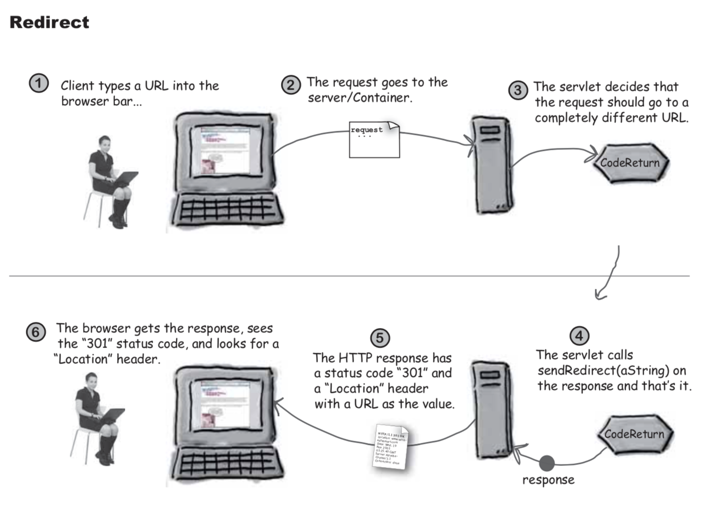<br>출처 : Head First Servlets & JSP</p>

1. 브라우저 주소 창에 URL 입력
2. 서버/컨테이너로 요청이 날아간다.
3. 서블릿은 요청을 다른 URL로 보내야하는 것임을 간파한 다음
4. Response객체의 `sendRedirect()`메서드를 호출한다. 이것으로 서블릿 임무는 끝이다.
5. **HTTP Response에 상태 코드 헤더에 301값과 `Location`헤더에 새로운 URL을 포함한다.**
6. **브라우저는 응답을 받은 다음, 상태 코드가 301임을 확인한 후 `Location`헤더 값이 무엇인지 확인하다.**

<p align="center">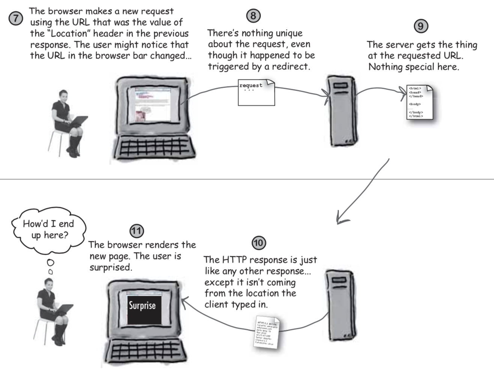<br>출처 : Head First Servlets & JSP</p>

7. `Location`값으로 받은 URL로 브라우저는 새로운 요청을 날린다. 
   * 사용자도 브라우저의 주소창의 값이 바뀌는 것이 보이기 때문에 이 사실을 알 수 있다.
8. 사실 새로 발생한 요청이 처음 요청과 비교해 다른 점은 없다. 단지 방향 바꾸기에 의해 생성된 요청이라는 것만 빼면..
9. 서버는 요청을 접수한다. 여기에도 뭐 별 특별한 것은 없다.
10. 다른 HTTP Response와 별반 다른 것이 없는 응답을 보낸다.
    * URL자체가 사용자가 입력한 값이 아니라는 것만 빼고는..
11. 브라우저는 리턴받은 내용을 화면에 출력한다.

<br>

### 6-2. 서블릿 리다이렉트는 브라우저가 이 작업을 한다.

방향 바꾸기 작업에서 서블릿은 별로 하는 일이 없다. 일단 방향을 바꾸겠다고 판단했다면, `sendRedirect()`메서드만 호출하면 모든 것이 끝난다.

```java
if(worksForMe) {
  // 요청을 핸들링
} else {
  response.sendRedirect("http://www.test.com"); // 브라우저로 돌려보낼 URL
}
```

* `sendRedirect()`의 URL은 상대 경로는 사용한다.

<br>

### 6-3. 여러가지 주의사항

1. `sendRedirect()`메서드는 매개변수로 URL객체가 아닌 `String`객체를 받는 것이다.

2. Response객체에 쓰기 작업을 한 뒤에 `sendRedirect()`를 할 순 없다.
   * 서블릿을 작성할 때, 요청을 스스로 처리할 것인지 `sendRedirect()`를 써서 다른 곳으로 돌릴 지 미리 결정해야 정신 건강에 이롭다..

<br>

## 7. 디스패치 (dispatch)

<br>

### 7-1. 디스패치란

> dispatch : 파견, 발송..
>
> * 디스패치는 클라이언트로부터 최초에 들어온 요청을 `JSP/Servlet`내에서 원하는 자원으로 요청을 넘기는(보내는) 역할을 수행하거나, 특정 자원에 처리를 요청하고 처리 결과를 얻어오는 기능을 수행하는 클래스이다.

**웹 애플리케이션에 있는 다른 컴포넌트(보통 JSP)에게 처리를 위임할 수 있는 것을 디스패치라고 한다.**

<p align="center">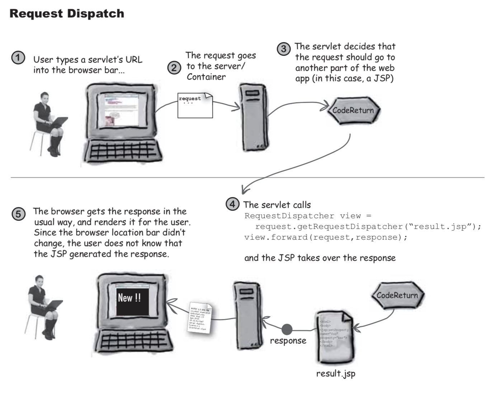<br>출처 : Head First Servlets & JSP</p>

1. 브라우저 주소창에 서블릿 URL을 입력한다.

2. 서버 컨테이너로 요청이 날아간다.

3. **서블릿이 보기에 이 요청은 웹 애프리케이션의 다른 컴포넌트 (지금 예에서는 JSP)가 처리해야 된다고 판단한 다음**

4. 서블릿은 **다음 코드**를 실행한다.

   * ```java
     RequestDispatcher view = request.getRequestDispatcher("result.jsp");
     view.forward(request, response);
     ```

5. 브라우저는 **평소와 같이 응답을 받고 화면에 출력한다.**

   * 리다이렉트처럼 브라우저 주소창의 값이 바뀌지 않는다. 
   * **브라우저는 JSP가 페이지를 만들었는지, 서블릿이 만들었는지 알 길이 없다.**

<br>

### 7-2. 디스패치와 리다이렉트의 차이점

<p align="center">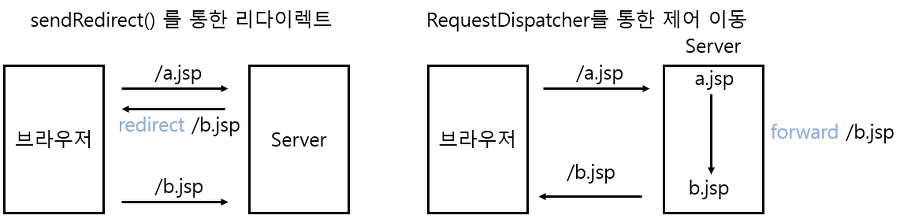<br>출처 : https://dololak.tistory.com/502</p>

* 리다이렉트는 `HTTP 리다이렉션`을 이용하기 때문에 하나의 요청 범위 안에서 처리를 하는 것이 아니라 브라우저에게 `Response`후 브라우저측에서 지정받은 요청 경로로 다시 재요청을 하는 방식이기에 두 번의 `HTTP 트랜잭션`이 발생하며, 서버측에서는 최초에 받은 요청중에 처리한 내용을 리다이렉트 된 요청안에서 공유 할 수 없는 문제가 있다.
  * 쿠키나 세션을 이용하는 방법이 있지만, 비효율적이다.

<br>

## 8. 리다이렉트와 디스패치

리다이렉트는 작업이 클라이언트에서 일어나지만, 요청 디스패치는 서버 상에서 작업이 일어난다.

* redirect = client
* dispatch = server

<p align="center"><br>출처 : Head First Servlets & JSP</p>

* **redirect : "제가 시간이 없어서 그런데, 다른 분한테 부탁해보겠어요? 다른 분들은 지금 시간이 있을거에요."**
  * 서블릿이 리다이렉트 하는 것은 마치 고객에게 다른 사람에게 전화하라고 부탁하는 것과 같다.
* **dispatch : "삥허씨. 제가 지금 바빠서 그런데, 제 고객 문제를 처리해주겠습니까? 어떻게 해야 하는지에 대한 내용은 바로 알려드릴게요!"**
  * 서블릿이 Request를 디스패치를 하는 것은 영업사원이 동료에게 자기 고객문제를 해결 해달라고 전화하는 것과 유사하다. 
  * 고객은 모른다. 자기가 요청한 것을 어떤 영업사원이 해결했는지.

