[Head First Servlets & JSP](http://www.yes24.com/Product/Goods/3301415?OzSrank=1)를 기초하여 작성한 자료입니다.

<br>

## 목차

- [속성과 리스너](#속성과-리스너)
  - [1. ServletConfig](#1-servletconfig)
    - [1-1. 초기화 파라미터](#1-1-초기화-파라미터)
    - [1-2. 서블릿 초기화가 된 다음에야 서블릿 초기화 파라미터를 사용할 수 있다.](#1-2-서블릿-초기화가-된-다음에야-서블릿-초기화-파라미터를-사용할-수-있다)
    - [1-3. 컨테이너가 서블릿을 초기화할 때 단 한번만 서블릿  초기화 파리미터를 읽는다.](#1-3-컨테이너가-서블릿을-초기화할-때-단-한번만-서블릿--초기화-파리미터를-읽는다)
    - [1-4. ServletConfig 테스트](#1-4-servletconfig-테스트)
  - [2. ServletContext](#2-servletcontext)
    - [2-1. Context란?](#2-1-context란)
    - [2-2. 웹 애플리케이션의 Context](#2-2-웹-애플리케이션의-context)
    - [2-3. ServletContext와 ServletConfig의 차이](#2-3-servletcontext와-servletconfig의-차이)
    - [2-4. ServletConfig는 서블릿 당 하나 ServletContext는 웹 애플리케이션 당 하나](#2-4-servletconfig는-서블릿-당-하나-servletcontext는-웹-애플리케이션-당-하나)
    - [2-5. ServletContext가 하는 일은?](#2-5-servletcontext가-하는-일은)
    - [2-6. ServletContext의 한계](#2-6-servletcontext의-한계)
  - [3. ServletContextListener](#3-servletcontextlistener)
    - [3-1. ServletContextListener의 역할](#3-1-servletcontextlistener의-역할)
    - [3-2. ServletContextListener 예제](#3-2-servletcontextlistener-예제)
      - [3-2-1. Dog객체](#3-2-1-dog객체)
      - [3-2-2. 컨텍스트 리스너 작성 및 사용하기](#3-2-2-컨텍스트-리스너-작성-및-사용하기)
      - [3-2-3. 예제의 전체적인 그림](#3-2-3-예제의-전체적인-그림)
    - [3-3. 여러 리스너들](#3-3-여러-리스너들)
  - [4. 속성](#4-속성)
    - [4-1. 정확히 속성이라는 것은 무엇인가?](#4-1-정확히-속성이라는-것은-무엇인가)
    - [4-2. 속성은 파라미터가 아니다](#4-2-속성은-파라미터가-아니다)
    - [4-3. 세 가지 생존범위](#4-3-세-가지-생존범위)
    - [4-4. 속성 API](#4-4-속성-api)
    - [4-5. 속성의 스레드-안전 문제](#4-5-속성의-스레드-안전-문제)
      - [4-5-1. 스레드-안전 문제란](#4-5-1-스레드-안전-문제란)
      - [4-5-2. Context 생존범위는 스레드-안전하지 않다.](#4-5-2-context-생존범위는-스레드-안전하지-않다)
      - [4-5-3. 컨텍스트 속성을 스레드-안전하게 하는 방법](#4-5-3-컨텍스트-속성을-스레드-안전하게-하는-방법)
      - [4-5-4. 세션 속성도 스레드 안전하지 않다.](#4-5-4-세션-속성도-스레드-안전하지-않다)
      - [4-5-5. 단지 Request속성과 지역 변수만이 스레드 안전하다](#4-5-5-단지-request속성과-지역-변수만이-스레드-안전하다)
  - [5. Request속성과 Request 디스패칭](#5-request속성과-request-디스패칭)
    - [5-1. Request속성과 Request디스패칭](#5-1-request속성과-request디스패칭)
    - [5-2. RequestDispatcher](#5-2-requestdispatcher)

<br>

# 속성과 리스너

웹 애플리케이션은 서비스를 제공하기 위하여 많은 컴포넌트들이 함께 협업한다.

* 모델
* 컨트롤러
* 뷰
* 파라미터
* 속성
* 도우미 ( Helper )클래스

이러한 컴포넌트들을 어떻게 서로 묶어 줄까?? 아래와 같은 질문을 할 수 있다.

* 만약 공유해야 할 정보가 있다면 어떻게 해야하지?
* 정보를 숨겨야 한다면?
* 스레드 안전을 보장하려면?

이걸 어떻게 하느냐가 개발 속도나 개발 효율성에 있어서 큰 역할을 한다.

<br>

## 1. ServletConfig

<p align="center">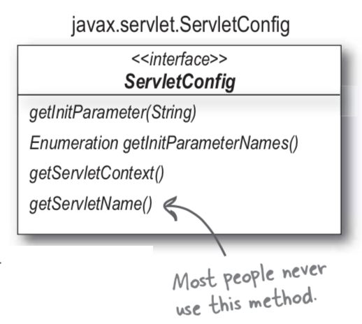<br>출처 : Head First Servlets & JSP</p>

<br>

### 1-1. 초기화 파라미터

만약 **서블릿 클래스나 HTML에 나의 이메일을 이용하거나 출력해야 한다면 어떻게 해야 할까?**

처음 드는 생각은 **"하드코딩"**이다. 하지만 **"하드코딩"을 하게 된다면 보안과 유지보수측면에서 불리하다.**

**서블릿에서는 이를 DD(`web.xml`)안에 넣어서 해결한다.**

<p align="center">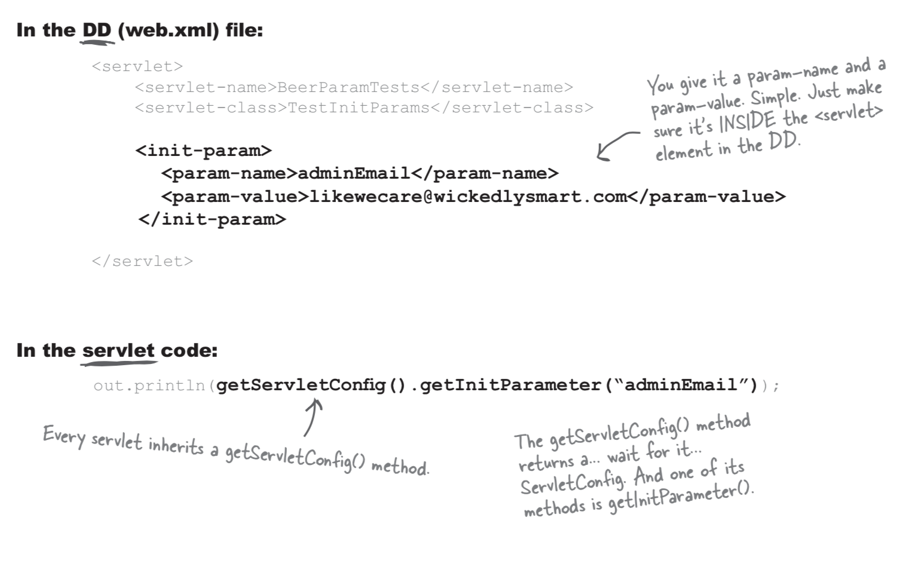<br>출처 : Head First Servlets & JSP</p>

* DD의 `<servlet>`항목 안에 `<param-name>`과 `<param-value>`로 작성한다.
* **모든 서블릿에는 상속받은 `getServletConfig()`가 있다.**

<br>

### 1-2. 서블릿 초기화가 된 다음에야 서블릿 초기화 파라미터를 사용할 수 있다.

**서블릿에는 상속받은 `getServletConfig()`메서드가 있다.**

메서드가 리턴한 `ServletConfig`객체에 대한 참조로 `ServletConfig`의 메서드를 호출할 수 있게 된다.

그러나 서블릿생성자에서는 이 메서드를 호출할 수 없다. 서블릿의 일생을 잘 훑어보면 너무 일찍 호출했기 때문이다.

**컨테이너가 서블릿의 `init()`을 호출하고 난 다음에야, 서블릿은 서블릿의 정체성을 갖는다.**

> `ServletConfig()`객체가 인스턴스화되는 시점은?
>
> * **컨테이너가 서블릿을 만들 때, DD 내용을 읽으면서 인스턴스를 한다고 한다.**
> * 정확한 시점은 ?
>   * 컨테이너가 처음 실행 할 때인데, 정확한 시점은 모르겠다...( 1-3 참고 )
>   * **컨테이너가 서블릿의 `init()`메서드를 호출하기 전인건 확실하다.**
>     * init()의 매개변수로 `ServletConfig`객체를 받기 때문이다.

<br>

<p align="center">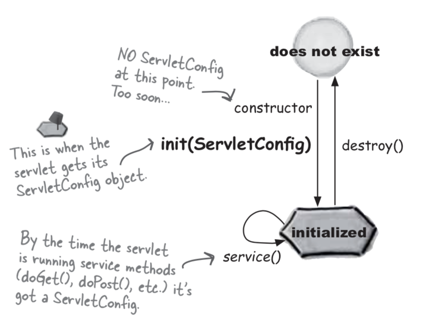<br>출처 : Head First Servlets & JSP</p>

* 컨테이너가 서블릿을 초기화할 때, **서블릿마다 하나씩 `ServletConfig`를 생성한다.**
* **컨테이너는 DD에서 서블릿 초기화 파라미터를 읽어, 이 정보를 `ServletConfig`로 넘겨준다.**
  * 그 다음, **`ServletConfig`를 서블릿의 `init()`메서드에 제공한다.**


> `init()`은 재정의가 가능하다. 그럼 `init`에서 `ServletConfig`를 매개변수로 받는 것은 무엇인가?
>
> * 재정의하는 `init()`메서드는 인자가 없는 것이다. **슈퍼 클래스인 `GenericServlet`에는 두 개의 `init()`메서드가 있으며, 하나는 `ServletConfig`를 인자로 하는 것이고, 다른 하나는 재정의를 편하게 하기위해서 인자가 없는 것이다.**
> * **`init(ServletConfig)`메서드는 그 내부에서 인자가 없는 `init()`메서드를 호출한다.**
> * 그러므로 개발자는 재정의할 것이 있으면 `init()`에 재정의하면 된다. 컨테이너가 자동으로 `init(ServletConfig)`를 실행하면 그 내부에서 개발자가 재정의한 `init()`도 실행하게 된다.
>
> ```java
> init(ServletConfig config){
>   ...
>   init();
>   ...
> }
> ```

<br>

### 1-3. 컨테이너가 서블릿을 초기화할 때 단 한번만 서블릿  초기화 파리미터를 읽는다.

**컨테이너가 서블릿을 만들 때, DD를 읽어 이름/값의 쌍으로 `ServletConfig`를 생성한다.**

**컨테이너는 이 초기화 파라미터를 두 번 다시 읽지 않습니다. 이름/값의 쌍이 `ServletConfig`안에 기록이 되면, 서블릿이 다시 배포되지 않는 한 DD를 수정한다고 바뀌지 않는다.**

<p align="center">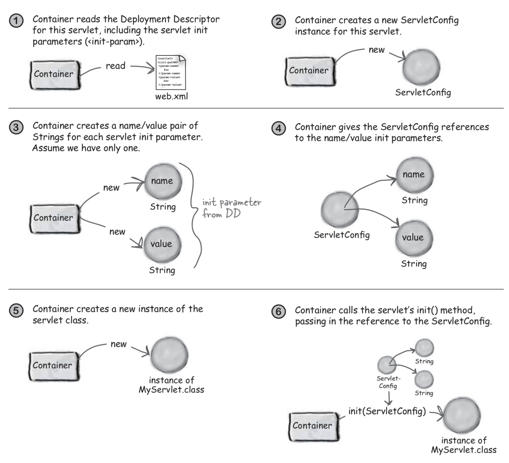<br>출처 : Head First Servlets & JSP</p>

1. **컨테이너는 배포 서술자(DD)를 읽는다**. 물론 초기화 파라미터(`<init-param>`)도 읽는다.
2. **컨테이너는 새로운 `ServletConfig`인스턴스를 만든다.**
   * **서블릿당 하나씩 만든다.**
3. **컨테이너는 초기화 파라미터에 있는 값들을 이름/값의 쌍의 형식으로 읽어들인다.** 여기서는 하나의 쌍만 있다고 가정한다.
4. **컨테이너는 `ServletConfig`객체에 이름/값으로 된 초기화 파라미터를 설정한다.**
5. **컨테이너는 서블릿 클래스 인스턴스를 생성한다.**
6. **컨테이너는 `ServletConfig`의 참조를 인자로 서블릿의 `init()`메서드를 호출한다.**

> **컨테이너가 서블릿 초기화 파라미터(`ServletConfig`)를 한 번만 읽기 때문에, 서블릿이 살아있는 동안에는 수정할 수가 없다.**
>
> 하지만 여러 툴로 인해 톰캣을 내리지 않고 하는 방법이 존재하기는 하다.

<br>

### 1-4. ServletConfig 테스트

**`ServletConfig`의 가장 큰 역할은 바로 초기화 파라미터(DD에서 서블릿에 설정한 값)에 접근할 수 있는 능력이 있다는 것이다.**

또한, **`ServletConfig`는 컨텍스트 정보(서블릿 설정 정보)를 쥐고 있는 `ServletContext`를 리턴하는 메서드를 제공한다.**

<p align="center">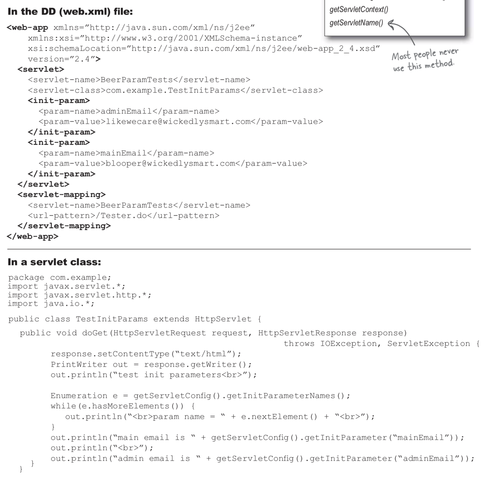<br>출처 : Head First Servlets & JSP</p>

* **DD에서 `<servlet>`안에 `<init-param>`을 해주고, 서블릿 클래스 안에서 `getServletConfig.getInitParameterName("name");`으로 값을 가져올 수 있다.**

<br>

> **JSP에서는 서블릿 초기화 파라미터(`ServletConfig`)에 어떻게 접근하는가?**
>
> * `ServletConfig`는 말 그대로 서블릿 설정이다. 
>
> * DD에 있는 서블릿 초기화 파라미터 정보를 웹 애플리케이션의 다른 컴포넌트와 공유하려면, 몇 가지 작업을 해야한다. **한가지 방법으로는 `Request`객체를 사용하는 것이다.**
>
>   <p align="center">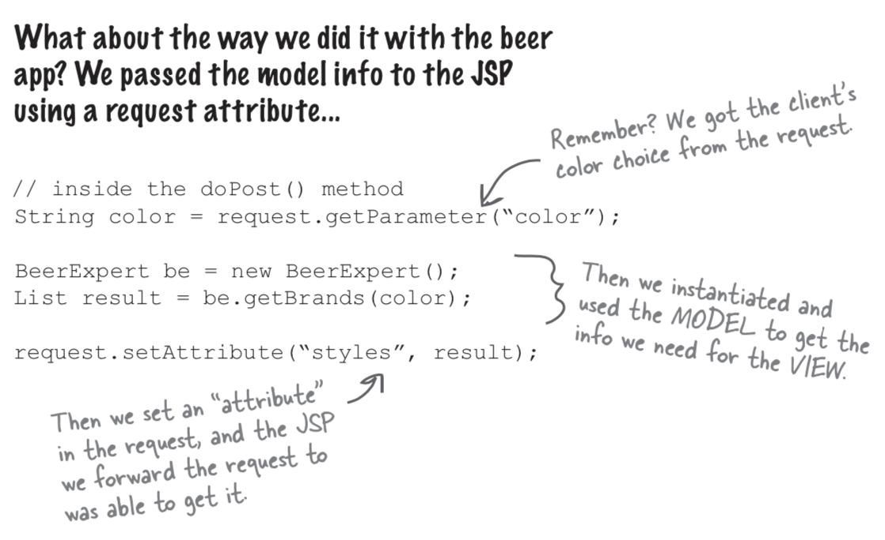<br>출처 : Head First Servlets & JSP</p>
>
>   * **서블릿안에서 `ServletConfig`의 정보를 가지고 와서 `Request`에 저장하고 JSP로 디스패치해주면 된다.**
>   * 하지만 **`ServletConfig`는 컨테이너가 처음 초기화 될 때 사용하는 상수개념**이고, **`Request`는 사용자의 요청내용이 들어있는 지속적인 정보**이므로 이 방법이 많이 사용될 것 같지는 않다.

> **위와 같이 `ServletConfig`의 정보를 다른 컴포넌트(JSP)와 정보를 교류하는 것은 매우 귀찮아 진다.**
>
> **그러므로 그보다 큰 그림을 그리는 `ServletContext`객체가 있다.**

<br>

## 2. ServletContext

서블릿에만 적용되는 초기화 파라미터말고, 웹 애플리케이션 전체에서 공유하는 객체는 무엇인가?

바로 `ServletContex`t다. **웹 애플리케이션의 모든 컴포넌트에서 공유하는 게시판 같은 존재이다.**

<br>

### 2-1. Context란?

* **사용자와 다른 사용자, 사용자와 시스템 또는 디바이스간의 상호작용에 영향을 미치는 사람, 장소, 개체등의 현재 상황(상태)를 규정하는 정보들을 말한다.**
  * **운영체제에서 Context는 CPU가 해당 프로세스를 실행하기 위한 해당 프로세스의 정보들이다. PCB에 저장된다.**
    * 프로세스 상태 : 생성, 준비, 수행, 대기, 중지
    * 프로그램 카운터 : 프로세스가 다음에 실행할 명령어 주소
    * 레지스터
    * 프로세스 번호

> Context Switching
>
> * **멀티프로세스 환경에서 CPU가 어떤 하나의 프로세스를 실행하고 있는 상태에서 인터럽트 요청에 의해 다음 우선 순위의 프로세스가 실행되어야 할 때 기존의 프로세스의 상태 또는 레지스터 값(Context)을 저장하고, CPU가 다음 프로세스를 수행하도록 새로운 프로세스의 상태 또는 레지스터 값(Context)를 교체하는 작업.**

> 출처 : https://jeong-pro.tistory.com/93

<br>

### 2-2. 웹 애플리케이션의 Context

**컨텍스트(Context) 초기화 파라미터의 작동 방식은 서블릿 초기화 파라미터와 동일하다.**

그러나 **컨텍스트(Context)초기화 파라미터는 특정 하나의 서블릿만 사용하는 것이 아니라 모든 웹 애플리케이션에서 이용할 수 있다는 차이가 있다.**

**웹 애플리케이션에 있는 모든 JSP, 서블릿에서 별다른 코딩 없이도 컨텍스트 초기화 파라미터 정보에 접근할 수 있다.**

<p align="center">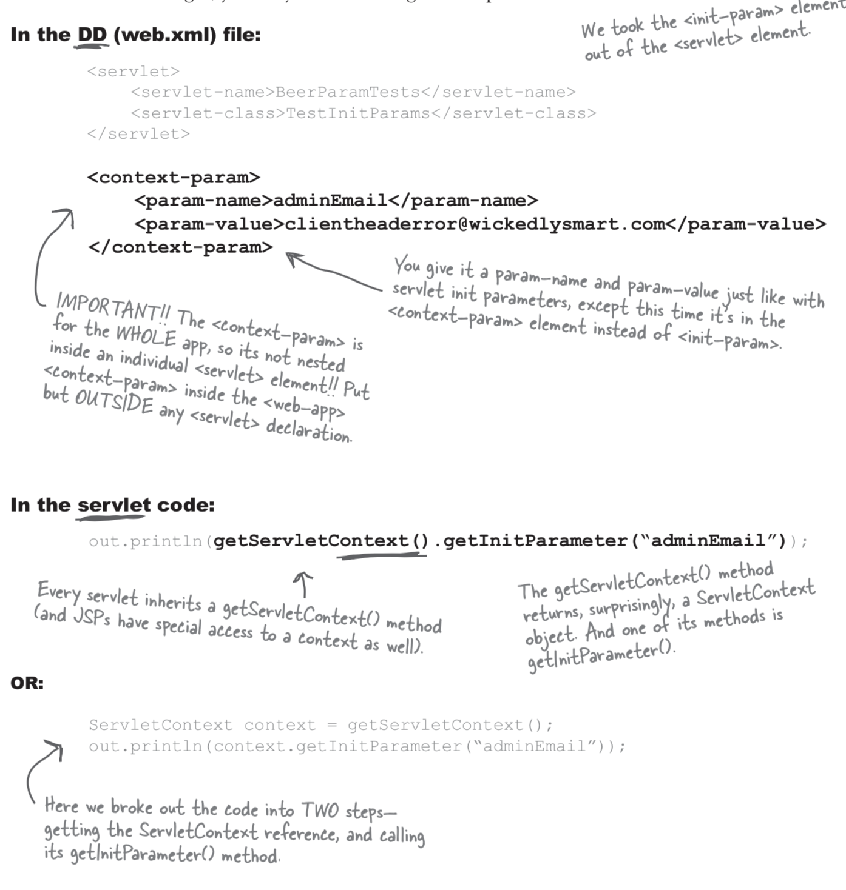<br>출처 : Head First Servlets & JSP</p>

* **`<context-param>`은 `<servlet>`밖에 위치한다**
  * `<context-param>`은 전체 애플리케이션을 위한 항목이기 때문이다.
* **컨텍스트객체의 정보를 가져오기 위해서는 `getServletcontext()`를 이용해 Context의 참조 값을 가져온다.**
* **컨테이너 실행시 생성되고 컨테이너 종료시 소멸된다.**

<br>

### 2-3. ServletContext와 ServletConfig의 차이

<p align="center">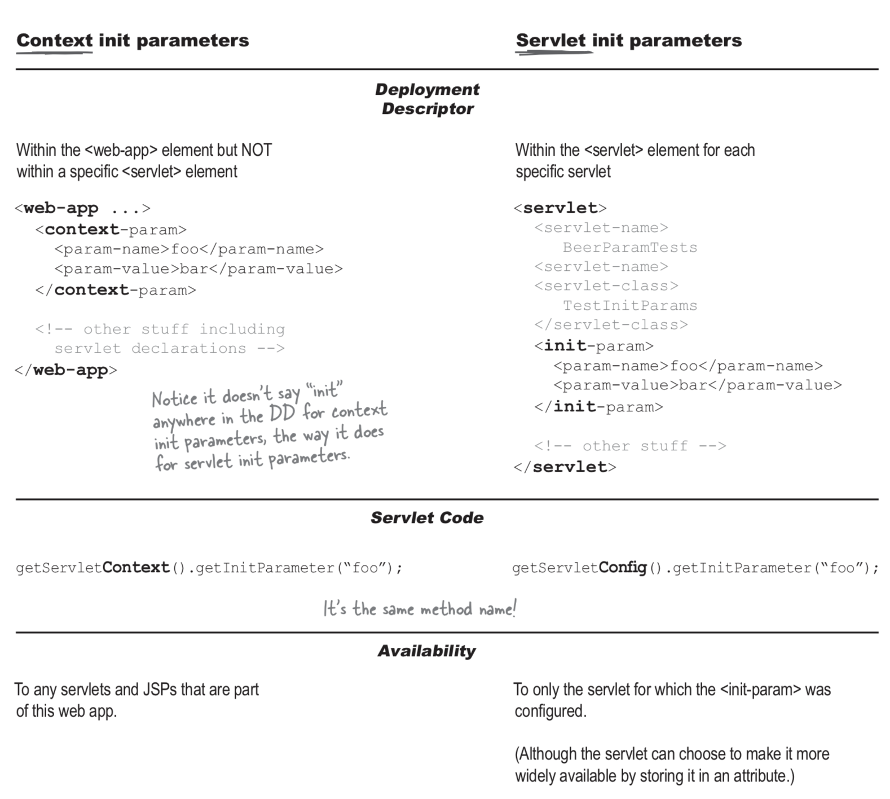<br>출처 : Head First Servlets & JSP</p>

* 서블릿 초기화 파라미터 : `ServletConfig`
  * **`<init-param>`항목을 포함하고 있는 서블릿만 ( 서블릿안에서만 )**
  * 서블릿 코드 안에서 이 값을 속성(Attribute)에 저장하여 다른 컴포넌트에서도 이용 가능하게 만들 수 있다.
* 컨텍스트 초기화 파라미터 : `ServletContext`
  * **웹 애플리케이션에 존재하는 어떤 서블릿이나 JSP 모두 접근이 가능하다.**

<br>

> 1. 동일 웹 애플리케이션에서 `ServletContext`와 `ServletConfig`에 저장된 파라미터의 이름이 같은 경우는?
>    * **`ServletContext`와 `ServletConfig`는 서로 다른 객체며, 동일한 이름을 사용하더라도, 서로 다른 이름 공간을 사용하기에 충돌이 일어나지 않는다.**
>
> 
>
> 2. 실행 중에 이 값(DD 혹은 Context)을 설정할 수 있나요? 동적으로 이 값들을 설정할 수 있게 지원하는 API같은것?
>    * 불가하다.
>    * **ServletContext API문서를 보면 참조자(getter)만 있고, 설정자(setter)는 없다.**
>      * **그래도 속성(Attribute)를 설정하는 것은 있다. `setAttribute()`, 단 컨테이너를 종료하고 다시 키면 당연히 속성은 사라진다.**

<br>

### 2-4. ServletConfig는 서블릿 당 하나 ServletContext는 웹 애플리케이션 당 하나

**웹 애플리케이션은 오직 하나의 `ServletContext`으로 전체 웹 애플리케이션에서 정보를 공유한다.** 

**그러나, 웹 애플리케이션 안에 있는 서블릿은 자신만의 `ServletConfig`를 가진다.**

<p align="center">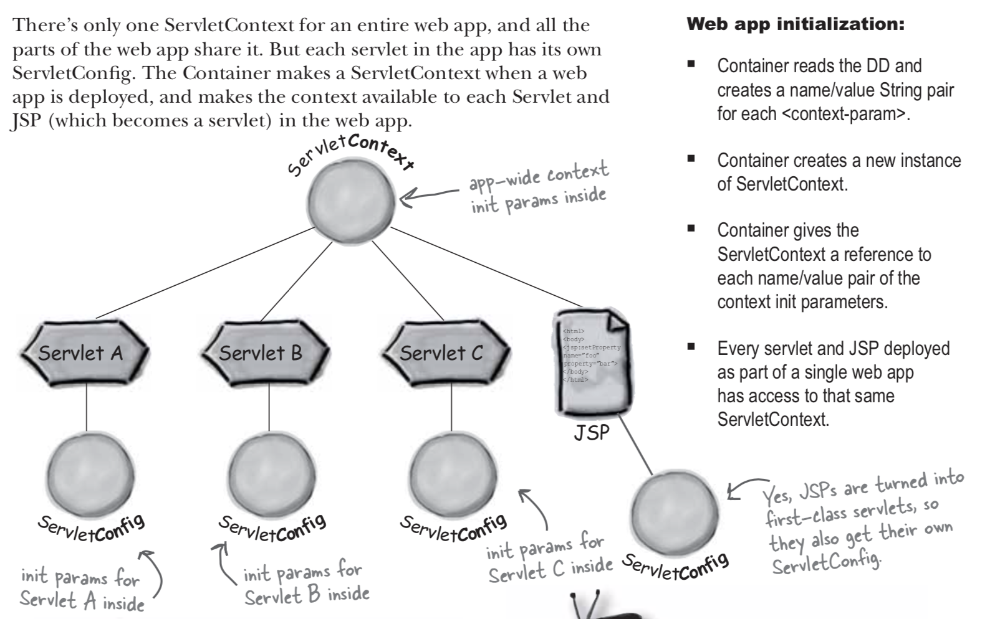<br>출처 : Head First Servlets & JSP</p>

* `ServletContext` 초기화
  1. 컨테이너는 DD에 있는 `<context-param>`항목을 읽고 각각의 이름/값의 쌍을 만든다.
  2. 컨테이너는 `ServletContext`객체를 하나 생성한다.
  3. 컨테이너는 생성한 `ServletContext`객체의 참조값을 `init`메서드 인자로 넘긴다.
  4. 현재 웹 애플리케이션에 있는 모든 서블릿과 JSP는 바로 이 `ServletContext`에 접근 할 수 있다.


> **JSP도 자신의 서블릿이 있으며, 해당 서블릿도 `ServletConfig`를 가진다.**


> **애플리케이션이 배포 실행되고 있다면, `ServletContext`는 JVM당 하나이다.**
>
> * 분산 환경에서 `ServletContext`는 JVM당 하나로 하는게 좋다.
> * 물론, 개발자마다 다르게 개발할 수는 있다.


> **초기화 파라미터를 배포 시 정해진 상수라고 생각하면 쉽다.**
>
> **실행시에 이 값을 읽을 수는 있지만, 수정할 수는 없다. `setInitParameter()`는 없다.**

<br>

### 2-5. ServletContext가 하는 일은?

<p align="center">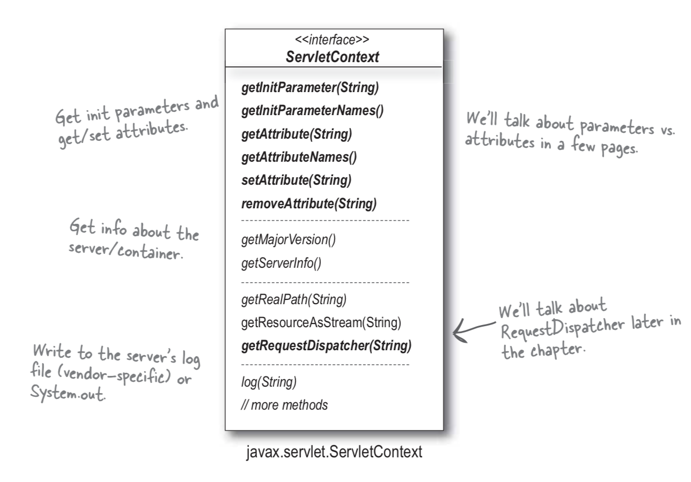<br>출처 : Head First Servlets & JSP</p>

<p align="center">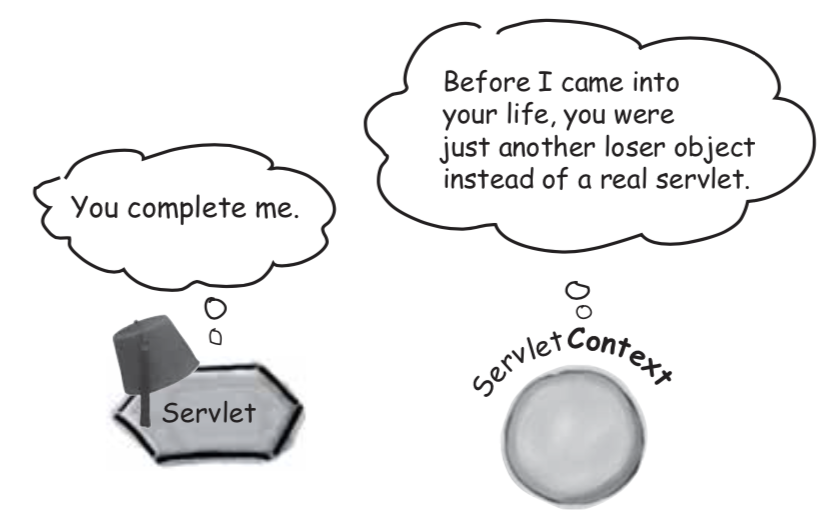<br></p>

* **`ServletContext`는 JSP나 서블릿을 컨테이너 또는 다른 웹 애플리케이션과 연결하는 끈이라고 할 수 있다.**
* 또한, 서블릿은 `ServletContext`를 가져야만 진정한 서블릿으로써 역할을 하게 된다.
* **웹 어플리케이션 단위로 컨텍스트가 생성되는 이유는 서블릿 컨테이너가 웹 어플리케이션 단위로 모든 자원들을 관리할 수 있도록 하기 위해서이다.**
  * **하나의 웹 애플리케이션 = 프로세스 ( OS 관점으로 봐도 무방하다. )**
  * 분산 처리를 한다면, 여러 웹 애플리케이션이 하나의 CPU를 가지고 인터럽트 하듯이 `ServletContext`도 한 프로세스의 Context라고 봐도 될 것같다.
* 로그 파일 기능

<br>

> 1. 어떻게 웹 애플리케이션에서 `ServletContext`에 접근 할 수 있는가?
>    * **서블릿의 경우, 상속(`HttpServlet`으로부터)받는 `getServletContext()`메서드를 호출한다.**
>    * JSP의 경우는 내장된 객체중 `ServletContext`가 들어 있다. 이것은 뒤에 JSP에서 더 자세히 다룬다.
>    * **HttpServlet이 ServletConfig를 가지고 있고, ServletConfig를 통해서 ServletContext에 접근해도 된다.**

<br>

> `ServletConfig`객체는 `ServletContext`객체를 가지고 있다. 
>
> **하지만 `ServletConfig`를 거쳐서 `ServletContext`를 참조할 경우는 `HttpServlet`이나 `GenericServlet`을 상속받지 않고 서블릿을 구현할 때뿐이다. 즉, 거의 사용을 안한다.**
>
> **일반적으로 `ServletContext`를 참조하기 위해서는 `GenericServlet`의 `getServletContext()`를 많이 사용한다.**

<br>

### 2-6. ServletContext의 한계

**`Context`파라미터에는 `String`밖에 저장할 수 없다**. `Dog`라는 객체를 `XML` 배포 서술자에 넣을수 없기 때문이다.

* **만약 모든 서블릿이 데이터베이스 `Connection` 객체를 공유하고 싶을 때는 어떻게 해야하는가?**
  * `Context`에는 객체를 저장할 수 없기 때문에 파라미터에 검색명(lookup name)을 저장하는 것으로 해결한다.

* 그럼 누가 `String`인 검색명을 실제 객체로 바꾸는가??
  * **이게 바로 `ServletContext`의 한계이다. 그저 `String`인 값을 저장하는 용도로만 사용된다.**

<br>

> 웹 애플리케이션에도 `main()`처럼 제일 먼저 실행되는 메서드가 있다면, `Context` 파라미터를 가져와서 객체를 만들면 되는 일이다.
>
> 이때 사용되는 것이 바로 리스너이다.

<br>

## 3. ServletContextListener

웹 애플리케이션이 처음 시동이 될 때, **누군가가 `ServletContext`에 저장되어 있는 `DB`정보를 가져와 `DB Connection` 객체를 생성해주면 모든 서블릿이 공유할 수 있게 되며 효율적인 구조가 완성된다.**

이때 사용하는 것이 바로 컨텍스트 초기화 이벤트를 리스닝하는 것이다.

**이를 이용하면 컨텍스트 초기화 파라미터를 읽은 다음, 애플리케이션이 클라이언트에게 서비스하기 전에 특정 코드를 실행할 수 있다.**


> 서블릿으로 하면 안되는 것인가?
>
> * 서블릿은 누가 처음에 실행될 지 모르기 때문에 하나를 고를 수 없다.


> 쉽게 얘기해서, WAS가 처음 시동될 때 `ServletContext`가 DD를 읽어오면서 `Context `파라미터를 읽어온다.
>
> 이때 `ServletContext`라는 이벤트가 발생하고, `Listener`가 특정 코드를 실행시키는 것이다.
>
> * DB 커넥션
> * 웹 애플리케이션에 필요한 공용 객체등

<br>

### 3-1. ServletContextListener의 역할

WAS가 처음 실행 시 `DB Connection` 같은 코드를 실행해야 할 때, 우리가 원하는 것은 서블릿도 JSP도 아닌 "클래스"가 필요하다.

이 클래스는 다음의 두 가지에 귀 기울이고 있어야 한다.

* `ServletContext` 이벤트의 초기화(생성)
* `ServletContext` 이벤트의 소멸

<p align="center">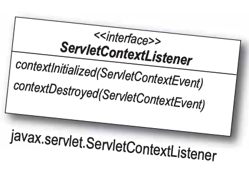</p>

<p align="center">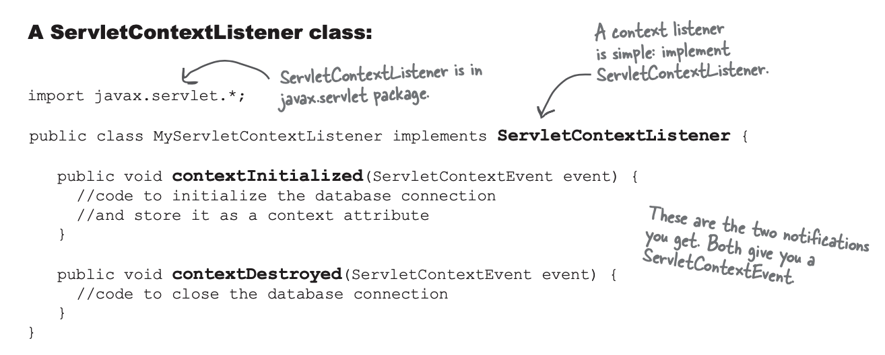<br>출처 : Head First Servlets & JSP</p>

**다음의 기능을 가진 클래스를 원한다.**

* 컨텍스트가 초기화(애플리케이션이 배포)되는 걸 알아차릴 수 있어야 한다.
  * ServletContext로부터 컨텍스트 초기화 파라미터를 읽는다.
  * 데이터베이스를 연결하기 위하여 초기화 파라미터 검색명(lookup name)을 사용한다.
  * 데이터베이스 Connection 객체를 속성(Attribute)에 저장한다.
* 컨텍스트가 종료(애플리케이션 서비스가 내려가는)되는 걸 알아차릴 수 있어야 한다.
  * 데이터베이스 연결을 닫는다.


> 이제 어떻게 이 클래스(`MyServletContextListener`)를 등록하는지 궁금해진다.
>
> 누가 이 클래스를 인스턴스화 하는가??

<br>

### 3-2. ServletContextListener 예제

이번 예제는 `ServletContextListener`를 만들고 실행시키는 예제이다.

* String초기화 파라미터를 실제 객체(`Dog`)로 전환하는 예제이다.
* **실제 개발할 콜백 메서드를 코딩하는 순서와 동일하다.**

<br>

#### 3-2-1. Dog객체

이번 예제에서 리스너는 컨텍스트 초기화 파라미터에서 개의 품종을 확인한 다음(비글, 푸등 등등)

이 값을 Dog객체 생성자로 인자로 사용하여 Dog를 생성한다.

그 다음, 리스너는 Dog객체를 ServletContext 속성에 묶어 두는 작업을 한다. (참조변수)

그럼 모든 서블릿에서 Dog 객체를 읽어올 수 있게 된다.


> 초기화 파라미터(ServletContext)로 객체를 생성할 수 있다는 것과 이 객체를 모든 애플리케이션에서 공유할 수 있다는 것이 중요하다.

<br>

#### 3-2-2. 컨텍스트 리스너 작성 및 사용하기

>  컨테이너가 어떻게 리스너를 찾아서 실행하는가??
>
> * 웹 애플리케이션을 컨테이너가 인식하게 하기 위하여 배포 서술자 `web.xml`에 등록하는 것과 마찬가지로 리스너도 `web.xml`에 서술해놓는다.
> * DD에 써 놓으면 컨테이너가 알 수 있다.


**`ServletContext`이벤트를 리스닝하기 위해서는 `ServletContextListener`인터페이스를 구현해야 한다.**

**그 다음 컴파일된 파일을 `WEB-INF/classes`디렉토리에 배포하고, 배포 서술자 `web.xml`에 `<listener>`항목을 추가하여 컨테이너에게 이런 놈이 있다는 것을 알려줘야 한다.**

<p align="center">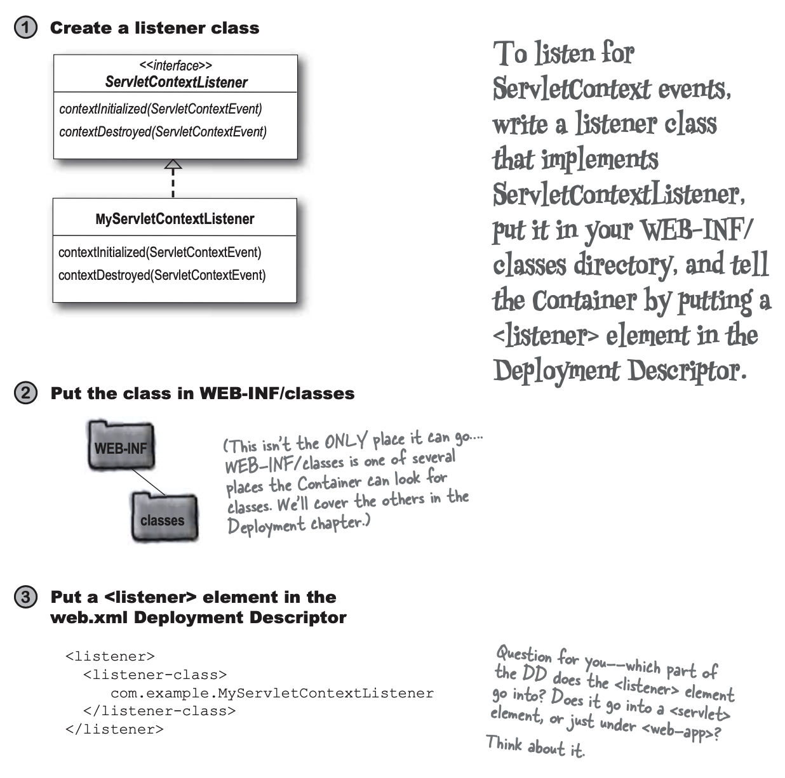<br>출처 : Head First Servlets & JSP</p>

1. 리스너 클래스 생성
2. `WEB-INF/classes`에 클래스 배포
3. 배포 서술자 `web.xml`에 `<listener>`항목 추가

<br>

**3개의 클래스와 하나의 DD가 필요하다**

컨텍스트 리스너를 테스트하려면 클래스와 `web.xml`을 작성해야 한다.

<p align="center">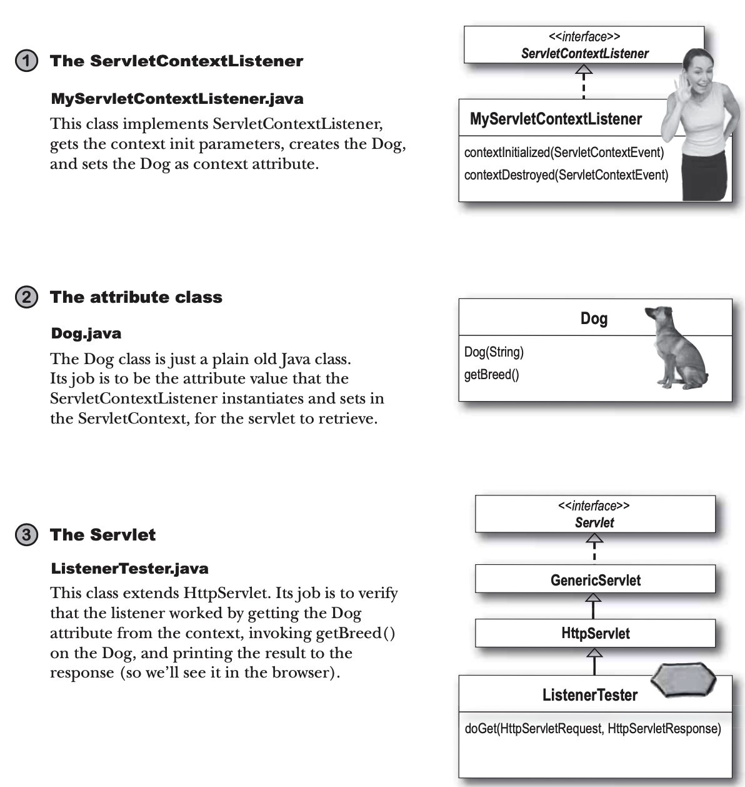<br>출처 : Head First Servlets & JSP</p>

1. The ServletContextListener
   * `MyServletContextListener.java`
     * `ServletContextListener`를 구현한 클래스이다.
     * 컨텍스트 초기화 파라미터를 읽어, `Dog` 객체를 생성하고 이를 컨텍스트 속성에 묶어 둔다.
2. 속성(Attribute) 클래스
   * `Dog.java`
     * 평범한 자바 객체이다.
     * `ServletContextListener`에서 생성되어 속성값이 된다.
     * `ServletContext`의 속성에 묶어두고, 나중에 서블릿 꺼내쓰게 된다.
3. 서블릿
   * `ListenerTester.java`
     * 컨텍스트에서 `Dog`객체를 끄집어 내어 `getBreed()`메서드를 호출하여 이 내용을 `Response`에 출력할 것이다.
     * 리스너가 제대로 일을 했는지 간단하게 확인하기 위한 클래스이다.

<br>

**리스너 클래스 코딩하기**

자바의 스윙 이벤트 리스너와 구현방식이 동일하다.

<p align="center">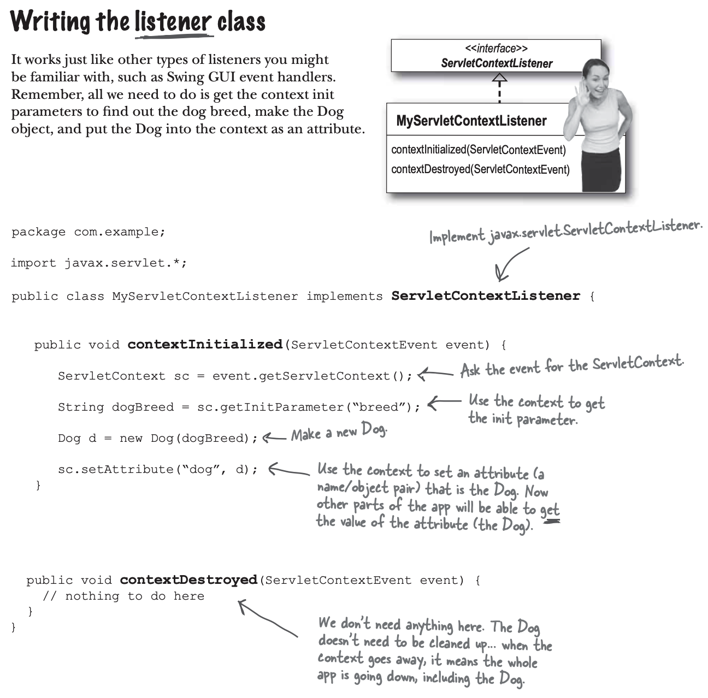<br>출처 : Head First Servlets & JSP</p>

* **`event`객체로부터 `ServletContext`주소를 받아 `Dog`객체의 주소를 `ServletContext`속성값으로 저장한다.**

<br>

**속성 클래스 `Dog`**

<p align="center">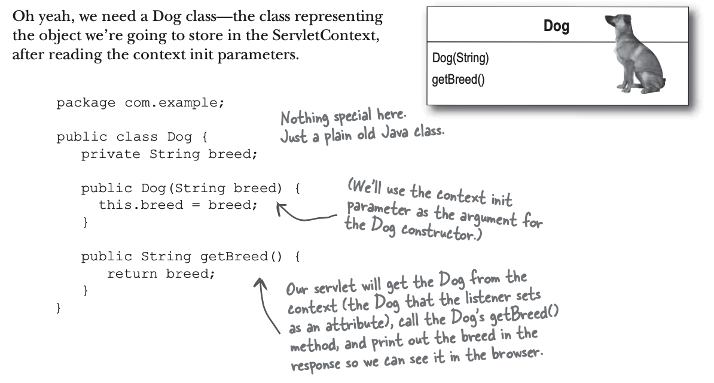<br>출처 : Head First Servlets & JSP</p>

* `ServletContext`로 부터 컨텍스트 초기화 파라미터를 가져와 `Dog`객체를 생성한다.

<br>

**서블릿 클래스 코딩하기**

<p align="center">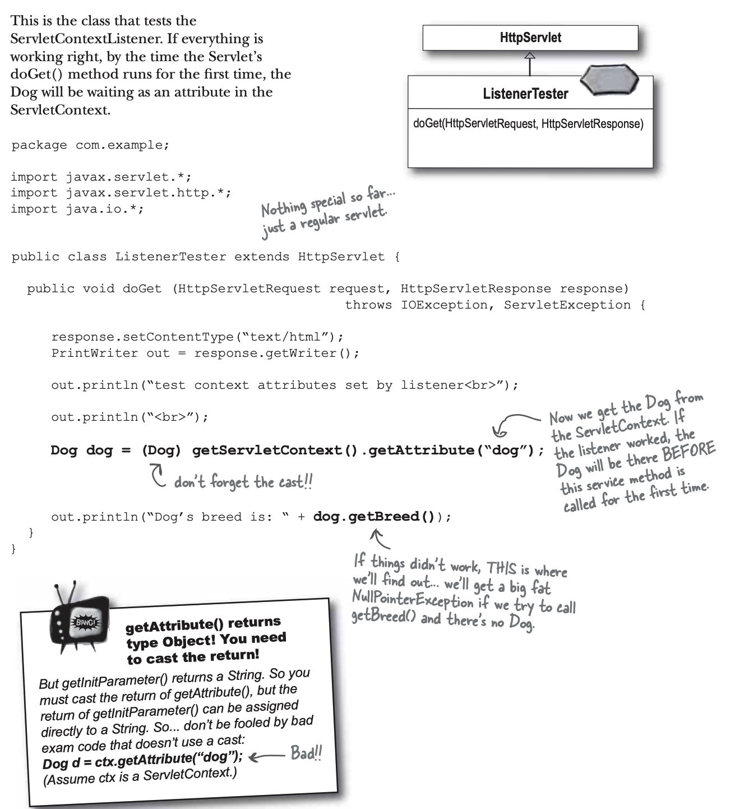<br>출처 : Head First Servlets & JSP</p>

* 이 클래스는 `ServletContextListener`를 테스트하기 위한 서블릿이다.


> **`getAttribute()`는 `Object`를 리턴한다. 캐스트가 필수이다.**
>
> * `getInitParameter()`는 `String`을 리턴하지만, `getAttribute()`는 `Object`를 리턴하기에 캐스트를 해야한다.

<br>

**배포 서술자 작성**

<p align="center">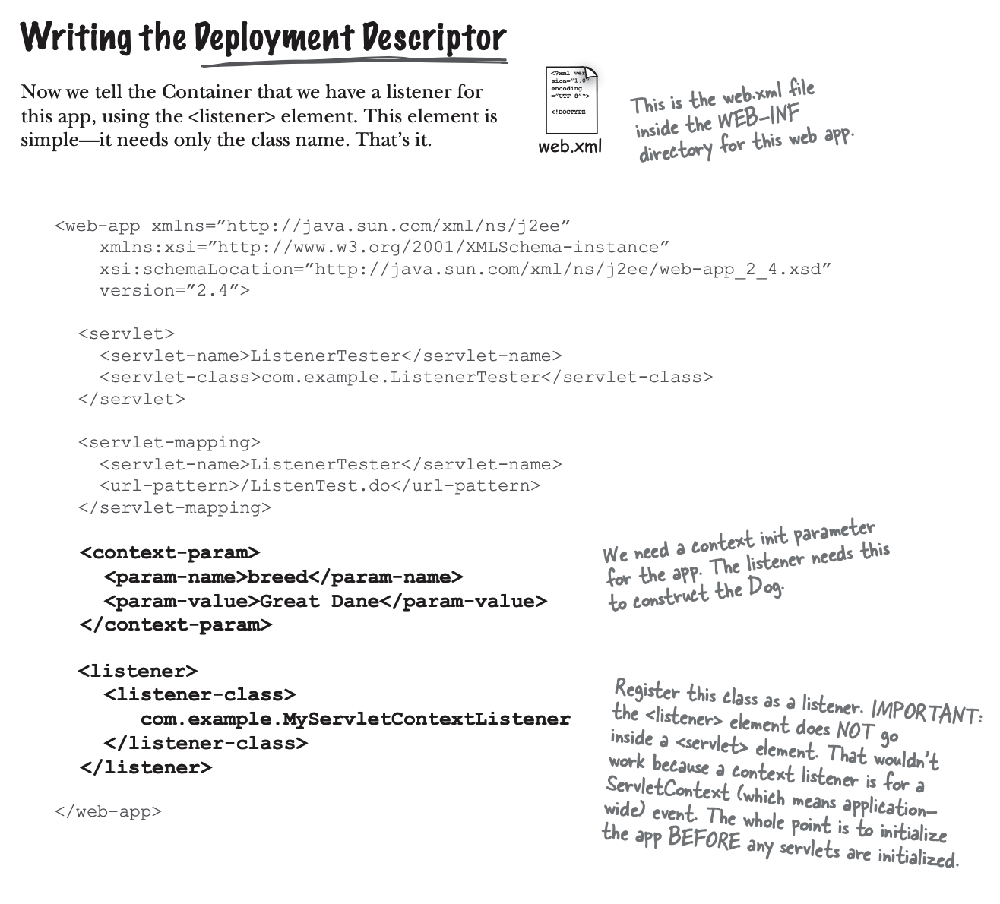<br>출처 : Head First Servlets & JSP</p>

* 컨테이너한테 리스너를 만들었음을 알려준다.
  * `<listener>`


> **"컨테이너한테 우리가 리스너를 만들었음을 알려준다"라고 했는데 어떻게 알려주는 것인가?**
>
> * 클래스의 이름으로 식별하지 않고, 작성한 클래스가 무엇인가 하는 걸로 판단한다.
> * **컨테이너는 어떤 인터페이스를 구현하였는지 클래스를 조사한다.**
>   * `ServletContextListener`를 구현(`implement`)한 클래스가 실행되는 것이다.

<br>

**컴파일, 배포**

<p align="center">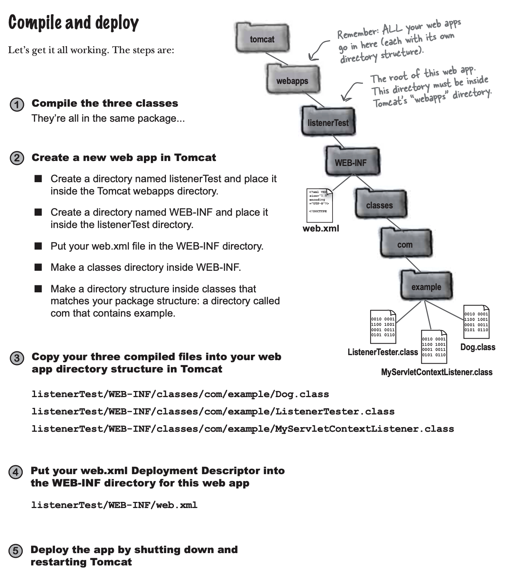<br>출처 : Head First Servlets & JSP</p>

* 위 그림과 같이 컴파일한 후, 알맞는 디렉토리에 `.class`파일을 넣어준다.


실행해보면 아래와 같은 결과가 나올 것이다.

<p align="center">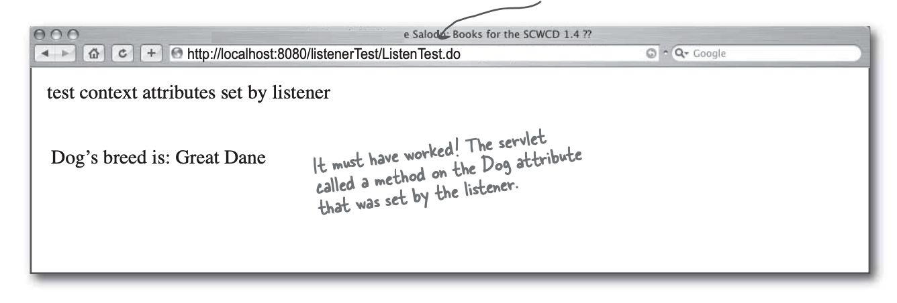<br>출처 : Head First Servlets & JSP</p>

<br>

#### 3-2-3. 예제의 전체적인 그림

<p align="center">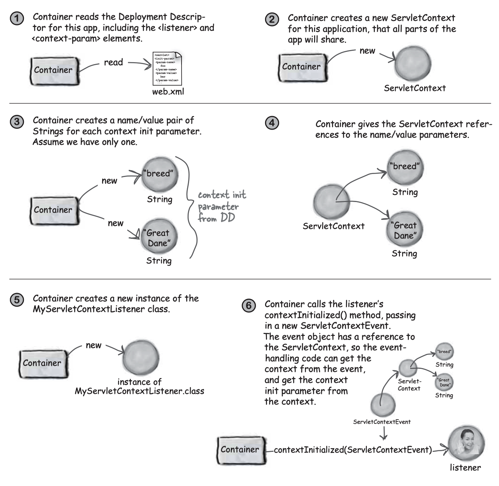<br>출처 : Head First Servlets & JSP</p>

1. 컨테이너는 DD를 읽는다.
   * `<listener>`와 `<context-param>`요소도 읽게된다.
2. 컨테이너는 `SetvletContext`객체를 생성한다. 애플리케이션에서 이 객체를 공유한다.
3. 컨테이너는 컨텍스트 초기화 파라미터의 이름/값 쌍(`String`의 쌍)을 만든다.
4. 컨테이너는 생성한 컨텍스트 초기화 파라미터의 `String` 쌍을 `ServletContext`객체에 설정한다.
5. 컨테이너는 `MyServletContextListener`클래스 인스턴스를 만든다.
6. 컨테이너는 리스너의 `contextInitialized()`메서드를 호출한다.
   * 인자로 `ServletContextEvent`를 넘긴다.
   * 이 이벤트 객체를 가지고 `ServletContext`에 접근한다.


<p align="center">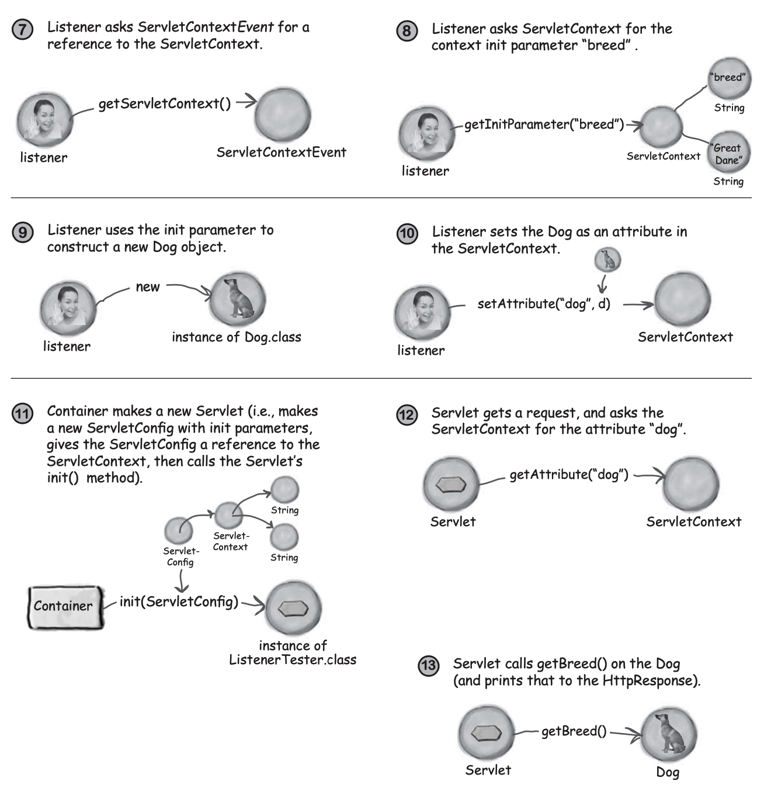<br>출처 : Head First Servlets & JSP</p>

7. 리스너가 `ServletContextEvent`에게 `ServletContext`에 대한 참조를 요청한다.

8. 리스너가 `ServletContext`에게 컨텍스트 초기화 파라미터 `breed`에 대한 값을 요청한다.

9. 리스너는 초기화 파라미터를 가지고 `Dog`객체를 생성한다.

10. 리스너는 `ServletContext`의 속성으로 `Dog`를 설정한다.

11. 컨테이너는 새로운 서블릿을 생성한다.

    * 초기화 파라미터로 `ServletConfig`를 생성하고, 여기에 `ServletContext`에 대한 참조를 설정한 다음, 서블릿 `init()`메서드를 호출한다.

12. 서블릿은 요청을 받고는, `ServletContext`에게 `Dog`속성에 매핑된 객체 인스턴스를 요청한다.

13. 서블릿은 `Dog`객체의 `getBreed()`메서드를 호출한다.

<br>

### 3-3. 여러 리스너들

`ServletContextListener`말고도 8가지의 리스너들이 있다.

<p align="center">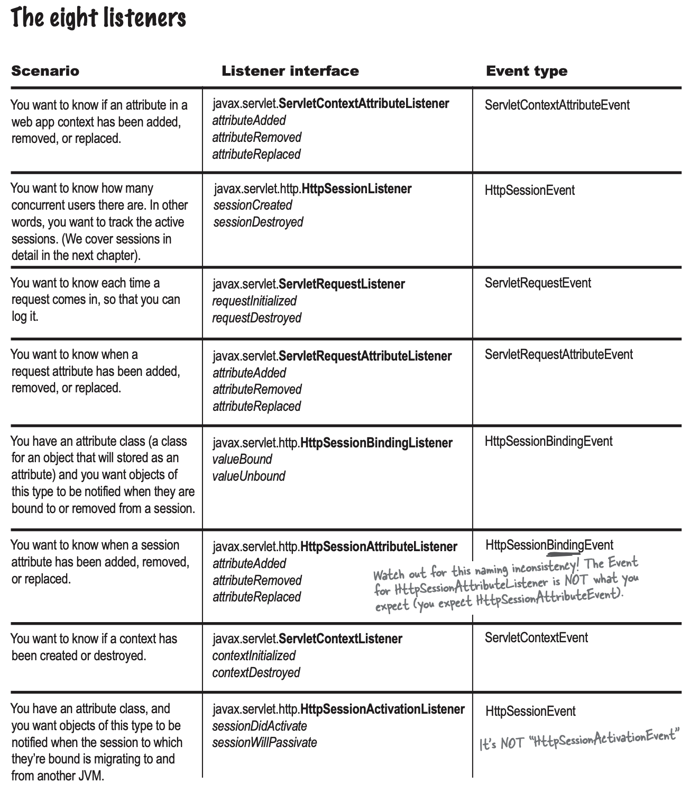<br>출처 : Head First Servlets & JSP</p>

<br>

## 4. 속성

위에서 간단하게 속성과 리스너에 대해서 다뤄보았다.

이번 챕터에서는 '속성'에 대해서 더 자세히 알아보고자 한다.

<br>

### 4-1. 정확히 속성이라는 것은 무엇인가?

<p align="center">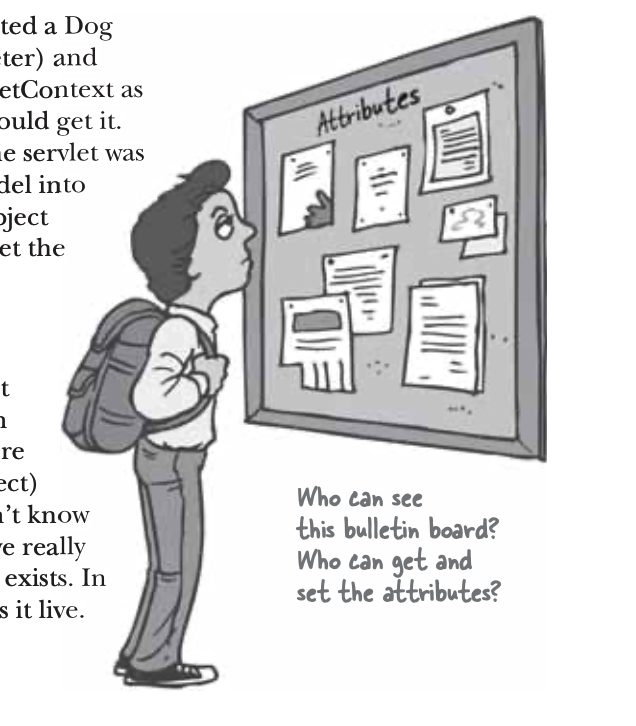<br>출처 : Head First Servlets & JSP</p>

속성이라는 것은 3개의 서블릿 API 객체 중 하나에 설정해놓는(바인딩) 객체를 말한다.

* `ServletContext`
* `HttpServletRequest` 또는 `ServletRequest`
* `HttpSession`

> 바인딩(bounding) : ~에 추가하다. 결합

<br>

간단히 이를 `Map` 인스턴스(`java.util.Map`)에 `이름/값`의 쌍으로 저장하는 것이라고 생각해도 무방하다.

* 이름 : `String`
* 값 : `Object`


속성에서 중요한 점은 아래와 같다.

* 속성은 언제 초기화(생성)되고, 소멸되는가?
* 속성이 생존하는 범위(scope)는 어떻게 되는가? ( 게시물의 게시기간은 얼마나 되는가? )


> **속성은 게시판에 핀으로 고정시킨 게시물과 같다.**
>
> **누군가 게시판에 다른 사람들이 읽으라고 붙여놓은 것이다.**

<br>

### 4-2. 속성은 파라미터가 아니다

<p align="center">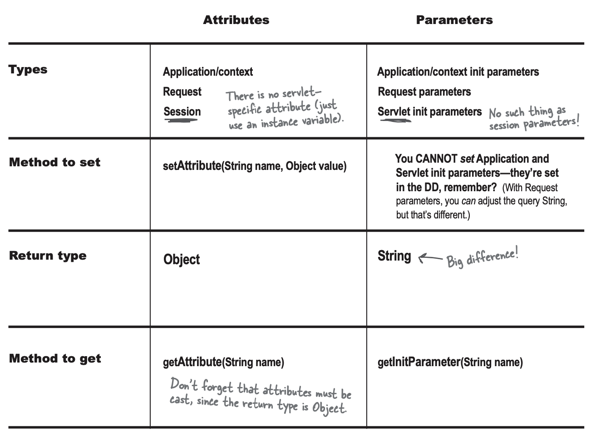<br>출처 : Head First Servlets & JSP</p>

* 가장 큰 차이점은 속성(Attributes)는 `Object`이고, 파라미터(Parameters)는 `String`이다.

> 여기서 말하는 파라미터는 DD를 통한 처음에 설정하는 파라미터를 뜻한다.

<br>

### 4-3. 세 가지 생존범위

<p align="center">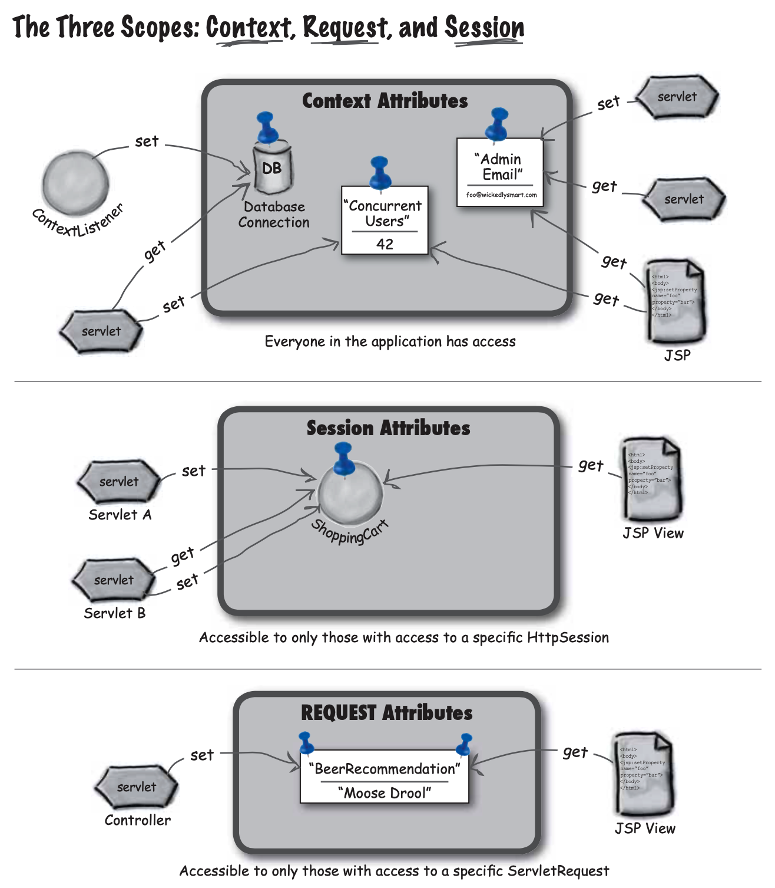</p>

<p align="center">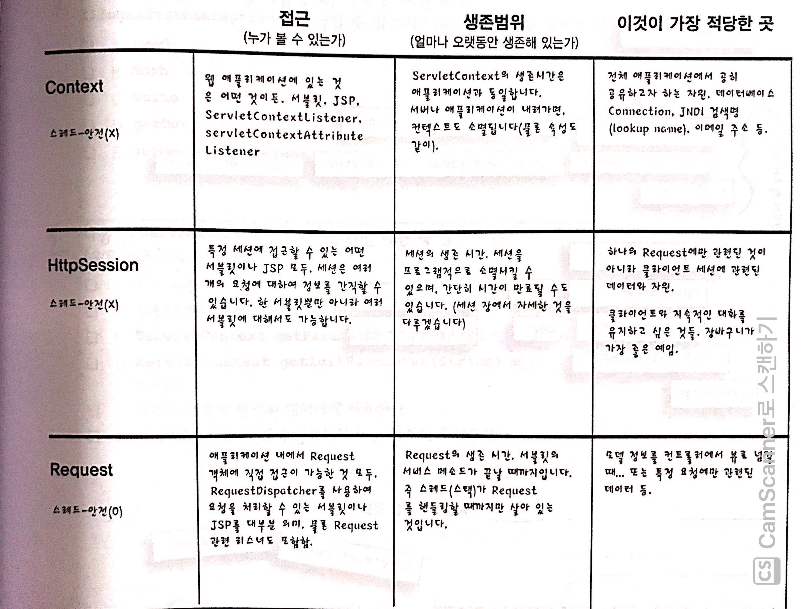<br>출처 : Head First Servlets & JSP</p>

<br>

### 4-4. 속성 API

`ServletContext`, `ServletRequest`, `HttpSession` 인터페이스가 세 가지 속성 생존범위 즉, context, request, session을 핸들링한다.

<p align="center">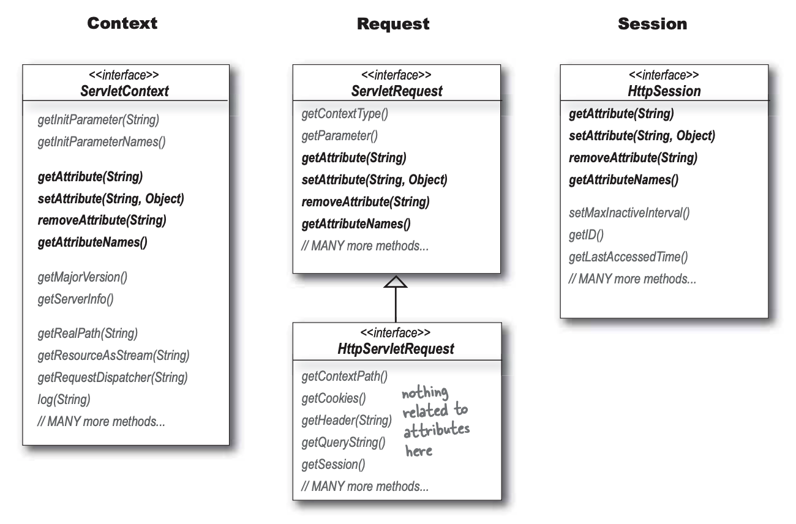<br>출처 : Head First Servlets & JSP</p>

속성 API의 공통적인 메서드는 아래와 같다.

* `Object getAttribute(String name)`
* `setAttribute(String name, Object value)`
* `removeAttribute(String name)`
* `enumeration getAttributeNames()`

<br>

### 4-5. 속성의 스레드-안전 문제

속성 값은 게시판처럼 여러 서블릿이나 객체에서 접근할 수 있다.

이렇게 되면 스레드 관련 안전 문제가 발생하게 되는데 이번 챕터에서 스레드-안전에 관해 다뤄본다.

<br>

#### 4-5-1. 스레드-안전 문제란

아래 예제는 `ServletContext`에 두 개의 속성을 저장하고 바로 빼내서 출력하는 예제이다.

<p align="center">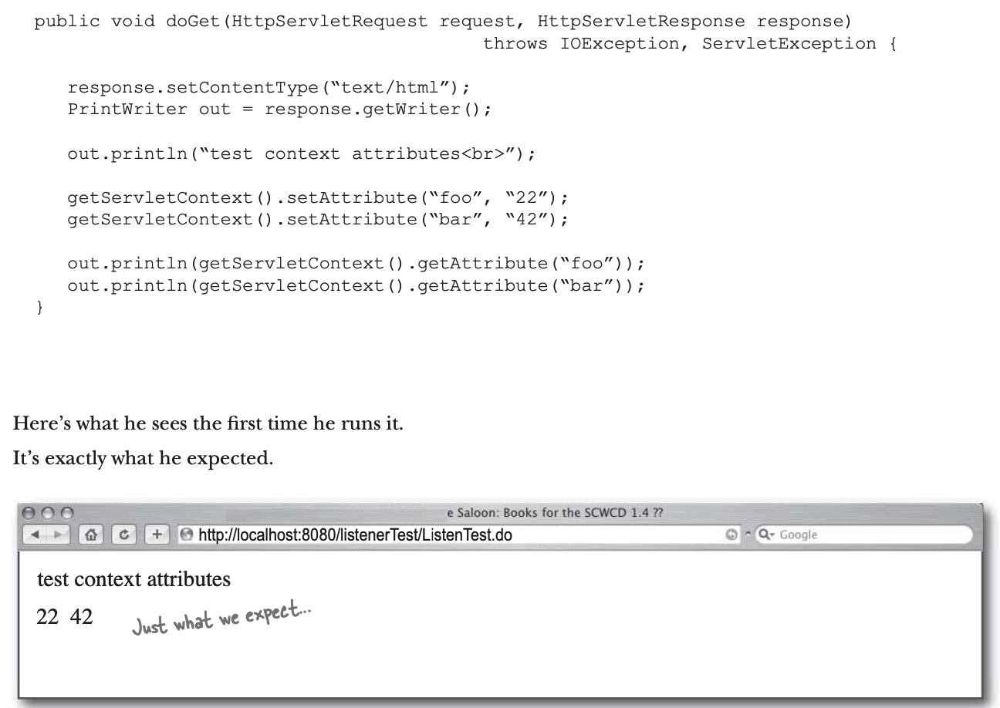 <br>출처 : Head First Servlets & JSP</p

* 속성에 저장한 값 그대로 잘 출력되는 것을 볼 수 있다.

<p align="center"><br>출처 : Head First Servlets & JSP</p>

**하지만, 두번째 실행 했을 때는 속성값이 바뀌는 것을 볼 수 있다.**

**이는 다른 서블릿이 `ServlectContext`의 속성을 수정해서 발생한 문제이다.**


> **스레드 안전 : 스레드 안전(thread 安全, 영어: thread safety)은 멀티 스레드 프로그래밍에서 일반적으로 어떤 함수나 변수, 혹은 객체가 여러 스레드로부터 동시에 접근이 이루어져도 프로그램의 실행에 문제가 없음을 뜻한다. 보다 엄밀하게는 하나의 함수가 한 스레드로부터 호출되어 실행 중일 때, 다른 스레드가 그 함수를 호출하여 동시에 함께 실행되더라도 각 스레드에서의 함수의 수행 결과가 올바로 나오는 것으로 정의한다.**

<br>

#### 4-5-2. Context 생존범위는 스레드-안전하지 않다.

<p align="center">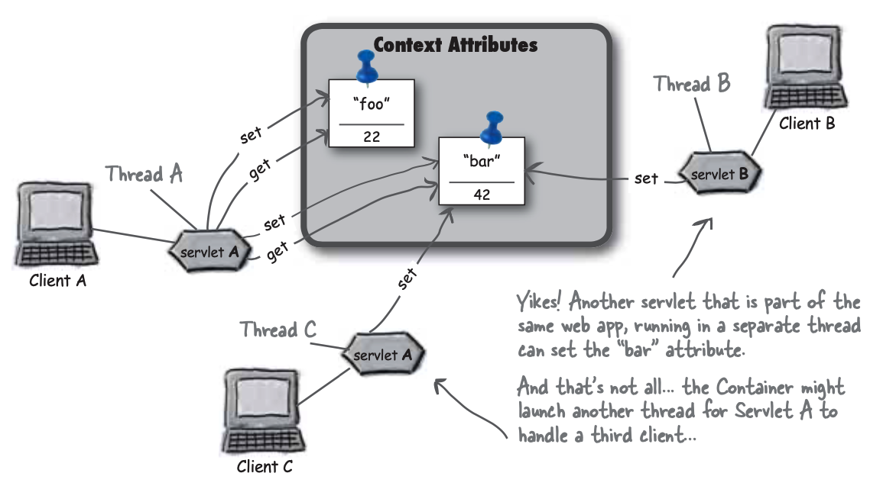<br>출처 : Head First Servlets & JSP</p>

애플리케이션에 있는 모든 사람(서블릿)이 컨텍스트 속성에 접근할 수 있다.

또한, 하나의 서블릿은 모두 멀티스레드로 실행되고 있다. 즉, **각각의 요청은 동시에 서로 다른 스레드로 처리된다.**

**이 말은 요청이 동일한 서블릿으로부터 들어온 것인지 다른 서블릿으로부터 들어온 것인지 컨테이너는 구분하지 못한다.**

<br>

<p align="center">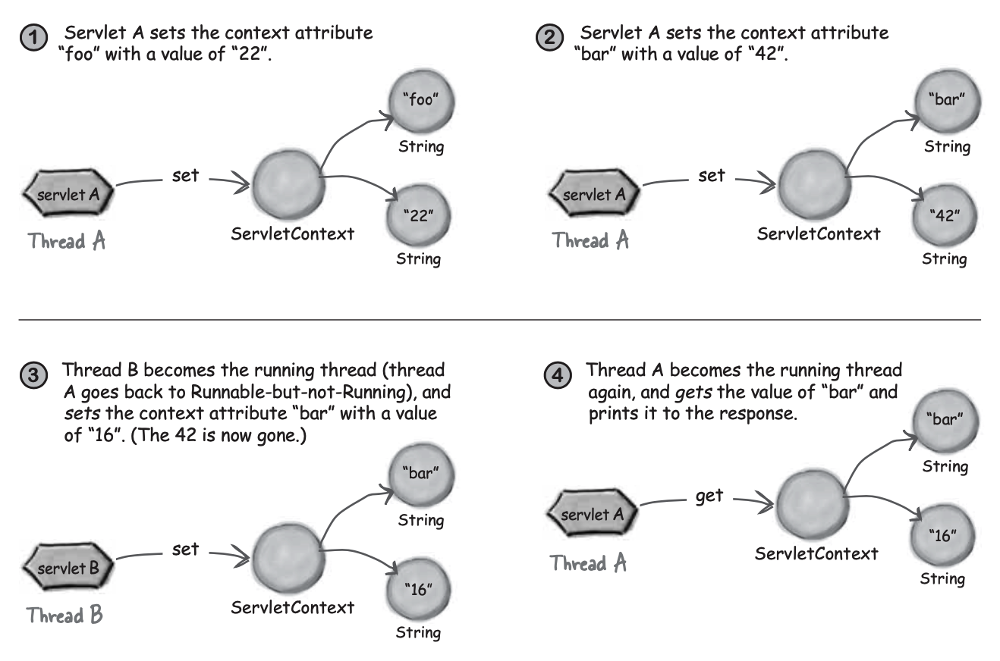<br>출처 : Head First Servlets & JSP</p>

1. 서블릿 A가 컨텍스트 속성 `foo`의 값을 22로 설정한다.
2. 서블릿 A가 컨텍스트 속성 `bar`의 값을 42로 설정한다.
3. 서블릿 B는 실행 스레드가 된다. ( 스레드 A는 실행 가능한(Runnable)상태, 즉 실행 대기 상태가 된다 )
   * 서블릿 B가 컨텍스트 속성 `bar`의 값을 16으로 설정한다. ( 기존의 42라는 값이 없어진다. )
4. 스레드 A는 다시 실행(Running) 스레드가 되어, 속성 `bar`의 값을 읽어 이를 `Response`에 기록한다.

<p align="center">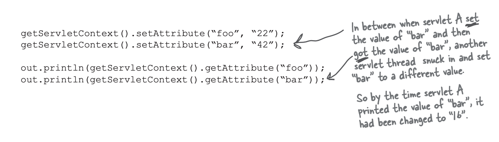<br>출처 : Head First Servlets & JSP</p>

* 서블릿 A가 컨텍스트 값을 설정하고 해당 값을 가져오기 전에 다른 서블릿(스레드)에서 이를 변경한 것이다.

<br>

#### 4-5-3. 컨텍스트 속성을 스레드-안전하게 하는 방법

<br>

**서비스 메서드를 동기화하는 것은 안된다.**

<p align="center">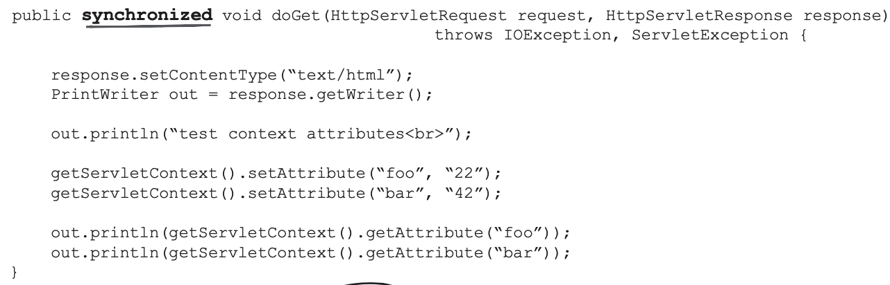<br>출처 : Head First Servlets & JSP</p>

스레드-안전에서 제일 처음 드는 생각은 `doGet()`을 동기화(`synchronize`)하는 것이다.

하지만 이렇게 한다면 서블릿 한번에 하나의 클라이언트한테만 서비스가 가능하기 때문에 사용하면 안된다.

> 동기화를 사용한다면 동시에 서비스하는 동시성이 없어지기때문에 매우 위험하다.

<br>

서블릿 메서드를 동기화한다는 말은 한 번에 오직 하나의 서블릿 스레드 메서드만 실행한다는 말이다.

이 말이 다른 서블릿과 JSP가 속성에 접근하지 못하게 만든다는 의미는 아니다. 

하나의 서블릿의 동기화를 하기 때문이다. 

그러므로 하나의 서블릿 메서드의 동기화를 한다고 `ServletContext` 속성 값의 변경을 막지는 못한다.

<p align="center">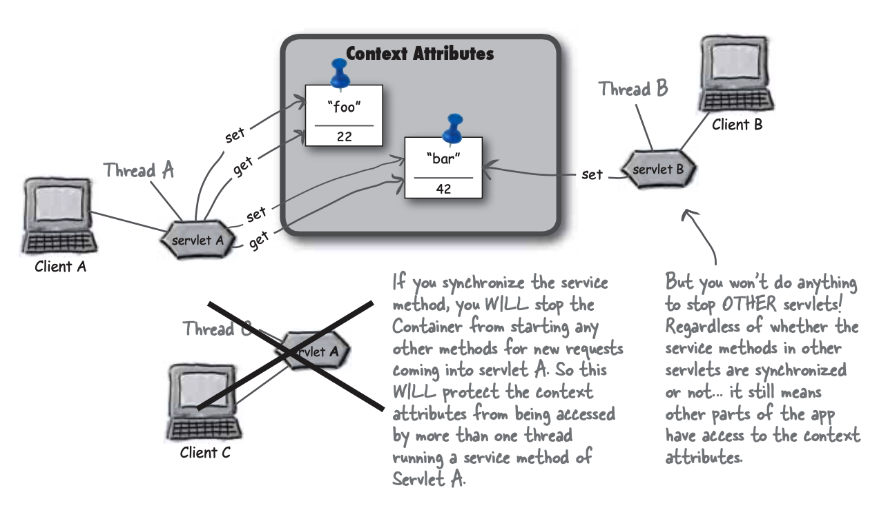<br>출처 : Head First Servlets & JSP</p>

* **동기화를 건다면 서블릿 A가 2개 동시에(스레드) 실행 될 순 없지만, 다른 컴포넌트(서블릿 B)가 접근하는 것은 가능하다.**
  * 이렇게 되면 속성 값의 스레드-안전은 보장되지 않는다.

<br>

**서블릿에 락을 걸지 않고 컨텍스트에 락을 건다.**

<p align="center">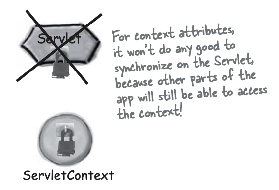<br>출처 : Head First Servlets & JSP</p>

* **컨텍스트 속성을 보호하는 가장 전형적인 방법은 컨텍스트 객체 자체를 동기화하는 것이다.**
  * **컨텍스트에 가장 먼저 접근한 객체가 컨텍스트에 락을 거는 것이다.**
  * 특정 시점에서 오직 하나의 스레드만이 컨텍스트 속성을 설정하거나 값을 읽는 것을 보장한다는 것을 의미한다.
* 조건
  * **동일 컨텍스트 속성을 다루는 모든 코드들이 마찬가지로 `ServletContext`에 대하여 락을 걸어야 제대로 동작한다.**
  * 만약 어떤 코드가 락을 요청하지 않았다면, 자유롭게 접근할 수 있게 된다.
* 웹 애플리케이션 설계시, 모든 개발자들이 속성에 접근하기 전에 강제적으로 락을 걸도록 만들어야 한다.

<p align="center">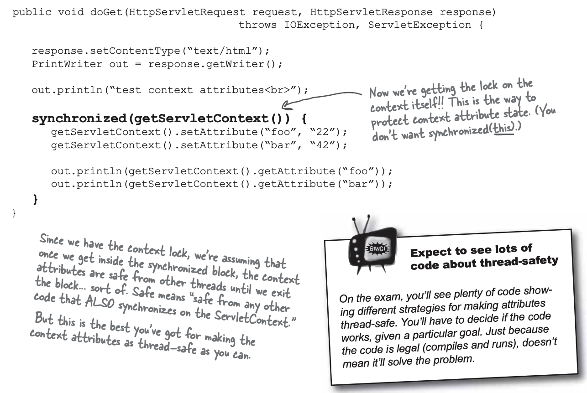<br>출처 : Head First Servlets & JSP</p>

* `synchronized(getServletContext())`
  * 컨텍스트 자체에다가 락을 걸었다.
* 컨텍스트에 락을 걸었기 때문에 동기화 코드 블럭 안에서는(이 블럭을 빠져나가기 전까지) 컨텍스트 속성이 다른 스레드로부터 안전하다는 것을 의미한다.
  * "안전하다"란 말은 `ServletContext`에 대한 동기화를 걸어 둔 다른 코드로부터 안전하다를 의미한다.

<br>

> 이 방법이 컨텍스트 속성을 스레드-안전하게 만드는 할 수 있는 최선이라고 한다.
>
> 다른 방법은 정말 없을까??

> **동기화를 사용할 때는 신중에 신중을 가해야 한다.**
>
> **가능한 한 짧은 시간동안 락을 거는 것이 중요하다.** 
>
> **즉, 보호될 필요가 없는 코드까지 동기화하지 않아야 한다.**

<br>

#### 4-5-4. 세션 속성도 스레드 안전하지 않다.

세션은 클라이언트와 대화 상태를 유지하기 위하여 사용하는 객체이다.

클라이언트 당 세션은 하나이므로, 어차피 어느 특정 시점에서는 한번의 하나의 요청만 들어온다고 생각하여 스레드-안전할거라 생각한다.

하지만, 아래와 같이 한 클라이언트가 여러 요청을 한번에 하면 스레드-안전은 지켜지지 않는다.

<p align="center">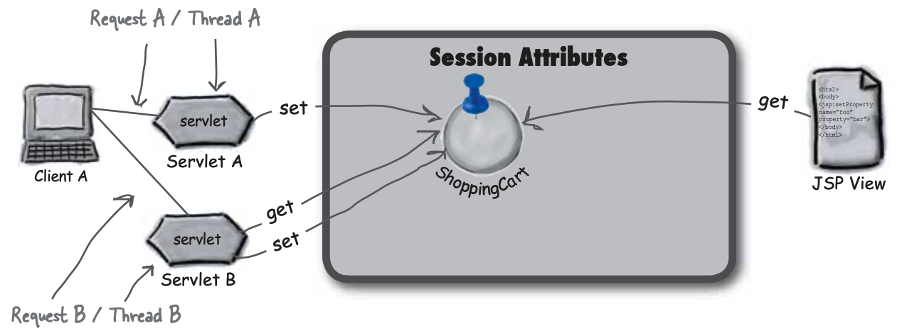<br>출처 : Head First Servlets & JSP</p>

* 동일 클라이언트가 동시에 하나 이상의 요청을 보내면 세션 속성도 스레드-안전하지 않다.

<br>

**HttpSession 동기화로 세션 속성을 보호할 수 있다.**

`ServletContext`의 속성을 동기화하여 스레드-안전을 했던 것 처럼, `HttpSession` 객체를 동기화하는 방식으로 세션 속성도 스레드로부터 지킬 수 있다.

<p align="center">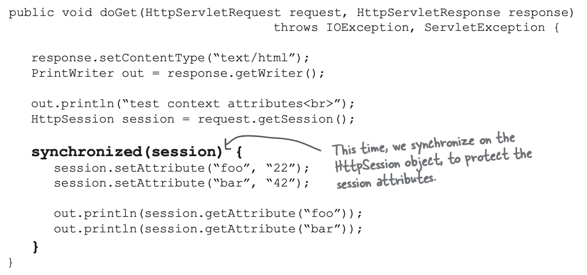<br>출처 : Head First Servlets & JSP</p>

<br>

#### 4-5-5. 단지 Request속성과 지역 변수만이 스레드 안전하다

**`Request`객체와 지역 변수를 제외하고는 모두 멀티스레딩 관련된 이슈가 항상 있다.**

아래는 몇몇 질문과 답이다.

1. 서블릿 **인스턴스 변수는 스레드-안전하지 않은가?**
   * 그렇다. 
   * 서블릿에 요청을 보내는 클라이언트가 여럿 있다는 말은 서블릿 코드를 실행하는 스레드가 여럿이라는 말이다.
   * **이 스레드들은 서블릿의 인스턴스 변수에 동시에 접근할 수 있다는 말이며, 고로 인스턴스 변수는 스레드-안전하지 않다.**
2. 서블릿 **인스턴스 변수는 그럼 어떻게 스레드-안전을 할 수 있는가?**
   * **할 수 없다..**
   * 고수들이 만든 서블릿을 보면 그래서 인스턴스변수가 없다. **가능한 서블릿에 인스턴스 변수를 사용하지 않는게 좋다.**

<br>

## 5. Request속성과 Request 디스패칭

<br>

### 5-1. Request속성과 Request디스패칭

<p align="center">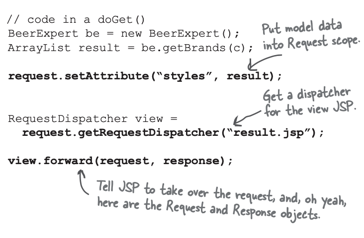<br>출처 : Head First Servlets & JSP</p>

`Request`속성은 애플리케이션의 다른 컴포넌트가 `Request`또는 `Request`의 일부를 넘겨받기 위해서 사용한다.

MVC만 해도 대부분 서블릿 컨트롤러로부터 시작해서 JSP뷰로 끝이난다.

컨트롤러는 모델과 커뮤니케이션하여 `Response`를 만들기 위하여 뷰에게 데이터를 넘겨준다.

**그럼 어떻게 다른 컴포넌트가 `Request`를 넘겨 받을까? 바로 `RequestDispatcher`를 이용하는 것이다.**


> 이번 요청에 대해서만 사용할 데이터이므로 `Request`나 `Response`속성을 사용하는 것이다.

<br>

<p align="center">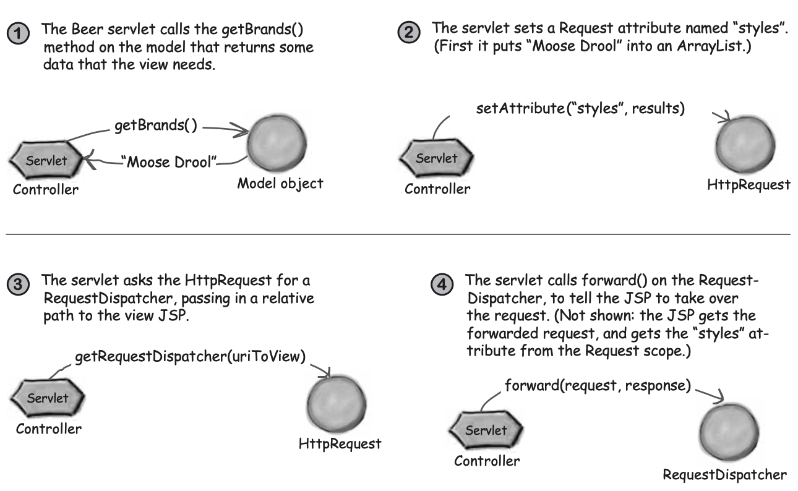<br>출처 : Head First Servlets & JSP</p>

1. Beer 서블릿이 모델의 `getBrands()`메서드를 호출하면, 나중에 뷰에서 쓸 데이터를 리턴한다.
2. 서블릿은 `styles`란 이름으로 `Request`속성에 리턴 결과를 매핑해둔다.
3. 서블릿은 `HttpRequest`에게 요청한다.
   * "JSP 뷰의 상대 경로로 `RequestDispatcher`를 넘겨주세요"라고 요청한다.
4. 서블릿은 `RequestDispatcher`의 `forward()`메서드를 호출한다.
   * 그리곤 "이 요청을 처리해줘"라고 말한다.
   * JSP는 넘어온 요청을 받고는, `Request`에 `styles`로 매핑된 속성을 끄집어 낸다.

<br>

### 5-2. RequestDispatcher

<p align="center">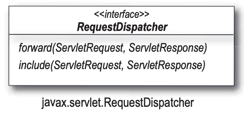<br>출처 : Head First Servlets & JSP</p>

`RequestDispatcher`에는 딱 두개의 메서드가 있다.

* `forward()`
* `include()`

둘 다 `Request`와 `Response`객체를 인자로 한다.

> 작업을 받은 컴포넌트가 작업을 하려면 이 두 객체가 필요하기 때문이다.
>
> 두 메서드 중에서 `forward()`를 주로 사용한다고 한다.


`RequstDispatcher`를 얻는 방법은 두 가지있다. 첫 번째는 `Request`이고, 다른 하나는 컨텍스트이다.

<p align="center">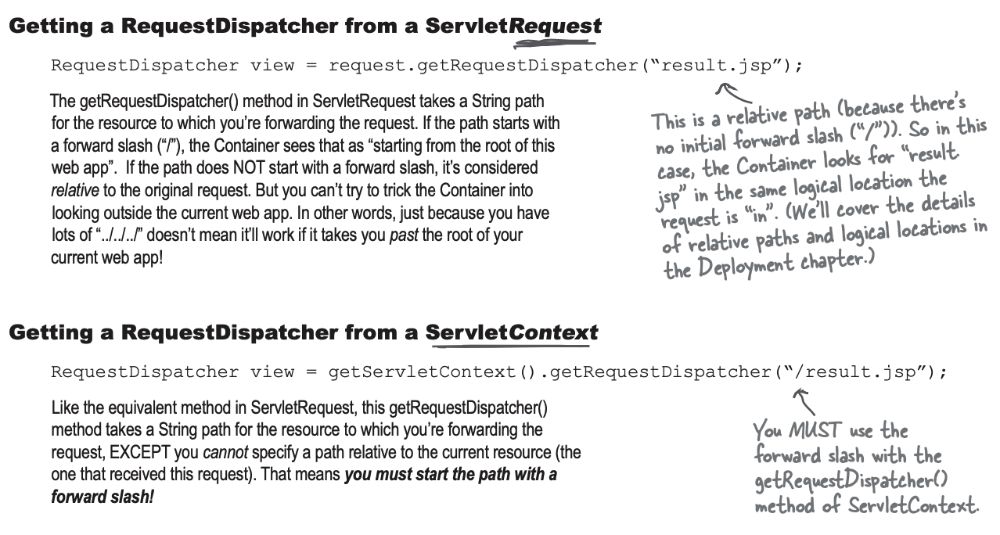<br>출처 : Head First Servlets & JSP</p>


