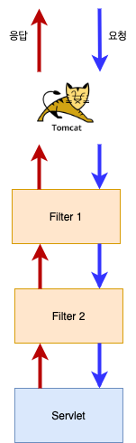

# 목차

- [Servlet Filter](#servlet-filter)
  * [1 Filter의 개념](#1-filter의-개념)
    + [1-1 Servlet Filter란](#1-1-servlet-filter란)
    + [1-2 사용하는 이유](#1-2-사용하는-이유)
  * [2 Filter 만들기](#2-filter-만들기)
    + [2-1 Filter 인터페이스를 구현하면 된다](#2-1-filter-인터페이스를-구현하면-된다)
    + [2-2 필터 배치](#2-2-필터-배치)
      - [web.xml](#webxml)
      - [애노테이션](#애노테이션)
  * [3 필터 순서 지정하기](#3-필터-순서-지정하기)
  * [4 Filter 사용 예시](#4-filter-사용-예시)
- [참고](#참고)


# Servlet Filter


## 1 Filter의 개념


### 1-1 Servlet Filter란



* WAS로 들어온 요청을 서블릿으로 보내고, 또 서블릿이 작성한 응답을 클라이언트로 보내기 전에 특별한 처리가 필요한 경우에 사용되는 필터.
* 체인 형태의 구조


### 1-2 사용하는 이유

* 서블릿 실행 전, 후에 어떠한 작업을 하기 위해 사용된다.
* 서블릿에서 반복적으로 수행해야 하는 작업을 공통으로 처리할 수 있다는 장점이 있다.
* 예시
  * 데이터 암호화, 복호화 (JWT)
  * 문자 인코딩, 디코딩
  * 로그


## 2 Filter 만들기


### 2-1 Filter 인터페이스를 구현하면 된다

```java
public class MyFilter implements Filter {

    @Override
    public void init(FilterConfig filterConfig) throws ServletException {
        System.out.println("Filter Init");
    }

    @Override
    public void doFilter(ServletRequest servletRequest, ServletResponse servletResponse, FilterChain filterChain) throws IOException, ServletException {
        System.out.println("서블릿 전"); // Todo 전처리
        filterChain.doFilter(servletRequest, servletResponse); // 다음 필터로 연결해줘야 한다.
      	System.out.println("서블릿 후"); // Todo 후처리
    }

    @Override
    public void destroy() {
        System.out.println("Filter Destory");
    }
}
```

* `init()` - 필터 객체가 생성되고 준비 작업을 위해 딱 한번 호출된다.
* `doFilter()` - 필터와 패밍된 URL에 요청이 들어올때마다 `doFilter()` 가 호출된다.
  * `filterChain` 은 다음 필터를 가리키고 `filterChain.doFilter()` 는 다음 필터를 호출한다.
  * 다음 필터가 없다면 내부적으로 서블릿의 `service()` 가 호출된다.
* `destroy()` - WAS가 종료되기 전에 딱 한번 호출한다.


> * 서블릿이 **실행되기 전의 작업**은 `filterChain.doFilter()` **이전 코드에 써야한다.**
> * 서블릿이 **실행된 후 응답하는 작업**은 `filterChain.doFilter()` **이후 코드에 써야한다.**


### 2-2 필터 배치

필터 구현 객체를 만들고 어떠한 서블릿(혹은 URL)에 배치할 지 지정해줘야한다.

필터를 배치해주는 방법은 두가지이다.

* `web.xml`
* 자바 애노테이션


#### web.xml

```xml
<filter>
  <filter-name>myFilter</filter-name>
  <fileter-class>파일 위치</fileter-class>
  <init-param>
    <param-name>...</param-name>
    <param-value>...</param-value>
  </init-param>
</filter>

<filter-mapping>
  <filter-name>myFilter</filter-name>
  <servlet-name>필터 적용하고 싶은 서블릿 이름</servlet-name>
</filter-mapping>
```


#### 애노테이션

```java
@WebFilter(
  urlPattern = "...", 
  initParams = {
    @WebInitParam(name="name", value="value")
  }
)
```

* 필터 클래스 위에 애노테이션을 붙여주면 된다.


## 3 필터 순서 지정하기

필터는 서로 체인(사슬)처럼 연결되어 있어서 필터체인(FilterChain)이라고도 한다.

하나의 서블릿에 여러 개의 필터를 지정하는데 필터별 순서는 어떻게 정하는 것일까?

* `web.xml` 을 사용하는 경우
  * WAS 시동시 `web.xml`을 읽을때  `<filter-mapping>` 의  순서에 따라 필터 순서가 지정된다.
* 애노테이션을 사용하는 경우
  * 순서를 지정해주는 속성이 제공되지 않는다.
  * 유일한 방법은 애노테이션으로 필터만 설정해주고 `web.xml` 에서 `<filter-mapping>` 을 해주는 것 뿐이다.

> 스프링에서는 `@Order` 애노테이션을 통해 재공해준다.


## 4 Filter 사용 예시

```xml
<filter>
  <filter-name>myFilter</filter-name>
  <fileter-class>파일 위치</fileter-class>
</filter>

<filter-mapping>
  <filter-name>myFilter</filter-name>
  <servlet-name>필터 적용하고 싶은 서블릿 이름</servlet-name>
</filter-mapping>
```

```java
public class MyFilter implements Filter {

    @Override
    public void init(FilterConfig filterConfig) throws ServletException {
        System.out.println("Filter Init");
    }

    @Override
    public void doFilter(ServletRequest servletRequest, ServletResponse servletResponse, FilterChain filterChain) throws IOException, ServletException {
        System.out.println("Filter");
        filterChain.doFilter(servletRequest, servletResponse); // 다음 필터로 연결해줘야 한다.
    }

    @Override
    public void destroy() {
        System.out.println("Filter Destory");
    }
}
```


# 참고

* [백기선님의 MVC 강의](https://www.inflearn.com/course/%EC%9B%B9-mvc/dashboard)

* [열혈강의 자바 웹 개발 워크북](http://www.yes24.com/Product/Goods/13159413?OzSrank=1)