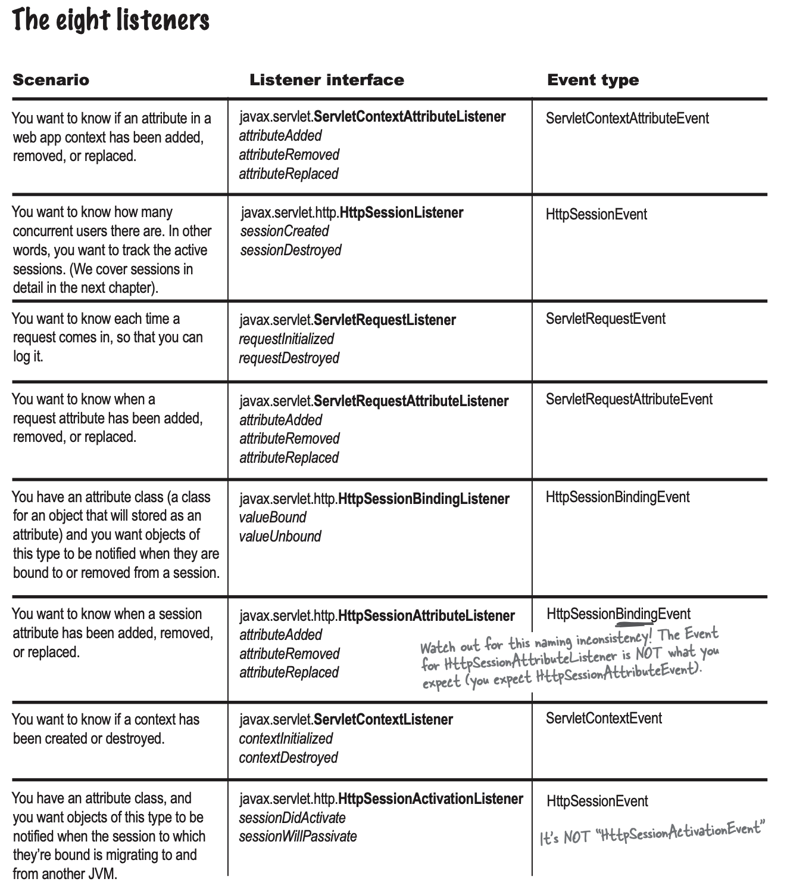

# 목차

- [ServletListener](#servletlistener)
  * [1 ServletListener 개념](#1-servletlistener-개념)
    + [1-1 ServletListener란](#1-1-servletlistener란)
    + [1-2 ServletListener 종류](#1-2-servletlistener-종류)
  * [2 ServletListener만들기](#2-servletlistener만들기)
  * [3 ServletListener 배치](#3-servletlistener-배치)
    + [web.xml](#webxml)
    + [애노테이션](#애노테이션)
  * [4 ServletListener 예시](#4-servletlistener-예시)


# ServletListener


## 1 ServletListener 개념


### 1-1 ServletListener란

* 리스터는 특정 이벤트가 발생하기를 기다리다가 이벤트가 발생되면 실행되는 함수, 혹은 그 메서드를 지닌 객체를 의미한다.
* 옵저버패턴과 동일하다.


### 1-2 ServletListener 종류



<center>출처 : Head First Servlet & JSP</center>

* 서블릿 컨텍스트 수준의 이벤트
  * 컨텍스트 라이프사이클 이벤트
  * 컨텍스트 애트리뷰트(속성) 변경 이벤트
* 세션 수준의 이벤트
  * 세션 라이프사이클 이벤트
  * 세션 애트리뷰트(속성) 변경 이벤트
* 서블릿 수준의 이벤트
  * 서블릿 요청 라이프사이클 이벤트
  * 서블릿 요청 애트리뷰트(속성) 변경 이벤트


## 2 ServletListener만들기

```java
public class MyListener implements ServletContextListener {

    @Override
    public void contextInitialized(ServletContextEvent servletContextEvent) {
        System.out.println("Servlet Context Initialized");
        servletContextEvent.getServletContext().setAttribute("name", "binghe");
    }

    @Override
    public void contextDestroyed(ServletContextEvent servletContextEvent) {
        System.out.println("Servlet Context Destroyed");
    }
}
```

* 원하는 수준의 리스터는 구현(`implements`)하면 된다.


## 3 ServletListener 배치

### web.xml

```xml
<listener>
  <listener-class>클래스 위치</listener-class>
</listener>
```


### 애노테이션

```java
@WebListener
public class MyListener implements ServletContextListener {
  ...
}
```


## 4 ServletListener 예시

```xml
<listener>
  <listener-class>클래스 위치</listener-class>
</listener>
```

```java
public class MyListener implements ServletContextListener {

    @Override
    public void contextInitialized(ServletContextEvent servletContextEvent) {
        System.out.println("Servlet Context Initialized");
        servletContextEvent.getServletContext().setAttribute("name", "binghe");
    }

    @Override
    public void contextDestroyed(ServletContextEvent servletContextEvent) {
        System.out.println("Servlet Context Destroyed");
    }
}
```


