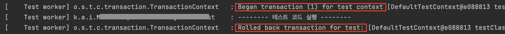
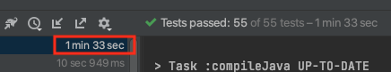
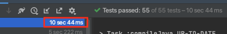

# 목차

<br>

- [목차](#목차)
- [들어가며](#들어가며)
- [1 왜 테스트 격리해야하는가?](#1-왜-테스트-격리해야하는가)
- [2 Spring Boot에서의 DB 테스트 격리](#2-spring-boot에서의-db-테스트-격리)
  - [2-1 @Transactional](#2-1-transactional)
    - [서비스 통합 테스트](#서비스-통합-테스트)
    - [인수 테스트](#인수-테스트)
    - [문제점 - 인수테스트시 트랜잭션 롤백이 안된다.](#문제점---인수테스트시-트랜잭션-롤백이-안된다)
  - [2-2 매 테스트마다 직접 데이터 삭제](#2-2-매-테스트마다-직접-데이터-삭제)
  - [2-3 @DirtiesContext 사용](#2-3-dirtiescontext-사용)
  - [2-4 TRUNCATE를 통한 테이블 초기화](#2-4-truncate를-통한-테이블-초기화)
    - [@Sql](#sql)
    - [DatabaseCleaner 구현](#databasecleaner-구현)
    - [@DirtiesContext vs DatabaseCleaner 속도 비교](#dirtiescontext-vs-databasecleaner-속도-비교)
- [마치며](#마치며)
- [참고](#참고)

<br>

# 들어가며
많은 개발자가 Spring 환경에서 인수 테스트 혹은 통합 테스트시 어려움을 느끼는 것이 있다.

바로 테스트 격리이다. 적어도 필자는 이 부분에 있어서 고민을 많이했다.

인수 혹은 통합 테스트의 경우 실제 운영 환경과 같은 조건에서 테스트하는 것이기 때문에 Mocking을 할 수 없다.

> 단위 테스트(슬라이싱 테스트 포함)는 Mocking이 되므로 크게 신경쓰지 않아도 되서 좋았는데..

**인수 혹은 통합 테스트의 경우 격리해야하는 대상은 여러 가지 있지만, 그중에서도 가장 많이 사용되는 DB는 테스트 격리가 굉장히 중요하다.**

**이번 글은 인수 테스트 혹은 통합 테스트시 DB의 테스트를 어떻게 격리해야하는지에 대한 글을 작성해보았다.**

> 이번 글에서의 인수 테스트는 시나리오 테스트를 의미하며, 통합 테스트는 서비스 통합 테스트를 의미한다.

<br>

# 1 왜 테스트 격리해야하는가?
> 이번 챕터의 내용은 [Eradicating Non-Determinism in Tests - Martin Folwer](https://martinfowler.com/articles/nonDeterminism.html)가면 더 자세히 알 수 있다.

<br>

🤔 **테스트 격리란?**

**테스트 격리란 테스트 순서에 상관없이 독립적으로 실행되며, 결정적으로 동작되는 것을 의미한다.**

"결정적으로 동작"의 의미는 멱등성과 비슷하다. 같은 입력 값이면 항상 같은 결과를 반환하는 것을 의미한다.

<br>

🤔 **왜 테스트를 격리시켜야할까?**

이유부터 말하자면 **비결정적인 테스트를 방지하기 위함**이다.

그렇다면 비결정적인 테스트란 무엇일까??

> tests that sometimes pass and sometimes fail. Left uncontrolled, non-deterministic tests can completely destroy the value of an automated regression suite. - Martin Folwer

**비결정적인 테스트는 쉽게 말해서 테스트 실행시 상황에 따라서 결과가 달라지는 것을 의미한다.**

쉽게 말해, **환경에 따라서 성공 혹은 실패하는 테스트를 의미한다.**

<br>

🤔 **비결정적인 테스트가 왜 문제인가?**

1. 쓸모 없다.
2. 하나의 테스트가 전체 테스트에 영향을 끼칠 수 있는 위험이 있다.

DB를 예로 들면, **한 테스트가 DB에 일부 데이터를 생성하고 그래도 두면, 다른 DB 상태에 의존하는 테스트의 실행에 영향을 끼칠 수 있다.**

이는 실제 애플리케이션단에서 테스트하고자하는 로직의 실패가 아닌, DB의 데이터 무결성 위반으로 인한 테스트일 가능성이 크며, 어디서부터 테스트가 실패했는지 파악하기가 쉽지 않다.

<br>

🤔 **그렇다면 어떻게 비결정적인 테스트를 제거할 수 있을까?**

결론은 **테스트마다의 환경을 컨트롤해야한다.**

> Therefore I find it's really important to focus on keeping tests isolated. **Properly isolated tests can be run in any sequence.** As you get to larger operational scope of functional tests, it gets progressively harder to keep tests isolated. ... - Martin Fowler

다음 조건을 만족할때 테스트가 격리되었다고 볼 수 있다.

1. 테스트는 어떤 순서로 실행되도 같은 결과가 나와야한다.
2. 테스트는 다른 테스트에 영향을 주면 안된다.
3. 테스트는 같은 입력 값이면 언제나 같은 결과를 반환해야 한다. (멱등)

<br>

**Keep your tests isolated from each other, so that execution of one test will not affect any others.**

<br>

# 2 Spring Boot에서의 DB 테스트 격리
인수 혹은 통합 테스트시 가장 많이 발생하는 비결정적으로 동작하는 가장 대표적인 것이 DB이다.

**이번 챕터부터 본격적으로 어떻게 Spring Boot 환경에서 DB 테스트를 격리시킬 수 있는지 알아본다.**

<br>

## 2-1 @Transactional
테스트 코드에 `@Transactional`를 붙여서 자동으로 롤백시키는 방식.

<br>

### 서비스 통합 테스트
Spring에선 테스트 코드에 `@Transactional`을 붙이면 테스트가 종료되고 자동으로 롤백하는 전략을 지원한다.

> test transactions will be automatically rolled back after completion of the test.

즉, **Spring TestContext Framework(테스트 프레임워크)는 `@Transactional`이 붙은 테스트(트랜잭션)가 종료되면 롤백한다.**

필자 추측으론 테스트를 **하나의 스레드안에서 동작시키기 때문에 가능할 듯 하다.**

**테스트 프레임워크가 Connection을 ThreadLocal로부터 직접 관리하기 때문에 가능하다는 의미이다.**

<br>

> IntegrationTest.java
```java
@Transactional
@SpringBootTest
public class IntegrationTest {
    ...
}
```

<p align="center"><br>테스트 코드를 실행하고 롤백하는 것을 볼 수 있다.</p>

<br>

> 더 자세한 내용은 [Spring docs - Integration Test](https://docs.spring.io/spring-framework/docs/3.0.0.RC2/reference/html/ch09s03.html)를 참고하자.

<br>

### 인수 테스트
서비스 통합 테스트과 다르게 인수 테스트에선 `@Transactional`이 자동으로 롤백하지 못할 수도 있다.

더 정확히는 `RANDOM_PORT`나 `DEFINED_PORT`로 테스트를 설정하면 실제 테스트 서버는 별도의 스레드에서 수행되기 때문에 rollback이 이루어지지 않는다.

<br>

**RestAssured**

RestAssured는 REST 웹 서비스를 검증하기 위한 라이브러리이며 대부분 인수 테스트(E2E 포함)에 사용된다.

**`@SpringBootTest`로 실제 요청을 보내서 전체적인 로직을 테스트한다. 즉, 실제 요청을 날리는 것.**

사용 방법은 아래와 같다.

> AcceptanceTest.java
```java
@SpringBootTest(webEnvironment = WebEnvironment.RANDOM_PORT)
@ActiveProfiles("test")
public class AcceptanceTest {
    @LocalServerPort
    int port;

    @BeforeEach
    public void setUp() {
        RestAssured.port = port;
    }
}
```
* `webEnvironment`는 `RANDOM_PORT` 혹은 `DEFINED_PORT`만 가능하다.
  * `MOCK`과 `NONE`은 내장 톰캣을 키지 않기 때문에, RestAssured가 실제 API 요청을 날리지 못한다.
* `RestAssured.port`를 통해 RestAssured 스레드가 어디에 요청을 날려야하는지 설정해줘야한다.

<br>

### 문제점 - 인수테스트시 트랜잭션 롤백이 안된다.

**문제는 RestAssured같은 경우 요청을 보내는 스레드와 내장 톰캣의 스레드가 다르다.**

> 더 정확히는 `RANDOM_PORT`나 `DEFINED_PORT`로 테스트를 설정하면 실제 테스트 서버는 별도의 스레드에서 수행되기 때문에 rollback이 이루어지지 않는다.

다시 말해, **HTTP 클라이언트 (RestAssured)와 서버 (내장 톰캣)은 각각 다른 스레드에서 실행된다.**

이는 **테스트 코드에서 만들어진 트랜잭션이 실제 요청을 처리하는 내장 톰캣에 전달되지 못한다는 것을 의미한다.**

**테스트 코드에서 아무리 롤백을 해도 실제 내장 톰캣까지 전달이 안되기 때문에 롤백이 안되는 것이다.**

> 스프링같은 경우 ThreadLocal을 이용하여 Connection을 관리한다. 그러므로, 같은 스레드가 아니라면 트랜잭션도 다르다고 볼 수 있다.

<br>

<details>
  <summary>@WebMvcTest는 인수 테스트가 아니다!</summary>
  
  --- 
  
  몇몇 블로그를 보면 MockMvc를 통해 인수 테스트하시는 분들을 볼 수 있다.

  이는 잘못된 방법이라고 생각든다. 
  
  인수 테스트의 목적은 실제 사용자의 시나리오를 가정하고 API를 호출하여 기대한 결과값이 도출되는지 확인하기 위한 테스트이다.

  하지만 **MockMvc는 실제 애플리케이션 서버(내장 톰캣)를 배포하지 않고, 스프링 MVC의 동작을 재현하는 라이브러리이다.**

  다시 말해, **실제 내장 톰캣을 키지 않고, 그저 Controller Unit Test (단위 테스트)를 위해 사용된다.**
  
  [@WebMvcTest - docs](https://docs.spring.io/spring-boot/docs/current/api/org/springframework/boot/test/autoconfigure/web/servlet/WebMvcTest.html)

  --- 
</details>

<br>

## 2-2 매 테스트마다 직접 데이터 삭제
테스트에 필요한 데이터를 JUnit 생명주기인 `@BeforeEach`, `@AfterEach`를 활용하여 테스트 격리를 하는 방식.

`@BeforeEach`에서 테스트에 필요한 데이터를 생성하고, `@AfterEach`에서 데이터를 삭제하는 것이다.

**이 방식의 단점은 생성해야 할 데이터가 많거나, 연관관계를 모를경우 제대로 데이터를 삭제하지 못하는 문제가 발생할 수 있다.**

> `DELETE`문을 통해 특정 데이터를 삭제한다.

또한, 테스트 클래스도 길어지기에 가독성도 안 좋게 된다.

<br>

## 2-3 @DirtiesContext 사용
> `@DirtiesContext`와 관련된 더 자세한 내용은 [여기](https://github.com/binghe819/spring-learning-sandbox/tree/test-dirties-context)를 참고.

Spring Boot는 내장 H2를 통해 DB 관련 테스트를 진행할 수 있다. 내장 H2는 Bean으로 등록되어 동작하게 된다.

그러므로, 매 테스트마다 Application Context를 다시 키면, 내장 H2 (데이터 베이스)도 초기화되는 효과를 얻을 수 있다.

> 실제 `@DirtiesContext`를 사용하는 이유는 빈의 상태를 변경시키는 테스트를 진행했을 때 이를 초기화하기 위함이다.

이 방식은 통합 테스트와 인수 테스트 동일하게 적용시켜 사용할 수 있다.

이 방식은 장단점을 모두 가지고 있다.
* 장점
  * 테스트를 쉽게 격리시킬 수 있다.
* 단점
  * **매 테스트마다 Application Context를 새로 켜야하기 때문에, 테스트 속도가 현저히 느려진다.**

> [아래](#dirtiescontext-vs-databasecleaner-속도-비교)에서 DatabaseCleaner 방식을 통해 `@DirtiesContext`가 얼마나 느린지 살펴본다.

<br>

## 2-4 TRUNCATE를 통한 테이블 초기화
> TRUNCATE vs DELETE 명령 - [참고 1](https://goddaehee.tistory.com/55), [참고 2](https://pointnet.tistory.com/334), [참고 3](https://wikidocs.net/4021)

`TRUNCATE` (DDL)는 `DELETE` (DML)와 다르게 행마다 락을 걸지 않고, 트랜잭션 로그 공간을 적게 사용하므로 초기화하는 속도가 더 빠르다.

테스트 격리를 위해 `TRUNCATE`하는 방법은 크게 2가지이다.
1. `@Sql` 사용
2. `DataCleaner` 구현하여 사용

<br>

### @Sql
`@Sql`은 Spring Boot에서 제공하는 애노테이션이며, 클래스 테스트가 실행되기전 `@Sql`이 가리키는 경로에 있는 SQL문이 먼저 실행되게 된다.

이 SQL 파일안에 `TRUNCATE`관련 내용을 넣어두는 방식을 통해 DB 테스트 격리를 할 수 있다.

> truncate.sql

```sql
TRUNCATE TABLE member;
TRUNCATE TABLE post;
...
```

**장점은 굉장히 쉽게 테스트 격리를 할 수 있다. 속도면에서도 나쁘지 않다.**

**단점으로는 엔티티나 연관관계 테이블이 추가될 때마다 테스트 격리를위해 SQL 파일을 수정해줘야한다.**

또한, **TRUNCATE문도 데이터 무결성을 지키기때문에 삭제하는 순서도 잘 지켜서 작성해줘야한다.**

<br>

> 이외에도 `spring.datasource.schema` 혹은 `spring.datasource.data`에 `.sql`을 두고 실행시킬 수 있다.
> 
> 디폴트로는 `resources`에 위치한 `schema.sql` -> `data.sql`순으로 실행된다.

<br>

### DatabaseCleaner 구현
`@Sql`방식을 자동화시킨 것과 유사한 방식으로 필자가 가장 애용하는 방법이다.

구현 방식은 다음과 같다.

1. DB로부터 모든 테이블 이름을 추출한다.
2. 모든 테이블 데이터 제거 요청시 제거.

<br>

> DataCleaner.java

```java
@Component
public class DatabaseCleaner {

    @Autowired
    private DataSource dataSource;

    private List<String> tableNames;

    @PostConstruct
    public void postConstruct() {
        try (Connection connection = dataSource.getConnection()) {
            tableNames = extractTableNames(connection);
        } catch (SQLException e) {
            throw new IllegalStateException(e);
        }
    }

    // 모든 테이블 이름 추출
    private List<String> extractTableNames(Connection conn) throws SQLException {
        List<String> tableNames = new ArrayList<>();

        try (ResultSet tables = conn.getMetaData()
            .getTables(conn.getCatalog(), null, "%", new String[]{"TABLE"})
        ) {
            while (tables.next()) {
                tableNames.add(tables.getString("table_name"));
            }

            return tableNames;
        }
    }

    public void clear() {
        try (Connection connection = dataSource.getConnection()) {
            cleanUpDatabase(connection);
        } catch (SQLException e) {
            throw new IllegalStateException(e);
        }
    }

    // 모든 테이블 데이터 제거
    private void cleanUpDatabase(Connection conn) throws SQLException {
        try (Statement statement = conn.createStatement()) {

            // 데이터 무결성 설정 OFF
            statement.executeUpdate("SET REFERENTIAL_INTEGRITY FALSE");

            for (String tableName : tableNames) {
                try {
                    // TRUNCATE
                    statement.executeUpdate("TRUNCATE TABLE " + tableName);
                } catch (SQLException ignore) {
                }
            }

            // 데이터 무결성 설정 ON
            statement.executeUpdate("SET REFERENTIAL_INTEGRITY TRUE");
        }
    }
}
```

<details>
  <summary>JPA - DataCleaner</summary>
  
  --- 
  
  ```java
    @Component
    @ActiveProfiles("test")
    public class DatabaseCleaner implements InitializingBean {

        @PersistenceContext
        private EntityManager entityManager;

        private List<String> tableNames;

        @Override
        public void afterPropertiesSet() {
            entityManager.unwrap(Session.class)
                    .doWork(this::extractTableNames);
        }

        private void extractTableNames(Connection conn) throws SQLException {
            List<String> tableNames = new ArrayList<>();

            ResultSet tables = conn
                    .getMetaData()
                    .getTables(conn.getCatalog(), null, "%", new String[]{"TABLE"});

            while(tables.next()) {
                tableNames.add(tables.getString("table_name"));
            }

            this.tableNames = tableNames;
        }

        public void execute() {
            entityManager.unwrap(Session.class)
                    .doWork(this::cleanUpDatabase);
        }

        private void cleanUpDatabase(Connection conn) throws SQLException {
            Statement statement = conn.createStatement();
            statement.executeUpdate("SET REFERENTIAL_INTEGRITY FALSE");

            for (String tableName : tableNames) {
                statement.executeUpdate("TRUNCATE TABLE " + tableName);
                statement.executeUpdate("ALTER TABLE " + tableName + " ALTER COLUMN id RESTART WITH 1");
            }

            statement.executeUpdate("SET REFERENTIAL_INTEGRITY TRUE");
        }
    }
  ```
  
  --- 
</details>

<br>

실제 테스트 사용시엔 위 `DataCleaner`를 아래와 같이 사용하면 된다.

<br>

**서비스 통합 테스트 사용시**

> IntegrationTest.java

```java
@ActiveProfiles("test")
@SpringBootTest(webEnvironment = WebEnvironment.NONE)
public class IntegrationTest {

    @Autowired
    private DatabaseCleaner databaseCleaner;

    @AfterEach
    void tearDown() {
        databaseCleaner.clear();
    }
}
```

<br>

**인수테스트 사용시**

> AcceptanceTest.java

```java
@SpringBootTest(webEnvironment = SpringBootTest.WebEnvironment.RANDOM_PORT)
@ActiveProfiles("test")
public class AcceptanceTest {
    @LocalServerPort
    int port;
    
    @Autowired
    private DatabaseCleaner databaseCleaner;

    @BeforeEach
    public void setUp() {
        RestAssured.port = port;
    }

    @AfterEach
    void tearDown() {
        databaseCleaner.clear();
    }
}
```

<br>

### @DirtiesContext vs DatabaseCleaner 속도 비교
필자가 `DatabaseCleaner`를 직접 구현하는 테스트 격리 방법을 선호하는 이유는 테스트 속도때문이다.

<p align="center"><br>@DirtiesContext </p>

<p align="center"><br>DatabaseCleaner </p>

동일한 인수 테스트이지만, 성능 차이는 어마어마한 것을 볼 수 있다.

테스트 속도는 실제 개발 생산성에 영향을 끼치기 때문에 필자는 DatabaseCleaner를 선호한다.

<br>

# 마치며

**이번 글에선 Spring Boot 환경에서 인수 테스트와 통합 테스트를 진행할 때 DB 테스트 격리를 어떻게 해야하는지에 대해서 다뤄보았다.**

* `@Transactional`
* 매 테스트마다 직접 데이터 삭제 (`@BeforeEach`, `@AfterEach`)
* `@DirtiesContext`
* `TRUNCATE`를 통한 테이블 초기화 (`@Sql`, `DatabaseCleaner` 구현)

4가지 선택지중 상황에 맞게 사용하면 될 듯 하다.

필자의 경우 서비스 통합 테스트의 경우 `@Transactional`을 사용하고, 인수테스트의 경우 `DatabaseCleaner`를 구현하여 사용할 듯 싶다.

> 물론 정답은 없다. 각자 상황에 맞는 명확한 이유를 가지고 사용하면 될 듯 하다.

<br>

# 참고
* https://martinfowler.com/articles/nonDeterminism.html
* https://www.baeldung.com/spring-boot-testing
* https://www.baeldung.com/spring-tests
* https://velog.io/@ljinsk3/%ED%85%8C%EC%8A%A4%ED%8A%B8-%EA%B2%A9%EB%A6%ACTest-Isolation
* https://bgpark.tistory.com/149

