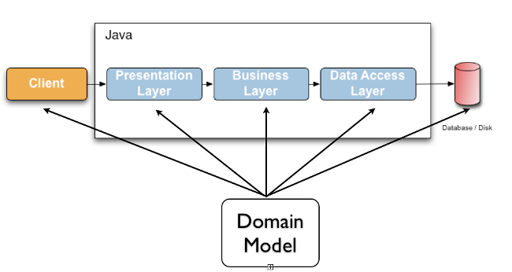

# 목차

<br>

- [목차](#목차)
- [개요](#개요)
- [Bean Validation](#bean-validation)
- [Hibernate Validator](#hibernate-validator)
- [학습 테스트](#학습-테스트)
  - [의존성 추가](#의존성-추가)
  - [검증할 Bean 정의](#검증할-bean-정의)
  - [Validate 테스트](#validate-테스트)
- [참고](#참고)

<br>

# 개요
스프링 부트를 사용하면 validation 의존성을 추가하고, 애노테이션만 붙여주면 Validation을 자동적으로 해준다.

하지만, 어느날 [스프링 놀이터](https://github.com/binghe819/spring-learning-sandbox)에서 부트가 아닌 환경에서 validation을 하려니 하나도 모르는 나를 발견할 수 있었다..

조금이나마 이와 관련된 원리를 이해하고자 Java Bean Validation (이하 Bean Validation)부터, 

이 명세를 구현한 Hibernate Validator에 대해서 정리하였다.

<br>

# Bean Validation

🤔 **Bean Validation이란?**

> Bean Validation defines a metadata model and API for JavaBean validation. 
> 
> The metadata source is annotations, with the ability to override and extend the meta-data through the use of XML validation descriptors. - [Wikipedia - Bean Validation](https://en.wikipedia.org/wiki/Bean_Validation)

* Bean Validation은 JavaBean **유효성 검증을 위한 메타데이터 모델과 API를 정의한다.**
* **Bean Validation은 명세일 뿐 동작하는 코드가 아니다.**
  * 이 명세를 구현한 구현체가 바로 Hibernate Validator다.
* **Bean Validation은 애노테이션을 이용하여 메타데이터를 정의하고, 이를 통해 JavaBean의 유효성을 검증하는 것에 대한 명세이다.**

<br>

🤔 **JavaBean이란?**

여기서 말하는 JavaBean이란 직렬화 가능하고 매개변수가 없는 생성자를 가지며,

getter/setter를 사용하여 프로퍼티에 접근이 가능한 객체를 의미한다.

[Enterprise JavaBeans](https://en.wikipedia.org/wiki/Jakarta_Enterprise_Beans)와 다른 개념이다. - [Wikipedia - JavaBeans](https://en.wikipedia.org/wiki/JavaBeans)

<br>

🤔 **메타데이터?**

<p align="center"><br>출처: https://docs.jboss.org/hibernate/stable/validator/reference/en-US/html_single/</p>

데이터 유효성 검사는 모든 계층에서 발생하는 일반적인 작업이다. 즉, 여러 계층에서 동일한 유효성 검사가 구현되는 경우가 많다.

이러한 유효성 검사의 중복을 피하기 위해, 많은 개발자들은 유효성 검사 로직을 도메인 모델안에 포함시켰다. 

**이는 유효성 검사 로직이 도메인 클래스를 복잡하게 만드는 요인이 된다.**

<br>

<p align="center"><br>출처: https://docs.jboss.org/hibernate/stable/validator/reference/en-US/html_single/</p>

이로 인해, Bean Validation (정확히는 Jakarata Bean Validation)는 유효성 검증을 위한 메타데이터 모델과 API를 정의하였다.

즉, **도메인 클래스들 사이에 분포되어 있는 유효성 검사 로직 (실제로 클래스 자신의 메타데이터)을 도메인 모델로 묶었다.**

이제 특정 애플리케이션 계층이나 프로그래밍 모델과 상관없이 사용할 수 있게 된다.

그리고 **데이터 유효성 검증을 위해 메타 데이터로 애노테이션을 이용한다.**

> 메타 데이터란 데이터에 대한 데이터라고 보면 된다. -> ex. `String email`의 메타 데이터로 `@Email`이 될 수 있다.

<br>

# Hibernate Validator

🤔 **Hibernate Validator?**

* Bean Validation은 Bean Validation은 명세일 뿐 동작하는 코드가 아니다.
  * 이 명세를 대표적으로 구현한 것이 바로 Hibernate Validator이다.

> Hibernate Validator는 JPA에서 사용되는 Hibernate와 완전히 다르다. 혼동하지 말자.
> 
> Hibernate Validator의존성을 추가한다고, JPA에서 사용되는 Hibernate가 추가되지 않는다.

<br>

# 학습 테스트

<br>

## 의존성 추가
```gradle
implementation group: 'org.hibernate.validator', name: 'hibernate-validator', version: '7.0.1.Final'
testImplementation group: 'org.glassfish', name: 'jakarta.el', version: '4.0.1'
```
* Jakarta Bean Validation은 Hibernate Validator에 포함되어 있어서 별도로 지정하지 않아도 된다.
  * 별도로 추가해야된다면 `javax.validation.validation-api`를 추가해주면 된다.
* 실행 환경이 Tomcat같이 EE가 아닌 SE라면 아래 의존성도 추가해줘야한다.
  * `org.glassfish.javax.el`
  * 이는 JSR 341에 명시된 `Unified Expression Language`에 대한 구현체로 Hibernate Validtor가 제약 조건 위반 메시지 표현등을 처리할 때 필요하다고한다.

<br>

## 검증할 Bean 정의
> 다시 한번 말하지만 스프링 DI에서 사용되는 Bean을 의미하지 않는다. JavaBean을 의미한다.

```java
public class User {

    @NotBlank(message = "이름은 없을 수 없습니다.")
    private String name;

    @AssertTrue
    private boolean working;

    @Min(value = 1, message = "나이는 1살보다 적을 수 없습니다.")
    @Max(value = 150, message = "나이는 150살보다 많을 수 없습니다.")
    private int age;

    @Email(message = "이메일 형식이어야 합니다.")
    private String email;

    // 생성자, getter, setter
}
```

<br>

## Validate 테스트
```java
public class HibernateValidatorTest {

    private Validator validator;

    @BeforeEach
    void setUp() {
        ValidatorFactory factory = Validation.buildDefaultValidatorFactory();
        validator = factory.getValidator();
    }

    @DisplayName("유효성 검증 학습 테스트 - 검증 결과를 출력한다.")
    @Test
    void validate() {
        // given
        User invalidUser = new User("", false, 0, "binghe");

        // when
        Set<ConstraintViolation<User>> violations = validator.validate(invalidUser);

        // then
        violations.forEach(violation -> {
            System.out.printf("검사 필드: %s, 유효하지 않은 값: [%s], 메시지: %s \n", violation.getPropertyPath(), violation.getInvalidValue(), violation.getMessage());
        });
    }
}
```
```text
// 결과
검사 필드: name, 유효하지 않은 값: [], 메시지: 이름은 없을 수 없습니다. 
검사 필드: working, 유효하지 않은 값: [false], 메시지: true여야 합니다 
검사 필드: age, 유효하지 않은 값: [0], 메시지: 나이는 1살보다 적을 수 없습니다. 
검사 필드: email, 유효하지 않은 값: [binghe], 메시지: 이메일 형식이어야 합니다.
```

<br>

# 참고
* https://docs.jboss.org/hibernate/stable/validator/reference/en-US/html_single/
* https://www.baeldung.com/javax-validation
* https://kapentaz.github.io/java/Java-Bean-Validation-%EC%A0%9C%EB%8C%80%EB%A1%9C-%EC%95%8C%EA%B3%A0-%EC%93%B0%EC%9E%90/#
* https://www.popit.kr/javabean-validation%EA%B3%BC-hibernate-validator-%EA%B7%B8%EB%A6%AC%EA%B3%A0-spring-boot/
