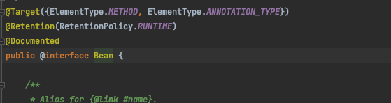

# @Component

 

* 개발자가 직접 컨트롤 가능한 클래스의 경우엔 `@Component`를 사용.
* 애노테이션 타깃이 `TYPE`이다.
  * 즉, 개발자가 직접 개발한 클래스(클래스, 인터페이스, enum)에 `@Component`를 사용할 수 있다.
* `@Component`는 클래스패스 스캔(`ComponentScan`)을 통해 자동 감지와 설정하는데 사용된다.
  * 스프링보고 알아서 스캔하고 빈으로 등록하라는 것.
* `@Component`는 `@Controller`, `@Service`, `@Repository`와 같이 레이어 계층의 컴포넌트를 의미한다.

 

# @Bean

 

* 개발자가 컨트롤 불가능한 외부 라이브러리(서드파티 라이브러리)를 등록할 경우 사용.
  * ex. `ObjectMapper`의 경우 해당 클래스에 `@Component`를 선언하여 사용할 수 없다. `@Bean`통해서만 가능함.
* 애노테이션 타깃이 `METHOD`와 `ANNOTION_TYPE`이다.
  * 즉, 개발자가 직접 개발한 클래스에 `@Bean`을 사용할 수 없다.
* `@Bean`은 사용자가 직접 명시적으로 선언할 때 사용된다.
  * setter나 builder 등을 통해서 사용자가 프로퍼티를 변경해서 생성한 인스턴스를 스프링에게 관리하라는 것.
* `@Bean`은 자바 설정 파일(`@Configuration`)에서 사용된다.
* `@Bean`은 특별한 정의없이 스프링에 등록할 빈 객체를 의미한다. 

 

# 출처
* https://stackoverflow.com/questions/10604298/spring-component-versus-bean
* https://jojoldu.tistory.com/27
* https://codeboje.de/difference-spring-bean-component/
