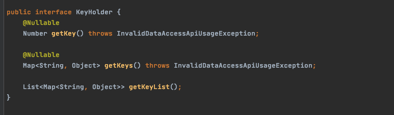

# KeyHolder

> 테스트 코드를 작성하다가 MySQL에서 `AUTO_INCREMENT` 로 만들어지는 PK의 번호를 조회할 필요가 있어져 검색중에 `KeyHolder` 에 대해 알게되어 정리한 자료이다.

[Spring docs - KeyHolder](https://docs.spring.io/spring/docs/current/javadoc-api/org/springframework/jdbc/support/KeyHolder.html)


## 1 KeyHoler란

* 키를 검색하기 위한 인터페이스
  * JDBC 삽입 문에 의해 생성되는 키를 반환해준다.
  * 즉, MySQL의 `AI` 를 통해 생기는 키를 반환해준다.



* `getKey` - Retrieve the first item from the first map, assuming that there is just one item and just one map, and that the item is a number.
* `getKeys` - Retrieve the first map of keys.
* `getKeyList` - Return a reference to the List that contains the keys.


> **주의 사항**
>
> * SQL문을 바로 적는 파라미터 대신, `PreparedStatementCreator` 를 익명 클래스로 생성하여 오버라이드하여 사용해야 한다.
>   * `PreparedStatement` 의 두번째 인자로 자동생성되는 컬럼의 이름을 넣는다.
> * `update` 의 두번째 인자로 `KeyHolder` 객체를 넘긴다.


## 2 KeyHoler 예시

```java
@Override
public User add(User user) {
  KeyHolder keyHolder = new GeneratedKeyHolder();
  jdbcTemplate.update(connection -> {
    PreparedStatement ps = connection.prepareStatement("insert into users(uid, email, name) values (null, ?, ?)", new String[]{"uid"}); // 두번째 인자로 자동생성되는 컬럼의 이름을 넣는다.
    ps.setString(1, user.getEmail());
    ps.setString(2, user.getName());
    return ps;
  }, keyHolder); // update 메서드의 두번째 인자로 KeyHolder를 전달한다.
  Number key = keyHolder.getKey();
  long addedUID = key != null ? key.longValue() : -1;
  return new User.Builder(user)
    .uid(addedUID).build();
}
```


