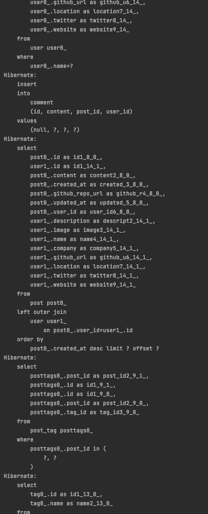
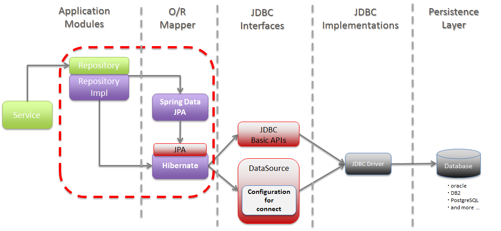
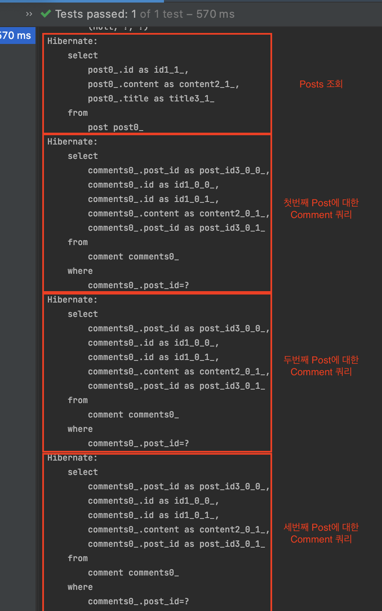
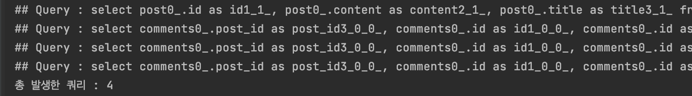
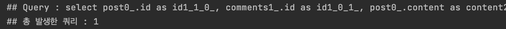

# 목차

<br>

- [목차](#목차)
- [들어가며](#들어가며)
- [사전 지식](#사전-지식)
  - [JDBC와 DataSource 동작 과정](#jdbc와-datasource-동작-과정)
  - [다이내믹 프록시](#다이내믹-프록시)
- [환경 구축](#환경-구축)
  - [간단한 도메인 설계](#간단한-도메인-설계)
  - [N + 1 발생 테스트 작성](#n--1-발생-테스트-작성)
- [쿼리 카운팅 구현](#쿼리-카운팅-구현)
- [N + 1 문제 해결하기](#n--1-문제-해결하기)
- [쿼리 카운팅 로깅 구현](#쿼리-카운팅-로깅-구현)
- [마치며](#마치며)

<br>

# 들어가며
주변에서 특정 비즈니스를 수행하면서 몇 개의 쿼리가 날라가는지 직접 확인하는 장면을 많이 봤다.

적어도 필자는 그랬다.

<p align="center"> </p>

문제는 테스트할 때 위와같이 쿼리가 굉장히 많이 날라가며, 어떤 코드가 몇 개의 쿼리를 날렸는지 파악하기 힘들다.

또한, N + 1 문제와 캐싱 테스트는 쿼리가 얼마나 날라갔는지가 굉장히 중요한 지표가 된다.

**이번 글은 이렇게 특정 시점부터 특정 시점까지 몇 개의 쿼리가 날라가고, 어떤 쿼리가 날라갔는지 쉽게 확인할 수 있는 커스텀 방법을 소개하고자 한다.**

**핵심을 말하자면, 다이내믹 프록시를 이용하여 DataSource의 `getConnection`부분을 프록시로 감싸는 방법이다.**

먼저 쿼리 카운팅을 구현하는데 필요한 사전 지식을 설명하고, N + 1이 발생하는 예시 쿼리 카운팅을 통해 리팩토링하는 과정을 통해 설명하고자한다.

<br>

# 사전 지식
본격적으로 시작하기전에 우선 사전 지식 두 가지가 있다.

1. JDBC 동작 과정
2. 다이내믹 프록시

<br>

## JDBC와 DataSource 동작 과정

<br>

🤔 **JDBC와 DataSource 동작 과정은 왜 알아야하는가?**

<p align="center"><br>출처: https://terasolunaorg.github.io/guideline/5.1.0.RELEASE/en/ArchitectureInDetail/DataAccessJpa.html</p>

* JDBCTemplate, Hibernate등 여러 가지 라이브러리 혹은 프레임워크 **모두 JDBC를 사용하여 DB와 통신을 한다.**
* 그리고 **DataSource를 통해 DB 커넥션을 위한 정보와 커넥션을 제공받는다.**

**결론적으로 JDBC와 DataSource를 통해 커스텀해야 쿼리 카운팅을 할 수 있다.**

<br>

🤔 **도대체 어떻게 한다는 것인가?**

코드를 통해 어느 부분을 커스텀하면 쿼리 카운팅이 가능한지 살펴보자.

> DataSourceConfig
```java
@Configuration
public class DataSourceConfig {

    @Bean
    public UserDao userDao() {
        return new UserDao(dataSource());
    }

    @Bean
    public DataSource dataSource() {
        DriverManagerDataSource dataSource = new DriverManagerDataSource();
        dataSource.setDriverClassName("org.h2.Driver");
        dataSource.setUrl("jdbc:h2:tcp://localhost/~/toby");
        dataSource.setUsername("sa");
        dataSource.setPassword("");
        return dataSource;
    }
}
```
> UserDao
```java
public class UserDao {
    private final DataSource dataSource;

    public UserDao(DataSource dataSource) {
        this.dataSource = dataSource;
    }

    public void save(User user) throws SQLException {
        Connection conn = null;
        PreparedStatement ps = null;
        try {
            // DataSource로부터 Connection을 가져옴.
            conn = dataSource.getConnection();

            // Connection으로부터 Statement를 가져와 SQL 쿼리를 실행한다.
            ps = conn.prepareStatement("insert into users(id, name, password) values(?, ?, ?)");
            ps.setString(1, user.getId());
            ps.setString(2, user.getName());
            ps.setString(3, user.getPassword());

            ps.executeUpdate();
        } catch (SQLException e){
            ...
        } finally {
            ...
        }
    }
    ...
}
```
> 전형적인 난감한 UserDao 예시이다.

<br>

🤔 **위 코드에서 쿼리 카운팅을 해볼 커스텀할 부분을 찾았는가?**
```java
// DataSource로부터 Connection을 가져옴.
conn = dataSource.getConnection();

// Connection으로부터 Statement를 가져와 SQL 쿼리를 실행한다.
ps = conn.prepareStatement("insert into users(id, name, password) values(?, ?, ?)");
```
**바로 SQL 쿼리가 매개변수로 주어지는 `conn.preparedStatement` 메서드 이다.**

즉, **`DataSource`에서 반환하는 `Connection`을 프록시로 감싸서 `preparedStatement`가 호출될 때 해당 매개변수를 카운팅하면 된다.**

> 아직 어려운가? 걱정말라. 밑에서 커스텀하면서 이해가 될 것이다.

<br>

## 다이내믹 프록시
위에서 언급했듯이 `Connection`을 프록시로 감싸야 쿼리 카운팅이 가능하다.

<br>

🤔 **다이내믹 프록시 동작 원리**

<p align="center"> </p>

* 일반적인 프록시와 다르게, 다이내믹 프록시는 모든 요청을 `InvocationHandler`에 위임한다.
  * 즉, `sayHello`, `sayHi`, `sayThankYou`등 메서드를 호출하면 리플렉션을 통해 `Method`와 `args`로 변환되어 `InvocationHandler`의 `invoke()`에 넘겨진다.
  * 부가로직은 기존의 프록시처럼 `InvocationHandler`에 정의해두면 된다.
* **구체적으로 보면 다이내믹 프록시 객체가 클라이언트의 모든 요청을 리플렉션 정보로 변환해서 `InvocationHandler` 구현 객체의 `invoke()`메서드로 넘긴다.**
  * `public Object invoke(Object proxy, Method method, Object[] args)`
    * 만들어진 다이내믹 프록시는 메서드 요청을 리플렉션을 이용해 메타 데이터를 뽑아내고,  
    * `Method`와 매개변수와 함께 `InvocationHandler.invoke`에게 메시지 요청한다.

<br>

> 더 자세한 내용은 [다이내믹 프록시 정리 글](https://github.com/binghe819/TIL/blob/master/OOP&%EC%84%A4%EA%B3%84/%EB%94%94%EC%9E%90%EC%9D%B8%ED%8C%A8%ED%84%B4/Dynamic%20Proxy.md)을 참고.

<br>

🤔 **일반적인 프록시도 있는데 왜 다이내믹 프록시를 사용해야하는가?**

> 필자는 처음에 의문이었다. 하지만 구현하면서 의문점을 해결할 수 있었다.

프록시의 문제점중 하나는 **부가기능이 필요없는 메서드도 구현해서 타깃으로 위임하는 코드를 일일이 만들어줘야한다는 것이다.**

심지어 타깃 인터페이스의 메서드가 추가되거나 변경될 때마다 함께 수정해줘야 한다.

현재 프록시를 통해 커스텀해야하는 인터페이스는 `Connection`이다.

**[Docs - Connection](https://docs.oracle.com/javase/8/docs/api/java/sql/Connection.html)를 가서 메서드 개수를 보면 알겠지만, 10개가 훌쩍 넘는다.**

**반면에, 커스텀에 사용되는 메서드는 `prepareStatement`메서드 뿐이다.**

즉, **관련없는 10개가 넘는 메서드를 모두 위임해주는 코드를 작성해줘야한다.**

이런 수고스러움을 해결하기 위해서 다이내믹 프록시를 이용한다.

<br>

# 환경 구축
본격적인 쿼리 카운팅을 구현하기 전에, 쿼리 카운팅을 테스트해볼 간단한 N + 1 예시를 만들어본다.

<br>

## 간단한 도메인 설계
N + 1이 발생하는 예시를 만들기 위해 간단한 도메인을 설계하였다.

<p align="center"> </p>

<br>

> Post
```java
@Getter
@Entity
public class Post {

    @Id @GeneratedValue(strategy = GenerationType.IDENTITY)
    private Long id;

    private String title;

    private String content;

    // 생성자..

    @OneToMany(mappedBy = "post", cascade = CascadeType.PERSIST)
    private List<Comment> comments;

    public void addComment(Comment comment) {
        comment.setPost(this);
        this.comments.add(comment);
    }
}
```
> Comment
```java
@Getter
@Setter
@Entity
public class Comment {

    @Id @GeneratedValue(strategy = GenerationType.IDENTITY)
    private Long id;

    private String content;

    @ManyToOne(fetch = FetchType.LAZY)
    @JoinColumn(name = "post_id", nullable = false)
    private Post post;

    // 생성자...
}
```

<br>

## N + 1 발생 테스트 작성
간단히 쿼리 카운팅에 사용할 N + 1 발생 테스트 코드를 작성해본다.

[테스트 코드 보러 가기](https://github.com/binghe819/spring-query-counter/blob/main/src/test/java/com/binghe/querycounter/domain/PostRepositoryTest.java)

<br>

<p align="center"> </p>

위와 같이 모든 Post를 조회하면, 각각의 Post마다 Comment를 찾는 쿼리가 나가는 것을 볼 수 있다.

만약 Post가 100개라면 어떻게 될까?.. 쿼리가 101번 나가게 된다.

그래서 N + 1 (100 + 1)라고 부른다.

<br>

# 쿼리 카운팅 구현
이제 본격적으로 쿼리 카운팅을 적용시켜 N + 1 문제를 해결본다.

프록시를 적용하는 것을 큰그림으로 그려보면 다음과 같다.

<p align="center"><br>적용전 </p>

<br>

<p align="center"><br>적용후 </p>

<br>

**카운트 데이터 객체 구현**
> Count
```java
@Getter
public class Count {

    private long value;

    public Count(long value) {
        this.value = value;
    }

    public Count countOne() {
        return new Count(++value);
    }
}
```
> QueryCounter
```java
@Getter
public class QueryCounter {

    private Count count;
    private boolean countable;

    public QueryCounter() {
        countable = false;
        count = new Count(0L);
    }

    public void startCount() {
        countable = true;
        count = new Count(0L);
    }

    public void countOne() {
        if (!isCountable()) {
            throw new RuntimeException("[Error] 아직 카운트를 시작하지 않았습니다.");
        }
        count = count.countOne();
    }

    public void endCount() {
        countable = false;
    }
}
```
* [QueryCounter 테스트 코드](https://github.com/binghe819/spring-query-counter/blob/main/src/test/java/com/binghe/querycounter/query_counter/QueryCounterTest.java)

<br>

**Connection 프록시 구현**
> ProxyConnectionHandler

```java
public class ProxyConnectionHandler implements InvocationHandler {

    private final Connection connection;
    private final QueryCounter queryCounter;

    public ProxyConnectionHandler(Connection connection, QueryCounter queryCounter) {
        this.connection = connection;
        this.queryCounter = queryCounter;
    }

    // 쿼리 카운팅 (부가 기능 구현)
    @Override
    public Object invoke(Object proxy, Method method, Object[] args) throws Throwable {
        if (queryCounter.isCountable()) {
            if (method.getName().equals("prepareStatement")) {
                return getConnectionWithCountQuery(method, args); // 핵심 로직 호출 및 반환
            }
        }
        return method.invoke(connection, args); // 핵심 로직 호출 및 반환
    }

    // 카운트
    private Object getConnectionWithCountQuery(Method method, Object[] args)
        throws InvocationTargetException, IllegalAccessException {
        PreparedStatement preparedStatement = (PreparedStatement) method.invoke(connection, args);

        for (Object statement : args) {
            if (isQueryStatement(statement)) {
                System.out.println("## Query : " + (String) statement); // 추후에 로깅으로 수정 예정
                queryCounter.countOne();
                break;
            }
        }
        return preparedStatement;
    }

    // preparedStatement가 호출될 때 해당 매개변수가 String 형식이며, select으로 시작하는 쿼리인지 체크.
    private boolean isQueryStatement(Object statement) {
        if (statement.getClass().isAssignableFrom(String.class)) { // 매개변수가 String인지 확인
            String sql = (String) statement; 
            return sql.startsWith("select"); 
        }
        return false;
    }
}
```
어려워 보이지만, 사실 간단한 코드이다.

**다이내믹 프록시를 이용하여 `invoke`에 넘어오는 호출 메서드 정보를 바탕으로 `PreparedStatement`메서드면 해당 메서드의 매개변수를 뽑아내서 카운팅하는 것이다.**

[ProxyConnectionHandler - 소스 코드](https://github.com/binghe819/spring-query-counter/blob/main/src/main/java/com/binghe/querycounter/query_counter/ProxyConnectionHandler.java)

<br>

**DataSource 프록시 구현**
> CountDataSource
```java
public class CountDataSource implements DataSource {
    
    private final QueryCounter queryCounter;
    private final DataSource targetDataSource;

    public CountDataSource(QueryCounter queryCounter, DataSource targetDataSource) {
        this.queryCounter = queryCounter;
        this.targetDataSource = targetDataSource;
    }

    @Override
    public Connection getConnection() throws SQLException {
        Connection connection = targetDataSource.getConnection();
        return (Connection) Proxy.newProxyInstance(
            connection.getClass().getClassLoader(),
            connection.getClass().getInterfaces(),
            new ProxyConnectionHandler(connection, queryCounter)
        );
    }

    ... 타깃으로 위임하는 코드
}
```
이제 `Connection`에 프록시를 설정해주기 위해서 기존의 `DataSource`의 프록시 역할을 하는 `CountDataSource` 생성해주었다.

[CountDataSource - 소스 코드](https://github.com/binghe819/spring-query-counter/blob/main/src/main/java/com/binghe/querycounter/query_counter/CountDataSource.java)

<br>

> `getConnection`제외하고는 모든 메서드에 위임하는 코드를 삽입해줘야한다. 
> 
> 프록시의 단점이기도 하며, 이 부분도 다이내믹 프록시를 사용해도 좋다.
> 
> 하지만 필자는 잦은 리플렉션은 성능상 좋지 않고, 메서드의 개수가 적으므로, 이 부분은 일반적인 프록시 패턴을 사용했다.

<br>

**DataSource 설정**
> DataSourceConfig
```java
@Configuration
public class DataSourceConfig {
    
    @Bean
    public QueryCounter queryCounter() {
        return new QueryCounter();
    }

    @Bean
    public DataSource dataSource() {
        DataSource dataSource = DataSourceBuilder.create()
            .driverClassName("org.h2.Driver")
            .url("jdbc:h2:mem:~/test;MODE=MySQL;DB_CLOSE_DELAY=-1;DB_CLOSE_ON_EXIT=FALSE")
            .username("SA")
            .password("").build();
        return new CountDataSource(queryCounter(), dataSource);
    }
}
```
`QueryCount`를 통해 몇 번 쿼리가 날라갔는지 확인해야하기에, 빈으로 등록하여 여러 테스트 코드에서 주입받아 사용할 수 있도록 한다.

`DataSource`는 위에서 만든 프록시 객체 (`CountDataSource`)를 반환하도록 설정한다.

> 가능한 쉽게 코드를 설명할 수 있도록, 쿼리를 로깅하는 기능을 제외했다.

<br>

**사용법**

```java
queryCounter.startCount(); // 카운트 시작
xxxrepository.findById();
xxxrepository.findById();
queryCounter.getCount(); // 개수 확인
queryCounter.endCount(); // 카운트 종료 및 리셋
```

사용법은 위와 같이 간단하다.
1. 카운트 시작
2. 쿼리 실행
3. 카운트 결과 확인
4. 카운트 종료 및 리셋

> 4번에서 다시 1번으로 가는 것도 가능하다.

<br>

# N + 1 문제 해결하기
이제 본격적으로 구현한 QueryCounter로 N + 1문제를 해결해본다.

QueryCounter를 사용하면 위에서 테스트했던 [N + 1 발생 테스트](#n--1-발생-테스트-작성)의 결과가 아래와 같이 나온다.

<p align="center"> </p>

[테스트 코드 보러가기](https://github.com/binghe819/spring-query-counter/blob/main/src/test/java/com/binghe/querycounter/domain/QueryCountPostRepositoryTest.java)

<br>

이제 fetch join으로 N + 1을 해결해보고 다시 테스트를 돌려보면 아래와 같이 쿼리 개수가 1로 바뀐 것을 볼 수 있다.

<p align="center"> </p>

<br>

# 쿼리 카운팅 로깅 구현
To Be Continue...

<br>

# 마치며
캐싱에 대한 테스트를 위해 쿼리 카운터가 필요하여 구현하다보니 이렇게까지 정리하게 되었다.

이해하고 정리하는데 꽤 힘들었지만, 그래도 그 과정에서 프록시와 다이내믹 프록시, JDBC, Hibernate등의 이해도가 깊어져서 좋은 경험이었다!

이후에도 이와 같이 객체지향을 사용한 커스텀을 더욱 많이 해보리~

> 아! Thanks to 나봄 (I'm Spring) 그는 G.O.D

