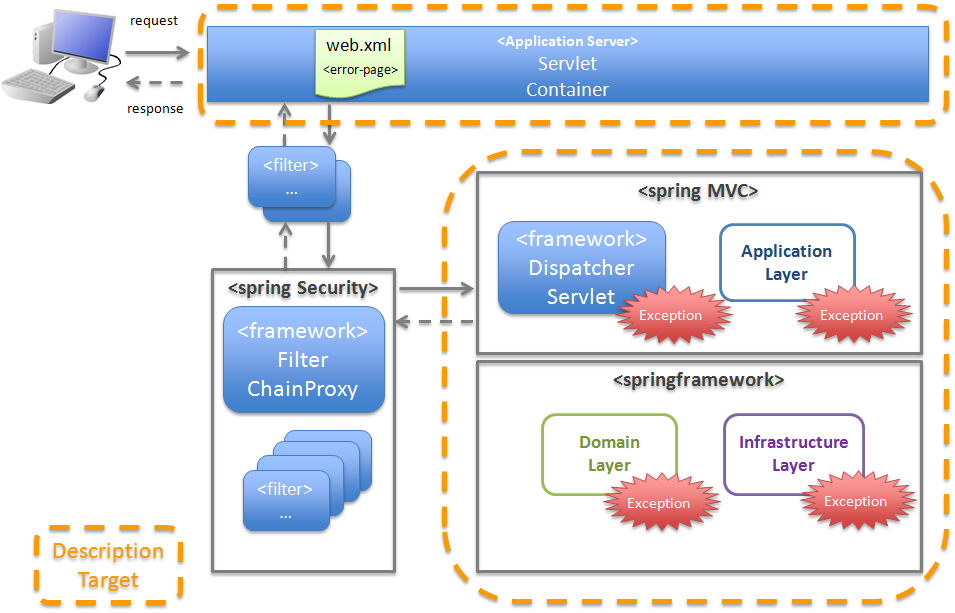

# 목차

- [스프링 예외처리 개념 및 전략](#스프링-예외처리-개념-및-전략)
  * [1 스프링 예외 발생 위치와 처리방법](#1-스프링-예외-발생-위치와-처리방법)
    + [1-1 스프링 처리 과정](#1-1-스프링-처리-과정)
    + [1-2 DispatcherServlet 예외](#1-2-dispatcherservlet-예외)
      - [HandlerExceptionResolver](#handlerexceptionresolver)
    + [1-3 Web Application 레벨 예외 - (예) Filter 예외](#1-3-web-application-레벨-예외---예-filter-예외)
      - [Filter에서 예외가 발생한다면?](#filter에서-예외가-발생한다면)
  * [2 예외 처리 방법](#2-예외-처리-방법)
    + [2-1 Controller레벨에서 처리 - @ExceptionHandler](#2-1-controller레벨에서-처리---exceptionhandler)
    + [2-2 Global 레벨에서의 처리 - @ControllerAdvice](#2-2-global-레벨에서의-처리---controlleradvice)
  * [3 예외 처리 전략](#3-예외-처리-전략)
- [참고](#참고)


# 스프링 예외처리 개념 및 전략

스프링을 통해 프로젝트를 진행하며 예외처리 관련 궁금한 것이 많아저 아예 이렇게 정리하게 되었다.

서버에서 뱉어내는 에러 규격이 일관된 형식이어야 프론트 혹은 서드파티 시스템에서 에러 처리가 단순해진다.


## 1 스프링 예외 발생 위치와 처리방법


### 1-1 스프링 처리 과정

우선 스프링의 (더 정확하게는 스프링MVC)처리 과정을 살펴보자.



<center>출처 : https://terasolunaorg.github.io/guideline/5.3.0.RELEASE/en/ArchitectureInDetail/WebApplicationDetail/ExceptionHandling.html#exception-handling-basic-flow-label </center>

스프링의 처리과정을 보면 예외가 발생하는 부분은 크게 두가지로 나눌 수 있다.

1. Dispatcher Servlet내에서 발생하는 예외 (Controller, Service, Repository등등)
2. Dispatcher Servlet전의 서블릿 (Filter)에서 발생하는 예외


### 1-2 DispatcherServlet 예외

스프링 MVC 에러 중 99프로는 `DispatcherServlet`에서 발생한다고 생각한다.

좋은 소식은 `DispatcherServlet`내에서 발생하는 예외를 내부에서 자체적으로 해결할 수 있다.

바로 `HandlerExceptionResolver`를 사용한 예외 전략이다.


#### HandlerExceptionResolver

* 토비의 스프링 3.1

* https://joont92.github.io/spring/HandlerExceptionResolver-LocaleResolver-MultipartResolver/

* https://jaehun2841.github.io/2018/08/30/2018-08-25-spring-mvc-handle-exception/#handlerexceptionresolver%EB%A5%BC-%EC%9D%B4%EC%9A%A9%ED%95%9C-%EC%B2%98%EB%A6%AC


### 1-3 Web Application 레벨 예외 - (예) Filter 예외

**클라이언트의 요청을 `DispatcherServlet` 밖에서 처리하는 도중 예외가 발생하면 `DispatcherServlet`이 예외를 처리해줄 수 없다.**  즉, `HandlerExceptionResolver`의 처리를 받을 수 없다.

**처리 못하는 이유는 `DispatcherServlet`에서 처리하기도 전에 예외가 발생되기 때문이다.**

이렇게 **Filter에서 예외가 발생하면 Web Application 레벨에서 처리를 해줘야 한다.**


#### Filter에서 예외가 발생한다면?

1. web.xml에 error-page를 잘 등록해줘서 에러를 사용자에게 응답
2. **Filter내부에서 예외를 처리하기 위한 필터를 따로 둬서 try-catch문을 사용하여 예외 처리**
   * 실제 시큐리티 인가 처리중 예외가 발생하면 ExceptionTranslationFilter에게 예외를 던져 처리한다. (try-catch)
3. **Filter 내부에서 try-catch 구문을 통해 예외 발생 시, HandlerExceptionResolver를 빈으로 주입받아 @ExceptionHandler에서 처리하는 방법**
   * 즉, 필터에서 발생하는 예외를 DispatcherServlet의 예외 처리기인 HandlerExceptionResolver에 보내서 처리하는 방식이다.

```java
@Component
public class FilterChainExceptionHandler extends OncePerRequestFilter {
  private final Logger log = LoggerFactory.getLogger(getClass());

  @Autowired
  private HandlerExceptionResolver resolver; // HandlerExceptionResolver를 빈으로 주입 받는다.

  @Override
  protected void doFilterInternal(HttpServletRequest request, HttpServletResponse response, FilterChain filterChain)
    throws ServletException, IOException {

    // 다음 필터를 호출하기 전에 doFilter를 try/catch문으로 감싼다.
    try {
      filterChain.doFilter(request, response);
    } catch (Exception e) {
      log.error("Spring Security Filter Chain Exception:", e);
      resolver.resolveException(request, response, null, e);
    }
  }
}
```

```java
// 자바 시큐리티 설정
@Configuration
@EnableWebSecurity
public class SecurityConfiguration extends WebSecurityConfigurerAdapter {

    @Autowired
    private FilterChainExceptionHandler filterChainExceptionHandler;

    @Override
    protected void configure(HttpSecurity http) throws Exception {
      	// xxx 필터 앞에 FilterExceptionHandler를 추가해준다.
        http
            .addFilterBefore(filterChainExceptionHandler, xxx.class) 
            (...)
    }
}
```


## 2 예외 처리 방법

스프링에서 예외처리는 크게 3가지로 나눌 수 있다. 

1. 컨트롤러단에서 처리 Controller Level - @ExceptionHandler
2. 전역 처리 Global Level - @ControllerAdvice
3. 메서드단위 처리 Method Level - try/catch

> 정확히는 DispatcherServlet에서 발생하는 예외를 `HandlerExceptionResolver`가 처리하는 처리 방법들.


### 2-1 Controller레벨에서 처리 - @ExceptionHandler

스프링에서 Controller에서 발생하는 예외를 공통적으로 처리할 수 있는 기능을 제공한다.

**`@ExceptionHandler`애노테이션을 통해 Controller의 메서드에서 throw된 Exception에 대한 공통적인 처리를 할 수 있다.**

```java
@RestController
public class TestController {

    private final Logger logger = LoggerFactory.getLogger(UserController.class);

    // 예외 핸들러
    @ExceptionHandler(value = TestException.class)
    public String controllerExceptionHandler(Exception e) {
        logger.error(e.getMessage());
        return "/error/404";
    }

    @GetMapping("hello1")
    public String hello1() {
        throw new TestException("hello1 에러 "); // 강제로 예외 발생
    }

    @GetMapping("hello2")
    public String hello2() {
        throw new TestException("hello2 에러 "); // 강제로 예외 발생
    }
}
```

TestController내에서 발생하는 TestException에 대해서 예외가 발생하면 `controllerExceptionHandler`메서드에서 모두 처리해준다.

* Controller 메서드 내의 하위 서비스 (Service, Repository등등)에서 예외가 발생하더라도, 중간에 처리하지 않는 이상 Controller단까지 예외가 던져지게 되고 `@ExceptionHandler`가 예외를 처리하게 된다.
  * Checked Exception, Runtime Exception 상관 없이 Controller까지 예외를 throw하면 처리가 가능하다.


### 2-2 Global 레벨에서의 처리 - @ControllerAdvice

만약 하나의 Controller말고 여러 Controller에서 발생하는 예외를 처리하려면 `@ControllerAdvice`를 사용해야 한다.

* @ControllerAdvice
  * 모든 Controller에서 발생하는 예외를 처리할 수 있게 해주는 애노테이션
  * DispatcherServlet에서 발생하는 예외를 전역적으로 처리해준다.
* @RestControllerAdvice
  * @ControllerAdvice + @ResponseBody

> @ControllerAdvice는 DispatcherServlet에서 발생하는 예외만 처리할 수 있다.
>
> 필터에서 발생하는 예외는 따로 처리해주지 않으면 처리가 불가하다.

```java
@RestControllerAdvice
public class GlobalExceptionHandler {

    private final Logger logger = LoggerFactory.getLogger(GlobalExceptionHandler.class);

    @ExceptionHandler(value = TestException.class)
    public String testExceptionHandler(Exception e) {
        logger.error(e.getMessage());
        return "/error/404";
    }
}
```

* Controller에서 발생하는 예외를 전역적으로 처리해준다.


> Controller의 `@ExceptionHandler`와 ControllerAdvice의 `@ExceptionHandler`중 높은 우선순위는?
>
> * **Controller의 `@ExceptionHandler`가 먼저다.**


## 3 예외 처리 전략

예외 처리 전략은 아주 다양하게 처리하는 것 같다. 상황에 맞춰 사용하면 될 듯하다.

* https://cheese10yun.github.io/spring-guide-exception/
* https://www.baeldung.com/rest-api-error-handling-best-practices
* https://www.toptal.com/java/spring-boot-rest-api-error-handling


# 참고

* 토비의 스프링 3.1
* https://stackoverflow.com/questions/34595605/how-to-manage-exceptions-thrown-in-filters-in-spring