[스프링 입문을 위한 자바 객체 지향의 원리와 이해](http://www.yes24.com/Product/Goods/17350624)를 바탕으로 정리한 자료입니다.


# AOP

스프링의 3대 프로그래밍 모델 중 두 번째는 AOP이다.

AOP는 Aspect - Oriented Programming의 약자이고, 번역하면 관점 지향 프로그래밍이다. (관심사)

* 특징
  * AOP는 인터페이스 기반이다.
  * AOP는 프록시패턴(데코레이터)를 이용한다.
  * AOP는 런타임 기반이다.


## 1. AOP란?


### 1-1. AOP 개념

* AOP란?
  * 스프링 DI가 의존성(new)에 대한 주입이라면 AOP는 로직(code)주입이라고 할 수 있다.
  * 관점 지향 프로그래밍을 뜻하는데 관점 지향은 쉽게 말해 ***어떤 로직을 기준으로 핵심적인 관점, 부가적인 관점으로 나누어서 보고 그 관점을 기준으로 각각 모듈화하겠다는 것이다***
    * 핵심적인 관점 : 비즈니스 로직 (INSERT, SELECT등등)
    * 부가적인 관점 : 핵심 로직을 실행하기 위해서 행해지는 로직 (DB연결, 로깅, 파일 입출력 등)
* 예시
  * 
  * 입금, 출금, 이체 모듈에서 로깅, 보안, 트랜잭션 기능이 반복적으로 나타나는 것을 볼 수 있다.
  * 다수의 모듈에 공통적으로 나타나는 부분이 존재하는데, 바로 이것을 횡단 관심사(부가적인 관점)이라 한다.
  * 대표적인 예시가 JDBC이다.
* `코드 = 핵심 관심사(핵심적인 관점) + 횡단 관심사(부가적인 관점)`

* 예시

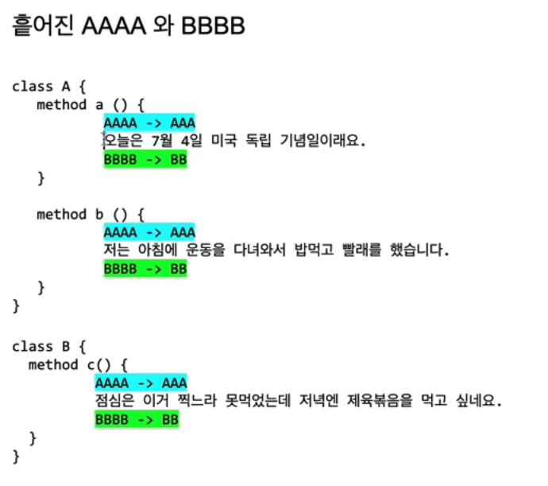

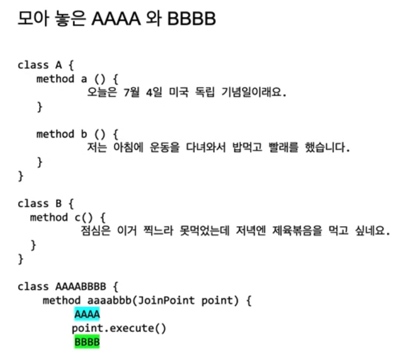

( 출처 : 백기선님 강의 )


### 1-2. 메서드에 로직을 주입할 수 있는 곳

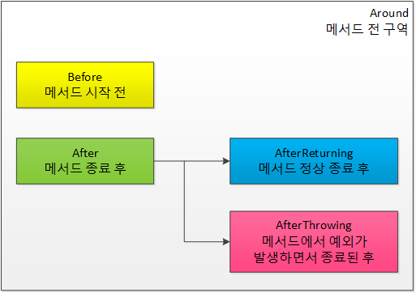

* 개념
  * ***스프링 DI가 의존성에 대한 주입이라면 스프링 AOP는 로직 주입이라고 볼 수 있다.***
  * 객체지향에서 로직이 있는 곳은 당연히 메서드이다.
* 메서드에서 코드를 주입할 수 있는 곳
  * Around : Advice가 타겟 메서드를 감싸서 타겟 메서드 호출전과 후에 Advice기능 수행
  * Before : Advice 타겟 메서드가 호출되기 전에 Advice 기능을 수행
  * After : 타겟 메서드의 결과에 관계없이 타켓 메서드가 완료되면 Advice 기능 수행
  * AfterReturning : 정상적 반환 이후 타겟 메서드가 성공적으로 결과값을 반환 후에 Advice 기능 수행
  * AfterThrowing : 예외 발생 이후 타겟 메서드가 수행 중 예외를 던지게 되면 Advice 기능 수행


### 1-3. AOP 구현 방법

1. 컴파일 (AspectJ)
   * `A.java` ---(AOP)---> `A.class`
   * 컴파일을 한 코드에는 AOP가 적용된 것 처럼 하는 방식
2. 바이트코드 조작
   * `A.java` ------> `A.class` ---(AOP)---> 메모리
   * `A.class`에서 클래스로더를 사용해서 바이트코드를 메모리에 올릴때 AOP 적용
3. 프록시 패턴 (스프링 AOP)
   * https://refactoring.guru/design-patterns/proxy


### 1-4. AOP가 필요한 상황

* 모든 메서드의 호출 시간을 측정하고 싶다면?
* 공통 관심 사항(cross-cutting concern) vs 핵심 관심 사항 (core concern)

* 회원 가입 시간, 회원 조회 시간을 측정하고 싶다면?

> AOP를 적용하지 않은 예시

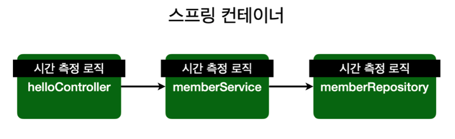

* 설명
  * **측정하고 싶은 메서드마다 시간 측정 로직을 넣어주는 것이다.**
* 문제
  * ***만약 측정하는 기준을 바꾸고 싶으면 모든 로직의 대한 코드를 바꿔줘야한다.***
  * 회원 가입, 회원 조회에 시간을 측정하는 기능은 핵심 관심 사항이 아니다.
  * 시간을 측정하는 로직은 공통 관심 사항이다.

* 의존 관계


> AOP를 적용한 예시

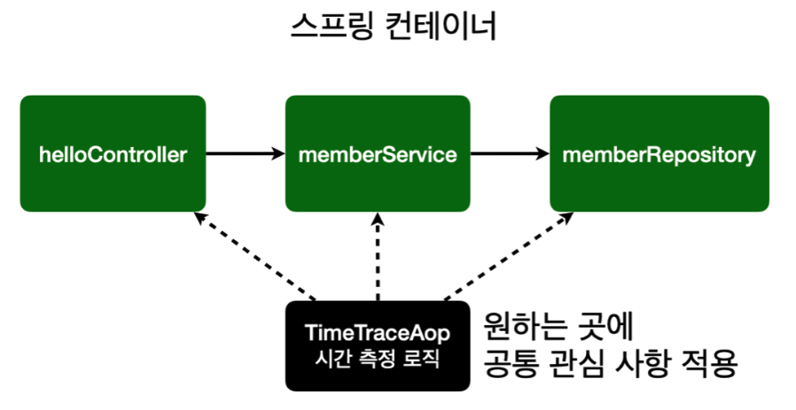

* 설명
  * 하나의 Aspect를 만들고, 시간을 측정하고 싶은 메서드에 주입해준다.
* 해결
  * ***회원 가입, 회원 조회등 핵심 관심사항과 시간을 측정하는 공통 관심 사항을 분리한다.***
  * 시간을 측정하는 로직을 별도의 공통 로직으로 만들었다.
  * 핵심 관심 사항을 깔끔하게 유지할 수 있다.
  * ***변경이 필요하면 이 로직만 변경하면 된다.***

* 의존 관계

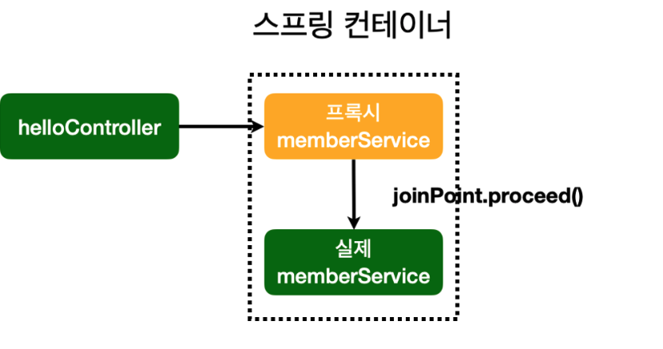

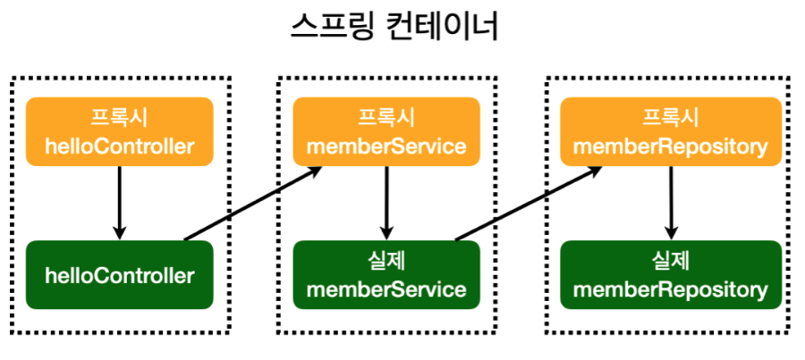

( 사진 출처 : 김영한님의 강의 )


## 2. 예시를 통한 AOP

AOP를 이해하기 위해서는 예시를 보는 것이 제일 좋은 것 같다.


### 2-1. AOP를 사용하지 않은 경우

> 남자와 여자의 삶을 프로그래밍한다고 가정해보자.

* 남자
  * 열쇠로 문을 열고 집에 들어간다.
  * __컴퓨터로 게임을 한다.__
  * 소등하고 잔다.
  * 자물쇠를 잠그고 집을 나선다.
  * 예외상황처리 : 집에 불남 - 119에 신고한다.
* 여자
  * 열쇠로 문을 열고 집에 들어간다.
  * __요리를 한다.__
  * 소등하고 잔다.
  * 자물쇠를 잠그고 집을 나선다.
  * 예외상황처리 : 집에 불남 - 119에 신고한다.

```java
// 남자
public class Boy {
  public void runSomething() {
    System.out.println("열쇠로 문을 열고 집에 들어간다.");
  
    try {
      System.out.println("컴퓨터로 게임을 한다"); // 핵심적인 관점
    } catch (Exception e){
      if(ex.getMessage.equals("집에 불남")){
        System.out.println("119에 신고한다.");
      }
    } finally {
      System.out.println("소등하고 간다.");
    }

    System.out.println("자물쇠로 잠그고 집을 나선다.")
  }
}

// 여자
public class Girl {
  public void runSomething() {
    System.out.println("열쇠로 문을 열고 집에 들어간다.");
  
    try {
      System.out.println("요리를 한다."); // 핵심적인 관점
    } catch (Exception e){
      if(ex.getMessage.equals("집에 불남")){
        System.out.println("119에 신고한다.");
      }
    } finally {
      System.out.println("소등하고 간다.");
    }

    System.out.println("자물쇠로 잠그고 집을 나선다.")
  }
}
```

* 해석
  * 위 코드를 보면 `Boy`와 `Girl`의 `runSomething()`로직을 보면 반복되는 코드가 엄청 많다.


### 2-2. AOP를 적용한 예제


#### 2-2-1. 예제

```xml
<?xml version="1.0" encoding="UTF-8"?>
<beans xmlns="http://www.springframework.org/schema/beans"
       xmlns:xsi="http://www.w3.org/2001/XMLSchema-instance"
       xsi:schemaLocation="http://www.springframework.org/schema/beans
                           http://www.springframework.org/schema/beans/spring-beans.xsd">
  
  <aop:aspectj-autoproxy />
  <bean id="myAspect" class="aop002.MyAspect" />
  <bean id="boy" class="aop002.Boy" />
</beans>
```

* 달라진 점
  * `myAspect`라고 하는 빈이 설정되었다.

```java
// Person.java
public interface Person {
  void runSomething();
}

// Boy.java
public class Boy implements Person {
  public void runSomething() {
    System.out.println("컴퓨터로 게임을 한다.");
  }
}

// MyAspect 
@Aspect
public class MyAspect {
  @Before("execution(public void aop002.Boy.runSomething())")
  public void before(JoinPoint joinPoint){
    System.out.println("얼굴 인식 확인 : 문을 개방하라");
    // System.out.println("열쇠로 문을 열고 집에 들어간다.");
  }
}
```

* 해석
  * AOP적용을 위해 인터페이스 기반으로 `Boy`를 변경하였다.
  * `MyAspect`가 추가되었다.
* `@Aspect`
  * 이 클래스는 이제 AOP(컨테이너)에서 사용하겠다는 의미
* `@Before`
  * 대상 메서드 실행 전에 이 메서드를 실행하겠다는 의미.
* `JoinPoint`
  * `JoinPoint`는 `@Before`에서 선언된 메서드인 `aop002.Boy.runSomething()`을 의미한다.


#### 2-2-2. 설명

> AOP 적용 전/후

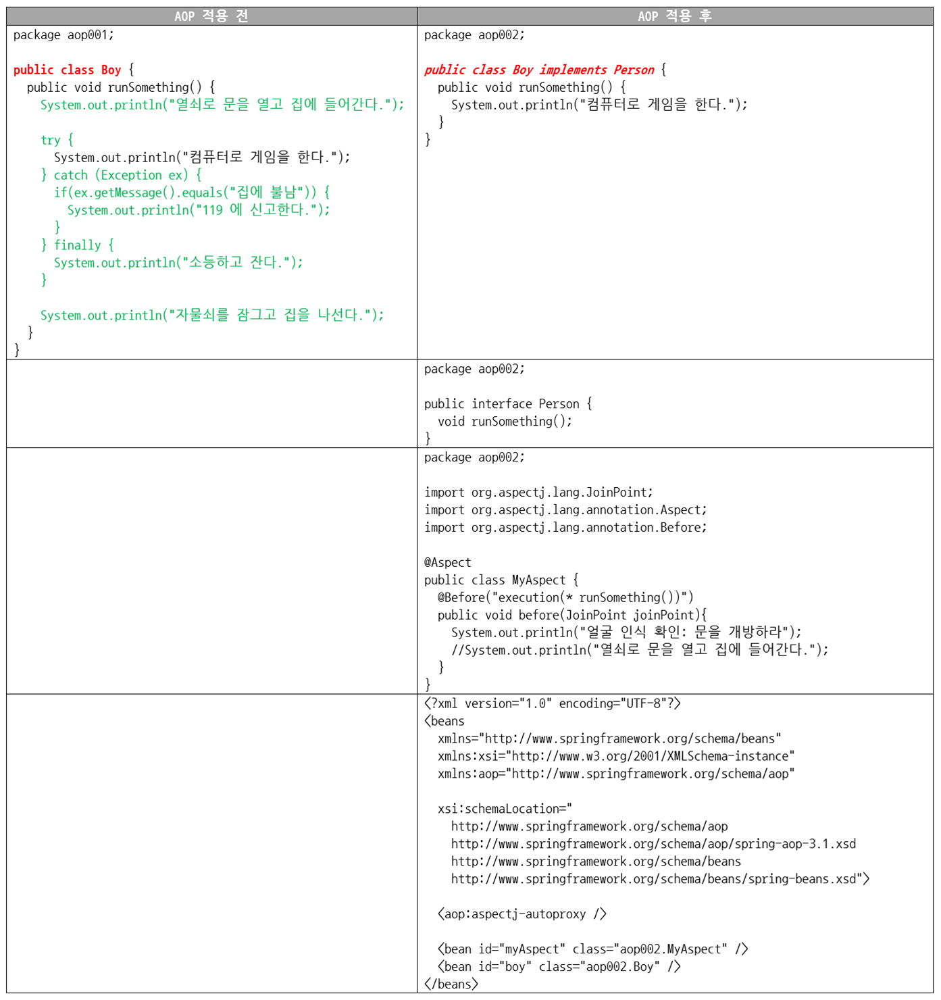

* 중요한 점 - `Boy.java`
  * 횡단 관심사(부수적인 관점)은 모두 사라지고 오직 핵심 관심사(핵심적인 관점)만 남았다.
  * 비록, 자바 파일은 더 많아졌지만, 추가 개발과 유지보수 관점에서 무척이나 편한 코드가 되었다.

* AOP를 통해 런타임에 로직 주입
  * 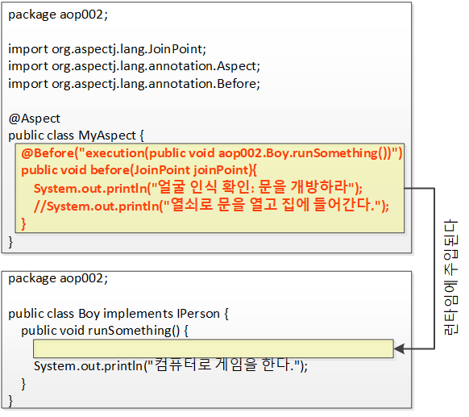
  * `@Before`로 만들어진 `before`메서드가 런타임에 위와 같이 주입된다.
  * ***프락시/데코레이터 패턴을 사용하는 것을 볼 수 있다.***
* AOP를 통해 런타임에 로직 주입 (상세)
  * 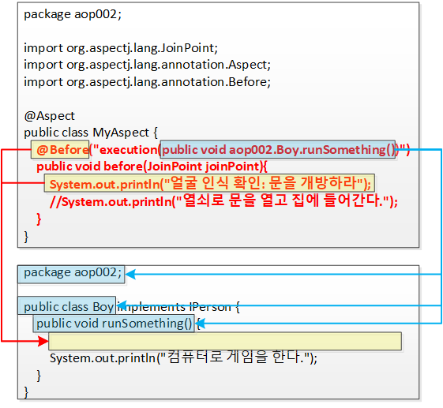
* 만약 `@Before("execution(* runSomething())")`로 변경한다면?
  * 모든 `runSomething()`메서드를 강제 구현시키는 `Person`인터페이스를 구현한 객체에서 실행된다.
  * `Girl.java`의 `runSomething()`메서드도 `@Before`를 통해 같은 로직을 주입해 줄 수 있다.


### 2-3. AOP는 프록시 패턴을 이용한다.

> 아래는 `Boy`와 `Girl` 예제에 AOP를 적용한 것이다.

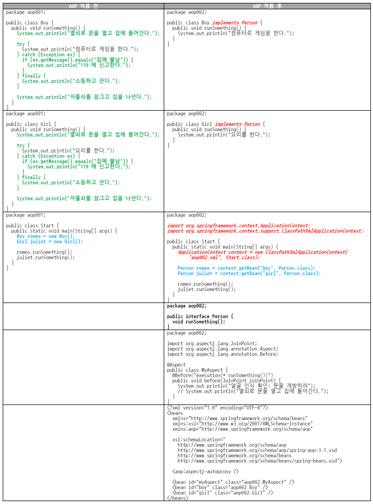

* 해석
  * 초록색 부분 : 횡단 관심사(부수적인 관점)이기 때문에 사라지는 것이다.
  * 붉은색 부분 : 스프링 AOP가 인터페이스 기반으로 작동하기 때문에 그 요건을 충족하기 위해서다.
* ***AOP는 인터페이스 기반이다.***
  
  * `Person`인터페이스를 이용하여 AOP를 적용시킬 객체들을 구현시킨다.
* `MyAspect.java` : 횡단 관심사(부수적인 관점)
  * `Boy`와 `Girl`에서 공통적으로 나타나는 횡단 관심사를 모두 삭제했지만 결국 누군가는 횡단 관심사를 처리해야 한다.
  * `MyAspect`가 바로 횡단 관심사를 처리하게 된다.
* `bean`
  * 빈이 설정되는 이유는 객체의 생성과 의존성 주입을 스프링 프레임워크에 위임하기 위해서다.
  * 스프링 프레임워크는 객체 생성뿐 아니라 객체의 생명주기 전반에 걸쳐 빈의 생성과 소멸까지 관리한다.
* `<aop:aspectj-autoproxy />` 
  
* 스프링에게 AOP프록시를 사용하라고 알려주는 지시자이다.
  
* 프록시 없이 직접 호출

  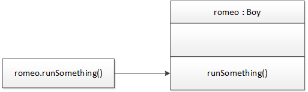

* 프록시 패턴(AOP)를 이용한 경우

  

  * 호출하는 쪽에서 `romeo.runSomethong()`을 호출하면 프록시가 그 요청을 받아 진짜 `romeo`객체에게 요청을 전달한다.
  * `romeo`프록시는 `runSomething()`을 그냥 전달만 하지 않고 중간에 로직을 추가하거나 수정할 수 있다.(데코레이터)


> * 스프링 AOP는 프록시패턴을 사용한다.
>   * 개발자는 알지 못하지만 설정만 해주면, 스프링의 AOP컨테이너가 알아서 로직을 주입해준다.
> * 프록시 패턴
>   * 버퍼도 일종의 프록시라 볼 수 있다.
>   * ***존재 목적은 다르지만 하는 역할은 모두 중간에서 가로채는 것이라는 동일한 일을 한다.***


## 3. AOP용어

AOP에는 5가지의 용어가 존재한다.

- Aspect : 관점, 측면, 양상
  - 흩어진 관심사를 모듈화 한 것. 주로 부가기능을 모듈화함.

- Target
  - Aspect를 적용하는 곳 (클래스, 메서드)
- Advice : 조언, 충고
  - 실질적으로 어떤 일을 해야할 지에 대한 것, 실질적인 부가기능을 담은 구현체 (`myAspect`)
- JoinPoint : 결합점
  - Advice가 적용 될 위치, 끼어들 수 있는 지점. 
- PointCut : 자르는 점
  - JoinPoint의 상세한 스펙을 정의한 것.
  - `A란 메서드의 진입 시점에 호출할 것`과 같이 더욱 구체적으로 Advice가 실행될 지점을 정할 수 있다.


### 3-1. PointCut

```java
@Aspect
public class MyAspect {
  @Before("execution(* runSomething())") // PointCut
  public void before(JoinPoint joinPoint){
    System.out.println("얼굴 인식 확인 : 문을 개방하라");
  }
}
```

* PointCut이란?
  * 어디에 적용해야하는지?
  * 자르는 지점? ***Aspect 적용 위치 지정자***
  * `(* runSomething())`부분이 바로 PointCut이다.
  * PointCut은 횡당 관심사(부수적인 관점)를 적용할 타깃 메서드를 선택하는 지시자(메서드 선택 필어)인 것이다.
  * ***타깃 클래스의 타킷 메서드 지정자***


### 3-2. JoinPoint

* JoinPoint란?
  * 합류점. 메서드가 실행될 때의 시점. (메타정보)
  * 광의
    * PointCut은 JoinPoint의 부분 집합이다.
    * ***PointCut의 후보가 되는 모든 메서드들이 JoinPoint이다.*** 즉, Aspect 적용이 가능한 지점이 된다.
    * ***JoinPoint = Aspect 적용이 가능한 모든 지점.***
    * ***스프링 AOP에서 JoinPoint란 스프링 프레임워크가 관리하는 빈의 모든 메서드에 해당한다.***
  * 협의
    * JoinPoint란 호출된 객체의 메서드다.
    * JoinPoint는 그때 그때 다르다.
    * ***`romeo.runSomething()`메서드를 호출한 상태라면 JoinPoint는 `remeo`객체의 `runSomething()`메서드가 된다.***
    * ***`juliet.runSomething()`메서드를 호출한 상태라면 JoinPoint는 `juliet`객체의 `runSomething()`메서드가 된다.***
* JoinPoint 파라미터를 이용하면 실행 시점에 실제 호출된 메서드가 무엇인지, 실제 호출된 메서드를 소유한 객체가 무엇인지, 또 호출된 메서드의 파라미터는 무엇인지 등의 정보를 확인할 수 있다.


> 스프링 AOP는 인터페이스 기반이며, 인터페이스는 추상 메서드의 집합체다.
>
> 그러므로, 스프링 AOP는 메서드에만 적용 가능하다. (메서드 주입)


### 3-3. Advice

* Advice란?
  * 조언? 언제 무엇을!
  * Advice는 PointCut에 적용할 로직, 즉 메서드를 의미하는데, 여기에 더해 언제라는 개념까지 포함하고 있다.
  * ***Advice란 PointCut에 언제, 무엇을 적용할지 정의한 메서드다.***
  * ***`MyAspect`라고 생각하면 된다.***


### 3-4. Aspect

* Aspect란?
  * AOP에서 Aspect는 여러 개의 Advice와 여러 개의 PointCut의 결합체를 의미하는 용어다.
  * ***Aspect = Advice + PointCut***
    * ***Advice는 언제(when), 무엇을(what)을 의미한다.***
    * ***PointCut은 어디에(where)를 의미한다.***
  * ***결국 Aspect = When + Where + What이다.***


### 3-5. Advisor

* Advisor란?
  * Advisor = 한 개의 Advise + 한 개의 PointCut


## 4. 프록시 패턴 예시


### 4-1. 카드

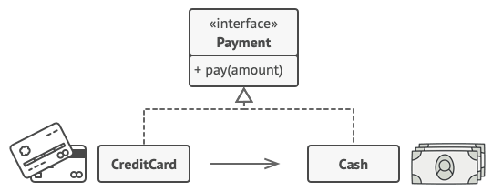

* 해석
  * 카드는 현금의 프록시이다.
  * 카드와 현금은 결제 수단이라는 같은 인터페이스를 구현하고 있다. (`Payment`) 
  * 그러므로, 카드와 현금은 모두 결제 수단을 사용이 가능하다.
  * 이제 사용자는 카드만을 가지고 다니면 되므로 매우 편리하다. 

```java
public interface Payment{
  void pay(int amount);
}

public class Store {
  Payment payment;
  
  public Store(Payment payment) {
    this.payment = payment;
  }
  
  public void buySomething() {
    payment.pay(100);
  }
}

// Target
public class Cash implements Payment{
  @Override
  public void pay(int amount){
    System.out.println(amount + " 현금 결제");
  }
}

// 프록시 ( Aspect )
public class CreditCard implements Payment {
  
  Payment payment = new Cash();
  
  @Override
  public void pay(int amount){
    // 프록시에 로직을 넣을 수 있다!!
    if(amount > 100)
	    System.out.println(amout + " 신용 카드");
    else
    	cash.pay(amount); // 현금 결제
  }
}

public class Client {
  public static void main(String[] args){
    Payment payment = new CreditCard();
    payment.pay(100); // 카드 결제
    payment.pay(50); // 현금 결제
  }
}
```

* 여기서 중요한 점
  * 바로 `CreditCard`라는 프록시 객체의 `pay`안에 로직을 넣어줬다는 것이다.


### 4-2. 메서드의 성능 측정

> 두 개의 메서드가 실행될 때 마다 해당 메서드의 성능 측정을 하는 AOP를 구현하는 예제


* Target 설정
  * 
  * 성능 측정을 하고 싶은 메서드에 에노테이션을 붙여준다.
* 마커용 에노테이션을 만들어준다.
  * 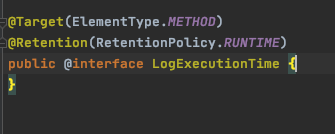
* Aspect를 생성해준다.
  * 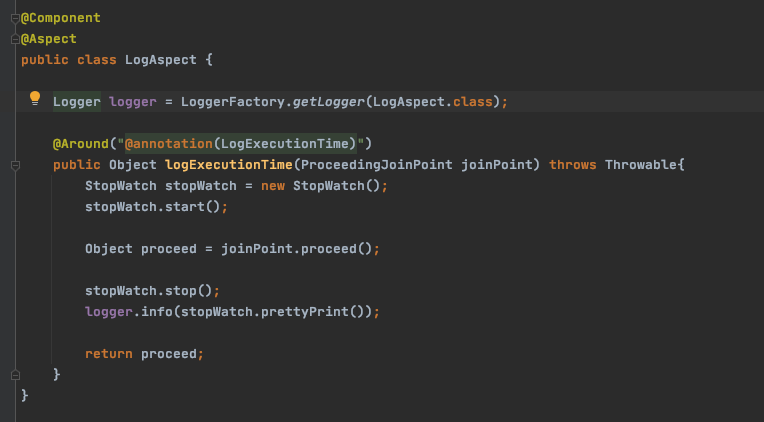
  * Bean으로 등록해줘야 한다.
  * 이제 `target` 들이 실행될 때마다 성능 측정이 된다.


