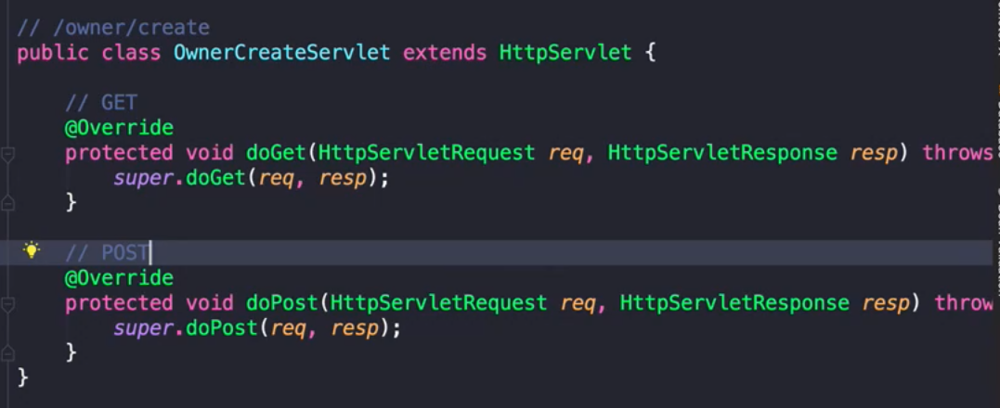
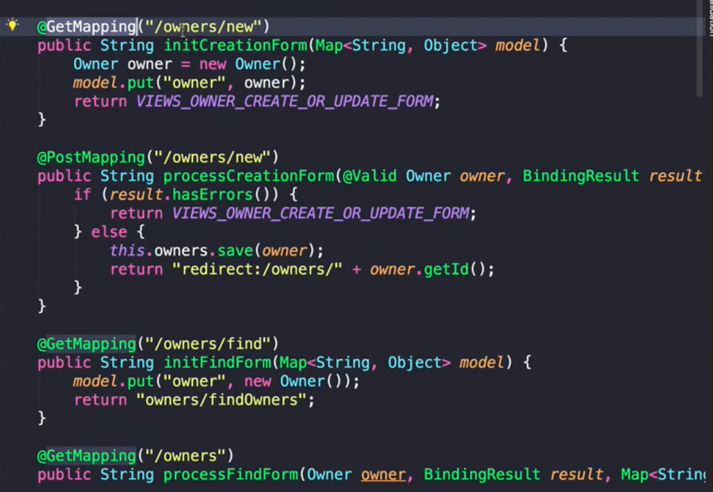

[스프링 입문을 위한 자바 객체 지향의 원리와 이해](http://www.yes24.com/Product/Goods/17350624)를 바탕으로 정리한 자료입니다.

#  PSA

PSA (Portable Service Abstraction)

## 1. PSA란?

### 1-1. PSA 개념

* 개념
  * ***PSA (Portable Service Abstraction)는 일관성 있는 서비스 추상화***를 의미한다.
  * 스프링에서는 서비스 추상화를 위해 다양한 어댑터를 제공한다.
  * ***서비스 추상화를 해주면서 그것도 일관성 있는 방식을 제공한다고 해서 이를 PSA***라고 한다.
* 서비스 추상화란?
  * JDBC에서 데이터 베이스 종류에 관계 없이 같은 방식으로 제어할 수 있는 이유는 어댑터 패턴을 활용했기 때문이다.
  * 이처럼 ***같은 일을 하는 다수의 기술을 공통의 인터페이스로 제어할 수 있게 하는 것을 서비스 추상화***라고 한다.
* PSA 예시
  * 스프링 MVC
  * 스프링 WebFlux
  
* 스프링에서 서비스 추상화를 하는 이유?
  * https://en.wikipedia.org/wiki/Service_abstraction

### 1-2. PSA의 예제

* 기존의 서블릿 코드

  * 

* 스프링의 서블릿 추상화 버전 ( 웹 MVC )

  * 
  * ***스프링은 에노테이션 기반으로 코딩을 할 수 있지만, 그 아래단(기반)은 서블릿으로 동작하게 된다.***
  * 서블릿을 사용하지 않아도 된다.

* 스프링에서의 추상화

  * `@Controller`를 사용하면 해당 클래스 안에 `@GetMapping` 혹은 `@PostMapping` 등을 이용해서 요청을 매핑할 수 있다.

  * 또한 `@Getmapping` 안에도 여러 에노테이션을 사용한 매핑들이 있다.

    

