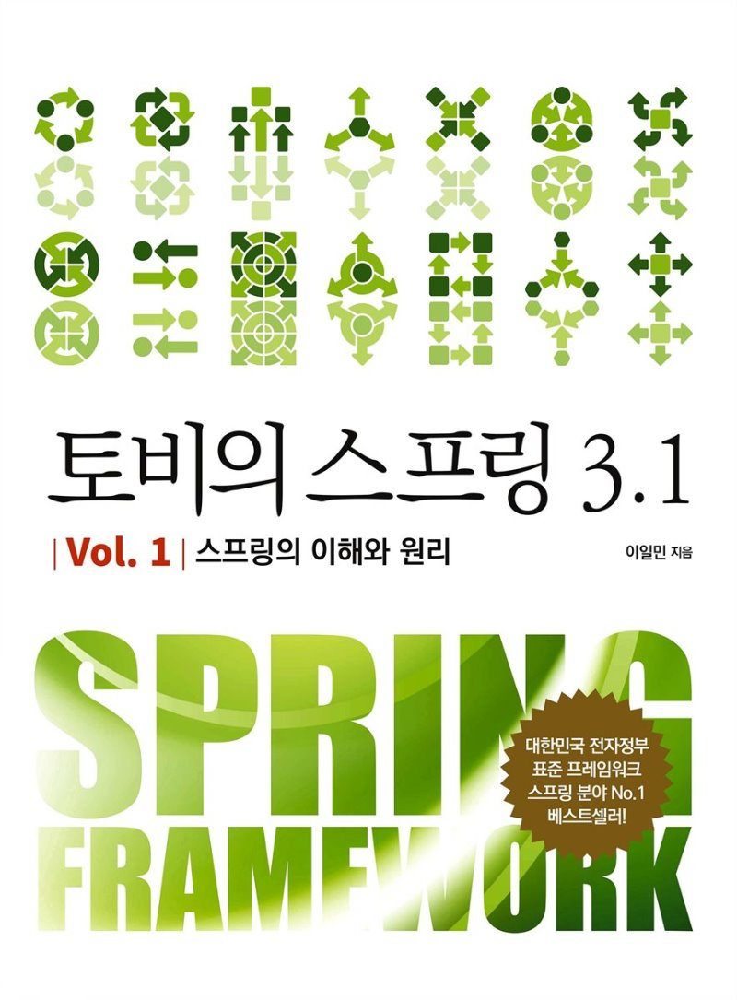

[토비의 스프링](http://www.yes24.com/Product/Goods/76074405?OzSrank=2)을 바탕으로 작성한 자료입니다.

 

 

## 스프링이란 무엇인가?

 

### 애플리케이션의 기본 틀 - 스프링 컨테이너
* **스프링은 스프링 컨테이너 또는 애플리케이션 컨텍스트라고 불리는 스프링 런타임 엔진을 제공한다.**
  * **스프링 컨테이너는 설정정보를 참고로 해서 애플리케이션을 구성하는 객체를 생성하고 관리한다.**
    * 설정정보: XML, 애노테이션 등등의 기반으로 설정
  * 스프링 컨테이너는 독립적으로 동작할 수도 있지만 보통 웹 모듈에서 동작하는 서비스나 서블릿으로 등록해서 사용한다.

 

### 공통 프로그래밍 모델 - IoC/DI, 서비스 추상화, AOP
* 프레임워크는 애플리케이션을 구성하는 객체가 생성되고 동작하는 방식에 대한 틀을 제공해줄 뿐만 아니라, 어떻게 작성해야 할지 기준을 제시한다.
* **스프링의 핵심 세 가지 모델**
  * IoC/DI: 객체의 생명주기와 의존관계에 대한 프로그래밍 모델이다. 프레임워크를 이루는 객체지향 설계 원칙과 디자인 패턴의 핵심 원리로 사용된다.
  * 서비스 추상화: 스프링을 사용하면 환경이나 서버, 특정 기술에 종속되지 않고 이식성이 뛰어나며 유연한 애플리케이션을 만들 수 있는데, 이를 가능하게 해주는 것이 바로 서비스 추상화다.
    * 구체적인 기술과 환경에 종속되지 않도록 유연한 추상 계층을 두는 방법이다.
  * AOP: AOP는 애플리케이션 코드에 산재해서 나타나는 부가적인 기능을 독립적으로 모듈화하는 프로그래밍 모델이다.

 

### 기술 API
* 스프링은 방대한 양의 API를 제공한다.
* **아래 계층에서 필요한 주요 기술을 일관된 방식으로 사용할 수 있도록 지원해준다.**
  * UI작성
  * 웹 프레젠테이션 계층
  * 비즈니스 서비스 계층
  * 기반 서비스 계층
  * 도메인 계층
  * 데이터 액세스 계층
* 표준 자바 엔터프라이즈 플랫폼에 기반을 두고 있으며, 다양한 기술들을 다양하게 제공된다.

 

## 스프링의 성공요인

 

### 단순함
* 스프링 EJB를 비판하면서 등장했다.
  * EJB는 불필요하게 복잡한 기술이었기 때문이다.
* **스프링이 지향하는 것은 목적을 이룰 수 있는 가장 단순하고 명쾌한 접근 방법이다.**
* 그리고 **객체지향을 굉장히 지향한다.**
  * **그래서 스프링이 강력히 주장하는 것은 가장 단순한 객체지향적인 개발 모델인 POJO 프로그래밍이다.**

 

### 

