[토비의 스프링](http://www.yes24.com/Product/Goods/76074405?OzSrank=2)을 바탕으로 작성한 자료입니다.

<br>

# 목차

- [목차](#목차)
- [1장 오브젝트와 의존관계](#1장-오브젝트와-의존관계)
  - [1 초난감 DAO](#1-초난감-dao)
  - [2 DAO의 분리 - DB 커넥션 분리](#2-dao의-분리---db-커넥션-분리)
    - [2-1 초난감 DAO의 관심사항](#2-1-초난감-dao의-관심사항)
    - [2-2 중복 코드의 메서드 추출](#2-2-중복-코드의-메서드-추출)
    - [2-3 상속을 통한 확장 (템플릿 메서드 패턴)](#2-3-상속을-통한-확장-템플릿-메서드-패턴)
  - [3 DAO의 확장 - DB 커넥션 확장](#3-dao의-확장---db-커넥션-확장)
    - [3-1 클래스 분리](#3-1-클래스-분리)
    - [3-2 인터페이스 도입](#3-2-인터페이스-도입)
    - [3-3 의존성 주입 (책임 분리)](#3-3-의존성-주입-책임-분리)
  - [4 제어의 역전](#4-제어의-역전)
    - [4-1 제어의 역전](#4-1-제어의-역전)
    - [4-2 객체 팩토리](#4-2-객체-팩토리)
    - [4-3. 팩토리의 활용 - 중요](#4-3-팩토리의-활용---중요)
  - [5 스프링 IoC - 중요](#5-스프링-ioc---중요)
    - [5-1 스프링 IoC의 용어 정리](#5-1-스프링-ioc의-용어-정리)
      - [빈](#빈)
      - [빈 팩토리](#빈-팩토리)
      - [애플리케이션 컨텍스트](#애플리케이션-컨텍스트)
      - [설정정보 / 설정 메타 정보](#설정정보--설정-메타-정보)
      - [컨테이너](#컨테이너)
    - [5-2 애플리케이션 컨텍스트 동작방식](#5-2-애플리케이션-컨텍스트-동작방식)
    - [5-2 스프링 IoC 예제](#5-2-스프링-ioc-예제)
  - [6 싱글톤 빈 스코프](#6-싱글톤-빈-스코프)
    - [6-1 동일성과 동등성](#6-1-동일성과-동등성)
    - [6-2 싱글톤 레지스트리로서의 애플리케이션 컨텍스트](#6-2-싱글톤-레지스트리로서의-애플리케이션-컨텍스트)
    - [6-3 스프링 빈의 스코프](#6-3-스프링-빈의-스코프)
  - [7 DI](#7-di)
    - [7-1 의존 관계](#7-1-의존-관계)
    - [7-2 런타임 의존관계 설정](#7-2-런타임-의존관계-설정)
    - [7-3 의존관계 검색(DL)과 주입(DI)](#7-3-의존관계-검색dl과-주입di)
    - [7-4 DI의 응용](#7-4-di의-응용)
- [핵심 정리](#핵심-정리)
  - [컴파일 타임시의 의존성이 결정되는 방식](#컴파일-타임시의-의존성이-결정되는-방식)
  - [런타임시 의존성 주입해주는 방식](#런타임시-의존성-주입해주는-방식)
- [용어 정리](#용어-정리)
  - [DAO](#dao)
  - [자바빈](#자바빈)
  - [리팩토링](#리팩토링)
  - [디자인 패턴](#디자인-패턴)
  - [템플릿 메서드 패턴](#템플릿-메서드-패턴)
  - [팩토리 메서드 패턴](#팩토리-메서드-패턴)
  - [개방 폐쇄 원칙](#개방-폐쇄-원칙)
  - [높은 응집도와 낮은 결합도](#높은-응집도와-낮은-결합도)
  - [전략 패턴](#전략-패턴)
  - [프레임워크 vs 라이브러리](#프레임워크-vs-라이브러리)
  - [싱글톤 패턴](#싱글톤-패턴)
  - [동일성 동등성](#동일성-동등성)

<br>

# 1장 오브젝트와 의존관계

스프링은 자바를 기반으로 한 기술이다.  

스프링이 가장 관심을 많이 두는 대상은 ***객체***다. 스프링을 이해하려면 먼저 객체에 깊은 관심을 가져야 한다.

***1장에서는 스프링이 어떤 것이고, 무엇을 제공하는지보다는 스프링이 관심을 갖는 대상인 객체의 설계와 구현, 동작원리에 더 집중한다.***

핵심은 ***관심사 분리***이다.

<br>

## 1 초난감 DAO

> JDBC의 일반적인 작업 순서
> 1. DB연결을 위한 Connection을 가져온다.
> 2. SQL을 담은 Stetement(또는 PreparedStatement)를 만든다.
> 3. 만들어진 Statement를 실행한다.
> 4. 조회의 경우 SQL 쿼리의 실행 결과를 ResultSet으로 받아서 정보를 저장할 오브젝트에 옮겨준다.
> 5. 작업 중에 생성된 Connection, Statement, ResultSet 같은 리소스는 작업을 마친 후 반드시 닫아준다.
> 6. JDBC API가 만들어내는 예외를 잡아서 직접 처리하거나, 메서드에 throws를 선언해서 예외가 발생하면 메서드 밖으로 던지게 한다.

<br>

사용자 정보를 JDBC API를 통해 DB에 저장하고 조회할 수 있는 간단한 DAO를 만드는 예시를 보여준다.

<p align="center">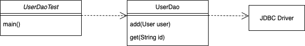</p>

```java
public void add(User user) throws SQLException, ClassNotFoundException {

    // DB 연결 관심
    Class.forName("org.h2.Driver");
    Connection con = DriverManager.getConnection("jdbc:h2:tcp://localhost/~/toby", "sa", "");

    // SQL 실행 관심
    PreparedStatement ps = con.prepareStatement("insert into users(id, name, password) values(?, ?, ?)");
    ps.setString(1, user.getId());
    ps.setString(2, user.getName());
    ps.setString(3, user.getPassword());

    ps.executeUpdate();

    // 리소스를 반환하는 관심
    ps.close();
    con.close();
}
```

[초난감 DAO 코드](https://github.com/binghe819/spring-toby-practice/blob/chapter01/src/main/java/com/binghe/user/dao/UserDao.java)

위 코드를 보면 DAO가 혼자 북치고 장구치고 다 한다. **여러 관심사항으로 나눠보면 아래와 같다.**

* "커넥션"에 대한 **관심**
* DB에 보낼 sql을 만들고 실행하는 **관심**
* 리소스를 반환하는 **관심**

:scream: 이렇게 한 코드에 **여러 관심사항이 존재**하면 ***중복***코드를 야기하며, 훗날 ***변경이 일어나게 된다면*** 굉장히 지저분한 코드가 된다.

<br>

## 2 DAO의 분리 - DB 커넥션 분리
> 미래에 편히 잠들고 싶다면 `테스트`와 `분리와 확장`에 대해서 생각하자

<br>

🤔 ***관심사의 분리***

* **관심이 같은 것끼리는 모이게 하고, 관심이 다른 것은 가능한 한 따로 떨어져서 서로 영향을 주지 않도록 분리하는 것.**
* **요구사항 변화에 따른 코드의 변화는 한 곳에서 일어나게 해야한다.**
  * 모든 변경과 발전은 한 번에 한 가지 관심사항에 집중해서 일어난다. 코드도 한 곳에서만 변경이 일어나야한다.

<br>

### 2-1 초난감 DAO의 관심사항
1. DB와 연결을 위한 커넥션을 어떻게 가져올까라는 관심
2. SQL 문장을 담을 Statement를 만들고 실행하는 관심 (ResultSet포함)
3. 사용한 리소스를 닫아줘서 시스템에 돌려주는 관심

<br>

### 2-2 중복 코드의 메서드 추출

🤔 **메서드 추출 기법**

* 공통의 기능을 담당하는 메서드로 중복된 코드를 뽑아내는 것을 말한다.

```java
public void add(User user) throws SQLException, ClassNotFoundException {

    // DB 관심을 메서드 추출 기법으로 분리
    Connection con = getConnection();

    // SQL 실행 관심
    PreparedStatement ps = con.prepareStatement("insert into users(id, name, password) values(?, ?, ?)");
    ps.setString(1, user.getId());
    ps.setString(2, user.getName());
    ps.setString(3, user.getPassword());

    ps.executeUpdate();

    // 리소스를 반환하는 관심
    ps.close();
    con.close();
}

// 메서드 추출 기법
public Connection getConnection() throws ClassNotFoundException, SQLException {
    Class.forName("org.h2.Driver");
    Connection con = DriverManager.getConnection("jdbc:h2:tcp://localhost/~/toby", "sa", "");
    return con;
}
```

[메서드 추출 기법 코드](https://github.com/binghe819/spring-toby-practice/blob/chapter01/src/main/java/com/binghe/user/dao/method_extraction/MethodExtractionUserDao.java)

😎 독립적인 메서드로 추출함으로써 한 가지 **관심**에 ***변경이 일어나면*** 관심이 집중되는 코드만 수정해주면 된다.

* 위 코드에서는 `getConnection()`으로 **DB의 커넥션 관련 관심**을 분리한 것이다.

<br>

### 2-3 상속을 통한 확장 (템플릿 메서드 패턴)

:scream: 문제점은 위 코드를 여러 업체에 제공하게 된다면, 업체마다 사용하는 DB가 다를 수도 있고, `userDao` 의 코드를 노출하기 싫을 수도 있다. 이때 추상화를 한다.

<p align="center">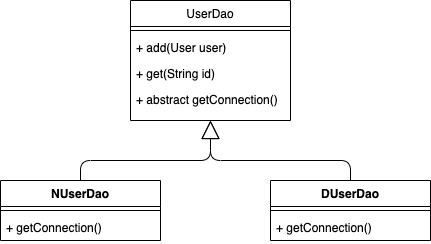</p>

```java
public abstract class AbstractUserDao {
    public void add(User user)  throws SQLException, ClassNotFoundException {

        // DB 관심을 서브 클래스에게 넘긴다. (팩토리 메서드)
        Connection con = getConnection();

        PreparedStatement ps = con.prepareStatement("insert into users(id, name, password) values(?, ?, ?)");
        ps.setString(1, user.getId());
        ps.setString(2, user.getName());
        ps.setString(3, user.getPassword());

        ps.executeUpdate();

        ps.close();
        con.close();
    }

    ...

    // 추상화를 통해 DB 커넥션에 대한 관심을 하위 클래스에게 넘길 수 있다.
    public abstract Connection getConnection() throws ClassNotFoundException, SQLException;
}
```

[상속을 통한 확장 코드 - 템플릿 메서드 패턴](https://github.com/binghe819/spring-toby-practice/tree/chapter01/src/main/java/com/binghe/user/dao/template_method_pattern)

😎 DB 커넥션에 대한 관심을 ***추상 메서드***로 제공함으로써, `userDao`에 대한 코드(SQL문)를 제공하지 않고, 각 업체마다 커넥션에 대한 관심을 따로 설정할 수 있게 되었다. - 관심 분리 - 

> 템플릿 메서드 패턴과 팩토리 메서드 패턴의 대한 정의는 [용어 정리](#용어-정리)를 참고하자.

<br>

👍 `userDao`는 ***어떤 기능을 사용한다는 데에만 관심을 집중***하면 되고, **서브 클래스**에서 **어떤 커넥션을 제공하면 되는 지에 대한 관심**을 갖는 것이다.

* `UserDao` : 어떻게 데이터를 등록하고 가져올 것인가에 대한 관심 (핵심 기능)
* `NUserDao`, `DUserDao` : DB 연결 방법은 어떻게 할 것인가에 대한 관심

<br>

<p align="center">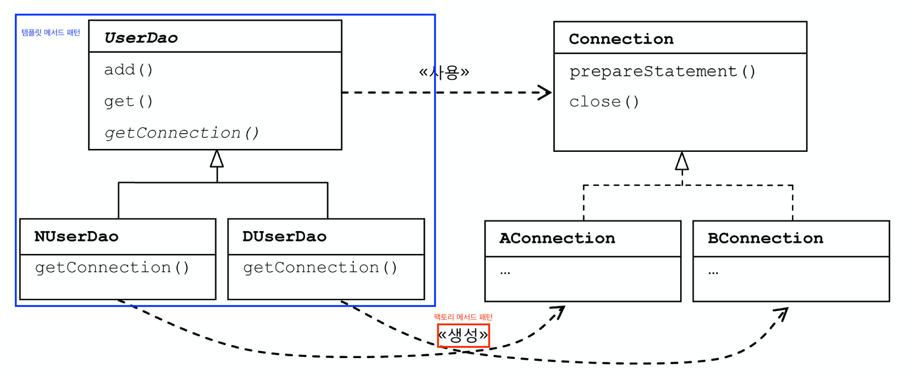</p>

:scream: **상속을 사용하는데 따르는 단점이 있다.**

* 다중 상속을 허용하지 않는다.
* 상속을 통한 **상하위 클래스의 관계는 생각보다 밀접하다.**
  * 서브 클래스는 슈퍼클래스의 기능을 직접 사용가능하므로, 슈퍼 클래스 내부의 변경이 서브클래스의 수정을 불러올 수 있다.
* **해당 DB 커넥션을 생성하는 코드를 다른 `dao`클래스에 적용할 수 없다.**

<br>

## 3 DAO의 확장 - DB 커넥션 확장

:scream: 상속을 통한 클래스 분리는 상하위 클래스가 밀접한 관계가 있으므로 제대로 분리했다고 보기 어렵다.

* 확장하기 위해선 컴파일 타임때 새로운 객체를 만들어주거나 의존성을 명시해줘야 한다.
* 이제부터는 클래스를 분리하여 DAO를 확장해본다.
  * 아래 내용을 구현하고나면 "상속보다 조합이 좋다"라는 의미를 조금은 알게된다.

<br>

### 3-1 클래스 분리

🤔 **클래스 분리**

<p align="center">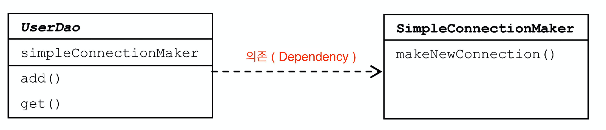</p>

```java
public class UserDao {
    // DB 커넥션은 클래스 분리를 통해 구현
    private final SimpleConnectionMaker simpleConnectionMaker;

    public UserDao() {
        // 직접 의존성을 생성해줘도 되고, 외부에서 주입해줘도 된다.
        simpleConnectionMaker = new SimpleConnectionMaker();
    }

    ...
}
```

[클래스 분리 코드](https://github.com/binghe819/spring-toby-practice/tree/chapter01/src/main/java/com/binghe/user/dao/class_separate)

* 아예 상속관계가 아닌 **독립적인 클래스**를 만들어 **의존 관계를 만드는 방식.**
  * DB 커넥션 관심 : `SimpleConnectionMaker`
  * 데이터 액세스 관심 : `UserDao`

<br>

😎 `DB 관심`과 `데이터 액세스 관심`을 완벽히 분리해냈다. 상속으로 인한 문제는 없다.

<br>

:scream: N사와 D사에 `UserDao`클래스만 공급하고 상속을 통해 `DB 커넥션 기능`을 **확장하는 것이 불가능해졌다.**

* 첫번째 문제, 책임은 동일하지만 **메시지의 이름이 통일이 안된다.**
  * N사는 `openConnection`, D사는 `getConnection`이라고하면 `UserDao`는 하나하나 코드를 수정해줘야 한다.
* 두번째 문제, `UserDao`가 **특정한 객체에 너무 의존적이다.**
  * `UserDao`가 `DB 커넥션`객체에 대해 너무 많이 알고있어야 한다. 

<br>

### 3-2 인터페이스 도입

> 두 개의 클래스가 서로 긴밀하게 연결되지 않도록 하는 방법은 중간에 추상적인 느슨한 연결고리를 만들어주는 것이다.
> 
> **추상화: 어떤 것들의 공통적인 성격을 뽑아내어 이를 따로 분리해내는 작업(컴파일 타임이 아닌 런타임에 의존성이 결정)**

<br>

🤔 **인터페이스 분리**

<p align="center">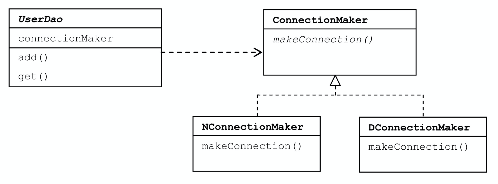</p>

* 인터페이스를 통해 두 개의 클래스 사이에 느슨한 연결고리를 만들어주는 것.
* OCP (개방-폐쇄 원칙)을 적용한 것과 같다.

<br>

😎 `DB 관심`과 `데이터 액세스 관심`사이에 **인터페이스를 통해 느슨한 관계를 만들어주었고**, **책임을 통일시키므로써 메시지의 이름이 통일되었다.** (자율적인 객체)

```java
// 인터페이스를 통한 OCP 구현.
public class UserDao {

    private ConnectionMaker connectionMaker;

    public UserDao() {
        // 인터페이스로 추상화 시켰지만, 아직 구체적인 것에 의존한다.
        connectionMaker = new NConnectionMaker();
    }

    ... add(), get() ...
}
```

<br>

:scream: 메시지 이름이 통일 안되는 문제는 해결했지만, **특정한 객체에 아직도 너무 의존적이다.**

<p align="center">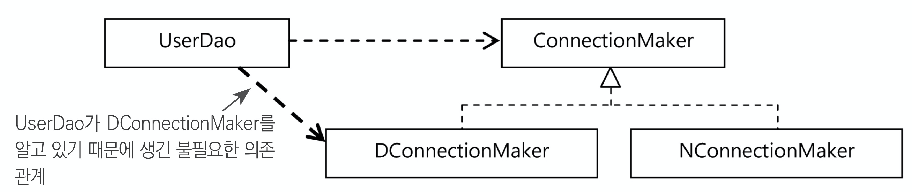<br> 토비의 스프링 vol.1</p>

* 아직도 `UserDao`코드에선 `DB 커넥션`에 대한 특정한 객체의 이름이 필요하다. (`DConnectionMaker`)

> 외부에서 의존성을 주입해주는 다음 방식을 통해 이를 해결할 수 있다.

<br>

### 3-3 의존성 주입 (책임 분리)

:scream: 문제는 `UserDao`가 특정 클래스와 관계를 가져서는 안된다는 것이다. 의존성 주입을 통해 관계를 끊어보자.

<br>

🤔 **의존성 주입**

<p align="center">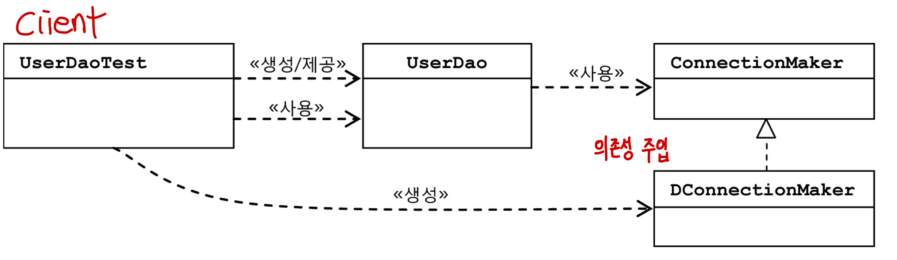<br>출처: 토비의 스프링 vol.1</p>

```java
public class UserDao {
    private ConnectionMaker connectionMaker;

    // 생성자를 통한 외부에서 의존성을 주입하도록 해준다.
    public UserDao(ConnectionMaker connectionMaker) {
        this.connectionMaker = connectionMaker;
    }

    ...
}

// 사용시 DB 연결 관련된 의존성을 주입해줘야 한다.
ConnectionMaker connectionMaker = new HConnectionMaker(); // DB 연결 관심 객체
UserDao userDao = new UserDao(connectionMaker); // 의존성 주입 (생성자)
```

[의존성 주입 코드](https://github.com/binghe819/spring-toby-practice/tree/chapter01/src/main/java/com/binghe/user/dao/dependency_injection)

* 기존엔 `UserDao`가 `DB 커넥션 관심`과 관계를 맺는 책임이 있었지만, 이를 **클라이언트에게 넘긴 것이다.**
  * **클라이언트는 `UserDao`를 사용하기 위해서는 `DB 커넥션`에 대한 의존성을 주입해주어야한다.**
* 이제 **`UserDao`의 모든 코드는 `ConnectionMaker` 인터페이스 외에는 어떤 클래스와도 관계를 가지지 않는다.**
  * `DB 커넥션 관심`과 `데이터 액세스 관심`을 완벽히 분리해낸 것이다.

<br>

😎 **`UserDao`는 이제 자신의 관심사이자 책임인 `데이터 액세스`에만 집중할 수 있게되었다. (책임 분리)**

* **`DB 커넥션`을 가져오는 방법은 어떻게 변경하든 `UserDao` 코드는 아무런 영향을 받지 않는다.**

<br>

> **OCP (개방 폐쇄 원칙)과 생성자를 이용한 의존성 주입을 통해 책임을 분리하는 방식이다.**

<br>

## 4 제어의 역전

제어의 역전이 뭘 가리키며, 어떻게 사용되는지 알아보자.

<br>

### 4-1 제어의 역전

🤔 **제어의 역전이란?**
> IoC는 소프트웨어에서 자주 발견할 수 있는 일반적인 개념이다.

* 프로그램의 제어 흐름 구조를 뒤바꾸는 것.
  * 기존엔 `main`부터 시작해서 모든 객체가 능동적으로 `new`를 통해 자신이 사용할 클래스를 결정하고 관리했다. (일반적인 제어 흐름)
  * **제어의 역전에서 객체는 자신이 사용할 오브젝트를 스스로 선택하지 않고, 주입 받는다.**
  * **모든 객체는 이렇게 위임받은 제어 권한을 갖는 특별한 객체(IoC 컨테이너)에 의해 결정되고 만들어진다.**
* **모든 제어 권한을 자신이 아닌 다른 대상에게 위임하는 것.**

<p align="center">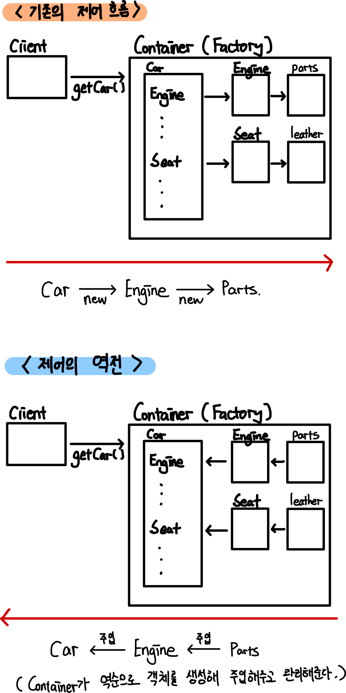</p>

* **컨테이너(팩토리)가 모든 컴포넌트(객체)들을 관리하고 주입해주는 역할을 함으로써 제어의 역전을 구현한다.**

<br>

🤔 **컨테이너(팩토리)가 하는 일은?**

* 컴포넌트의 생성과 관계 설정
* 컴포넌트 사용
* 컴포넌트 생명주기 관리

<br>

:point_right: **예시 - 서블릿**
* 서블릿은 개발자가 `main`함수를 호출할 수 없다.
* 대신 **서블릿에 대한 제어 권한을 가진 컨테이너(ex. Tomcat)가 적절한 시점에 서블릿 클래스의 객체를 만들고 그 안의 메서드를 호출한다.**
* 이렇게 **서블릿이나 JSP, EJB처럼 컨테이너 안에서 동작하는 구조는 간단한 방식이긴 하지만 제어의 역전 개념이 적용되어 있다고 볼 수 있다.**

<br>

:point_right: **예시 - 템플릿 메서드 패턴**
* 템플릿 메서드 패턴에서 하위 클래스는 상위 클래스의 추상 메서드를 구현한다. (핵심 로직을 구현)
* 하지만 **이 메서드는 언제 어떻게 사용할지 하위 클래스는 전혀 모른다. (하위 클래스에서 결정되는 것이 아니기 때문이다.)**
  * 단지 핵심 로직(ex. DB 연결)을 구현해놓으면, 상위 클래스에서 필요할 때 호출한다.
  * 즉, **제어권을 상위 템플릿 메서드에 넘기고 자신은 필요할 때 호출되어 사용되도록 한다는 의미에서 제어의 역전이라고도 본다.**

> **또 다른 대표적인 제어의 역전 개념이 적용된 것은 `프레임 워크`다!** 프레임 워크는 꼭 제어의 역전 개념이 적용되어야 한다.

<br>

### 4-2 객체 팩토리

:scream: 지금까지 책임을 잘 분리했지만, **문제는 `UserDaoTest`가 테스트와 의존성 주입이라는 두 가지의 역할을 맡고 있었다. 이를 분리시켜야 한다.**

* 테스크 코드 -> 테스트 관심
* 팩토리 -> `데이터 액세스 관심(UserDao)`와 `DB 커넥션 관심(ConnectionMaker)`의 의존성을 만들어주는 관심

<br>

🤔 **팩토리 == 설계도**

<p align="center">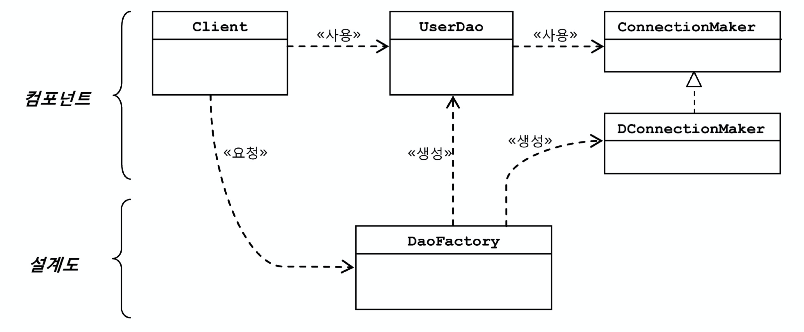<br>출처: 토비의 스프링 vol.1</p>

```java
public class DaoFactory {
  public UserDao getUserDao(){
    return new UserDao(new NConnectionMaker());
  }
}
```

[팩토리 적용한 코드](https://github.com/binghe819/spring-toby-practice/tree/chapter01/src/main/java/com/binghe/user/dao/dao_factory)

* 팩토리란?
  
  * 객체의 생성 방법을 결정하고 그렇게 만들어진 객체를 돌려준다.
* **`DaoFactory(팩토리)`의 `getUserDao()`를 호출하면 `DConnectionMaker(DB커넥션관심)`이 담긴 `UserDao (데이터 액세스 관심)`을 반환해준다.**

<br>

🙋‍♂️ **설계도로서의 팩토리 (핵심)**

* 컴포넌트 : **실질적인 로직을 담당하는 컴포넌트**
  * `UserDao` : 핵심적인 데이터 로직
  * `ConnectionMaker` : 데이터 기술 로직
* 설계도 : 애플리케이션을 구성하는 **컴포넌트의 구조와 관계를 정의**
  * **`DaoFactory` : 애플리케이션의 객체들을 구성하고 그 관계를 정의하는 책임**
  * **협력하는 객체들간의 협력 관계를 결정한다.**

<br>

> 새로운 `ConnectionMaker`구현 클래스로 변경이 필요하면 `DaoFactory(설계도)`를 수정해주면 된다.

> * **전략 패턴의 관점에서 바라보는 설계도**
>   * 컨텍스트 : 컴포넌트 (자바 빈)
>   * 전략 : 컴포넌트 (자바 빈)
>   * 클라이언트 : Bean 팩토리 (설계도)
> * 클라이언트가 요청을 받고 컨텍스트에 전략(의존성)을 주입해주고 응답을 해준

> **제어의 역전**
> * `UserDao`와 `ConnectionMaker`의 구현체를 생성하는 책임은 `DaoFactory`가 가지고 있다.
> * 즉, **`UserDao`와 `ConnectionMaker`는 생성 관점에서 이제 능동적이 아니라 수동적인 존재가 되버린 것이다.**
> * 스프링을 사용하지 않고도 이미 IoC를 적용시켜본 셈이다.

<br>

### 4-3. 팩토리의 활용 - 중요

🤔 `DaoFactory`에 `UserDao`말고 다른 `DAO`의 생성 기능을 넣으려면 어떻게 할까?

<p align="center">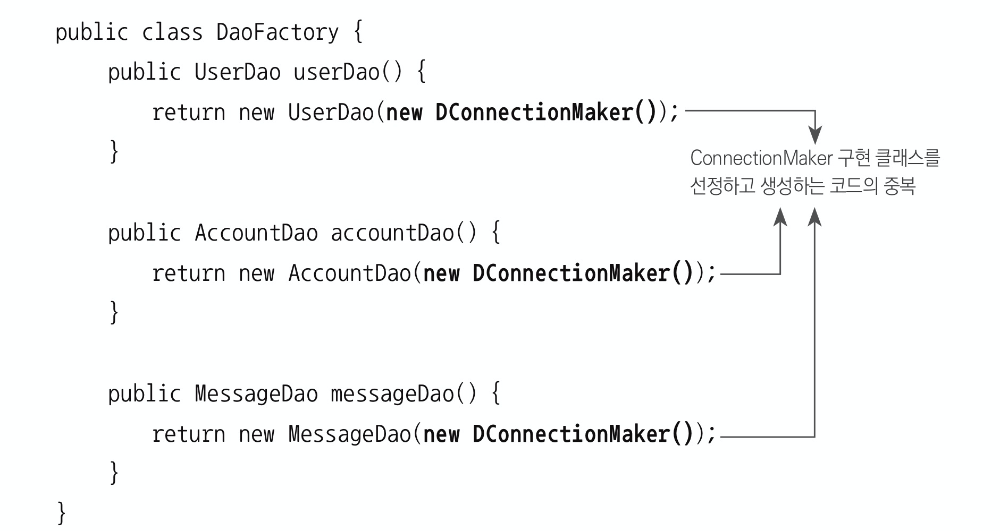<br> 출처: 토비의 스프링 vol.1</p>

* 중복이 발생하게 된다.

😎 위에서 사용한 것처럼 메서드 추출 기법을 사용하면 중복을 제거할 수 있다.

<p align="center">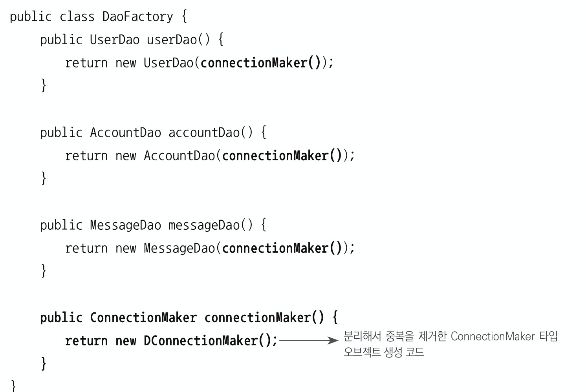<br> 출처: 토비의 스프링 vol.1</p>

> **`DaoFactory`가 바로 IoC에서 컴포넌트들을 관리하는 `컨테이너(팩토리)`에 해당한다.**

<br>

## 5 스프링 IoC - 중요

<br>

🙋‍♂️ 제어의 역전을 구현하기 위해서 위에서는 `DaoFactory`를 사용하였다. 

**스프링에서는 이러한 `Factory`를 제공하는데 그게 바로 빈 팩토리 또는 애플리케이션 컨텍스트라고 불리는 것이다.**

* 중요한 포인트
  * **`DAO` 는 `ConnectionMaker` 를 사용할 뿐, 실제로 어떤 `ConnectionMaker` 의 구현체를 사용할지는 모른다. 이것을 결정하는 것이 바로 `Factory` 이다.**
  * 이러한 의미에서 **제어의 역전**이라 볼 수 있다.
    * **자신의 의존 객체(`ConnectionMaker`) 제어의 권한을 자신(`DAO`)이 아닌 다른 사람(`Factory`)에게 위임하는 것**

<br>

### 5-1 스프링 IoC의 용어 정리

🙋‍♂️ 스프링 IoC에는 여러가지 용어들이 등장한다. 이들을 이해하면 스프링을 더 쉽게 이해할 수 있다.

<br>

#### 빈

* 빈이란?
  * **빈은 스프링이 IoC 방식으로 관리하는 객체.** 즉, 스프링에 의해 관리되는 객체를 뜻한다.
    * `Factory`에서 관리하는 객체로 보면 된다.
    * 객체 단위의 애플리케이션 컴포넌트를 말한다.
  * **스프링이 직접 생성과 제어를 담당하는 객체만을 빈이라고 부른다.**
    * **스프링 컨테이너가 생성과 관계 설정, 사용 등을 제어해주는 제어의 역전이 적용된 객체를 의미한다.**

<br>

#### 빈 팩토리

* 빈 팩토리란?
  * **스프링의 IoC를 담당하는 핵심 컨테이너를 가리킨다.**
  * **빈의 생성과 관계설정 같은 제어를 담당하는 IoC 객체.**
* **빈 팩토리의 역할**
  * 빈을 등록하고, 생성하고, 조회하고 돌려주고, 그 외에 부가적인 빈을 관리하는 기능을 담당한다.
* **보통은 빈 팩토리를 바로 사용하지 않고 애플리케이션 컨텍스트(application context)를 이용한다.**
* `BeanFactory`라는 인터페이스로 정의되어 있다.
* 예시
  * **전략 패턴에서 클라이언트에 해당한다고 보면 된다. `DaoFactory`**

<br>

#### 애플리케이션 컨텍스트

* 애플리케이션 컨텍스트란?
  * IoC방식을 따라 만들어진 일종의 빈 팩토리
* **애플리케이션 컨텍스트와 빈 팩토리의 차이점은?**
  * 같다.
    * 빈 팩토리라고 말할 때는 빈을 생성하고 관계를 설정하는 IoC 기본 기능에 초점을 맞춘 것
    * 애플리케이션 컨텍스트라고 말할 때는 애플리케이션 전반에 걸쳐 모든 구성요소의 제어 작업에 초점을 맞춘 것
  * **애플리케이션 컨텍스트가 빈 팩토리를 상속받고 있다.**
* **애플리케이션 컨텍스트 (빈 팩토리) === 설계도**
  * **건물이 설계도면을 따라서 만들어지듯이, 애플리케이션도 애플리케이션 컨텍스트와 그 설정 정보를 따라서 만들어지고 구성된다고 생각할 수 있다.**
    * 설정 정보: XML, 애노테이션 등등..
* 여러가지 동일한 용어
  * 스프링 컨테이너
  * IoC 컨테이너

<br>

#### 설정정보 / 설정 메타 정보

* 설정정보란?
  * 애플리케이션 컨텍스트는 별도의 정보를 참고해서 빈의 생성, 관계설정 등의 제어 작업을 총괄한다.
  * 즉, **어떤 클래스의 오브젝트를 생성하고 어디에서 사용하도록 연결해줄 것인가 등에 관한 정보.**
* 예시
  * **건물이 설계도를 따라 만들어지듯이, 애플리케이션도 애플리케이션 컨텍스트와 그 설정정보를 따라서 만들어진다.**

<br>

#### 컨테이너

* 컨테이너란?
  * **IoC 방식으로 빈을 관리한다는 의미에서 애플리케이션 컨텍스트나 빈 팩토리를 컨테이너 또는 IoC 컨테이너라고한다.**
  * 애플리케이션 컨텍스트 대신에 스프링 컨테이너라고 부르기도 한다.

<br>

### 5-2 애플리케이션 컨텍스트 동작방식

🙋‍♂️ 애플리케이션 컨텍스트는 일종의 빈 팩토리이다.

* **애플리케이션 컨텍스트는 `ApplicationContext`를 구현하는데, `ApplicationContext`인터페이스가 `BeanFactory`인터페이스를 상속받는다.**

<br>

🙋‍♂️ **애플리케이션 컨텍스트는 설정 정보를 바탕으로 객체를 생성하고 관계를 맺어준다.**

<p align="center">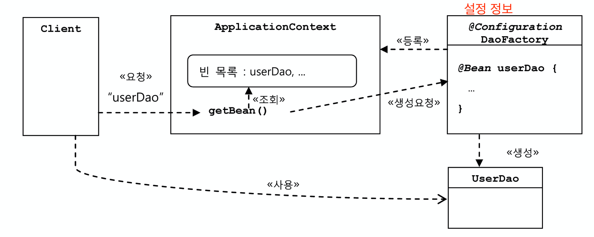<br>출처: 토비의 스프링 vol.1</p>

* 설정 정보 (`@Configuration`)를 바탕으로 객체의 의존성을 주입해주고 반환해준다.
* 설정 정보의 종류
  * XML (`ClassPathXmlApplicationContext`)
  * 자바 설정 (`AnnotationConfigApplicationContext`)

<br>

😎 **애플리케이션 컨텍스트 (빈 팩토리)의 장점**

* **클라이언트는 구체적인 팩토리 클래스를 알 필요가 없다.**
  * 빈 팩토리는 관리하는 빈을 캐시에 담아서 `getBean`을 통해 바로 이용할 수 있게 해준다.
* **애플리케이션 컨텍스트는 종합 IoC 서비스를 제공해준다.**
  * 객체가 만들어지는 방식, 시점과 전략을 다르게 할 수도 있고 여러가지 기능을 제공한다.
* 애플리케이션 컨텍스트는 빈을 검색하는 다양한 방법을 제공한다.

<br>

### 5-2 스프링 IoC 예제

🙋‍♂️ 일반적인 팩토리 객체인 `DaoFactory`를 스프링의 빈 팩토리 설정 객체로 바꿔보자.

`설정파일`

```java
// 스프링에 등록할 빈의 설정파일
@Configuration // 애플리케이션 컨텍스트가 사용할 설정정보라를 표시
public class DaoFactory {
    @Bean
    public UserDao userDao() {
        return new UserDao(connectionMaker());
    }

    @Bean
    public ConnectionMaker connectionMaker() {
        return new DConnectionMaker();
    }
}
```

`Test시 빈 가져오기`

```java
public class Test {
    public static void main(String[] args) throws SQLException, ClassNotFoundException {
      	// ApplicationContext를 사용해서 DaoFactory설정 객체의 빈 등록.
        ApplicationContext context = new AnnotationConfigApplicationContext(DaoFactory.class);
      	// 빈 가져오기
        UserDao userDao = context.getBean("userDao", UserDao.class);
      
        User user = new User();
        user.setId("binghe");
        user.setName("홍길동");
        user.setPassword("12345");

        userDao.add(user);
        System.out.println(user.getId() + "등록 성공");

        User userResult = userDao.get(user.getId());
        System.out.println(userResult.getName());
        System.out.println(userResult.getPassword());

        System.out.println(userResult.getId() + "조회 성공");
    }
}
```

[애플리케이션 컨텍스트 예제 코드](https://github.com/binghe819/spring-toby-practice/tree/chapter01/src/main/java/com/binghe/user/dao/spring_ioc)

<br>

## 6 싱글톤 빈 스코프

🙋‍♂️ 기존의 `DaoFactory`와 설정파일을 통한 스프링 IoC 컨테이너의 차이점은 무엇일까?

* 바로 객체 스코프에 있다.

<br>

### 6-1 동일성과 동등성

🤔 **동일성과 동등성이란?**

* 동일성 : 두 개의 객체가 완전히 같은 동일한 객체. (참조값이 같다.)
* 동등성 : 두 개의 객체가 동일한 정보를 가지고 있다. (참조값은 다르지만 동일한 상태를 가지고 있다.)

<br>

🙋‍♂️ 스프링 IoC 컨테이너는 기본적으로 싱글톤 방식의 빈을 사용한다.

기존의 `DaoFactory`

```java
// Dao의 생성 책임을 맡은 팩토리 클래스
public class DaoFactory {
    public UserDao getUserDao(){
        return new UserDao(new NConnectionMaker());
    }
}
```

```java
DaoFactory factory = new DaoFactory();

UserDao dao1 = factory.getUserDao();
UserDao dao2 = factory.getUserDao();

System.out.println(dao1);
System.out.println(dao2);

// 결과
user.dao.IoC.UserDao@6fadae5d
user.dao.IoC.UserDao@17f6480
```

* `DaoFactory`는 항상 새로운 객체를 생성해서 반환한다.

<br>

`스프링 IoC`

```java
ApplicationContext context = new AnnotationConfigApplicationContext(DaoFactory.class);

UserDao dao1 = (UserDao)context.getBean("userDao");
UserDao dao2 = (UserDao)context.getBean("userDao");

System.out.println(dao1);
System.out.println(dao2);

// 결과
user.dao.SpringIoC.UserDao@4d5b6aac
user.dao.SpringIoC.UserDao@4d5b6aac
```

* **스프링 IoC는 싱글톤을 기본값으로 스코프를 정하기 때문에 항상 같은 객체(동일성)를 반환하는 것을 알 수 있다.**

<br>

### 6-2 싱글톤 레지스트리로서의 애플리케이션 컨텍스트

<br>

🤔 **싱글톤 레지스트리?**

* 레지스트리 : 등록소
* 애플리케이션 컨텍스트(IoC컨테이너)는 설정정보의 객체정보를 이용해 싱글톤 형식으로 생성한다.
* **그리고 생성된 객체의 참조값을 모두 싱글톤 레지스트리에 저장한다.**

<br>

🤔 **왜 싱글톤일까?**

* 서버는 하나의 요청당 여러 가지의 로직을 거치는데, 매 요청마다 새로운 객체를 생성해 로직을 수행하면 매우 비용이 높다.
* 서버는 수많은 요청을 동시에 처리해야하는 프로세스이기에 싱글톤 방식으로 처리한다.

<br>

🤔 **싱글톤을 사용하면 발생하는 문제점**

* `private` 생성자를 갖고 있기 때문에 상속할 수 없다.
* 싱글톤은 테스트하기가 힘들다.
* 서버환경에서는 싱글톤이 하나만 만들어지는 것을 보장하지 못한다.
* 싱글톤의 사용은 전역 상태를 만들 수 있기 때문에 바람직하지 못한다.

<br>

😎 **스프링 싱글톤 레지스트리의 장점**
> **스프링은 자바의 기본적인 싱글톤 패턴 객체와 다르게 직접 조금 다른 싱글톤 형태의 객체를 만들고 관리하는 기능을 제공한다.**

* **스태틱 메서드와 `private`생성자를 사용해야 하는 비정상적인 클래스가 아니라 평범한 자바 클래스를 싱글톤으로 활용하게 해준다.**
* 또한, **스프링의 싱글톤 레지스트리 덕분에 public 생성자를 가질 수 있다.**
  * 싱글톤으로 사용돼야 하는 환경이 아니라면 간단히 객체를 생성하여 사용할 수도 있다.
* **가장 중요한 점은 기존 싱글톤 패턴과 달리 스프링이 제공하는 싱글톤은 객체지향적 설계 방식과 디자인 패턴등을 적용하는 데 아무런 제약이 없다는 것이다.**

<br>

🤔 **싱글톤은 스레드 안전하지 않지 않나? - 중요**

* **다중 스레드에서 한꺼번에 처리하는 스레드들이 동시에 싱글톤 객체를 수정하는 것은 매우 위험하다.**
  * 물론 읽기전용(`final`)이면 상관 없다.
  * 그러므로 **빈으로 등록되는 객체는 상태를 가지지 않는 것이 좋다. (무상태성)**
* **요청마다 다른 값을 받고 처리하는 방법은?**
  * **파라미터와 로컬 변수, 리턴 값등을 이용하면 된다.**

<br>

### 6-3 스프링 빈의 스코프
* 빈 스코프란?
  * 스프링이 관리하는 객체, 즉 빈이 생성되고, 존재하고, 적용되는 범위를 빈의 스코프라 한다.
* 스프링 빈의 기본 스코프는 싱글톤이다.
* 싱글톤 외의 다양한 스코프
  * 프로토타입 스코프: 싱글톤과 달리 컨테이너에 빈을 요청할 때마다 매번 새로운 객체를 만들어준다.
  * 요청 스코프: 새로운 HTTP 요청이 생길 때마다 생성되는 요청 스코프.
  * 세션 스코프: 웹의 세션과 스코프와 유사한 스코프.

<br>

## 7 DI
> DI는 객체지향 프로그래밍 스타일이다. 반드시 DI를 위해 컨테이너가 필요한 것은 아니다.

🙋‍♂️ **IoC 컨테이너의 핵심은 DI이다. IoC 컨테이너의 의도가 명확히 드러나는 이름이 바로 DI이다.**
* 스프링 IoC 컨테이너라고만 해서는 스프링이 제공하는 기능의 특징을 명확히 설명하지 못한다.
  * 서블릿처럼 서비스 컨테이너를 의미하는지
  * 단순히 IoC 개념이 적용된 템플릿 메서드 패턴을 이용해 만들어진 프레임워크를 의미하는지
  * 또 다른 IoC 특징을 기진 기술을 의미하는지
* DI는 스프링이 제공하는 IoC의 핵심 기능을 명확히 드러내준다.
  * **코드 레벨(컴파일 타임)에 의존성이 결정되지 않고, 런타임 시에 의견 관계를 주입해준다.**
* **DI는 자신이 사용할 객체에 대한 선택과 생성 제어권을 외부로 넘기고 자신은 수동적으로 주입받는 객체를 사용한다는 점에서 IoC의 개념에 잘 들어 맞는다.**
  * DI는 IoC의 한 종류라고도 볼 수 있을듯하다.

> 그래서 현재 IoC/DI라고 불리우는 것!

> `DI 받는다`의 의미
> * 단지 외부에서 파라미터로 객체를 주입받는 것을 넘어서, 구현 클래스를 결정해서 제공받을 수 있도록 인터페이스 타입의 파라미터를 통해 이뤄져야한다.

<br>

### 7-1 의존 관계
<p align="center">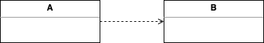</p>

* A가 B에 의존하고 있다.
  * B가 변경되면 A에 영향을 미친다는 의미
* 의존 관계의 특징
  * 꼭 방향성이 존재한다. (누가 누구에게 의존하는 관계인지)
  * 위 예시에서 A가 B에 의존하고 있지만, 반대로 B는 A에 의존하지 않는다.

<br>

### 7-2 런타임 의존관계 설정

> 런타임에 의존성을 주입받는 방식 (DI)

🤔 **런타임 의존관계란?**

* **설계 시점(컴파일 타임)의 의존관계가 런타임에 실체화되는 것**
* 설계 시점엔 인터페이스를 통해 느슨한 연결을 하므로 어떠한 객체가 의존성으로 주입될 지 모른다.
  * **하지만 프로그램이 실행되고 런타임시에 구체적인 의존 관계가 맺어진다. (컴파일 타임, 런타임 의존성)**
* 예시
  * `@Autowired`를 통한 의존성 주입
  * 생성자를 통한 의존성 주입
  * Setter를 통한 의존성 주입

<br>

🙋‍♂️ **의존관계 주입(DI)의 조건 - 가장 중요**

* 클래스 모델이나 코드에는 **런타임 시점의 의존관계가 드러나지 않는다**. (느슨한 연결) 코드에는 인터페이스에만 의존하고 있는다.
  * **구체적인 것이 아닌 추상적인 것에 의존하고 있는다.**
* 런타임 시점의 의존관계는 컨테이너나 팩토리 같은 제 3의 존재가 결정한다. (전략 패턴)
* 의존관계는 사용할 객체에 대한 레퍼런스를 외부에서 제공해줌으로써 만들어진다. (설정 파일)

> DI의 핵심은 설계 시점에는 알지 못했던 두 객체의 관계를 맺도록 도와주는 제3의 존재가 있다는 것이다. 바로 스프링 컨테이너이다.

<br>

### 7-3 의존관계 검색(DL)과 주입(DI)

> 애플리케이션 컨텍스트에서 빈을 검색하여 의존성 주입 (DL)

🤔 **의존관계 검색이란?**

* 자동적으로 외부로부터 주입이 아니라 스스로 검색을 이용하기 때문에 의존관계 검색이라고 한다. (검색 후 주입)
  * 의존관계 검색은 자신이 필요로하는 의존 객체를 능동적으로 검색한다.

```java
// 의존관계 검색을 이용하는 UserDao 생성자
public UserDao(){
  AnnotationConfigApplicationContext context = new AnnotationConfigApplicationContext(DaoFactory.class);
  this.connectionMaker = context.getBean("connectionMaker", ConnectionMaker.class); // 의존 검색
}
```

<br>

🤔 **의존관계 검색은 언제 사용되지?**

런타임시에 자동적으로 의존성을 주입해주는 방식이 훨씬 단순하고 깔끔하다. 하지만 아래와 같은 이유로 검색을 해야할 때도 있다.

* **의존관계 검색 방식에서는 검색하는 객체는 자신이 스프링의 빈일 필요가 없다.** (Context를 직접 만들고 `getBean`을 하기 때문)
  * 테스트 코드
  * 다른 컨텍스트의 빈을 가져와야할 때

> 서버는 사용자의 요청을 받을 때마다 `main()`메서드와 비슷한 역할을 하는 서블릿에서 스프링 컨테이너에 담긴 객체를 사용하려면 한 번은 의존관계 검색 방식을 사용해 객체를 가져와야 한다.
>
> 스프링은 미리 만들어서 제공하기 때문에 직접 구현할 필요는 없지만 알아두어야 할 내용이다.

<br>

### 7-4 DI의 응용

🙋‍♂️ **DI를 사용하는 가장 큰 이유는 인터페이스를 통한 느슨한 연결과 관련이 있다.**

* 인터페이스를 통해 느슨한 연결을 해놓으면 인터페이스를 구현한 구체객체가 변경되더라도 자신은 영향을 받지 않으며, 변경을 통한 다양한 확장 방법에서 자유롭다는 것이다.
* 이렇게 **느슨한 연결이 구현되려면 외부에서 의존성이 주입되어야하므로, DI는 여러모로 활용도가 높다.**

<br>

😎 DI의 응용

* DB 커넥션 객체 변경

  * DB커넥션 인터페이스를 하나 만들고 여러개의 DB와 연결을 쉽게 변경할 수 있다.

  * ```java
    // DB 연결 관심을 가진 클래스만 바꿔주면 쉽게 변경이 가능.
    @Bean
    public ConnectionMaker connectionMaker(){
      // return new mySQLDBConnectionMaker();
      return new h2DBConnectionMaker(); // 구현 객체만 변경하면 된다.
    }
    ```
* 부가기능 추가
  * DAO가 DB를 얼마나 많이 연결해서 사용하는지 파악하고 싶다고 해보자. -> 객체를 포장해줘서 부가기능을 추가할 수 있다.
  * ```java
    public class CountingConnectionMaker implements ConnectionMaker {
      int counter = 0;
      private ConnectionMaker realConnectionMaker;

      public CountingConnectionMaker(ConnectionMaker realConnectionMaker) {
        this.realConnectionMaker = realConnectionMaker;
      }

      public Connection getConnection() {
        this.counter++;
        return realConnectionMaker.getConnection();
      }
    }
    ```

<br>

> 스프링은 DI를 적극 활용하는 프레임워크이다. 스프링을 공부하는 건 DI를 어떻게 활용해야 할지는 공부하는 것이기도 하다.

<br>

# 핵심 정리
> **초난감 `UserDao`를 이용하여 DB 연결 책임(관심)을 분리하는 과정을 통해 객체와 의존관계 그리고 스프링 IoC/DI개념에 대해서 다루고 있다.**

<br>

## 컴파일 타임시의 의존성이 결정되는 방식
> 구체적인 것에 의존하므로 유연하지 않다 (코드 레벨의 의존 관계)
* 의존성이 컴파일 타임때 결정된다.
  * 메서드 추출 기법
  * 템플릿 메서드 패턴
  * 클래스 분리 (컴파일 타임에 다른 객체에 의존)
* 단점
  * 문제점은 런타임 시의 의존관계가 코드 속에 다 미리 결정된다는 점이다. (유연하지 않음)

<br>

## 런타임시 의존성 주입해주는 방식
> 추상적인 것에 의존하므로 유연하다
* 의존성이 런타임때 결정된다.
  * 인터페이스로 분리 - OCP
  * 인터페이스를 이용한 의존성 주입 - 전략 패턴
  * 객체를 생성하는 관심과 사용하는 관심 분리 - 객체 팩토리 Dao Factory (설계도), IoC
  * 객체를 생성하는 관심과 사용하는 관심 분리 - 스프링 IoC (중요)
* 장점
  * 런타임 의존관계가 컴파일 타임시에 드러나지 않는다.
  * IoC 방식을 쓰면 `UserDao`로부터 런타임 의존관계를 드러내는 코드를 제거하고, 제 3의 존재(IoC/DI 컨테이너)에 런타임 의존관계 결정 권한을 위임한다. (설계도)
* DI가 IoC인 이유
  * DI (의존성 주입 방식)는 자신이 사용할 객체에 대한 선택과 생성 제어권을 외부로 넘기고 자신은 수동적으로 주입받는 객체를 사용한다는 점에서 IoC의 개념에 잘 들어맞는다.

<br>

# 용어 정리

<br>

## DAO

🤔 DAO란?

DAO (Data Access Object)는 **DB를 사용해 데이터를 조회하거나 조작하는 기능**을 전담하도록 만든 오브젝트를 말한다.

<br>

## 자바빈

🤔 자바빈이란?

* 자바빈은 원래 비주얼 툴에서 조작 가능한 컴포넌트를 말한다. (지금은 비주얼 컴포넌트로서 거의 사용되지 않는다.)
* **이제는 자바빈이라고 말하면 비주얼 컴포넌트보다는 아래 두 가지 관례를 따라 만들어진 객체를 가리킨다.**
  * 간단히 빈이라고 부르기도 한다.

<br>

🙋‍♂️ 자바빈은 두 가지 관례를 따라 만들어진 오브젝트를 가리킨다.

* 디폴트 생성자 : 자바빈은 파라미터가 없는 디폴트 생성자를 갖고 있어야 한다. 툴이나 프레임워크에서 리플렉션을 이용해 오브젝트를 생성하기 때문에 필요하다.
* 프로퍼티 : 자바빈이 노출하는 이름을 가진 속성을 프로퍼티라고 한다. Getter / Setter를 사용해 수정 또는 조회할 수 있다.

<br>

## 리팩토링

🤔 리팩토링이란?

* 리팩토링은 기존의 코드를 ***외부의 동작방식에는 변화 없이 내부 구조를 변경***해서 재구성하는 작업 또는 기술을 말한다.

😎 리팩토링을 하면?

* 코드 내부의 설계가 개선되어 코드를 이해하기가 더 편해지고, 변화에 효율적으로 대응 할 수 있다.
* 결국 생산성이 올라가고, 코드의 품질은 높아지며, 유지보수하기 용이해지고, 견고하면서도 유연한 제품을 개발할 수 있다.

🤔 나쁜 냄새

* 리팩토링이 절실히 필요한 코드의 특징을 나쁜 냄새라고 부르기도 한다.
* 대표적으로 나쁜 냄새는 중복 코드다.

<br>

## 디자인 패턴

🤔 디자인 패턴이란?

* 디자인 패턴은 소트프웨어 설계 시 특정 상황에서 자주 만나는 문제를 해결하기 위해 사용할 수 있는 재사용 가능한 솔루션을 말한다.

<br>

## 템플릿 메서드 패턴

🤔 템플릿 메서드 패턴이란?

* Template : 견본, 본보기, 형판
* 슈퍼클래스에 기본적인 로직의 흐름 (커넥션 가져오기, SQL 생성, 실행, 반환)을 만들고, 그 기능의 일부를 추상 메서드로 만든뒤 서브클래스에서 이런 메서드를 필요에 맞게 구현해서 사용하도록 하는 방법
* 즉, ***상속을 통해 슈퍼 클래스의 기능을 확장***할 때 사용하는 가장 대표적인 방법이다.
* ***슈퍼 클래스에서 큰 틀을 만들고, 하위 클래스에서 세부 사항을 변경하도록 강제시켜 사용하는 패턴***

:point_right: 코드로 보는 템플릿 메서드 패턴

```java
public abstract class Super {
  public void templateMethod(){
    // 기본 알고리즘 코드
    hookMethod();
    abstractMethod();
    ...
  }
  protected void hookMethod(){} // 선택적으로 오버라이드 가능한 훅 메서드
  public abstract void abstractMethod(); // 서브클래스에서 반드시 구현해야 하는 추상 메서드
}

public class Sub1 extends Super {
  protected void hookMethod(){ // 선택적 오버라이딩
    ...
  } 
  public void abstractMethod() { // 반드시 구현
    ...
  }
}
```

<br>

## 팩토리 메서드 패턴

🤔 팩토리 메서드란?

* 서브클래스에서 오브젝트 생성 방법과 클래스를 결정할 수 있도록 미리 정의해둔 메서드를 팩토리 메서드라고 한다.
* **주로 인터페이스 타입으로 리턴을 한다.** 
* **자바에서는 종종 객체를 생성하는 기능을 가진 메서드를 일반적으로 팩토리 메서드라고 부른다고 한다.**

<p align="center">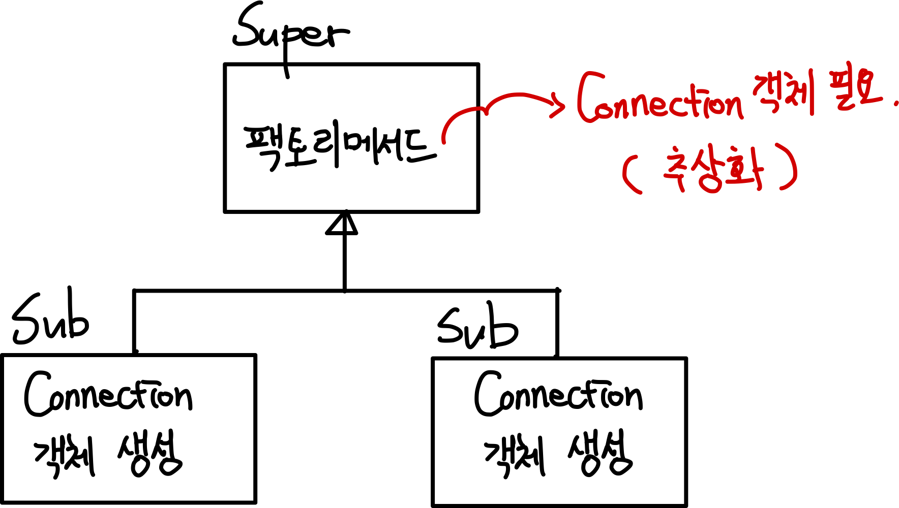</p>

🤔 팩토리 메서드 패턴이란?

* ***서브클래스에서 구체적인 객체(Connection) 생성 방법을 결정하게 하는 것***

* 팩토리 메서드 패턴도 템플릿 메서드 패턴과 동일하게 ***상속을 통해 기능을 확장***하는 패턴이다.

* ***슈퍼클래스는 서브클래스에서 구현할 메서드를 호출해서 필요한 타입의 객체를 가져와 사용한다.***

> 더 자세한 예제는 [여기](https://johngrib.github.io/wiki/factory-method-pattern/)서 확인 가능하다.

<br>

## 개방 폐쇄 원칙

🤔 개방 폐쇄 원칙이란?

* 클래스나 모듈은 확장에는 열려 있어야 하고 변경에는 닫혀있어야 한다
* 인터페이스를 통해 두 클래스 사이에 느슨한 관계를 만들어주어 확장에 열려있게 하는 것이다.
* 예시
  * JDBC

<br>

## 높은 응집도와 낮은 결합도

<br>

🤔 **높은 응집도란?**

* 응집도가 높다는 건 하나의 모듈, 클래스가 **하나의 책임 또는 관심사에만 집중되어 있다는 뜻이다.**
  * 불필요하거나 직접 관련이 없는 외부의 관심과 책임이 얽혀있지 않으며, 하나의 공통 관심사는 한 클래스에 모여 있다.

<br>

🤔 **낮은 결합도란?**

* 책임과 관심사가 다른 객체간의 느슨한 연결을 유지하는 것을 낮은 결합도라고 한다.
* **결합도란?**
  * **하나의 객체가 변경이 일어날 때 관계를 맺고 있는 다른 객체에게 변화를 요구하는 정도**
* 낮은 결합도란 결국, 하나의 변경이 발생할 때 마치 파문이 이는 것처럼 여타 모듈과 객체로 변경에 대한 요구가 전파되지 않는 상태를 말한다.

<br>

## 전략 패턴

🤔 전략 패턴이란?

* 클라이언트가 전략을 생성해 전략을 실행할 컨텍스트에 주입하는 패턴
* **OCP에 잘 들어맞는 패턴이며, 자신의 기능 맥락(context)에서, 필요에 따라 변경이 필요한 알고리즘을 인터페이스로 통째로 외부로 분리시키고, 이를 구현한 구체적인 클래스를 필요에 따라 바꿔서 사용할 수 있게 하는 디자인 패턴이다.**
* 꼭 알아야하는 세 요소
  * 전략 메서드를 가진 전략 객체
  * 전략 객체를 사용하는 컨텍스트(전략 객체의 사용자/소비자)
  * 전략 객체를 생성해 컨텍스트에 주입하는 클라이언트(제3자, 전략 객체의 공급자)

<p align="center"></p>

* `OCP + 생성자를 통합 의존성 주입`가 좋은 예시이다.

<br>


## 프레임워크 vs 라이브러리

🤔 프레임워크와 라이브러리

* 제어
  * 라이브러리를 사용하는 코드는 애플리케이션 흐름을 직접 제어한다. (능동)
  * **프레임워크는 거꾸로 코드가 프레임워크에 의해 사용된다. (수동) - 제어의 역전**
    * 컴포넌트의 생성과 관계 설정, 사용, 생명주기 관리등을 관장한다.
    * **개발자는 프레임워크 흐름중 일부를 작성하고 프레임워크가 전체적인 흐름을 주도한다.**
      * 예시 - `Servlet`, 

<br>

## 싱글톤 패턴

🤔 싱글톤 패턴이란?

* 어떤 클래스를 애플리케이션 내에서 제한된 인스턴스 개수, 이름처럼 주로 하나만 존재하도록 강제하는 패턴이다.
* 하나만 만들어진 객체는 애플리케이션 내에서 전역적으로 접근이 가능하다.

<br>

## 동일성 동등성
* 동일성
  * 두 개의 객체가 완전히 같은 동일한 객체 (동일한 참조 주소)
  * `==`를 이용하여 비교
* 동등성
  * 두 개의 객체가 동일한 정보를 담고 있는 객체 (동일한 상태 값)
  * `equals()`를 이용하여 비교

