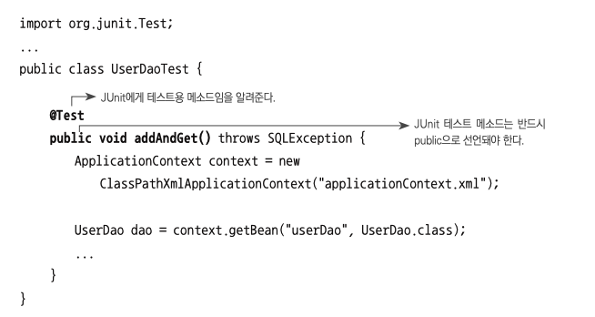
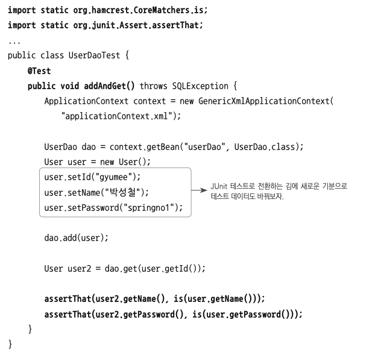
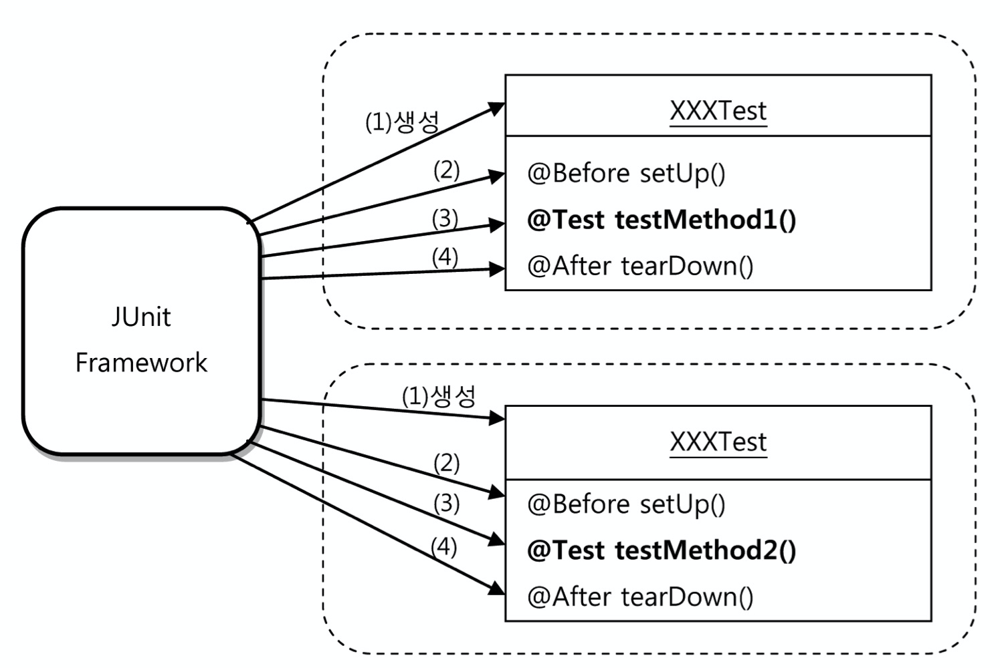
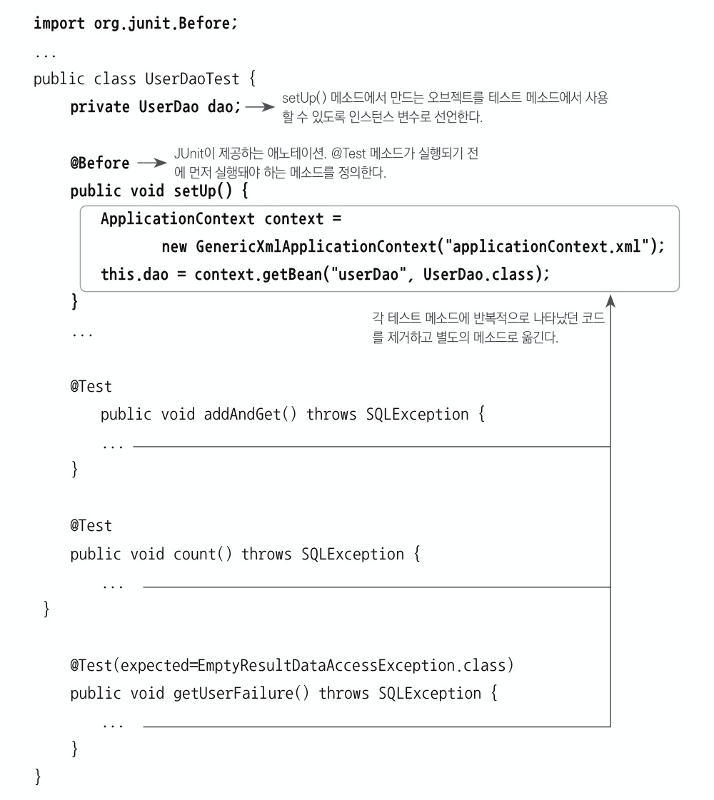
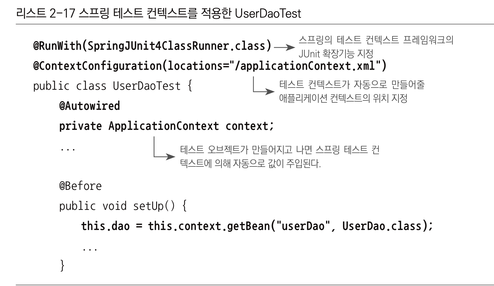
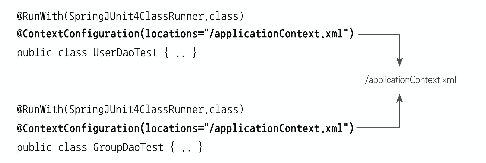

[토비의 스프링](http://www.yes24.com/Product/Goods/76074405?OzSrank=2)을 바탕으로 작성한 자료입니다.


# 목차

- [2장 테스트](#2장-테스트)
  * [1 main 테스트 다시보기](#1-main-테스트-다시보기)
    + [1-1 웹을 통한 테스트 방법의 문제점](#1-1-웹을-통한-테스트-방법의-문제점)
    + [1-2 단위 테스트가 필요한 이유](#1-2-단위-테스트가-필요한-이유)
    + [1-3 main 테스트의 문제점](#1-3-main-테스트의-문제점)
  * [2 JUnit 테스트로 전환](#2-junit-테스트로-전환)
  * [3 JUnit](#3-junit)
    + [3-1 JUnit의 특징](#3-1-junit의-특징)
    + [3-2 JUnit의 간단한 동작원리](#3-2-junit의-간단한-동작원리)
    + [3-3 픽스처](#3-3-픽스처)
      - [@Before](#before)
  * [4 TDD](#4-tdd)
    + [4-1 테스트 주도 개발](#4-1-테스트-주도-개발)
    + [4-2 기능정의서를 만들자](#4-2-기능정의서를-만들자)
  * [5 JUnit을 통한 main테스트 개선](#5-junit을-통한-main테스트-개선)
    + [5-1 테스트 결과의 일관성](#5-1-테스트-결과의-일관성)
      - [deleteAll()](#deleteall)
      - [getCount()](#getcount)
      - [addAndGet()](#addandget)
    + [5-2 존재하지 않는 id 테스트](#5-2-존재하지-않는-id-테스트)
      - [예외를 던져서 존재하지 않는 id 테스트](#예외를-던져서-존재하지-않는-id-테스트)
  * [6 스프링 테스트 적용](#6-스프링-테스트-적용)
    + [6-1 테스트를 위한 애플리케이션 컨텍스트 관리](#6-1-테스트를-위한-애플리케이션-컨텍스트-관리)
      - [@BeforeClass](#beforeclass)
      - [스프링 테스트 컨텍스트 프레임워크](#스프링-테스트-컨텍스트-프레임워크)
    + [6-2 DI와 테스트](#6-2-di와-테스트)
      - [수동으로 DI 주는 방법](#수동으로-di-주는-방법)
      - [테스트를 위한 별도의 DI 설정 방법](#테스트를-위한-별도의-di-설정-방법)
      - [스프링 컨텍스트 없이 DI 방법](#스프링-컨텍스트-없이-di-방법)
  * [7 학습 테스트로 배우는 스프링](#7-학습-테스트로-배우는-스프링)
    + [7-1 학습 테스트](#7-1-학습-테스트)
    + [7-2 학습 테스트의 장점](#7-2-학습-테스트의-장점)
    + [7-3 학습 테스트 예제](#7-3-학습-테스트-예제)
      - [JUnit 테스트 객체 테스트](#junit-테스트-객체-테스트)
- [용어 정리](#용어-정리)
  * [침투적 기술과 비침투적 기술](#침투적-기술과-비침투적-기술)


# 2장 테스트

🙋‍♂️ 스프링에서 가장 중요한 가치는 **객체지향과 테스트**이다.

이번 장에서는 테스트란 무엇이며, 그 가치와 장점, 활용 전략, 스프링과의 관계에 대해서 다뤘다.


## 1 main 테스트 다시보기

🙋‍♂️ 1장에서는 `main`을 통해서 `UserDao`를 테스트하였다. **이 `main`함수를 통해 테스트의 유용성과 특징, 문제점에 대해 알아보자.**  


😎 **테스트의 유용성**

* `main`함수 통해 테스트를 하면 `UserDao`의 책임인 `add()`와 `get()`의 테스트를 통해 DB커넥션과 데이터 액세스 관심을 모두 테스트 할 수 있다.  


### 1-1 웹을 통한 테스트 방법의 문제점

:scream: **웹 브라우저를 통한 테스트는 문제점이 많다.**

* DAO뿐만 아니라 서비스 클래스, 컨트롤러, JSP 뷰 등 **모든 레이어의 기능을 다 만들고 나서야 테스트가 가능하다는 문제**
* 테스트를 하는 중에 에러가 나거나 테스트가 실패했다면, 과연 **어디에서 문제가 발생했는지를 찾아내야 하는 문제**


> 이러한 문제를 해결하는 방법은 레이어 혹은 그보다 더 작은 단위로 나눠서 테스트를 하는 것이다.  


### 1-2 단위 테스트가 필요한 이유

🤔 **단위 테스트란?**

* **작은 단위의 코드에 대해 테스트를 구행하는 것.**
* 단위에는 그 크기와 범위가 어느정도인지 정해진 것은 아니다.
* **하나의 관심에 집중해서 효율적으로 테스트할 만한 범위의 단위라고 보면 된다.**

> **통제할 수 없는 외부의 리소스에 의존하는 테스트는 단위 테스트라고 보기 어렵다.**


😎 **단위 테스트가 필요한 이유**

* **관심사의 분리**
  * 한번에 너무 많은 관심들을 몰아서 테스트하면 테스트 수행 과정도 복잡해지고, 오류가 발생했을 때 정확한 원인을 찾기가 힘들어진다.
  * 따라서 테스트는 가능하면 작은 단위로 쪼개서 집중해서 할 수 있어야 한다.
* 관심사별로 테스트를 진행하고 모아서 전체적으로 진행하고 하면 좋다.
* ***테스트를 이용하면 새로운 기능도 테스트할 수 있고, 기존에 만들어뒀던 기능들이 새로운 기능을 추가하느라 수정한 코드에 영향을 받지 않고 잘 동작하는지 확인 할 수 있다.***


> 기능을 작은 단위로 나누어 테스트하고, 나중에 합쳐서 전체적인 기능을 테스트하면 오류 잡기도 좋고 확장했을때 불안감이 없다.

> **어떤 개발자는 모든 클래스는 스스로 자신을 테스트하는 `main`메서드를 갖고 있어야 한다고 주장한다.**


### 1-3 main 테스트의 문제점

* 수동 확인 작업의 문제점
  * 매번 콘솔에 값을 눈으로 직접 확인하여 테스트를 수행해야한다.
  * 테스트 수행은 코드에 의해 자동적으로 수행되지만, **테스트의 결과를 확인하는 일은 사람의 책임이므로 완전히 자동 테스트라고 볼 수 없다.**

* 실행 작업의 번거로움
  * 만약 테스트해야하는 코드가 100개가지가 넘는다면 `main`도 그만큼 많이 만들어야하고, 각자 따로 실행을 해줘야 한다.


## 2 JUnit 테스트로 전환

> "테스트란 개발자가 마음 편하게 잠자리에 들 수 있게 해주는 것" - 켄트 백

😎 JUnit을 사용하면 `main` 테스트의 두가지 문제점을 고칠 수 있다.






* 검증 코드 전환

  * ```java
    // main메서드 테스트 (변경 전)
    if(!user.getName().equals(user2.getName())){
      // 테스트 실패...
    }
    
    // JUnit (변경 후)
    assertThat(user2.getName(), is(user.getName()));
    ```

* 테스트 실행

  * ```java
    public static void main(String[] args){
      JUnitCore.main("com.binghe.user.MainTest.JUnitTest")
    }
    ```


> * [main 테스트 코드 (변경 전)](https://github.com/binghe819/toby-spring-code/blob/master/Ch02/src/main/java/com/binghe/user/MainTest/MainTest.java)
> * [JUnit 테스트 코드 (변경 후)](https://github.com/binghe819/toby-spring-code/blob/master/Ch02/src/main/java/com/binghe/user/MainTest/JUnitTest.java)


## 3 JUnit

JUnit을 사용하기에 앞서 JUnit의 사용방법에 대해서 간단히 다뤄보았다.


### 3-1 JUnit의 특징

🙋‍♂️ **JUnit은 프레임워크이다.**


* JUnit도 프레임워크이기 때문에, 스프링과 같이 개발자에게 제어권이 있지 않다. (제어의 역전)
* 전략 패턴을 생각하면 이해가 빠르다.


### 3-2 JUnit의 간단한 동작원리

🙋‍♂️ **JUnit이 수행하는 방식은 아래와 같다.**

1. 테스트 클래스에서 `@Test`가 붙은 `public`이고, `void`형이며 파라미터가 없는 테스트 메서드를 모두 찾는다.

2. **테스트 클래스의 객체를 하나 만든다. (매번 새로 만든다.)**

3. `@Before`가 붙은 메서드가 있으면 실행한다.

4. `@Test`가 붙은 메서드를 하나 호출하고 테스트 결과를 저장해둔다.

5. `@After`가 붙은 메서드가 있으면 실행한다.

6. 나머지 테스트 메서드에 대해 2~5번을 반복한다.
7. 모든 테스트의 결과를 종합해서 돌려준다.


🙋‍♂️ **주의할 점은 각 테스트 메서드를 실행할 때마다 테스트 클래스의 객체를 새로 만든다.**



* 왜 테스트 메서드를 실행할 때마다 새로운 객체를 만들까?
  * 각 테스트가 서로 영향을 주지 않고 독립적으로 실행됨을 보장해주기 위해서이다.


### 3-3 픽스처

🤔 **픽스처란?**

* 테스트를 수행하는 데 **필요한 정보나 객체**를 픽스처라고 한다.
* 테스트를 실행하기위한 기준으로 사용되는 **고정 상태**


#### @Before



* 테스트 클래스에서 각 테스트 메서드마다 사전적으로 해야하는 작업에 `@Before`을 사용해서 처리한다.
  * 메서드 추출기법과 유사하다.


🤔 **테스트 메서드의 일부에서만 공통적인 메서드를 사용해야한다면?**

* 메서드 추출 기법을 사용하는 방법
* 공통적인 특징을 지닌 테스트 메서드를 모아 별도의 테스트 클래스를 만들어 `@Before`를 사용하는 방법


## 4 TDD

저자는 TDD의 중요성을 계속해서 강조하고 있다.


### 4-1 테스트 주도 개발

🤔 **테스트 주도 개발이란?**

* **기능의 내용과 코드를 검증도 해줄 수 있는 테스트 코드**를 **먼저 만들고**, **테스트를 성공하게 해주는 코드**를 작성하는 방식의 개발 방법
* **실패한 테스트를 성공시키기 위한 목적이 아닌 코드는 만들지 않는다.**


🙋‍♂️ ***항상 네거티브 테스트를 먼저 만들라*** - 로드 존슨

* 개발자가 테스트를 만들 때 가장 많이 하는 실수는 바로 성공하는 테스트만 골라서 만드는 것이다.
* **문제가 될 만한 상황이나, 입력 값 등을 피하지 말고 먼저 테스트해보라**
  * `get()`메서드에서 `id`가 존재하지 않은 것이거나 입력 값이 없다면 어떻게 처리할 것인지부터 고민해보자.


### 4-2 기능정의서를 만들자

🙋‍♂️ **각 테스트마다 기능 정의서를 만들자**


* 설명
  * 위 그림은 `id`를 통해 DB의 `User`데이터를 가져오는 메서드인 `get`의 테스트중 하나이다.
  * **존재하지 않은 `id`로 `get()`을 실행했을때의 테스트이다.**
  * 이렇게 네거티브한 메서드를 먼저 만들어 테스트를 진행하자.


## 5 JUnit을 통한 main테스트 개선

이제 JUnit을 사용해서 기존의 `main` 테스트를 개선해보자.

**단위 테스트는 코드가 바뀌지 않는한 매번 실행때마다 동일한 테스트 결과를 얻을 수 있어야 한다.**

* 테스트의 일관성 (정상적인 테스트 - `get`)
* 존재하지 않는 id 테스트 (예외적인 테스트 - `get`)

[JUnit 테스트 코드](https://github.com/binghe819/toby-spring-code/blob/master/Ch02/src/test/java/com/binghe/user/JUnitTest/UserDaoTest.java)

[추가된 UserDao 코드](https://github.com/binghe819/toby-spring-code/blob/master/Ch02/src/main/java/com/binghe/user/JUnitTest/UserDao.java)

### 5-1 테스트 결과의 일관성

>  `main` 테스트에서는 한번 테스트하고, DB에서 직접 데이터를 삭제해줘야했다. 이러한 작업을 없애는 것이 첫번째 개선 방안이다.

🤔 **테스트 결과의 일관성이란?**

* **코드에 변경사항이 없다면 테스트는 항상 동일한 결과(일관성)를 내야한다는 것.**
* 외부(DB) 상태에 따라 테스트의 결과를 좌우하지 않도록 항상 동일한 결과를 내게 해야한다.


🙋‍♂️ **테스트 결과를 일관성있게 바꾸는 방법**

> 책에서는 직접 테스트 관련 데이터를 지웠다.

* 직접 DB에 접속하여 테스트 관련 데이터를 지우는 방법
* 스프링의 기능을 이용한 방법


#### deleteAll()

`deleteAll()코드`

```java
public void deteleAll() throws SQLException {
  // DB 연결 관심
  Connection con = dataSource.getConnection();

  // SQL 실행 관심
  PreparedStatement ps = con.prepareStatement("delete from users");
  ps.executeUpdate();

  ps.close();
  con.close();
}
```

`deleteAll() 테스트코드`

```java
@Test
public void deteleAll() throws SQLException, ClassNotFoundException {
  User user1 = new User("binghe", "홍길동", "1234");
  User user2 = new User("toby", "토비", "4567");

  userDao.deteleAll();
  assertThat(userDao.getCount(), is(0));

  userDao.add(user1);
  userDao.deteleAll();
  assertThat(userDao.getCount(), is(0));
}
```

* deleteAll()을 하면 DB에 남은 데이터가 없어야 한다.
  * 조건 : 어떤 상황이든
  * 행위 : `deleteAll()`을 호출하면
  * 결과 : `getCount()`호출한 결과가 `0`이어야 한다.


#### getCount()

`getCount() 코드 ` 

```java
public int getCount() throws SQLException {
  // DB 연결 관심
  Connection con = dataSource.getConnection();

  // SQL 관심
  PreparedStatement ps = con.prepareStatement("select count(*) from users");

  // 결과
  ResultSet rs = ps.executeQuery();
  rs.next();
  int count = rs.getInt(1);

  rs.close();
  ps.close();
  con.close();

  return count;
}
```

`getCount() 테스트코드`

```java
@Test
public void getCount() throws SQLException, ClassNotFoundException {
  User user1 = new User("binghe", "홍길동", "1234");
  User user2 = new User("toby", "토비", "4567");
  User user3 = new User("java", "자바", "8913");

  // 테스트 1
  userDao.deteleAll();
  assertThat(userDao.getCount(), is(0));

  // 테스트 2
  userDao.add(user1);
  assertThat(userDao.getCount(), is(1));

  // 테스트 3
  userDao.add(user2);
  assertThat(userDao.getCount(), is(2));

  // 테스트 4
  userDao.add(user3);
  assertThat(userDao.getCount(), is(3));
}
```

* `User`를 추가할 때마다 `getCount()`의 반환 값이 올라간다.
  * 조건 : `deletAll()`을 호출하고 `User`를 하나씩 추가하면
  * 행위 : `getCount()`를 호출하면
  * 결과 : 호출한 결과가 1씩 올라간다.


#### addAndGet() 

이제 `deleteAll()`과 `getCount()`를 이용해서 테스트 결과를 일관성있게 해보자.

```java
@Test
public void addAndGet() throws SQLException, ClassNotFoundException {
  userDao.deteleAll();
  assertThat(userDao.getCount(), is(0));

  User user1 = new User("binghe", "홍길동", "1234");
  User user2 = new User("toby", "토비", "4567");

  // 추가
  userDao.add(user1);
  userDao.add(user2);
  assertThat(userDao.getCount(), is(2));

  // 테스트 1
  User userget1 = userDao.get(user1.getId());
  assertThat(userget1.getName(), is(user1.getName()));
  assertThat(userget1.getPassword(), is(user1.getPassword()));

  // 테스트 2
  User userget2 = userDao.get(user2.getId());
  assertThat(userget2.getName(), is(user2.getName()));
  assertThat(userget2.getPassword(), is(user2.getPassword()));
}
```

* `deleteAll()`을 통해서 DB 테이블의 데이터를 모두 지우고 하므로 일관성있는 테스트를 할 수 있다.


### 5-2 존재하지 않는 id 테스트

> 항상 네이티브 테스트를 먼저 만들라 - 로드 존슨

🤔 **만약 `get(String id)`의 `id`가 존재하지 않는 값이라면?**

* `null`과 같은 특별한 값을 리턴하는 방법
* `id`에 해당하는 정보를 찾을 수 없다고 예외를 던지는 방법


#### 예외를 던져서 존재하지 않는 id 테스트

> `EmptyResultDataAccessException`은 `spring.dao`에 포함되어 있는 에러 클래스이다.

1. `get(String id)`메서드의 예외상황에 대한 테스트

   ```java
   // 테스트 중에 발생할 것으로 기대하는 예외 클래스를 지정해준다.
   @Test(expected = EmptyResultDataAccessException.class)
   public void getUserFailure() throws SQLException, ClassNotFoundException {
     userDao.deteleAll();
     assertThat(userDao.getCount(), is(0));
     
   	// 이 코드에서 예외가 발생해야 한다. 예외가 발생하지 않으면 테스트가 실패한다.
     userDao.get("unknwon_id"); 
   }
   ```

   

2. `get(String id)`에서 데이터를 찾지 못하면 예외를 발생시키도록 한다.

   ```java
   public User get(String id) throws ClassNotFoundException, SQLException {
     ...  
     ResultSet rs = ps.executeQuery();
     
     User user = null; // null로 초기화
     // id를 조건으로 한 쿼리의 결과가 있으면 User에 넣는다.
     if(rs.next()){
       user = new User();
       user.setId(rs.getString("id"));
       user.setName(rs.getString("name"));
       user.setPassword(rs.getString("password"));
     }
   
     // 리소스를 반환하는 관심
     rs.close();
     ps.close();
     con.close();
   
     // user에 넣어진 쿼리 결과가 없다면 (존재하지 않는 id라면) 에러 던지기
     if(user == null) throw new EmptyResultDataAccessException(1);
     return user;
   }
   ```

   

> 이렇게 해서 `get`을 정상적인 결과를 가져오는 방법과 예외적인 경우에 대해 모두 테스를 성공하였다.


## 6 스프링 테스트 적용

> JUnit을 통한 테스트는 매 테스트메서드마다 새로운 `ApplicationContext`를 픽스처를 통해서 생성해주었다.
>
> 만약 컨테이너에 등록해야 할 빈들이 많을 경우 **매번 `ApplicationContext`를 생성하는 비용은 생각보다 높다.**


### 6-1 테스트를 위한 애플리케이션 컨텍스트 관리

:scream: 위에서 언급했듯이, **매 테스트마다 컨텍스트(컨테이너)를 생성해주는 것은 비용이 너무 높다**. **이러한 문제를 해결하기 위해 스프링은 테스트를 따로 제공해준다.**


🤔 **애플리케이션 컨텍스트를 여러 테스트가 공유해도 되는가? - 대체로 가능하다.**

* 기본적으로 빈은 모두 싱글톤 방식으로 생성되고, `DB` 작업을 한다고 상태가 변하진 않는다.
* 싱글톤 방식으로 사용되지 않는 빈들의 테스트에만 컨텍스트를 매번 생성해주도록 스프링이 기능을 제공한다.
  * 


🤔 어떻게 테스트에서 컨텍스트를 공유 자원으로 만들지?

* `@BeforeClass`
* 스프링 테스트 컨텍스트 프레임워크
  * `@Runwith`
  * `@contextConfiguration`


#### @BeforeClass

* JUnit은 **매 테스트 메서드마다 새로운 객체를 만드는데, 이렇게 할 경우 컨텍스트를 공유할 수 없다.**
* 이러한 문제를 해결하기 위한 **`@BeforeClass`는 테스트 객체에 전체에서 딱 한 번만 실행된다.**


#### 스프링 테스트 컨텍스트 프레임워크



* SpringJUnit을 사용해서 `ContextConfiguration`을 선택해주면 테스트 전체에 한번 컨텍스트를 스태틱 변수로 만들어 공유하게 된다.

  * `@Before`에서 매번 `ApplicationContext`를 생성해줄 필요가 없다.

* 적용 전후 비교

  * [스프링 테스트 컨텍스트 프레임워크 적용전 코드](https://github.com/binghe819/toby-spring-code/blob/master/Ch02/src/test/java/com/binghe/user/JUnitTest/UserDaoTest.java)

  * [스프링 테스트 컨텍스트 프레임워크 적용후 코드](https://github.com/binghe819/toby-spring-code/blob/master/Ch02/src/test/java/com/binghe/user/JUnitTest/UserDaoSpringTest.java)

  

🤔 `@Runwith`

* JUnit 프레임워크의 테스트 실행 방법을 확장할 때 사용하는 애노테이션이다.
* 테스트 컨텍스트를 지정해주면 JUnit이 테스트를 진행하는 중에 테스트가 사용할 컨텍스트를 만들고 관리하는 작업을 진행해준다.


🤔 `@ContextConfiguration`

* 자동으로 만들어줄 **애플리케이션 컨텍스트의 설정파일 위치를 지정하는 것.**


😎 **여러 개의 테스트 클래스가 있는데 모두 같은 설정파일을 가진다면 스프링은 컨텍스트를 공유하게 해준다.**



* 따라서 **수백 개의 테스트 클래스를 모두 단 한 개의 애플리케이션 컨텍스트만 만들어서 사용할 수 있다.**
* 물론 테스트 클래스마다 다른 설정파일을 사용하도록 만들어도 된다.


### 6-2 DI와 테스트

> 이번엔 테스트용 컨텍스트를 어떻게 DI할 수 있는지에 대해서 다룬다.

🙋‍♂️ **테스트를 진행할 때는 배포되어 있는 리소스나 로직에 영향을 주면 안된다.** 그러므로 아래와 같이 컨텍스트를 나눌 수 있다.

* 배포용 컨텍스트
* 테스트용 컨텍스트


🙋‍♂️ **배포되어있는 코드에 테스트용 컨텍스트를 DI하는 방법**

1. 수동으로 DI 주는 방법
   * `DirtiesContext`
2. 테스트를 위한 별도의 DI 설정 방법
   * 테스트용 컨텍스트 설정 파일을 따로 두고 `@ContextConfiguration`을 통해서 테스트할 때는 테스트용 설정파일을 사용한다.
3. 스프링 애플리케이션 컨텍스트 없이 DI 설정하는 방법
   * 직접 `DataSource`, `UserDao`를 생성하고, `UserDao`에 `setDataSource`를 통해 의존성을 주입해주는 방법


#### 수동으로 DI 주는 방법

```java
@DirtiesContext
public class UserDaoTest{
  @Autowired
  UserDao dao;
  
  @Before
  public void setUp() {
    ...
    // 이 테스트 클래스에서만 사용하고 싶은 DataSource를 생성
    DataSource dataSource = new SingleConnectionDataSource("jdbc:...","sa","",true);
    dao.setDataSource(dataSource); // 수동으로 DI
  }
}
```

* `DirtiesContext`

  * **스프링 테스트 컨텍스트 프레임워크에게 해당 클래스의 테스트에서 애플리케이션 컨텍스트의 상태를 변경한다는 것을 알려준다는 의미.**
  * **테스트 컨텍스트는 이 애노테이션이 붙은 테스트 클래스에는 컨텍스트 공유를 허용하지 않는다.**

  
  

#### 테스트를 위한 별도의 DI 설정 방법

```java
@Runwith(SpringJUnit4ClassRunner.class)
@ContextConfiguration(classes = Configuration.class)
// xml이면 @ContextConfiguration(location="..xml")
public class UserDaoTest{
  
}
```

* 이 클래스의 테스트를 하는 동안은 `ContextConfiguration`에 해당하는 컨텍스트 설정을 사용하여 테스트한다.


#### 스프링 컨텍스트 없이 DI 방법

```java
public class UserDaoTest{
  UserDao dao;
  
  ...
    
  @Before
  public void setUp(){
    ...
   	// 직접 의존성을 생성해준다.
    dao = new UserDao()
    // 직접 의존성을 생성 및 주입해준다.
    DataSource dataSource = new SingleConnectionDataSource("jdbc:...","sa","",true);
    dao.setDataSource(dataSource); // 수동으로 DI
  }
}
```


## 7 학습 테스트로 배우는 스프링

> **토비님은 새로운 프레임워크나 라이브러리를 익힐 때 테스트 코드를 만들어 익힌다고 한다.**

### 7-1 학습 테스트

🤔 학습 테스트란?

* 자신이 만들지 않음 프레임워크나 라이브러리등에 대해서 테스트를 작성하는 것.


🤔 목적은?

* 자신이 사용할 API나 프레임워크의 기능을 테스트로 보면서 사용 방법을 익히려는 것.
* **자신이 사용하려는 기술에 대해서 제대로 이해하고 있는지와 잘 작동하는지 테스트하기 위함.**
* 테스트 코드를 작성해보면 빠르고 정확하게 사용법을 익히게 된다.


### 7-2 학습 테스트의 장점

1. 다양한 조건에 따른 기능을 손쉽게 확인해볼 수 있다.
   * 전체적인 애플리케이션을 실행하지 않아도 라이브러리나 프레임워크에 대해 테스트가 가능.
2. 학습 테스트 코드를 개발 중에 참고할 수 있다.
3. **프레임워크나 제품을 업그레이드할 때 호환성 검증을 도와준다.**
   * 학습 테스트 코드를 저장해 놓으면 추후에 업그레이드로 인한 API 변화를 쉽게 테스트할 수 있다.
4. 테스트 작성에 대한 좋은 훈련이 된다.
5. 새로운 기술을 공부하는 과정이 즐거워진다.


### 7-3 학습 테스트 예제

#### JUnit 테스트 객체 테스트

```java
public class JUnitTest{
  static Set<JUnitTest> testObjects = new HashSet<>();
  
  @Test
  public void test1(){
    assertThat(this, is(not(sameInstance(testObject))));
    testObjects.add(this);
  }
  
  @Test
  public void test2(){
    assertThat(this, is(not(sameInstance(testObject))));
    testObjects.add(this);
  }
  
  @Test
  public void test2(){
    assertThat(this, is(not(sameInstance(testObject))));
    testObjects.add(this);
  }
}
```

* JUnit은 테스트 메서드를 실행할 때마다 새로운 객체를 만드는지 테스트하는 코드이다.
  * `is(not())`은 같지 않아야 성공하는 코드이다.


# 용어 정리


## 침투적 기술과 비침투적 기술

* 침투적 기술 : 기술을 적용했을 때 애플리케이션 코드에 기술 관련 API가 등장하거나, 특정 인터페이스나 클래스를 사용하도록 강제하는 기술.
  * 애플리케이션 코드가 해당 기술에 종속되는 결과를 가져온다.
* 비침투적 기술 : 애플리케이션 로직을 담은 코드에 아무런 영향을 주지 않고 적용이 가능하다.
  * 기술에 종속적이지 않고 순수한 코드를 유지할 수 있게 해준다. (POJO)
  * 스프링이 바로 비침투적 기술의 대표적인 예시이다.


