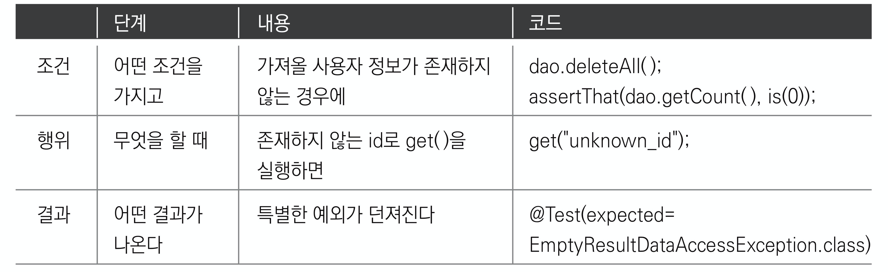

[토비의 스프링](http://www.yes24.com/Product/Goods/76074405?OzSrank=2)을 바탕으로 작성한 자료입니다.

<br>

# 목차

- [목차](#목차)
- [2장 테스트](#2장-테스트)
  - [1 단위 테스트](#1-단위-테스트)
    - [1-1 단위 테스트](#1-1-단위-테스트)
    - [1-2 단위 테스트가 필요한 이유](#1-2-단위-테스트가-필요한-이유)
  - [2 자동 테스트를 하자](#2-자동-테스트를-하자)
    - [2-1 수동 테스트의 문제점](#2-1-수동-테스트의-문제점)
    - [2-2 JUnit을 통한 자동 테스트](#2-2-junit을-통한-자동-테스트)
  - [3 단위 테스트를 하며 꼭 지켜야 사항](#3-단위-테스트를-하며-꼭-지켜야-사항)
    - [3-1 테스트 결과의 일관성 (멱등성)](#3-1-테스트-결과의-일관성-멱등성)
    - [3-2 네거티브 테스트](#3-2-네거티브-테스트)
    - [3-3 기능정의서를 만들자](#3-3-기능정의서를-만들자)
  - [4 스프링 테스트 적용](#4-스프링-테스트-적용)
    - [4-1 테스트를 위한 애플리케이션 컨텍스트 관리](#4-1-테스트를-위한-애플리케이션-컨텍스트-관리)
      - [@BeforeClass](#beforeclass)
      - [스프링 테스트 컨텍스트 프레임워크](#스프링-테스트-컨텍스트-프레임워크)
    - [4-2 DI와 테스트](#4-2-di와-테스트)
      - [수동으로 DI 주는 방법](#수동으로-di-주는-방법)
      - [테스트를 위한 별도의 DI 설정 방법](#테스트를-위한-별도의-di-설정-방법)
      - [스프링 컨텍스트 없이 DI 방법](#스프링-컨텍스트-없이-di-방법)
  - [5 학습 테스트로 배우는 스프링](#5-학습-테스트로-배우는-스프링)
    - [5-1 학습 테스트](#5-1-학습-테스트)
    - [5-2 학습 테스트의 장점](#5-2-학습-테스트의-장점)
    - [5-3 학습 테스트 예제](#5-3-학습-테스트-예제)
- [용어 정리](#용어-정리)
  - [침투적 기술과 비침투적 기술](#침투적-기술과-비침투적-기술)

<br>

# 2장 테스트

🙋‍♂️ 스프링에서 가장 중요한 가치는 **객체지향과 테스트**이다.

이번 장에서는 테스트란 무엇이며, 그 가치와 장점, 활용 전략, 스프링과의 관계에 대해서 다룬다.

<br>

## 1 단위 테스트

🙋‍♂️ 1장에서는 `main`을 통해서 `UserDao`를 테스트하였다. **이 `main`함수를 통해 테스트의 유용성과 특징, 문제점에 대해 알아보자.**  
* `main`함수 통해 테스트를 하면 `UserDao`의 책임인 `add()`와 `get()`의 테스트를 통해 DB커넥션과 데이터 액세스 관심을 모두 테스트 할 수 있다.  

<br>

### 1-1 단위 테스트

🤔 **단위 테스트란?**

* **작은 단위의 코드에 대해 테스트를 구현하는 것.**
* 단위에는 그 크기와 범위가 어느정도인지 정해진 것은 아니다.
  * **하나의 관심에 집중해서 효율적으로 테스트할 만한 범위의 단위라고 보면 된다.**

> **통제할 수 없는 외부의 리소스에 의존하는 테스트는 단위 테스트라고 보기 어렵다.**

<br>

### 1-2 단위 테스트가 필요한 이유
😎 **단위 테스트가 필요한 이유**

* **관심사의 분리**
  * 한번에 너무 많은 관심들을 몰아서 테스트하면 테스트 수행 과정도 복잡해지고, 오류가 발생했을 때 정확한 원인을 찾기가 힘들어진다.
  * 따라서 테스트는 가능하면 작은 단위로 쪼개서 집중해서 할 수 있어야 한다.
* 관심사별로 테스트를 진행하고 모아서 전체적으로 진행하고 하면 좋다.
* ***테스트를 이용하면 새로운 기능도 테스트할 수 있고, 기존에 만들어뒀던 기능들이 새로운 기능을 추가하느라 수정한 코드에 영향을 받지 않고 잘 동작하는지 확인 할 수 있다.***

> 기능을 작은 단위로 나누어 테스트하고, 나중에 합쳐서 전체적인 기능을 테스트하면 오류 잡기도 좋고 확장했을때 불안감이 없다.

> **어떤 개발자는 모든 클래스는 스스로 자신을 테스트하는 `main`메서드를 갖고 있어야 한다고 주장하기도 한다.**

<br>

## 2 자동 테스트를 하자

<br>

### 2-1 수동 테스트의 문제점

<br>

:scream: **웹을 통해서 수동 테스트할 경우**


**웹 브라우저를 통한 테스트는 문제점이 많다.**
* DAO뿐만 아니라 서비스 클래스, 컨트롤러, JSP 뷰 등 **모든 레이어의 기능을 다 만들고 나서야 테스트가 가능하다는 문제**
* 테스트를 하는 중에 에러가 나거나 테스트가 실패했다면, 과연 **어디에서 문제가 발생했는지를 찾아내야 하는 문제**

<br>

> 이러한 문제를 해결하는 방법은 **레이어 혹은 그보다 더 작은 단위로 나눠서 테스트**를 하는 것이다.  

<br>

:scream: **main 테스트의 문제점**
* 수동 확인 작업의 문제점
  * 매번 콘솔에 값을 눈으로 직접 확인하여 테스트를 수행해야한다.
  * 테스트 수행은 코드에 의해 자동적으로 수행되지만, **테스트의 결과를 확인하는 일은 사람의 책임이므로 완전히 자동 테스트라고 볼 수 없다.**
* 실행 작업의 번거로움
  * 만약 테스트해야하는 코드가 100개가지가 넘는다면 `main`도 그만큼 많이 만들어야하고, 각자 따로 실행을 해줘야 한다.

<br>

### 2-2 JUnit을 통한 자동 테스트

**JUnit으로 전환**
```java
// main메서드 테스트 (변경 전)
if(!user.getName().equals(user2.getName())){
  // 테스트 실패...
}

// JUnit (변경 후)
assertThat(user2.getName(), is(user.getName()));
```
* JUnit이란?
  * JUnit은 테스트 프레임워크다.
  * **JUnit도 프레임워크이기 때문에, 스프링과 같이 개발자에게 제어권이 있지 않다. (제어의 역전)**
* JUnit의 특징<p align="center"><br>출처: 토비의 스프링 vol.1</p>
  * **각 테스트 메서드를 실행할 때마다 테스트 클래스의 객체를 새로 만든다.**
    * 그 이유는 각 테스트가 서로 영향을 주지 않고 독립적으로 실행됨을 보장해주기 위함이다.
* 자동 테스트의 장점
  * 쉽고 빠르게 자주 반복할 수 있다.
  * 지속적인 개선과 점진적인 개발이 가능하다.

> 픽스처
> * 테스트를 수행하는 데 **필요한 정보나 객체**를 픽스처라고 한다.
> * 테스트를 실행하기위한 기준으로 사용되는 **고정 상태**
> * 테스트 클래스에서 각 테스트 메서드마다 사전적으로 해야하는 작업에 `@Before`을 사용해서 처리한다.
>   * 메서드 추출기법과 유사하다.

<br>

## 3 단위 테스트를 하며 꼭 지켜야 사항
**단위 테스트는 코드가 바뀌지 않는한 매번 실행때마다 동일한 테스트 결과를 얻을 수 있어야 한다.**

* 테스트의 일관성 (정상적인 테스트 - `get`)
* 존재하지 않는 id 테스트 (예외적인 테스트 - `get`)

<br>

### 3-1 테스트 결과의 일관성 (멱등성)
>  `main` 테스트에서는 한번 테스트하고, DB에서 직접 데이터를 삭제해줘야했다. 즉, 멱등성을 지키지 못한다.
> 
> 하지만, 단위테스트는 꼭 멱등성을 준수해야한다.

🤔 **테스트 결과의 일관성이란?**
* **코드에 변경사항이 없다면 테스트는 항상 동일한 결과(일관성)를 내야한다는 것.**
  * 테스트를 실행하는 순서를 바꿔도 동일한 결과가 보장되어야 한다.
* 외부(DB) 상태에 따라 테스트의 결과를 좌우하지 않도록 항상 동일한 결과를 내게 해야한다.

<br>

🙋‍♂️ **테스트 결과를 일관성있게 바꾸는 방법**

> 책에서는 직접 테스트 관련 데이터를 지웠다.

* 직접 DB에 접속하여 테스트 관련 데이터를 지우는 방법
  * `deleteAll()`과 `count()`를 구현하여 테스트할 때 사용하면 된다.
* 스프링의 기능을 이용한 방법
  * 트랜잭션 Rollback (DB기능도 같이 사용)

<br>

### 3-2 네거티브 테스트
> 항상 네거티브 테스트를 먼저 만들라 - 로드 존슨

🤔 **만약 `get(String id)`의 `id`가 존재하지 않는 값이라면?**

* `null`과 같은 특별한 값을 리턴하는 방법 (Optional을 던져도 된다)
* `id`에 해당하는 정보를 찾을 수 없다고 예외를 던지는 방법

<br>

**예외를 던져서 존재하지 않는 id 테스트**

> `EmptyResultDataAccessException`은 `spring.dao`에 포함되어 있는 에러 클래스이다.

1. `get(String id)`메서드의 예외상황에 대한 테스트

```java
// 테스트 중에 발생할 것으로 기대하는 예외 클래스를 지정해준다.
@Test(expected = EmptyResultDataAccessException.class)
public void getUserFailure() throws SQLException, ClassNotFoundException {
  userDao.deteleAll();
  assertThat(userDao.getCount(), is(0));
  
// 이 코드에서 예외가 발생해야 한다. 예외가 발생하지 않으면 테스트가 실패한다.
  userDao.get("unknwon_id"); 
}
```

<br>   

2. `get(String id)`에서 데이터를 찾지 못하면 예외를 발생시키도록 한다.
```java
public User get(String id) throws ClassNotFoundException, SQLException {
  ...  
  ResultSet rs = ps.executeQuery();
  
  User user = null; // null로 초기화
  // id를 조건으로 한 쿼리의 결과가 있으면 User에 넣는다.
  if(rs.next()){
    user = new User();
    user.setId(rs.getString("id"));
    user.setName(rs.getString("name"));
    user.setPassword(rs.getString("password"));
  }

  // 리소스를 반환하는 관심
  rs.close();
  ps.close();
  con.close();

  // user에 넣어진 쿼리 결과가 없다면 (존재하지 않는 id라면) 에러 던지기
  if(user == null) throw new EmptyResultDataAccessException(1);
  return user;
}
```

<br>

### 3-3 기능정의서를 만들자
🙋‍♂️ **각 테스트마다 기능 정의서를 만들자**

<p align="center"><br>출처: 토비의 스프링 vol.1</p>

* 설명
  * 위 그림은 `id`를 통해 DB의 `User`데이터를 가져오는 메서드인 `get`의 테스트중 하나이다.
  * **존재하지 않은 `id`로 `get()`을 실행했을때의 테스트이다.**
  * 이렇게 네거티브한 메서드를 먼저 만들어 테스트를 진행하자.

<br>

## 4 스프링 테스트 적용

> JUnit을 통한 테스트는 매 테스트메서드마다 새로운 `ApplicationContext`를 픽스처를 통해서 생성해주었다.
>
> 만약 컨테이너에 등록해야 할 빈들이 많을 경우 **매번 `ApplicationContext`를 생성하는 비용은 생각보다 높다.**

<br>

:scream: **매 테스트마다 컨텍스트(컨테이너)를 생성해주는 것은 비용이 너무 높다**. **이러한 문제를 해결하기 위해 스프링은 테스트를 따로 제공해준다.**
* 테스트는 가능한 한 독립적으로 매번 새로운 객체를 만들어서 사용하는 것이 원칙이다.
* **하지만, 애플리케이션 컨텍스트(IoC 컨테이너)처럼 생성에 많은 시간과 자원이 소모되는 경우 테스트 전체가 공유하는 객체를 만들기도 한다.**
  * 이때도 테스트는 일관성있는 실행 결과를 보장해야 하고, 테스트의 실행 순서가 결과에 영향을 미치지 않아야 한다.

<br>

### 4-1 테스트를 위한 애플리케이션 컨텍스트 관리

<br>

🤔 **애플리케이션 컨텍스트를 여러 테스트가 공유해도 되는가? - 대체로 가능하다.**
* 기본적으로 **빈은 모두 싱글톤 방식으로 생성되고, `DB` 작업을 한다고 상태가 변하진 않는다.**
* 싱글톤 방식으로 사용되지 않는 빈들의 테스트에만 컨텍스트를 매번 생성해주도록 스프링이 기능을 제공한다.

<br>

🤔 어떻게 테스트에서 컨텍스트를 공유 자원으로 만들지?

* `@BeforeClass` (JUnit5부터는 `@BeforeAll`로 변경되었다)
* 스프링 테스트 컨텍스트 프레임워크
  * `@Runwith`
  * `@contextConfiguration`

<br>

#### @BeforeClass

* JUnit은 **매 테스트 메서드마다 새로운 객체를 만드는데, 이렇게 할 경우 컨텍스트를 공유할 수 없다.**
* 이러한 문제를 해결하기 위한 **`@BeforeClass`는 테스트 객체에 전체에서 딱 한 번만 실행된다.**

<br>

#### 스프링 테스트 컨텍스트 프레임워크

<p align="center"><br>출처: 토비의 스프링 vol.1</p>

* SpringJUnit을 사용해서 `ContextConfiguration`을 선택해주면 테스트 전체에 한번 컨텍스트를 스태틱 변수로 만들어 공유하게 된다.

  * `@Before`에서 매번 `ApplicationContext`를 생성해줄 필요가 없다.

* 적용 전후 비교

  * [스프링 테스트 컨텍스트 프레임워크 적용전 코드](https://github.com/binghe819/spring-toby-practice/blob/chapter02/src/test/java/com/binghe/user/dao/UserDaoTest.java)

  * [스프링 테스트 컨텍스트 프레임워크 적용후 코드](https://github.com/binghe819/spring-toby-practice/blob/chapter02/src/test/java/com/binghe/user/dao/UserDaoSpringTest.java)

<br>

🤔 `@Runwith`

* JUnit 프레임워크의 테스트 실행 방법을 확장할 때 사용하는 애노테이션이다.
* 테스트 컨텍스트를 지정해주면 JUnit이 테스트를 진행하는 중에 테스트가 사용할 컨텍스트를 만들고 관리하는 작업을 진행해준다.

<br>

🤔 `@ContextConfiguration`

* 자동으로 만들어줄 **애플리케이션 컨텍스트의 설정파일 위치를 지정하는 것.**

> JUnit5부터는 `@ExceptionWith(SpringExtension.class)`와 `@ContextConfiguration`로 변경되었다.

<br>

😎 **여러 개의 테스트 클래스가 있는데 모두 같은 설정파일을 가진다면 스프링은 컨텍스트를 공유하게 해준다.**

<p align="center"><br>출처: 토비의 스프링 vol.1</p>

* 따라서 **수백 개의 테스트 클래스를 모두 단 한 개의 애플리케이션 컨텍스트만 만들어서 사용할 수 있다.**
* 물론 테스트 클래스마다 다른 설정파일을 사용하도록 만들어도 된다.

<br>

> context변수에 자동으로 애플리케이션 컨텍스트가 주입될 수 있던 이유는 무엇일까?
> * **예상했듯이 DI다. 하지만, 여기에서의 DI는 객체 사이의 관계를 관리하기 위한 DI와는 성격이 다르다.**
>   * 애플리케이션 컨텍스트는 초기화할 때 자기 자신도 빈으로 등록한다.

<br>

### 4-2 DI와 테스트
> 이번엔 테스트용 컨텍스트를 어떻게 DI할 수 있는지에 대해서 다룬다.

<br>

🙋‍♂️ **테스트를 진행할 때는 배포되어 있는 리소스나 로직에 영향을 주면 안된다.** 그러므로 아래와 같이 컨텍스트를 나눌 수 있다.

* 배포용 컨텍스트
* 테스트용 컨텍스트

<br>

🙋‍♂️ **배포되어있는 코드에 테스트용 컨텍스트를 DI하는 방법**

1. 수동으로 DI 주는 방법
   * `DirtiesContext`
2. 테스트를 위한 별도의 DI 설정 방법
   * 테스트용 컨텍스트 설정 파일을 따로 두고 `@ContextConfiguration`을 통해서 테스트할 때는 테스트용 설정파일을 사용한다.
3. 스프링 애플리케이션 컨텍스트 없이 DI 설정하는 방법
   * 직접 `DataSource`, `UserDao`를 생성하고, `UserDao`에 `setDataSource`를 통해 의존성을 주입해주는 방법

<br>

#### 수동으로 DI 주는 방법

```java
@DirtiesContext
public class UserDaoTest{
  @Autowired
  UserDao dao;
  
  @Before
  public void setUp() {
    ...
    // 이 테스트 클래스에서만 사용하고 싶은 DataSource를 생성
    DataSource dataSource = new SingleConnectionDataSource("jdbc:...","sa","",true);
    dao.setDataSource(dataSource); // 수동으로 DI
  }
}
```

* `DirtiesContext`
  * **스프링 테스트 컨텍스트 프레임워크에게 해당 클래스의 테스트에서 애플리케이션 컨텍스트의 상태를 변경한다는 것을 알려준다는 의미.**
  * **테스트 컨텍스트는 이 애노테이션이 붙은 테스트 클래스에는 컨텍스트 공유를 허용하지 않는다.**
* 이 방법은 빈에 등록된 의존관계를 강제로 바꾸는 문제는 피할 수 있다.
  * 하지만 이 때문에 애플리케이션 컨텍스트를 매번 새로 만들기 때문에 효율적이라 하긴 힘들다.

<br>

#### 테스트를 위한 별도의 DI 설정 방법

```java
@Runwith(SpringJUnit4ClassRunner.class)
@ContextConfiguration(classes = TestConfiguration.class)
// xml이면 @ContextConfiguration(location="..xml")
public class UserDaoTest{
  
}
```

* 이 클래스의 테스트를 하는 동안은 `ContextConfiguration`에 해당하는 컨텍스트 설정을 사용하여 테스트한다.

<br>

#### 스프링 컨텍스트 없이 DI 방법

```java
public class UserDaoTest{
  UserDao dao;
  
  ...
    
  @Before
  public void setUp(){
    ...
   	// 직접 의존성을 생성해준다.
    dao = new UserDao()
    // 직접 의존성을 생성 및 주입해준다.
    DataSource dataSource = new SingleConnectionDataSource("jdbc:...","sa","",true);
    dao.setDataSource(dataSource); // 수동으로 DI
  }
}
```
* 마지막 방법은 아예 스프링 컨테이너를 사용하지 않고 테스트를 만드는 것이다.
  * DI는 그저 객체지향 프로그래밍의 스타일이다. 꼭 컨테이너를 만들어 구현할 필요 없다.

> 그럼 위 세가지 방법은 무엇이 가장 효율적일까?
> * 정답은 없다. 상황에 맞춰 적절히 선택하여 사용하면 된다.


<br>


## 5 학습 테스트로 배우는 스프링

> **토비님은 새로운 프레임워크나 라이브러리를 익힐 때 테스트 코드를 만들어 익힌다고 한다.**

<br>

### 5-1 학습 테스트

🤔 학습 테스트란?

* 자신이 만들지 않은 프레임워크나 라이브러리등에 대해서 테스트를 작성하는 것.

<br>

🤔 목적은?

* 자신이 사용할 API나 프레임워크의 기능을 테스트로 보면서 사용 방법을 익히려는 것.
* **자신이 사용하려는 기술에 대해서 제대로 이해하고 있는지와 잘 작동하는지 테스트하기 위함.**
* 테스트 코드를 작성해보면 빠르고 정확하게 사용법을 익히게 된다.

<br>

### 5-2 학습 테스트의 장점

1. 다양한 조건에 따른 기능을 손쉽게 확인해볼 수 있다.
   * 전체적인 애플리케이션을 실행하지 않아도 라이브러리나 프레임워크에 대해 테스트가 가능.
2. 학습 테스트 코드를 개발 중에 참고할 수 있다.
3. **프레임워크나 제품을 업그레이드할 때 호환성 검증을 도와준다.**
   * 학습 테스트 코드를 저장해 놓으면 추후에 업그레이드로 인한 API 변화를 쉽게 테스트할 수 있다.
4. 테스트 작성에 대한 좋은 훈련이 된다.
5. **새로운 기술을 공부하는 과정이 즐거워진다.**

> 실제 스프링 소스코드에는 테스트 코드도 포함되어 있다고 한다. 시간되면 참고하자.

<br>

### 5-3 학습 테스트 예제
* [학습 테스트 - JUnit 테스트 객체 테스트](https://github.com/binghe819/spring-toby-practice/blob/chapter02/src/test/java/com/binghe/learningtest/JUnitTest.java)
* [학습 테스트 - 스프링 테스트 컨텍스트 테스트](https://github.com/binghe819/spring-toby-practice/blob/chapter02/src/test/java/com/binghe/learningtest/SpringContextTest.java)

<br>

# 용어 정리

<br>

## 침투적 기술과 비침투적 기술

* 침투적 기술 : 기술을 적용했을 때 애플리케이션 코드에 기술 관련 API가 등장하거나, 특정 인터페이스나 클래스를 사용하도록 강제하는 기술.
  * 애플리케이션 코드가 해당 기술에 종속되는 결과를 가져온다.
* 비침투적 기술 : 애플리케이션 로직을 담은 코드에 아무런 영향을 주지 않고 적용이 가능하다.
  * 기술에 종속적이지 않고 순수한 코드를 유지할 수 있게 해준다. (POJO)
  * 스프링이 바로 비침투적 기술의 대표적인 예시이다.


