[토비의 스프링](http://www.yes24.com/Product/Goods/76074405?OzSrank=2)을 바탕으로 작성한 자료입니다.

<br>

# 목차
- [목차](#목차)
- [3장 템플릿](#3장-템플릿)
  - [1 JDBC 예외 처리](#1-jdbc-예외-처리)
    - [1-1 예외처리 기능을 갖춘 DAO](#1-1-예외처리-기능을-갖춘-dao)
      - [수정 기능의 예외처리](#수정-기능의-예외처리)
      - [조회 기능의 예외처리](#조회-기능의-예외처리)
  - [2 JDBC 예외 처리를 위한 여러 시도](#2-jdbc-예외-처리를-위한-여러-시도)
    - [2-1 try/catch/finally의 문제점](#2-1-trycatchfinally의-문제점)
    - [2-2 분리와 재사용을 위한 디자인 패턴 적용](#2-2-분리와-재사용을-위한-디자인-패턴-적용)
      - [메서드 추출](#메서드-추출)
      - [템플릿 메서드 패턴](#템플릿-메서드-패턴)
      - [전략 패턴](#전략-패턴)
      - [DI를 통한 클라이언트/컨텍스트 분리](#di를-통한-클라이언트컨텍스트-분리)
  - [3 JDBC 전략 패턴의 최적화](#3-jdbc-전략-패턴의-최적화)
  - [4 컨텍스트와 DI](#4-컨텍스트와-di)
    - [4-1 클래스 분리 + DI](#4-1-클래스-분리--di)
    - [4-2 클래스 분리 + 수동 DI](#4-2-클래스-분리--수동-di)
    - [4-3 스프링 DI vs 수동 DI](#4-3-스프링-di-vs-수동-di)
  - [5 템플릿/콜백](#5-템플릿콜백)
    - [5-1 템플릿/콜백의 동작원리](#5-1-템플릿콜백의-동작원리)
    - [5-2 콜백의 재활용](#5-2-콜백의-재활용)
      - [콜백 객체 재활용](#콜백-객체-재활용)
      - [콜백과 템플릿의 결합 - 중요](#콜백과-템플릿의-결합---중요)
    - [5-3 템플릿/콜백의 응용 - 중요](#5-3-템플릿콜백의-응용---중요)
  - [6 JdbcTemplate](#6-jdbctemplate)
    - [6-1 update()](#6-1-update)
    - [6-2 query()와 queryForObject()](#6-2-query와-queryforobject)
      - [query()](#query)
      - [query() with RowMapper](#query-with-rowmapper)
      - [queryForObject()](#queryforobject)
    - [6-3 재사용 가능한 콜백의 분리](#6-3-재사용-가능한-콜백의-분리)
      - [중복 제거](#중복-제거)
- [용어 정리](#용어-정리)
  - [리소스 반환과 close()](#리소스-반환과-close)
  - [템플릿](#템플릿)
  - [콜백](#콜백)

<br>

# 3장 템플릿

> 3장은 예외처리와 안전한 리소스 반환을 보장하며 핵심 로직과 부가 로직을 분리하는 `DAO`를 만드는 다양한 방법에 대해서 다룬다. 객체지향 설계 원리와 디자인 패턴, DI등을 적용해보며 설명한다.

**최종 목표 == 로직의 분리!**

<br>

## 1 JDBC 예외 처리

🙋‍♂️ **DB 커넥션**이라는 제한적인 리소스를 공유하는 서버에서는 커넥션을 사용하고 **꼭 리소스를 반환하도록 해야한다.**

* **만약 어떤 이유로든 예외가 발생해서 사용한 리소스를 반환하지 못하면 메모리에 남으므로 메모리 누수가 발생한다.**

* 그러므로, DAO에서는 꼭 예외처리를 통해 리소스를 반환해줘야 한다.

<br>

### 1-1 예외처리 기능을 갖춘 DAO

🙋‍♂️  일반적으로 **서버에서는 제한된 개수의 DB 커넥션을 만들어서 재사용 가능한 풀로 관리한다.**

* 만약 제대로 리소스를 반환해주지 않으면 어느 순간 커넥션 풀의 여유가 없어지고 오류가 발생하게 된다.
* **DB커넥션의 누수를 막기위해 예외처리를 통해 해결해보자.**

<br>

#### 수정 기능의 예외처리

:scream: **`PreparedStatement`에서 예외가 발생하면 `close()`메서드가 실행되지 않아 DB 커넥션 리소스가 제대로 반환되지 않는다.**

```java
public void deleteAll() throws SQLException {
  Connection conn = dataSource.getConnection();
  
  // 여기서 예외가 발생하게 되면 close(), 즉 커넥션을 반환하지 않고 메서드가 종료되게 된다.
  PreparedStatement ps = conn.prepareStatement("delete from users");
  
  ps.close();
  conn.close();
}
```

<br>

😎 어떤 경우에도 반환하게 하는 방법으로  [try/catch/finally 코드](https://github.com/binghe819/toby-spring-code/blob/master/Ch03/src/main/java/com/binghe/user/UserDao.java)를 사용하여 해결해보자.

```java
public void deleteAll() throws SQLException {
  // DB 연결 관심
  Connection conn = null;

  // SQL 실행 관심
  PreparedStatement ps = null;

  try {
    // 예외가 발생할 수 있는 코드를 모두 try문 안에 둔다.
    conn = dataSource.getConnection();

    ps = conn.prepareStatement("delete from users");
    ps.executeUpdate();
  } catch (SQLException e){
    throw e;
  } finally { // 예외가 발생해도 반환하도록 한다.
    // 리소스를 반환하는 관심
    if(ps != null){
      try
        ps.close();
      catch(SQLException e){}
    }
    if(conn != null){
      try
        conn.close();
      catch(SQLException e){}
    }
  }
}
```

* `finally`는 에러가 발생하든 안하든 실행되므로 이곳에 리소스 반환(`close`)를 실행해주면 된다.
  * **어디서 예외가 발생할지 모르기때문에 항상 `if(변수 != null)`을 통해 확인후 반환해줘야 한다.**
* **문제는 `close()`도 `SQLException`이 발생할 수 있다는 것이다.**
  * 대안으로는 또 한번 `try/catch`를 감싸주는 것이다.

<br>

#### 조회 기능의 예외처리 

```java
public int getCount() throws SQLException {
  Connection conn = null;

  PreparedStatement ps = null;

  ResultSet rs = null;

  try {
    conn = dataSource.getConnection();

    ps = conn.prepareStatement("select count(*) from users");

    // ResultSet도 SQLException이 발생할 수 있다.
    rs = ps.executeQuery();
    rs.next();

    return rs.getInt(1);
  } catch (SQLException e){
    throw  e;
  } finally {
    // 꼭 리소스를 반환해준다.
    if(rs != null){
      try{
        rs.close();
      } catch (SQLException e){}
    }
    if(ps != null){
      try{
        ps.close();
      } catch (SQLException e){}
    }
    if(conn != null){
      try{
        conn.close();
      } catch (SQLException e){}
    }
  }
}
```

* 조회 기능은 수정 기능보다 `ResultSet`이 추가될 뿐 비슷하다.

<br>

## 2 JDBC 예외 처리를 위한 여러 시도

>  **JDBC에다가 기본적인 `try/catch/finally` 계속해서 중복적으로 사용하면 유지보수면에서 굉장히 비효율적이다.**

<br>

### 2-1 try/catch/finally의 문제점

:scream: **`try/catch/finally`는 코드가 길어지고, 복잡해진다. 또한 매 매서드마다 중복되므로 굉장히 비효율적이다.**

* 매번 복붙을 하다 하나라도 잘못 작성하면 리소스를 제대로 반환하지 못해 서버가 큰 위험에 빠진다.

<br>

:point_right: **해결방법은 코드를 분리하는 것이다.**

* 변하지 않는, 그러나 많은 곳에서 중복되는 코드와 로직에 따라 자꾸 확장되고 자주 변하는 코드를 잘 분리해내면 된다.

<br>

### 2-2 분리와 재사용을 위한 디자인 패턴 적용

🤔 **어떻게 분리할까?**

* 핵심로직과 부가로직을 구분한다. (부가로직이 무엇인지 찾아낸다.)

<p align="center">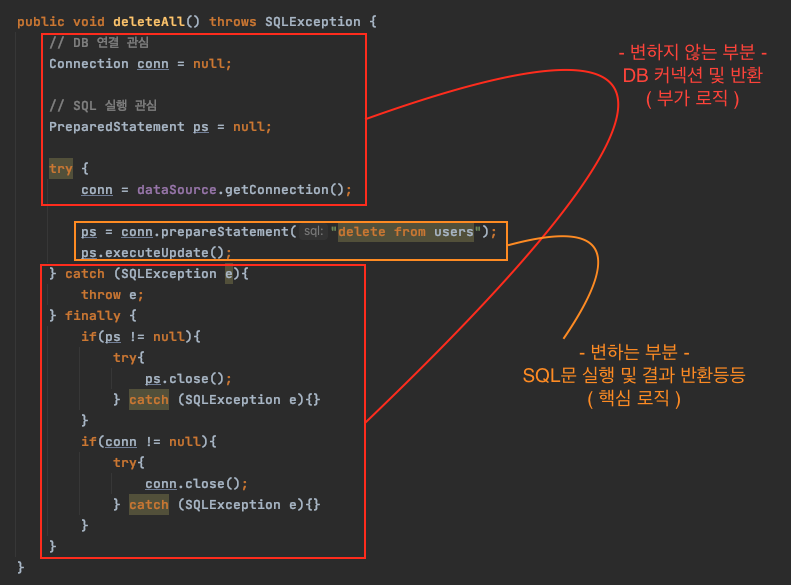</p>

<br>

#### 메서드 추출

<p align="center">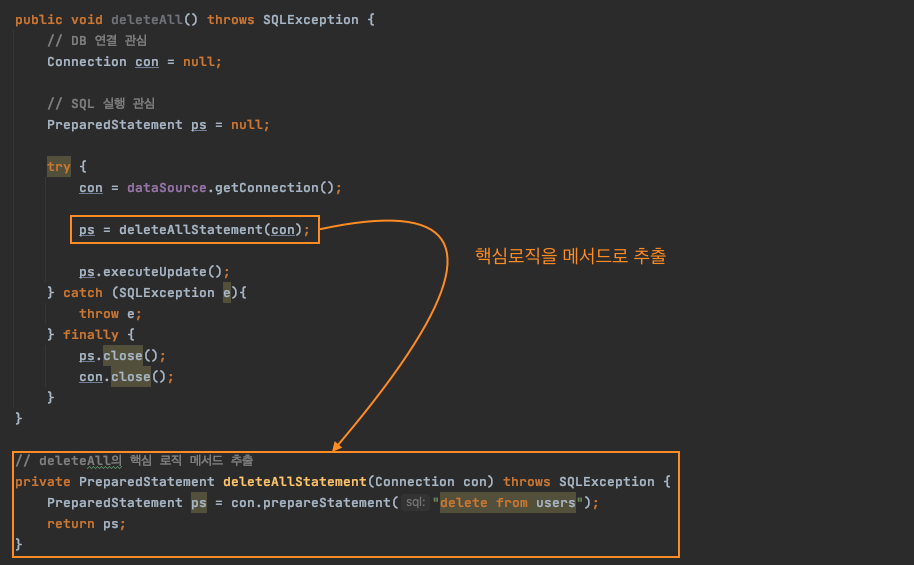</p>

:scream: 문제점

* **부가로직을 분리하여 핵심로직만 작성하면 실행이 되게 하는게 좋은 코드이지만 메서드 추출은 핵심로직을 분리시켰으므로 반대로 되어버렸다.. 오히려 코드가 더 복잡해진다.**

:point_right: 코드

* [메서드 추출 코드](https://github.com/binghe819/toby-spring-code/blob/master/Ch03/src/main/java/com/binghe/user/MethodExtraction/MethodExtractionUserDao.java)

<br>

#### 템플릿 메서드 패턴

🤔 템플릿 메서드 패턴이란

<p align="center">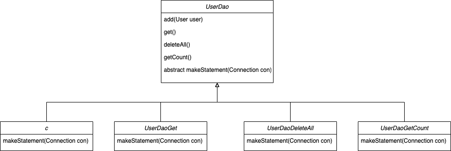

* **변하지 않는 부분은 슈퍼 클래스**에 두고 **변하는 부분은 추상 메서드**로 정의해둬서 **오버라이딩을 통해 구현**하는 방법

<p align="center">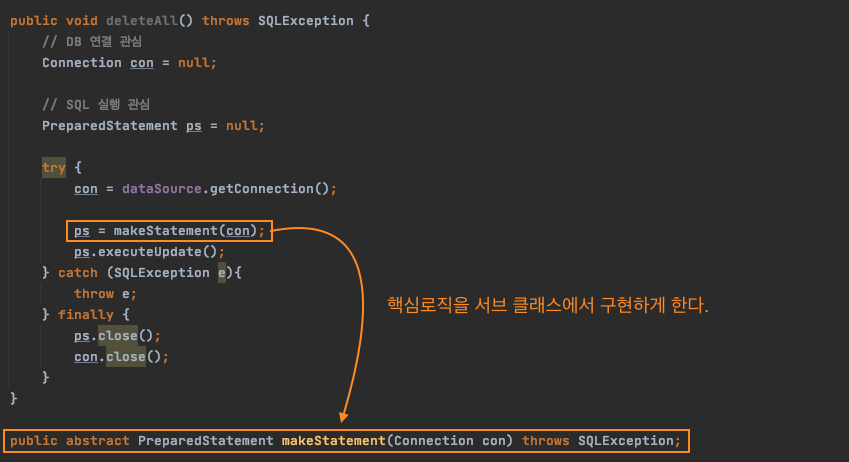</p>

```java
// 상위 클래스
public abstract class SuperUserDao {

    private DataSource dataSource;

    @Autowired
    public void setDataSource(DataSource dataSource) {
        this.dataSource = dataSource;
    }

    public void deleteAll() throws SQLException {
        // DB 연결 관심
        Connection con = null;

        // SQL 실행 관심
        PreparedStatement ps = null;

        try {
            con = dataSource.getConnection();

            ps = makeStatement(con); // 핵심 로직
            ps.executeUpdate();
        } catch (SQLException e){
            throw e;
        } finally {
            ps.close();
            con.close();
        }
    }

    public abstract PreparedStatement makeStatement(Connection con) throws SQLException;
}

// DeleteAll의 서브 클래스
public class UserDaoDeleteAll extends UserDao{
  protected PreparedStatement makeStatement(Connection c) throws SQLException {
    PreparedStatement ps = c.preparedStatement("delete from users");
    return ps;
  }
}
```

<br>

:scream: 문제점

*  **바로 DAO 로직마다 상속을 통해 새로운 클래스를 만들어야 한다는 것**
  * **`UserDao`의 JDBC메서드가 4개일 경우 개의 서브 클래스를 만들어서 사용해야 한다.**

* 또한, **컴파일 시점에 관계가 모두 정해지므로, 유연성이 떨어진다.**
  * `delete` 를 사용하기 위해 `UserDeleteAll` 을 선언하여 사용해야 한다.

<br>

:point_right: 코드

* [템플릿 메서드 코드 - 슈퍼 클래스](https://github.com/binghe819/toby-spring-code/blob/master/Ch03/src/main/java/com/binghe/user/TemplateMethod/SuperUserDao.java)
* [템플릿 메서드 코드 - 서브 클래스 (deleteAll)](https://github.com/binghe819/toby-spring-code/blob/master/Ch03/src/main/java/com/binghe/user/TemplateMethod/UserDaoDeleteAll.java)

<br>

#### 전략 패턴

🤔 전략 패턴

<p align="center">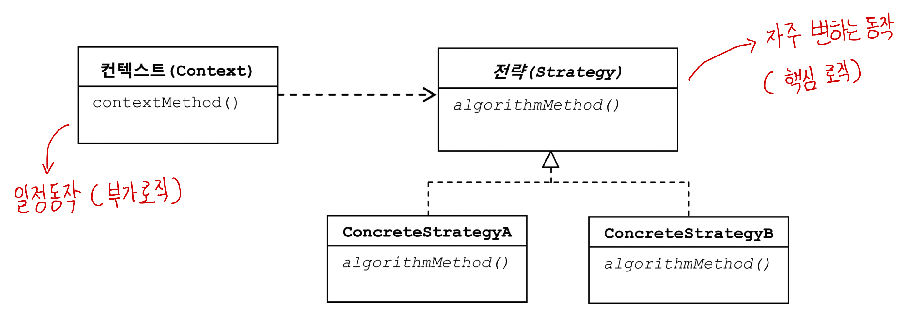</p>

* OCP와 DIP를 잘 지킨 패턴이라고 볼 수 있다.
* **`Context`의 `contextMethod()`에서 일정한 구조를 가지고 동작하다가 특정 확장 기능은 `Strategy` 인터페이스를 통해 외부의 독립된 전략 클래스에 위임하는 것.**
  * DB 커넥션과 반환은 `Context`, SQL문 실행등은 `Strategy`를 구현한 전략 클래스.

<br>

```java
// 전략 인터페이스 (Strategy) (핵심 로직)
public interface StatementStrategy {
    PreparedStatement makePreparedStatement(Connection connection) throws SQLException;
}
```

```java
// 전략 클래스 (deleteAll) (핵심 로직)
public class DeleteAllStrategy implements StatementStrategy{
    @Override
    public PreparedStatement makePreparedStatement(Connection conn) throws SQLException {
        PreparedStatement ps = conn.prepareStatement("delete from users");
        return ps;
    }
}
```

```java
// Context 클래스 (부가 로직)
public void deleteAll() throws SQLException {
  ...
    try {
      con = dataSource.getConnection();

      // 전략 생성및 사용 (컨텍스트가 직접 전략을 생성하여 사용한다.)
      StatementStrategy strategy = new DeleteAllStrategy();
      ps = strategy.makePreparedStatement(con);
      ps.executeUpdate();
    } ...
}
```

<br>

:scream: 문제점

* **전략을 컨텍스트 클래스에서 직접 생성하여 사용하며, 이미 구체적인 클래스인 `DeleteAllStrategy`를 사용하도록 고정되어 있으므로 느슨하지 않다.(유연하지 않다)**
* 컨텍스트가 직접 전략을 생성하여 사용한다.

<br>

:point_right: 코드

* [컨텍스트 코드](https://github.com/binghe819/toby-spring-code/blob/master/Ch03/src/main/java/com/binghe/user/Strategy/ContextUserDao.java)
* [전략 구현 코드](https://github.com/binghe819/toby-spring-code/blob/master/Ch03/src/main/java/com/binghe/user/Strategy/DeleteAllStrategy.java)

<br>

#### DI를 통한 클라이언트/컨텍스트 분리

🤔 진짜 전략 패턴

* **컨텍스트가 어떤 전략을 사용할지 결정하는 것은 컨텍스트를 사용하는 앞단의 클라이언트다.**

<p align="center"></p>

* 클라이언트 책임을 담당할 메서드를 하나 만들어 구현하면 된다.
  * 즉, **수동적으로 DI를 구현한 것. (마이크로 DI)**

```java
// 컨텍스트
public class DIContextUserDao {

    private DataSource dataSource;

    public DIContextUserDao(DataSource dataSource) {
        this.dataSource = dataSource;
    }

    // 클라이언트 역할 (Service가 호출하는 메서드)
    public void deleteAll() throws SQLException {
        StatementStrategy st = new DeleteAllStrategy(); // 전략 생성
        jdbcContextWithStatementStrategy(st); // 전략 주입 및 컨텍스트 실행
    }

    // jdbc 컨텍스트 (부가기능)
    public void jdbcContextWithStatementStrategy(StatementStrategy stmt) throws SQLException {
        // DB 연결 관심
        Connection conn = null;
        // SQL 실행 관심
        PreparedStatement ps = null;

        try {
            conn = dataSource.getConnection();

            ps = stmt.makePreparedStatement(conn);

            ps.executeUpdate();
        } catch (SQLException e){
            throw e;
        } finally {
            ps.close(); // SQLException으로 감싸줘야하는데 여기선 무시한다.
            conn.close();
        }
    }
}
```

:point_right: 코드

* [DI를 통한 전략 패턴](https://github.com/binghe819/toby-spring-code/blob/master/Ch03/src/main/java/com/binghe/user/DIStrategy/DIContextUserDao.java)

> 핵심로직만을 구현하면 되도록 핵심로직과 부가로직을 나눴지만 여전히 부족해보인다.

<br>

## 3 JDBC 전략 패턴의 최적화

>  위에서 구현한 전략 패턴의 가장 큰 문제점은 핵심로직을 구현하는 클래스들을 모두 만들어줘야한다는 것이다.
>
>  * **클래스 파일이 많아지는 문제. (DAO의 메서드마다 클래스 파일을 만들어줘야 한다.)**

* 전략과 클라이언트를 익명 클래스를 통해 구현하면 이 문제를 해결할 수 있다. (**로컬 클래스**)

<br>

💁‍♂️ 익명 클래스로 JDBC 전략 패턴 구현

* **`UserDao`의 메서드가 클라이언트**이고, **익명 내부 클래스가 개별적인 전략**으로 볼 수 있다.
  * 클라이언트 = `UserDao` 메서드
  * 컨텍스트 = `jdbcContextWithStatementStrategy` 메서드
  * 전략 = 익명 내부 클래스

```java
public class JDBCStrategyUserDao {

    private DataSource dataSource;

    @Autowired
    public void setDataSource(DataSource dataSource) {
        this.dataSource = dataSource;
    }

  	// 컨텍스트
    public void jdbcContextWithStatementStrategy(StatementStrategy stmt) throws SQLException{
				... (커넥션)
        try {
            conn = dataSource.getConnection();

            ps = stmt.makePreparedStatement(conn);

            ps.executeUpdate();
        } 
      	... (커넥션 반환)
    }

  	// 전략과 컨텍스트 통합 (익명 내부 클래스 사용)
    public void add(User user) throws SQLException {
        jdbcContextWithStatementStrategy(new StatementStrategy() {
            @Override
            public PreparedStatement makePreparedStatement(Connection conn) throws SQLException {
                PreparedStatement ps = conn.prepareStatement("insert into users(id, name, password) values(?, ?, ?)");

                ps.setString(1, user.getId());
                ps.setString(2, user.getName());
                ps.setString(3, user.getPassword());

                return ps;
            }
        });
    }
}
```

:point_right: 코드

* [익명 클래스로 구현된 JDBC 전략 패턴 코드](https://github.com/binghe819/toby-spring-code/blob/master/Ch03/src/main/java/com/binghe/user/JDBCStrategy/JDBCStrategyUserDao.java)

<br>

## 4 컨텍스트와 DI

> 전략 패턴의 구조로 보면 `UserDao` 의 메서드가 **클라이언트**이고, 익명 내부 클래스로 만들어지는 것이 **전략**, `jdbcContextWithStatementStrategy()` 메서드는 **컨텍스트**이다.
>
> 지금까지 구현한 내용을 종합해보면 `Dao` 마다 컨텍스트를 매번 정의해줘야 한다. 즉, `jdbcContext...`를 매번 정의해주어야 한다.

<br>

🤔 모든 `DAO`가 사용할 수 있게 컨텍스트 (`jdbcContextWith...`)를 분리하는 방법은?

* 클래스 분리 + DI
* 클래스 분리 + 수동 DI

> `jdbcContextWith...` 를 분리한 클래스이름을 `JdbcContext`로 하고있다.

<br>

### 4-1 클래스 분리 + DI

💁‍♂️ 컨텍스트 클래스 분리 + 스프링 DI

* 모든 `DAO` 에서 사용할 수 있게 컨텍스트(`jdbcContext`)를 분리하고, 스프링 DI를 통해 의존성을 주입받는 예시

`컨텍스트 (jdbcContext)`

```java
public class JdbcContext {

    private DataSource dataSource;

    @Autowired
    public void setDataSource(DataSource dataSource) {
        this.dataSource = dataSource;
    }

    public void workWithStatementStrategy(StatementStrategy stmt) throws SQLException {
      	... (커넥션)

        try {
            conn = dataSource.getConnection();

          	// 핵심 로직을 주입 받아서 실행
            ps = stmt.makePreparedStatement(conn);

            ps.executeUpdate();
        } 

      	... (커넥션 반납)
    }
}
```

<br>

`클라이언트 (UserDao)`

* **`템플릿/콜백` 패턴을 적용한 코드.**

```java
public class UserDao {
		
  	// 컨텍스트를 스프링 DI를 통해 의존성 주입받는다.
    private JdbcContext jdbcContext;

    @Autowired
    public void setJdbcContext(JdbcContext jdbcContext) {
        this.jdbcContext = jdbcContext;
    }

    public void add(User user) throws SQLException {
        this.jdbcContext.workWithStatementStrategy(new StatementStrategy() {
            @Override
            public PreparedStatement makePreparedStatement(Connection conn) throws SQLException {
                // add 핵심 로직 구현
              	...
            }
        });
    }

    public void deleteAll() throws SQLException {
        this.jdbcContext.workWithStatementStrategy(new StatementStrategy() {
            @Override
            public PreparedStatement makePreparedStatement(Connection conn) throws SQLException {
             		// deleteAll 핵심 로직 구현
                return conn.prepareStatement("delete from users");
            }
        });
    }
}
```

<br>

`스프링 자바 설정`

```java
@Configuration
public class Config {
    @Bean
    public JdbcContext jdbcContext(){
        return new JdbcContext();
    }
    @Bean
    public DataSource dataSource() {
        .. h2 드라이버 연결
    }
    @Bean
    public UserDao userDao() {
        return new UserDao();
    }
}
```

* 의존 관계를 가진 세 개의 클래스를 모두 빈으로 설정하였다.
* 이유
  * **스프링 DI를 위해서는 모두 스프링 빈이어야 한다.**
  * 싱글톤 방식의 효율성

<br>

💁‍♂️ 의존 관계 변경

* 기존

<p align="center">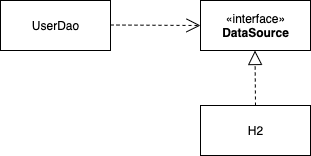

* 클래스 분리후
<p align="center">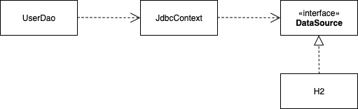

스프링 DI의 기본적인 원칙은 사이에 인터페이스를 두는 것이다. 하지만 `UserDao` 와`JdbcContext` 는 구체 클래스이다.

🤔 왜 인터페이스를 사용하지 않은 것 일까?

* 우선 `JdbcContext` 는 변경 가능성이 없다. 즉 `UserDao` 와 `JdbcContext` 는 강한 응집도를 가지고 있다.
* 강한 응집도를 가진 경우 굳이 인터페이스를 둘 필요가 없다.

<br>

> 🤔 인터페이스를 사용하지 않고 구체 클래스를 쓴거면 DI의 기본 원칙을 위반한거 아닌가?
>
> * DI의 기본 원칙
>   * DI의 기본 원칙에 따르면 **인터페이스를 사이에 둬서 클래스 레벨에서 의존 관계를 드러내지 않고**, **런타임 시에 다이나믹 프록시를 통해 의존성을 주입해주는게 맞다.**
> * 스프링의 DI 
>   * 스프링의 DI는 객체의 제어권한을 외부에 위임했다는 **IoC 개념을 포괄한다.**
> * 즉, `JdbcContext` 와 `UserDao` 는 DI원칙을 위배한 것이 아니다.

<br>

> 일반적으로 인터페이스를 중간에 두고 하는 것이 좋다. 그냥 이런 방식도 있다는 것을 알고 최후에 사용하면 좋을것이다.

<br>

:point_right: 코드

* [클라이언트 (UserDao)](https://github.com/binghe819/toby-spring-code/blob/master/Ch03/src/main/java/com/binghe/user/JDBCContextWithDI/UserDao.java)
* [컨텍스트 (JdbcContext)](https://github.com/binghe819/toby-spring-code/blob/master/Ch03/src/main/java/com/binghe/user/JDBCContextWithDI/JdbcContext.java)
* [빈 설정 파일](https://github.com/binghe819/toby-spring-code/blob/master/Ch03/src/main/java/com/binghe/user/JDBCContextWithDI/Config.java)

<br>

### 4-2 클래스 분리 + 수동 DI

<br>

🤔 수동 DI

* 외부에서 의존성을 주입받지 않고, 자기 자신이 필요한 의존성을 `new`하여 생성하는 것.

<br>

💁‍♂️ 컨텍스트 클래스 분리 + 수동 DI

**스프링 DI를 사용하여 의존성을 자동으로 주입받고 싱글톤으로 만드는 것을 포기하고 `DAO` 마다 `JdbcContext` 를 직접 `new` 로 생성하는 것을 의미한다.**

```java
public class UserDao {
  private JdbcContex jdbcContext;
  
  public void setDataSource(DataSource dataSource){
    this.jdbcContext = new JdbcContext();
    this.jdbcContext.setDataSource(dataSource);
  }
}
```

* `UserDao` 가 직접 `JdbcContext` 의 의존성을 생성한다.
  * 싱글톤 방식 없어짐

<br>

### 4-3 스프링 DI vs 수동 DI

* 스프링 DI
  * 장점 : 객체의 의존관계가 설정파일에 명확하게 드러난다.
  * 단점 : DI의 근본적인 원칙(인터페이스 두는 것)에 부합하지 않아 구체적인 클래스와의 관계가 노출된다.
* 수동 DI
  * 장점 : 관계가 외부에 드러나지 않는다. DI 전략을 외부에는 감출 수 있다.
  * 단점 : 싱글톤으로 만들 수 없고, DI 작업을 위한 추가적인 코드가 필요하다.

<br>

## 5 템플릿/콜백

> 위에서 `UserDao` 를 구현할 때 메서드의 매개변수를 통해 전략 인터페이스(`StatementStrategy`)를 구현한 핵심 로직을 수행하였다. 
> 
> 이는 `템플릿/콜백` 패턴을 사용한 것이며, 이에 대해서 더 자세히 다뤄보자.

<br>

🤔 우리의 목표

* **로직의 분리와 재활용**
* 변하는 것 (핵심 로직)과 변하지 않는 것 (부가 로직)을 분리하고 변하지 않는 것은 **유연하게 재활용할 수 있게 만드는 것.**
  * 변하는 것 (핵심 로직) : SQL 쿼리
  * 변하지 않는 것 (부가 로직) : 커넥션, 반환

<br>

### 5-1 템플릿/콜백의 동작원리

* **콜백**은 보통 **단일 메서드 인터페이스**를 사용한다. 템플릿의 작업 흐름 중 특징 기능을 위해 **한 번 호출되는 경우가 일반적**이기 때문이다.
* **콜백 인터페이스의 메서드**에는 보통 **파라미터가 있다**. 이 파라미터는 템플릿의 작업 흐름 중에 만들어지는 **컨텍스트 정보를 전달 받을 때 사용한다.**

<p align="center">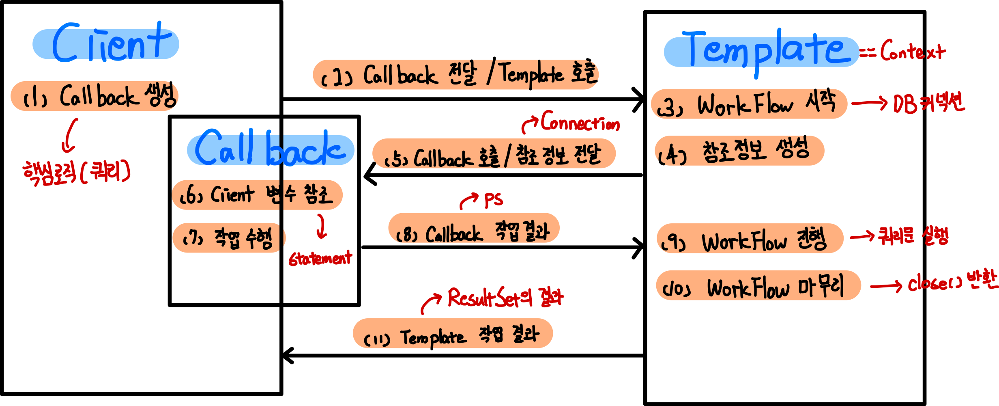

* 클라이언트 : 콜백 객체 (전략 인터페이스 구현 클래스)를 생성하고 컨텍스트를 호출하면서 콜백 객체를 매개변수로 넘긴다. (DAO)
* 템플릿 : 부가 로직 (DB 커넥션 및 반환)을 진행하다가 넘겨 받은 콜백 객체의 메서드를 호출하고, 쿼리의 결과를 반환

> 복잡해보이지만, **DI 방식의 전략 패턴 구조**이다.
>
> 클라이언트가 템플릿 메서드를 호출하면서 콜백 객체를 전달하는 것은 **메서드 레벨에서 일어나는 DI**라고 한다..

<br>

### 5-2 콜백의 재활용

> 템플릿/콜백 패턴은 많은 장점이 있지만, 여전히 `DAO` 메서드에서 **매번 익명 내부 클래스를 사용하기 때문에 상대적으로 코드를 작성하고 읽기가 불편하다.** 게다가 비슷한 핵심 로직끼리는**중복이 발생한다.**

<br>

#### 콜백 객체 재활용

🤔 중복이 발생하는 부분 (**분리 전**)

<p align="center">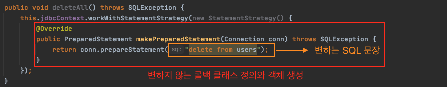</p>

😎 중복을 분리 (**분리 후**)

<p align="center">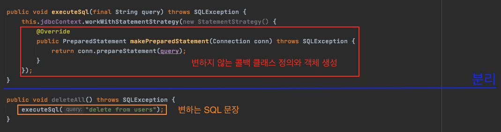

* 이렇게 해서 재활용 가능한 콜백을 담는 메서드를 만들 수 있다.
* **주의**
  * **DB는 조회, 생성, 수정, 삭제 등등의 기능을 수행하고 난 결과가 모두 다르기 때문에 각각의 맞게 구현해줘야한다.**
  * 위 예시는 삭제 기능을 하는 예시이며, 매개변수로 어떠한 값도 넘겨줄 필요없이 SQL문만 실행하면 될 때 재활용할 수 있다.

<br>

#### 콜백과 템플릿의 결합 - 중요

💁‍♂️ 콜백의 재활용 메서드(`executeSql()`)를 템플릿으로 옮긴다.

<p align="center">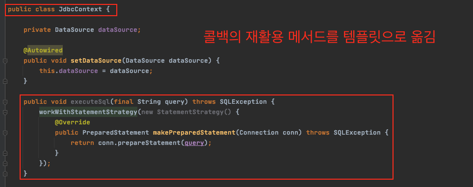

<p align="center">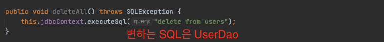


<br>

<br>

:point_right: **컨텍스트 전체 코드 (JDBCTemplate과 유사)**

```java
public class JdbcContext {

    private DataSource dataSource;

    @Autowired
    public void setDataSource(DataSource dataSource) {
        this.dataSource = dataSource;
    }

    // 콜백 객체
    public void executeSql(final String query) throws SQLException {
        workWithStatementStrategy(new StatementStrategy() {
            @Override
            public PreparedStatement makePreparedStatement(Connection conn) throws SQLException {
                return conn.prepareStatement(query);
            }
        });
    }

    public void workWithStatementStrategy(StatementStrategy stmt) throws SQLException {
        Connection conn = null;
        PreparedStatement ps = null;

        try {
            conn = dataSource.getConnection();

            ps = stmt.makePreparedStatement(conn);

            ps.executeUpdate();
        } catch (SQLException e){
            throw e;
        } finally {
            if(ps != null){
                try{
                    ps.close();
                } catch (SQLException e){}
            }
            if(conn != null){
                try{
                    conn.close();
                } catch (SQLException e){}
            }
        }
    }
}
```

* 콜백의 객체를 템플릿이 생성한다. 
  * 핵심중의 핵심은 SQL 쿼리는 여전히 Client (`UserDao`)가 메시지를 통해 전달한다.

<br>

:point_right: 코드

* [클라이언트 (UserDao)](https://github.com/binghe819/toby-spring-code/blob/master/Ch03/src/main/java/com/binghe/user/TemplateCallback/UserDao.java)
* [컨텍스트 (JdbcContext)](https://github.com/binghe819/toby-spring-code/blob/master/Ch03/src/main/java/com/binghe/user/TemplateCallback/JdbcContext.java)

<br>

> **모든 DB 작업 (CRUD)를 이런 방식으로 구현이 가능하다.**
>
> * `add` 같은 경우, 넘겨야하는 데이터를 가변인자를 통해 순서대로 넘겨서 쿼리 작업을 해주면된다.
> * **`try .. catch ... finally`의 중복이 발생한다면 템플릿/콜백 패턴을 고려해보자.**

> **스프링에서는 템플릿/콜백 패턴을 많이 사용한다고 한다. 실제 코드에서도 많이 발견된다. 꼭꼭! 많이 연습하자.**

<br>

### 5-3 템플릿/콜백의 응용 - 중요

> 고정된 작업 흐름을 가지는데 반복되는 코드가 있다면, **중복되는 코드를 분리할 방법을 생각하는 습관을 길러야 한다.**
>
> * 중복된 코드는 먼저 메서드로 분리하는 간단한 시도를 해본다.
> * 그중 일부 작업을 필요헤 따라 인터페이스를 사이에 두고 분리해서 전략 패턴을 적용하고 DI로 의존관계를 관리하도록 한다.
> * 그런데 바뀌는 부분이 한 애플리케이션 안에서 동시에 여러 종류가 만들어질 수 있다면 템플릿/콜백을 고려해보자.
> * 여러 타입을 지원하는 콜백과 템플릿을 만들고자 한다면 제네릭스를 이용한 콜백을 고려해보자.

<br>

💁‍♂️ 전형적인 템플릿/콜백 패턴의 후보는 `try..catch..finalyy` 가 중복으로 발생하는 코드이다.

* 스프링에서 제공하는 `jdbc` 코드에도 템플릿/콜백이 사용된다고 한다.

<br>

💁‍♂️ **템플릿/콜백을 적용할 때는 템플릿과 콜백의 경계를 정하고 템플릿이 콜백에게, 콜백이 템플릿에게 각각 전달하는 내용이 무엇인지 파악하는게 가장 중요하다. 그에 따라 콜백의 인터페이스를 정의해야 하기 때문이다.**

> 클래스 이름이 `Template` 으로 끝나거나 인터페이스 이름이 `Callback` 으로 끝난다면 템플릿/콜백 패턴이 적용된 것이라고 보면 된다.

<br>

## 6 JdbcTemplate

<br>

🤔 `JdbcTemplate` == `JdbcContext`

* 스프링이 `DAO` 에서 사용할 수 있도록 준비된 다양한 템플릿과 콜백.
* 거의 모든 종류의 JDBC 코드에 사용 가능한 템플릿/콜백을 제공하며, 자주 사용되는 패턴은 콜백 객체를 재활용하여 간단한 SQL문만으로도 사용가능하도록 되어있다.

<br>

🤔 설정 방법은?

```java
public class UserDao {
    private JdbcTemplate jdbcTemplate;
    private DataSource dataSource;

    public void setDataSource(DataSource dataSource){
     		// 수동 DI
        jdbcTemplate = new JdbcTemplate(dataSource);
      
        this.dataSource = dataSource;
    }
    
}
```

* 간단한다. 스프링 DI를 통해 `DataSource` 를 주입받는 `Setter` 나 생성자에 수동적으로 `new` 를 통해 의존성을 생성해주면 된다.

<br>

### 6-1 update()

* Issue a single SQL update operation **(such as an insert, update or delete statement).**

<br>

💁‍♂️ `JDBCTemplate`가 제공하는 `update()`를 이용하여 `deleteAll()`을 구현해보자.

```java
public void deleteAll() {
    this.jdbcTemplate.update(new PreparedStatementCreator() {
        @Override
        public PreparedStatement createPreparedStatement(Connection connection) throws SQLException {
            return connection.prepareStatement("delete from users");
        }
    });

    // 전에 만들었던 executeSql처럼 SQL만으로 동작하도록 JDBCTemplate에서 제공한다.
    // this.jdbcTemplate.update("delete from users");
}
```

* [5 템플릿/콜백](#5-템플릿콜백) 에서 구현했던 구조와 동일하다.
  * `makePreparedStatement()`가 `createPreparedStatement()`로 바뀐 것뿐이다.
* `JDBCTemplate`도 콜백 객체를 재활용할 수 있게 SQL문만으로 쿼리를 할 수 있다.
  * `jdbcTemplate.update(String sql)`

<br>

💁‍♂️ 동일하게 `ResultSet` 이 필요 없는 `add()` 도 구현해보자.

```java
public void add(User user) {
  this.jdbcTemplate.update("insert into users(id, name, password) values(?, ?, ?)", 																	user.getId(), user.getName(), user.getPassword());
}
```

* `ps.setString()` 해줘야 하는 작업을 `JDBCTemplate`가 가변 인자로 받아들여 대신 바인딩해준다.
  * 바인딩할 파라미터는 순서대로 넣어주면 된다.

<br>

### 6-2 query()와 queryForObject()

> 책에서는 `queryForInt()`의 대한 설명이 나오지만, 현재는 `deprecated` 되었다.
>
> 일반적인 query에 대해 알아보자

<p align="center">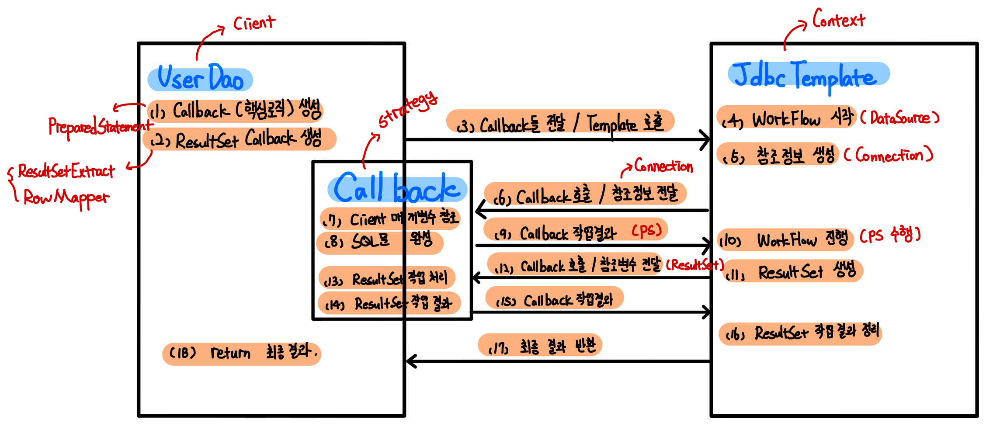 </p>

<br>

#### query()

🤔 `query()`

* Execute a query given static SQL, **reading the ResultSet with a ResultSetExtractor or RowMapper.**
  * `query()`는 매우 많은 오버로딩이 존재하는데, `Statement`를 사용하는 것도 있고 `preparedStatement`를 사용하는 것도 있다.
  * 또한, SQL에 바인딩할 매개변수도 `Object` 배열을 통해 가능하다.
  * 또한, `ResultSet`은 `ResultSetExtractor`와 `RowMapper`를 통해 반환할 수 있다.

```java
// getCount
public int getCount() {
    return this.jdbcTemplate.query(new PreparedStatementCreator() {
        @Override
        public PreparedStatement createPreparedStatement(Connection connection) throws SQLException {
            return connection.prepareStatement("select count(*) from users");
        }
    }, new ResultSetExtractor<Integer>(){
        @Override
        public Integer extractData(ResultSet resultSet) throws SQLException, DataAccessException {
            resultSet.next();
            return resultSet.getInt(1);
        }
    });
}
```

* 두 개의 인자를 넘긴다.
  * `PreparedStatementCreator()` : 콜백 객체 (핵심 로직)
  * `ResultSetExtractor<>` : 핵심 로직을 실행한 후의 결과를 받아오는 콜백 (**제네릭스를 사용한다.**)

<br>

💁‍♂️ `queryForObject()`를 사용해서 간단히도 구현 가능하다.

```java
queryForObject(String sql, Class<T> requiredType)
```

```java
public int getCount() {
  return this.jdbcTemplate.queryForObject("select count(*) from users", Integer.class);
}
```

* `RowMapper`를 사용.

<br>

#### query() with RowMapper

💁‍♂️ `query()`를 통해 여러 로우를 참조하여 결과값을 가져와야하는 경우 `RowMapper`를 사용한다.

DB의 모든 회원 정보를 가져오는 `getAll()`을 구현해보자.

```java
public List<User> getAll(){
  return this.jdbcTemplate.query("select * from users order by id",
        new RowMapper<User>() {
            @Override
            public User mapRow(ResultSet resultSet, int i) throws SQLException {
                User user = new User();
                user.setId(resultSet.getString("id"));
                user.setName(resultSet.getString("name"));
                user.setPassword(resultSet.getString("password"));
                return user;
            }
        });
}
```

* `query`도 오버로딩 된 메서드가 많으며, 여기선 `List<T>`를 반환하는 메서드를 사용한다.
* **`query`는 `ResultSet`의 모든 로우를 열람하면서 로우마다 `RowMapper` 콜백을 호출한다.**
  * 즉, 쿼리의 결과만큼 `RowMapper`를 실행한다.
  * `RowMapper`는 현재 로우의 내용을 `<T>`의 타입으로 리턴한다.
  * 모든 로우에 대한 작업을 마치면 모든 로우에 대한 `<T>` 객체를 담고 있는 `List<T>`를 반환한다.

<br>

> **`query()`는 `queryForObject()`와 다르게 예외를 던지지 않는다. 대신 크기가 0인 리스트를 반환한다.**

<br>

#### queryForObject()

> **쿼리의 결과가 로우 하나일 때 사용한다. 여러 개일 경우 `query`**

💁‍♂️ `queryForObject()`는 `RowMapper` 콜백을 사용한다.

* `ResultSetExtract` : `ResultSet`을 한 번 전달받아 알아서 추출 작업을 모두 진행하고 최종 결과만 리턴.
* `RowMapper` : `ResultSet`의 로우 하나를 매핑하기 위해 사용되기 때문에 여러번 호출할 수 있다.
  * This method should not call `next()` on the ResultSet; it is only supposed to map values of the current row.

```java
public User get(String id) {
    return this.jdbcTemplate.queryForObject("select * from users where id = ? ", 
      new Object[]{id},  // SQL문에 바인딩 할 파라미터 값. 가변인자 대신 배열을 사용한다.
      new RowMapper<User>() { // ResultSet 한 로우의 결과를 객체에 매핑해주는 RowMapper 콜백
        @Override
        public User mapRow(ResultSet resultSet, int i) throws SQLException {
            User user = new User();
            user.setId(resultSet.getString("id"));
            user.setName(resultSet.getString("name"));
            user.setPassword(resultSet.getString("password"));
            return user;
        }
    });
}
```

* 왜 가변인자를 사용하지 않고 배열을 사용하는가?
  * 삽입, 수정, 삭제는 `ResultSet`이 필요없다. 하지만 `ResultSet`이 필요한 경우 뒤에 다른 파라미터가 있기 때문에 이 경우엔 가변인자가 아닌 `Object`타입을 사용한다

> `RowMapper`는 로우의 개수가 0이면 `EmptyResultDataAccessException`을 던진다. (데이터가 없다는 뜻)

<br>

:point_right: 예시

* [JdbcTemplate UserDao](https://github.com/binghe819/toby-spring-code/blob/master/Ch03/src/main/java/com/binghe/user/JdbcTemplate/UserDao.java)

<br>

### 6-3 재사용 가능한 콜백의 분리

> 이미 어느정도 중복을 많이 제거 했지만, 여전히 중복을 제거하는 방법이 남아있다.

* 중복 `RowMapper` 분리
  * `RowMapper` 를 구현한 익명 클래스를 하나 만들어 공유.
  * 스프링 빈으로 분리 (스프링 설정에 등록하여 의존성을 자동적으로 주입)
  * 모든 SQL문을 외부 리소스로 분리

<br>

#### 중복 제거

💁‍♂️ 제일 간단한 `RowMapper` 를 익명 클래스 변수로 분리

```java
public class UserDao {

    private JdbcTemplate jdbcTemplate;

    @Autowired
    public void setDataSource(DataSource dataSource) {
        jdbcTemplate = new JdbcTemplate(dataSource);
    }

  	// RowMapper 독립
    private RowMapper<User> userRowMapper = new RowMapper<User>() {
        @Override
        public User mapRow(ResultSet resultSet, int i) throws SQLException {
            User user = new User();
            user.setId(resultSet.getString("id"));
            user.setName(resultSet.getString("name"));
            user.setPassword(resultSet.getString("password"));
            return user;
        }
    };
    ...
}
```

[중복 제거 JdbcTemplate 코드](https://github.com/binghe819/toby-spring-code/blob/master/Ch03/src/main/java/com/binghe/user/FinalJdbcTemplate/UserDao.java)

<br>

# 용어 정리

<br>

## 리소스 반환과 close()

* `close()`의 의미
  * 리소스를 반환한다는 의미
* 커넥션 풀
  * `Connection`과 `PreparedStatement`는 보통 풀(pool) 방식으로 운영된다.
  * 미리 정해진 풀 안에 제한된 수의 리소스를 만들어두고 필요할 때 이를 할당하고, 반환하면 다시 풀에 넣는 방식이다.
  * 요청이 매우 많은 경우 객체 생성 비용을 최대한 줄이는 풀(pool) 방식이 훨씬 효율적이다.
* 주의할 점
  * 만약 커넥션을 다 사용하고 `close()`(반환)하지 않으면 리소스가 고갈되고 결국 문제가 발생한다.

<br>

## 템플릿

* 템플릿은 어떤 목적을 위해 미리 만들어둔 모양이 있는 틀을 가리킨다.
* 프로그래밍에서는 고정된 틀 안에 바꿀 수 있는 부분을 넣어서 사용하는 경우에 템플릿이라고 부른다.
* 대표적인 예시
  * 템플릿 메서드 패턴

<br>

## 콜백

* 콜백(callback)은 실행되는 것을 목적으로 다른 객체의 메서드에 전달되는 객체를 말한다.
* 자바에서는 메서드 자체를 파라미터로 전달할 방법이 없기 때문에 메서드가 담긴 객체를 전달해야 한다. (함수형 객체, 익명 객체)

