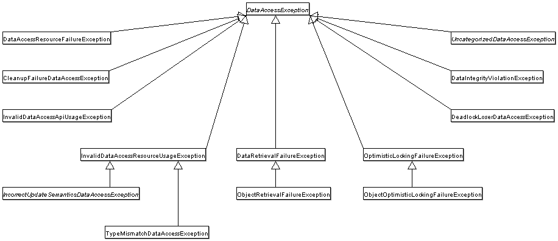

[토비의 스프링](http://www.yes24.com/Product/Goods/76074405?OzSrank=2)을 바탕으로 작성한 자료입니다.

<br>

# 목차

- [목차](#목차)
- [4장 예외](#4장-예외)
  - [1 사라진 SQLException](#1-사라진-sqlexception)
    - [1-1 초난감 예외처리](#1-1-초난감-예외처리)
    - [1-2 예외처리 방법](#1-2-예외처리-방법)
      - [예외 복구](#예외-복구)
      - [예외처리 회피](#예외처리-회피)
      - [예외 전환](#예외-전환)
    - [1-3 SQLException은 어떻게 처리?](#1-3-sqlexception은-어떻게-처리)
      - [SQLException은 어디 간 것일까?](#sqlexception은-어디-간-것일까)
  - [2 JdbcTemplate의 예외 전환](#2-jdbctemplate의-예외-전환)
    - [2-1 JDBC의 한계](#2-1-jdbc의-한계)
      - [비표준 SQL](#비표준-sql)
      - [호환성 없는 SQLException](#호환성-없는-sqlexception)
    - [2-2 DB 에러 코드 매핑을 통한 전환](#2-2-db-에러-코드-매핑을-통한-전환)
    - [2-3 DAO 인터페이스와 DataAccessException 계층구조](#2-3-dao-인터페이스와-dataaccessexception-계층구조)
    - [2-4 `DataAccessException` 활용 시 주의 사항](#2-4-dataaccessexception-활용-시-주의-사항)
  - [3 예외처리 전략](#3-예외처리-전략)
    - [3-1 Checked 예외](#3-1-checked-예외)
    - [3-2 Unchecked 예외](#3-2-unchecked-예외)

<br>

# 4장 예외

**4장에서는 JdbcTemplate을 대표로 하는 스프링의 데이터 액세스 기능에 담겨 있는 예외 처리와 관련된 접근 방법에 대해 알아본다.**

또한, 예외를 처리하는 베스트 프랙티스도 살펴본다.

<br>

## 1 사라진 SQLException

<br>

### 1-1 초난감 예외처리
> JdbcTemplate이 어떻게 `SQLException`을 사라지게 했는지를 알아보기 전에 **초난감 예외처리의 대표 예시들을 살펴보자**.

🤷‍♂️ 예외처리에서 초난감인 코드를 살펴보자.

1. 예외 블랙홀

   ```java
   // 예외를 잡고 아무것도 안하는 것
   try {
     ...
   } catch (SQLException e){
     
   }
   
   // 로그 남기는 것
   try {
     ...
   } catch (SQLException e){
     System.out.println(e);
     e.printStackTrace();
   }
   ```

2. 무의미하고 무책임한 `throws`

   ```java
   public void methid1() throws Exception {
     method();
     ...
   }
   ```

* 예외를 잡아놓고 아무것도 안하는 건 매우 위험하다. 또한 무차별적으로 모든 예외를 메서드 밖으로 던지는 것도 문제다.
* **예외는 항상 처리돼야 한다.**
  * **모든 예외는 적절하게 복구되든지 아니면 작업을 중단시키고 개발자에게 분명하게 통보돼야 한다.**
  * **예외를 무시하거나 잡아먹어 버리는 코드는 절대 만들지 말자.**

<br>

### 1-2 예외처리 방법

예외를 처리하는 일반적인 방법을 살펴보자

<br>

#### 예외 복구

🤔 예외 복구?
* 예외 상황을 파악하고 문제를 해결해서 정상 상태로 돌려놓는 것.
  * 예외로 인해 기본 작업 흐름이 불가능하면 다른 작업 흐름으로 유도해주는 것. (ex. 입력 값을 다시 받도록)
  * 즉, **예외 상황이 발생해도 애플리케이션이 정상적으로 설계된 흐름을 따라 진행되야한다.**

<br>

:point_right: 예시
* 사용자가 요청한 파일을 읽으려고 시도했는데, 파일이 해당 위치에 없다면 `IOException`을 발생시킨다. 이때 사용자에게 상황을 알려주고 다른 파일을 이용하도록 안내해서 예외상황을 해결할 수 있다.
* 또한, 원격 DB서버에 접속하다 실패해서 `SQLEception`이 발생하는 경우에 재시도 해볼 수 있다. 

<br>

#### 예외처리 회피

🤔 예외처리 회피
* 예외처리를 자신이 담당하지 않고 자신을 호출한 쪽으로 던져버리는 것.
  * `throws`문으로 선언해서 알아서 던지게 하거나
  * `catch`문으로 일단 예외를 잡은 후에 로그를 남기고 다시 예외를 던지는 것.

```java
public void add() throws SQLException {
  // ...
}

public void add() throws SQLException {
  try {
    ... 
  } catch (SQLException e) {
    // 로그 출력
    throw e;
  }
}
```

> **예외 처리 회피시, 최선이라는 확신이 있어야 한다.**
> * 예를 들어, 콜백/템플릿 패턴처럼 긴밀한 관계에 있는 경우엔 다른 객체에게 예외처리 책임을 분명히 지게 하거나, 자신을 사용하는 쪽에서 예외를 다루는게 최선의 방법이기 때문에 사용할 수 있다.
> * 하지만, 무작정 `throws`를 통해 예외 처리를 회피하는 것은 좋지 않다. 확신이 있을때에만 사용하자.

<br>

#### 예외 전환

🤔 예외 전환
* 예외 회피와 비슷하게 예외를 복구해서 정상적인 상태로는 만들 수 없기 때문에 예외를 메서드 밖으로 던지는 것이다.
* 단, **예외 회피와 달리, 발생한 예외를 그대로 넘기지 않고 적절한 예외로 전환해서 던진다.**
  * **전환하는 예외에 원래 발생한 예외를 담아서 중첩 예외로 만드는 것이 좋다.**
  * 중첩 예외는 `getCause()`메서드를 이용해서 처음 발생한 예외가 무엇인지 확인할 수 있다.

<br>

💁‍♂️ 예외 전환의 목적

1. 내부에서 발생한 예외를 그대로 전달하는 것이 그 예외 상황에 대한 적절한 의미를 부여해주지 못하는 경우에, **의미를 분명하게 해줄 수 있는 예외로 바꿔주기 위함.**
   * 사용자가 입력한 아이디가 중복된 것이라면 `SQLException`을 발생시키는데, 이를 `DuplicateUserIdException`으로 발생시켜 왜 예외가 발생했는지 명확하게 하기 위함.
     ```java
     public void add(User user) throws DuplicateUserIdException, SQLException{
       try{
         ...
       } catch(SQLException e){
         if(e.getMessage() == MysqlErrorNumbers.ER_DUP_ENTRY)
           throw DuplicateUserIdException(e); // 중첩 예외 설정
         else
           throw SQLException().initCause(e); // 중첩 예외 설정 
       }
     }
     ```

> 물론 `DAO`에서 `SQLException`을 던지고 서비스 계층에서 어떤 예외인지 분석하고 처리하게 할 순 있다. 
> 
> 하지만, 특정 기술의 정보를 해석하는 코드를 비즈니스 로직을 담은 서비스 계층에 두는 건 어색하다.

<br>

2. 예외를 처리하기 쉽고 단순하게 만들기 위해 **포장**하는 것.
   * 중첩 예외를 이용해 새로운 예외를 만들고 원인이 되는 예외를 내부에 담아서 던지는 방식
   * **Check 예외를 Uncheck 예외로 바꿔서 던진다.** 굳이 필요하지 않은 `catch/throws`를 줄여준다.
     * 어차피 `catch`문으로 예외를 복구할 수 없으면 그냥 UnCheck으로 해서 다른 계층에서 불필요한 `catch`를 없애준다.
     ```java
     // 아이디 중복 시에 사용하는 예외
     public class DuplicateUserIdException extends RuntimeException {
       public DuplicateUserIdException(Throwable cause){
         super(cause)
       }
     }
     
     public void add() throws DuplicateUserException{
       try {
         
       } catch (SQLException e){
         if(e.getErrorCode() == MysqlErrorNumbers.EP_DUP_ENTRY)
           throw new DuplicateUserIdException(e); // 예외 전환
         else
           throw new RuntimeException(e); // 예외 포장 (중복 예외 - 언체크로 변환)
       }
     }
     ```
   * **감싸고 있어도 만약 필요에 의해 `catch`를 해야된다면 `catch`를 코드에 작성해주면 된다.**

<br>

> 어차피 복구하지 못할 예외라면 애플리케이션 코드에서 런타임 예외로 포장해서 던져버리고, 관리자에게 알리는 것이 바람직하다.
>
> **애플리케이션 로직상에서 예외조건이 발견되거나 예외상황이 발생한다면, 체크 예외를 사용하는 것이 적절하다.** 비즈니스적인 의미가 있는 예외는 이에 대한 적절한 대응이나 복구 작업이 필요하기 때문이다. (중복 회원가입등)
>
> **실제 많은 오픈소스에서도 복구하지 못할 예외는 RuntimeException (언체크)로 감싸서 던지는 경우가 많다고 한다.**

<br>

### 1-3 SQLException은 어떻게 처리?

💁‍♂️ JdbcTemplate의 예외처리

```java
// JdbcTemplate 적용 전
public void deleteAll() throws SQLException {
  this.jdbcContext.executeSql("delete from users");
}

// JdbcTemplate 적용 후
public void deleteAll() {
  this.jdbcTemplate.update("delete from users");
}
```

* `JdbcTemplate`를 적용한 후에 `SQLException`이 없어진 것을 볼 수 있다.

<br>

#### SQLException은 어디 간 것일까?

* `SQLException`은 복구 가능한가?
  * 99%의 `SQLException`은 코드레벨에서 복구가 불가능하다. (DB 커넥션, SQL 문법, 제약 조건, 서버 다운 등등)
  * 따라서 가능한 빨리 예외 전환을 통해 체크 예외인 `SQLException`을 언체크 예외로 감싸는 것이 좋다.
* **스프링의 `JdbcTemplate`는 모든 `SQLException`을 런타임 예외인 `DataAccessException`으로 포장해서 던진다.**
  * 그러므로 예외처리를 할 필요가 없던 것.

<br>

## 2 JdbcTemplate의 예외 전환

🤔 **왜 스프링은 모든 예외를 `DataAccessException`으로 포장하고 있는 것일까?**

1. `SQLException`의 호환성 문제
   * DB마다 에러의 종류와 원인이 다르기에 스프링은 대부분 DB의 예외를 모두 `DataAccessException`에 담고 추상화 시켰다.
   * 즉, 각각의 DB 에러 코드를 모두 비슷한 것들끼리 매핑시켜놓았다.
2. 데이터 엑세스 기술 예외 호환성 문제
   * 데이터 액세스 기술(JDBC, JPA, 하이버네이트)마다 발생시키는 예외가 모두 다르다. 스프링은 `DataAccessException`을 통해 이러한 예외를 모두 통합시키고 추상화시켰다.
3. 체크 예외인 `SQLException`을 언체크 예외로 변경하기 위함.

> 다시 말해, DB와의 분리와 데이터 액세스 기술과의 분리를 위해 `DataAccessException`을 사용한다.

<br>

### 2-1 JDBC의 한계

JDBC는 개방 폐쇄 원칙을 통해 DB API를 잘 추상화했지만 여러 한계점들이 있다.
* **DB 종류에 상관없이 사용할 수 있는 데이터 액세스 코드(핵심로직)를 작성하는 일이 쉽지 않다.**
  * DB마다 SQL이나 예외의 대한 처리 방법이 모두 다르기 때문이다.
* **즉, JDBC에 데이터 액세스 코드(핵심로직)를 작성했다고 해서 DB를 마음대로 바꿀 수 없다.**
  * 호환성 문제가 발생한다.

<br>

#### 비표준 SQL
* DB마다 표준을 따르지 않는 비표준 문법과 기능이 제공된다.
* **JDBC에 데이터 액세스 코드(핵심로직)을 잘 작성했다해도 DB가 변경되면 DB에 따라서 핵심로직도 변화가 필요해진다.**
  * * 비표준 SQL은 결국 해당 DAO에 종속적인 코드가 되기 때문.

<br>

#### 호환성 없는 SQLException

* DB를 사용하다가 발생할 수 있는 예외는 다양하다.
  * SQL 문법, DB 커넥션, 존재하지 않는 필드, 키 중복, 데드락 등등 수백가지에 해당한다.
* **문제는 DB마다 에러의 종류와 원인이 모두 다르다는 것이다.**
  * MySQL을 사용해서 MySQL에 맞춰서 데이터 액세스 코드를 작성했는데, 만약 Oracle로 바꾸면 코드를 모두 변경해줘야 한다.
* **예외가 발생한 원인을 알려면 `SQLException` 안에 담긴 에러 코드와 SQL 상태정보를 참조해봐야한다.**
  * 하지만, 이러한 SQL 상태 정보가 정확하진 않다고 한다. 어떤 경우엔 제대로 안오기도 한다고 한다.

<br>

> **DB와 상관없이 JDBC의 예외는 `SQLException`밖에 없으며, `SQLException` 안에 에러 코드를 담는다.**
>
> * DB마다 에러코드가 다르므로, 각각 DB에 맞는 예외를 만드는 것이 비합리적이기 때문.
> * 즉, DB마다의 독립적인 에러 정보를 한 곳에 얻기 위함이다.

<br>

### 2-2 DB 에러 코드 매핑을 통한 전환
💁‍♂️ DB가 바뀌어도 `DAO`를 바꾸지 않으려면 JDBC의 한계를 극복해야한다.
* **스프링의 `JDBCTemplate`은 `DataAccessException`을 통해 이 문제를 해결했다.**
  * **정확히 말하면 DB별 에러 코드를 참고해서 발생한 예외의 원인이 무엇인지 해석해주는 기능이 필요했다.**
    * ex. MySQL (1062), Oracle (1), DB2 (-803) -> `DuplicateKeyException`

<br>

💁‍♂️ **DataAccessException**

<p align="center"><br>출처 : Spring docs </p>

* 스프링은 여러 **DB에서 공통적으로 발생하는 에러들을 모두 `DataAccessException`의 계층구조로 정의하였다.**
  * SQL 문법 에러 -> `BadSqlGrammarException`
  * DB 커넥션 에러 -> `DataAccessResourceFailureException`
  * 데이터의 제약 조건 위배 -> `DataIntegrityViolationException`
  * 중복 키 에러 -> `DuplicateKeyException`
  * 이 외에도 **여러 예외상황을 추상화해 다양한 예외 클래스로 제공한다.**
* **이게 가능한 이유는 각 DB마다 에러 코드 정보를 매핑하는 설정파일(XML)을 두기 때문이다.**

<br>

### 2-3 DAO 인터페이스와 DataAccessException 계층구조
🤔  **스프링이 `DataAccessException`를 `SQLException`을 전환하는 용도 외에도 사용하는 또 다른 이유가 있다.**
* **자바 데이터 액세스 기술에는 JDBC외에도 JPA, JDO등 다양한 기술이 존재한다.**
  * 하지만, 모든 데이터 액세스 기술이 던지는 예외가 모두 다르다.
  * 그러므로, 데이터 액세스 기술로부터 독립적인 추상회된 예외가 필요하다. 이 추상화된 예외가 바로 `DataAccessException`
* **만약 데이터 액세스 기술로부터 독립적인 추상화된 예외가 없다면, DAO는 각 데이터 액세스 기술별로 종속적인 구현이 탄생하게 되고, 구현을 다르게 해줘야한다. (중요)**
* `DAO` 를 데이터 액세스 기술에서 독립시키려면 인터페이스 도입과 런타임 예외 전환, 기술에 독립적인 추상화된 예외로 전환이 필요하다.
```java
// 만약 데이터 액세스 기술로부터 독립적인 추상화된 예외가 없다면 DAO는 해당 데이터 액세스 기술에 종속적인 코드가 되버린다.
// 만약 UserDao라는 인터페이스를 두고 여러 데이터 액세스 기술을 사용한다면 예외가 통일되지 않는다.
public void add(User user) throws SQLException; // JDBC API
public void add(User user) throws PersistentException; // JPA
public void add(User user) throws HibernateException; // Hibernate
```
* 만약 독립적인 추상화된 예외가 없다면, 위와 같이 `UserDao` 인터페이스의 메서드는 데이터 액세스 기술에 의존적인 코드를 작성해야 한다.
  * 즉, 데이터 엑세스 기술이 달라지면 같은 상황에서도 다른 종류의 예외가 던져진다는 문제가 있기에, 의존적일수밖에 없다.

<br>

💁‍♂️ **스프링은 자바의 다양한 엑세스 기술을 사용할 때 발생하는 예외들을 추상화해서 `DataAccessException` 계층 구조 안에 정리해놓았다.**
* 즉, `DataAccessException`은 단지 `JDBC`의 `SQLException`뿐 아니라, 다른 데이터 액세스 기술에서 발생하는 예외도 추상화하고 있다.
  * **JDBC의 `BadSqlGrammarException`, Hibernate의 `HibernateQueryException`...등 모두 `InvalidAccessResourceUsageException`이 던져진다.**
* **따라서 인터페이스 사용, 런타임 예외 전환과 함께 `DataAccessException`을 사용하면 데이터 엑세스 기술과 DAO의 구현은 독립적으로 구현할 수 있다.**
* `UserDao`의 인터페이스는 아래와 같이 선언하면 된다.
  ```java
  // UserDao 인터페이스
  public interface UserDao {
    void add(User user);
    User get(String id);
    List<User> getAll();
    ...
  }

  // 예외를 단일화 시켰기 때문에 하나의 인터페이스로 데이터 액세스 기술별로 구현체를 만들 수 있다.
  // 이제 의존성 주입을 통해 쉽게 데이터 액세스 기술을 변경할 수 있다.
  public class UserDaoJdbc implements UserDao {}
  public class UserDaoJpa implements UserDao {}
  public class UserDaoHibernate implements UserDao {}
  ```

<br>

### 2-4 `DataAccessException` 활용 시 주의 사항
> 각 기술별로 호환성을 100프로 장담할 수 없다.

* `DuplicateKeyException`은 아직까지 JDBC를 이용하는 경우에만 발생한다.
  * 하이버네이트나 JPA의 경우 다른 예외가 던져진다.
* 그 이유는 `SQLException`에 담긴 DB 에러 코드를 바로 해석하는 JDBC와 달리, JPA나 하이버네이트등은 각 기술이 재정의한 예외를 가져와 스프링이 최종적으로 `DataAccessException`으로 변환하는데, DB의 에러 코드와 달리 이런 예외들은 세분화되어 있지 않기 때문이라고한다.
  * ex. 하이버네이트에서 중복 키의 경우 `ConstraintViolationException`을 발생시킨다. 스프링은 이를 `DuplicateKeyException`의 상위 클래스인 `DataIntegrityViolationException`으로 변환시킨다.

> 
>
>  JPA나 하이버네이트에서는 각 기술이 재정의한 예외를 가져와 스프링의 최종적으로 `DataAccessException`으로 변환하기 때문이다.

<br>

## 3 예외처리 전략

<br>

### 3-1 Checked 예외
> 비관적인 예외처리 기법
* 자칫 잘못하면 한 메서드를 사용하는 모든 메서드가 무책임하게 `throw Exception`을 던지는 문제가 발생할 수 있다.
* OCP를 위반하게 될 수도 있다.
  * 특정 클래스에 의존하는 다른 클래스들로 예외 시그니처가 전달되고, 그로 인해 발생하는 결합도가 유지보수성에 악영향을 끼친다.
  * 즉, 모든 상위 메서드들이 최하위 메서드의 예외 시그니처를 알아야 하므로 캡슐화가 깨진다.
* 예외를 `throw`한 메서드와 depth가 3만 멀어져도 이 예외의 발생 근원지를 추측하기가 어려워진다.
  * 어디서 진짜 예외가 발생했는지 찾기가 힘들다는 것.
  * 결국 최상위까지 `throw`하게되는 문제가 발생할 수 있다.
* 하지만 `엘라강트 오브젝트`책에서는 각 클래스, 메서드의 시그니처는 아주 명확해야 한다고 말한다.
  * 각 책임과 역할이 드러나는 것을 중시하는 입장에선, 예외가능성을 드러내지 않는건 클라이언트를 속인다는 것!
  * 하지만 이것도 문서화로 충분히 커버가 가능하다.

<br>

### 3-2 Unchecked 예외
> 낙관적인 예외처리 기법
* 컴파일러가 예외처리를 강제하지 않으므로 신경 쓰지 않으면 예외상황을 충분히 고려하지 않을 수도 있다.
  * 하지만, API 문서나 레퍼런스 문서 등을 통해 충분히 방지할 수 있다.
