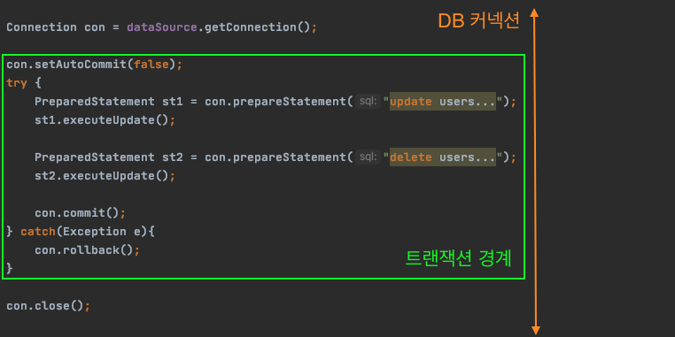
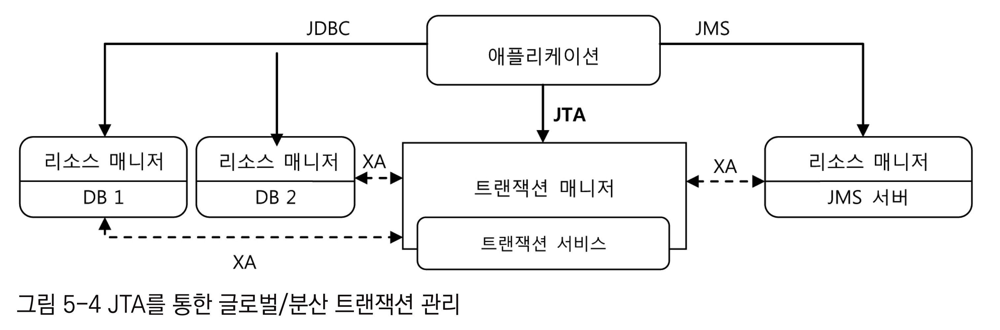
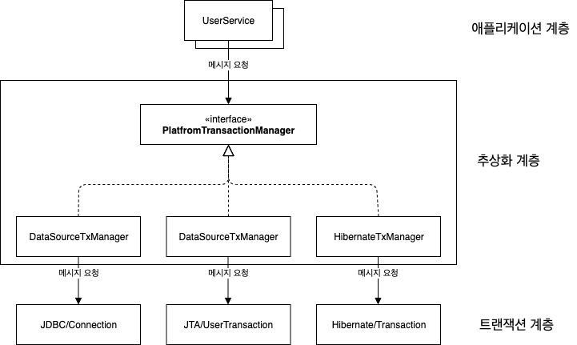

[토비의 스프링](http://www.yes24.com/Product/Goods/76074405?OzSrank=2)을 바탕으로 작성한 자료입니다.


# 목차


# 5장 서비스 추상화

💁‍♂️ 5장의 내용

5장에서는 `DAO` 에 트랜잭션을 적용해보면서 스프링이 어떻게 성격이 비슷한 여러 종류의 기술을 추상화하고 이를 일관된 방법으로 사용할 수 있도록 지원하는지를 살펴본다.


## 1 사용자 레벨 관리 기능 추가

🙋‍♂️ 지금까지 계속해서 `DAO` 로직만을 만들었다. 이제 비즈니스 로직을 만들어보자.

아래와 같은 기능을 가진 비즈니스 로직을 만들고자 한다.

* 사용자 레벨은 BASIC, SILVER, GOLD
  * 처음 가입하면 BASIC, 활동에 따라 레벨업
* 사용자 레벨의 변경 작업은 일정한 주기를 가지고 일괄적으로 진행된다.
  * 변경 작업 전에는 조건을 충족하더라도 레벨의 변경이 일어나지 않는다.


🙋‍♂️ **기능을 추가하는 작업은 아래와 같다.**

* 필드 추가
  * `Level` 필드 추가
  * `User` 필드 추가 (로그인 횟수, 추천수, 레벨)
  * `UserDao` 테스트 수정
  * `UserDaoJdbc` 수정
* 사용자 수정 기능 추가


### 1-1 필드 추가

#### Level 필드 추가

🙋‍♂️ 사용자마다 `Level` 이라는 필드를 추가해주자.

* DB에 문자열(`BASIC`)을 저장하는 것 보다는 정수인 1, 2, 3을 저장하는 것이 좋다.
  * DB에 저장할 때는 숫자로 변경해서 저장하고
  * DB에서 조회할 때는 `enum` 값으로 변경해서 사용하면 된다.

```java
public enum Lever {
  BASIC(1), SILVER(2), GOLD(3);
  
  private final int value;
  
  // DB에 저장할 값을 넣어줄 생성자를 만들어둔다.
  Level(int value){
    this.value = value;
  }
  
  // 값을 가져오는 메서드
  public int intValue(){
    return value;
  }
  
  // DB에서 숫자 값을 받아와서 값으로부터 Level타입 객체를 가져오도록 만든 스태틱 메서드.
  public static Level valueOf(int value){
    switch(value){
      case 1: return BASIC;
      case 2: return SILVER;
      case 3: return GOLD;
      default: throw new AssertionError("Unknown value: " + value);
    }
  }
}
```

🤔 `enum`을 사용한 이유는?

* 정수형 상수 값(`private static final int BASIC = 1`)을 사용하면 엉뚱한 값을 넣었을 때 컴파일러가 체크해주지 못한다. 
  * `user.setLevel(1000)` 을 해도 컴파일러가 잡아내지 못한다.
* `enum` 은 정수 값을 가지고 있지만, 겉으로는 `Level` 타입의 객체기 때문에 안전하게 사용할 수 있다.
  * **상태가 아닌 하나의 자율적인 객체가 될 수 있는 기회.**


#### User필드 추가

🙋‍♂️ 레벨을 만들었으니, DB와 `User` 객체의 상태를 변경해줘야 한다.

```java
public class User {
  ...
  Level level; 
  int login; // 로그인 횟수
  int recommend; // 추천수
  
  // getter / setter
}
```

* `User` 뿐만 아니라 DB도 3가지의 상태를 추가해준다.
  * Level/tinyint/NotNull
  * Login/int/NotNull
  * Recommend/int/NotNull


#### UserDaoTest 수정

변경된 코드는 [UserDaoTest 코드](https://github.com/binghe819/toby-spring-code/blob/master/Ch05/src/test/java/com/binghe/dao/UserDaoJdbcTemplateTest.java) 에서 확인 가능하며, 변경된 내용은 아래와 같다.

* `User` 생성시 새로 생긴 3가지 상태를 추가 인자로 넣어줬다.
  
* `new User("아이디", "이름", "비밀번호", Level.BASIC, 1, 0);`
  
* 두 객체의 동등성을 체크하는 `checkSameUser` 에 새로 생긴 3가지 상태를 비교하는 로직도 추가주었다.

  * ```java
    ...
    assertEquals(user1.getLevel().intValue(), user2.getLevel().intValue());
    assertEquals(user1.getLogin(), user2.getLogin());
    assertEquals(user1.getRecommend(), user2.getRecommend());
    ```

> **중요한 것은 DB에 저장할 때는 `intValue()` 를 통해 `Level` 을 숫자로 저장한다는 것이다.**


#### UserDaoJdbc 수정

변경된 코드는 [UserDaoJdbc](https://github.com/binghe819/toby-spring-code/blob/master/Ch05/src/main/java/com/binghe/dao/UserDaoJdbcTemplate.java) 에서 확인 가능하며, 변경된 내용은 아래와 같다.

* `RowMapper` 에서 새로 생긴 3가지 상태도 추가해주었다.

  * ```java
    user.setLevel(Level.valueOf(resultSet.getInt("level")));
    user.setLogin(resultSet.getInt("login"));
    user.setRecommend(resultSet.getInt("recommend"));
    ```

  * **중요한 것은 DB에서 가져온 정수형 레벨을 `Level` 이라는 `enum` 객체로 변경한다는 것이다.**


### 1-2 사용자 수정 기능 추가

🙋‍♂️ **수정할 정보가 담긴 `User` 객체를 전달하면 `id` 를 참고해서 업데이트해주는 로직을 만들어주자.**


#### 수정 기능 테스트 추가

```java
@Test
void update(){
    userDao.deleteAll();

    userDao.add(user1);
    userDao.add(user2);

    user1.setName("변경 아이디");
    user1.setPassword("test1234");
    user1.setLevel(Level.GOLD);
    user1.setLogin(1000);
    user1.setRecommend(999);

    userDao.update(user1);

    User user1update = userDao.get(user1.getId());
    checkSameUser(user1, user1update);
    User user2same = userDao.get(user2.getId());
    checkSameUser(user2, user2same);
}
```

* `user1` 의 상태를 수정하고 DB에 업데이트하고나서 조회한 후에 동일한 값을 가진 객체인지 확인한다.


#### UserDao와 UserDaoJdbc 수정

🙋‍♂️ 테스트코드를 먼저 작성하고 로직을 수정하였다. (배워야 할 점)

* 테스트코드에서 `update` 메서드가 새로 생겼으니 이것을 추가해주면 된다.

```java
public void update(User user) {
    this.jdbcTemplate.update(
            "update users set name = ?, password = ? , level = ?, login = ?, recommend = ? where id = ?",
            user.getName(), user.getPassword(), user.getLevel().intValue(), user.getLogin(), user.getRecommend(), user.getId());
}
```

테스트 코드를 돌리면 잘 동작하는 것을 볼 수 있다.


### 1-3 서비스 로직 구현 - upgradeLevels

🙋‍♂️ `DAO` 로직과 서비스 로직의 차이

* `DAO` : 데이터 액세스 로직 (Persistence Layer)
  * 데이터를 어떻게 가져오고 조작할지를 다루는 계층
* 서비스 로직 : 비즈니스 로직 (Service Layer)
  * 데이터에 대한 비즈니스 로직을 수행.


#### upgradeLevels 구현

🙋‍♂️ 주기적으로 유저들의 레벨을 체크하고 업그레이드 시켜주는 로직

```java
public class UserService {
  
	  private static final int MIN_LOGCOUNT_FOR_SILVER = 50;
    private static final int MIN_RECCOMEND_FOR_GOLD = 30;

    private UserDao userDao;

    @Autowired
    public void setUserDao(UserDao userDao) {
        this.userDao = userDao;
    }
    
    public void upgradeLevels(){
        List<User> users = userDao.getAll();
        for(User user : users){
            boolean changed = false;
            if(user.getLevel() == Level.BASIC && user.getLogin() >= UserService.MIN...){
                user.setLevel(Level.SILVER);
                changed = true;
            } else if(user.getLevel() == Level.SILVER && user.getRecommend() >= US.MIN...){
                user.setLevel(Level.GOLD);
                changed = true;
            }
            if(changed){
                userDao.update(user);
            }
        }
    }
}
```

* `upgradeLevels` 는 각 회원들의 상태를 확인하여 레벨을 조절한다.
  * **문제는 코드가 매우 난잡하다는 것. 추후에 리팩토링을 한다.**


#### upgradeLevels 테스트

```java
@ExtendWith(SpringExtension.class)
@SpringJUnitConfig(Config.class)
class UserServiceTest {

    List<User> users;

    @BeforeEach
    void setUp(){
        users = Arrays.asList(
                new User("binghe", "김병화", "test1", Level.BASIC, 49, 0),
                new User("honggildong", "홍길동", "test2", Level.BASIC, 50, 0),
                new User("springtoby", "토비님", "test3", Level.SILVER, 60, 29),
                new User("java", "자바", "java1234", Level.SILVER, 60, 30),
                new User("service", "서비스", "service", Level.GOLD, 100, 100)
        );
    }

    @DisplayName("레벨 체크 테스트")
    @Test
    void upgradeLevels(){
        userDao.deleteAll();
        for(User user : users)
            userDao.add(user);

        userService.upgradeLevels();

        checkLevel(users.get(0), Level.BASIC);
        checkLevel(users.get(1), Level.SILVER);
        checkLevel(users.get(2), Level.SILVER);
        checkLevel(users.get(3), Level.GOLD);
        checkLevel(users.get(4), Level.GOLD);
    }

    private void checkLevel(User user, Level expectedLevel){
        User userUpdate = userDao.get(user.getId());
        assertEquals(expectedLevel, userUpdate.getLevel());
    }

}
```

* 다섯명의 유저를 저장하고, 레벨이 업그레이드 되는지 체크하는 코드.


### 1-4 서비스 로직 구현 - add

🙋‍♂️ 회원가입 서비스 로직을 구현해보자.

* 처음 가입하면 레벨은 `BASIC` 이여야 한다.


#### add 테스트

```java
@Test
void add(){
    userDao.deleteAll();

    User userWithLevel = users.get(4); // GOLD 레벨인 유저이므로 레벨을 초기화하지 않아야 한다.
    User userWithoutLevel = users.get(0);
    userWithoutLevel.setLevel(null); // 레벨이 비어 있으므로 로직에 따라 등록 중 BASIC레벨로 설정되야한다.

    userService.add(userWithLevel);
    userService.add(userWithoutLevel);

    User userWithLevelRead = userDao.get(userWithLevel.getId());
    User userWithoutLevelRead = userDao.get(userWithoutLevel.getId());

    assertEquals(userWithLevel.getLevel(), userWithLevelRead.getLevel());
    assertEquals(userWithoutLevel.getLevel(), userWithoutLevelRead.getLevel());
}
```

* 레벨이 이미 정해진 유저와 레벨이 정해지지 않은 유저를 생성하여 레벨이 없는 경우 초기화를 하는 로직을 테스트한다.


#### add로직

```java
public void add(User user) {
    if(user.getLevel() == null){
        user.setLevel(Level.BASIC);
    }
    userDao.add(user);
}
```


### 1-5 코드 개선하기

🙋‍♂️ 코드를 리팩토링해보자. 리팩토링 내용

* 코드에 중복된 부분은 없는가?
* 코드가 무엇을 하는 것인지 이해하기 불편하지 않는가?
* 코드가 자신이 있어야 할 자리에 있는가?
* 앞으로 변경이 일어난다면 어떤 것이 있을 수 있고, 그 변화에 쉽게 대응할 수 있께 작성되어 있는가?


#### upgradeLevels 코드 분리

:scream: 기존 `UserSerivce.upgradeLevels` 의 문제

* 레벨 개수만큼 if문이 반복된다. 만약 새로운 레벨이 추가된다면 `Level` 이늄도 수정해야 하고, `upgradeLevels` 의 로직도 변경이 필요하다.
* 이해하기 힘들다.

🤔 해결방법은?

* 모든 객체를 자율적인 객체로 만들어주면 된다. -> 코드를 분리해보자.

##### 1차 리팩토링

```java
public void upgradeLevels(){
    List<User> users = userDao.getAll();
    for(User user : users){
        if(canUpgradeLevel(user)){
            upgradeLevel(user);
        }
    }
}

private boolean canUpgradeLevel(User user) {
    Level currentLevel = user.getLevel();
    switch (currentLevel){
        case BASIC: return (user.getLogin() >= 50);
        case SILVER: return (user.getRecommend() >= 30);
        case GOLD: return false;
        // 현재 로직이 다룰 수 없는 레벨인 경우 예외를 던진다.
        default: throw new IllegalArgumentException("Unknown Level : "+currentLevel);
    }
}

private void upgradeLevel(User user) {
    if(user.getLevel() == Level.BASIC) user.setLevel(Level.SILVER);
    else if(user.getLevel() == Level.SILVER) user.setLevel(Level.GOLD);
    userDao.update(user);
}
```

`upgradeLevels` 의 로직이 매우 간단해졌다.

* 모든 사용자 정보를 가져와 한 명씩 업그레이드가 가능한지 확인하고 (`if(canUpgradeLevel(users))`)
* 가능하면 업그레이드를 한다. (`upgradeLevel(user)`)

> **또한 현재 로직이 다룰 수 없는 레벨(예외)인 경우는 꼭 예외를 통해 개발자가 어떤 예외가 발생했는지 알 수 있게 해야한다.**


##### 2차 리팩토링

> 데이터(`Level`)만 가져와서 프로세스(`UserService`)에서 다음 단계 레벨을 처리하는 것은 **절차지향적** 코드이다.
>
> **객체지향적**코드는 데이터와 프로세스를 모두 객체 자신이 가지고 있는다. (자율적인 객체)

[1차 리팩토링](#1차-리팩토링)에서 코드를 간단히 분리했지만, **여전히 새로운 레벨을 추가하면 많은 로직들을 변경해줘야한다. (변경에 취약하다.)**

**각 코드를 분리하고, 메시지를 통한 요청으로 로직을 처리하도록 변경해야한다.**

* `Level` 에서 다음 단계의 레벨 정보를 직접 가지고 있게한다.
* 사용자 정보를 바꾸는 로직을 `UserService` 가 아닌 `User` 가 처리할 수 있게 한다. (자율적인 객체)
  * `User` 의 상태를 바꾸는 행위(레벨의 업그레이드)이므로 `User` 자신이 처리하고, `UserService` 는 메시지를 통해 요청하는 방식.

```java
public enum Level {
	  // DB에 저장할 값과 함께 다음 단계의 레벨 정보도 추가한다.
    GOLD(3, null), SILVER(2, GOLD), BASIC(1, SILVER);

    private final int value;
    private final Level next;

    // DB에 저장할 값을 넣어줄 생성자를 만들어둔다
    Level(int value, Level next){
        this.value = value;
        this.next = next;
    }

    // 값을 가져오는 메서드
    public int intValue(){
        return value;
    }
    
    public Level nextLevel() { return this.nextLevel(); }

    public static Level valueOf(int value){
        switch (value){
            case 1: return BASIC;
            case 2: return SILVER;
            case 3: return GOLD;
            default: throw new AssertionError("Unknown value: " + value);
        }
    }
}
```

```java
public class User {
  ...
    
  public void upgradeLevel(){
    Level nextLevel = this.level.nextLevel();
    if(nextLevel == null)
      throw new IllegalStateException(this.level + "은 업그레이드가 불가능합니다.");
    else
      this.level = nextLevel;
  }
  
  ...
}
```

```java
public class UserService {
  ...
  
  private void upgradeLevel(User user){
    user.upgradeLevel(); // 레벨을 업그레이드해달라고 User에게 요청.
    userDao.update(user);
  }
  
  ...
}
```


#### User 테스트

`User` 의 코드가 추가되었으므로 `User` 의 테스트를 추가해주는 것이 좋다. [User 테스트 코드](https://github.com/binghe819/toby-spring-code/blob/master/Ch05/src/test/java/com/binghe/domain/UserTest.java)

지금은 필요 없어보이지만, 시스템이 커져서 어떤 문제가 발생할지 모르기때문에 해주는 것이 좋다.

> `User` 는 POJO이기에 `Extension` 없이 테스트가 가능하다.


#### UserService 테스트

리팩토링을 통해 많은 코드를 변경했으므로, 변경에 맞춰 `UserService` 의 테스트도 변경해줘야한다.

( 가장 좋은 건 테스트를 먼저 완성시키고, 코드를 변경하는 것 같다... 코드를 작성하고 테스트 작성하려니 귀찮다..)


#### 업그레이드 정책 분리

만약 연말 이벤트나 새로운 서비스 홍보기간 중에는 레벨 업그레이드 정책이 변경해야하는 경우가 있다.

이럴 경우, 매번 `UserService` 를 변경하는 것은 번거럽고 위험한 방법이다.

이럴 땐 사용자 업그레이드 정책을 따로 분리하자.

```java
public interface UserLevelUpgradePolicy {
  boolean canUpgradeLevel(User user);
  void upgradeLevel(User user);
}
```


## 2 트랜잭션 서비스 추상화

🙋‍♂️ 사용자 레벨 관리의 문제

* 만약 사용자 레벨을 관리하는 도중에 네트워크 에러나 다양한 에러의 의해 시스템이 종료된다면 어떤 사용자는 레벨 업이 되어있고, 어떤 사용자는 안될 수 있다.

이럴때 트랙잭션을 사용해서 모든 사용자의 정보를 초기로 돌려놔야한다.


### 2-1 트랜잭션 테스트코드 작성

🙋‍♂️ 트랜잭션 코드를 작성하기 전에 트랜잭션 테스트를 먼저 만든다.

* 테스트의 로직
  * 5명의 사용자 정보를 DB에 넣고, 업그레이드 작업을 수행하다가 중간에서 예외를 발생시킨다.
  * 그리고 예외가 발생하기 전의 사용자 정보가 변경되었는지 확인.
    * 만약 변경되었다면 테스트는 실패
    * 변경되지 않고 롤백되었다면 테스트는 성공

#### UserService 테스트

🙋‍♂️ 테스트를 위해 `UserService` 의 로직을 변경할 수 없으니 테스트 코드안에 상속을 통해 `TestUserService` 객체를 하나 만들어준다.

* 우선 `RuntimeException` 을 상속받은 `TestUserServiceException` 예외 클래스를 만들어준다.
* `UserService` 테스트 코드 안에 `TestUserService` 를 하나 만들어준다.

```java
class TestUserService extends UserService{

    private String id;
    
    public TestUserService(String id) {
        this.id = id;
    }

    @Override
    protected void upgradeLevel(User user) {
        if(user.getId().equals(this.id))
            throw new TestUserServiceException();
        super.upgradeLevel(user);
    }
}
```


#### 강제 예외 발생을 통한 테스트

🙋‍♂️ 테스트의 목적은 레벨 업그레이드를 시도하다가 중간에 예외가 발생했을 경우, 그 전에 업그레이드했떤 사용자도 다시 원래 상태로 돌아가는 것을 확인하는 것이다.

```java
@Test
void upgradeAllOrNothing(){
    // 4번째 User의 레벨을 업그레드하는 도중 예외를 발생
    UserService testUserSerivce = new TestUserService(users.get(3).getId());
    testUserSerivce.setUserDao(this.userDao); // 수동 DI

    userDao.deleteAll();
    for(User user : users)
        userDao.add(user);

    // TestUserService는 업그레이드 작업 중에 예외가 발생해야 한다.
    assertThrows(TestUserServiceException.class, () -> {testUserSerivce.upgradeLevels();});

  	// 롤백 테스트
    checkLevelUpgraded(users.get(1), false);
}
// 결과 (롤백 실패)
org.opentest4j.AssertionFailedError: 
Expected :BASIC
Actual   :SILVER
```

* 예외 테스트
  
  * `assertThrows` 를 통해 예외가 잘 발생했는지 테스트한다.
* 롤백 테스트
  * `checkLevelUpgraded` 를 통해 레벨 변경이 있었던 사용자의 레벨이 처음 상태로 바뀌었나 확인한다.

  

🙋‍♂️ **테스트 실패의 이유는 트랜잭션의 롤백이 안되서이다.**

[UserService 테스트의  전체 코드]()


### 2-2 트랜잭션 경계설정

🙋‍♂️ 트랜잭션의 동작

* 커밋 : 여러 개의 SQL을 하나의 트랜잭션으로 처리하는 경우 모든 SQL 수행 작업이 다 성공하고 작업을 확정시키는 동작.
* 롤백 : 여러 개의 SQL을 하나의 트랜잭션으로 처리하는 도중에 에러가 발생하면 모든 SQL의 작업을 취소하는 동작.


#### JDBC 트랜잭션 경계설정

🙋‍♂️ 로컬 트랜잭션 경계



* 트랜잭션의 시작과 종료는 `JDBC Connection` 을 통해 이루어진다.
  * JDBC의 기본설정은 오토커밋이 켜져있다.(`true`)
* 트랜잭션을 시작하는 방법은 한 가지지만 끝나는 방법은 두 가지다.
  * 트랜잭션의 시작
    * 오토 커밋을 `false` 로 호출
  * 트랜잭션의 종료
    * 커밋 : `con.commit()`
    * 롤백 : `con.rollback()`


#### 트랜잭션의 로직


* 비즈니스 로직(`Service`)에서 트랜잭션의 시작과 종료를 담당.
  * **여러 SQL문을 하나의 트랜잭션로 묶으르면 하나의 `Connection` 객체 안에서 실행되야 한다.**
* 데이터 액세스 로직은 비즈니스 로직의 요청에 비즈니스 로직에서 넘겨준 `Connection`을 사용하여 SQL을 실행한다.
  * 트랜잭션 동기화를 사용하면 동기화 저장소에서 `Connection` 을 찾는다.


#### 트랜잭션이 코드에 가져오는 문제

🙋‍♂️ 트랜잭션은 `DAO` 가 아닌 `Service` (비즈니스)로직에 해당하는 작업이다.

트랜잭션이 코드에 가져오는 문제는 다음과 같다.

1. DB 커넥션을 비롯한 리소스의 깔끔한 처리를 가능하게 한 `JdbcTemplate`을 더이상 사용할 수 없다.

   * `UserService`에서 `Connection` 을 만들어 `DAO` 에게 넘기므로, `JdbcTemplate`은 더이상 사용이 불가능해진다.

   * 그렇게되면 이번엔  `UserService` 에  `try... catch` 지옥이 재발한다...

2. `DAO` 의 메서드와 비즈니스 로직에 `Connection` 파라미터를 모두 만들어줘야한다.
* `UserService` 의 메서드마다 `Connection` 을 만들고 모두 넘겨줘야한다.
   
3. `Connection` 파라미터가 `UserDao` 인터페이스 메서드에 추가되면 `UserDao` 는 더 이상 데이터 액세스 기술에 독립적일 수가 없다.

   * `JPA` 나 하이버네티는 `Connection` 이 아닌 `EntityManager` 를 쓰기 때문.
     * `add(User user)` -> `add(Connection con, User user)` (문제!!)

4. `DAO` 메서드에 `Connection` 파라미터를 받게 하면 테스트 코드에도 영향을 끼친다.


### 2-3 트랜잭션 동기화

🙋‍♂️ **JDBC 트랜잭션으로 인한 코드가 복잡해지는 문제점**을 해결하는 방법은 **동기화**를 사용하는 것이다.

* 스프링은 독립적인 **트랜잭션 동기화**을 지원한다.


🤔  **트랜잭션 동기화란**

* `UserService`에서 트랜잭션을 시작하기 위해 만든 `Connection` 객체를 특별한 저장소에 보관해두고
* 이후에 호출되는 `DAO`의 메서드에서 저장된 `Connection` 을 가져다가 사용하게 하는 것이다.


#### 트랜잭션 동기화의 작업 흐름


<center>출처 : 토비의 스프링 vol.1 p.361</center>

1. `UserService`는 `Connection` 을 생성하고
2. 이를 트랜잭션 동기화 저장소에 저장해두고 오토커밋을 `false` 를 하는 동시에 트랜잭션을 시작시킨다.
3. `DAO`의 첫번째 `update()` 를 호출되고, `update()` 내부에서 이용하는 `JdbcTemplate` 는 가장 먼저
4. 트랜잭션 동기화 저장소에 현재 시작된 트랜잭션을 가진 `Connection`가 존재하는지 확인한다. 있다면 가져온다.
5. 가져온 `Connection`을 이용해 SQL을 실행한다. 
   * **트랜잭션 동기화 저장소에서 DB 커넥션을 가져왔을 때는 `JdbcTemplate`가 `Connection.close()`하지 않는다.**
6. 두번째 `update()` 가 호출되면 마찬가지로
7. 트랜잭션 동기화 저장소에서 `Connection` 을 가져와
8. 사용한다
9. 마지막 `update()` 도
10. 같은 `Connection` 을 가져와
11. 사용한다.
12. 트랜잭션의 모든 작업이 정상적으로 끝나면 이제 `Connection` 의 `commit()`을 호출해서 트랜잭션을 완료시킨다.
13. 마지막으로 트랜잭션 저장소에서 `Connection` 객체를 제거한다.

> **트랜잭션 동기화 저장소는 작업 스레드마다 독립적으로 `Connection` 객체를 저장하고 관리하기 때문에 다중 사용자를 처리하는 서버의 멀티스레드 환경에서도 충돌 날 염려가 없다.**


#### 트랜잭션 동기화 적용

🙋‍♂️ `JdbcTemplate`은 트랜잭션 동기화를 지원하는 유틸리티 메서드를 제공한다.

```java
public class UserService {
		...
    private DataSource dataSource;

    @Autowired
    public void setDataSource(DataSource dataSource) {
        this.dataSource = dataSource;
    }

    public void upgradeLevels() throws SQLException {
        // 트랜잭션 동기화 관리자를 이용해 동기화 작업을 초기화한다.
        TransactionSynchronizationManager.initSynchronization();
        // DB 커넥션을 생성하고 트랜잭션을 시작한다.
        Connection con = DataSourceUtils.getConnection(dataSource);
        con.setAutoCommit(false);

        try {
            List<User> users = userDao.getAll();
            for(User user : users){
                if(canUpgradeLevel(user)){
                    upgradeLevel(user);
                }
            }
            con.commit();
        } catch (Exception e){
            con.rollback();
            throw e;
        } finally {
            // 스프링 유틸리지 메서드를 이용해 DB 커넥션을 안전하게 닫는다.
            DataSourceUtils.releaseConnection(con, dataSource);
            // 동기화 작업 종료 및 정리
            TransactionSynchronizationManager.unbindResource(this.dataSource);
            TransactionSynchronizationManager.clearSynchronization();
        }
    }
  	...
}
```


#### 트랜잭션 테스트 보완

🙋‍♂️ [트랜잭션 테스트 코드](#강제-예외-발생을-통한-테스트)을 동기화에 맞춰 변경해준다.

```java
@Autowired DataSource dataSource;
...
  
@Test
public void upgradeAllOrNothing() throws Exception {
  UserService testUserService = new TestUserService(users.get(3).getId());
  testUserService.setUserDao(this.userDao);
  testUserService.setDataSource(this.dataSource);
  ...
}
```


#### JdbcTemplate와 트랜잭션 동기화

🙋‍♂️ `JdbcTemplate`의 동작

* 트랜잭션 저장소에 `Connection`이 있는 경우 && 트랜잭션 동기화를 시작해놓으면
  * 이미 시작된 트랜잭션에 참여만 한다. 생성, 종료엔 일절 관려하지 않는다.
* 트랜잭션 저장소에 `Connection`이 없는 경우
  * 직접 `Connection`을 생성하고 종료하는 일을 모두 담당한다.


### 2-4 스프링의 트랜잭션 서비스 추상화

🙋‍♂️ 트랜잭션의 종류

* 로컬 트랜잭션
  * 하나의 DB로 하나의 트랜잭션만을 동작
    * 로컬은 하나의 DB Connection에 종속적이다.
  * 하나의 DB
* 글로벌 트랜잭션
  * 한 개 이상의 DB로의 작업을 하나의 트랜잭션으로 동작
  * 한 개 이상의 DB


#### JTA

🤔 JTA

* Java Transaction API
* **글로벌 트랜잭션**을 지원하는 트랜잭션 매니저를 지원하기 위한 **API**
* **JTA**를 이용해 트랜잭션 매니저를 활용하면 **여러 개의 DB나 메시징 서버에 대한 작업을 하나의 트랜잭션으로 통합**하는 분산 트랜잭션 또는 글로벌 트랜잭션이 가능하다.
  * **단, 트랜잭션은 JDBC나 JMS API를 사용해서 직접 제어하지 않고 JTA를 통해 트랜잭션 매니저가 관리하도록 위임한다.**



<center>출처 : 토비의 스프링 vol.1 p.367</center>


#### 트랜잭션 API의 의존관계 문제와 해결책

:scream:  `Service` 에서 트랜잭션 종류와 `DAO` 의 구현체의 따라 특정 `DAO` 에 종속적인 구조가 된다.


* **로컬 트랜잭션을 사용하다가 JTA로 변경을 한다면 `Service` 의 코드를 변경해야 한다.** 또한, 만약 JPA로 `DAO` 를 변경한다면 `Service` 의 트랜잭션 코드는 또 변경될 것이다. 

* **즉, `Service` 는 `DAO` 의 종류에 따라서 트랜잭션 코드가 의존적이게 된다.**

> 기존엔 `UserDao` 인터페이스에만 의존적이였으나, 트랜잭션으로 인해 구현체에 의존적이게 되어버린 것이다.


🤔  **각기 다른 트랜잭션 구현 방식으로부터  `Service` 와 `DAO` 를 독립하는 방법은 무엇일까?**

* 트랜잭션의 경계설정을 담당하는 코드는 일정한 패턴을 갖는 유사한 구조이다. 그러므로 **이들의 공통점을 추상화 시키면 된다.**
* `JDBC`, `JTA`, `Hibernate`, `JPA` 등의 공통적인 특징을 모아 추상화된 **트랜잭션 관리 계층**을 만드는 것이다.
  * 그리고 `Service` 에서는 트랜잭션 추상 계층이 제공하는 API를 이용해 트랜잭션을 이용하게 만들어준다면 특정 기술에 종속되지 않는다.


#### 스프링의 트랜잭션 서비스 추상화

**스프링은 트랜잭션 기술의 공통점을 담은 트랜잭션 추상화 기술을 제공하고 있다.**

이는 각 기술의 트랜잭션 API를 이용하지 않고도, 일관된 방식으로 트랜잭션을 제어하는 트랜잭션 경계설정 작업이 가능해진다.



* **스프링이 제공하는 트랜잭션 추상 인터페이스는 `PlatformTransactionManager` 다!**

```java
public void upgradeLevels() {
  PlatformTransactionManager transactionManager = 
    new DataSourceTransactionManager(dataSourse); // JDBC 트랜잭션 추상 객체 생성
  
  TransactionStatus status = 
    transactionManager.getTransaction(new DefaultTransactionDefinition());
  
  try {
    ... 트랜잭션 작업
      
    transactionManager.commit(status); // 커밋
  } catch (RuntimeException e){
    transactionManager.rollback(status); // 롤백
    throw e;
  }
}
```

* `JDBC` 의 로컬 트랜잭션을 이용한다면
  * **`PlatfromTransactionManager` 를 구현한 `DataSourceTransactionManager` 를 사용하면 된다.**

> 더 자세한 내용은 토비의 스프링 p.373


