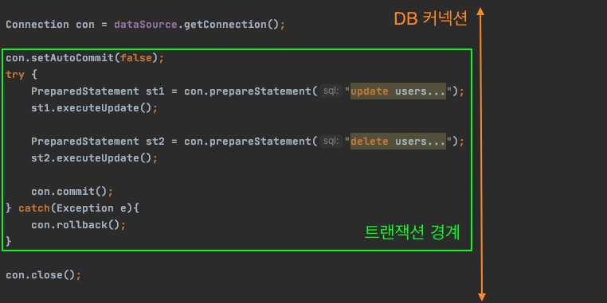
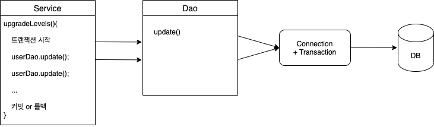
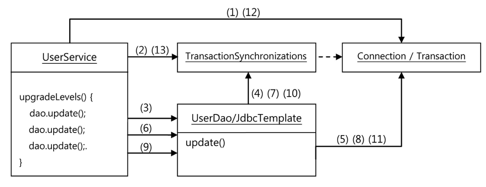
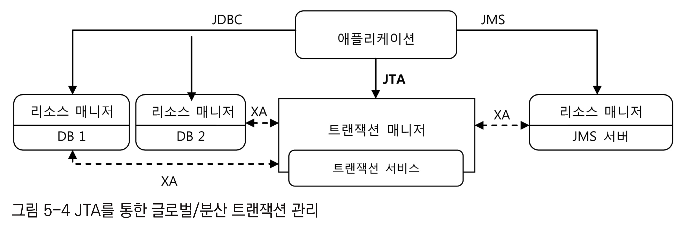
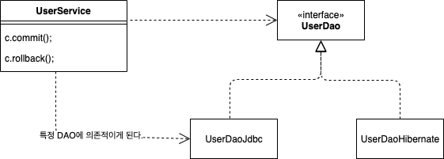
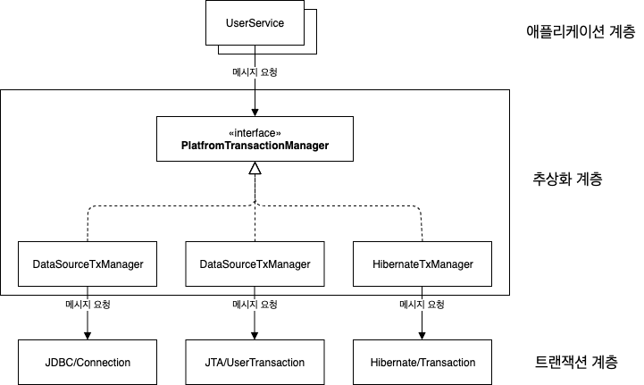

# 목차

<br>

- [목차](#목차)
- [2 트랜잭션 서비스 추상화 - 중요](#2-트랜잭션-서비스-추상화---중요)
  - [2-1 트랜잭션 테스트코드 작성](#2-1-트랜잭션-테스트코드-작성)
  - [2-2 트랜잭션 경계설정 - 가장 중요](#2-2-트랜잭션-경계설정---가장-중요)
  - [2-3 트랜잭션 동기화 - 가장 중요](#2-3-트랜잭션-동기화---가장-중요)
    - [TransactionSynchronizationManager](#transactionsynchronizationmanager)
  - [2-4 스프링의 트랜잭션 서비스 추상화 - 중요](#2-4-스프링의-트랜잭션-서비스-추상화---중요)
    - [JTA](#jta)
    - [기술과 환경에 종속되는 트랜잭션 경계설정 코드 - 중요](#기술과-환경에-종속되는-트랜잭션-경계설정-코드---중요)
    - [트랜잭션 API의 의존관계 문제와 해결책](#트랜잭션-api의-의존관계-문제와-해결책)
    - [스프링의 트랜잭션 서비스 추상화 - PlatfromTransactionManager](#스프링의-트랜잭션-서비스-추상화---platfromtransactionmanager)
    - [트랜잭션 기술 설정의 분리](#트랜잭션-기술-설정의-분리)

<br>

# 2 트랜잭션 서비스 추상화 - 중요

🙋‍♂️ 사용자 레벨 관리의 문제

* 만약 사용자 레벨을 관리하는 도중에 네트워크 에러나 다양한 에러의 의해 시스템이 종료된다면 어떤 사용자는 레벨 업이 되어있고, 어떤 사용자는 안될 수 있다.

이럴때 **트랙잭션**을 사용해서 모든 사용자의 정보를 초기로 돌려놔야한다.

<br>

## 2-1 트랜잭션 테스트코드 작성

🙋‍♂️ 트랜잭션 코드를 작성하기 전에 트랜잭션 테스트를 먼저 만든다.

* 테스트의 로직
  * 5명의 사용자 정보를 DB에 넣고, 업그레이드 작업을 수행하다가 중간에서 예외를 발생시킨다.
  * 그리고 예외가 발생하기 전의 사용자 정보가 변경되었는지 확인.
    * 만약 변경되었다면 테스트는 실패
    * 변경되지 않고 롤백되었다면 테스트는 성공

<br>

**1. 테스트용 UserService 만들기**

🙋‍♂️ 테스트를 위해 기존의`UserService` 로직을 변경할 수 없으니 테스트 코드안에 상속을 통해 `TestUserService` 객체를 하나 만들어준다.

* 우선 `RuntimeException` 을 상속받은 `TestUserServiceException` 예외 클래스를 만들어준다.
* `UserServiceTest` 테스트 코드 안에 `TestUserService` 를 하나 만들어준다. (중요한 것은 테스트 코드 안에 static으로 클래스를 만든다는 것.)
* 새로 만든 두 클래스를 이용해서 테스트를 진행한다.

```java
class UserServiceTest {
    
    ... 기존의 UserSerivce 테스트 코드

    static class TestUserService extends UserService {
        private String id;

        public TestUserService(UserDao userDao, String id) {
            super(userDao);
            this.id = id;
        }

        protected void upgradeLevel(User user) {
            if (user.getId.equals(this.id)) {
                throw new TestUserServiceException();
            }
        }
    }

    static class TestUserServiceException extends RuntimeException {
    }
}
```

<br>

**2. 강제 예외 발생을 통한 테스트**

🙋‍♂️ 테스트의 목적은 레벨 업그레이드를 시도하다가 중간에 예외가 발생했을 경우, 그 전에 업그레이드했던 사용자도 다시 원래 상태로 돌아가는 것을 확인하는 것이다.

```java
@Test
void upgradeAllOrNothing(){
    // 4번째 User의 레벨을 업그레드하는 도중 예외를 발생
    UserService testUserSerivce = new TestUserService(users.get(3).getId());
    testUserSerivce.setUserDao(this.userDao); // 수동 DI

    userDao.deleteAll();
    for(User user : users)
        userDao.add(user);

    // TestUserService는 업그레이드 작업 중에 예외가 발생해야 한다.
    assertThrows(TestUserServiceException.class, () -> {testUserSerivce.upgradeLevels();});

  	// 롤백 테스트
    checkLevelUpgraded(users.get(1), false);
}
// 결과 (롤백 실패)
org.opentest4j.AssertionFailedError: 
Expected :BASIC
Actual   :SILVER
```

* 예외 테스트
  * `assertThrows` 를 통해 예외가 잘 발생했는지 테스트한다.
* 롤백 테스트
  * `checkLevelUpgraded` 를 통해 레벨 변경이 있었던 사용자의 레벨이 처음 상태로 바뀌었나 확인한다.

<br>

🙋‍♂️ **테스트 실패의 이유는 트랜잭션의 롤백이 안되서이다.**

<br>

## 2-2 트랜잭션 경계설정 - 가장 중요

🙋‍♂️ 트랜잭션의 동작

* 커밋 : 여러 개의 SQL을 하나의 트랜잭션으로 처리하는 경우 모든 SQL 수행 작업이 다 성공하고 작업을 확정시키는 동작.
* 롤백 : 여러 개의 SQL을 하나의 트랜잭션으로 처리하는 도중에 에러가 발생하면 모든 SQL의 작업을 취소하는 동작.

<br>

**1. JDBC 트랜잭션 경계설정**

🙋‍♂️ 로컬 트랜잭션 경계

<p align="center"></p>

* 트랜잭션의 시작과 종료는 `JDBC Connection` 을 통해 이루어진다.
  * JDBC의 기본설정은 오토커밋이 켜져있다.(`true`)
* 트랜잭션을 시작하는 방법은 한 가지지만 끝나는 방법은 두 가지다.
  * 트랜잭션의 시작
    * 오토 커밋을 `false` 로 호출
  * 트랜잭션의 종료
    * 커밋 : `con.commit()`
    * 롤백 : `con.rollback()`

> 중요한 점은 일반적으로 트랜잭션은 커넥션보다도 존재 범위가 짧다는 것.

<br>

**2. 트랜잭션의 로직 - 중요**

<p align="center"></p>

* 비즈니스 로직(`Service`)에서 트랜잭션의 시작과 종료를 담당.
  * **여러 SQL문을 하나의 트랜잭션로 묶으르면 하나의 `Connection` 객체 안에서 실행되야 한다.**
* 데이터 액세스 로직은 비즈니스 로직의 요청에 비즈니스 로직에서 넘겨준 `Connection`을 사용하여 SQL을 실행한다.
  * 트랜잭션 동기화를 사용하면 동기화 저장소에서 `Connection` 을 찾는다.

> **위와 같이 구현을 하려면 Service에서 Connection을 만들어서, 매번 DAO에 매개변수로 넘겨줘야하며, JDBCTemplate도 사용하지 못한다.**

<br>

**3. 위와 같은 트랜잭션이 코드에 가져오는 문제 - 중요**

🙋‍♂️ 트랜잭션은 `DAO` 가 아닌 `Service` (비즈니스)로직에 해당하는 작업이다.

트랜잭션이 코드에 가져오는 문제는 다음과 같다.

1. DB 커넥션을 비롯한 리소스의 깔끔한 처리를 가능하게 한 **`JdbcTemplate`을 더이상 사용할 수 없다.**
   * `UserService`에서 `Connection` 을 만들어 `DAO` 에게 넘기므로, `JdbcTemplate`은 더이상 사용이 불가능해진다.
   * 그렇게되면 이번엔  `UserService` 에서 기존의 JDBC 갖는 문제인 `try... catch` 지옥이 재발한다...
2. `DAO` 의 메서드와 비즈니스 로직에 `Connection` 파라미터를 모두 만들어줘야한다.
   * `UserService` 의 메서드마다 `Connection` 을 만들고 모두 넘겨줘야하기 때문.
3. `Connection` 파라미터가 `UserDao` 인터페이스 메서드에 추가되면 `UserDao` 는 더 이상 데이터 액세스 기술에 독립적일 수가 없다.
   * `JPA`는 `Connection` 이 아닌 `EntityManager` 를 쓰기 때문.
   * `add(User user)`에서 `add(Connection con, User user)`로 변경해야 하는데, 데이터 액세스 기술과 독립적으로 사용할 수 없다.
4. `DAO` 메서드에 `Connection` 파라미터를 받게 하면 테스트 코드에도 영향을 끼친다.

<br>

## 2-3 트랜잭션 동기화 - 가장 중요
🙋‍♂️ **트랜잭션으로 인한 코드가 복잡해지는 문제점**을 해결하는 방법은 **동기화**를 사용하는 것이다.

스프링은 **독립적인 트랜잭션 동기화**을 지원한다.

<br>

### TransactionSynchronizationManager

🤔  **트랜잭션 동기화란 - 중요**

* **`UserService`에서 트랜잭션을 시작하기 위해 만든 `Connection` 객체를 특별한 저장소(ThreadLocal)에 보관해두고**
* **이후에 호출되는 `DAO`의 메서드에서 저장된 `Connection` 을 가져다가 사용하게 하는 것이다.**
  * 정확히는 DAO가 사용하는 `JdbcTemplate`이 트랜잭션 동기화 방식을 이용하도록 하는 것.

> **Connection을 저장하는 저장소의 구현체는 ThreadLocal을 상태로 가지고 있는 `TransactionSynchronizationManager`을 사용한다.**

<br>

**1. 트랜잭션 동기화의 작업 흐름**

<p align="center"><br>출처 : 토비의 스프링 vol.1 p.361</p>

1. `UserService`는 `Connection` 을 생성하고
2. 이를 트랜잭션 동기화 저장소에 저장해두고 오토커밋을 `false` 를 하는 동시에 트랜잭션을 시작시킨다.
3. `DAO`의 첫번째 `update()` 를 호출되고, `update()` 내부에서 이용하는 `JdbcTemplate` 는 가장 먼저
4. 트랜잭션 동기화 저장소에 현재 시작된 트랜잭션을 가진 `Connection`가 존재하는지 확인한다. 있다면 가져온다.
5. 가져온 `Connection`을 이용해 SQL을 실행한다. 
   * **트랜잭션 동기화 저장소에서 DB 커넥션을 가져왔을 때는 `JdbcTemplate`가 `Connection.close()`하지 않는다.**
6. 두번째 `update()` 가 호출되면 마찬가지로
7. 트랜잭션 동기화 저장소에서 `Connection` 을 가져와
8. 사용한다. (쿼리를 날린다)
9. 마지막 `update()` 도
10. 같은 `Connection` 을 가져와
11. 사용한다. (쿼리를 날린다)
12. 트랜잭션의 모든 작업이 정상적으로 끝나면 이제 `Connection` 의 `commit()`을 호출해서 트랜잭션을 완료시킨다.
13. 마지막으로 트랜잭션 저장소에서 `Connection` 객체를 제거한다.

> **트랜잭션 동기화 저장소는 작업 스레드마다 독립적으로 `Connection` 객체를 저장하고 관리하기 때문에 다중 사용자를 처리하는 서버의 멀티스레드 환경에서도 충돌 날 염려가 없다.**
> 
> 조금 더 자세히 말하면 트랜잭션 동기화 저장소는 ThreadLocal을 사용하여 `Connection`을 저장하기 때문에 요청별 스레드를 이용하는경우 멀티스레드 환경에서 충돌 날 염려가 없다.

<br>

**2. 트랜잭션 동기화 적용**

🙋‍♂️ `JdbcTemplate`은 트랜잭션 동기화를 지원하는 유틸리티 메서드를 제공한다.

```java
public class UserService {
		...
    private DataSource dataSource;

    @Autowired
    public void setDataSource(DataSource dataSource) {
        this.dataSource = dataSource;
    }

    public void upgradeLevels() throws SQLException {
        // 트랜잭션 동기화 관리자를 이용해 동기화 작업을 초기화한다.
        TransactionSynchronizationManager.initSynchronization();
        // DB 커넥션을 생성하고 트랜잭션을 시작한다.
        Connection con = DataSourceUtils.getConnection(dataSource);
        con.setAutoCommit(false);

        try {
            List<User> users = userDao.getAll();
            for(User user : users){
                if(canUpgradeLevel(user)){
                    upgradeLevel(user);
                }
            }
            con.commit();
        } catch (Exception e){
            con.rollback();
            throw e;
        } finally {
            // 스프링 유틸리지 메서드를 이용해 DB 커넥션을 안전하게 닫는다.
            DataSourceUtils.releaseConnection(con, dataSource);
            // 동기화 작업 종료 및 정리
            TransactionSynchronizationManager.unbindResource(this.dataSource);
            TransactionSynchronizationManager.clearSynchronization();
        }
    }
  	...
}
```
1. **`TransactionSynchronizationManager`: 스프링이 제공하는 트랜잭션 동기화 관리 클래스.**
  * 이 클래스를 이용해 먼저 트랜잭션 동기화 작업을 초기화하도록 요청한다.
  * 즉, **Connection을 담을 ThreadLocal 저장소를 초기화한다.**
2. `DataSourceUtils`: `DataSourceUtils`에서 제공하는 `getConnection()`은 Connection 객체를 생성해줄 뿐만 아니라 트랜잭션 동기화에 사용하도록 저장소에 바인딩해준다. (`DataSource`를 그대로 사용하지 않는 이유이기도 하다.)
  * 즉, Connection 생성뿐만 아니라 생성된 Connection을 트랜잭션 동기화 저장소에 바인딩해준다.

<br>

**3. JdbcTemplate와 트랜잭션 동기화**

🙋‍♂️ `JdbcTemplate`의 동작

* 트랜잭션 저장소에 `Connection`이 있는 경우 && 트랜잭션 동기화를 시작해놓으면
  * 이미 시작된 트랜잭션에 참여만 한다. 생성, 종료엔 일절 관려하지 않는다.
* 트랜잭션 저장소에 `Connection`이 없는 경우
  * 직접 `Connection`을 생성하고 종료하는 일을 모두 담당한다.

<br>

## 2-4 스프링의 트랜잭션 서비스 추상화 - 중요
> 트랜잭션에서 발생하는 문제가 모두 해결된 것 같지만, 이제 시작이라고 한다..

<br>

🙋‍♂️ 트랜잭션의 종류

* 로컬 트랜잭션
  * 하나의 DB로 하나의 트랜잭션만을 동작
    * 로컬은 하나의 DB Connection에 종속적이다.
  * 하나의 DB
* 글로벌 트랜잭션
  * 한 개 이상의 DB로의 작업을 하나의 트랜잭션으로 동작
  * 한 개 이상의 DB

> 위에서 언급한 JDBC 방법으로는 `로컬 트랜잭션`밖에 처리하지 못한다.

<br>

❗️ 글로벌 트랜잭션의 필요성

스프링에서 제공하는 트랜잭션 동기화 (ThreadLocal을 이용한 저장소)로 인해 DB가 변경되어도 Service나 Dao계층 코드 변경이 일어나지 않았다.

이는 트랜잭션 동기화와 `DataSource` 인터페이스를 DI하기 때문에 가능했다. 이러한 방법은 흔히 로컬 트랜잭션이라 부른다.

문제는 이러한 방법은 한 개 이상 DB로의 작업을 하나의 트랜잭션으로 묶어서 처리하는 것이 불가능하다.

> 이유는 로컬 트랜잭션(Connection)은 하나의 DB에 종속적이라, 각 DB마다 Connection을 받아서 하나의 트랜잭션처럼 처리해주어야하는데 이것이 불가능하다.

**해결법으로는 별도의 트랜잭션 관리자를 두는 것이다.** (글로벌 트랜잭션 방식)

글로벌 트랜잭션을 이용하여 여러 개의 DB가 참여하는 작업을 하나의 트랜잭션으로 처리해주는 것이다.

<br>

### JTA
자바는 JDBC 외에도 글로벌 트랜잭션을 지원하기위한 트랜잭션 매니저로 JTA (Java Transaction API)를 제공한다.

<br>

🤔 JTA
* Java Transaction API
* **글로벌 트랜잭션**을 지원하는 트랜잭션 매니저를 지원하기 위한 **API**

<p align="center"><br>출처 : 토비의 스프링 vol.1 p.367</p>

위 그림은 JTA를 이용해 여러 개의 DB 또는 메시징 서버에 대한 트랜잭션에 관리하는 방법을 보여준다.

**애플리케이션 코드에선 기존대로 DB는 JDBC, 메시징 서버는 JMS를 사용하지만, 트랜잭션은 JDBC나 JMS를 이용하지 않고, JTA를 통해 트랜잭션 매니저가 관리하도록 위임한다.**

> 트랜잭션 동기화를 위해서 `TransactionSynchronizationManager`에 위임했던 것처럼 글로벌 트랜잭션을 위해선 JTA에 위임해야한다.

**분리되어 있는 트랜잭션 매니저는 DB와 메시징 서버를 제어하고 관리하는 각각의 리소스 매니저와 XA 프로토콜을 통해 연결된다.**

이를 통해 여러 개의 DB나 메시징 서버에 대한 작업을 하나의 트랜잭션으로 통합하는 글로벌 트랜잭션이 가능해진다.

> 복잡하다.. 일단은 DB가 참여하는 트랜잭션을 만들려면 JTA를 사용해야 한다는 사실만 기억하면 된다.

<br>

🙋‍♂️ JTA 예시 코드

```java
// JNDI를 이용해 서버의 UserTransaction 오브젝트를 가져온다.
InitialContext ctx = new InitialContext();
UserTransaction tx = (UserTransaction)ctx.lookup(USER_TX_JNDI_NAME);

tx.begin();
Connection c = dataSource.getConnection();

try {
  // 데이터 액세스 코드
  tx.commit();
} catch (Exception e) {
  tx.rollback();
  throw e;
} finally {
  c.close();
}
```

JTA를 사용했지만 트랜잭션 경계설정을 위한 구조는 JDBC를 사용했을 때와 비슷하다.

문제는 JTA 방식으로 트랜잭션 관리를 변경했더니 Service 계층의 코드도 변경이 발생했다는 것이다.

<br>

### 기술과 환경에 종속되는 트랜잭션 경계설정 코드 - 중요

❗️ **기술과 환경에 종속되는 트랜잭션 경계설정 코드 - 중요**

**위 코드의 문제는 JDBC 로컬 트랜잭션을 JTA를 이용하는 글로벌 트랜잭션으로 바꾸려면 Service 계층의 코드를 수정해줘야한다는 것이다.**

Service의 코드는 자신의 비즈니스 로직 (핵심 로직)이 변경되지 않았음에도 기술환경에 따라 코드가 바뀌어야하는 문제가 생기는 것이다.

즉, **비즈니스 로직이 아닌 트랜잭션 관리(부가 로직)로인해 Service의 코드 변경이 발생하게 된다.**

> * 로컬 트랜잭션만을 사용해서 JDBC를 이용한다면 `TransactionSynchronizationManager`로 트랜잭션을 처리해야한다.
> * 글로벌 트랜잭션을 사용해서 JTA를 이용한다면 JTA를 통해 트랜잭션을 처리해야한다.

JPA의 구현체인 하이버네이트의 경우는 트랜잭션을 JDBC나 JTA와 또 다른 방식으로 관리한다.

> 심지어 Connection을 직접 사용하지 않고 Session을 이용한다.

돌아버리겠다..; 

쉽게 말해 **데이터 액세스 기술에 따라 트랜잭션 관리 방식이 다르기 때문에 데이터 액세스 기술이 변경되면 Service의 코드도 변경해줘야 한다는 것이다.**

> **`@Transactional`만 붙으면 데이터 액세스 기술이 JDBC든지 JPA든지 JTA든지 트랜잭션을 관리해주는 것이 목표이다. (실제로 스프링은 그렇게 제공한다.)**

<br>

### 트랜잭션 API의 의존관계 문제와 해결책

:scream: 위에서도 언급한 Service 코드가 **트랜잭션 관리로 인해 데이터 액세스 기술에 종속되는 문제는 어떻게 해결할까?? - 문제**

<p align="center"><br></p>

JDBC를 사용하는 경우 위와 같이 `UserService`의 코드가 `UserDaoJdbc`에 의존적이게 된다.

만약 JPA로 데이터 액세스 기술을 변경한다면 `UserService`의 코드는 `UserDaoHibernate`에 의존적이게 변경해야할 것이다.

즉, 데이터 액세스 기술의 트랜잭션 관리가 모두 다르므로, 어떤 데이터 액세스 기술을 사용하느냐에 따라 의존적이게 된다.

> 다르게 말하면, `Service` 는 `DAO` 의 종류에 따라서 트랜잭션 코드가 의존적이게 된다.

**Service의 코드는 핵심 로직 (비즈니스 로직)이 아닌 트랜잭션 (부가 로직)으로 인해 특정 구현체에 의존적이게 되어버린 것이다.**

<br>

🤔  **각기 다른 트랜잭션 구현 방식으로부터  `Service` 와 `DAO` 를 독립하는 방법은 무엇일까? - 해결책**

* 트랜잭션의 경계설정을 담당하는 코드는 일정한 패턴을 갖는 유사한 구조이다. 그러므로 **이들의 공통점을 추상화 시키면 된다.**
  * JDBC도 여러 DB가 SQL문을 사용한다는 공통점을 추상화시킨 것이다.
* **`JDBC`, `JTA`, `Hibernate`, `JPA` 등의 공통적인 특징을 모아 추상화된 트랜잭션 관리 계층을 만드는 것이다.**
  * 그리고 `Service` 에서는 트랜잭션 추상 계층이 제공하는 API를 이용해 트랜잭션을 이용하게 만들어준다면 특정 기술에 종속되지 않는다.

> 해결책은 **각 데이터 액세스 기술에 대한 트랙잭션 관리를 추상화한 트랜잭션 관리 계층을 만드는 것**이다.

<br>

### 스프링의 트랜잭션 서비스 추상화 - PlatfromTransactionManager

**스프링은 트랜잭션 기술의 공통점을 담은 트랜잭션 추상화 기술을 제공하고 있다.**

이는 각 기술의 트랜잭션 API를 이용하지 않고도, 일관된 방식으로 트랜잭션을 제어하는 트랜잭션 경계설정 작업이 가능해진다.

<p align="center"> </p>

**스프링이 제공하는 트랜잭션 추상 인터페이스는 `PlatformTransactionManager` 다!**

즉, 스프링에서 제공하는 트랜잭션 경계설정을 위한 추상 인터페이스가 바로 `PlatformTransactionManager`이다.

> JDBC의 로컬 트랜잭션을 이용한다면 `DataSourceTransactionManager`를 이용하면 된다.

<br>

```java
public void upgradeLevels() {
  PlatformTransactionManager transactionManager = 
    new DataSourceTransactionManager(dataSourse); // JDBC 트랜잭션 추상 객체 생성
  
  TransactionStatus status = 
    transactionManager.getTransaction(new DefaultTransactionDefinition());
  
  try {
    ... 트랜잭션 작업
      
    transactionManager.commit(status); // 커밋
  } catch (RuntimeException e){
    transactionManager.rollback(status); // 롤백
    throw e;
  }
}
```
* `getTransaction()`: 메서드를 호출하기만 하면 필요에 따라 DB 커넥션을 가져오는 작업도 같이 수행해준다.
  * 여기서 가져온다는 의미는 트랜잭션을 시작한다는 의미이다.
* `DefaultTransactionDefinition`: 트랜잭션에 대한 속성을 담고 있다.
* `TransactionStatus`: 시작된 트랜잭션은 이 타입의 변수에 저장된다.
  * 트랜잭션에 대한 조작이 필요할 때 `PlatformTransactionManager`메서드의 파라미터로 전달해주면 된다.

드디어.. 트랜잭션 경계 설정에 대한 로직을 Service, Dao와 분리시킬 수 있게 되었다.

<br>

### 트랜잭션 기술 설정의 분리

🤔 만약 `UserService`코드를 JTA를 이용하는 글로벌 트랜잭션으로 변경하려면?

```java
PlatformTransactionManager txManager = new JTATransactionManager();
```
위 코드처럼 변경만 해주면 된다. (하이버네이트, JPA등도 객체만 수정해주면 된다.)

<br>

:scream: 하지만 위 코드는 `UserService`가 어떤 구체 클래스에 의존하고 있는지 알게된다. -> DI 원칙에 위배된다

* 이 문제를 해결하는 방법은 `PlatformTransactionManager`의 구현체를 빈으로 등록하고, 외부에서 의존성을 주입해주도록 수정하면 된다.
  * `PlatformTransactionManager`의 모든 메서드는 싱글톤으로 사용이 가능하다고 한다. 그러므로 빈으로 등록해도 아무런 문제가 없다.
* 그럼 `UserService`의 코드 변경 필요없이, 어떤 의존성이 주입되느냐에 따라 다른 트랜잭션 매니저를 사용할 수 있게 된다.

> `PlatformTransactionManager`는 DI할 때 관례적으로 `transactionManager`라는 이름을 사용한다고 한다.

> `PlatformTransactionManager`라는 이름은 JTA의 `TransactionManager` 인터페이스와 혼동되지 않도록 하기 위해 했을 뿐 다른 의미는 없다고 한다.

<br>

👍 이제 Service코드에 `DataSource`를 지우고, `PlatformTransactionManager`만 DI 받으면 된다.

```java
public class UserService {
    private PlatformTransactionManager transactionManager;

    public UserService(PlatformTransactionManager transactionManager) {
        this.transactionManager = transactionManager
    }

    public void upgradeLevels() {
        // DI 받은 트랜잭션 매니저는 멀티스레드 환경에서도 안전하다고 한다. 이렇게 공유해도 문제 없음.
        TransactionStatus status = transactionManager.getTransaction(new DefaultTransactionDefinition());
  
        try {
          ... 트랜잭션 작업
            
          transactionManager.commit(status); // 커밋
        } catch (RuntimeException e){
          transactionManager.rollback(status); // 롤백
          throw e;
        }
    }
}
```

이제 `PlatformTransactionManager`를 DI 해줄때, 내부에 `DataSource`를 주입해주면 된다.

```java
@Configuration
public class AppConfiguration {

    ...

    @Bean
    public PlatformTransactionManager platformTransactionManager() {
        return new DataSourceTransactionManager(dataSource());
    }

    ...
}
```

결국은 코드의 수정이 아닌 의존성의 수정만으로 데이터 액세스 기술의 트랜잭션 경계 설정을 변경할 수 있게 되었다.

왜 스프링을 이해하려면 객체지향을 이해하는 것이 도움이 많이 되는지 또 한번 느끼게된다.

